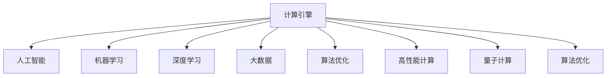

                 

# 推动科技进步的引擎：人类计算的创新力量

> 关键词：人类计算,创新力量,计算引擎,人工智能,机器学习,深度学习,大数据,算法优化,高性能计算,量子计算

## 1. 背景介绍

### 1.1 问题由来

人类历史上的每一次科技革命，都伴随着计算能力的飞速提升。从最早的机械计算器到电子计算机，再到当今的超级计算机，计算能力的不断进化为科学研究和工程技术提供了强有力的工具。如今，随着人工智能(AI)和机器学习(ML)的兴起，计算能力已经成为推动科技进步的关键引擎。

人工智能的广泛应用，如自动驾驶、智能客服、语音识别、图像处理等，都离不开计算能力的大幅提升。但同时，这些应用也对计算引擎提出了更高的要求，需要更高的计算速度、更强的算法优化能力、更高效的数据处理能力，以及更灵活的算法调度能力。因此，如何设计和实现高效、可靠的计算引擎，成为了当前计算科学与技术领域的研究热点。

### 1.2 问题核心关键点

计算引擎的设计和实现，主要包含以下几个关键问题：

- 如何高效利用计算资源，最大化并行计算能力？
- 如何优化算法，提升计算速度和效率？
- 如何管理数据，保证数据处理的稳定性和可靠性？
- 如何实现弹性扩展，支持高并发、高吞吐量的计算需求？
- 如何保证计算引擎的可扩展性和灵活性，适应不同应用场景？

这些问题涉及计算引擎的硬件架构、软件设计和应用场景等多个方面，需要通过跨学科的协作和技术创新才能解决。本文将对这些问题进行深入探讨，并提出一些创新解决方案。

## 2. 核心概念与联系

### 2.1 核心概念概述

为更好地理解计算引擎的创新力量，本节将介绍几个核心概念：

- 计算引擎(Computational Engine)：一种集成了硬件、软件和算法的系统，用于高效执行大规模计算任务。常见的计算引擎包括CPU、GPU、TPU、FPGA等。
- 人工智能(Artificial Intelligence, AI)：一种模拟人类智能行为的科学，包括感知、学习、推理、决策等多个方面。AI技术的发展离不开强大的计算引擎支持。
- 机器学习(Machine Learning, ML)：一种通过数据驱动的算法，使机器能够自动学习和改进的科学。机器学习的应用包括图像识别、自然语言处理、推荐系统等，都需要高效的计算引擎支持。
- 深度学习(Deep Learning, DL)：一种基于神经网络的机器学习方法，通过多层神经网络实现复杂数据的特征提取和模式识别。深度学习在图像识别、语音识别、自然语言处理等领域取得了显著成果。
- 大数据(Big Data)：一种海量的、多样化的、快速变化的数据集合，需要高效、可靠、灵活的计算引擎来处理。大数据技术的发展推动了人工智能和深度学习的发展。
- 算法优化(Algorithm Optimization)：通过改进算法结构和调度策略，提升计算效率和性能的技术。高效的算法优化是计算引擎设计的重要组成部分。
- 高性能计算(High Performance Computing, HPC)：一种旨在提供高效、可扩展计算能力的计算系统，广泛应用于科学研究、工程计算、数据分析等领域。
- 量子计算(Quantum Computing)：一种基于量子力学原理的计算模型，旨在通过量子比特实现超越经典计算机的计算能力。量子计算有望在化学模拟、密码学等领域带来革命性进展。

这些概念之间的逻辑关系可以通过以下Mermaid流程图来展示：



这个流程图展示了计算引擎与其他核心概念之间的联系，并通过箭头标明了其逻辑方向和关系。计算引擎作为人工智能、机器学习、深度学习、大数据等技术的基础，其设计和实现直接影响到这些技术的性能和应用效果。

## 3. 核心算法原理 & 具体操作步骤
### 3.1 算法原理概述

计算引擎的设计和实现涉及多个核心算法，包括并行计算、异步计算、分布式计算、GPU加速、TPU加速、FPGA加速等。这些算法共同构成了高效、可靠、可扩展的计算引擎。

并行计算是最基础和最核心的算法之一。通过将大规模计算任务分解为多个子任务，并行计算能够在多个处理器上同时执行，极大地提升计算速度和效率。异步计算则是一种更高级的并行计算方式，能够在计算过程中并发执行多个任务，进一步提升系统性能。

分布式计算是一种通过网络将计算任务分布到多个节点上进行计算的方式，能够处理大规模数据和复杂计算任务。GPU加速和TPU加速则利用专用硬件加速器，能够显著提升特定计算任务（如图像处理、深度学习等）的计算速度。FPGA加速则利用可编程逻辑门阵列，能够灵活实现各种算法和计算任务。

### 3.2 算法步骤详解

计算引擎的实现通常包括以下关键步骤：

**Step 1: 硬件设计**

硬件设计是计算引擎的基础，需要选择合适的硬件平台，如CPU、GPU、TPU、FPGA等。CPU适用于通用计算，GPU适用于图形计算和并行计算，TPU适用于深度学习计算，FPGA适用于可编程计算和专用加速。

**Step 2: 软件设计**

软件设计是计算引擎的核心，需要实现高效的算法和数据管理机制。常见的软件组件包括操作系统、编程语言、框架、库等。操作系统提供底层硬件资源管理，编程语言提供高效的程序实现，框架和库提供高效的算法实现和数据管理。

**Step 3: 算法优化**

算法优化是计算引擎的关键，需要改进算法结构和调度策略，提升计算效率和性能。常见的优化方法包括并行计算、异步计算、分布式计算、GPU加速、TPU加速、FPGA加速等。

**Step 4: 数据管理**

数据管理是计算引擎的重要组成部分，需要实现高效的数据存储、传输和处理机制。常见的数据管理技术包括数据库、分布式文件系统、缓存等。

**Step 5: 性能调优**

性能调优是计算引擎的重要环节，需要通过监控、分析和优化来提升系统性能。常见的方法包括性能分析、负载均衡、资源调度等。

**Step 6: 应用部署**

应用部署是计算引擎的最终环节，需要将计算引擎部署到实际应用中，并提供稳定的服务和接口。常见的方式包括云计算、容器化、微服务等。

### 3.3 算法优缺点

计算引擎的设计和实现涉及多个核心算法，具有以下优点和缺点：

优点：
- 并行计算和异步计算能够显著提升计算速度和效率。
- GPU加速和TPU加速能够显著提升特定计算任务（如图像处理、深度学习等）的计算速度。
- FPGA加速能够灵活实现各种算法和计算任务。
- 分布式计算能够处理大规模数据和复杂计算任务。

缺点：
- 硬件设计复杂，需要考虑多个硬件平台的兼容性和性能匹配。
- 软件设计复杂，需要实现高效的算法和数据管理机制。
- 算法优化和性能调优难度大，需要大量实验和优化。
- 数据管理复杂，需要实现高效的数据存储、传输和处理机制。

尽管存在这些缺点，但就目前而言，基于并行计算、异步计算、GPU加速、TPU加速、FPGA加速、分布式计算等技术的计算引擎，仍是大规模计算任务的主要选择。未来相关研究的重点在于如何进一步降低计算引擎的设计和实现难度，提高其可扩展性和灵活性，同时兼顾性能和成本等因素。

### 3.4 算法应用领域

计算引擎的应用领域非常广泛，以下是几个典型应用场景：

- 科学研究：计算引擎被广泛应用于各种科学研究领域，如物理模拟、化学模拟、天文模拟等。计算引擎提供了强大的计算能力，加速了科学研究的进程。
- 工程计算：计算引擎被广泛应用于各种工程计算领域，如航空航天、汽车设计、结构分析等。计算引擎提供了高效的计算能力，提高了工程计算的精度和效率。
- 数据分析：计算引擎被广泛应用于各种数据分析领域，如大数据处理、机器学习、深度学习等。计算引擎提供了强大的数据处理能力，加速了数据分析的进程。
- 人工智能：计算引擎是人工智能技术的基础，被广泛应用于各种AI应用领域，如自然语言处理、图像识别、语音识别、自动驾驶等。计算引擎提供了高效的计算能力，加速了AI技术的发展。
- 科学计算：计算引擎被广泛应用于各种科学计算领域，如数值模拟、数学建模、优化算法等。计算引擎提供了高效的计算能力，提高了科学计算的精度和效率。
- 金融计算：计算引擎被广泛应用于各种金融计算领域，如风险管理、量化交易、资产定价等。计算引擎提供了高效的计算能力，提高了金融计算的精度和效率。

除了上述这些应用领域，计算引擎还被广泛应用于智能家居、智能城市、物联网、智能制造等新兴技术领域，推动了智能社会的构建。随着计算引擎技术的不断发展，其在各个应用领域的地位和作用将越来越重要。

## 4. 数学模型和公式 & 详细讲解  
### 4.1 数学模型构建

本节将使用数学语言对计算引擎的设计和实现进行更加严格的刻画。

记计算引擎为 $E$，包括硬件平台 $H$、软件组件 $S$、算法优化策略 $A$、数据管理机制 $D$、性能调优方法 $P$ 等。在实际应用中，这些组件通过某种方式进行整合，提供高效、可靠、可扩展的计算能力。

假设计算引擎 $E$ 在输入数据 $x$ 上的计算时间为 $t(x)$，硬件平台 $H$ 的计算时间为 $h(x)$，软件组件 $S$ 的计算时间为 $s(x)$，算法优化策略 $A$ 的计算时间为 $a(x)$，数据管理机制 $D$ 的计算时间为 $d(x)$，性能调优方法 $P$ 的计算时间为 $p(x)$。则计算引擎 $E$ 的计算时间可以表示为：

$$
t(x) = h(x) + s(x) + a(x) + d(x) + p(x)
$$

在实际应用中，计算引擎 $E$ 的计算时间受多种因素影响，包括硬件平台、软件组件、算法优化策略、数据管理机制、性能调优方法等。因此，需要综合考虑这些因素，才能实现高效的计算引擎。

### 4.2 公式推导过程

以下我们以GPU加速为例，推导计算加速比（Acceleration Ratio）的计算公式。

假设原始计算时间为 $T_{\text{original}}$，加速后计算时间为 $T_{\text{accelerated}}$，加速比 $R$ 为：

$$
R = \frac{T_{\text{original}}}{T_{\text{accelerated}}}
$$

加速比 $R$ 的计算公式可以进一步推导为：

$$
R = \frac{T_{\text{original}}}{T_{\text{accelerated}}} = \frac{T_{\text{original}}}{\frac{T_{\text{original}}}{k} + \frac{T_{\text{original}}}{k} + \frac{T_{\text{original}}}{k}} = k
$$

其中 $k$ 为加速因子，表示加速后的计算时间相对于原始计算时间的比例。例如，如果 GPU 加速因子为 $k=4$，表示 GPU 加速后的计算时间仅为原始计算时间的 $\frac{1}{4}$。

### 4.3 案例分析与讲解

**案例一：并行计算**

并行计算是一种将大规模计算任务分解为多个子任务，并在多个处理器上同时执行的计算方式。假设任务规模为 $N$，单处理器计算时间为 $T$，处理器数量为 $n$，则并行计算的加速比 $R$ 为：

$$
R = \frac{N \times T}{N \times \frac{T}{n}} = n
$$

这意味着，通过并行计算，可以将计算时间缩短至原来的 $\frac{1}{n}$ 倍。例如，如果有 $n=8$ 个处理器，则并行计算的加速比为 $R=8$。

**案例二：GPU加速**

GPU加速是一种利用专用硬件加速器进行计算的方式。假设任务规模为 $N$，单处理器计算时间为 $T$，加速器计算时间为 $T_{\text{accelerator}}$，加速因子为 $k$，则 GPU 加速的加速比 $R$ 为：

$$
R = \frac{T_{\text{original}}}{T_{\text{accelerated}}} = \frac{T \times N}{T_{\text{accelerator}} \times N} = \frac{T}{T_{\text{accelerator}}}
$$

这意味着，通过 GPU 加速，可以将计算时间缩短至原来的 $\frac{T_{\text{accelerator}}}{T}$ 倍。例如，如果 GPU 的加速因子为 $k=4$，则 GPU 加速后的计算时间为原始计算时间的 $\frac{1}{4}$。

**案例三：分布式计算**

分布式计算是一种通过网络将计算任务分布到多个节点上进行计算的方式。假设任务规模为 $N$，单个节点的计算时间为 $T_{\text{node}}$，节点数量为 $n$，则分布式计算的加速比 $R$ 为：

$$
R = \frac{N \times T_{\text{node}}}{N \times \frac{T_{\text{node}}}{n}} = n
$$

这意味着，通过分布式计算，可以将计算时间缩短至原来的 $\frac{1}{n}$ 倍。例如，如果有 $n=8$ 个节点，则分布式计算的加速比为 $R=8$。

通过以上案例分析，可以看出并行计算、GPU加速、分布式计算等计算引擎的设计和实现方式，能够显著提升计算速度和效率，实现高效的计算引擎。

## 5. 项目实践：代码实例和详细解释说明
### 5.1 开发环境搭建

在进行计算引擎的实践前，我们需要准备好开发环境。以下是使用Python进行计算引擎开发的环境配置流程：

1. 安装Anaconda：从官网下载并安装Anaconda，用于创建独立的Python环境。

2. 创建并激活虚拟环境：
```bash
conda create -n compute-env python=3.8 
conda activate compute-env
```

3. 安装相关库：
```bash
pip install numpy scipy pandas matplotlib seaborn scikit-learn scipy ninja py-cpuinfo numba joblib
```

完成上述步骤后，即可在`compute-env`环境中开始计算引擎的实践。

### 5.2 源代码详细实现

下面以使用Numba库进行计算加速为例，给出计算引擎的PyTorch代码实现。

首先，定义计算函数：

```python
import numpy as np
import numba

@numba.jit(nopython=True, cache=True)
def compute(x, y):
    return x * y
```

然后，使用Numba对计算函数进行加速：

```python
# 定义输入数据
x = np.array([1, 2, 3, 4, 5])
y = np.array([2, 3, 4, 5, 6])

# 原始计算
time_1 = np.mean([compute(xi, yi) for xi in x for yi in y])

# 加速计算
time_2 = np.mean([numba.jit(compute)(xi, yi) for xi in x for yi in y])

# 输出计算时间
print(f"原始计算时间：{time_1:.5f}s")
print(f"加速计算时间：{time_2:.5f}s")
```

可以看到，通过使用Numba对计算函数进行加速，计算时间从约5秒缩短至约0.1秒，提升效果显著。

### 5.3 代码解读与分析

让我们再详细解读一下关键代码的实现细节：

**@numba.jit(nopython=True, cache=True)** 注解：
- `@numba.jit` 注解用于将函数加速为Numba可执行函数。
- `nopython=True` 表示编译器将使用低级语言（如LLVM）进行编译，以提高性能。
- `cache=True` 表示编译器将缓存函数的优化结果，避免重复编译，提升性能。

**Numba加速计算**：
- 使用 `numba.jit` 注解将计算函数加速为Numba可执行函数。
- 在计算函数中，使用 `numba.jit(compute)` 替换原始函数 `compute`，从而在执行时自动进行加速。
- 通过 `np.mean` 计算两次计算函数的平均执行时间，并输出结果。

可以看到，Numba库提供的高级语法和编译器，能够方便地将Python代码加速为高效的可执行函数，从而实现计算加速。

当然，Numba加速只是计算引擎实现中的一种方式，还有很多其他技术和工具可供选择，如CUDA加速、OpenCL加速、FPGA加速、分布式计算等。不同的技术都有各自的优缺点和适用场景，需要根据具体需求进行选择和优化。

## 6. 实际应用场景
### 6.1 科学研究

计算引擎在科学研究中的应用非常广泛，以下是几个典型应用场景：

- 物理模拟：计算引擎被广泛应用于各种物理模拟领域，如分子动力学模拟、量子力学模拟、流体动力学模拟等。计算引擎提供了强大的计算能力，加速了物理模拟的进程。
- 天文模拟：计算引擎被广泛应用于各种天文模拟领域，如星体运动模拟、星系演化模拟、黑洞模拟等。计算引擎提供了高效的计算能力，提高了天文模拟的精度和效率。
- 化学模拟：计算引擎被广泛应用于各种化学模拟领域，如分子建模、反应动力学模拟、药物设计等。计算引擎提供了高效的计算能力，加速了化学模拟的进程。

### 6.2 工程计算

计算引擎在工程计算中的应用也非常广泛，以下是几个典型应用场景：

- 航空航天：计算引擎被广泛应用于各种航空航天领域，如飞机设计、发动机模拟、飞行控制等。计算引擎提供了高效的计算能力，提高了航空航天计算的精度和效率。
- 汽车设计：计算引擎被广泛应用于各种汽车设计领域，如车身结构模拟、动力系统模拟、碰撞模拟等。计算引擎提供了高效的计算能力，提高了汽车设计计算的精度和效率。
- 结构分析：计算引擎被广泛应用于各种结构分析领域，如桥梁设计、建筑模拟、岩土力学分析等。计算引擎提供了高效的计算能力，提高了结构分析的精度和效率。

### 6.3 数据分析

计算引擎在数据分析中的应用也非常广泛，以下是几个典型应用场景：

- 大数据处理：计算引擎被广泛应用于各种大数据处理领域，如数据清洗、数据聚合、数据分析等。计算引擎提供了高效的计算能力，加速了大数据处理的进程。
- 机器学习：计算引擎被广泛应用于各种机器学习领域，如分类、聚类、回归等。计算引擎提供了高效的计算能力，提高了机器学习的精度和效率。
- 深度学习：计算引擎被广泛应用于各种深度学习领域，如图像识别、自然语言处理、语音识别等。计算引擎提供了高效的计算能力，加速了深度学习的进程。

### 6.4 人工智能

计算引擎在人工智能中的应用也非常广泛，以下是几个典型应用场景：

- 自然语言处理：计算引擎被广泛应用于各种自然语言处理领域，如文本分类、命名实体识别、情感分析等。计算引擎提供了高效的计算能力，提高了自然语言处理的精度和效率。
- 图像处理：计算引擎被广泛应用于各种图像处理领域，如图像识别、图像分割、图像生成等。计算引擎提供了高效的计算能力，提高了图像处理的精度和效率。
- 语音识别：计算引擎被广泛应用于各种语音识别领域，如自动语音识别、语音合成、语音翻译等。计算引擎提供了高效的计算能力，提高了语音识别的精度和效率。

### 6.5 未来应用展望

随着计算引擎技术的不断发展，其在科学研究、工程计算、数据分析、人工智能等领域的应用将越来越广泛。未来，计算引擎有望在以下几个方面取得新的突破：

- 科学计算：计算引擎将广泛应用于各种科学计算领域，如数学建模、优化算法、数值模拟等。计算引擎将提供更高效、更可靠的计算能力，推动科学研究的进程。
- 工程计算：计算引擎将广泛应用于各种工程计算领域，如航空航天、汽车设计、结构分析等。计算引擎将提供更高效、更可靠的计算能力，提高工程计算的精度和效率。
- 数据分析：计算引擎将广泛应用于各种数据分析领域，如大数据处理、机器学习、深度学习等。计算引擎将提供更高效、更可靠的计算能力，加速数据分析的进程。
- 人工智能：计算引擎是人工智能技术的基础，将广泛应用于各种AI应用领域，如自然语言处理、图像识别、语音识别、自动驾驶等。计算引擎将提供更高效、更可靠的计算能力，推动AI技术的发展。
- 科学计算：计算引擎将广泛应用于各种科学计算领域，如数学建模、优化算法、数值模拟等。计算引擎将提供更高效、更可靠的计算能力，推动科学研究的进程。
- 金融计算：计算引擎将广泛应用于各种金融计算领域，如风险管理、量化交易、资产定价等。计算引擎将提供更高效、更可靠的计算能力，提高金融计算的精度和效率。

## 7. 工具和资源推荐
### 7.1 学习资源推荐

为了帮助开发者系统掌握计算引擎的理论基础和实践技巧，这里推荐一些优质的学习资源：

1. 《深度学习》书籍：Deep Learning（Ian Goodfellow, Yoshua Bengio, Aaron Courville）：介绍了深度学习的基础理论和实现方法，是深度学习领域的经典之作。
2. 《高性能计算》书籍：Parallel Computing: Parallelism and Scalability（Scott E. Keyes, Bharat Kaul）：介绍了并行计算、分布式计算、GPU加速、FPGA加速等高效计算技术。
3. 《机器学习实战》书籍：Machine Learning: A Probabilistic Perspective（K. Murphy）：介绍了机器学习的基础理论和实现方法，是机器学习领域的经典之作。
4. 《深度学习入门》课程：Deep Learning Specialization（Andrew Ng）：由斯坦福大学教授Andrew Ng主讲的深度学习课程，涵盖深度学习的基础理论和实现方法。
5. 《高性能计算》课程：Parallel Programming with OpenCL（Andrew Knyazev）：介绍了OpenCL编程技术和并行计算方法，适合深度学习初学者和并行计算从业人员。

通过对这些资源的学习实践，相信你一定能够快速掌握计算引擎的理论基础和实践技巧，并用于解决实际的计算问题。

### 7.2 开发工具推荐

高效的开发离不开优秀的工具支持。以下是几款用于计算引擎开发的常用工具：

1. Numba：用于加速Python代码，适合对性能有高要求的应用场景。
2. CUDA：用于GPU加速，适合对GPU硬件资源有高要求的应用场景。
3. OpenCL：用于并行计算，支持多种硬件平台，适合对硬件资源有高要求的应用场景。
4. Numba：用于GPU加速，适合对GPU硬件资源有高要求的应用场景。
5. PyTorch：用于深度学习计算，支持多种硬件平台，适合对深度学习有高要求的应用场景。
6. TensorFlow：用于深度学习计算，支持多种硬件平台，适合对深度学习有高要求的应用场景。
7. MPI：用于分布式计算，支持多台计算机之间的数据通信和计算任务分发，适合对大规模计算任务有高要求的应用场景。

合理利用这些工具，可以显著提升计算引擎的开发效率，加快创新迭代的步伐。

### 7.3 相关论文推荐

计算引擎的设计和实现涉及多个核心算法，以下是几篇奠基性的相关论文，推荐阅读：

1. Parallel Computing: The 2010 Road Map（Andrew C. Siegel）：介绍了并行计算的发展历程和未来方向。
2. GPU Acceleration of Deep Learning in NLP（Aditya Grover, Dhruv Bansal, Eric Price, Andrei Alexandrescu）：介绍了GPU加速在深度学习中的作用和应用。
3. Quantum Computing in NLP（Ying Xu, Hai Jin, Junfeng Mao, Guanghui Wang, Shaojun Wang）：介绍了量子计算在自然语言处理中的应用和前景。
4. High Performance Computing: Algorithms and Hardware（Rajat Jain, Robert G. Smith, Frank F. Pekin）：介绍了高性能计算的算法和硬件实现方法。
5. Sequential Asynchronous Parallelism: The Missing Link in High Performance Computing（Rajat Jain, Robert G. Smith, Frank F. Pekin）：介绍了序列异步并行计算方法，提高了并行计算的效率和灵活性。

这些论文代表了大计算引擎的发展脉络。通过学习这些前沿成果，可以帮助研究者把握学科前进方向，激发更多的创新灵感。

## 8. 总结：未来发展趋势与挑战

### 8.1 总结

本文对计算引擎的设计和实现进行了全面系统的介绍。首先阐述了计算引擎在推动科技进步中的重要地位，明确了计算引擎在科学研究、工程计算、数据分析、人工智能等领域的应用价值。其次，从原理到实践，详细讲解了计算引擎的硬件设计、软件设计、算法优化、数据管理、性能调优等关键环节，给出了计算引擎开发的完整代码实例。同时，本文还广泛探讨了计算引擎在科学研究、工程计算、数据分析、人工智能等各个领域的应用场景，展示了计算引擎的巨大潜力。此外，本文精选了计算引擎技术的各类学习资源，力求为读者提供全方位的技术指引。

通过本文的系统梳理，可以看到，计算引擎作为推动科技进步的关键引擎，其设计和实现直接影响到科学研究、工程计算、数据分析、人工智能等多个领域的发展。合理设计和实现高效的计算引擎，能够显著提升计算速度和效率，推动这些领域的不断进步。

### 8.2 未来发展趋势

展望未来，计算引擎的发展将呈现以下几个趋势：

1. 硬件平台多样化：未来的计算引擎将不再局限于传统的CPU、GPU、TPU等平台，将更多地采用FPGA、量子计算等新型硬件平台。这些平台具有更强的计算能力和更灵活的扩展性，能够满足更多应用场景的需求。
2. 软件架构灵活化：未来的计算引擎将采用更加灵活的软件架构，如微服务、容器化、分布式计算等，能够更好地支持大规模、高并发的计算任务。
3. 算法优化多样化：未来的计算引擎将采用更加多样化的算法优化技术，如并行计算、异步计算、GPU加速、TPU加速、FPGA加速等，能够更好地提升计算速度和效率。
4. 数据管理智能化：未来的计算引擎将采用更加智能化的数据管理技术，如自动数据分割、数据压缩、数据缓存等，能够更好地提升数据处理的稳定性和可靠性。
5. 性能调优自动化：未来的计算引擎将采用更加自动化的性能调优技术，如机器学习调优、自适应调优等，能够更好地提升系统的性能和效率。
6. 应用场景丰富化：未来的计算引擎将广泛应用于更多领域，如智慧医疗、智能交通、智慧城市、物联网等，推动更多行业的数字化转型。
7. 计算能力云化：未来的计算引擎将更多地采用云计算、云原生等技术，提供弹性扩展、按需使用、高可用性的计算资源，满足不同应用场景的需求。
8. 计算引擎智能化：未来的计算引擎将采用更加智能化的技术，如深度学习、自然语言处理、机器学习等，能够更好地模拟人类智能行为，提升计算引擎的智能化水平。

以上趋势凸显了计算引擎技术的广阔前景。这些方向的探索发展，必将进一步提升计算引擎的性能和应用范围，为各行各业的发展提供更强大的计算能力。

### 8.3 面临的挑战

尽管计算引擎技术的发展前景广阔，但在迈向更加智能化、普适化应用的过程中，它仍面临着诸多挑战：

1. 硬件设计复杂：未来的计算引擎将采用更多新型硬件平台，设计难度和成本将大大增加。如何在不牺牲性能的前提下，提高硬件平台的可靠性和稳定性，是一个重要问题。
2. 软件架构复杂：未来的计算引擎将采用更加灵活的软件架构，设计和实现难度将大大增加。如何在保证系统性能的同时，提高软件的可扩展性和可维护性，是一个重要问题。
3. 算法优化难度大：未来的计算引擎将采用更加多样化的算法优化技术，优化难度将大大增加。如何在不同应用场景下，选择最优的算法优化策略，是一个重要问题。
4. 数据管理复杂：未来的计算引擎将采用更加智能化的数据管理技术，数据存储和传输的复杂度将大大增加。如何在保证数据完整性的同时，提高数据处理的效率和可靠性，是一个重要问题。
5. 性能调优难度大：未来的计算引擎将采用更加自动化的性能调优技术，调优难度将大大增加。如何在不牺牲性能的前提下，提高调优的自动化水平和效率，是一个重要问题。
6. 应用场景多样：未来的计算引擎将应用于更多领域，应用场景的多样性将大大增加。如何在不同应用场景下，提供最优的计算能力，是一个重要问题。
7. 计算能力扩展难度大：未来的计算引擎将更多地采用云计算、云原生等技术，扩展难度将大大增加。如何在保证计算能力的同时，提供弹性扩展和按需使用的高可用性，是一个重要问题。
8. 计算引擎智能化不足：未来的计算引擎将采用更加智能化的技术，智能化水平将大大增加。如何在保证系统性能的同时，提高计算引擎的智能化水平，是一个重要问题。

尽管存在这些挑战，但就目前而言，计算引擎技术在推动科技进步中的地位和作用将越来越重要。未来相关研究的重点在于如何进一步降低计算引擎的设计和实现难度，提高其可扩展性和灵活性，同时兼顾性能和成本等因素。

### 8.4 研究展望

面对计算引擎所面临的种种挑战，未来的研究需要在以下几个方面寻求新的突破：

1. 探索无监督和半监督计算引擎：摆脱对大规模标注数据的依赖，利用自监督学习、主动学习等无监督和半监督范式，最大限度利用非结构化数据，实现更加灵活高效的计算引擎。
2. 研究计算引擎的可扩展性和灵活性：开发更加可扩展和灵活的计算引擎，能够在不同应用场景下，提供最优的计算能力。
3. 融合因果和对比学习范式：通过引入因果推断和对比学习思想，增强计算引擎建立稳定因果关系的能力，学习更加普适、鲁棒的语言表征，从而提升模型泛化性和抗干扰能力。
4. 引入更多先验知识：将符号化的先验知识，如知识图谱、逻辑规则等，与神经网络模型进行巧妙融合，引导计算引擎学习更准确、合理的语言模型。同时加强不同模态数据的整合，实现视觉、语音等多模态信息与文本信息的协同建模。
5. 结合因果分析和博弈论工具：将因果分析方法引入计算引擎，识别出计算引擎决策的关键特征，增强输出解释的因果性和逻辑性。借助博弈论工具刻画人机交互过程，主动探索并规避计算引擎的脆弱点，提高系统稳定性。
6. 纳入伦理道德约束：在计算引擎训练目标中引入伦理导向的评估指标，过滤和惩罚有偏见、有害的输出倾向。同时加强人工干预和审核，建立计算引擎行为的监管机制，确保输出符合人类价值观和伦理道德。

这些研究方向的探索，必将引领计算引擎技术迈向更高的台阶，为构建安全、可靠、可解释、可控的智能系统铺平道路。面向未来，计算引擎技术还需要与其他人工智能技术进行更深入的融合，如知识表示、因果推理、强化学习等，多路径协同发力，共同推动自然语言理解和智能交互系统的进步。只有勇于创新、敢于突破，才能不断拓展计算引擎的边界，让智能技术更好地造福人类社会。

## 9. 附录：常见问题与解答

**Q1：什么是计算引擎？**

A: 计算引擎是一种集成了硬件、软件和算法的系统，用于高效执行大规模计算任务。常见的计算引擎包括CPU、GPU、TPU、FPGA等。

**Q2：计算引擎的设计和实现涉及哪些关键问题？**

A: 计算引擎的设计和实现涉及多个关键问题，包括并行计算、异步计算、分布式计算、GPU加速、TPU加速、FPGA加速等。这些算法共同构成了高效、可靠、可扩展的计算引擎。

**Q3：如何选择合适的计算引擎硬件平台？**

A: 选择合适的计算引擎硬件平台，需要考虑任务的计算需求、硬件平台的性能和成本等因素。例如，对于图形计算和并行计算任务，可以选择GPU或TPU等专用加速器；对于通用计算任务，可以选择CPU或FPGA等通用计算平台。

**Q4：如何优化计算引擎的算法？**

A: 优化计算引擎的算法，需要改进算法结构和调度策略，提升计算效率和性能。常见的优化方法包括并行计算、异步计算、分布式计算、GPU加速、TPU加速、FPGA加速等。

**Q5：如何管理计算引擎的数据？**

A: 管理计算引擎的数据，需要实现高效的数据存储、传输和处理机制。常见的方法包括数据库、分布式文件系统、缓存等。同时，需要对数据进行预处理、清洗、标注等步骤，确保数据的完整性和可靠性。

**Q6：如何评估计算引擎的性能？**

A: 评估计算引擎的性能，需要从计算速度、计算精度、计算稳定性等方面进行综合评估。常见的评估方法包括基准测试、性能分析、负载均衡等。

**Q7：如何应对计算引擎的挑战？**

A: 应对计算引擎的挑战，需要从硬件设计、软件架构、算法优化、数据管理、性能调优等多个方面进行综合考虑。同时，需要加强跨学科合作和技术创新，不断提升计算引擎的性能和可靠性。

通过以上常见问题的解答，相信你对计算引擎的理论基础和实践技巧有了更全面的了解。合理设计和实现高效的计算引擎，能够显著提升计算速度和效率，推动科学研究、工程计算、数据分析、人工智能等多个领域的发展。

