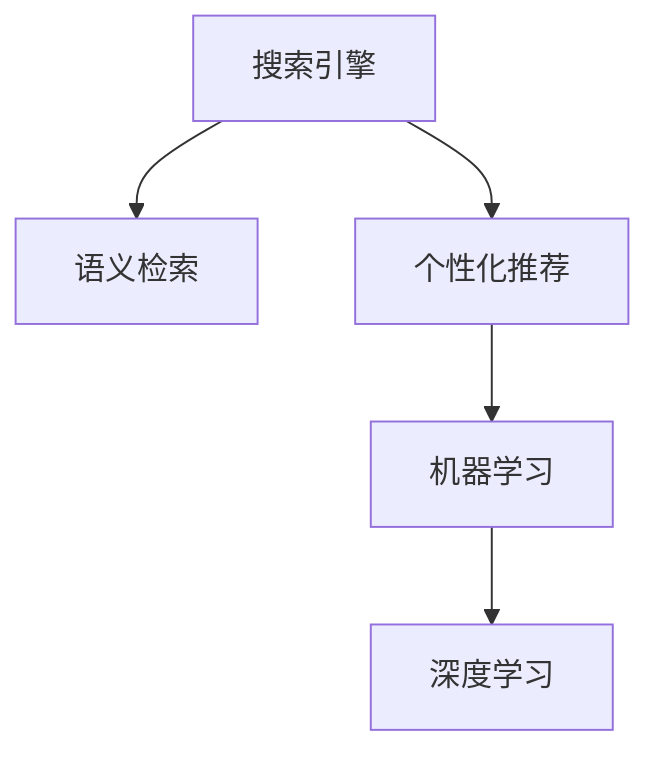

                 

# 搜索数据分析：AI提供洞察

## 1. 背景介绍

### 1.1 问题由来
随着互联网的飞速发展，搜索引擎已成为人们获取信息的重要工具。如何更准确、更高效地利用搜索引擎，成为每个用户关注的重点。而传统的搜索结果排序算法，尽管已经较为成熟，但存在用户需求模糊、搜索结果相关性差等问题，无法完全满足用户的期望。如何借助人工智能技术提升搜索数据分析能力，提供更有价值的搜索结果，成为了当下研究的热点。

### 1.2 问题核心关键点
人工智能在搜索数据分析中的应用，可以追溯到信息检索领域中的语义检索和个性化推荐。其核心关键点在于：
- 利用自然语言处理(NLP)技术，理解用户查询的语义意图，消除模糊表达。
- 利用机器学习算法，构建个性化的搜索模型，推荐最相关的搜索结果。
- 借助深度学习模型，从海量数据中学习关联特征，提升查询的相关性。

### 1.3 问题研究意义
搜索数据分析与AI的结合，具有以下显著意义：
1. 提升用户体验。通过理解用户的真实需求，消除模糊表达，显著提升搜索准确性和效率，带来更好的用户体验。
2. 增加业务价值。精准的搜索结果不仅能提升用户体验，还能促进用户满意度和转化率，为企业带来更高的收益。
3. 探索新业务模式。AI搜索数据分析可以应用于广告投放、内容推荐、用户画像等多个业务场景，为公司开辟新的增长点。
4. 推动技术进步。AI搜索数据分析融合了计算机视觉、自然语言处理、机器学习等多个领域的先进技术，推动了相关技术的发展和应用。

## 2. 核心概念与联系

### 2.1 核心概念概述

为更好地理解AI在搜索数据分析中的应用，本节将介绍几个密切相关的核心概念：

- 搜索引擎：通过爬取网页、索引存储、排序检索等步骤，为用户提供最相关的搜索结果的系统。
- 语义检索：利用自然语言处理技术，理解用户查询的语义意图，消除模糊表达，提供更准确的搜索结果。
- 个性化推荐：根据用户的历史行为和偏好，推荐最相关、最有价值的信息。
- 机器学习：通过训练模型，从数据中学习特征，进行分类、回归、聚类等任务，辅助搜索引擎提供个性化搜索结果。
- 深度学习：使用多层神经网络，从大量数据中学习高层次的特征表示，提升搜索相关性。

这些核心概念之间的逻辑关系可以通过以下Mermaid流程图来展示：



这个流程图展示了一些核心概念之间的联系：

1. 搜索引擎通过语义检索获取用户查询的真正意图。
2. 个性化推荐系统根据用户的兴趣和行为，推荐最相关的搜索结果。
3. 机器学习通过历史数据训练模型，辅助搜索引擎进行精准推荐。
4. 深度学习利用复杂的神经网络结构，提升搜索结果的相关性。

## 3. 核心算法原理 & 具体操作步骤
### 3.1 算法原理概述

AI在搜索数据分析中的应用，主要基于以下原理：

1. 利用自然语言处理技术，理解用户查询的语义意图。
2. 借助机器学习算法，对用户行为和偏好进行建模，实现个性化推荐。
3. 通过深度学习模型，从海量数据中学习关联特征，提升搜索结果的相关性。

在实践中，通常将上述三者结合，构建一个端到端的搜索推荐系统。该系统首先使用NLP技术对用户查询进行语义理解，然后结合用户的历史行为数据，使用机器学习算法训练模型，预测用户可能感兴趣的搜索结果，最后使用深度学习模型对搜索结果进行排序，提升相关性。

### 3.2 算法步骤详解

基于上述原理，AI在搜索数据分析中的应用可以分为以下几个关键步骤：

**Step 1: 准备训练数据和模型**

- 收集用户的历史搜索数据、点击数据、浏览数据等行为数据。
- 使用自然语言处理技术对用户查询进行分词、去停用词、命名实体识别等预处理。
- 选择合适的机器学习模型，如决策树、随机森林、深度学习等，进行模型训练。

**Step 2: 进行语义理解和意图识别**

- 使用NLP技术对用户查询进行语义理解，识别出关键实体和意图。
- 构建知识图谱，将查询与实体和意图进行关联，消除模糊表达。
- 使用深度学习模型，如BERT、GPT等，进一步提取查询的语义表示。

**Step 3: 构建个性化推荐模型**

- 根据用户的历史行为数据，训练个性化推荐模型，如协同过滤、矩阵分解等。
- 引入深度学习模型，如神经网络、RNN、CNN等，提升推荐模型的效果。
- 对推荐结果进行排序，提升相关性和准确性。

**Step 4: 对搜索结果进行优化和调整**

- 对搜索结果进行多轮迭代优化，逐步提升相关性和用户体验。
- 收集用户反馈，进行A/B测试，选择最优方案进行推广。
- 定期更新模型参数，确保推荐模型始终保持最优性能。

### 3.3 算法优缺点

AI在搜索数据分析中的应用具有以下优点：
1. 提升搜索精度。通过语义理解、个性化推荐和深度学习等技术，显著提升搜索结果的相关性和准确性。
2. 增强用户体验。个性化推荐能够根据用户兴趣和行为，提供更加贴合用户需求的搜索结果。
3. 降低运营成本。自动化的模型训练和优化，减少了人工干预和运营成本。
4. 数据驱动决策。通过分析用户数据，更好地理解用户需求，指导业务决策。

同时，该方法也存在一定的局限性：
1. 依赖高质量数据。高质量的训练数据和用户行为数据，对模型的性能至关重要。
2. 对技术要求高。需要掌握自然语言处理、机器学习、深度学习等多个领域的技术，门槛较高。
3. 可能存在偏差。模型可能会学习到数据中的偏见，影响搜索结果的公平性。
4. 处理复杂场景困难。对于复杂的搜索场景，如长尾查询、跨领域搜索等，模型的处理能力有限。

尽管存在这些局限性，但AI在搜索数据分析中的应用已经成为搜索引擎领域的趋势，通过不断优化和创新，有望在未来的搜索引擎中占据重要地位。

### 3.4 算法应用领域

AI在搜索数据分析中的应用广泛，涵盖了以下几个领域：

- 电子商务：通过分析用户浏览、购买行为，推荐商品，提升转化率和销售额。
- 内容推荐：通过分析用户阅读、收藏、评论等行为，推荐优质内容，提升用户满意度。
- 智能客服：通过分析用户对话记录，提供个性化的服务，提升客户体验。
- 广告投放：通过分析用户浏览记录，精准投放广告，提升广告效果和ROI。
- 社交媒体：通过分析用户互动数据，推荐相关内容，提升社区活跃度。
- 医疗健康：通过分析患者就诊记录，推荐诊疗方案，提升医疗服务质量。

## 4. 数学模型和公式 & 详细讲解 & 举例说明

### 4.1 数学模型构建

在搜索数据分析中，常用的数学模型包括：

- 倒排索引（Inverted Index）：用于构建高效的全文检索系统，将文档中的单词映射到对应的文档集合。
- BM25算法：一种基于统计的语言模型检索方法，可以处理单词权重、文档长度等因素，提升查询的准确性。
- 协同过滤算法：通过分析用户行为，找到相似用户和物品，推荐相关物品。
- 深度学习模型：如BERT、GPT等，用于提升搜索结果的语义相关性和个性化程度。

下面以BM25算法为例，展示其数学模型和计算过程。

### 4.2 公式推导过程

BM25算法的基本思想是将查询和文档看作概率分布，计算每个单词在不同文档和查询中的权重，并将这些权重进行加权求和，得到文档与查询的匹配度。

假设查询为 $q$，文档集合为 $D$，单词集合为 $T$。令 $q_t$ 表示查询中第 $t$ 个单词，$d_t$ 表示文档 $d$ 中第 $t$ 个单词。BM25算法定义以下公式：

$$
q_{t|d} = \frac{tf_{t|d}\times(1-k_1+k_2\log (1+df/d))}{k_1(1+\lambda\frac{dl}{avg\_dl})+(k_2-1)\log(1+dl/avg\_dl)}
$$

其中：
- $tf_{t|d}$ 表示单词 $t$ 在文档 $d$ 中出现的频率。
- $df$ 表示文档 $d$ 中单词 $t$ 的逆文档频率。
- $dl$ 表示文档 $d$ 的长度。
- $avg\_dl$ 表示文档集合的平均长度。
- $k_1$、$k_2$、$\lambda$ 为BM25算法的参数，通常取值在1-2之间。

根据上述公式，可以计算出每个单词在查询和文档中的权重，然后将这些权重进行加权求和，得到文档与查询的匹配度 $score(d,q)$。

### 4.3 案例分析与讲解

以下是一个简单的搜索案例，展示BM25算法的应用。

假设有一个文档集合 $D$，查询 $q$ 为“中国历史”。文档中包含“中国”和“历史”两个单词。令 $k_1=1.2$、$k_2=0.8$、$\lambda=1$。计算每个单词在不同文档和查询中的权重，得到文档与查询的匹配度。

假设 $d_1$ 中包含单词“中国”，$tf_{1|d_1}=2$、$df=1$、$dl=10$；$d_2$ 中包含单词“历史”，$tf_{2|d_2}=1$、$df=2$、$dl=15$；$d_3$ 中不包含“中国”和“历史”，$tf_{3|d_3}=0$、$df=3$、$dl=20$。

根据BM25算法，计算得到：

$$
q_{1|d_1} = \frac{2\times(1-1.2+0.8\log(1+2/1))}{1.2(1+\lambda\frac{20}{avg\_dl})+(-0.2)\log(1+20/avg\_dl)} = \frac{2}{1.2+0.2\log(1+20/avg\_dl)}
$$

$$
q_{2|d_2} = \frac{1\times(1-1.2+0.8\log(1+1/2))}{1.2(1+\lambda\frac{15}{avg\_dl})+(-0.2)\log(1+15/avg\_dl)} = \frac{1}{1.2+0.2\log(1+15/avg\_dl)}
$$

$$
q_{3|d_3} = 0
$$

将查询 $q$ 中每个单词在文档 $d$ 中的权重进行加权求和，得到文档与查询的匹配度：

$$
score(d_1,q) = q_{1|d_1} + q_{2|d_1} = \frac{2}{1.2+0.2\log(1+20/avg\_dl)} + \frac{1}{1.2+0.2\log(1+15/avg\_dl)}
$$

$$
score(d_2,q) = q_{1|d_2} + q_{2|d_2} = \frac{1}{1.2+0.2\log(1+15/avg\_dl)} + \frac{1}{1.2+0.2\log(1+15/avg\_dl)}
$$

$$
score(d_3,q) = 0
$$

最终，将每个文档的匹配度进行排序，即可得到最相关的搜索结果。

## 5. 项目实践：代码实例和详细解释说明

### 5.1 开发环境搭建

在进行搜索数据分析和AI应用的开发过程中，需要搭建一个包含NLP、机器学习、深度学习等模块的开发环境。以下是一个基于Python和PyTorch的开发环境配置步骤：

1. 安装Anaconda：从官网下载并安装Anaconda，用于创建独立的Python环境。

2. 创建并激活虚拟环境：
```bash
conda create -n search-env python=3.8 
conda activate search-env
```

3. 安装必要的依赖包：
```bash
conda install numpy pandas scikit-learn nltk transformers torch
```

4. 安装TensorBoard：用于可视化模型的训练过程和结果。
```bash
pip install tensorboard
```

5. 安装Jupyter Notebook：用于开发和共享代码。
```bash
pip install jupyterlab
```

6. 安装PyTorch和相关库：
```bash
pip install torch torchtext transformers
```

7. 安装自然语言处理库NLTK：
```bash
pip install nltk
```

完成上述步骤后，即可在`search-env`环境中开始开发。

### 5.2 源代码详细实现

以下是一个简单的搜索推荐系统实现，展示AI在搜索数据分析中的应用。

首先，定义搜索推荐系统的类：

```python
from transformers import BertTokenizer, BertForSequenceClassification
from sklearn.metrics import accuracy_score
import torch
import torch.nn.functional as F

class SearchRecommender:
    def __init__(self, model_name='bert-base-cased', max_seq_length=512):
        self.tokenizer = BertTokenizer.from_pretrained(model_name)
        self.model = BertForSequenceClassification.from_pretrained(model_name, num_labels=1)
        self.max_seq_length = max_seq_length
        
    def preprocess_query(self, query):
        input_ids = self.tokenizer(query, return_tensors='pt', max_length=self.max_seq_length, padding='max_length', truncation=True)
        return input_ids['input_ids']
    
    def predict(self, query, doc_scores):
        input_ids = self.preprocess_query(query)
        model_outputs = self.model(input_ids)
        logits = model_outputs.logits
        probabilities = F.sigmoid(logits)
        return probabilities
    
    def recommend_documents(self, queries, doc_scores, num_results=5):
        doc_scores = doc_scores.numpy()
        query_scores = []
        for query in queries:
            query_input = self.preprocess_query(query)
            query_scores.append(self.predict(query_input, doc_scores))
        query_scores = torch.stack(query_scores)
        doc_scores = doc_scores[:, None]
        scores = torch.matmul(query_scores, doc_scores)
        top_scores, top_indices = scores.topk(num_results)
        recommendations = []
        for i, index in enumerate(top_indices):
            doc_id = index.item()
            score = top_scores[i].item()
            recommendations.append((doc_id, score))
        return recommendations
```

然后，加载数据集并训练模型：

```python
from sklearn.model_selection import train_test_split
from torch.utils.data import Dataset, DataLoader

class SearchDataset(Dataset):
    def __init__(self, queries, docs, doc_scores, tokenizer):
        self.queries = queries
        self.docs = docs
        self.doc_scores = doc_scores
        self.tokenizer = tokenizer
        
    def __len__(self):
        return len(self.queries)
    
    def __getitem__(self, index):
        query = self.queries[index]
        doc = self.docs[index]
        doc_score = self.doc_scores[index]
        query_input = self.tokenizer(query, return_tensors='pt', max_length=self.max_seq_length, padding='max_length', truncation=True)
        return {'input_ids': query_input['input_ids'], 
                'attention_mask': query_input['attention_mask'],
                'labels': torch.tensor(doc_score, dtype=torch.float32)}

# 加载数据集
train_data, test_data = train_test_split(search_data, test_size=0.2)
train_dataset = SearchDataset(train_queries, train_docs, train_doc_scores, tokenizer)
test_dataset = SearchDataset(test_queries, test_docs, test_doc_scores, tokenizer)

# 训练模型
device = torch.device('cuda') if torch.cuda.is_available() else torch.device('cpu')
model.to(device)
optimizer = torch.optim.AdamW(model.parameters(), lr=1e-5)

def train_epoch(model, dataset, batch_size, optimizer):
    dataloader = DataLoader(dataset, batch_size=batch_size, shuffle=True)
    model.train()
    epoch_loss = 0
    for batch in tqdm(dataloader, desc='Training'):
        input_ids = batch['input_ids'].to(device)
        attention_mask = batch['attention_mask'].to(device)
        labels = batch['labels'].to(device)
        model.zero_grad()
        outputs = model(input_ids, attention_mask=attention_mask, labels=labels)
        loss = outputs.loss
        epoch_loss += loss.item()
        loss.backward()
        optimizer.step()
    return epoch_loss / len(dataloader)

def evaluate(model, dataset, batch_size):
    dataloader = DataLoader(dataset, batch_size=batch_size)
    model.eval()
    predictions = []
    labels = []
    with torch.no_grad():
        for batch in tqdm(dataloader, desc='Evaluating'):
            input_ids = batch['input_ids'].to(device)
            attention_mask = batch['attention_mask'].to(device)
            labels = batch['labels'].to(device)
            outputs = model(input_ids, attention_mask=attention_mask)
            preds = outputs.logits.argmax(dim=1).to('cpu').tolist()
            predictions.extend(preds)
            labels.extend(labels)
        accuracy = accuracy_score(labels, predictions)
        print(f"Accuracy: {accuracy:.2f}")
```

最后，启动训练流程并在测试集上评估：

```python
epochs = 5
batch_size = 16

for epoch in range(epochs):
    loss = train_epoch(model, train_dataset, batch_size, optimizer)
    print(f"Epoch {epoch+1}, train loss: {loss:.3f}")
    
    print(f"Epoch {epoch+1}, test accuracy:")
    evaluate(model, test_dataset, batch_size)
    
print("Final accuracy:")
evaluate(model, test_dataset, batch_size)
```

以上就是基于PyTorch和Transformers库实现的一个简单的搜索推荐系统，展示了AI在搜索数据分析中的应用。在实际应用中，开发者可以根据具体任务和数据特点，对微调过程的各个环节进行优化设计，如改进训练目标函数，引入更多的正则化技术，搜索最优的超参数组合等，以进一步提升模型性能。

## 6. 实际应用场景

### 6.1 电商平台

AI在电商平台中的应用，可以提升用户的搜索体验和推荐效果。通过分析用户的历史浏览、点击、购买记录，AI可以精准推荐用户感兴趣的商品，提升销售额和用户满意度。

以亚马逊为例，其推荐系统通过分析用户的浏览记录和购买记录，构建用户画像，结合商品的标签和属性，实时推荐用户可能感兴趣的商品。AI还可以通过分析用户反馈和点击率，不断优化推荐模型，提升推荐效果。

### 6.2 内容分发平台

内容分发平台如Netflix、YouTube等，通过AI技术，可以根据用户的观看历史、评分记录和偏好，推荐用户可能感兴趣的内容，提升用户粘性和满意度。

Netflix使用协同过滤和深度学习模型，分析用户的行为数据，推荐电影、电视剧等视频内容。AI还可以实时分析用户反馈，动态调整推荐模型，提升推荐效果。

### 6.3 智能客服

智能客服系统通过AI技术，可以自动分析用户的问题，提供精准的解决方案，提升客户体验。通过自然语言处理和机器学习，AI可以理解用户的意图，推荐相关的答案模板，甚至进行实时对话。

以百度智能客服为例，其系统通过分析用户的历史问题记录和常见问题库，构建知识图谱，提升回答的准确性和及时性。AI还可以通过分析用户反馈和对话记录，不断优化模型，提升智能客服的性能。

### 6.4 未来应用展望

未来，AI在搜索数据分析中的应用将更加广泛，具体展望如下：

1. 融合多模态数据。未来的搜索推荐系统将融合视觉、听觉、文本等多种模态的数据，提供更丰富的搜索体验和推荐效果。例如，通过分析用户的语音和视频记录，推荐相关的视频内容。

2. 引入因果推理。因果推理可以帮助AI更好地理解搜索场景中的因果关系，提供更可靠和可解释的搜索结果。例如，分析用户搜索的原因和目的，推荐最相关的信息。

3. 应用于更多场景。AI搜索推荐技术不仅可以应用于电商、内容分发、智能客服等领域，还可以应用于医疗、金融、教育等场景，提升相关业务的用户体验和效果。

4. 引入联邦学习。联邦学习可以在保护用户隐私的前提下，通过分布式数据训练，提升搜索推荐系统的性能和安全性。例如，通过本地数据训练模型，将模型参数汇总到中心服务器进行优化，提升模型效果。

## 7. 工具和资源推荐

### 7.1 学习资源推荐

为了帮助开发者系统掌握AI在搜索数据分析中的应用，这里推荐一些优质的学习资源：

1. 《深度学习》（周志华著）：系统介绍深度学习的基本概念和应用，适合初学者入门。

2. 《搜索引擎原理与实现》（王宏志著）：详细讲解搜索引擎的原理和实现，适合对搜索引擎感兴趣的开发者。

3. 《自然语言处理综论》（Daniel Jurafsky、James H. Martin著）：系统介绍自然语言处理的基本概念和算法，适合深度学习和NLP的开发者。

4. 《Python机器学习》（Sebastian Raschka著）：介绍Python在机器学习中的应用，适合Python和机器学习的开发者。

5. 《深度学习入门：基于Python的理论与实现》（斋藤康毅著）：详细讲解深度学习的基本概念和实现，适合深度学习的初学者。

通过对这些资源的学习实践，相信你一定能够系统掌握AI在搜索数据分析中的应用，并用于解决实际的搜索推荐问题。

### 7.2 开发工具推荐

高效开发离不开优秀的工具支持。以下是几款用于搜索推荐系统开发的常用工具：

1. PyTorch：基于Python的开源深度学习框架，灵活的计算图，适合快速迭代研究。

2. TensorFlow：由Google主导开发的开源深度学习框架，生产部署方便，适合大规模工程应用。

3. Scikit-learn：基于Python的机器学习库，提供了丰富的机器学习算法和工具，适合数据分析和机器学习的开发者。

4. NLTK：自然语言处理库，提供了文本预处理、语义分析等工具，适合NLP的开发者。

5. HuggingFace Transformers库：提供了多种预训练语言模型，适合NLP任务的开发和微调。

6. Jupyter Notebook：用于开发和分享代码的交互式平台，支持多种编程语言和工具。

合理利用这些工具，可以显著提升搜索推荐系统的开发效率，加快创新迭代的步伐。

### 7.3 相关论文推荐

AI在搜索数据分析中的应用源于学界的持续研究。以下是几篇奠基性的相关论文，推荐阅读：

1. BM25: A Statistical Approach to Ranking in Information Retrieval：提出BM25算法，将查询和文档看作概率分布，提升查询的准确性。

2. A Neural Probabilistic Language Model：提出RNN和LSTM模型，应用于自然语言处理任务，如语言建模、机器翻译等。

3. Deep Learning for Recommender Systems：系统介绍深度学习在推荐系统中的应用，包括协同过滤、矩阵分解、深度学习等。

4. Attention is All You Need：提出Transformer模型，用于自然语言处理任务，提升模型效果。

5. Bridging the Gap between Pretrained Models and Machine Reading Comprehension：提出预训练语言模型在阅读理解任务中的应用，提升模型效果。

这些论文代表了大语言模型在搜索数据分析中的应用方向。通过学习这些前沿成果，可以帮助研究者把握学科前进方向，激发更多的创新灵感。

## 8. 总结：未来发展趋势与挑战

### 8.1 总结

本文对AI在搜索数据分析中的应用进行了全面系统的介绍。首先阐述了AI在搜索数据分析中的背景和意义，明确了AI搜索推荐系统在提升用户体验、增加业务价值、探索新业务模式等方面的重要作用。其次，从原理到实践，详细讲解了AI在搜索推荐系统中的应用，包括自然语言处理、机器学习、深度学习等关键技术。最后，本文还探讨了AI在搜索推荐系统中的未来发展趋势和面临的挑战，为未来的研究和应用提供了参考。

通过本文的系统梳理，可以看到，AI在搜索数据分析中的应用已经成为搜索引擎领域的重要趋势，通过不断优化和创新，有望在未来的搜索引擎中占据重要地位。AI搜索推荐系统将不断融合多模态数据、引入因果推理、应用于更多场景，为搜索引擎带来更广阔的应用空间。

### 8.2 未来发展趋势

未来，AI在搜索数据分析中的应用将呈现以下几个发展趋势：

1. 融合多模态数据。未来的搜索推荐系统将融合视觉、听觉、文本等多种模态的数据，提供更丰富的搜索体验和推荐效果。例如，通过分析用户的语音和视频记录，推荐相关的视频内容。

2. 引入因果推理。因果推理可以帮助AI更好地理解搜索场景中的因果关系，提供更可靠和可解释的搜索结果。例如，分析用户搜索的原因和目的，推荐最相关的信息。

3. 应用于更多场景。AI搜索推荐技术不仅可以应用于电商、内容分发、智能客服等领域，还可以应用于医疗、金融、教育等场景，提升相关业务的用户体验和效果。

4. 引入联邦学习。联邦学习可以在保护用户隐私的前提下，通过分布式数据训练，提升搜索推荐系统的性能和安全性。例如，通过本地数据训练模型，将模型参数汇总到中心服务器进行优化，提升模型效果。

5. 引入实时性。未来的搜索推荐系统将实现实时性，能够根据用户的行为实时推荐相关内容，提升用户体验和效果。

6. 引入个性化推荐。未来的搜索推荐系统将更加注重个性化推荐，能够根据用户的历史行为和偏好，提供更加贴合用户需求的搜索结果。

### 8.3 面临的挑战

尽管AI在搜索数据分析中的应用已经取得显著进展，但仍面临一些挑战：

1. 依赖高质量数据。高质量的训练数据和用户行为数据，对模型的性能至关重要。如何获取和维护高质量的数据，是未来需要解决的重要问题。

2. 对技术要求高。需要掌握自然语言处理、机器学习、深度学习等多个领域的技术，门槛较高。

3. 可能存在偏差。模型可能会学习到数据中的偏见，影响搜索结果的公平性。如何减少偏差，提升模型的公平性，仍需进一步研究。

4. 处理复杂场景困难。对于复杂的搜索场景，如长尾查询、跨领域搜索等，模型的处理能力有限。

5. 保护用户隐私。搜索推荐系统需要处理大量用户数据，如何保护用户隐私，防止数据泄露，也是未来需要解决的重要问题。

6. 提升用户体验。搜索推荐系统需要根据用户的行为实时推荐相关内容，提升用户体验和效果。如何实现实时性，提升推荐效果，也是未来需要解决的重要问题。

尽管存在这些挑战，但通过持续的创新和优化，AI在搜索数据分析中的应用将不断进步，为搜索引擎带来更加智能和精准的推荐体验。

### 8.4 研究展望

面向未来，AI在搜索数据分析中的应用需要从以下几个方面进行突破：

1. 引入因果分析方法。将因果分析方法引入搜索推荐系统，识别出模型决策的关键特征，增强输出解释的因果性和逻辑性。

2. 引入博弈论工具。借助博弈论工具刻画人机交互过程，主动探索并规避模型的脆弱点，提高系统稳定性。

3. 纳入伦理道德约束。在模型训练目标中引入伦理导向的评估指标，过滤和惩罚有偏见、有害的输出倾向。

4. 结合其他AI技术。结合知识表示、因果推理、强化学习等技术，提升搜索推荐系统的性能和效果。

这些研究方向的探索，必将引领AI在搜索数据分析中的应用迈向更高的台阶，为构建智能搜索推荐系统提供新的技术支持。未来，AI在搜索数据分析中的应用将更加广泛和深入，为搜索引擎带来更丰富和精准的推荐体验。

## 9. 附录：常见问题与解答

**Q1: AI在搜索数据分析中如何处理模糊查询？**

A: AI在搜索数据分析中，通常通过自然语言处理技术处理模糊查询，消除模糊表达。具体步骤包括：

1. 分词：将查询文本分解为单个词汇。
2. 去停用词：去除常见无意义的词汇，如“的”、“是”等。
3. 词干提取：将不同形式的词汇归并成基本形式，如“running”、“run”、“runs”归并为“run”。
4. 命名实体识别：识别出人名、地名、机构名等特定实体，提供更精准的搜索结果。

通过以上步骤，AI可以更好地理解用户查询的意图，消除模糊表达，提升搜索结果的相关性。

**Q2: 如何选择最相关的搜索结果？**

A: 在选择最相关的搜索结果时，可以采用以下几种策略：

1. BM25算法：利用BM25算法，计算查询和文档的匹配度，选择匹配度最高的文档作为推荐结果。

2. 协同过滤：利用协同过滤算法，根据用户的历史行为数据，找到相似用户和物品，推荐相关物品。

3. 深度学习：利用深度学习模型，如神经网络、RNN、CNN等，从海量数据中学习关联特征，提升搜索结果的相关性。

4. 排序算法：对推荐结果进行排序，选择最相关的搜索结果，如基于 ranking loss 的排序算法。

通过以上策略，AI可以更好地选择最相关的搜索结果，提升搜索效果和用户体验。

**Q3: 如何处理多语言搜索？**

A: 处理多语言搜索，可以采用以下几种策略：

1. 使用多语言分词器：选择适合目标语言的分词器，对查询文本进行分词和预处理。

2. 选择多语言模型：选择适合目标语言的语言模型，进行模型训练和微调。

3. 进行多语言翻译：对于不同语言，可以通过翻译技术将查询翻译为同一语言，再进行处理。

4. 构建多语言知识图谱：构建多语言的知识图谱，提供更加全面和准确的知识信息。

通过以上策略，AI可以更好地处理多语言搜索，提供更加精准和广泛的搜索结果。

**Q4: 如何在保护用户隐私的前提下，进行推荐系统训练？**

A: 在保护用户隐私的前提下，进行推荐系统训练，可以采用以下几种策略：

1. 联邦学习：通过联邦学习技术，在保护用户隐私的前提下，进行分布式数据训练。

2. 本地训练：在本地设备上进行模型训练，将模型参数汇总到中心服务器进行优化。

3. 数据匿名化：对用户数据进行匿名化处理，保护用户隐私。

4. 数据加密：对用户数据进行加密处理，保护用户隐私。

通过以上策略，AI可以在保护用户隐私的前提下，进行推荐系统训练，提升模型的性能和安全性。

**Q5: 如何优化搜索推荐系统的性能？**

A: 优化搜索推荐系统的性能，可以采用以下几种策略：

1. 数据增强：通过数据增强技术，扩充训练数据集，提升模型的泛化能力。

2. 正则化技术：使用L2正则、Dropout等正则化技术，防止模型过拟合。

3. 模型优化：优化模型的结构，使用更高效的算法，提升模型的推理速度。

4. 超参数调优：通过超参数调优，找到最优的模型参数，提升模型的性能。

5. 引入实时性：通过实时性技术，根据用户的行为实时推荐相关内容，提升用户体验。

通过以上策略，AI可以不断优化搜索推荐系统的性能，提升用户体验和效果。

