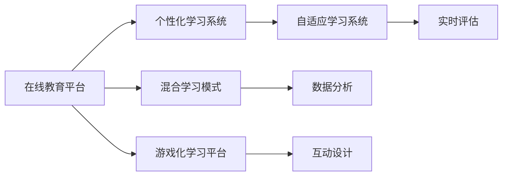

                 

# 教育科技创业：知识传播的新范式

> 关键词：教育科技, 知识传播, 在线教育, 人工智能, 个性化学习, 混合学习, 游戏化学习, 自适应学习

## 1. 背景介绍

### 1.1 问题由来
在全球化和技术革新的大背景下，传统的教育模式面临诸多挑战。一方面，信息技术的迅猛发展，特别是移动互联网的普及，为教育资源的普惠提供了新的契机；另一方面，教育领域仍存在着教育资源不均衡、学习内容单调、教学效果不佳等问题。如何利用新技术重构教育内容、创新教学方法，提升学习效果，成为摆在教育从业者面前的重要课题。

### 1.2 问题核心关键点
教育科技创业的核心在于如何通过技术手段提升教育质量、扩大教育覆盖面，并实现个性化学习。当前，基于人工智能和数据的教育科技解决方案已经成为全球教育技术创业的焦点。这些解决方案主要包括：

1. **在线教育平台**：利用互联网技术提供线上课程和互动学习环境，减少地理位置和时间的限制。
2. **个性化学习系统**：通过数据分析和机器学习算法，为每个学生提供量身定制的学习路径和资源。
3. **混合学习模式**：结合线上线下教学资源，利用翻转课堂、线上作业等方式提升学习效果。
4. **游戏化学习平台**：通过游戏元素和互动体验，提升学习兴趣和参与度。
5. **自适应学习系统**：根据学生学习进度和理解程度动态调整教学内容和节奏，实现因材施教。

## 2. 核心概念与联系

### 2.1 核心概念概述

教育科技创业涉及多个核心概念，主要包括：

- **在线教育平台**：基于互联网技术，提供线上课程和互动学习环境，实现知识传播的数字化和全球化。
- **个性化学习系统**：利用数据分析和机器学习算法，根据学生的个性化需求和学习风格，提供定制化的学习方案。
- **混合学习模式**：结合线上线下教学资源，灵活运用翻转课堂、线上作业等手段，提升学习效果。
- **游戏化学习平台**：通过引入游戏化元素，如积分、排行榜、虚拟角色等，增强学习动机和体验感。
- **自适应学习系统**：根据学生实时学习数据，动态调整教学内容和节奏，实现个性化教学。

这些核心概念之间相互关联，共同构成了教育科技创业的生态系统。通过技术手段优化各个环节，可以显著提升教育质量和效率，实现教育公平和普及。

### 2.2 核心概念原理和架构的 Mermaid 流程图



这个流程图展示了核心概念之间的联系。在线教育平台是基础，个性化学习系统、混合学习模式和游戏化学习平台在其基础上进行创新和应用。自适应学习系统则融合了个性化学习系统的数据和算法，提供更加灵活和动态的教学体验。

## 3. 核心算法原理 & 具体操作步骤

### 3.1 算法原理概述

教育科技创业涉及的算法和数据处理技术，主要基于人工智能和机器学习。核心算法包括：

- **推荐系统**：利用协同过滤、内容推荐等算法，根据用户兴趣和行为数据，推荐合适的学习内容和资源。
- **自然语言处理(NLP)**：通过文本分析和情感分析等技术，提升学习内容的理解和生成质量。
- **强化学习**：利用奖励机制和反馈循环，优化学习路径和策略，提升学习效果。
- **自适应学习算法**：利用数据驱动的模型，根据学生的学习状态和反馈，动态调整教学内容和节奏。

这些算法和技术的综合应用，是实现个性化和自适应学习的基础。

### 3.2 算法步骤详解

以自适应学习系统为例，主要步骤如下：

1. **数据收集**：收集学生的学习行为数据，如学习时间、完成情况、测试成绩等。
2. **数据预处理**：清洗和处理数据，去除噪音和异常值，生成可用于模型训练的数据集。
3. **模型训练**：利用机器学习算法，训练自适应学习模型。常用的算法包括决策树、随机森林、神经网络等。
4. **实时评估**：根据学生的实时反馈和评估结果，动态调整教学内容和节奏。
5. **个性化推荐**：根据学生的学习状态和偏好，推荐合适的学习资源和路径。

### 3.3 算法优缺点

自适应学习系统等教育科技创业的算法，具有以下优点：

1. **个性化学习**：根据每个学生的特点和需求，提供量身定制的学习方案，提升学习效果。
2. **数据驱动决策**：通过数据驱动的模型，实时调整教学策略，提高教学效率。
3. **高效反馈**：通过实时评估和调整，及时发现和解决问题，减少学习过程中的困惑和挫败感。

同时，也存在以下缺点：

1. **数据隐私**：收集和处理大量学生数据，存在隐私泄露的风险。
2. **算法复杂度**：需要复杂的算法和大量计算资源，实现成本较高。
3. **用户接受度**：学生和家长可能对技术干预学习存在抵触情绪。

### 3.4 算法应用领域

教育科技创业的算法和数据处理技术，可以广泛应用于多个领域，包括：

1. **K-12教育**：通过自适应学习系统，为中小学生提供个性化的学习支持。
2. **高等教育**：利用在线教育平台和个性化学习系统，支持远程学习和研究。
3. **职业培训**：为成人提供灵活多样的职业技能培训课程，提升就业竞争力。
4. **特殊教育**：利用混合学习模式和自适应学习系统，为有特殊需要的学生提供个性化支持。
5. **终身学习**：通过在线教育平台和游戏化学习平台，支持成年人的终身学习需求。

## 4. 数学模型和公式 & 详细讲解 & 举例说明

### 4.1 数学模型构建

自适应学习系统的核心模型包括学习者模型和教学模型。学习者模型通过学习者的历史行为数据，预测其学习能力和兴趣偏好。教学模型根据学习者模型，动态调整教学内容和节奏。

### 4.2 公式推导过程

以学习者模型为例，常用的数学模型包括：

- **线性回归模型**：通过学习者的历史成绩和行为数据，预测其未来成绩。
- **决策树模型**：根据学习者的行为数据，预测其学习兴趣和偏好。
- **神经网络模型**：通过学习者的历史行为数据，预测其学习能力和进步潜力。

### 4.3 案例分析与讲解

假设某学生小明，历史成绩和行为数据如下：

| 时间 | 学习时长 | 完成作业 | 考试成绩 |
| ---- | -------- | -------- | -------- |
| 第1周 | 3小时    | 全对     | 80分     |
| 第2周 | 5小时    | 90%      | 85分     |
| 第3周 | 4小时    | 80%      | 90分     |

利用线性回归模型，可以预测小明第4周的成绩：

$$
\hat{y} = \theta_0 + \theta_1 x_1 + \theta_2 x_2
$$

其中 $x_1$ 表示学习时长，$x_2$ 表示完成作业的比例，$\theta$ 为模型参数。通过模型训练，可以得到：

$$
\hat{y} = 1 + 0.2x_1 + 0.5x_2
$$

代入小明的历史数据，预测其第4周的成绩为：

$$
\hat{y} = 1 + 0.2 \times 4 + 0.5 \times 0.8 = 85.2
$$

即预测小明的第4周成绩为85.2分。

## 5. 项目实践：代码实例和详细解释说明

### 5.1 开发环境搭建

项目实践的开发环境搭建主要包括：

1. **服务器配置**：选择合适的云服务提供商，如AWS、Google Cloud、阿里云等。
2. **数据存储和处理**：使用分布式存储和计算平台，如Hadoop、Spark、Flink等。
3. **编程语言和框架**：选择Python作为主要编程语言，利用TensorFlow、PyTorch等深度学习框架进行模型开发。
4. **开发工具**：使用Jupyter Notebook、Git、Docker等工具进行协作开发和版本管理。

### 5.2 源代码详细实现

以下是一个简单的自适应学习系统的实现示例，使用TensorFlow框架：

```python
import tensorflow as tf
import numpy as np

# 定义线性回归模型
class LinearRegression(tf.keras.Model):
    def __init__(self, input_dim):
        super(LinearRegression, self).__init__()
        self.linear = tf.keras.layers.Dense(1, input_dim=input_dim)

    def call(self, x):
        return self.linear(x)

# 训练数据
x_train = np.array([[3, 1], [5, 0.9], [4, 0.8]])
y_train = np.array([[80], [85], [90]])

# 定义模型
model = LinearRegression(input_dim=2)

# 定义损失函数和优化器
loss_fn = tf.keras.losses.MeanSquaredError()
optimizer = tf.keras.optimizers.Adam()

# 训练模型
for epoch in range(1000):
    with tf.GradientTape() as tape:
        y_pred = model(x_train)
        loss = loss_fn(y_pred, y_train)
    gradients = tape.gradient(loss, model.trainable_variables)
    optimizer.apply_gradients(zip(gradients, model.trainable_variables))
    
# 预测新数据
x_new = np.array([[4, 0.85]])
y_pred = model(x_new)

print(y_pred.numpy())
```

### 5.3 代码解读与分析

上述代码实现了一个简单的线性回归模型，用于预测学生的学习成绩。模型使用TensorFlow框架，通过反向传播算法更新模型参数，最小化预测误差。

- `LinearRegression`类定义了一个简单的线性回归模型，包含一个线性层。
- `x_train`和`y_train`为训练数据，用于模型训练。
- `loss_fn`为损失函数，使用均方误差损失。
- `optimizer`为优化器，使用Adam算法。
- `for`循环用于迭代训练模型，通过反向传播更新模型参数。
- `x_new`为测试数据，用于模型预测。
- `y_pred`为预测结果，输出学生的学习成绩预测值。

## 6. 实际应用场景

### 6.1 智能辅导系统

智能辅导系统是教育科技创业的重要应用场景之一。通过自适应学习算法，智能辅导系统可以实时监控学生的学习状态，根据其学习表现动态调整教学内容和难度，提供个性化的辅导支持。

### 6.2 在线教育平台

在线教育平台利用大数据和人工智能技术，为学生提供优质的在线学习资源和互动环境。通过推荐系统，平台可以根据学生的学习偏好和行为数据，推荐合适的课程和资源。

### 6.3 混合学习模式

混合学习模式结合线上线下教学资源，灵活运用翻转课堂、在线作业等方式，提升学习效果。通过自适应学习算法，平台可以根据学生的学习进度和理解程度，动态调整教学内容和节奏。

### 6.4 游戏化学习平台

游戏化学习平台通过引入游戏元素，如积分、排行榜、虚拟角色等，增强学生的学习动机和参与度。通过数据分析和机器学习算法，平台可以实时评估学生的学习表现，提供个性化的学习支持和反馈。

## 7. 工具和资源推荐

### 7.1 学习资源推荐

- **《机器学习》书籍**：周志华所著，全面介绍机器学习的基本概念、算法和应用。
- **Coursera在线课程**：提供从入门到进阶的机器学习课程，涵盖多种算法和实践案例。
- **Kaggle竞赛平台**：提供丰富的数据集和竞赛任务，提升数据分析和建模能力。
- **Arxiv论文库**：查阅最新的机器学习和教育科技研究成果，跟踪前沿技术。

### 7.2 开发工具推荐

- **TensorFlow**：谷歌开源的深度学习框架，适合大规模模型训练和部署。
- **PyTorch**：Facebook开源的深度学习框架，灵活易用，适合科研和快速原型开发。
- **Jupyter Notebook**：跨平台的协作开发工具，支持实时显示代码输出和图表。
- **Git和GitHub**：版本控制和协作平台，方便代码管理和团队协作。

### 7.3 相关论文推荐

- **《基于机器学习的个性化学习系统设计》**：杨晓东等人，介绍个性化学习系统的设计理念和关键技术。
- **《自适应学习算法在教育中的应用》**：袁军等人，探讨自适应学习算法在教育中的实践效果。
- **《混合学习模式的研究与实现》**：赵亚丽等人，探讨混合学习模式的优势和实现方法。
- **《游戏化学习平台的设计与评估》**：周智等人，讨论游戏化学习平台的设计原则和效果评估方法。

## 8. 总结：未来发展趋势与挑战

### 8.1 总结

教育科技创业涉及的算法和数据处理技术，正在重塑传统的教育模式。通过在线教育平台、个性化学习系统、混合学习模式和游戏化学习平台等技术手段，可以显著提升教育质量和效率，实现教育公平和普及。然而，教育科技创业也面临诸多挑战，如数据隐私、算法复杂度、用户接受度等，需要不断探索和优化。

### 8.2 未来发展趋势

未来，教育科技创业将继续深化人工智能和数据技术的融合，探索更多创新应用场景。以下趋势值得关注：

1. **智能教育生态系统**：通过连接各种教育资源和服务，形成完整的教育生态系统，提升整体教育质量。
2. **虚拟现实和增强现实**：利用VR和AR技术，提供沉浸式和交互式的学习体验，提升学习效果。
3. **混合多模态学习**：结合图像、音频、视频等多种模态数据，提供更丰富和多样化的学习资源。
4. **泛在学习**：利用移动设备和物联网，实现随时随地学习和互动。
5. **自适应教育平台**：通过实时数据分析和智能算法，提供个性化和自适应的学习支持。

### 8.3 面临的挑战

教育科技创业在技术应用和商业化过程中，仍面临诸多挑战：

1. **数据隐私和安全**：大量学生数据涉及隐私，如何在数据收集和处理中保护用户隐私，防止数据泄露，是重要课题。
2. **算法可解释性**：教育科技创业的算法往往涉及复杂的决策过程，如何提高算法的可解释性，增强用户的信任感，是关键问题。
3. **用户接受度**：教育科技创业的算法和平台，需要满足不同用户群体的需求和偏好，提升用户接受度和满意度。
4. **技术落地成本**：实现教育科技创业的技术和平台，需要大量的计算资源和专业人才，如何降低技术落地的成本，是实际应用中的重要挑战。
5. **教育公平问题**：如何通过教育科技创业，缩小教育资源分配的不均衡，促进教育公平和普惠，是社会责任的重要体现。

### 8.4 研究展望

面对这些挑战，教育科技创业的未来发展需要以下几个方面的努力：

1. **加强数据隐私保护**：采用匿名化和差分隐私技术，保护用户隐私，建立严格的数据安全管理机制。
2. **提高算法可解释性**：通过模型解释工具和透明化算法流程，提高算法的可解释性，增强用户的信任感。
3. **用户中心设计**：以用户需求和体验为中心，设计灵活和人性化的教育科技产品和服务。
4. **开源和合作**：鼓励开源教育科技平台和资源的共享，推动多方合作，共同推动教育科技的发展。
5. **伦理和社会责任**：在技术应用中注重伦理和社会责任，关注教育公平和普惠，提升社会价值。

教育科技创业正处于快速发展的重要阶段，未来需要各界共同努力，不断创新和优化，才能实现教育的全面数字化和智能化转型。

## 9. 附录：常见问题与解答

**Q1：如何评估教育科技创业的效果？**

A: 教育科技创业的效果评估可以从多个维度进行：

1. **学习成果**：评估学生在应用教育科技平台后的学习成果，如考试成绩、知识掌握程度等。
2. **学习体验**：调查学生在应用教育科技平台后的学习体验，如互动性、趣味性、易用性等。
3. **用户满意度**：通过问卷调查和用户反馈，评估用户对教育科技平台的满意度和使用率。
4. **数据分析**：通过数据分析，评估教育科技平台对学习行为和成效的提升效果。

**Q2：如何处理学生数据隐私问题？**

A: 处理学生数据隐私问题，需要采取以下措施：

1. **数据匿名化**：在数据收集和处理过程中，采用数据匿名化技术，去除或加密个人标识信息。
2. **差分隐私**：在数据使用过程中，应用差分隐私技术，减少个人数据泄露风险。
3. **数据访问控制**：建立严格的数据访问控制机制，限制非授权人员访问敏感数据。
4. **合规审查**：遵守相关法律法规和标准，如GDPR等，确保数据处理和使用的合规性。

**Q3：如何设计自适应学习系统？**

A: 设计自适应学习系统需要考虑以下要素：

1. **学习者建模**：通过收集和分析学生的学习行为数据，建立学习者模型，预测其学习能力和兴趣偏好。
2. **教学模型设计**：根据学习者模型，设计灵活的教学模型，动态调整教学内容和节奏。
3. **实时评估机制**：建立实时评估机制，通过学生反馈和测试成绩，动态调整学习策略和资源。
4. **个性化推荐系统**：结合推荐算法，为学生提供个性化的学习资源和路径，提升学习效果。

**Q4：教育科技创业的商业化策略有哪些？**

A: 教育科技创业的商业化策略主要包括以下几点：

1. **平台订阅模式**：通过收取平台订阅费，提供优质的在线教育和资源。
2. **定制化服务**：为学校和企业提供定制化的教育解决方案，提升教育质量和效率。
3. **技术授权和合作**：通过技术授权和战略合作，推广教育科技技术和平台。
4. **内容变现**：通过优质内容和资源的开发和销售，实现商业变现。
5. **生态系统构建**：建立完整的教育科技生态系统，提供从内容、平台到服务的一站式解决方案。

**Q5：教育科技创业面临的主要技术挑战有哪些？**

A: 教育科技创业面临的主要技术挑战包括：

1. **数据隐私和安全**：在数据收集和处理中，如何保护用户隐私，防止数据泄露，是重要课题。
2. **算法可解释性**：如何提高算法的可解释性，增强用户的信任感，是关键问题。
3. **用户接受度**：如何满足不同用户群体的需求和偏好，提升用户接受度和满意度。
4. **技术落地成本**：实现教育科技创业的技术和平台，需要大量的计算资源和专业人才，如何降低技术落地的成本，是实际应用中的重要挑战。
5. **教育公平问题**：如何通过教育科技创业，缩小教育资源分配的不均衡，促进教育公平和普惠。

---

作者：禅与计算机程序设计艺术 / Zen and the Art of Computer Programming

