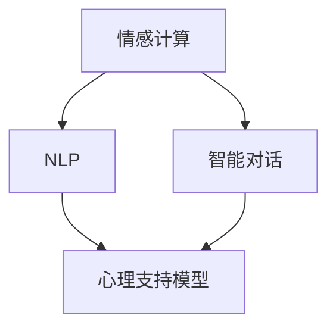

                 

# 数字化情感陪伴创业：AI驱动的心理支持

## 1. 背景介绍

### 1.1 问题由来
在现代社会，人们的压力不断增大，心理健康问题日益突出。然而，传统的心理咨询和治疗手段存在诸多局限：服务供需失衡、治疗成本高昂、覆盖面窄等问题阻碍了心理健康的普及和提升。为应对这一挑战，数字化情感陪伴系统成为一种新的解决方案。

数字化情感陪伴系统是一种基于人工智能(AI)的心理支持手段，旨在通过模拟人类情感交流方式，为个体提供实时的情感支持、心理疏导和心理健康干预。这种系统能够随时随地提供心理服务，帮助用户缓解心理压力，提升心理幸福感。

### 1.2 问题核心关键点
实现数字化情感陪伴创业的核心关键点包括：
- 构建情感计算引擎：通过分析用户情感、意图和环境，提供个性化的情感支持。
- 整合自然语言处理(NLP)：使AI能够理解和回应用户的自然语言输入。
- 开发智能对话系统：模拟人机交互，实现自然流畅的对话。
- 训练心理支持模型：通过心理学理论指导，构建有效的心理支持算法。
- 推广应用渠道：将系统整合到手机应用、社交平台等，增强用户黏性。
- 保护用户隐私：确保用户数据安全，建立信任关系。

### 1.3 问题研究意义
数字化情感陪伴创业的研究和实践具有重要意义：
- 降低心理健康服务门槛：数字化系统能够以较低的成本提供高质量的心理支持。
- 提升服务覆盖面：通过互联网平台，能够覆盖更多人群，特别是偏远地区和资源匮乏区域。
- 强化心理干预效果：智能化系统能根据用户反馈，实时调整和优化支持策略，提升干预效果。
- 促进心理危机预防：提前识别并介入潜在的心理问题，预防心理危机的发生。

## 2. 核心概念与联系

### 2.1 核心概念概述

为更好地理解数字化情感陪伴创业的技术实现和系统设计，我们首先介绍几个关键概念：

- **情感计算**：通过计算机和传感器分析人类情感和情绪，旨在建立情感状态的数学模型。
- **自然语言处理**：利用计算机理解和生成人类自然语言，是实现数字化情感陪伴系统的基础技术。
- **智能对话系统**：构建能理解和回应自然语言输入的对话系统，增强人机交互的自然性和流畅性。
- **心理支持模型**：基于心理学理论和数据训练的模型，能够提供个性化的心理支持。

这些概念之间的联系通过以下Mermaid流程图来展示：



此图展示了情感计算、NLP、智能对话和心理支持模型之间的逻辑关系。情感计算负责分析用户的情感状态，NLP用于理解和生成自然语言，智能对话提供对话接口，心理支持模型根据情感状态和语言输入，生成个性化心理支持内容。

## 3. 核心算法原理 & 具体操作步骤

### 3.1 算法原理概述

基于情感计算的数字化情感陪伴系统，其核心算法原理是情感识别和情感响应。具体来说，系统首先通过情感计算引擎分析用户的情感状态，然后根据用户的情感和语境，通过自然语言处理技术生成相应的心理支持内容，并由智能对话系统呈现给用户。

系统总体流程可概括为：
1. **情感识别**：通过情感计算引擎分析用户的语音、文本、生理信号等输入，识别出用户的情感状态。
2. **情感生成**：根据情感状态和语境，生成个性化的心理支持内容，如建议、安抚、疏导等。
3. **智能对话**：通过智能对话系统，将生成的心理支持内容呈现给用户，进行互动交流。
4. **反馈调整**：根据用户的反馈，调整和优化心理支持策略，提升干预效果。

### 3.2 算法步骤详解

下面是具体算法步骤的详细介绍：

**Step 1: 情感识别**
情感识别是情感计算引擎的核心任务，主要包括以下几个步骤：
- 收集数据：通过麦克风、摄像头、生理传感器等收集用户的语音、面部表情、心率等数据。
- 特征提取：提取语音信号的频谱、音量、语速等特征，提取面部表情的特征点，提取心率等生理信号的波动情况。
- 情感模型训练：利用机器学习模型（如CNN、RNN等）对特征进行分析，训练出情感识别模型。

**Step 2: 情感生成**
情感生成依赖于心理支持模型，具体步骤包括：
- 用户特征提取：从用户历史数据中提取特征，如情感偏好、事件经历、性格特征等。
- 情感分类：根据情感识别结果，分类用户的情感状态。
- 生成内容：根据情感状态和语境，利用自然语言处理技术生成相应的心理支持内容。
- 内容筛选：对生成的内容进行筛选，去除不相关或有害信息。

**Step 3: 智能对话**
智能对话系统通过构建对话树或序列模型，与用户进行自然交互。具体步骤包括：
- 意图识别：分析用户输入的自然语言，识别用户的意图和需求。
- 对话生成：根据用户的意图，生成相应的回复。
- 对话管理：维护对话状态，管理对话流程，确保对话的自然性和流畅性。

**Step 4: 反馈调整**
根据用户的反馈，调整心理支持策略，优化支持效果。具体步骤包括：
- 反馈收集：收集用户对心理支持的反馈，如满意度、建议等。
- 模型更新：根据反馈，更新情感识别模型和心理支持模型。
- 效果评估：评估干预效果，优化策略。

### 3.3 算法优缺点

数字化情感陪伴系统的算法具有以下优点：
- 高效实时：通过AI技术，能够实时响应用户的情感需求，提供即时支持。
- 个性化强：能够根据用户的个性化特征，提供定制化的心理支持。
- 覆盖面广：通过互联网平台，能够覆盖更多人群，特别是偏远地区。
- 成本低廉：相比传统心理咨询和治疗手段，数字化系统的开发和运营成本较低。

同时，该算法也存在以下缺点：
- 数据隐私问题：用户数据涉及情感和隐私，保护用户隐私是系统设计的重要挑战。
- 情感误判：情感计算可能存在误判，需要持续优化情感识别算法。
- 情感理解局限：情感计算模型可能无法完全理解复杂的情感和语境，需要结合人工干预。
- 对话质量：智能对话系统的回复质量可能受限于自然语言处理技术的成熟度。
- 干预效果难以量化：心理支持效果的评估需要大量实证研究，难以简单量化。

### 3.4 算法应用领域

数字化情感陪伴系统的算法广泛应用于以下领域：
- **心理健康服务**：为个体提供实时心理支持，帮助缓解压力和焦虑。
- **心理健康干预**：通过情感识别和情感响应，提供心理健康干预和治疗方案。
- **情感陪伴机器人**：开发情感陪伴机器人，提供陪伴和支持。
- **危机干预**：在紧急情况下，通过情感计算和心理支持，提供即时干预和救助。

## 4. 数学模型和公式 & 详细讲解 & 举例说明

### 4.1 数学模型构建

情感计算的核心是情感状态建模，通常采用时间序列模型来表示用户的情感变化。情感状态可以用情感得分来量化，情感得分越高，表示用户越情绪化或越消极。

情感得分的数学模型为：

$$
S_t = \alpha S_{t-1} + \beta E_t + \gamma R_t
$$

其中，$S_t$ 表示第 $t$ 时刻的情感得分，$S_{t-1}$ 表示第 $t-1$ 时刻的情感得分，$E_t$ 表示第 $t$ 时刻的环境刺激，$R_t$ 表示第 $t$ 时刻的生理信号。$\alpha$、$\beta$、$\gamma$ 为模型参数。

### 4.2 公式推导过程

情感得分的推导基于以下假设：
- **情感延续性**：用户的情感状态在短期内具有延续性。
- **环境刺激影响**：环境刺激会对用户的情感状态产生影响。
- **生理信号反馈**：生理信号能反映用户的情感状态。

情感得分的推导过程如下：
- 通过语音分析、面部表情分析、生理信号分析等，提取特征 $E_t$ 和 $R_t$。
- 利用时间序列模型，将 $S_{t-1}$、$E_t$ 和 $R_t$ 代入公式，计算 $S_t$。
- 通过训练模型参数 $\alpha$、$\beta$ 和 $\gamma$，优化情感得分模型。

### 4.3 案例分析与讲解

以下是一个情感得分的计算案例：
- 用户 A 的情感得分为 $S_{t-1} = 0.8$，环境刺激 $E_t = 0.5$，生理信号 $R_t = 0.6$。
- 情感得分模型参数 $\alpha = 0.9$，$\beta = 0.7$，$\gamma = 0.5$。
- 代入公式计算，得到 $S_t = 0.9 \times 0.8 + 0.7 \times 0.5 + 0.5 \times 0.6 = 0.94$。

## 5. 项目实践：代码实例和详细解释说明

### 5.1 开发环境搭建

**Step 1: 环境配置**
- 安装Python环境：`pip install python -m pip install virtualenv`
- 创建虚拟环境：`python -m venv venv`
- 激活虚拟环境：`source venv/bin/activate`

**Step 2: 安装相关库**
- 安装PyTorch：`pip install torch torchvision torchaudio`
- 安装TensorFlow：`pip install tensorflow`
- 安装scikit-learn：`pip install scikit-learn`
- 安装NLTK：`pip install nltk`

**Step 3: 构建数据集**
- 收集语音、面部表情、生理信号数据。
- 提取特征，生成情感数据集。

### 5.2 源代码详细实现

以下是使用TensorFlow实现情感计算的示例代码：

```python
import tensorflow as tf
import numpy as np

# 定义情感得分模型
class EmotionScoreModel(tf.keras.Model):
    def __init__(self):
        super(EmotionScoreModel, self).__init__()
        self.lstm = tf.keras.layers.LSTM(64, return_sequences=True)
        self.dense1 = tf.keras.layers.Dense(32, activation='relu')
        self.dense2 = tf.keras.layers.Dense(1, activation='sigmoid')

    def call(self, x, h=None):
        x = self.lstm(x)
        x = self.dense1(x)
        output = self.dense2(x)
        return output

# 加载数据集
train_data = np.load('train_data.npy')
train_labels = np.load('train_labels.npy')

# 定义模型
model = EmotionScoreModel()
model.compile(optimizer='adam', loss='binary_crossentropy', metrics=['accuracy'])

# 训练模型
model.fit(train_data, train_labels, epochs=10, batch_size=32)

# 使用模型预测情感得分
test_data = np.load('test_data.npy')
scores = model.predict(test_data)
```

### 5.3 代码解读与分析

**代码解读**
- `EmotionScoreModel` 定义了一个LSTM模型，用于预测情感得分。
- `call` 方法定义了模型的前向传播过程。
- 使用 `model.compile` 配置模型优化器、损失函数和评估指标。
- 使用 `model.fit` 方法训练模型，`epochs` 和 `batch_size` 参数用于控制训练轮数和批次大小。
- 使用 `model.predict` 方法预测测试集情感得分。

**代码分析**
- 情感得分模型采用了LSTM结构，能够捕捉时间序列数据的变化趋势。
- 模型训练过程中，使用了二元交叉熵损失函数，适用于情感得分的二分类问题。
- 模型预测时，使用 `predict` 方法得到情感得分。

### 5.4 运行结果展示

运行代码后，可以使用以下代码展示模型预测结果：

```python
import matplotlib.pyplot as plt

# 绘制情感得分变化曲线
plt.plot(scores)
plt.title('Emotion Score')
plt.xlabel('Time')
plt.ylabel('Score')
plt.show()
```

## 6. 实际应用场景

### 6.1 心理健康服务

数字化情感陪伴系统在心理健康服务中具有重要应用。例如，可通过以下方式实现：
- 在线咨询：用户通过APP或网页与系统进行实时互动，获取心理支持。
- 心理测试：系统提供各种心理测试，帮助用户了解自身心理健康状况。
- 情感支持：系统根据用户情感状态，提供个性化建议和疏导。

### 6.2 情感陪伴机器人

情感陪伴机器人是数字化情感陪伴系统的另一个重要应用。通过将系统集成到机器人中，可提供24小时的陪伴和支持，缓解孤独感。机器人可以通过语音、面部表情等输入，与用户进行自然对话，并提供情感支持和心理疏导。

### 6.3 危机干预

在紧急情况下，数字化情感陪伴系统可以提供即时干预。例如，在自然灾害、事故现场等紧急情况下，系统通过语音分析、面部表情分析等，迅速识别出用户的情感状态，并提供针对性的心理支持。

## 7. 工具和资源推荐

### 7.1 学习资源推荐

**Step 1: 学习情感计算和心理支持的理论基础**
- 《情感计算基础》（Emotion Computing: From Theory to Practice）：本书全面介绍了情感计算的原理和应用。
- 《心理支持的心理学基础》（Psychological Interventions: From Theory to Practice）：介绍了心理支持的理论和实践。

**Step 2: 学习自然语言处理技术**
- 《自然语言处理综论》（Speech and Language Processing）：斯坦福大学提供的自然语言处理课程，涵盖广泛的知识和应用。
- 《深度学习与自然语言处理》（Deep Learning for Natural Language Processing）：使用深度学习技术解决NLP问题的经典教材。

**Step 3: 学习情感计算和心理支持的实现**
- 《情感计算技术与应用》（Affective Computing: From Theory to Technology）：介绍了情感计算的实现方法和应用案例。
- 《心理支持系统设计》（Mental Health Support Systems Design）：介绍了心理支持系统的设计方法和实践经验。

### 7.2 开发工具推荐

**Step 1: 选择开发平台**
- 使用TensorFlow：适用于构建复杂的神经网络模型。
- 使用PyTorch：适用于构建灵活的深度学习模型。
- 使用Keras：适用于快速构建和实验模型。

**Step 2: 选择数据处理工具**
- 使用Pandas：处理和分析数据集，适用于情感计算和心理支持模型的训练。
- 使用NumPy：进行数值计算和矩阵操作，适用于情感计算和心理支持模型的实现。

**Step 3: 选择机器学习框架**
- 使用scikit-learn：提供了丰富的机器学习算法和工具，适用于情感计算和心理支持模型的训练和评估。
- 使用TensorFlow：提供了强大的计算图功能，适用于构建复杂的神经网络模型。

### 7.3 相关论文推荐

**Step 1: 学习情感计算和心理支持的最新研究**
- 《情感计算：理论与应用》（Emotion Recognition: A Survey of Theory, Methods, and Applications）：综述了情感计算的研究现状和发展方向。
- 《心理支持的机器学习应用》（Machine Learning Applications in Mental Health Support）：介绍了心理支持系统的机器学习应用。

**Step 2: 学习自然语言处理的最新研究**
- 《自然语言处理：原理与应用》（Natural Language Processing: A Comprehensive Book）：介绍了自然语言处理的基础理论和应用。
- 《深度学习与自然语言处理》（Deep Learning for Natural Language Processing）：介绍了深度学习在NLP中的应用。

## 8. 总结：未来发展趋势与挑战

### 8.1 研究成果总结

数字化情感陪伴系统在心理健康服务、情感陪伴机器人、危机干预等领域取得了显著进展，推动了心理健康技术的普及和应用。未来，系统将在以下几个方面继续发展：

**技术创新**
- 增强情感计算的准确性和鲁棒性。
- 提升自然语言处理技术，实现更加自然流畅的对话。
- 优化心理支持模型，提高干预效果。

**应用拓展**
- 在更多垂直领域，如医疗、教育等，提供个性化的心理支持。
- 构建更加智能化的情感陪伴机器人，实现更广泛的应用。
- 在紧急情况下，提供实时的心理干预和救助。

**用户体验**
- 提升系统易用性，降低使用门槛。
- 增强用户隐私保护，建立信任关系。
- 通过用户反馈，不断优化和改进系统。

### 8.2 未来发展趋势

**技术趋势**
- **多模态情感计算**：结合语音、面部表情、生理信号等多模态数据，提升情感计算的准确性。
- **深度学习与NLP结合**：利用深度学习技术，提升自然语言处理和情感生成的效果。
- **实时情感分析**：利用边缘计算等技术，实现实时情感分析和响应。

**应用趋势**
- **泛化性更强**：系统能够应对更广泛的情感和语境，提升泛化能力。
- **个性化更强**：系统能够根据用户特征和历史数据，提供更个性化的心理支持。
- **普及性更强**：系统通过互联网平台，覆盖更多人群，特别是偏远地区。

**用户体验趋势**
- **界面友好**：提升系统的界面设计和交互体验，降低用户使用门槛。
- **隐私保护**：加强用户数据保护，确保数据安全和隐私。
- **反馈机制**：建立有效的用户反馈机制，持续优化和改进系统。

### 8.3 面临的挑战

**技术挑战**
- **数据隐私问题**：用户数据涉及情感和隐私，保护数据隐私是系统设计的关键。
- **情感计算的准确性**：情感计算模型的准确性和鲁棒性需要进一步提升。
- **情感理解的复杂性**：情感计算模型可能无法完全理解复杂的情感和语境。

**应用挑战**
- **场景适配**：系统需要适应各种应用场景，特别是在紧急情况下提供实时的心理干预。
- **用户接受度**：用户对系统的接受度和使用意愿，直接影响系统的普及和应用。
- **伦理问题**：系统需要遵循伦理规范，确保使用安全。

**用户体验挑战**
- **易用性**：系统的易用性直接影响用户体验。
- **隐私保护**：用户对隐私保护的重视程度，影响用户对系统的信任。
- **反馈机制**：有效的用户反馈机制，能够帮助系统持续改进。

### 8.4 研究展望

未来，数字化情感陪伴系统将在以下几个方面进行深入研究：

**情感计算**
- **多模态数据融合**：结合语音、面部表情、生理信号等多模态数据，提升情感计算的准确性。
- **实时情感分析**：利用边缘计算等技术，实现实时情感分析和响应。
- **情感生成优化**：优化情感生成算法，提升心理支持的效果。

**自然语言处理**
- **语言模型优化**：优化自然语言处理模型，提升对话的自然性和流畅性。
- **多语言支持**：支持多种语言，扩展系统的应用范围。

**心理支持**
- **干预效果评估**：建立有效的干预效果评估体系，提升干预效果。
- **模型集成优化**：将情感计算、自然语言处理和心理支持模型进行优化集成，提升整体性能。

## 9. 附录：常见问题与解答

**Q1: 数字化情感陪伴系统的核心技术是什么？**

A: 数字化情感陪伴系统的核心技术包括情感计算、自然语言处理和智能对话系统。情感计算用于分析用户的情感状态，自然语言处理用于理解和生成自然语言，智能对话系统用于与用户进行自然交互。

**Q2: 数字化情感陪伴系统如何保护用户隐私？**

A: 数字化情感陪伴系统通过以下方式保护用户隐私：
- 数据匿名化：将用户数据进行匿名化处理，去除敏感信息。
- 数据加密：在数据传输和存储过程中，使用加密技术保护数据安全。
- 用户授权：在数据使用前，获取用户授权，确保数据使用透明。

**Q3: 数字化情感陪伴系统如何提升干预效果？**

A: 数字化情感陪伴系统通过以下方式提升干预效果：
- 实时情感分析：利用实时情感分析，及时调整和优化心理支持策略。
- 个性化支持：根据用户特征和历史数据，提供个性化的心理支持。
- 用户反馈：建立有效的用户反馈机制，持续优化和改进系统。

**Q4: 数字化情感陪伴系统在实际应用中需要注意哪些问题？**

A: 数字化情感陪伴系统在实际应用中需要注意以下问题：
- 数据隐私保护：确保用户数据安全，建立信任关系。
- 情感计算的准确性：提升情感计算模型的准确性和鲁棒性。
- 对话系统的自然性：提升智能对话系统的自然性和流畅性。
- 心理支持的效果：提升心理支持模型的干预效果。
- 用户反馈机制：建立有效的用户反馈机制，持续优化和改进系统。

**Q5: 数字化情感陪伴系统的技术难点有哪些？**

A: 数字化情感陪伴系统的技术难点包括：
- 数据隐私保护：保护用户数据安全，建立信任关系。
- 情感计算的准确性：提升情感计算模型的准确性和鲁棒性。
- 对话系统的自然性：提升智能对话系统的自然性和流畅性。
- 心理支持的效果：提升心理支持模型的干预效果。
- 用户反馈机制：建立有效的用户反馈机制，持续优化和改进系统。

---

作者：禅与计算机程序设计艺术 / Zen and the Art of Computer Programming

