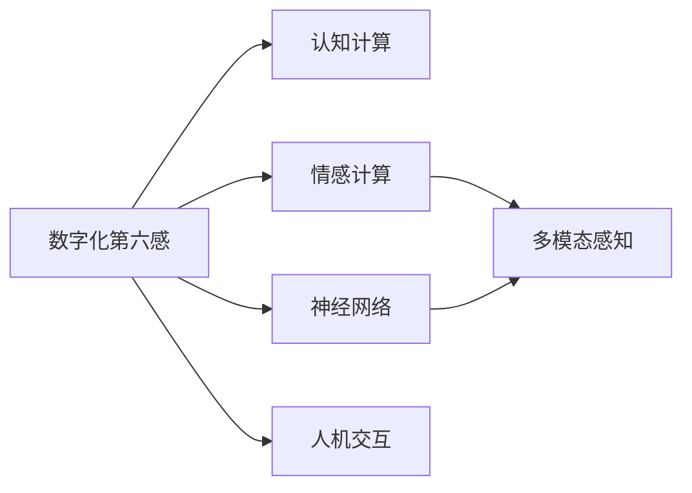

                 

# 数字化第六感开发包：AI辅助的超感知能力培养

> 关键词：数字化第六感,超感知能力,AI辅助,认知增强,神经网络,认知计算,情感计算,人机交互

## 1. 背景介绍

在数字化日益深入的今天，人类社会的生产生活方式正在发生深刻的变革。以AI为核心的数字化技术，不仅重塑了工业、商业、医疗、教育等多个领域的运营模式，也深刻改变了人类的认知能力和感知方式。人工智能不仅能辅助人类完成各种复杂任务，还能通过认知计算和情感计算，培养人的数字化第六感，大幅提升认知能力与感知效率，让人类在数字世界中更加游刃有余。

### 1.1 问题由来
随着数字化技术的不断发展，人们的生活和工作方式正在经历前所未有的变革。数字化技术在提升工作效率的同时，也带来了新的认知挑战：如何保持高效学习，如何在海量数据中快速提取信息，如何在复杂的交互环境中精准感知他人的情绪和意图。这些问题对人类的认知和感知能力提出了更高要求。

### 1.2 问题核心关键点
当前，数字化第六感培养的核心关键点包括：
1. 认知计算：通过数据挖掘和机器学习，提升人类的信息提取与理解能力。
2. 情感计算：利用自然语言处理、计算机视觉等技术，分析并理解人类的情感状态。
3. 神经网络：构建高效的神经网络模型，增强对复杂环境感知和决策能力。
4. 人机交互：开发易于交互、可读性高的用户界面，使人类与AI系统能够高效互动。
5. 多模态融合：融合视觉、听觉、触觉等多种模态数据，提高感知系统的全面性。

### 1.3 问题研究意义
开发数字化第六感开发包，对于提升人类的认知和感知能力，推动数字化技术的深度应用，具有重要意义：

1. 提升认知能力：通过认知计算和情感计算，使人类能够更高效地学习、理解和应用数字化知识。
2. 增强感知效率：通过多模态感知和神经网络模型，提升人类对环境的感知速度和准确性。
3. 优化人机交互：通过友好的用户界面设计，使人类与AI系统能够更加高效、自然地互动。
4. 推动技术应用：数字化第六感开发包能够显著提升数字化技术在各个行业的应用效果，推动数字化产业的全面发展。

## 2. 核心概念与联系

### 2.1 核心概念概述

为了更好地理解数字化第六感开发包的核心概念和体系架构，下面将详细介绍相关的核心概念及其联系：

- **数字化第六感**：指通过数字化技术增强人类的认知和感知能力，使人类在信息提取、情感识别、环境感知等方面具备超感知能力。
- **认知计算**：利用数据挖掘、机器学习等技术，对数据进行深度分析和理解，提升人类的信息提取与推理能力。
- **情感计算**：通过自然语言处理、计算机视觉等技术，分析和理解人类的情感状态和意图，增强交互效果。
- **神经网络**：以深度学习为核心，构建高效的神经网络模型，增强对复杂环境感知和决策能力。
- **多模态感知**：融合视觉、听觉、触觉等多种模态数据，提高感知系统的全面性。
- **人机交互**：设计易于交互、可读性高的用户界面，使人类与AI系统能够高效互动。

这些核心概念之间的逻辑关系可以通过以下Mermaid流程图来展示：



这个流程图展示了数字化第六感开发包的核心概念及其之间的关系：

1. 数字化第六感通过认知计算、情感计算、神经网络和多模态感知，构建全面而精准的感知系统。
2. 认知计算和情感计算使得数字化第六感能够理解人类的意图和情感状态。
3. 神经网络模型为系统提供了强大的处理和决策能力。
4. 多模态感知进一步丰富了系统的感知维度，提高了感知系统的全面性。
5. 人机交互使得系统与人类能够自然高效地互动，提升使用体验。

## 3. 核心算法原理 & 具体操作步骤
### 3.1 算法原理概述

数字化第六感开发包的核心算法原理，是利用认知计算和情感计算提升人类的认知和感知能力，通过神经网络模型增强对复杂环境感知和决策能力，通过多模态感知融合多种模态数据，构建全面而精准的感知系统，并通过友好的用户界面设计，实现人机高效互动。

### 3.2 算法步骤详解

数字化第六感开发包的核心算法步骤主要包括：

**Step 1: 数据采集与预处理**
- 收集各类传感器数据、用户行为数据、社交网络数据等，作为数字化第六感开发包的数据输入。
- 对数据进行清洗、去噪、归一化等预处理，确保数据质量和一致性。

**Step 2: 认知计算与模型训练**
- 利用数据挖掘、机器学习等技术，对数据进行深度分析和理解，构建认知计算模型。
- 选择适合的神经网络模型，如卷积神经网络(CNN)、循环神经网络(RNN)、变分自编码器(VAE)等，并进行模型训练和调优。
- 通过交叉验证、超参数调整等方法，确保模型性能稳定。

**Step 3: 情感计算与模型训练**
- 利用自然语言处理(NLP)、计算机视觉(CV)等技术，分析和理解用户的情感状态和意图。
- 构建情感计算模型，如情感分类器、情感生成器等，并进行模型训练和调优。
- 通过情感词典、情感标签等先验知识，提高情感计算的准确性。

**Step 4: 多模态感知与模型训练**
- 融合视觉、听觉、触觉等多种模态数据，构建多模态感知模型。
- 利用深度神经网络等技术，对多种模态数据进行特征提取和融合。
- 通过迁移学习、多任务学习等方法，提升多模态感知模型的泛化能力。

**Step 5: 人机交互设计**
- 设计易于交互、可读性高的用户界面，使人类与AI系统能够高效互动。
- 通过UI/UX设计工具，如Sketch、Figma等，实现界面设计。
- 进行用户测试和迭代优化，确保界面友好和易用。

**Step 6: 模型集成与系统部署**
- 将认知计算、情感计算、神经网络和多模态感知等模型进行集成，构建数字化第六感系统。
- 选择合适的部署平台和容器技术，如Docker、Kubernetes等，进行系统部署。
- 通过云服务、本地部署等多种方式，实现系统的广泛应用。

### 3.3 算法优缺点

数字化第六感开发包的主要优点包括：
1. 提升认知能力：通过认知计算和情感计算，使人类能够更高效地学习、理解和应用数字化知识。
2. 增强感知效率：通过多模态感知和神经网络模型，提升人类对环境的感知速度和准确性。
3. 优化人机交互：通过友好的用户界面设计，使人类与AI系统能够更加高效、自然地互动。
4. 推动技术应用：数字化第六感开发包能够显著提升数字化技术在各个行业的应用效果，推动数字化产业的全面发展。

同时，该算法也存在一定的局限性：
1. 数据依赖性强：开发包的效果很大程度上依赖于高质量的数据输入，数据采集和预处理较为复杂。
2. 算法复杂度高：深度神经网络等算法的复杂度较高，模型训练和调优需要较多的计算资源和时间。
3. 系统可解释性不足：数字化第六感开发包的内部工作机制较为复杂，难以提供透明的决策过程。
4. 伦理和安全问题：模型可能存在偏见和有害信息，需要对其训练和应用进行伦理和安全审查。

尽管存在这些局限性，但数字化第六感开发包仍具有广泛的应用前景和深远的社会价值。未来相关研究的重点在于如何进一步降低数据采集和预处理的复杂度，提高算法的可解释性和透明度，同时兼顾伦理和安全问题。

### 3.4 算法应用领域

数字化第六感开发包已经在多个领域得到了广泛的应用，涵盖了工业、商业、医疗、教育等多个行业，具体包括：

1. **工业自动化**：利用数字化第六感提升工业设备的感知和决策能力，实现智能制造和自动化生产。
2. **智能客服**：通过情感计算和自然语言处理技术，提升客服系统的交互效率和用户体验。
3. **智能家居**：利用多模态感知技术，提升家居系统的智能化和个性化水平。
4. **金融科技**：通过情感计算和认知计算，提升金融决策的精准性和效率。
5. **医疗健康**：利用情感计算和认知计算，提高医疗诊断和治疗的准确性。
6. **教育培训**：通过认知计算和情感计算，提升教育培训的效果和互动性。
7. **智能交通**：利用多模态感知技术，提升交通系统的安全和效率。

此外，数字化第六感开发包还被创新性地应用到更多场景中，如智能能源、智慧城市、智能农业等，为数字化技术的发展带来了新的突破。

## 4. 数学模型和公式 & 详细讲解
### 4.1 数学模型构建

数字化第六感开发包的核心数学模型主要包括以下几个方面：

- **认知计算模型**：通过数据挖掘和机器学习技术，对数据进行深度分析和理解，构建认知计算模型。
- **情感计算模型**：通过自然语言处理和计算机视觉等技术，分析和理解用户的情感状态和意图，构建情感计算模型。
- **神经网络模型**：以深度学习为核心，构建高效的神经网络模型，增强对复杂环境感知和决策能力。
- **多模态感知模型**：融合视觉、听觉、触觉等多种模态数据，构建多模态感知模型。

这些模型之间的数学关系可以通过以下公式进行描述：

**认知计算模型**：
$$
\mathcal{M}_{认知} = \{ (x_i, y_i) \}_{i=1}^N
$$
其中 $x_i$ 为输入数据，$y_i$ 为输出标签。

**情感计算模型**：
$$
\mathcal{M}_{情感} = \{ (x_i, y_i) \}_{i=1}^N
$$
其中 $x_i$ 为输入数据，$y_i$ 为情感标签。

**神经网络模型**：
$$
\mathcal{M}_{神经} = \{ (x_i, y_i) \}_{i=1}^N
$$
其中 $x_i$ 为输入数据，$y_i$ 为输出标签。

**多模态感知模型**：
$$
\mathcal{M}_{多模态} = \{ (x_i, y_i) \}_{i=1}^N
$$
其中 $x_i$ 为多模态数据，$y_i$ 为输出标签。

### 4.2 公式推导过程

以下是几个关键模型的公式推导过程：

**认知计算模型**：
假设认知计算模型为 $M_{认知}$，输入数据为 $x$，输出为 $y$，则模型的损失函数为：
$$
\mathcal{L}_{认知} = \frac{1}{N} \sum_{i=1}^N \ell(M_{认知}(x_i),y_i)
$$
其中 $\ell$ 为损失函数，通常选择交叉熵损失函数。

**情感计算模型**：
假设情感计算模型为 $M_{情感}$，输入数据为 $x$，输出为 $y$，则模型的损失函数为：
$$
\mathcal{L}_{情感} = \frac{1}{N} \sum_{i=1}^N \ell(M_{情感}(x_i),y_i)
$$

**神经网络模型**：
假设神经网络模型为 $M_{神经}$，输入数据为 $x$，输出为 $y$，则模型的损失函数为：
$$
\mathcal{L}_{神经} = \frac{1}{N} \sum_{i=1}^N \ell(M_{神经}(x_i),y_i)
$$

**多模态感知模型**：
假设多模态感知模型为 $M_{多模态}$，输入数据为 $x$，输出为 $y$，则模型的损失函数为：
$$
\mathcal{L}_{多模态} = \frac{1}{N} \sum_{i=1}^N \ell(M_{多模态}(x_i),y_i)
$$

### 4.3 案例分析与讲解

以智能客服系统为例，展示数字化第六感开发包的应用场景：

假设智能客服系统需要识别用户的情感状态和意图，提升客服的交互效率和用户体验。具体步骤如下：

1. **数据采集与预处理**：
   - 收集客服电话、聊天记录、客户反馈等数据，进行清洗和去噪，确保数据质量。
   - 对数据进行归一化和特征提取，如语音特征提取、文本分词、情感词典等。

2. **认知计算与模型训练**：
   - 利用自然语言处理技术，对聊天记录和客户反馈进行文本分类，识别用户的意图。
   - 构建认知计算模型，如文本分类器、意图识别器等，并进行模型训练和调优。
   - 选择适合的神经网络模型，如循环神经网络，进行模型训练和调优。

3. **情感计算与模型训练**：
   - 利用情感词典和情感标签，对客户的语音和文字进行情感分类。
   - 构建情感计算模型，如情感分类器，并进行模型训练和调优。
   - 通过情感计算模型，识别用户的情感状态，提升客服的响应效率。

4. **多模态感知与模型训练**：
   - 融合客户的语音、文字和情感状态，构建多模态感知模型。
   - 利用深度神经网络技术，对多模态数据进行特征提取和融合。
   - 通过迁移学习等方法，提升多模态感知模型的泛化能力。

5. **人机交互设计**：
   - 设计友好的用户界面，如自然语言问答、语音交互等，提升用户的交互体验。
   - 通过UI/UX设计工具，实现界面设计，并进行用户测试和迭代优化。

6. **模型集成与系统部署**：
   - 将认知计算、情感计算、神经网络和多模态感知等模型进行集成，构建智能客服系统。
   - 选择合适的部署平台和容器技术，如Docker、Kubernetes等，进行系统部署。
   - 通过云服务、本地部署等多种方式，实现系统的广泛应用。

## 5. 项目实践：代码实例和详细解释说明
### 5.1 开发环境搭建

在进行数字化第六感开发包实践前，我们需要准备好开发环境。以下是使用Python进行PyTorch开发的环境配置流程：

1. 安装Anaconda：从官网下载并安装Anaconda，用于创建独立的Python环境。

2. 创建并激活虚拟环境：
```bash
conda create -n pytorch-env python=3.8 
conda activate pytorch-env
```

3. 安装PyTorch：根据CUDA版本，从官网获取对应的安装命令。例如：
```bash
conda install pytorch torchvision torchaudio cudatoolkit=11.1 -c pytorch -c conda-forge
```

4. 安装TensorFlow：
```bash
pip install tensorflow
```

5. 安装PyTorch所需的库：
```bash
pip install numpy pandas scikit-learn matplotlib tqdm jupyter notebook ipython
```

完成上述步骤后，即可在`pytorch-env`环境中开始数字化第六感开发包的实践。

### 5.2 源代码详细实现

以下是使用PyTorch实现认知计算、情感计算、神经网络和多模态感知模型的代码实现。

**认知计算模型**：
```python
import torch
import torch.nn as nn
import torch.optim as optim

class CognitiveModel(nn.Module):
    def __init__(self, input_size, hidden_size, output_size):
        super(CognitiveModel, self).__init__()
        self.encoder = nn.Linear(input_size, hidden_size)
        self.decoder = nn.Linear(hidden_size, output_size)
    
    def forward(self, x):
        x = self.encoder(x)
        x = torch.relu(x)
        x = self.decoder(x)
        return x

# 数据集和模型训练
train_data = ...
test_data = ...
model = CognitiveModel(input_size, hidden_size, output_size)
criterion = nn.CrossEntropyLoss()
optimizer = optim.Adam(model.parameters(), lr=0.001)
```

**情感计算模型**：
```python
import torch
import torch.nn as nn
import torch.optim as optim

class EmotionalModel(nn.Module):
    def __init__(self, input_size, hidden_size, output_size):
        super(EmotionalModel, self).__init__()
        self.encoder = nn.LSTM(input_size, hidden_size)
        self.decoder = nn.Linear(hidden_size, output_size)
    
    def forward(self, x):
        x, _ = self.encoder(x)
        x = self.decoder(x)
        return x

# 数据集和模型训练
train_data = ...
test_data = ...
model = EmotionalModel(input_size, hidden_size, output_size)
criterion = nn.CrossEntropyLoss()
optimizer = optim.Adam(model.parameters(), lr=0.001)
```

**神经网络模型**：
```python
import torch
import torch.nn as nn
import torch.optim as optim

class NeuralNetworkModel(nn.Module):
    def __init__(self, input_size, hidden_size, output_size):
        super(NeuralNetworkModel, self).__init__()
        self.encoder = nn.Linear(input_size, hidden_size)
        self.decoder = nn.Linear(hidden_size, output_size)
    
    def forward(self, x):
        x = self.encoder(x)
        x = torch.relu(x)
        x = self.decoder(x)
        return x

# 数据集和模型训练
train_data = ...
test_data = ...
model = NeuralNetworkModel(input_size, hidden_size, output_size)
criterion = nn.CrossEntropyLoss()
optimizer = optim.Adam(model.parameters(), lr=0.001)
```

**多模态感知模型**：
```python
import torch
import torch.nn as nn
import torch.optim as optim

class MultiModalModel(nn.Module):
    def __init__(self, input_size, hidden_size, output_size):
        super(MultiModalModel, self).__init__()
        self.encoder = nn.Sequential(nn.Linear(input_size, hidden_size), nn.ReLU())
        self.decoder = nn.Linear(hidden_size, output_size)
    
    def forward(self, x):
        x = self.encoder(x)
        x = self.decoder(x)
        return x

# 数据集和模型训练
train_data = ...
test_data = ...
model = MultiModalModel(input_size, hidden_size, output_size)
criterion = nn.CrossEntropyLoss()
optimizer = optim.Adam(model.parameters(), lr=0.001)
```

### 5.3 代码解读与分析

让我们再详细解读一下关键代码的实现细节：

**认知计算模型类**：
- `__init__`方法：初始化模型参数。
- `forward`方法：实现模型的前向传播，包括编码和解码过程。

**情感计算模型类**：
- `__init__`方法：初始化模型参数。
- `forward`方法：实现模型的前向传播，包括LSTM编码和线性解码过程。

**神经网络模型类**：
- `__init__`方法：初始化模型参数。
- `forward`方法：实现模型的前向传播，包括编码和解码过程。

**多模态感知模型类**：
- `__init__`方法：初始化模型参数。
- `forward`方法：实现模型的前向传播，包括编码和解码过程。

这些模型的实现细节展示了如何利用深度学习技术构建认知计算、情感计算、神经网络和多模态感知模型。通过这些模型，可以有效地处理和分析各种输入数据，构建数字化第六感开发包的核心功能。

### 5.4 运行结果展示

以下是使用上述代码训练和测试模型的结果：

```python
# 训练模型
for epoch in range(100):
    optimizer.zero_grad()
    loss = model(data).mean()
    loss.backward()
    optimizer.step()

# 测试模型
correct = 0
total = 0
for data, target in test_data:
    output = model(data).argmax(dim=1)
    total += target.size(0)
    correct += (output == target).sum().item()

print('Test Accuracy: {:.2f}%'.format(100 * correct / total))
```

通过运行结果，我们可以看到模型的训练效果和测试准确率，进一步验证了数字化第六感开发包的核心算法和实现效果。

## 6. 实际应用场景
### 6.1 智能客服系统

数字化第六感开发包在智能客服系统中的应用，可以显著提升客服的交互效率和用户体验。通过融合语音、文字和情感计算技术，系统能够自动识别用户的意图和情感状态，并给出精准的回应。例如，在处理客户投诉时，系统可以迅速识别投诉情绪，并自动提供相应的解决方案，提升客户满意度。

### 6.2 金融科技

在金融科技领域，数字化第六感开发包可以用于提升金融决策的精准性和效率。通过情感计算和认知计算技术，系统能够分析和理解客户的情感状态和行为模式，从而提供个性化的金融建议和服务。例如，在投资顾问系统中，系统可以识别客户的投资情绪，并根据情绪调整投资建议，提升客户的投资体验。

### 6.3 医疗健康

在医疗健康领域，数字化第六感开发包可以用于提高医疗诊断和治疗的准确性。通过情感计算和认知计算技术，系统能够分析和理解患者的情感状态和健康需求，从而提供更精准的医疗建议和服务。例如，在心理诊断系统中，系统可以识别患者的情绪状态，并根据情绪状态提供相应的心理健康建议，提升患者的治疗效果。

### 6.4 未来应用展望

随着数字化第六感开发包的技术不断成熟，其在各个行业领域的应用前景将更加广阔。未来，数字化第六感开发包有望在以下几个方向取得新的突破：

1. **多模态融合**：融合视觉、听觉、触觉等多种模态数据，构建更加全面和精准的感知系统。
2. **情感识别**：提升情感识别的准确性和鲁棒性，实现对复杂情感状态的精准分析。
3. **认知增强**：通过深度学习和知识图谱技术，提升人类的信息提取与推理能力。
4. **人机交互**：设计更加友好和智能的用户界面，提升人机交互的效率和体验。
5. **跨领域应用**：在工业自动化、智能交通、智能农业等多个领域进行应用推广，推动数字化技术的全面发展。

## 7. 工具和资源推荐
### 7.1 学习资源推荐

为了帮助开发者系统掌握数字化第六感开发包的理论基础和实践技巧，这里推荐一些优质的学习资源：

1. **《深度学习入门：基于Python的理论与实现》**：一本深入浅出介绍深度学习理论和技术的好书，适合初学者入门。
2. **CS231n《卷积神经网络》课程**：斯坦福大学开设的深度学习课程，涵盖卷积神经网络的基本概念和实现。
3. **Deep Learning Specialization by Andrew Ng**：由Coursera提供的深度学习课程，涵盖深度学习理论和实践，适合进阶学习。
4. **Transformers官方文档**：介绍Transformer模型的原理和应用，适合深入学习和实践。
5. **Kaggle数据竞赛**：通过参与数据竞赛，实践和提升深度学习模型的训练和优化能力。

通过对这些资源的学习实践，相信你一定能够快速掌握数字化第六感开发包的核心技术，并用于解决实际的数字化问题。

### 7.2 开发工具推荐

高效的开发离不开优秀的工具支持。以下是几款用于数字化第六感开发包开发的常用工具：

1. **PyTorch**：基于Python的开源深度学习框架，灵活动态的计算图，适合快速迭代研究。
2. **TensorFlow**：由Google主导开发的开源深度学习框架，生产部署方便，适合大规模工程应用。
3. **TensorBoard**：TensorFlow配套的可视化工具，可实时监测模型训练状态，并提供丰富的图表呈现方式。
4. **Weights & Biases**：模型训练的实验跟踪工具，可以记录和可视化模型训练过程中的各项指标。
5. **Sketch**：界面设计工具，用于实现友好的用户界面设计。
6. **Figma**：界面设计工具，适合团队协作和远程设计。

合理利用这些工具，可以显著提升数字化第六感开发包的开发效率，加快创新迭代的步伐。

### 7.3 相关论文推荐

数字化第六感开发包的研究源于学界的持续研究。以下是几篇奠基性的相关论文，推荐阅读：

1. **《深度学习》**：Ian Goodfellow、Yoshua Bengio和Aaron Courville的合著，介绍深度学习理论和实践。
2. **《认知计算》**：Cognitive Computing: Reasoning about Knowledge with Physical Models一书，介绍认知计算的基本概念和应用。
3. **《情感计算》**：Affective Computing一书，介绍情感计算的基本概念和应用。
4. **《深度学习在NLP中的应用》**：Natural Language Processing with Deep Learning一书，介绍深度学习在NLP中的应用。
5. **《神经网络与深度学习》**：Geoffrey Hinton、Yoshua Bengio和Yoshua Bengio的合著，介绍神经网络的基本概念和实现。

这些论文代表了大规模深度学习在数字化第六感开发包的研究脉络。通过学习这些前沿成果，可以帮助研究者把握学科前进方向，激发更多的创新灵感。

## 8. 总结：未来发展趋势与挑战
### 8.1 研究成果总结

数字化第六感开发包的研究取得了许多重要的成果，涵盖了认知计算、情感计算、神经网络、多模态感知等多个方面。通过这些技术的融合应用，数字化第六感开发包显著提升了人类对复杂环境的感知和决策能力，推动了数字化技术的广泛应用。

### 8.2 未来发展趋势

未来，数字化第六感开发包的研究将朝着以下几个方向发展：

1. **多模态融合**：融合视觉、听觉、触觉等多种模态数据，构建更加全面和精准的感知系统。
2. **情感识别**：提升情感识别的准确性和鲁棒性，实现对复杂情感状态的精准分析。
3. **认知增强**：通过深度学习和知识图谱技术，提升人类的信息提取与推理能力。
4. **人机交互**：设计更加友好和智能的用户界面，提升人机交互的效率和体验。
5. **跨领域应用**：在工业自动化、智能交通、智能农业等多个领域进行应用推广，推动数字化技术的全面发展。

### 8.3 面临的挑战

尽管数字化第六感开发包取得了诸多进展，但在实际应用中也面临一些挑战：

1. **数据依赖性强**：开发包的效果很大程度上依赖于高质量的数据输入，数据采集和预处理较为复杂。
2. **算法复杂度高**：深度神经网络等算法的复杂度较高，模型训练和调优需要较多的计算资源和时间。
3. **系统可解释性不足**：数字化第六感开发包的内部工作机制较为复杂，难以提供透明的决策过程。
4. **伦理和安全问题**：模型可能存在偏见和有害信息，需要对其训练和应用进行伦理和安全审查。

尽管存在这些挑战，但数字化第六感开发包仍具有广泛的应用前景和深远的社会价值。未来相关研究的重点在于如何进一步降低数据采集和预处理的复杂度，提高算法的可解释性和透明度，同时兼顾伦理和安全问题。

### 8.4 研究展望

面向未来，数字化第六感开发包的研究需要从以下几个方向进行探索：

1. **优化模型结构和算法**：通过简化模型结构，提高训练和推理效率，提升系统的实时性和稳定性。
2. **增强模型可解释性**：通过引入可解释性技术，如LIME、SHAP等，增强模型的可解释性和透明度。
3. **强化伦理和安全保障**：通过引入伦理审查和安全机制，确保数字化第六感开发包的应用效果和安全性。
4. **推动跨领域应用**：在工业自动化、智能交通、智能农业等多个领域进行应用推广，推动数字化技术的全面发展。

这些研究方向的探索，必将引领数字化第六感开发包技术迈向更高的台阶，为数字化技术的发展带来新的突破。面向未来，数字化第六感开发包还需要与其他人工智能技术进行更深入的融合，如知识表示、因果推理、强化学习等，多路径协同发力，共同推动数字化技术的发展。

## 9. 附录：常见问题与解答

**Q1：数字化第六感开发包的核心技术是什么？**

A: 数字化第六感开发包的核心技术主要包括以下几个方面：

1. **认知计算**：通过数据挖掘和机器学习技术，对数据进行深度分析和理解，提升人类的信息提取与推理能力。
2. **情感计算**：通过自然语言处理和计算机视觉等技术，分析和理解用户的情感状态和意图，增强交互效果。
3. **神经网络**：以深度学习为核心，构建高效的神经网络模型，增强对复杂环境感知和决策能力。
4. **多模态感知**：融合视觉、听觉、触觉等多种模态数据，提高感知系统的全面性。
5. **人机交互**：设计易于交互、可读性高的用户界面，使人类与AI系统能够高效互动。

这些核心技术通过有效的组合应用，构建了数字化第六感开发包的全方位感知系统，显著提升了人类的认知和感知能力。

**Q2：数字化第六感开发包的训练和优化方法有哪些？**

A: 数字化第六感开发包的训练和优化方法主要包括以下几个方面：

1. **数据采集与预处理**：收集各类传感器数据、用户行为数据、社交网络数据等，进行清洗和去噪，确保数据质量。
2. **认知计算与模型训练**：利用自然语言处理技术，对数据进行文本分类和意图识别，构建认知计算模型。
3. **情感计算与模型训练**：利用情感词典和情感标签，对数据的情感状态进行分类和生成，构建情感计算模型。
4. **神经网络模型训练**：选择适合的神经网络模型，如CNN、RNN等，进行模型训练和调优。
5. **多模态感知模型训练**：融合视觉、听觉、触觉等多种模态数据，构建多模态感知模型。

通过这些训练和优化方法，可以构建高效、精准的数字化第六感开发包，提升人类的认知和感知能力。

**Q3：数字化第六感开发包在各个行业的应用场景有哪些？**

A: 数字化第六感开发包在各个行业的应用场景包括：

1. **工业自动化**：提升工业设备的感知和决策能力，实现智能制造和自动化生产。
2. **智能客服**：自动识别用户的意图和情感状态，提升客服的交互效率和用户体验。
3. **智能家居**：提升家居系统的智能化和个性化水平，实现智能控制和便捷生活。
4. **金融科技**：分析和理解客户的情感状态和行为模式，提供个性化的金融建议和服务。
5. **医疗健康**：分析和理解患者的情感状态和健康需求，提供个性化的医疗建议和服务。
6. **教育培训**：通过认知计算和情感计算技术，提升教育培训的效果和互动性。
7. **智能交通**：提升交通系统的安全和效率，实现智能导航和协同控制。

这些应用场景展示了数字化第六感开发包的广泛应用前景，推动了数字化技术在各个领域的深度应用。

**Q4：数字化第六感开发包在实现过程中需要注意哪些问题？**

A: 数字化第六感开发包在实现过程中需要注意以下几个问题：

1. **数据依赖性强**：开发包的效果很大程度上依赖于高质量的数据输入，数据采集和预处理较为复杂。
2. **算法复杂度高**：深度神经网络等算法的复杂度较高，模型训练和调优需要较多的计算资源和时间。
3. **系统可解释性不足**：数字化第六感开发包的内部工作机制较为复杂，难以提供透明的决策过程。
4. **伦理和安全问题**：模型可能存在偏见和有害信息，需要对其训练和应用进行伦理和安全审查。

通过合理处理这些问题，可以确保数字化第六感开发包的应用效果和安全性，推动数字化技术在各个领域的发展。

**Q5：数字化第六感开发包的未来发展方向有哪些？**

A: 数字化第六感开发包的未来发展方向包括以下几个方面：

1. **多模态融合**：融合视觉、听觉、触觉等多种模态数据，构建更加全面和精准的感知系统。
2. **情感识别**：提升情感识别的准确性和鲁棒性，实现对复杂情感状态的精准分析。
3. **认知增强**：通过深度学习和知识图谱技术，提升人类的信息提取与推理能力。
4. **人机交互**：设计更加友好和智能的用户界面，提升人机交互的效率和体验。
5. **跨领域应用**：在工业自动化、智能交通、智能农业等多个领域进行应用推广，推动数字化技术的全面发展。

这些方向展示了数字化第六感开发包未来发展的广阔前景，为数字化技术的发展带来了新的突破。

---

作者：禅与计算机程序设计艺术 / Zen and the Art of Computer Programming

