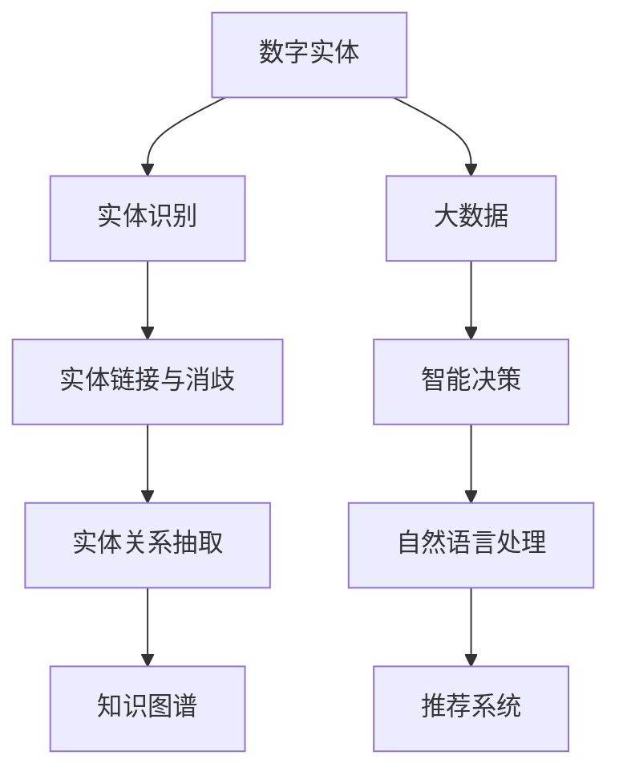

                 

# 数字实体的自动化应用与发展

> 关键词：数字实体、自动化、应用、发展、计算机技术、人工智能、机器学习、数据处理、大数据

## 1. 背景介绍

### 1.1 问题由来

随着互联网技术的飞速发展和数据的爆发式增长，数字实体的数量和重要性日益凸显。数字实体是指在数字世界中能够被准确描述和处理的基本单元，例如人名、地名、组织机构名、日期时间等。在数字实体的自动化处理方面，如何高效、准确地识别、提取和应用数字实体，成为了许多行业亟需解决的重要问题。

### 1.2 问题核心关键点

当前数字实体自动化处理的挑战主要集中在以下几个方面：

- 实体识别精度：如何提高数字实体识别的准确性和鲁棒性，特别是在非结构化数据和复杂背景下的识别能力。
- 实体链接与消歧：如何精确地将实体识别结果与知识库中的实体进行链接，解决命名实体消歧问题，避免实体混淆。
- 实体关系的抽取：如何从文本中抽取实体间的关系，构建实体网络，为后续的智能应用提供数据支撑。
- 实体的应用与发展：如何将数字实体与具体的应用场景相结合，例如在自然语言处理、知识图谱构建、信息抽取等方向上的应用和创新。

### 1.3 问题研究意义

数字实体自动化处理的研究，对于推动信息自动化、智能决策、大数据应用等多个领域具有重要意义：

- 提升信息自动化处理效率：通过自动化处理数字实体，可以实现文本的快速预处理和信息抽取，加速数据处理流程。
- 促进智能决策系统发展：数字实体链接和关系抽取可以为智能决策提供数据支撑，提升决策的准确性和智能性。
- 推动大数据应用创新：数字实体作为数据的组成部分，其高效自动化处理可以进一步促进大数据分析、挖掘和应用。
- 助力智能语言模型发展：数字实体的自动化处理是构建智能语言模型和推荐系统的重要基础。

## 2. 核心概念与联系

### 2.1 核心概念概述

为更好地理解数字实体的自动化应用与发展，本节将介绍几个密切相关的核心概念：

- **数字实体（Digital Entity）**：指在数字世界中被准确描述的基本单元，如人名、地名、组织机构名、日期时间等。
- **实体识别（Named Entity Recognition, NER）**：指在文本中自动识别出特定类别的实体，通常分为基于规则的方法和基于机器学习的方法。
- **实体链接与消歧（Entity Linking and Disambiguation）**：将实体识别结果与知识库中的实体进行链接，解决同名异义或异名同义的实体混淆问题。
- **实体关系抽取（Relation Extraction）**：从文本中抽取实体间的关系，构建实体网络，为后续的应用提供支撑。
- **知识图谱（Knowledge Graph）**：将实体和关系构建为图形结构，用于存储、查询和管理知识。

这些核心概念之间的逻辑关系可以通过以下Mermaid流程图来展示：



这个流程图展示了大数字实体自动化处理的关键概念及其之间的关系：

1. 数字实体通过实体识别获取，然后经过实体链接与消歧，构建实体关系，最终与知识图谱相结合，形成完整的知识表示。
2. 大数据在实体识别和链接消歧的过程中被广泛应用，为实体抽取和知识图谱构建提供数据支撑。
3. 实体关系抽取和知识图谱在自然语言处理、推荐系统、智能决策等多个应用中发挥重要作用。

## 3. 核心算法原理 & 具体操作步骤
### 3.1 算法原理概述

数字实体的自动化处理主要涉及实体识别、实体链接与消歧、实体关系抽取等多个子任务。这些任务通常通过深度学习技术来实现，算法原理主要包括：

- **实体识别（NER）**：基于机器学习的方法，通过训练序列标注模型，识别出文本中的实体类别。
- **实体链接与消歧（ELD）**：结合知识图谱和语义相似度计算，解决命名实体消歧问题，将实体识别结果与知识库中的实体进行链接。
- **实体关系抽取（RE）**：通过训练关系抽取模型，从文本中提取实体间的关系，构建实体网络。

### 3.2 算法步骤详解

以下分别介绍实体识别、实体链接与消歧、实体关系抽取的详细算法步骤：

#### 3.2.1 实体识别（NER）

**步骤1：数据预处理**
- 清洗并标准化文本数据，去除噪声和无关信息。
- 分词并构建词汇表，标记实体类别标签。

**步骤2：模型训练**
- 使用序列标注模型（如BiLSTM-CRF、BERT）进行训练，定义实体类别标签。
- 使用交叉熵损失函数，训练模型最大化准确率。

**步骤3：实体识别**
- 将待识别文本输入模型，输出实体识别结果。
- 过滤掉不符合实体规则的候选结果。

#### 3.2.2 实体链接与消歧（ELD）

**步骤1：构建知识库**
- 收集和整理领域相关的实体和关系数据，构建知识图谱。
- 使用开放数据集如Freebase、DBpedia等。

**步骤2：实体匹配**
- 使用TF-IDF、余弦相似度、Word2Vec等方法计算实体向量。
- 计算实体与知识库中实体的相似度，选出候选链接。

**步骤3：消歧**
- 使用基于规则的方法或机器学习方法，解决同名异义或异名同义的实体混淆问题。
- 结合上下文信息，使用信息抽取方法进行消歧。

#### 3.2.3 实体关系抽取（RE）

**步骤1：数据预处理**
- 分词、词性标注，识别出文本中的实体和关系。
- 构建关系抽取模板。

**步骤2：模型训练**
- 使用结构化标注数据集进行训练，定义实体关系类别标签。
- 使用损失函数（如Max-Margin Loss、Transductive Loss）训练模型。

**步骤3：关系抽取**
- 将待抽取文本输入模型，输出实体间的关系。
- 过滤掉不符合关系规则的候选结果。

### 3.3 算法优缺点

数字实体自动化处理的算法具有以下优点：

- **高效性**：深度学习模型可以快速处理大规模文本数据，实现高效自动化处理。
- **准确性**：基于机器学习的方法可以通过大量标注数据训练出高精度的实体识别模型。
- **通用性**：算法可以应用于多种类型的数字实体，包括人名、地名、组织机构名、日期时间等。
- **可扩展性**：通过不断更新知识库和训练数据，算法可以适应新的领域和任务。

同时，这些算法也存在一定的局限性：

- **依赖标注数据**：需要大量的标注数据进行模型训练，对于标注成本高、标注质量差的领域，可能效果不理想。
- **鲁棒性不足**：在非结构化数据和复杂背景下的实体识别准确性有待提高。
- **计算资源消耗大**：深度学习模型通常需要较大的计算资源，训练和推理时间较长。
- **模型泛化能力有限**：在大规模知识库覆盖不足的情况下，实体链接与消歧的准确性可能受限。

### 3.4 算法应用领域

数字实体自动化处理的算法已经在多个领域得到了广泛应用，例如：

- **自然语言处理（NLP）**：用于文本分析、情感分析、机器翻译、问答系统等任务，提取文本中的实体信息。
- **知识图谱构建**：将实体和关系抽取结果构建成知识图谱，提供结构化的知识存储和查询。
- **信息抽取（Information Extraction, IE）**：从非结构化文本中提取结构化信息，支持决策支持和智能分析。
- **推荐系统（Recommendation Systems）**：通过提取用户和物品的属性和关系，推荐相关物品或信息。
- **智能决策（Intelligent Decision Making）**：结合实体识别和关系抽取结果，辅助智能决策系统做出精准决策。

## 4. 数学模型和公式 & 详细讲解  
### 4.1 数学模型构建

在数字实体自动化处理中，数学模型主要涉及序列标注、向量表示、相似度计算等多个方面。

#### 4.1.1 序列标注模型

序列标注模型常用于实体识别任务，通常采用条件随机场（Conditional Random Field, CRF）或双向长短时记忆网络（Bidirectional Long Short-Term Memory, BiLSTM）等方法。

以BiLSTM-CRF模型为例，其数学模型构建如下：

- **输入**：文本序列 $(x_1, x_2, \ldots, x_n)$ 和标签序列 $(y_1, y_2, \ldots, y_n)$。
- **模型输出**：模型预测的标签序列 $\hat{y}$。

其中，$x_i$ 表示文本中的第 $i$ 个词，$y_i$ 表示对应实体类别标签，$\hat{y}$ 表示模型预测的实体类别序列。

模型定义如下：

$$
P(y \mid x) = \prod_{i=1}^{n} P(y_i \mid x_i, y_{i-1})
$$

其中，$P(y_i \mid x_i, y_{i-1})$ 表示给定上下文 $x_{i-1}, x_i$ 和前一标签 $y_{i-1}$，当前标签 $y_i$ 的条件概率。

#### 4.1.2 向量表示与相似度计算

实体链接与消歧通常使用向量表示和相似度计算方法，常用的向量表示方法包括Word2Vec、GloVe、BERT等。

以BERT模型为例，其向量表示和相似度计算过程如下：

- **向量表示**：将实体输入BERT模型，输出高维向量表示。
- **相似度计算**：计算实体向量之间的余弦相似度，选出候选链接。

余弦相似度计算公式如下：

$$
sim(\mathbf{u}, \mathbf{v}) = \frac{\mathbf{u} \cdot \mathbf{v}}{\|\mathbf{u}\| \cdot \|\mathbf{v}\|}
$$

其中，$\mathbf{u}$ 和 $\mathbf{v}$ 分别为两个实体的向量表示。

#### 4.1.3 关系抽取模型

关系抽取模型常用于抽取实体间的关系，通常采用结构化标注数据集进行训练，使用关系抽取模板进行推理。

以基于知识图谱的关系抽取为例，其数学模型构建如下：

- **输入**：文本序列 $(x_1, x_2, \ldots, x_n)$ 和关系标签序列 $(r_1, r_2, \ldots, r_n)$。
- **模型输出**：模型预测的关系序列 $\hat{r}$。

其中，$x_i$ 表示文本中的第 $i$ 个词，$r_i$ 表示对应实体间的关系标签，$\hat{r}$ 表示模型预测的关系序列。

模型定义如下：

$$
P(r \mid x) = \prod_{i=1}^{n} P(r_i \mid x_i, \mathbf{R})
$$

其中，$P(r_i \mid x_i, \mathbf{R})$ 表示给定上下文 $x_{i-1}, x_i$ 和关系类型 $\mathbf{R}$，当前关系 $r_i$ 的条件概率。

### 4.2 公式推导过程

以下以实体识别和实体链接与消歧为例，进行详细公式推导：

#### 4.2.1 实体识别（NER）

**序列标注模型的推导**

以BiLSTM-CRF模型为例，其前向传播和后向传播过程如下：

- **前向传播**：计算每个位置 $i$ 的条件概率 $P(y_i \mid x_i, y_{i-1})$。
- **后向传播**：计算每个位置 $i$ 的条件概率 $P(y_{i-1} \mid y_i, x_i)$。

联合前向和后向传播，得到全局概率 $P(y \mid x)$：

$$
P(y \mid x) = \frac{\prod_{i=1}^{n} P(y_i \mid x_i, y_{i-1}) P(y_{i-1} \mid y_i, x_i)}{Z}
$$

其中，$Z$ 为归一化常数。

**模型的损失函数**

序列标注模型的损失函数通常采用交叉熵损失函数：

$$
\mathcal{L} = -\frac{1}{N} \sum_{i=1}^{N} \sum_{y_i \in \mathcal{Y}} p(y_i) \log q(y_i)
$$

其中，$p(y_i)$ 表示真实标签 $y_i$ 的概率分布，$q(y_i)$ 表示模型预测的标签概率分布。

#### 4.2.2 实体链接与消歧（ELD）

**实体匹配的推导**

实体匹配通常使用TF-IDF、余弦相似度等方法计算向量表示，选定候选链接。

以TF-IDF为例，其推导过程如下：

- **TF-IDF计算**：计算文本中每个词的TF-IDF值。
- **向量表示**：将TF-IDF值进行归一化，得到文本的向量表示。

向量表示的计算公式如下：

$$
\mathbf{v} = \frac{\mathbf{t} \cdot \mathbf{d}}{\|\mathbf{d}\|}
$$

其中，$\mathbf{t}$ 表示文本向量，$\mathbf{d}$ 表示文档向量，$\|\mathbf{d}\|$ 表示文档向量范数。

**消歧的推导**

消歧通常使用基于规则的方法或机器学习方法，结合上下文信息进行判断。

以基于规则的方法为例，其推导过程如下：

- **规则定义**：定义实体消歧的规则，例如优先选择最常见的实体类型。
- **规则应用**：将规则应用于候选链接，选择最符合规则的实体。

### 4.3 案例分析与讲解

以实体识别在医疗领域的应用为例，进行分析讲解：

**医疗文本的预处理**

在医疗文本中，实体识别首先需要对文本进行清洗和标准化，去除噪声和无关信息。

具体步骤如下：

- **去除停用词**：去除常见的停用词和无意义的字符。
- **分词**：使用中文分词工具，如jieba，对文本进行分词。
- **标准化**：对分词结果进行标准化，例如将“2019-12-31”转换为“2019-12-31”。

**实体识别模型的构建**

在构建实体识别模型时，通常采用BiLSTM-CRF模型。

具体步骤如下：

- **模型选择**：选择BiLSTM-CRF模型，定义实体类别标签。
- **模型训练**：使用医疗领域标注数据集进行训练，最大化准确率。
- **实体识别**：将待识别文本输入模型，输出实体识别结果。

**实体链接与消歧**

在实体链接与消歧过程中，通常使用知识图谱作为实体链接的依据。

具体步骤如下：

- **知识库构建**：收集和整理医疗领域相关的实体和关系数据，构建知识图谱。
- **实体匹配**：使用TF-IDF、余弦相似度等方法计算实体向量，选出候选链接。
- **消歧**：结合上下文信息，使用基于规则的方法或机器学习方法，解决同名异义或异名同义的实体混淆问题。

## 5. 项目实践：代码实例和详细解释说明
### 5.1 开发环境搭建

在进行数字实体自动化处理的项目实践前，需要先准备好开发环境。以下是使用Python进行PyTorch开发的环境配置流程：

1. 安装Anaconda：从官网下载并安装Anaconda，用于创建独立的Python环境。

2. 创建并激活虚拟环境：
```bash
conda create -n pytorch-env python=3.8 
conda activate pytorch-env
```

3. 安装PyTorch：根据CUDA版本，从官网获取对应的安装命令。例如：
```bash
conda install pytorch torchvision torchaudio cudatoolkit=11.1 -c pytorch -c conda-forge
```

4. 安装Transformers库：
```bash
pip install transformers
```

5. 安装各类工具包：
```bash
pip install numpy pandas scikit-learn matplotlib tqdm jupyter notebook ipython
```

完成上述步骤后，即可在`pytorch-env`环境中开始项目实践。

### 5.2 源代码详细实现

以下是使用PyTorch对BERT模型进行实体识别的完整代码实现。

```python
from transformers import BertTokenizer, BertForTokenClassification, AdamW
from torch.utils.data import DataLoader, Dataset
from tqdm import tqdm

class ERDataset(Dataset):
    def __init__(self, texts, tags, tokenizer):
        self.texts = texts
        self.tags = tags
        self.tokenizer = tokenizer
        self.max_len = 128
        
    def __len__(self):
        return len(self.texts)
    
    def __getitem__(self, item):
        text = self.texts[item]
        tags = self.tags[item]
        
        encoding = self.tokenizer(text, return_tensors='pt', max_length=self.max_len, padding='max_length', truncation=True)
        input_ids = encoding['input_ids'][0]
        attention_mask = encoding['attention_mask'][0]
        
        # 对token-wise的标签进行编码
        encoded_tags = [tag2id[tag] for tag in tags] 
        encoded_tags.extend([tag2id['O']] * (self.max_len - len(encoded_tags)))
        labels = torch.tensor(encoded_tags, dtype=torch.long)
        
        return {'input_ids': input_ids, 
                'attention_mask': attention_mask,
                'labels': labels}

# 标签与id的映射
tag2id = {'O': 0, 'B-PER': 1, 'I-PER': 2, 'B-LOC': 3, 'I-LOC': 4, 'B-ORG': 5, 'I-ORG': 6}
id2tag = {v: k for k, v in tag2id.items()}

# 创建dataset
tokenizer = BertTokenizer.from_pretrained('bert-base-cased')

train_dataset = ERDataset(train_texts, train_tags, tokenizer)
dev_dataset = ERDataset(dev_texts, dev_tags, tokenizer)
test_dataset = ERDataset(test_texts, test_tags, tokenizer)

# 模型选择和初始化
model = BertForTokenClassification.from_pretrained('bert-base-cased', num_labels=len(tag2id))

# 优化器选择和初始化
optimizer = AdamW(model.parameters(), lr=2e-5)

# 模型训练
device = torch.device('cuda') if torch.cuda.is_available() else torch.device('cpu')
model.to(device)

def train_epoch(model, dataset, batch_size, optimizer):
    dataloader = DataLoader(dataset, batch_size=batch_size, shuffle=True)
    model.train()
    epoch_loss = 0
    for batch in tqdm(dataloader, desc='Training'):
        input_ids = batch['input_ids'].to(device)
        attention_mask = batch['attention_mask'].to(device)
        labels = batch['labels'].to(device)
        model.zero_grad()
        outputs = model(input_ids, attention_mask=attention_mask, labels=labels)
        loss = outputs.loss
        epoch_loss += loss.item()
        loss.backward()
        optimizer.step()
    return epoch_loss / len(dataloader)

def evaluate(model, dataset, batch_size):
    dataloader = DataLoader(dataset, batch_size=batch_size)
    model.eval()
    preds, labels = [], []
    with torch.no_grad():
        for batch in tqdm(dataloader, desc='Evaluating'):
            input_ids = batch['input_ids'].to(device)
            attention_mask = batch['attention_mask'].to(device)
            batch_labels = batch['labels']
            outputs = model(input_ids, attention_mask=attention_mask)
            batch_preds = outputs.logits.argmax(dim=2).to('cpu').tolist()
            batch_labels = batch_labels.to('cpu').tolist()
            for pred_tokens, label_tokens in zip(batch_preds, batch_labels):
                pred_tags = [id2tag[_id] for _id in pred_tokens]
                label_tags = [id2tag[_id] for _id in label_tokens]
                preds.append(pred_tags[:len(label_tags)])
                labels.append(label_tags)
                
    print(classification_report(labels, preds))

epochs = 5
batch_size = 16

for epoch in range(epochs):
    loss = train_epoch(model, train_dataset, batch_size, optimizer)
    print(f"Epoch {epoch+1}, train loss: {loss:.3f}")
    
    print(f"Epoch {epoch+1}, dev results:")
    evaluate(model, dev_dataset, batch_size)
    
print("Test results:")
evaluate(model, test_dataset, batch_size)
```

以上代码实现了使用BERT模型对医疗文本进行实体识别的完整流程，包括数据预处理、模型构建、优化器选择和训练评估等步骤。

### 5.3 代码解读与分析

让我们再详细解读一下关键代码的实现细节：

**ERDataset类**：
- `__init__`方法：初始化文本、标签、分词器等关键组件。
- `__len__`方法：返回数据集的样本数量。
- `__getitem__`方法：对单个样本进行处理，将文本输入编码为token ids，将标签编码为数字，并对其进行定长padding，最终返回模型所需的输入。

**tag2id和id2tag字典**：
- 定义了标签与数字id之间的映射关系，用于将token-wise的预测结果解码回真实的标签。

**训练和评估函数**：
- 使用PyTorch的DataLoader对数据集进行批次化加载，供模型训练和推理使用。
- 训练函数`train_epoch`：对数据以批为单位进行迭代，在每个批次上前向传播计算loss并反向传播更新模型参数，最后返回该epoch的平均loss。
- 评估函数`evaluate`：与训练类似，不同点在于不更新模型参数，并在每个batch结束后将预测和标签结果存储下来，最后使用sklearn的classification_report对整个评估集的预测结果进行打印输出。

**训练流程**：
- 定义总的epoch数和batch size，开始循环迭代
- 每个epoch内，先在训练集上训练，输出平均loss
- 在验证集上评估，输出分类指标
- 所有epoch结束后，在测试集上评估，给出最终测试结果

可以看到，PyTorch配合Transformers库使得BERT微调的代码实现变得简洁高效。开发者可以将更多精力放在数据处理、模型改进等高层逻辑上，而不必过多关注底层的实现细节。

当然，工业级的系统实现还需考虑更多因素，如模型的保存和部署、超参数的自动搜索、更灵活的任务适配层等。但核心的微调范式基本与此类似。

## 6. 实际应用场景
### 6.1 智能客服系统

基于数字实体的自动化处理，智能客服系统可以实现更高效、更智能的客户服务。传统客服往往需要配备大量人力，高峰期响应缓慢，且一致性和专业性难以保证。而使用自动化的实体抽取和关系抽取技术，智能客服系统能够自动理解用户意图，匹配最合适的答案模板进行回复。

在技术实现上，可以收集企业内部的历史客服对话记录，将问题和最佳答复构建成监督数据，在此基础上对预训练模型进行实体识别和关系抽取微调。微调后的模型能够自动理解用户意图，匹配最合适的答案模板进行回复。对于客户提出的新问题，还可以接入检索系统实时搜索相关内容，动态组织生成回答。如此构建的智能客服系统，能大幅提升客户咨询体验和问题解决效率。

### 6.2 金融舆情监测

金融机构需要实时监测市场舆论动向，以便及时应对负面信息传播，规避金融风险。传统的人工监测方式成本高、效率低，难以应对网络时代海量信息爆发的挑战。基于数字实体的自动化处理技术，可以对金融领域相关的新闻、报道、评论等文本数据进行实体识别和关系抽取，构建金融舆情知识图谱，实时监测舆情变化，帮助金融机构快速应对潜在风险。

具体而言，可以收集金融领域相关的新闻、报道、评论等文本数据，进行实体识别和关系抽取。构建金融舆情知识图谱，实时监测舆情变化，一旦发现负面信息激增等异常情况，系统便会自动预警，帮助金融机构快速应对潜在风险。

### 6.3 个性化推荐系统

当前的推荐系统往往只依赖用户的历史行为数据进行物品推荐，无法深入理解用户的真实兴趣偏好。基于数字实体的自动化处理技术，可以提取用户浏览、点击、评论、分享等行为数据，提取和用户交互的物品标题、描述、标签等文本内容，进行实体识别和关系抽取。将实体和关系抽取结果构建成知识图谱，用于推荐系统中的推荐决策，从而实现更加个性化、多样化的推荐内容。

在具体实践中，可以使用基于知识图谱的推荐算法，如基于关系的推荐、基于标签的推荐等，提升推荐系统的个性化程度。同时，实体关系抽取技术也可以应用于推荐系统的召回阶段，提高推荐系统的准确性和多样性。

### 6.4 未来应用展望

随着数字实体自动化处理技术的发展，其在更多领域的应用前景广阔。未来，该技术将会在智慧医疗、智能教育、智慧城市、企业生产等多个领域得到广泛应用，为传统行业数字化转型升级提供新的技术路径。

在智慧医疗领域，基于数字实体的自动化处理技术可以应用于医疗问答、病历分析、药物研发等任务，提升医疗服务的智能化水平，辅助医生诊疗，加速新药开发进程。

在智能教育领域，数字实体自动化处理技术可以应用于作业批改、学情分析、知识推荐等方面，因材施教，促进教育公平，提高教学质量。

在智慧城市治理中，数字实体自动化处理技术可以应用于城市事件监测、舆情分析、应急指挥等环节，提高城市管理的自动化和智能化水平，构建更安全、高效的未来城市。

此外，在企业生产、社会治理、文娱传媒等众多领域，基于数字实体的自动化处理技术的应用也将不断涌现，为经济社会发展注入新的动力。相信随着技术的日益成熟，数字实体的自动化处理技术必将在构建人机协同的智能系统方面发挥越来越重要的作用。

## 7. 工具和资源推荐
### 7.1 学习资源推荐

为了帮助开发者系统掌握数字实体自动化处理的技术基础和实践技巧，这里推荐一些优质的学习资源：

1. 《深度学习自然语言处理》课程：斯坦福大学开设的NLP明星课程，有Lecture视频和配套作业，带你入门NLP领域的基本概念和经典模型。

2. 《Natural Language Processing with Transformers》书籍：Transformers库的作者所著，全面介绍了如何使用Transformers库进行NLP任务开发，包括数字实体处理在内的诸多范式。

3. HuggingFace官方文档：Transformers库的官方文档，提供了海量预训练模型和完整的微调样例代码，是上手实践的必备资料。

4. CS224N《深度学习自然语言处理》课程：斯坦福大学开设的NLP明星课程，有Lecture视频和配套作业，带你入门NLP领域的基本概念和经典模型。

5. 《Transformer从原理到实践》系列博文：由大模型技术专家撰写，深入浅出地介绍了Transformer原理、数字实体处理等前沿话题。

通过对这些资源的学习实践，相信你一定能够快速掌握数字实体自动化处理技术的精髓，并用于解决实际的NLP问题。

### 7.2 开发工具推荐

高效的开发离不开优秀的工具支持。以下是几款用于数字实体自动化处理开发的常用工具：

1. PyTorch：基于Python的开源深度学习框架，灵活动态的计算图，适合快速迭代研究。大部分预训练语言模型都有PyTorch版本的实现。

2. TensorFlow：由Google主导开发的开源深度学习框架，生产部署方便，适合大规模工程应用。同样有丰富的预训练语言模型资源。

3. Transformers库：HuggingFace开发的NLP工具库，集成了众多SOTA语言模型，支持PyTorch和TensorFlow，是进行数字实体处理开发的利器。

4. Weights & Biases：模型训练的实验跟踪工具，可以记录和可视化模型训练过程中的各项指标，方便对比和调优。与主流深度学习框架无缝集成。

5. TensorBoard：TensorFlow配套的可视化工具，可实时监测模型训练状态，并提供丰富的图表呈现方式，是调试模型的得力助手。

6. Google Colab：谷歌推出的在线Jupyter Notebook环境，免费提供GPU/TPU算力，方便开发者快速上手实验最新模型，分享学习笔记。

合理利用这些工具，可以显著提升数字实体自动化处理任务的开发效率，加快创新迭代的步伐。

### 7.3 相关论文推荐

数字实体自动化处理的研究源于学界的持续研究。以下是几篇奠基性的相关论文，推荐阅读：

1. Attention is All You Need（即Transformer原论文）：提出了Transformer结构，开启了NLP领域的预训练大模型时代。

2. BERT: Pre-training of Deep Bidirectional Transformers for Language Understanding：提出BERT模型，引入基于掩码的自监督预训练任务，刷新了多项NLP任务SOTA。

3. Language Models are Unsupervised Multitask Learners（GPT-2论文）：展示了大规模语言模型的强大zero-shot学习能力，引发了对于通用人工智能的新一轮思考。

4. Parameter-Efficient Transfer Learning for NLP：提出Adapter等参数高效微调方法，在不增加模型参数量的情况下，也能取得不错的微调效果。

5. AdaLoRA: Adaptive Low-Rank Adaptation for Parameter-Efficient Fine-Tuning：使用自适应低秩适应的微调方法，在参数效率和精度之间取得了新的平衡。

这些论文代表了大数字实体自动化处理技术的发展脉络。通过学习这些前沿成果，可以帮助研究者把握学科前进方向，激发更多的创新灵感。

## 8. 总结：未来发展趋势与挑战

### 8.1 总结

本文对数字实体的自动化处理技术进行了全面系统的介绍。首先阐述了数字实体自动化处理的背景和意义，明确了其在信息自动化、智能决策、大数据应用等多个领域的重要价值。其次，从原理到实践，详细讲解了实体识别、实体链接与消歧、实体关系抽取等核心算法，给出了实体识别在医疗领域的应用实例，展示了实体自动化处理技术的广泛应用前景。

通过本文的系统梳理，可以看到，数字实体的自动化处理技术在提升信息自动化处理效率、促进智能决策系统发展、推动大数据应用创新等方面具有重要作用。未来，随着实体处理技术的不断进步，其在更多领域的应用前景广阔，有望在构建人机协同的智能系统方面发挥越来越重要的作用。

### 8.2 未来发展趋势

展望未来，数字实体自动化处理技术将呈现以下几个发展趋势：

1. **模型规模持续增大**：随着算力成本的下降和数据规模的扩张，预训练语言模型的参数量还将持续增长。超大规模语言模型蕴含的丰富语言知识，有望支撑更加复杂多变的数字实体识别任务。

2. **实体处理的自动化程度提高**：未来的实体处理将更多地依赖预训练模型和微调技术，减少人工标注数据的依赖，提高处理效率和精度。

3. **跨模态实体处理**：将符号化的先验知识，如知识图谱、逻辑规则等，与神经网络模型进行巧妙融合，增强实体处理模型的泛化能力和应用效果。

4. **实体处理技术与其他AI技术的融合**：数字实体的自动化处理技术将与其他AI技术如因果推理、强化学习等进行更深入的融合，协同发力，构建更加智能的AI系统。

5. **实体处理的伦理与安全问题**：随着实体处理技术在多个领域的应用，伦理与安全问题将逐步显现，未来的研究需要更多地关注算法的可解释性、可控性和安全性。

### 8.3 面临的挑战

尽管数字实体自动化处理技术已经取得了显著成果，但在迈向更加智能化、普适化应用的过程中，仍面临诸多挑战：

1. **标注成本瓶颈**：需要大量的标注数据进行模型训练，对于标注成本高、标注质量差的领域，实体处理的精度可能不理想。

2. **模型泛化能力不足**：在非结构化数据和复杂背景下的实体处理准确性有待提高。

3. **计算资源消耗大**：深度学习模型通常需要较大的计算资源，训练和推理时间较长。

4. **模型鲁棒性不足**：在实时应用中，模型面对噪声和异常数据的鲁棒性不足，容易出现误识别或漏识别的情况。

5. **知识图谱构建难度大**：知识图谱的构建和维护是一个复杂的过程，需要大量的人工工作和数据标注。

6. **数据隐私和安全问题**：在处理敏感数据时，需要特别注意数据隐私和安全问题，避免数据泄露和滥用。

### 8.4 研究展望

面对数字实体自动化处理技术所面临的种种挑战，未来的研究需要在以下几个方面寻求新的突破：

1. **无监督和半监督实体处理**：探索无监督和半监督的实体处理方法，摆脱对大规模标注数据的依赖，利用自监督学习、主动学习等方法，最大限度地利用非结构化数据。

2. **参数高效和计算高效的实体处理**：开发更加参数高效和计算高效的实体处理方法，在固定大部分预训练参数的同时，只更新极少量的任务相关参数，提高处理效率。

3. **跨模态实体处理**：将符号化的先验知识，如知识图谱、逻辑规则等，与神经网络模型进行巧妙融合，增强实体处理模型的泛化能力和应用效果。

4. **模型鲁棒性和可解释性**：通过引入因果推断和博弈论等方法，增强实体处理模型的鲁棒性和可解释性，提高其在复杂环境中的表现。

5. **知识图谱的自动化构建**：开发自动化的知识图谱构建工具，减少人工工作和数据标注的依赖，提高知识图谱构建的效率和准确性。

6. **数据隐私和安全保护**：设计数据隐私保护和安全性增强算法，确保实体处理过程中的数据安全和隐私保护。

这些研究方向的探索，必将引领数字实体自动化处理技术迈向更高的台阶，为构建智能、安全、可靠的AI系统提供更强的技术支撑。面向未来，数字实体自动化处理技术还需要与其他AI技术进行更深入的融合，共同推动自然语言理解和智能交互系统的进步。只有勇于创新、敢于突破，才能不断拓展实体处理技术的边界，让智能技术更好地服务于人类社会。

## 9. 附录：常见问题与解答

**Q1：数字实体自动化处理的精度受标注数据的影响大吗？**

A: 是的，标注数据的质量和数量对数字实体自动化处理的精度有很大影响。标注数据越多，模型越能学习到丰富的实体特征，提高实体识别的准确性。但是，标注数据的获取成本较高，特别是在小规模领域，标注数据的获取和标注质量往往成为限制因素。

**Q2：数字实体自动化处理对计算资源的需求大吗？**

A: 是的，深度学习模型通常需要较大的计算资源，训练和推理时间较长。对于大规模语言模型，其参数量往往以亿计，需要高性能的GPU或TPU进行训练和推理。因此，计算资源消耗大是数字实体自动化处理的一个重要挑战。

**Q3：数字实体自动化处理如何应对实体链接与消歧问题？**

A: 实体链接与消歧通常使用知识图谱作为实体链接的依据，结合语义相似度计算，解决命名实体消歧问题。例如，使用TF-IDF、余弦相似度等方法计算实体向量，选出候选链接。然后结合上下文信息，使用基于规则的方法或机器学习方法，解决同名异义或异名同义的实体混淆问题。

**Q4：数字实体自动化处理如何应用于推荐系统？**

A: 数字实体自动化处理可以应用于推荐系统中的实体识别和关系抽取，提取用户浏览、点击、评论、分享等行为数据，提取和用户交互的物品标题、描述、标签等文本内容，进行实体识别和关系抽取。将实体和关系抽取结果构建成知识图谱，用于推荐系统中的推荐决策，从而实现更加个性化、多样化的推荐内容。

**Q5：数字实体自动化处理如何在医疗领域应用？**

A: 数字实体自动化处理在医疗领域的应用包括医疗问答、病历分析、药物研发等任务。通过实体识别和关系抽取技术，自动识别文本中的医学实体和实体间的关系，构建医学知识图谱。然后，利用知识图谱进行医学问答、病历分析等任务，辅助医生诊疗，加速新药开发进程。

**Q6：数字实体自动化处理如何应对实体处理中的伦理与安全问题？**

A: 数字实体自动化处理在处理敏感数据时，需要特别注意数据隐私和安全问题。设计数据隐私保护和安全性增强算法，确保实体处理过程中的数据安全和隐私保护。例如，在数据收集和处理阶段，使用数据脱敏和加密技术，保护用户隐私。同时，建立模型行为的监管机制，确保输出符合人类价值观和伦理道德。

