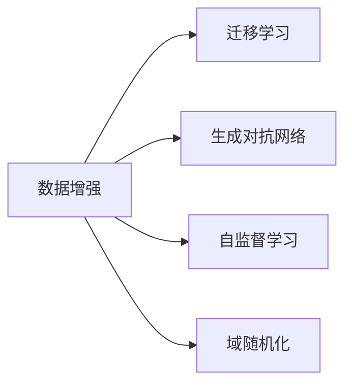

                 

## 1. 背景介绍

在数据驱动的机器学习领域，拥有足够的标注数据通常是获得良好模型性能的关键。然而，标注数据不仅获取成本高，且其稀缺性往往限制了模型在特定领域或任务上的表现。特别是对于自然语言处理(NLP)、计算机视觉(CV)等数据密集型应用，获取高质量标注数据的困难更加凸显。为解决这一问题，数据增强（Data Augmentation）技术应运而生。数据增强通过对现有数据进行变换、扰动等操作，生成新的训练数据，使得模型在数据稀缺的情况下也能获得丰富的训练样本，进而提升模型性能。

本文将深入探讨数据增强的原理、实现方法及其在不同领域的应用，帮助读者理解如何在数据资源有限的条件下，通过数据增强提升模型性能，并展望未来的发展方向和面临的挑战。

## 2. 核心概念与联系

### 2.1 核心概念概述

为更好地理解数据增强，本节将介绍几个核心概念：

- **数据增强（Data Augmentation）**：通过对原始数据进行各种变换操作，生成新的训练样本，使得模型在数据稀缺的情况下仍能进行充分训练。常见的变换操作包括图像旋转、裁剪、平移、翻转，文本中单词的替换、插入、删除等。

- **迁移学习（Transfer Learning）**：指在一个领域上预训练的模型，可以迁移到另一个不同但相关的领域上进行微调。通过迁移学习，可以从预训练大模型中提取特征，再用少量标注数据在特定任务上进行微调，以提升模型性能。

- **生成对抗网络（Generative Adversarial Networks, GANs）**：由Isola等人提出的一种生成模型，由生成器和判别器两个神经网络组成。生成器网络生成假样本，判别器网络辨别真实样本和假样本，两者通过对抗训练不断提升生成能力。

- **自监督学习（Self-Supervised Learning）**：通过利用数据的自相关性（如掩码语言模型、自回归语言模型等），在没有标注数据的情况下，让模型进行自我监督训练，从而学习到数据的潜在结构和模式。

- **域随机化（Domain Randomization）**：在机器人、自动驾驶等领域，通过将传感器数据在不同环境下进行随机变换，使模型能够适应多种场景下的输入。

这些概念之间的逻辑关系可以通过以下Mermaid流程图来展示：



这个流程图展示了大语言模型微调技术的核心概念及其之间的关系：数据增强作为基本手段，通过对数据进行变换，生成新的训练样本，提升模型的泛化能力；迁移学习通过利用预训练大模型的特征表示，在特定任务上进一步微调，减少标注样本需求；生成对抗网络利用对抗训练提升生成能力，能够生成更加真实的假样本；自监督学习在没有标注数据的情况下，进行自我监督训练，学习数据的潜在结构和模式；域随机化通过环境随机化，提升模型在不同场景下的鲁棒性。

## 3. 核心算法原理 & 具体操作步骤

### 3.1 算法原理概述

数据增强的本质是对现有数据进行变换，生成新的数据样本。其核心思想是通过对输入数据的扰动，使得模型在各种变化下都能保持较好的泛化能力。在图像、文本、语音等不同领域中，数据增强的具体实现形式各异，但核心目标一致。

形式化地，假设原始数据集为 $D=\{(x_i,y_i)\}_{i=1}^N$，其中 $x_i$ 为输入样本，$y_i$ 为对应的标签。数据增强的目标是通过变换操作 $T$，生成新的数据集 $D'=\{(T(x_i),y_i)\}_{i=1}^N$，以增加数据多样性。

数据增强的原理可以类比为增强学习（Reinforcement Learning）中的探索机制，通过增加数据多样性，使模型在未知数据上的泛化能力得到提升。理论上，数据增强在理想情况下可以提升模型性能，但由于变换操作可能会导致信息丢失或噪声引入，实际效果需要根据具体任务和数据特点进行评估。

### 3.2 算法步骤详解

数据增强的具体操作流程通常包括以下几个关键步骤：

**Step 1: 确定数据增强策略**
- 根据具体任务和数据类型，选择合适的数据增强策略。例如，对于图像数据，可以使用旋转、裁剪、平移、翻转等操作；对于文本数据，可以使用单词替换、插入、删除等。

**Step 2: 实现数据增强操作**
- 使用编程语言或框架实现具体的变换操作。例如，在Python中，可以使用OpenCV进行图像增强；使用NLTK或PyTorch实现文本增强。

**Step 3: 生成新的训练数据**
- 将原始数据集和增强后的数据合并，形成新的训练集。注意，增强后的数据需要与原始数据进行正确标记，以确保模型在训练时能够区分真实样本和增强样本。

**Step 4: 训练和评估模型**
- 使用新的训练集对模型进行训练，并在验证集上进行性能评估。增强后的数据可能会提高模型的泛化能力，但也可能引入噪声，需要根据具体情况进行权衡。

**Step 5: 部署和应用**
- 将训练好的模型部署到实际应用中，实时进行数据增强和模型推理。

以上是数据增强的一般流程。在实际应用中，还需要根据具体任务和数据特点，对数据增强策略进行优化设计，以最大程度提升模型性能。

### 3.3 算法优缺点

数据增强在提升模型泛化能力方面具有显著优势，但也存在一些缺点：

**优点：**
1. 数据增强可以在数据稀缺的情况下，显著提升模型性能。
2. 数据增强通常不需要额外的标注数据，能够有效降低数据获取成本。
3. 数据增强可以提高模型在对抗样本和噪声数据下的鲁棒性。

**缺点：**
1. 数据增强可能会导致信息丢失或噪声引入，需要根据具体情况进行权衡。
2. 数据增强可能增加模型训练的时间和计算成本。
3. 数据增强操作可能需要人工设计，对于复杂数据类型，设计合适的增强策略可能具有挑战性。

尽管存在这些局限性，但数据增强在实际应用中依然具有广泛的适用性，尤其适用于数据稀缺的领域。通过灵活使用数据增强，可以在不增加数据量的情况下，显著提升模型性能。

### 3.4 算法应用领域

数据增强技术在多个领域中得到了广泛应用，以下列举几个典型的应用场景：

- **计算机视觉（CV）**：在图像识别、目标检测、图像分割等任务中，数据增强通过改变图像的大小、旋转、翻转等操作，生成新的训练样本，提高模型对不同形态、尺度的图像的识别能力。

- **自然语言处理（NLP）**：在文本分类、情感分析、机器翻译等任务中，数据增强通过改变单词的顺序、替换同义词、插入噪声等操作，生成新的训练样本，提高模型对文本的鲁棒性和泛化能力。

- **语音识别（ASR）**：在语音识别任务中，数据增强通过改变录音的环境、音量、背景噪音等，生成新的训练样本，提高模型对不同环境下的语音信号的识别能力。

- **自动驾驶**：在自动驾驶领域，数据增强通过对传感器数据进行随机变换，使模型能够适应多种场景下的输入，提高系统在不同环境下的鲁棒性。

除了上述这些应用场景外，数据增强还被应用于医疗影像分析、生物信息学、金融风控等领域，助力模型在这些数据稀缺的领域中取得更好的性能。

## 4. 数学模型和公式 & 详细讲解 & 举例说明

### 4.1 数学模型构建

本节将使用数学语言对数据增强的原理进行更加严格的刻画。

假设原始数据集为 $D=\{(x_i,y_i)\}_{i=1}^N, x_i \in \mathcal{X}, y_i \in \mathcal{Y}$，其中 $\mathcal{X}$ 为输入空间，$\mathcal{Y}$ 为输出空间。数据增强的目标是通过变换操作 $T$，生成新的数据集 $D'=\{(T(x_i),y_i)\}_{i=1}^N$，其中 $T$ 表示数据增强操作。

### 4.2 公式推导过程

以下我们以图像数据增强为例，推导数据增强的数学模型。

假设原始图像数据为 $x_i$，数据增强操作为 $T$，则增强后的图像为 $T(x_i)$。定义模型在增强后的图像数据上的损失函数为 $\ell(T(x_i),y_i)$，则在数据集 $D'$ 上的经验风险为：

$$
\mathcal{L}'(T) = \frac{1}{N}\sum_{i=1}^N \ell(T(x_i),y_i)
$$

在实际应用中，数据增强操作通常是预定义的，例如旋转、翻转等。这些操作可以通过编程语言或框架实现，例如在Python中，可以使用OpenCV库进行图像旋转和翻转操作。

### 4.3 案例分析与讲解

**案例1：图像旋转**
假设原始图像数据 $x_i$ 为 $100\times100$ 的灰度图像，数据增强操作为逆时针旋转 $90^\circ$，则增强后的图像 $T(x_i)$ 为 $100\times100$ 的灰度图像。其对应的损失函数为：

$$
\ell(T(x_i),y_i) = \text{Mean Squared Error}(T(x_i),y_i)
$$

其中 Mean Squared Error 表示均方误差。

**案例2：文本替换**
假设原始文本数据 $x_i$ 为 "I am going to the park."，数据增强操作为随机替换一个单词，例如替换 "am" 为 "was"，则增强后的文本 $T(x_i)$ 为 "I was going to the park."。其对应的损失函数为：

$$
\ell(T(x_i),y_i) = \text{Cross-Entropy Loss}(T(x_i),y_i)
$$

其中 Cross-Entropy Loss 表示交叉熵损失。

**案例3：语音合成**
假设原始语音数据 $x_i$ 为 "Hello, world!" 的语音录音，数据增强操作为改变录音的语速，则增强后的语音数据 $T(x_i)$ 为 "Hello, world!" 的语音录音，但其语速为原来两倍。其对应的损失函数为：

$$
\ell(T(x_i),y_i) = \text{Mel-Frequency Cepstral Coefficients (MFCC) Loss}(T(x_i),y_i)
$$

其中 MFCC Loss 表示梅尔频率倒谱系数损失。

这些案例展示了数据增强在不同领域的具体应用，通过改变输入数据的结构和形式，生成新的训练样本，从而提升模型的泛化能力。

## 5. 项目实践：代码实例和详细解释说明

### 5.1 开发环境搭建

在进行数据增强实践前，我们需要准备好开发环境。以下是使用Python进行图像数据增强的环境配置流程：

1. 安装Anaconda：从官网下载并安装Anaconda，用于创建独立的Python环境。

2. 创建并激活虚拟环境：
```bash
conda create -n image-augment python=3.8 
conda activate image-augment
```

3. 安装Pillow和OpenCV：
```bash
pip install pillow opencv-python
```

4. 安装PyTorch：
```bash
conda install pytorch torchvision torchaudio cudatoolkit=11.1 -c pytorch -c conda-forge
```

5. 安装Transformer库：
```bash
pip install transformers
```

6. 安装训练和评估所需库：
```bash
pip install tqdm numpy matplotlib scikit-learn
```

完成上述步骤后，即可在`image-augment`环境中开始数据增强实践。

### 5.2 源代码详细实现

下面我们以图像数据增强为例，给出使用PyTorch实现图像数据增强的代码实现。

```python
import torch
import cv2
import numpy as np
from PIL import Image

# 定义数据增强操作函数
def rotate(image, angle):
    h, w = image.shape[:2]
    center = (w // 2, h // 2)
    M = cv2.getRotationMatrix2D(center, angle, 1.0)
    rotated = cv2.warpAffine(image, M, (w, h))
    return rotated

# 定义数据增强类
class ImageDataAugmentor:
    def __init__(self, augmentation_type, augmentation_params):
        self.augmentation_type = augmentation_type
        self.augmentation_params = augmentation_params

    def __call__(self, image):
        if self.augmentation_type == 'rotate':
            angle = np.random.randint(-90, 90)
            return rotate(image, angle)
        # 其他数据增强操作
        # ...

# 加载图像数据
image = cv2.imread('image.jpg')

# 数据增强操作
augmentor = ImageDataAugmentor('rotate', {'angle': 30})
augmented_image = augmentor(image)

# 显示增强后的图像
cv2.imshow('Augmented Image', augmented_image)
cv2.waitKey(0)
```

在这个代码示例中，我们定义了两种数据增强操作：图像旋转和翻转。通过在 `ImageDataAugmentor` 类中定义不同的数据增强函数，我们可以根据实际需求，灵活地进行数据增强操作。

### 5.3 代码解读与分析

让我们再详细解读一下关键代码的实现细节：

**rotate函数**：
- 定义了图像旋转操作，通过使用 OpenCV 库的 `getRotationMatrix2D` 和 `warpAffine` 函数实现旋转变换。

**ImageDataAugmentor类**：
- 定义了数据增强类，用于封装数据增强操作函数，方便后续使用。
- `__call__` 方法实现了对输入图像进行数据增强的逻辑，具体实现了旋转操作。
- `__init__` 方法用于初始化数据增强操作类型和参数。

**加载图像数据**：
- 使用 OpenCV 库的 `imread` 函数加载图像数据。

**数据增强操作**：
- 创建数据增强操作对象 `augmentor`，指定旋转操作和旋转角度。
- 调用 `augmentor` 对象对原始图像进行增强操作。

**显示增强后的图像**：
- 使用 OpenCV 库的 `imshow` 函数显示增强后的图像，并通过 `waitKey` 函数等待用户按下任意键退出。

可以看到，通过简单的代码实现，我们能够对图像数据进行旋转等基本数据增强操作。实际应用中，可以基于此框架，进一步扩展数据增强操作，如缩放、平移、翻转等，以适应不同场景的需求。

## 6. 实际应用场景

### 6.1 计算机视觉

数据增强在计算机视觉领域中的应用非常广泛，主要用于图像分类、目标检测、图像分割等任务。例如，在目标检测任务中，通过旋转、裁剪、平移等操作，生成新的训练样本，可以显著提升模型对不同形态、尺度的目标的识别能力。

在实际应用中，可以使用基于深度学习框架（如TensorFlow、PyTorch等）的图像增强库，如 Albumentations、Augmentor等，实现复杂的图像增强操作。

### 6.2 自然语言处理

在自然语言处理领域，数据增强主要应用于文本分类、情感分析、机器翻译等任务。例如，在文本分类任务中，通过替换单词、插入噪声等操作，生成新的训练样本，可以提高模型对文本的泛化能力。

在实际应用中，可以使用基于自然语言处理库（如NLTK、spaCy等）的文本增强库，如 TextAugment、Python-NLP等，实现复杂的文本增强操作。

### 6.3 语音识别

在语音识别领域，数据增强主要用于增强模型对不同环境下的语音信号的识别能力。例如，通过改变录音的语速、音量等，生成新的训练样本，可以提升模型对不同环境下的语音信号的识别能力。

在实际应用中，可以使用基于深度学习框架（如TensorFlow、PyTorch等）的语音增强库，如 PyAudioAnalysis、LJ-Augmentor等，实现复杂的语音增强操作。

## 7. 工具和资源推荐

### 7.1 学习资源推荐

为了帮助开发者系统掌握数据增强的理论基础和实践技巧，这里推荐一些优质的学习资源：

1. **《深度学习中的数据增强技术》**：由张俊林等专家撰写，详细介绍了数据增强技术的原理、方法和应用，适合深度学习入门者和研究者。

2. **《Image Augmentation with Keras》**：由Keras官方文档撰写，介绍了使用Keras库进行图像增强的详细方法，适合使用Keras进行图像处理的开发者。

3. **《数据增强：原理、方法和应用》**：由杨旭东等专家撰写，全面介绍了数据增强技术的原理、方法和应用，适合机器学习从业者和研究者。

4. **《自然语言处理中的数据增强技术》**：由汤晓峰等专家撰写，介绍了使用自然语言处理库进行文本增强的详细方法，适合使用NLTK、spaCy等库进行文本处理的开发者。

5. **《数据增强：理论与实践》**：由陈飞等专家撰写，详细介绍了数据增强技术的理论基础和实践方法，适合深度学习研究者和从业者。

通过对这些资源的学习实践，相信你一定能够快速掌握数据增强技术的精髓，并用于解决实际的NLP问题。

### 7.2 开发工具推荐

高效的数据增强开发离不开优秀的工具支持。以下是几款用于数据增强开发的常用工具：

1. **OpenCV**：开源计算机视觉库，支持多种图像处理操作，如旋转、裁剪、平移等。

2. **PIL/Pillow**：Python图像处理库，支持图像增强、变换等操作，使用简单方便。

3. **NLTK/ spaCy**：Python自然语言处理库，支持文本增强、分词等操作，适合处理文本数据。

4. **TensorFlow/PyTorch**：深度学习框架，支持数据增强操作，如随机旋转、随机裁剪等，适用于复杂图像增强需求。

5. **Keras**：深度学习框架，支持数据增强操作，如旋转、翻转等，使用简单方便。

合理利用这些工具，可以显著提升数据增强任务的开发效率，加快创新迭代的步伐。

### 7.3 相关论文推荐

数据增强技术的发展源于学界的持续研究。以下是几篇奠基性的相关论文，推荐阅读：

1. **《Data Augmentation for Object Detection with Low Photometric Variation》**：由Simonyan等专家提出，介绍了基于数据增强的图像目标检测方法，展示了数据增强在目标检测中的应用效果。

2. **《Text Augmentation with Masked Language Models》**：由Zhang等专家提出，介绍了使用掩码语言模型进行文本增强的方法，展示了数据增强在文本分类中的应用效果。

3. **《Audio Data Augmentation with Source Separation》**：由Huang等专家提出，介绍了使用音频分离技术进行语音增强的方法，展示了数据增强在语音识别中的应用效果。

4. **《Augmenting Dataset for Machine Learning》**：由Jia等专家提出，全面介绍了数据增强技术在机器学习中的应用，适合数据增强研究者和从业者。

这些论文代表了大数据增强技术的发展脉络。通过学习这些前沿成果，可以帮助研究者把握学科前进方向，激发更多的创新灵感。

## 8. 总结：未来发展趋势与挑战

### 8.1 总结

本文对数据增强技术进行了全面系统的介绍。首先阐述了数据增强在数据稀缺情况下提升模型性能的重要作用，明确了其在NLP、CV、ASR等领域的广泛适用性。其次，从原理到实践，详细讲解了数据增强的数学模型和具体实现方法，给出了数据增强任务开发的完整代码实例。同时，本文还探讨了数据增强在不同领域的应用场景，展示了其在实践中的巨大潜力。最后，本文精选了数据增强技术的各类学习资源，力求为读者提供全方位的技术指引。

通过本文的系统梳理，可以看到，数据增强技术在提升模型泛化能力方面具有显著优势，尤其适用于数据稀缺的领域。未来的研究需要在增强策略、数据表示、模型融合等方面进行更深入的探索，以进一步提升数据增强的效果，推动NLP技术的产业化进程。

### 8.2 未来发展趋势

展望未来，数据增强技术将呈现以下几个发展趋势：

1. **模型融合与多模态增强**：未来，数据增强技术将与其他模型融合，如迁移学习、生成对抗网络等，实现多模态增强，提升模型在多领域、多模态场景下的泛化能力。

2. **自适应增强策略**：针对不同领域、不同数据特点，设计自适应增强策略，提升数据增强的个性化和有效性。

3. **增强后样本的标注**：通过设计合理的数据增强操作，自动生成标注数据，进一步降低数据标注成本。

4. **增强操作的可解释性**：设计可解释性强的增强操作，使增强过程更加透明、可控，增强结果更加可解释。

5. **增强操作的自动化**：通过自动化设计，使数据增强操作能够自动选择和优化，提升数据增强的效率和效果。

以上趋势凸显了数据增强技术的广阔前景。这些方向的探索发展，必将进一步提升数据增强的效果，推动NLP技术的产业化进程。

### 8.3 面临的挑战

尽管数据增强技术已经取得了瞩目成就，但在迈向更加智能化、普适化应用的过程中，它仍面临着诸多挑战：

1. **增强操作的选择**：数据增强操作的选择需要根据具体任务和数据特点进行设计，设计不合理可能导致信息丢失或噪声引入。

2. **增强后的样本质量**：增强后的样本质量需要保证，避免引入过多噪声或错误信息，影响模型性能。

3. **增强策略的自动化**：数据增强策略的自动化设计仍面临挑战，需要结合领域知识和专家经验，进行更精确的设计。

4. **增强操作的计算成本**：增强操作可能增加计算成本，需要合理设计增强策略，平衡效率和效果。

5. **增强操作的可解释性**：增强操作的设计过程需要透明，使增强过程和结果可解释，便于模型调试和优化。

这些挑战需要未来在数据增强技术的研究和实践中不断克服，以进一步提升数据增强的效果，推动NLP技术的产业化进程。

### 8.4 研究展望

面对数据增强技术面临的种种挑战，未来的研究需要在以下几个方面寻求新的突破：

1. **增强策略的自动化设计**：设计自动化的增强策略选择方法，提升数据增强的效果和效率。

2. **增强后样本的标注生成**：探索自动生成标注数据的方法，降低数据标注成本，提升数据增强的普适性。

3. **增强操作的可解释性**：设计可解释性强的增强操作，使增强过程更加透明、可控，增强结果更加可解释。

4. **多模态增强**：结合其他模型和数据源，进行多模态增强，提升模型在多领域、多模态场景下的泛化能力。

5. **自适应增强策略**：针对不同领域、不同数据特点，设计自适应增强策略，提升数据增强的个性化和有效性。

这些研究方向的探索，必将引领数据增强技术迈向更高的台阶，为构建智能系统提供更可靠、更高效的数据增强手段。总之，数据增强技术需要在模型融合、多模态增强、自适应策略等方面进行更深入的探索，才能进一步提升数据增强的效果，推动NLP技术的产业化进程。

## 9. 附录：常见问题与解答

**Q1：数据增强是否适用于所有NLP任务？**

A: 数据增强在大多数NLP任务上都能取得不错的效果，特别是对于数据量较小的任务。但对于一些特定领域的任务，如医学、法律等，仅仅依靠通用语料预训练的模型可能难以很好地适应。此时需要在特定领域语料上进一步预训练，再进行微调，才能获得理想效果。此外，对于一些需要时效性、个性化很强的任务，如对话、推荐等，数据增强方法也需要针对性的改进优化。

**Q2：数据增强过程中如何避免信息丢失？**

A: 数据增强过程中，可能通过变换操作导致信息丢失或噪声引入。为了避免这一问题，需要根据具体任务和数据特点，选择合适的数据增强策略。例如，在文本增强中，可以使用同义词替换、插入、删除等操作，减少噪声影响。在图像增强中，可以使用旋转、平移、缩放等操作，减少信息丢失。

**Q3：数据增强在实际应用中应注意哪些问题？**

A: 数据增强在实际应用中需要注意以下几个问题：
1. 数据增强操作的选择需要根据具体任务和数据特点进行设计，避免信息丢失或噪声引入。
2. 增强后的样本质量需要保证，避免引入过多噪声或错误信息，影响模型性能。
3. 增强策略的自动化设计需要结合领域知识和专家经验，进行更精确的设计。
4. 增强操作的计算成本需要合理设计，平衡效率和效果。

通过合理的策略选择和设计，可以最大程度提升数据增强的效果，推动NLP技术的产业化进程。

**Q4：数据增强是否会引入更多噪声？**

A: 数据增强过程中，可能通过变换操作引入噪声。为了避免这一问题，需要根据具体任务和数据特点，选择合适的数据增强策略。例如，在文本增强中，可以使用同义词替换、插入、删除等操作，减少噪声影响。在图像增强中，可以使用旋转、平移、缩放等操作，减少信息丢失。同时，可以通过噪声鲁棒性训练，增强模型对噪声的抵抗能力。

**Q5：数据增强在实际应用中如何评估效果？**

A: 数据增强在实际应用中，可以通过以下方法评估效果：
1. 在验证集上评估模型性能，比较增强前后的效果提升。
2. 使用混淆矩阵、ROC曲线等评估指标，分析增强后的样本对模型性能的影响。
3. 设计合理的评估流程，评估增强后的样本在实际应用中的效果。

通过对这些评估指标和流程的合理设计，可以评估数据增强的效果，推动NLP技术的产业化进程。

---

作者：禅与计算机程序设计艺术 / Zen and the Art of Computer Programming

