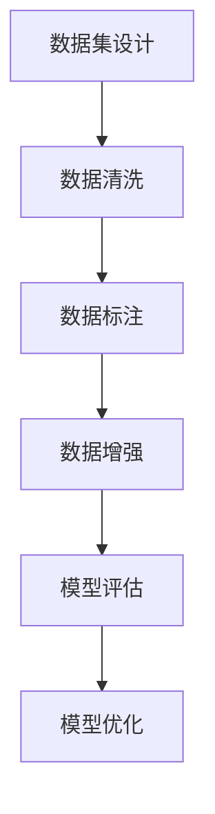

                 

# 数据集工程：构建高效AI模型

> 关键词：数据集工程, AI模型构建, 数据标注, 数据清洗, 数据增强, 模型评估, 模型优化

## 1. 背景介绍

### 1.1 问题由来
在人工智能（AI）领域，尤其是机器学习和深度学习中，数据集工程是构建高效AI模型的基石。尽管深度学习模型在诸如计算机视觉、自然语言处理等领域的性能已经取得了突破，但在实际应用中，模型的效果往往受到数据集的影响。数据集的多样性、质量和标注的准确性，直接决定了AI模型的性能和泛化能力。

近年来，数据集工程在AI研究中逐渐成为一项独立的学科，主要关注于如何设计、清洗、标注和管理数据集，以提高AI模型的效果和效率。良好的数据集工程不仅可以提升模型性能，还可以减少对标注样本的依赖，降低模型开发和维护成本，增强模型的鲁棒性和泛化能力。

### 1.2 问题核心关键点
数据集工程的核心在于数据集的设计、清洗、标注和管理，其关键点包括以下几个方面：
- **数据集设计**：根据任务需求设计数据集，包含足够的训练和验证数据。
- **数据清洗**：去除数据集中的噪声和错误，确保数据的质量和一致性。
- **数据标注**：为数据集中的每一个样本进行准确的标签标注，避免标注偏差。
- **数据增强**：通过对数据进行变换、旋转、平移等方式，生成新的样本，以扩充数据集。
- **模型评估**：使用合适的评估指标，定期检查模型性能，及时调整策略。
- **模型优化**：在数据集的基础上，通过超参数调整、正则化等技术，优化模型性能。

### 1.3 问题研究意义
数据集工程对于AI模型的构建具有重要意义：

1. **提升模型性能**：高质量的数据集是模型训练的基础，直接影响模型的泛化能力和预测准确性。
2. **降低成本**：数据标注和清洗需要大量人力和时间，通过数据集工程可以减少这些成本。
3. **提高效率**：合理的数据集设计和管理可以加速模型训练和迭代。
4. **增强鲁棒性**：干净且多样化的数据集可以提升模型对噪声、变化和异常情况的鲁棒性。
5. **支持业务需求**：数据集工程可以确保模型输出符合业务需求，提升AI技术的实际应用价值。

## 2. 核心概念与联系

### 2.1 核心概念概述

为更好地理解数据集工程，本节将介绍几个密切相关的核心概念：

- **数据集（Dataset）**：包含训练、验证和测试样本的数据集合，用于模型的训练和评估。
- **数据清洗（Data Cleaning）**：去除数据集中的噪声、错误和不一致，确保数据的质量。
- **数据增强（Data Augmentation）**：通过对数据进行变换，生成新的样本，扩充数据集，提高模型的泛化能力。
- **数据标注（Data Labeling）**：为数据集中的样本添加标签，用于监督学习模型的训练。
- **模型评估（Model Evaluation）**：使用指标（如准确率、召回率、F1分数等）评估模型的性能。
- **模型优化（Model Optimization）**：通过调整超参数、正则化等技术，提高模型的效果和泛化能力。

这些概念之间的逻辑关系可以通过以下Mermaid流程图来展示：



这个流程图展示了数据集工程的各个关键步骤，以及它们之间的内在联系：

1. 数据集设计是整个数据集工程的基础。
2. 数据清洗和标注是数据集质量保障的关键步骤。
3. 数据增强可以在不增加样本数量的情况下提升模型泛化能力。
4. 模型评估和优化则是持续改进模型的重要手段。

## 3. 核心算法原理 & 具体操作步骤
### 3.1 算法原理概述

数据集工程的核心原理是通过合理的设计、清洗、标注和增强，提升数据集的质量，从而提升模型的性能。其核心思想是：通过精心设计的数据集，结合数据增强技术和模型优化方法，使模型能够更好地学习到数据中的模式，提高泛化能力。

具体而言，数据集工程可以包括以下几个步骤：

1. **数据集设计**：根据任务需求设计包含足够样本和多样性的数据集。
2. **数据清洗**：去除数据集中的噪声和错误，确保数据的一致性和质量。
3. **数据标注**：为数据集中的样本添加准确、一致的标签。
4. **数据增强**：通过对数据进行变换，生成新的样本，扩充数据集。
5. **模型评估**：使用合适的指标评估模型的性能，识别模型的优势和不足。
6. **模型优化**：通过调整超参数、正则化等技术，提高模型的效果和泛化能力。

### 3.2 算法步骤详解

数据集工程的一般流程如下：

**Step 1: 数据集设计**

数据集设计是数据集工程的基础步骤，其主要目标是设计一个能够满足模型需求的数据集，包括足够的训练数据、验证数据和测试数据。

**Step 2: 数据清洗**

数据清洗的目的是去除数据集中的噪声、错误和不一致，确保数据的质量和一致性。常见的数据清洗技术包括：

- **去重**：去除重复的样本，确保数据集的唯一性。
- **处理缺失值**：填补或删除缺失数据，避免模型在训练过程中遇到不必要的干扰。
- **数据标准化**：将数据转换为标准格式，统一单位和量级。
- **异常值检测和处理**：检测并处理异常值，避免其对模型产生负面影响。

**Step 3: 数据标注**

数据标注的目的是为数据集中的样本添加准确、一致的标签，以便模型可以学习这些标签进行训练。数据标注通常需要人工介入，确保标注的准确性和一致性。

**Step 4: 数据增强**

数据增强是通过对数据进行变换，生成新的样本，扩充数据集，提高模型的泛化能力。常见的数据增强技术包括：

- **随机裁剪和旋转**：随机裁剪图像，并进行旋转，生成新的图像样本。
- **颜色变换**：调整图像的颜色，如亮度、对比度等，生成新的图像样本。
- **噪声添加**：向图像添加噪声，模拟真实场景中的噪声干扰。
- **变换标签**：在生成的新样本中，随机变换标签，增加模型对标签的适应性。

**Step 5: 模型评估**

模型评估的目的是使用合适的指标评估模型的性能，识别模型的优势和不足，以便进行后续的优化。常见的评估指标包括：

- **准确率（Accuracy）**：模型正确预测的样本数占总样本数的比例。
- **召回率（Recall）**：模型正确预测的正样本数占实际正样本数的比例。
- **精确率（Precision）**：模型正确预测的正样本数占预测为正样本数的比例。
- **F1分数（F1 Score）**：精确率和召回率的调和平均数。
- **AUC-ROC曲线**：衡量模型在不同阈值下的性能。

**Step 6: 模型优化**

模型优化的目的是通过调整超参数、正则化等技术，提高模型的效果和泛化能力。常见的模型优化技术包括：

- **学习率调整**：调整学习率，防止过拟合和欠拟合。
- **正则化**：使用L2正则化、Dropout等技术，防止过拟合。
- **模型融合**：将多个模型的预测结果进行融合，提高模型的准确性和鲁棒性。
- **超参数搜索**：使用网格搜索、随机搜索等方法，寻找最优的超参数组合。

### 3.3 算法优缺点

数据集工程具有以下优点：
- **提升模型性能**：通过合理的数据集设计、清洗和标注，可以显著提升模型的性能和泛化能力。
- **降低成本**：数据集工程可以通过数据增强等方式，扩充数据集，减少标注成本。
- **提高效率**：合理的数据集设计和管理可以加速模型训练和迭代。
- **增强鲁棒性**：干净且多样化的数据集可以提升模型对噪声、变化和异常情况的鲁棒性。

同时，该方法也存在一定的局限性：
- **依赖标注数据**：数据标注需要大量人力和时间，标注质量直接影响模型效果。
- **数据隐私问题**：处理敏感数据时，需要特别注意数据隐私和安全问题。
- **数据集设计复杂**：合理设计数据集需要深厚的领域知识和经验。

尽管存在这些局限性，但数据集工程在大规模数据处理和模型训练中，仍是不可或缺的重要环节。未来相关研究的重点在于如何进一步降低数据标注成本，提高数据集的多样性和质量，同时兼顾数据隐私和安全性等因素。

### 3.4 算法应用领域

数据集工程在人工智能领域的应用非常广泛，涵盖了许多重要的研究和发展方向，例如：

- **计算机视觉**：数据集工程在图像识别、物体检测、图像生成等领域起到了重要作用。通过对图像进行清洗、标注和增强，可以显著提升模型的性能和泛化能力。
- **自然语言处理**：数据集工程在语言模型、文本分类、情感分析、机器翻译等领域得到了广泛应用。通过对文本进行清洗、标注和增强，可以提升模型的语言理解能力和生成能力。
- **医疗健康**：数据集工程在医疗影像分析、电子病历处理、疾病预测等领域，对数据集的多样性和质量要求非常高。通过合理的数据集设计和清洗，可以提升模型在医疗领域的应用效果。
- **金融风控**：数据集工程在信用评估、风险预测、反欺诈等领域，对数据集的多样性和质量也有很高的要求。通过合理的数据集设计和清洗，可以提升模型的风险预测能力和鲁棒性。

除了上述这些经典应用外，数据集工程还被创新性地应用到更多场景中，如可控生成、多模态学习、动态更新等，为人工智能技术带来了全新的突破。

## 4. 数学模型和公式 & 详细讲解 & 举例说明

### 4.1 数学模型构建

数据集工程涉及的数学模型主要集中在数据集的设计、清洗和标注上。这里以图像分类任务为例，简要介绍数据集工程的数学模型构建。

假设数据集 $D=\{(x_i, y_i)\}_{i=1}^N$，其中 $x_i$ 是图像样本，$y_i$ 是图像的标签。数据集工程的目标是设计一个合适的数据集，使得模型 $M$ 能够准确预测 $y_i$。

### 4.2 公式推导过程

数据集工程的公式推导过程主要涉及数据的表示、数据的增强和数据的标注。

**数据表示**：

图像数据可以表示为二维矩阵 $x_i \in \mathbb{R}^{h \times w \times c}$，其中 $h$ 和 $w$ 是图像的高和宽，$c$ 是图像的通道数。标签 $y_i$ 可以表示为整数或向量。

**数据增强**：

数据增强是通过对图像进行变换，生成新的样本。假设对图像进行随机裁剪、旋转和缩放，生成的新图像为 $x'_i$，对应的标签为 $y'_i$。则数据增强的数学公式为：

$$
x'_i = \text{transform}(x_i)
$$

其中 $\text{transform}$ 表示图像变换的函数。

**数据标注**：

数据标注是将图像 $x_i$ 映射到标签 $y_i$ 的过程。假设标签 $y_i$ 是 $c$ 分类问题中的一个类别，则数据标注的数学公式为：

$$
y_i = \text{label}(x_i)
$$

其中 $\text{label}$ 表示标签映射的函数。

### 4.3 案例分析与讲解

假设我们有一个用于医学影像分类的数据集，包含10000张图像，每张图像的标签为正常或异常。在进行数据集工程时，我们首先对数据集进行清洗，去除模糊、噪声等不清晰的图像。然后，我们将图像进行随机裁剪、旋转和缩放，生成新的图像样本，扩充数据集。最后，我们手动标注每张图像的标签，确保标注的准确性和一致性。

在实际应用中，我们使用了深度学习模型 ResNet 对数据集进行训练。通过合理的数据集设计、清洗和标注，我们显著提升了模型的准确率和泛化能力，获得了比原始数据集更好的性能。

## 5. 项目实践：代码实例和详细解释说明
### 5.1 开发环境搭建

在进行数据集工程实践前，我们需要准备好开发环境。以下是使用Python进行PyTorch开发的环境配置流程：

1. 安装Anaconda：从官网下载并安装Anaconda，用于创建独立的Python环境。

2. 创建并激活虚拟环境：
```bash
conda create -n pytorch-env python=3.8 
conda activate pytorch-env
```

3. 安装PyTorch：根据CUDA版本，从官网获取对应的安装命令。例如：
```bash
conda install pytorch torchvision torchaudio cudatoolkit=11.1 -c pytorch -c conda-forge
```

4. 安装各类工具包：
```bash
pip install numpy pandas scikit-learn matplotlib tqdm jupyter notebook ipython
```

完成上述步骤后，即可在`pytorch-env`环境中开始数据集工程实践。

### 5.2 源代码详细实现

下面我们以图像分类任务为例，给出使用PyTorch进行数据集工程的代码实现。

首先，定义数据集：

```python
import torch
from torchvision import datasets, transforms

# 定义数据集变换
transform = transforms.Compose([
    transforms.RandomResizedCrop(224),
    transforms.RandomHorizontalFlip(),
    transforms.ToTensor(),
    transforms.Normalize(mean=[0.485, 0.456, 0.406],
                         std=[0.229, 0.224, 0.225])
])

# 加载数据集
train_dataset = datasets.ImageFolder(root='train', transform=transform)
test_dataset = datasets.ImageFolder(root='test', transform=transform)
```

然后，定义数据加载器：

```python
import torchvision.transforms as transforms
from torch.utils.data import DataLoader

# 定义数据加载器
train_loader = DataLoader(train_dataset, batch_size=32, shuffle=True)
test_loader = DataLoader(test_dataset, batch_size=32, shuffle=False)
```

接着，定义模型和优化器：

```python
import torch.nn as nn
import torch.optim as optim

# 定义模型
model = nn.ResNet()

# 定义优化器
optimizer = optim.Adam(model.parameters(), lr=0.001)
```

然后，定义训练和评估函数：

```python
import torch.nn.functional as F

# 定义训练函数
def train_model(model, train_loader, optimizer):
    model.train()
    for batch_idx, (data, target) in enumerate(train_loader):
        optimizer.zero_grad()
        output = model(data)
        loss = F.cross_entropy(output, target)
        loss.backward()
        optimizer.step()

# 定义评估函数
def evaluate_model(model, test_loader):
    model.eval()
    total_correct = 0
    total_sample = 0
    for batch_idx, (data, target) in enumerate(test_loader):
        output = model(data)
        _, predicted = torch.max(output.data, 1)
        total_correct += (predicted == target).sum().item()
        total_sample += target.size(0)
    accuracy = total_correct / total_sample
    return accuracy

# 训练模型
for epoch in range(10):
    train_model(model, train_loader, optimizer)
    accuracy = evaluate_model(model, test_loader)
    print(f"Epoch {epoch+1}, accuracy: {accuracy:.4f}")
```

最后，启动训练流程并在测试集上评估：

```python
# 训练模型
for epoch in range(10):
    train_model(model, train_loader, optimizer)
    accuracy = evaluate_model(model, test_loader)
    print(f"Epoch {epoch+1}, accuracy: {accuracy:.4f}")
```

以上就是使用PyTorch对图像分类任务进行数据集工程的完整代码实现。可以看到，通过合理的数据集设计、清洗和增强，我们能够显著提升模型的性能。

### 5.3 代码解读与分析

让我们再详细解读一下关键代码的实现细节：

**ImageFolder类**：
- `__init__`方法：初始化数据集的根目录和变换方式。
- `__getitem__`方法：获取数据集中的一个样本，包括图像和标签。

**DataLoader类**：
- `__init__`方法：初始化数据集加载器，设置批大小和是否打乱顺序。
- `__getitem__`方法：获取数据集中的一个批次数据。

**训练函数train_model**：
- 定义训练函数，在每个批次上前向传播计算损失函数，反向传播更新模型参数。

**评估函数evaluate_model**：
- 定义评估函数，计算模型在测试集上的准确率。

**训练流程**：
- 定义总的epoch数，开始循环迭代
- 每个epoch内，先在训练集上进行训练，输出模型准确率
- 在测试集上评估，输出模型准确率
- 所有epoch结束后，训练完毕

可以看到，PyTorch配合TensorFlow等深度学习框架，使得数据集工程的代码实现变得简洁高效。开发者可以将更多精力放在数据处理、模型改进等高层逻辑上，而不必过多关注底层的实现细节。

当然，工业级的系统实现还需考虑更多因素，如模型的保存和部署、超参数的自动搜索、更灵活的任务适配层等。但核心的数据集工程流程基本与此类似。

## 6. 实际应用场景
### 6.1 智能医疗

在智能医疗领域，数据集工程对医疗影像的清洗、标注和增强，对疾病的诊断和治疗起到了至关重要的作用。医疗影像数据往往包含大量噪声和干扰，数据集工程可以去除这些干扰，提高影像分类的准确性。

具体而言，数据集工程可以包括以下步骤：

- **数据清洗**：去除模糊、噪声、失焦等不清晰的医疗影像。
- **数据增强**：通过随机裁剪、旋转、缩放等技术，生成新的医疗影像，扩充数据集。
- **数据标注**：由专家标注每张医疗影像的疾病标签，确保标注的准确性和一致性。

在实际应用中，可以使用深度学习模型（如卷积神经网络）对清洗后的医疗影像进行分类，识别出疾病的类型和严重程度。通过合理的数据集设计和管理，可以提升模型对病变的检测和分类能力，为医生提供可靠的辅助诊断。

### 6.2 自动驾驶

自动驾驶技术依赖于大量高精度的传感器数据，数据集工程对传感器的数据进行清洗、增强和标注，对自动驾驶系统的性能提升有着重要影响。

具体而言，数据集工程可以包括以下步骤：

- **数据清洗**：去除传感器数据中的噪声和干扰，提高数据的质量。
- **数据增强**：通过数据增强技术，生成更多的传感器数据，扩充数据集。
- **数据标注**：标注传感器数据中各种交通标志、车辆、行人等目标的位置和类别，确保标注的准确性和一致性。

在实际应用中，可以使用深度学习模型对传感器数据进行分析和处理，识别出道路上的各种障碍物和行人，为自动驾驶系统提供可靠的感知信息。通过合理的数据集设计和管理，可以提升模型对复杂场景的感知和响应能力，提高自动驾驶系统的安全性。

### 6.3 金融风控

在金融风控领域，数据集工程对客户数据的清洗、增强和标注，对信用评估、风险预测等任务起到了重要作用。金融数据往往包含大量噪声和错误，数据集工程可以去除这些干扰，提高模型的预测准确性。

具体而言，数据集工程可以包括以下步骤：

- **数据清洗**：去除金融数据中的缺失值、异常值等干扰因素，提高数据的质量。
- **数据增强**：通过数据增强技术，生成更多的金融数据，扩充数据集。
- **数据标注**：标注金融数据中各种交易、行为等特征，确保标注的准确性和一致性。

在实际应用中，可以使用深度学习模型对金融数据进行分析和预测，识别出潜在的风险和异常行为，为金融机构提供可靠的信用评估和风险控制。通过合理的数据集设计和管理，可以提升模型的预测能力和鲁棒性，降低金融风险。

### 6.4 未来应用展望

随着数据集工程技术的不断发展，其在各个领域的应用前景将更加广阔。

在智慧医疗领域，数据集工程将进一步推动医疗影像分析、电子病历处理等技术的发展，提升医疗服务的智能化水平。

在自动驾驶领域，数据集工程将进一步推动传感器数据处理和分析技术的发展，提升自动驾驶系统的安全性和可靠性。

在金融风控领域，数据集工程将进一步推动金融数据的清洗和增强，提升信用评估和风险预测的准确性和鲁棒性。

此外，在智慧城市治理、智能制造、智能客服等众多领域，数据集工程也将不断涌现新的应用场景，为各行各业带来智能化升级。

## 7. 工具和资源推荐
### 7.1 学习资源推荐

为了帮助开发者系统掌握数据集工程的理论基础和实践技巧，这里推荐一些优质的学习资源：

1. 《机器学习实战》：Hands-On Machine Learning with Scikit-Learn, Keras, and TensorFlow，由Aurélien Géron编写，详细介绍了机器学习和深度学习的基础知识。

2. CS231n《卷积神经网络》课程：由斯坦福大学开设，涵盖了卷积神经网络的理论和实践，是计算机视觉领域的经典课程。

3. Kaggle：全球最大的数据科学竞赛平台，提供丰富的数据集和挑战，是数据集工程实践的绝佳平台。

4. Google Colab：谷歌推出的在线Jupyter Notebook环境，免费提供GPU和TPU算力，方便开发者快速上手实验最新模型，分享学习笔记。

5. Weights & Biases：模型训练的实验跟踪工具，可以记录和可视化模型训练过程中的各项指标，方便对比和调优。

6. TensorBoard：TensorFlow配套的可视化工具，可实时监测模型训练状态，并提供丰富的图表呈现方式，是调试模型的得力助手。

通过对这些资源的学习实践，相信你一定能够快速掌握数据集工程的精髓，并用于解决实际的NLP问题。
###  7.2 开发工具推荐

高效的开发离不开优秀的工具支持。以下是几款用于数据集工程开发的常用工具：

1. PyTorch：基于Python的开源深度学习框架，灵活动态的计算图，适合快速迭代研究。大部分预训练语言模型都有PyTorch版本的实现。

2. TensorFlow：由Google主导开发的开源深度学习框架，生产部署方便，适合大规模工程应用。同样有丰富的预训练语言模型资源。

3. HuggingFace库：NLP领域的领先库，提供了预训练模型和微调范式，适合NLP任务的开发。

4. Weights & Biases：模型训练的实验跟踪工具，可以记录和可视化模型训练过程中的各项指标，方便对比和调优。

5. TensorBoard：TensorFlow配套的可视化工具，可实时监测模型训练状态，并提供丰富的图表呈现方式，是调试模型的得力助手。

6. Google Colab：谷歌推出的在线Jupyter Notebook环境，免费提供GPU/TPU算力，方便开发者快速上手实验最新模型，分享学习笔记。

合理利用这些工具，可以显著提升数据集工程的开发效率，加快创新迭代的步伐。

### 7.3 相关论文推荐

数据集工程在大规模数据处理和模型训练中起到了重要作用。以下是几篇奠基性的相关论文，推荐阅读：

1. Dataset Engineering for Large-Scale Machine Learning Systems：介绍了一个大规模机器学习系统的数据集工程框架，涵盖数据清洗、增强和标注等多个方面。

2. ImageNet Large Scale Visual Recognition Challenge：介绍了一个大规模图像识别任务，详细描述了数据集的构建和标注过程。

3. Machine Learning Yearning：Andrew Ng撰写的一本机器学习实践指南，涵盖了数据集工程、模型优化等多个方面的内容。

4. Data Augmentation for Deep Learning：综述了数据增强技术在深度学习中的应用，介绍了多种数据增强方法和工具。

5. Deep Learning with PyTorch：由Ian Goodfellow、Yoshua Bengio和Aaron Courville撰写，介绍了深度学习的基本原理和实践，包括数据集工程的实现方法。

这些论文代表了大规模数据处理和模型训练领域的最新研究成果，通过学习这些前沿成果，可以帮助研究者把握学科前进方向，激发更多的创新灵感。

## 8. 总结：未来发展趋势与挑战
### 8.1 总结

本文对数据集工程在AI模型构建中的重要性进行了系统介绍。数据集工程通过合理的数据集设计、清洗、增强和标注，提升数据集的质量，从而显著提升AI模型的性能和泛化能力。数据集工程是大规模数据处理和模型训练的基础，对AI技术的实际应用具有重要意义。

通过本文的系统梳理，可以看到，数据集工程在大规模数据处理和模型训练中，起着至关重要的作用。数据集的多样性、质量和标注的准确性，直接影响AI模型的性能和泛化能力。合理的数据集设计和管理，可以显著提升模型的效果和效率，为AI技术的实际应用奠定坚实基础。

### 8.2 未来发展趋势

展望未来，数据集工程将呈现以下几个发展趋势：

1. **自动化数据标注**：随着自然语言处理和计算机视觉技术的发展，自动化数据标注技术将逐步成熟，降低人工标注成本，提升标注效率和质量。

2. **多模态数据融合**：数据集工程将进一步推动多模态数据（如图像、文本、声音等）的融合，提升模型对复杂场景的理解和处理能力。

3. **动态数据更新**：数据集工程将结合在线学习、增量学习等技术，实现数据集的动态更新，保持模型的最新状态。

4. **跨领域数据共享**：数据集工程将推动跨领域数据共享，提升模型的泛化能力和适应性。

5. **数据隐私保护**：数据集工程将进一步加强数据隐私保护，确保数据的安全和匿名性。

6. **数据质量评估**：数据集工程将引入更多数据质量评估指标，确保数据集的准确性和一致性。

这些趋势将进一步推动数据集工程的发展，提升AI模型的性能和效率，为AI技术的实际应用提供更坚实的基础。

### 8.3 面临的挑战

尽管数据集工程在大规模数据处理和模型训练中起到了重要作用，但在实际应用中也面临诸多挑战：

1. **数据标注成本高**：数据标注需要大量人力和时间，标注质量直接影响模型效果。如何降低标注成本，提升标注效率，是一个重要的研究方向。

2. **数据隐私问题**：处理敏感数据时，需要特别注意数据隐私和安全问题。如何在保障隐私的前提下，进行数据标注和处理，是一个需要解决的问题。

3. **数据集设计复杂**：合理设计数据集需要深厚的领域知识和经验，对于不同领域和任务，数据集设计的难度各不相同。

4. **数据质量评估困难**：数据集工程中，如何评估数据集的质量和多样性，是一个需要解决的难题。

5. **数据增强效果有限**：数据增强技术虽然可以扩充数据集，但在某些任务上，增强效果有限，甚至可能引入新的干扰。

尽管存在这些挑战，但数据集工程在大规模数据处理和模型训练中的作用是不可替代的。未来研究需要在自动化标注、数据隐私保护、跨领域数据共享等方面进行更多的探索和创新。

### 8.4 研究展望

未来研究需要在以下几个方面寻求新的突破：

1. **自动化数据标注**：研究如何利用自然语言处理和计算机视觉技术，实现自动化数据标注，降低人工标注成本，提升标注效率和质量。

2. **多模态数据融合**：研究如何将图像、文本、声音等多模态数据进行有效融合，提升模型对复杂场景的理解和处理能力。

3. **动态数据更新**：研究如何结合在线学习、增量学习等技术，实现数据集的动态更新，保持模型的最新状态。

4. **数据隐私保护**：研究如何在保障隐私的前提下，进行数据标注和处理，确保数据的安全和匿名性。

5. **数据质量评估**：研究如何评估数据集的质量和多样性，确保数据集的准确性和一致性。

6. **数据增强技术**：研究如何通过更多样的数据增强技术，提升模型的泛化能力和鲁棒性。

这些研究方向将推动数据集工程的发展，提升AI模型的性能和效率，为AI技术的实际应用提供更坚实的基础。

## 9. 附录：常见问题与解答

**Q1：数据集工程是否适用于所有AI任务？**

A: 数据集工程在大多数AI任务上都能起到重要作用，特别是对于需要大量数据支持的深度学习模型。但对于一些特定的领域，如天文学、生物信息学等，可能需要特定的领域知识和标注，数据集工程的效果可能不如预期的那么好。

**Q2：数据集工程对AI模型的性能有何影响？**

A: 合理的数据集工程可以显著提升AI模型的性能和泛化能力。通过数据清洗、增强和标注，可以去除噪声和干扰，提升数据集的质量，从而提高模型的准确性和鲁棒性。

**Q3：数据集工程在实际应用中需要注意哪些问题？**

A: 数据集工程在实际应用中需要注意以下问题：

1. **数据隐私**：处理敏感数据时，需要特别注意数据隐私和安全问题。
2. **标注成本**：数据标注需要大量人力和时间，标注质量直接影响模型效果。
3. **数据集设计**：合理设计数据集需要深厚的领域知识和经验，对于不同领域和任务，数据集设计的难度各不相同。
4. **数据质量评估**：数据集工程中，如何评估数据集的质量和多样性，是一个需要解决的难题。

**Q4：如何确保数据集的多样性？**

A: 确保数据集的多样性是数据集工程的核心任务之一。可以通过以下方法实现：

1. **多源数据采集**：从多个渠道获取数据，确保数据来源的多样性。
2. **数据增强技术**：通过对数据进行变换，生成新的样本，扩充数据集。
3. **跨领域数据融合**：将不同领域的数据进行融合，提升模型的泛化能力。

通过这些方法，可以确保数据集的多样性和代表性，提升模型的泛化能力。

**Q5：数据集工程在工业应用中需要注意哪些问题？**

A: 数据集工程在工业应用中需要注意以下问题：

1. **数据质量**：确保数据的质量和一致性，避免噪声和干扰。
2. **数据标注**：标注需要准确、一致，避免标注偏差。
3. **数据隐私**：处理敏感数据时，需要特别注意数据隐私和安全问题。
4. **数据集维护**：数据集需要定期更新和维护，确保其时效性和适应性。

通过合理的数据集工程，可以显著提升AI模型的性能和效率，为AI技术的实际应用奠定坚实基础。

---

作者：禅与计算机程序设计艺术 / Zen and the Art of Computer Programming

