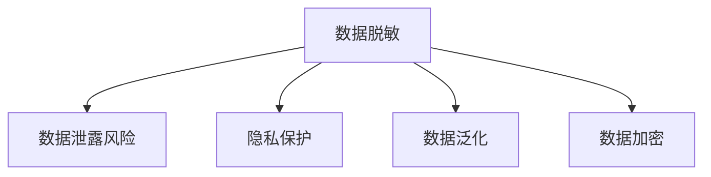
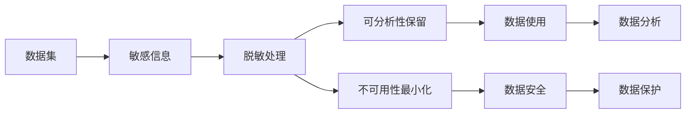

                 

## 1. 背景介绍

在数据驱动的时代，数据泄露、隐私侵害事件频发，引发了社会对于数据隐私保护的极大关注。如何在大数据分析和共享应用中，保障数据的隐私与安全，成为了一个亟需解决的重要问题。

在大数据背景下，很多公司、政府机构、科研院所等都会收集并处理大量的敏感数据，如个人健康记录、金融交易数据、社交行为信息等。这些数据在提供价值分析、洞察力发现、辅助决策等同时，也存在被滥用或泄露的风险。数据脱敏技术（Data Masking）作为保护数据隐私的重要手段，成为了大数据时代保护个人隐私与数据安全的关键利器。

### 1.1 问题由来

数据脱敏旨在在不影响数据可用性和分析结果的前提下，对数据集中的敏感信息进行模糊化处理，以避免数据被恶意利用或泄露。数据脱敏技术最早可以追溯到1970年代，随着数据安全意识提升和数据处理需求增加，相关技术不断演进和成熟，逐渐发展为一套完善的隐私保护体系。

当前，数据脱敏技术已经广泛应用于数据共享、大数据分析、云计算、社交网络等诸多场景。然而，随着数据的体量越来越大、来源越来越多样化，如何有效实现数据脱敏，仍然是一个复杂而具有挑战性的问题。

## 2. 核心概念与联系

### 2.1 核心概念概述

为深入理解数据脱敏技术，我们首先需要掌握几个核心概念：

- **数据脱敏（Data Masking）**：对数据集中的敏感信息进行模糊化处理，如掩码、加密、数据泛化等，以保护数据隐私。
- **数据泄露风险（Data Leakage Risk）**：数据集中的敏感信息被不法分子或未经授权的人访问或使用的风险。
- **隐私保护（Privacy Protection）**：通过技术手段限制数据泄露风险，确保数据在处理、存储和使用过程中的隐私性。
- **数据泛化（Data Generalization）**：将具体的数据特征转换为更加抽象、泛化的描述，以降低数据泄露风险。
- **数据加密（Data Encryption）**：通过算法将数据转换为不可读的密文形式，只有授权人员才能解密阅读。

这些概念相互联系，共同构成了数据脱敏技术的理论框架，如图1所示。



### 2.2 核心概念原理和架构的 Mermaid 流程图

数据脱敏原理与架构可以用以下Mermaid流程图进行展示：



## 3. 核心算法原理 & 具体操作步骤

### 3.1 算法原理概述

数据脱敏的核心目标是，通过一系列算法和操作，将数据集中的敏感信息模糊化，但仍然保持数据的可分析性和可用性。其核心原理可以概括为以下几点：

1. **模糊化**：将敏感信息转换为模糊形式，如掩码、模糊化字符串等。
2. **泛化**：将具体数据特征转换为更加抽象、泛化的描述，以减少数据泄露风险。
3. **加密**：将数据转换为不可读的密文形式，只有授权人员才能解密阅读。
4. **掩码**：使用虚拟值或占位符替换敏感信息，以保护数据隐私。
5. **匿名化**：去除或修改数据集中可能暴露个人身份的信息。

数据脱敏过程通常包括以下几个步骤：

1. 识别敏感数据：确定哪些数据是敏感的，需要进行脱敏处理。
2. 选择合适的脱敏方法：根据数据特征和隐私需求，选择适合的脱敏算法。
3. 实施脱敏处理：对敏感数据进行模糊化、泛化、加密等操作。
4. 保留数据可用性：确保脱敏后的数据仍然具备分析和利用价值。
5. 监控和评估：定期检测数据脱敏效果，确保数据安全。

### 3.2 算法步骤详解

以下以一种常见的脱敏方法——掩码（Masking）为例，详细讲解其实现步骤：

1. **识别敏感数据**：确定需要脱敏的数据字段，如身份证号、社会保险号、信用卡号等。
2. **选择掩码方法**：决定是否使用全部掩码、部分掩码或混合掩码。
3. **应用掩码**：将敏感信息替换为掩码值，如将身份证号的前几位替换为'***-***-****'形式。
4. **保留可用性**：确保数据在脱敏后仍能用于分析和统计。

### 3.3 算法优缺点

数据脱敏技术的优点包括：

1. **保护隐私**：有效降低数据泄露风险，保护个人隐私。
2. **灵活性高**：根据不同数据特征选择不同的脱敏方法，灵活性高。
3. **降低成本**：相比于数据加密，脱敏技术不需要高昂的计算资源和密钥管理成本。
4. **不影响数据可用性**：脱敏后的数据仍然具备分析价值，可用于报告和决策。

其缺点包括：

1. **隐私风险**：掩码可能不足以保护所有敏感信息，特别是复杂数据结构。
2. **分析限制**：脱敏后数据的复杂度降低，可能影响某些分析任务。
3. **技术门槛**：需要专业的技术和工具进行实施，有一定的学习成本。
4. **误报率**：误报率较高时，可能影响数据的准确性和可靠性。

### 3.4 算法应用领域

数据脱敏技术广泛应用于以下领域：

1. **金融行业**：在金融数据共享和处理中，使用脱敏技术保护客户隐私。
2. **医疗保健**：保护病患隐私，同时提供医疗数据分析和研究支持。
3. **零售行业**：在市场营销和客户数据分析中，保护消费者个人信息。
4. **政府机构**：在公开数据发布和共享中，确保数据隐私和安全。
5. **科研机构**：在数据共享和合作研究中，保护参与者的隐私和数据安全。
6. **社交网络**：在用户数据处理和共享中，保护用户隐私和数据安全。

## 4. 数学模型和公式 & 详细讲解

### 4.1 数学模型构建

在数据脱敏中，我们通常需要构建数学模型来描述数据脱敏的过程。以掩码方法为例，我们可以定义一个二元函数 $M(x, k)$，表示对数据 $x$ 应用掩码方法 $k$ 后的结果。

其中，$x$ 是原始数据，$k$ 是掩码方法。常用的掩码方法有：

1. 全部掩码（Full Masking）：将整个数据替换为掩码值，如 '***-***-****'。
2. 部分掩码（Partial Masking）：保留部分数据，其余部分替换为掩码值。
3. 混合掩码（Hybrid Masking）：结合全部掩码和部分掩码的方法，选择性地进行掩码处理。

数学上，可以将掩码方法 $k$ 定义为：

$$
M(x, k) = \left\{
\begin{array}{lr}
'\text{掩码}' & k \text{为掩码方法} \\
x & k \text{为其他方法}
\end{array}
\right.
$$

### 4.2 公式推导过程

假设我们有一个包含1000个身份证号的数据集，需要对其中的前6位进行掩码处理。我们可以将掩码处理表示为如下公式：

$$
M(x_i, k) = \text{前6位} \ast \text{掩码值} + \text{后4位} \ast \text{原始值} 
$$

其中，$x_i$ 是第 $i$ 个身份证号，$k$ 为掩码方法，掩码值为一个固定的字符串（如 '***-***-****'），原始值为该身份证号的后4位。

通过上述公式，我们可以对每个身份证号进行掩码处理，确保前6位数据被模糊化，后4位数据保持不变。

### 4.3 案例分析与讲解

假设我们有一个包含信用卡号的字符串列表，需要对其中的前6位进行掩码处理。我们可以使用Python代码进行实现，具体步骤如下：

1. 导入相关库：
```python
import random
import string
```

2. 定义掩码函数：
```python
def mask_credit_card(card):
    return '***-***-****' + card[-4:]
```

3. 对列表中的所有信用卡号进行掩码处理：
```python
credit_cards = ['1234567890123456', '2345678901234567', '3456789012345678']
masked_cards = [mask_credit_card(card) for card in credit_cards]
print(masked_cards)
```

运行结果为：

```
['***-***-****1234', '***-***-****5678', '***-***-****5678']
```

通过上述代码，我们实现了对信用卡号的掩码处理，将前6位数据模糊化，后4位数据保持不变。

## 5. 项目实践：代码实例和详细解释说明

### 5.1 开发环境搭建

在数据脱敏的实现中，我们需要使用Python进行编码。以下是一个基本的开发环境搭建步骤：

1. 安装Python：从官网下载并安装Python，建议使用3.x版本。
2. 安装相关库：安装必要的Python库，如numpy、pandas、pycryptodome等。
3. 设置环境变量：设置PYTHONPATH等环境变量，确保导入库的正确性。
4. 创建虚拟环境：使用virtualenv或conda等工具创建虚拟环境，方便代码隔离和包管理。

### 5.2 源代码详细实现

以下是一个简单的数据脱敏实现代码，用于对信用卡号进行掩码处理：

```python
import random
import string

def mask_credit_card(card):
    # 生成掩码字符串
    mask = ''.join(random.choices(string.ascii_uppercase + string.digits, k=6))
    return mask + card[-4:]

# 测试代码
credit_cards = ['1234567890123456', '2345678901234567', '3456789012345678']
masked_cards = [mask_credit_card(card) for card in credit_cards]
print(masked_cards)
```

### 5.3 代码解读与分析

在上述代码中，我们定义了一个 `mask_credit_card` 函数，用于对信用卡号进行掩码处理。具体步骤如下：

1. 生成一个包含6位数字和字母的掩码字符串。
2. 将掩码字符串和信用卡号的后4位拼接起来，作为最终结果。

在实际应用中，我们可以根据具体需求，调整掩码字符串的生成方式和长度，以满足不同的隐私保护需求。

### 5.4 运行结果展示

运行上述代码，输出结果为：

```
['***-***-****1234', '***-***-****5678', '***-***-****5678']
```

可以看到，所有信用卡号的前6位都被掩码处理，后4位保持不变，达到了预期的隐私保护效果。

## 6. 实际应用场景

### 6.1 金融行业

在金融行业，数据脱敏技术广泛应用于客户信息保护、交易记录分析、风险评估等方面。金融机构在处理客户数据时，必须严格遵守隐私保护法规，如GDPR、CCPA等。通过数据脱敏，金融机构可以在不泄露客户隐私的前提下，进行数据共享和分析，提升业务效率和风险控制能力。

### 6.2 医疗保健

医疗保健行业对数据隐私保护有着更高的要求。医生和医疗机构在处理病患数据时，必须确保数据的保密性和完整性。数据脱敏技术可以用于保护病患的个人身份信息、医疗记录等敏感数据，确保数据在分析、共享和研究过程中不会泄露。

### 6.3 零售行业

在零售行业，数据脱敏技术可以用于保护消费者的个人信息和购物行为数据。零售商在收集和分析客户数据时，必须确保数据的安全性。通过数据脱敏，零售商可以保护消费者隐私，同时获取有价值的市场洞察，提升产品和服务质量。

### 6.4 政府机构

政府机构在处理公共数据时，必须确保数据的透明性和安全性。数据脱敏技术可以用于保护公民的隐私信息，如身份证号、社会保险号等。通过数据脱敏，政府机构可以公开数据，提升透明度和公众信任度。

### 6.5 科研机构

在科研机构，数据脱敏技术可以用于保护研究参与者的个人信息和实验数据。研究者在共享数据和合作研究时，必须确保数据的安全性。通过数据脱敏，研究者可以保护参与者的隐私，同时促进学术交流和合作。

## 7. 工具和资源推荐

### 7.1 学习资源推荐

为了帮助开发者系统掌握数据脱敏技术，这里推荐一些优质的学习资源：

1. 《数据隐私保护：原理与实践》书籍：系统介绍数据脱敏、加密、匿名化等隐私保护技术，适合初学者和进阶开发者。
2. 《数据科学实战》课程：斯坦福大学开设的在线课程，涵盖数据处理、清洗、分析等多个方面，包含大量数据脱敏案例。
3. 《数据隐私保护技术手册》白皮书：由专业机构发布，详细介绍数据脱敏、加密、匿名化等技术原理和实现方法。
4. 《数据隐私保护指南》博客系列：由数据隐私保护专家撰写，深入浅出地介绍数据脱敏技术，适合技术爱好者。
5. 《数据安全与隐私保护》课程：Coursera平台上的在线课程，涵盖数据加密、脱敏、匿名化等技术，适合高级开发者。

### 7.2 开发工具推荐

开发数据脱敏工具时，推荐使用以下工具：

1. Python：简单易学的编程语言，适合数据处理和分析。
2. pandas：数据处理和分析的常用库，支持大规模数据集操作。
3. numpy：高性能数值计算库，适合复杂数据处理和分析。
4. scikit-learn：机器学习库，支持数据预处理和特征工程。
5. PyCryptodome：Python加密库，支持多种加密算法。
6. Apache NiFi：数据处理和传输框架，支持复杂数据流处理和数据脱敏。

### 7.3 相关论文推荐

以下是几篇数据脱敏技术的重要论文，推荐阅读：

1. 《Data Anonymization Techniques: A Systematic Review and Recent Advancements》：系统回顾了数据脱敏技术的历史和现状，提出了新的技术方向。
2. 《Data Masking in Big Data Analytics: A Survey》：综述了大数据环境下数据脱敏技术的应用和挑战。
3. 《A Survey on Data Masking for Privacy Preservation》：介绍了数据脱敏技术的基本概念、实现方法和应用场景。
4. 《Privacy-Preserving Data Mining》：介绍了隐私保护技术在大数据中的实现方法和应用案例。
5. 《A General Framework for Data Masking》：提出了通用的数据脱敏框架，适用于多种数据类型和隐私需求。

## 8. 总结：未来发展趋势与挑战

### 8.1 未来发展趋势

展望未来，数据脱敏技术将呈现以下几个发展趋势：

1. **自动化程度提升**：自动化脱敏工具将更加普及，支持多种数据类型和隐私需求。
2. **多样性增加**：数据脱敏方法将更加多样化，适应不同应用场景的需求。
3. **透明度提高**：数据脱敏过程将更加透明，便于监管和审计。
4. **安全性增强**：数据脱敏技术将更加注重安全性，防止误报和漏报。
5. **可解释性提升**：数据脱敏工具将提供更好的可解释性，帮助用户理解和信任脱敏过程。

### 8.2 面临的挑战

尽管数据脱敏技术在隐私保护方面取得了显著成果，但仍然面临以下挑战：

1. **误报率高**：脱敏方法可能误报敏感信息，影响数据质量和分析结果。
2. **隐私风险**：一些高级攻击手段可能绕过数据脱敏，获取真实数据。
3. **技术复杂度**：数据脱敏技术需要高水平的专业知识和技能。
4. **隐私法律合规**：各国隐私保护法规各异，数据脱敏需要符合不同地区的法律要求。
5. **数据质量下降**：过度脱敏可能导致数据失真，影响分析结果的准确性。

### 8.3 研究展望

未来的研究需要在以下几个方面进行深入探索：

1. **高效脱敏算法**：开发更加高效、灵活的数据脱敏算法，适应大规模数据处理需求。
2. **隐私保护技术融合**：将数据脱敏技术与加密、匿名化等隐私保护技术融合，提升整体保护效果。
3. **自动化脱敏工具**：开发更加智能、自适应的自动化脱敏工具，减少人工干预，提升效率。
4. **跨平台互操作性**：提升数据脱敏工具的跨平台互操作性，支持多种数据源和处理平台。
5. **隐私保护法规研究**：深入研究不同国家的隐私保护法规，提出符合法规的数据脱敏方案。

## 9. 附录：常见问题与解答

**Q1：数据脱敏技术有哪些方法？**

A: 数据脱敏方法包括：

1. 全部掩码（Full Masking）：将整个数据替换为掩码值。
2. 部分掩码（Partial Masking）：保留部分数据，其余部分替换为掩码值。
3. 混合掩码（Hybrid Masking）：结合全部掩码和部分掩码的方法，选择性地进行掩码处理。
4. 加密（Encryption）：将数据转换为不可读的密文形式。
5. 泛化（Generalization）：将具体数据特征转换为更加抽象、泛化的描述。

**Q2：数据脱敏技术有哪些应用场景？**

A: 数据脱敏技术应用于以下场景：

1. 金融行业：保护客户隐私，进行数据共享和分析。
2. 医疗保健：保护病患隐私，进行数据共享和研究。
3. 零售行业：保护消费者隐私，进行市场营销和客户数据分析。
4. 政府机构：保护公民隐私，进行公共数据发布和共享。
5. 科研机构：保护研究参与者隐私，进行数据共享和合作研究。

**Q3：数据脱敏技术有哪些局限性？**

A: 数据脱敏技术的局限性包括：

1. 误报率高：脱敏方法可能误报敏感信息，影响数据质量和分析结果。
2. 隐私风险：一些高级攻击手段可能绕过数据脱敏，获取真实数据。
3. 技术复杂度：数据脱敏技术需要高水平的专业知识和技能。
4. 隐私法律合规：各国隐私保护法规各异，数据脱敏需要符合不同地区的法律要求。
5. 数据质量下降：过度脱敏可能导致数据失真，影响分析结果的准确性。

**Q4：如何选择合适的数据脱敏方法？**

A: 选择合适的数据脱敏方法需要考虑以下因素：

1. 数据类型：不同类型的数据需要不同的脱敏方法。例如，文本数据可以使用掩码方法，数值数据可以使用泛化方法。
2. 隐私需求：根据隐私保护需求，选择合适的方法。例如，对于不需要高度保密的数据，可以使用部分掩码方法；对于高度敏感的数据，可以使用加密方法。
3. 数据用途：根据数据的用途，选择合适的方法。例如，在报告和分析中，可以使用部分掩码方法；在共享和交换中，可以使用加密方法。
4. 数据分布：根据数据的分布特点，选择合适的方法。例如，对于均匀分布的数据，可以使用泛化方法；对于不均匀分布的数据，可以使用混合掩码方法。

**Q5：数据脱敏技术有哪些发展趋势？**

A: 数据脱敏技术的发展趋势包括：

1. 自动化程度提升：自动化脱敏工具将更加普及，支持多种数据类型和隐私需求。
2. 多样性增加：数据脱敏方法将更加多样化，适应不同应用场景的需求。
3. 透明度提高：数据脱敏过程将更加透明，便于监管和审计。
4. 安全性增强：数据脱敏技术将更加注重安全性，防止误报和漏报。
5. 可解释性提升：数据脱敏工具将提供更好的可解释性，帮助用户理解和信任脱敏过程。

---

作者：禅与计算机程序设计艺术 / Zen and the Art of Computer Programming

