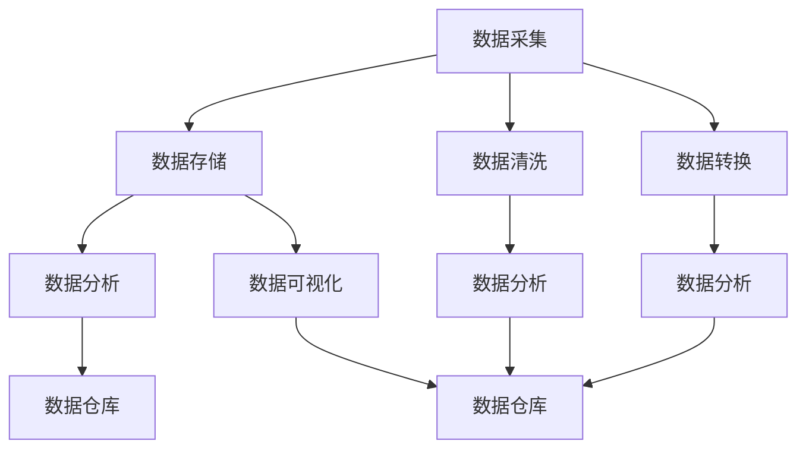

                 

## 1. 背景介绍

### 1.1 问题由来
随着数字化的普及，数据成为了现代社会不可或缺的重要资源。无论是企业运营、科学研究还是政府决策，数据都在其中扮演着核心角色。正如石油在20世纪的重要性，数据已经成为21世纪的新“石油”。然而，数据并非天赋异禀，它需要被采集、存储、清洗、处理和分析，才能被转化为有价值的知识和洞察。

数据的重要性体现在其广泛的应用场景中：

- **商业智能(Business Intelligence, BI)**：通过数据驱动的决策支持，企业能够优化运营流程、提升销售业绩、降低成本，从而获得竞争优势。
- **科学发现**：科研领域依赖大规模数据分析，揭示生命科学、物理学、天文学等学科的奥秘，推动科技进步。
- **公共政策**：政府通过数据分析进行社会经济分析，优化政策制定，提升公共服务质量。
- **医疗健康**：医疗数据帮助医生做出精准诊断，优化治疗方案，提升患者护理质量。
- **交通出行**：交通数据优化城市规划，提升出行效率，减少交通拥堵。
- **金融服务**：金融数据支持风险管理、交易策略，提升金融服务的稳健性和效率。

### 1.2 问题核心关键点
如何高效地采集、处理和分析数据，成为各个行业都需要回答的问题。一方面，数据的质量和可用性直接影响分析结果的准确性。另一方面，数据量的增加也带来了数据管理、存储和计算方面的挑战。为了应对这些挑战，数据科学与数据工程领域得到了快速发展。

数据科学与数据工程的核心在于数据治理、数据管道和数据分析。数据治理关注数据的定义、安全、质量和合规性，数据管道负责数据的采集、存储和传输，数据分析则是数据科学的核心，旨在从数据中提取知识和洞察。

本文将深入探讨数据科学和数据工程的核心概念与技术，帮助读者理解数据的重要性和掌握数据处理的关键方法。

## 2. 核心概念与联系

### 2.1 核心概念概述

为更好地理解数据科学与数据工程的核心概念，本节将介绍几个关键概念：

- **数据采集**：从不同数据源获取数据，包括数据库、传感器、API接口等。
- **数据存储**：将采集的数据存储在数据库或分布式存储系统，如Hadoop、Hive、AWS S3等。
- **数据清洗**：清洗数据中的噪声和错误，包括去重、缺失值处理、异常值检测等。
- **数据转换**：将数据转换为分析模型所需的形式，如特征工程、数据标准化等。
- **数据分析**：使用统计学、机器学习等方法对数据进行分析，提取知识和洞察。
- **数据可视化**：通过图表、仪表盘等形式展示数据分析结果，便于理解和传播。
- **数据仓库**：集成了多种数据源，提供统一的数据访问接口，支持复杂查询和分析。
- **ETL（Extract, Transform, Load）流程**：数据采集、转换和加载的流程，用于构建数据管道。

这些概念之间的逻辑关系可以通过以下Mermaid流程图来展示：



这个流程图展示了大数据处理的基本流程：数据从多个源采集，存储在分布式系统，清洗转换后进行数据分析和可视化，最终集成到数据仓库，支持复杂查询和分析。

## 3. 核心算法原理 & 具体操作步骤
### 3.1 算法原理概述

数据科学和数据工程的核心在于如何有效地管理、处理和分析数据。其核心算法原理包括但不限于以下几个方面：

- **统计学**：使用统计学方法描述和分析数据，包括均值、方差、概率分布等。
- **机器学习**：使用机器学习算法训练模型，从数据中提取模式和规律，支持预测和分类任务。
- **数据挖掘**：从大规模数据集中发现关联规则、异常模式和分类聚类。
- **自然语言处理**：处理和分析文本数据，包括文本清洗、情感分析、命名实体识别等。
- **数据可视化**：使用图表、仪表盘等形式展示数据洞察，帮助用户理解和决策。
- **分布式计算**：使用分布式计算技术，高效处理大规模数据。

### 3.2 算法步骤详解

数据科学与数据工程的具体操作流程可以分为以下几个步骤：

**Step 1: 数据采集**

- 确定数据源：选择符合业务需求的数据源，如数据库、API接口、传感器等。
- 数据采集工具：使用ETL工具如Apache Nifi、Apache Airflow等采集数据。
- 数据质量监控：在数据采集过程中实时监控数据质量，确保数据准确、完整和一致。

**Step 2: 数据存储**

- 选择合适的存储系统：根据数据规模和访问需求，选择适合的数据存储系统，如传统关系型数据库、NoSQL数据库、分布式文件系统等。
- 数据分区与索引：对数据进行分区和索引，提高查询效率。

**Step 3: 数据清洗**

- 数据去重：检测和去除重复数据，确保数据唯一性。
- 缺失值处理：处理数据中的缺失值，可以使用均值填充、插值填充等方法。
- 异常值检测：检测并处理异常值，确保数据的一致性。

**Step 4: 数据转换**

- 特征工程：从原始数据中提取和构造新的特征，提升模型的预测能力。
- 数据标准化：将数据转换为标准格式，便于后续分析。

**Step 5: 数据分析**

- 数据探索性分析：使用统计学方法初步分析数据，发现数据中的规律和趋势。
- 机器学习建模：使用机器学习算法训练模型，进行分类、预测等任务。
- 数据可视化：使用数据可视化工具如Tableau、Power BI等，展示数据分析结果。

**Step 6: 数据仓库构建**

- 数据仓库设计：设计数据仓库架构，包括实体关系、表结构等。
- 数据仓库加载：将清洗转换后的数据加载到数据仓库中。
- 数据仓库查询：使用SQL查询或BI工具，进行复杂查询和分析。

### 3.3 算法优缺点

数据科学与数据工程的方法有其显著的优点：

- **数据驱动决策**：通过数据分析，企业能够更好地理解市场和用户需求，做出更加科学的决策。
- **提升效率**：自动化数据处理流程，大幅提升数据处理和分析的效率。
- **成本降低**：优化数据管理，减少数据存储和计算成本。
- **增强洞察力**：通过数据挖掘和机器学习，从数据中提取更深层次的洞察，帮助企业发现潜在机会和风险。

同时，这些方法也存在一定的局限性：

- **技术门槛高**：需要掌握复杂的技术栈，如Python、R、SQL等，以及数据分析工具和框架。
- **数据质量要求高**：数据质量直接影响分析结果，需要严格的数据质量监控和处理。
- **隐私和安全问题**：数据处理涉及大量敏感信息，需要严格的数据保护措施。

### 3.4 算法应用领域

数据科学与数据工程广泛应用于多个领域，以下是几个典型的应用场景：

- **金融领域**：通过大数据分析，提升风险管理、投资策略和客户服务质量。
- **医疗健康**：分析医疗数据，支持精准医疗、疾病预测和公共卫生决策。
- **零售行业**：通过客户行为分析，优化销售策略、库存管理和客户体验。
- **制造业**：通过设备数据监测，提高生产效率和设备维护。
- **物流运输**：通过交通数据优化路线规划、配送优化和库存管理。
- **公共安全**：通过视频和监控数据，提升犯罪预测和应急响应能力。

## 4. 数学模型和公式 & 详细讲解 & 举例说明

### 4.1 数学模型构建

数据科学与数据工程中的数学模型构建，主要涉及统计学和机器学习的相关知识。

**回归分析模型**：用于预测连续型变量的模型，常见公式如下：

$$
y = \beta_0 + \beta_1x_1 + \beta_2x_2 + \cdots + \beta_nx_n + \epsilon
$$

其中，$y$ 为预测变量，$x_i$ 为解释变量，$\beta_i$ 为回归系数，$\epsilon$ 为误差项。

**分类模型**：用于预测离散型变量的模型，常见公式如下：

$$
P(y = 1 | x) = \frac{e^{z(x)}}{1 + e^{z(x)}}
$$

其中，$z(x) = \theta_0 + \theta_1x_1 + \theta_2x_2 + \cdots + \theta_nx_n$，$\theta_i$ 为分类模型参数。

### 4.2 公式推导过程

回归分析模型的推导过程如下：

1. 假设数据满足线性回归模型：$y = \beta_0 + \beta_1x_1 + \beta_2x_2 + \cdots + \beta_nx_n + \epsilon$
2. 最小化残差平方和：$\sum_{i=1}^n (y_i - \hat{y}_i)^2$
3. 通过最小二乘法求解回归系数：$\beta_i = \frac{\sum_{i=1}^n x_ix_i \sum_{i=1}^n x_iy_i - \sum_{i=1}^n x_i\sum_{i=1}^n x_iy_i}{\sum_{i=1}^n x_ix_i - \sum_{i=1}^n x_i^2}$
4. 得到回归模型：$\hat{y} = \beta_0 + \beta_1x_1 + \beta_2x_2 + \cdots + \beta_nx_n$

分类模型的推导过程如下：

1. 假设数据满足逻辑回归模型：$P(y = 1 | x) = \frac{e^{z(x)}}{1 + e^{z(x)}}$
2. 最小化交叉熵损失函数：$\sum_{i=1}^n (y_i \log P(y = 1 | x_i) + (1 - y_i) \log P(y = 0 | x_i))$
3. 通过梯度下降法求解分类模型参数：$\theta_i = \frac{\sum_{i=1}^n x_iy_i - \sum_{i=1}^n x_i}{\sum_{i=1}^n x_i^2}$
4. 得到分类模型：$\hat{y} = \begin{cases} 1, & \text{if } z(x) > 0 \\ 0, & \text{if } z(x) \leq 0 \end{cases}$

### 4.3 案例分析与讲解

**案例1: 预测房价**

假设有一个包含房屋面积、地理位置、年龄等特征的数据集，可以构建回归模型预测房价。

1. 数据准备：将数据集划分为训练集和测试集，并进行标准化处理。
2. 模型构建：使用线性回归模型，输入特征为房屋面积、地理位置、年龄等，输出为房价。
3. 模型训练：使用训练集数据训练模型，通过交叉验证调整参数。
4. 模型评估：使用测试集数据评估模型性能，计算均方误差（MSE）等指标。
5. 结果展示：将模型应用到新房屋数据，预测其价格。

**案例2: 客户流失预测**

假设有一个包含客户基本信息、消费记录、服务评价等特征的数据集，可以构建分类模型预测客户流失。

1. 数据准备：将数据集划分为训练集和测试集，并进行缺失值处理和特征工程。
2. 模型构建：使用逻辑回归模型，输入特征为客户基本信息、消费记录、服务评价等，输出为流失与否。
3. 模型训练：使用训练集数据训练模型，通过交叉验证调整参数。
4. 模型评估：使用测试集数据评估模型性能，计算准确率、召回率、F1分数等指标。
5. 结果展示：将模型应用到新客户数据，预测其流失概率。

## 5. 项目实践：代码实例和详细解释说明

### 5.1 开发环境搭建

在进行数据科学与数据工程项目实践前，我们需要准备好开发环境。以下是使用Python进行项目开发的常见环境配置流程：

1. 安装Anaconda：从官网下载并安装Anaconda，用于创建独立的Python环境。

2. 创建并激活虚拟环境：
```bash
conda create -n data-env python=3.8 
conda activate data-env
```

3. 安装相关库：
```bash
pip install numpy pandas scikit-learn matplotlib seaborn statsmodels jupyter notebook ipython
```

4. 安装分布式计算库：
```bash
pip install dask
```

5. 安装数据可视化库：
```bash
pip install matplotlib seaborn plotly
```

完成上述步骤后，即可在`data-env`环境中开始项目开发。

### 5.2 源代码详细实现

**案例1: 房价预测**

首先，定义数据准备和模型训练函数：

```python
import pandas as pd
from sklearn.model_selection import train_test_split
from sklearn.linear_model import LinearRegression
from sklearn.metrics import mean_squared_error

# 读取数据
data = pd.read_csv('house_data.csv')

# 数据预处理
X = data[['area', 'location', 'age']]
y = data['price']

# 数据划分
X_train, X_test, y_train, y_test = train_test_split(X, y, test_size=0.2, random_state=42)

# 模型训练
model = LinearRegression()
model.fit(X_train, y_train)

# 模型评估
y_pred = model.predict(X_test)
mse = mean_squared_error(y_test, y_pred)
print(f"MSE: {mse:.2f}")
```

然后，使用测试集数据进行预测和结果展示：

```python
# 测试集预测
new_data = pd.DataFrame({'size': [200], 'location': ['City A'], 'age': [5]})
new_data = (new_data - new_data.mean()) / new_data.std()
y_pred = model.predict(new_data)
print(f"Predicted Price: {y_pred[0]}")
```

**案例2: 客户流失预测**

接下来，定义数据准备和模型训练函数：

```python
import pandas as pd
from sklearn.model_selection import train_test_split
from sklearn.linear_model import LogisticRegression
from sklearn.metrics import accuracy_score

# 读取数据
data = pd.read_csv('customer_data.csv')

# 数据预处理
X = data[['age', 'spending', 'service_score']]
y = data['churn']

# 数据划分
X_train, X_test, y_train, y_test = train_test_split(X, y, test_size=0.2, random_state=42)

# 模型训练
model = LogisticRegression()
model.fit(X_train, y_train)

# 模型评估
y_pred = model.predict(X_test)
accuracy = accuracy_score(y_test, y_pred)
print(f"Accuracy: {accuracy:.2f}")
```

然后，使用测试集数据进行预测和结果展示：

```python
# 测试集预测
new_data = pd.DataFrame({'age': [30], 'spending': [10000], 'service_score': [4.5]})
new_data = (new_data - new_data.mean()) / new_data.std()
y_pred = model.predict(new_data)
print(f"Churn Predicted: {y_pred[0]}")
```

### 5.3 代码解读与分析

让我们再详细解读一下关键代码的实现细节：

**案例1: 房价预测**

**数据准备**：
- 读取数据：使用`pd.read_csv`读取CSV格式的数据集。
- 数据预处理：将房屋面积、地理位置、年龄等特征作为输入特征`X`，房价作为输出变量`y`。
- 数据划分：使用`train_test_split`将数据集划分为训练集和测试集，保证数据集的随机性和公平性。

**模型训练**：
- 模型构建：使用`LinearRegression`构建线性回归模型。
- 模型训练：使用`fit`方法在训练集上训练模型。

**模型评估**：
- 模型评估：使用`predict`方法在测试集上预测房价，使用`mean_squared_error`计算均方误差，评估模型性能。

**结果展示**：
- 使用`predict`方法对新房屋数据进行预测，打印预测结果。

**案例2: 客户流失预测**

**数据准备**：
- 读取数据：使用`pd.read_csv`读取CSV格式的数据集。
- 数据预处理：将客户基本信息、消费记录、服务评价等特征作为输入特征`X`，流失与否作为输出变量`y`。
- 数据划分：使用`train_test_split`将数据集划分为训练集和测试集，保证数据集的随机性和公平性。

**模型训练**：
- 模型构建：使用`LogisticRegression`构建逻辑回归模型。
- 模型训练：使用`fit`方法在训练集上训练模型。

**模型评估**：
- 模型评估：使用`predict`方法在测试集上预测流失与否，使用`accuracy_score`计算准确率，评估模型性能。

**结果展示**：
- 使用`predict`方法对新客户数据进行预测，打印预测结果。

## 6. 实际应用场景

### 6.1 智能推荐系统

智能推荐系统广泛应用在电商、媒体、社交网络等平台，帮助用户发现和推荐感兴趣的内容。通过分析用户的历史行为、兴趣偏好和社交网络关系，智能推荐系统可以提供个性化的推荐服务，提升用户体验和平台黏性。

**案例**：Netflix推荐系统

Netflix使用数据科学方法，通过用户观看历史、评分数据、好友推荐等多维度数据，训练推荐模型，提供个性化内容推荐。通过数据驱动的决策，Netflix能够实时调整推荐算法，提升用户体验和平台留存率。

**具体步骤**：
1. 数据收集：收集用户观看历史、评分数据、好友推荐等数据。
2. 数据清洗：清洗数据中的噪声和错误，确保数据质量。
3. 数据转换：提取和构造新的特征，提升推荐模型的预测能力。
4. 模型训练：使用协同过滤、深度学习等算法，训练推荐模型。
5. 模型评估：使用A/B测试等方法，评估推荐模型的效果。
6. 实时推荐：将训练好的模型部署到推荐系统中，实时为用户推荐内容。

### 6.2 金融风险管理

金融行业面临复杂的风险管理需求，通过数据分析，金融机构可以更好地识别和评估风险，优化风险管理策略。

**案例**：信用评分系统

信用评分系统通过分析客户的收入、信用历史、负债等数据，评估客户的信用风险，支持贷款审批、保险理赔等业务决策。通过数据科学方法，金融机构能够实时监控和评估客户的信用状况，降低坏账率，提高业务效率。

**具体步骤**：
1. 数据收集：收集客户的收入、信用历史、负债等数据。
2. 数据清洗：清洗数据中的噪声和错误，确保数据质量。
3. 数据转换：提取和构造新的特征，提升信用评分模型的预测能力。
4. 模型训练：使用逻辑回归、随机森林等算法，训练信用评分模型。
5. 模型评估：使用信用评分结果评估模型性能，优化模型参数。
6. 实时评估：将训练好的模型部署到业务系统中，实时评估客户的信用风险。

### 6.3 城市交通规划

城市交通规划需要处理海量交通数据，通过数据分析，可以优化交通管理，提升城市交通效率。

**案例**：智能交通系统

智能交通系统通过分析交通流量、车辆位置、气象数据等，预测和优化交通流量，提升城市交通效率。通过数据科学方法，城市管理者能够实时监控和预测交通状况，优化交通信号控制，减少交通拥堵。

**具体步骤**：
1. 数据收集：收集交通流量、车辆位置、气象数据等数据。
2. 数据清洗：清洗数据中的噪声和错误，确保数据质量。
3. 数据转换：提取和构造新的特征，提升交通预测模型的预测能力。
4. 模型训练：使用深度学习、时间序列分析等算法，训练交通预测模型。
5. 模型评估：使用交通流量预测结果评估模型性能，优化模型参数。
6. 实时预测：将训练好的模型部署到交通管理系统中，实时预测交通流量，优化交通信号控制。

## 7. 工具和资源推荐

### 7.1 学习资源推荐

为了帮助开发者系统掌握数据科学与数据工程的理论基础和实践技巧，这里推荐一些优质的学习资源：

1. **《数据科学入门》**：斯坦福大学提供的免费在线课程，系统介绍数据科学的基本概念和关键技术。

2. **《Python数据科学手册》**：使用Python进行数据分析的经典教程，涵盖数据清洗、特征工程、模型训练等内容。

3. **《数据科学实战》**：实战性较强的数据科学项目开发教程，通过多个项目案例，手把手教你使用Python进行数据科学开发。

4. **Kaggle**：全球最大的数据科学竞赛平台，提供丰富的数据集和比赛，帮助开发者实践数据科学技能。

5. **Google Colab**：谷歌提供的免费在线Jupyter Notebook环境，支持GPU加速，便于快速上手实验最新模型。

通过这些资源的学习实践，相信你一定能够快速掌握数据科学与数据工程的核心技术和方法，并应用于实际项目中。

### 7.2 开发工具推荐

高效的开发离不开优秀的工具支持。以下是几款用于数据科学与数据工程开发的常用工具：

1. **Jupyter Notebook**：支持Python、R等语言的交互式开发，便于快速迭代和调试。

2. **PySpark**：Apache Spark的Python API，支持分布式计算，处理大规模数据集。

3. **Apache Hadoop**：支持分布式文件系统和大数据处理，处理海量数据。

4. **Apache Hive**：支持数据仓库构建和查询，提供高效的SQL查询接口。

5. **TensorFlow**：Google开发的深度学习框架，支持分布式计算和模型训练。

6. **Pandas**：Python的数据分析库，提供丰富的数据处理和分析功能。

7. **NumPy**：Python的数值计算库，提供高效的数学运算和数组操作。

合理利用这些工具，可以显著提升数据科学与数据工程开发的效率，加快创新迭代的步伐。

### 7.3 相关论文推荐

数据科学与数据工程的研究领域十分广泛，以下是几篇奠基性的相关论文，推荐阅读：

1. **《数据挖掘：概念与技术》**：作者Pang-Ning Tan等，系统介绍数据挖掘的基本概念和技术，是数据科学领域的经典教材。

2. **《机器学习：实战指南》**：作者Peter Harrington，通过实战案例，详细介绍机器学习算法和实现方法。

3. **《分布式数据处理框架Hadoop》**：作者Tom White，详细介绍Hadoop分布式计算系统，帮助开发者理解和实现分布式计算。

4. **《大规模数据处理：Apache Spark技术》**：作者Mihai Capotă，详细介绍Apache Spark分布式计算框架，支持大规模数据处理和分析。

5. **《数据科学与机器学习：案例分析》**：作者John Machin，通过多个案例分析，详细讲解数据科学和机器学习的实际应用。

这些论文代表了大数据处理和分析领域的发展脉络。通过学习这些前沿成果，可以帮助研究者把握学科前进方向，激发更多的创新灵感。

## 8. 总结：未来发展趋势与挑战

### 8.1 总结

本文对数据科学与数据工程的核心概念与技术进行了全面系统的介绍。首先阐述了数据的重要性和数据科学与数据工程的核心范式，明确了数据驱动决策和自动化数据处理流程的关键作用。其次，从算法原理和操作步骤，详细讲解了数据处理的关键方法和具体步骤。最后，通过多个实际应用案例，展示了数据科学与数据工程在各个行业的应用前景。

通过本文的系统梳理，可以看到，数据科学与数据工程是实现数据驱动决策和自动化数据处理的重要技术，具有广阔的应用前景和深远的社会影响。掌握数据科学与数据工程的技术，将为各个行业带来新的机遇和挑战。

### 8.2 未来发展趋势

展望未来，数据科学与数据工程将继续发展，呈现以下几个趋势：

1. **数据治理和数据质量管理**：随着数据量的增加，数据治理和数据质量管理的重要性日益突出，数据质量将直接影响分析结果的准确性和可靠性。

2. **自动化数据处理流程**：自动化数据处理流程将成为行业标配，提高数据处理的效率和准确性，降低人工干预的风险。

3. **分布式计算和云平台**：随着数据量的激增，分布式计算和云平台将成为处理大规模数据的重要工具，提供高效的计算和存储能力。

4. **数据科学教育普及**：数据科学教育将成为行业标配，培养更多数据科学人才，推动数据驱动决策的普及和应用。

5. **跨领域数据融合**：跨领域数据融合将成为未来趋势，通过多源数据整合，提升数据洞察力和决策支持能力。

6. **数据隐私和安全**：数据隐私和安全问题日益凸显，如何保护用户隐私和数据安全，将成为数据科学与数据工程的重要研究方向。

### 8.3 面临的挑战

尽管数据科学与数据工程技术取得了显著进展，但在数据处理和应用过程中，仍面临诸多挑战：

1. **数据质量管理**：数据质量直接影响分析结果的准确性和可靠性，如何提升数据质量，确保数据一致性和完整性，仍然是一个重要挑战。

2. **数据存储和计算资源**：大规模数据的存储和计算资源需求大，如何优化存储和计算资源管理，提高数据处理效率，需要进一步研究和探索。

3. **数据隐私和安全**：数据隐私和安全问题日益凸显，如何保护用户隐私和数据安全，是一个重要研究方向。

4. **数据模型选择**：选择适当的模型进行数据处理和分析，需要考虑数据特性、业务需求和计算资源等多方面因素，选择不当可能导致模型性能不佳。

5. **数据驱动决策**：数据驱动决策需要综合考虑业务目标、用户需求和数据特性，如何优化决策模型，提高决策质量和效果，仍然是一个重要挑战。

### 8.4 研究展望

面对数据科学与数据工程面临的挑战，未来的研究需要在以下几个方面寻求新的突破：

1. **自动化数据治理和质量管理**：通过自动化工具和技术，提升数据质量和治理能力，降低人工干预的风险。

2. **高效数据存储和计算**：开发新的分布式计算和云平台技术，提高大规模数据的存储和计算能力，降低存储和计算成本。

3. **数据隐私和安全保护**：研究数据隐私和安全技术，保护用户隐私和数据安全，建立可靠的数据处理环境。

4. **跨领域数据融合**：研究跨领域数据融合技术，整合多源数据，提升数据洞察力和决策支持能力。

5. **智能数据驱动决策**：结合AI和机器学习技术，构建智能数据驱动决策系统，提高决策质量和效果。

这些研究方向将引领数据科学与数据工程技术的发展，推动数据驱动决策的普及和应用，为各行各业带来新的机遇和挑战。

## 9. 附录：常见问题与解答

**Q1: 数据科学与数据工程的区别是什么？**

A: 数据科学与数据工程是数据处理和分析的不同方面。数据科学主要关注数据的分析和洞察，通过数据挖掘、机器学习等技术，从数据中提取知识和模式。数据工程主要关注数据的处理和存储，通过ETL（Extract, Transform, Load）流程，将数据从多个源采集、清洗、转换和加载到数据仓库中，提供统一的数据访问接口。

**Q2: 数据科学和数据工程需要哪些技术栈？**

A: 数据科学与数据工程需要掌握以下技术栈：
1. Python、R、SQL等编程语言。
2. Pandas、NumPy、Scikit-learn等数据处理和分析库。
3. TensorFlow、PyTorch等深度学习框架。
4. Apache Spark、Hadoop等分布式计算平台。
5. 数据可视化工具如Tableau、Power BI等。

**Q3: 如何提升数据质量？**

A: 提升数据质量可以从以下几个方面入手：
1. 数据清洗：检测和修复数据中的噪声和错误，确保数据一致性和完整性。
2. 数据标准化：将数据转换为标准格式，提升数据处理和分析效率。
3. 数据校验：引入数据校验规则，检测数据异常和错误，确保数据质量。
4. 数据治理：建立数据治理框架，确保数据的安全和合规性。

**Q4: 如何构建高效的数据处理流程？**

A: 构建高效的数据处理流程可以从以下几个方面入手：
1. 数据采集自动化：使用ETL工具和脚本，自动化数据采集和处理流程。
2. 数据处理并行化：使用分布式计算平台，并行处理大规模数据，提升处理效率。
3. 数据存储优化：使用高效的数据存储技术，降低数据存储和计算成本。
4. 数据管道监控：实时监控数据管道，确保数据处理流程的稳定性和可靠性。

**Q5: 如何保护数据隐私和安全？**

A: 保护数据隐私和安全可以从以下几个方面入手：
1. 数据加密：对敏感数据进行加密处理，确保数据传输和存储的安全。
2. 数据脱敏：对数据进行脱敏处理，保护用户隐私。
3. 访问控制：通过访问控制技术，限制数据的访问权限，确保数据安全。
4. 安全审计：建立安全审计机制，监控数据访问和处理行为，防范数据泄露和攻击。

通过这些问题的解答，希望读者能够更加全面地理解数据科学与数据工程的核心概念和关键技术，为未来的数据处理和分析工作提供指导和参考。

---

作者：禅与计算机程序设计艺术 / Zen and the Art of Computer Programming

