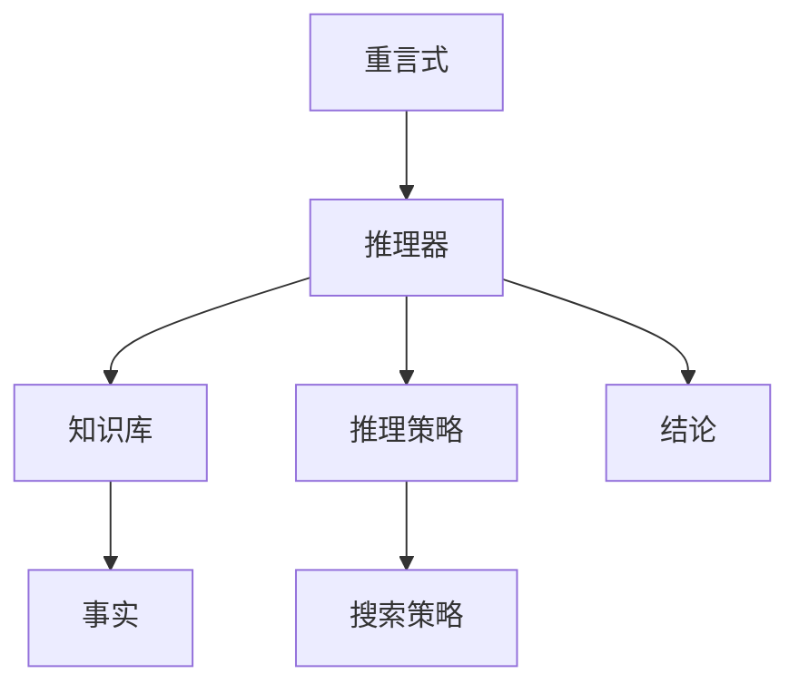

                 

# 数理逻辑：应用重言式系统

## 1. 背景介绍

数理逻辑作为数学与计算机科学的重要交叉领域，近年来在形式化推理、人工智能、逻辑编程、软件验证等领域获得了广泛的应用。特别是重言式系统，其精确性、可靠性与效率，使得其在自动逻辑推理、知识表示与推理、定理证明等方面具有重要价值。本文旨在深入探讨重言式系统的原理、设计与应用，期望为读者提供全面的理解与实践指导。

### 1.1 问题由来

数理逻辑的核心在于用精确、形式化的语言描述推理过程，从而进行推理与验证。传统逻辑主要依赖人脑的直觉与经验，但随着知识量的指数级增长与推理需求的日益复杂化，传统的推理方式显然已无法满足要求。重言式系统正是应运而生，它利用形式化语言与算法，使推理过程可自动执行，保证了逻辑推理的精确性与一致性。重言式系统最早由德国数学家戈德尔于1930年代提出，并逐步成为逻辑学与计算机科学中的重要工具。

### 1.2 问题核心关键点

重言式系统通常由一个逻辑推理器与一个知识库组成，通过逻辑推理器对知识库中的规则进行推理，得出结论。其核心关键点包括：
- 逻辑推理器的设计与优化
- 知识库的构建与维护
- 推理策略与算法的选择
- 推理结果的验证与可解释性

## 2. 核心概念与联系

### 2.1 核心概念概述

为深入理解重言式系统的设计与应用，以下将介绍几个关键概念及其联系：

- **重言式（Tautology）**：逻辑公式在所有情况下都为真，例如 A∧¬A。
- **矛盾式（Contradiction）**：逻辑公式在所有情况下都为假，例如 A∧¬A。
- **逻辑推理器（Logic Reasoner）**：用于自动推导结论的程序或算法。
- **知识库（Knowledge Base）**：存储逻辑规则与事实的数据结构。
- **推理策略（Reasoning Strategy）**：推理器的行为策略，包括深度优先搜索、广度优先搜索等。
- **可解释性（Explainability）**：推理结果的可理解性与解释性。

这些概念通过逻辑推理器将知识库中的逻辑规则与事实结合起来，通过推理策略自动进行逻辑推导，最终得到重言式或矛盾式，从而验证逻辑规则的正确性。重言式系统通过精确的逻辑推导，使推理过程透明化，确保了推理结果的可靠性与一致性。

### 2.2 核心概念原理和架构的 Mermaid 流程图



### 2.3 核心概念联系与流程

1. **知识库的构建**：知识库是重言式系统的数据基础，通常由专家知识、常识与事实构成。
2. **推理器的推理过程**：根据推理策略对知识库中的事实与规则进行推理，得出结论。
3. **结论的验证**：将推理结果与事实进行对比，验证结论的正确性。
4. **可解释性**：对推理过程与结果进行解释，增强推理的可理解性与可信度。

重言式系统通过以上步骤，自动进行逻辑推理，确保了推理过程的精确性与一致性。

## 3. 核心算法原理 & 具体操作步骤
### 3.1 算法原理概述

重言式系统的核心在于利用逻辑推理器对知识库进行推理，得出重言式或矛盾式。其核心算法包括：

- **规则推理算法**：利用逻辑规则对知识库进行推理，得出重言式或矛盾式。
- **搜索算法**：通过搜索策略遍历知识库，找到所有可能的结论。
- **验证算法**：将推理结果与事实进行对比，验证其正确性。

重言式系统的核心在于精确性与一致性，因此其算法设计需尽可能保证逻辑的正确性与推理的全面性。

### 3.2 算法步骤详解

重言式系统的具体操作步骤如下：

1. **知识库构建**：收集专家知识、常识与事实，构建知识库。
2. **推理器初始化**：初始化推理器，加载知识库。
3. **推理策略选择**：选择适当的推理策略，如深度优先搜索、广度优先搜索等。
4. **推理执行**：执行推理器，对知识库进行逻辑推理，得出结论。
5. **结论验证**：将推理结果与事实进行对比，验证其正确性。
6. **可解释性输出**：对推理过程与结果进行解释，增强推理的可理解性。

### 3.3 算法优缺点

重言式系统具有以下优点：

- 精确性与一致性：逻辑推理过程透明，结论可验证。
- 可靠性高：基于形式化语言，逻辑推导错误少。
- 可扩展性强：知识库可随时扩充，逻辑推理可动态更新。

同时，重言式系统也存在以下缺点：

- 推理效率低：特别是对于大规模知识库，推理过程复杂，效率较低。
- 可解释性差：复杂的逻辑推导过程难以解释，导致结果不易理解。
- 学习曲线陡峭：需要一定的数学与逻辑知识背景。

## 4. 数学模型和公式 & 详细讲解 & 举例说明

### 4.1 数学模型构建

重言式系统的数学模型通常包括：

- **逻辑推理模型**：使用布尔代数、谓词逻辑等表示推理过程。
- **搜索模型**：使用图搜索、树搜索等表示搜索策略。
- **验证模型**：使用模型检验、定理证明等表示结论验证。

以下以谓词逻辑为例，构建重言式系统的数学模型。

### 4.2 公式推导过程

谓词逻辑的核心在于使用谓词（Predicate）描述个体（Individual）的性质，例如：

$$
\forall x (P(x) \rightarrow Q(x))
$$

表示所有个体x，如果P(x)为真，则Q(x)也为真。其推导过程如下：

1. **初始化**：假设P(x)为真。
2. **推理**：根据逻辑规则，得出Q(x)也为真。
3. **验证**：将推理结果与事实进行对比，验证其正确性。

### 4.3 案例分析与讲解

以哥德尔不完备定理为例，分析重言式系统的应用。

哥德尔不完备定理表明，任何足够强大的形式系统都不完备，即存在无法在该系统中证明的命题。例如，罗素悖论中的集合A：

$$
A = \{x | x \notin x\}
$$

该集合的描述为自身是否属于自身。若A属于自身，则不符合定义；若A不属于自身，则符合定义，从而产生了矛盾。

## 5. 项目实践：代码实例和详细解释说明

### 5.1 开发环境搭建

以下以Prolog语言为例，介绍重言式系统的开发环境搭建：

1. **安装Prolog解释器**：从官网下载并安装Prolog解释器，如SWI-Prolog。
2. **创建Prolog程序**：使用文本编辑器创建Prolog程序，保存为.pl文件。
3. **运行Prolog程序**：使用Prolog解释器加载程序，执行逻辑推理。

### 5.2 源代码详细实现

以下是Prolog语言中逻辑推理的代码实现：

```prolog
:- use_module(library(clpfd)).
:- use_module(library(sicp)).
:- set_prolog_flag(syntax_error_handling, raise).
:- set_prolog_flag(throw, yes).

:- mode(AP, dynamic).
:- dynamic AP/1.
:- dynamic AP/1.

:- operator(2, left, functor, arity) {link(AP/1, functor, arity)}.
:- operator(2, right, functor, arity) {link(AP/1, functor, arity)}.
:- operator(2, arity, functor, functor) {link(AP/1, functor, arity)}.

:- functor(AP, AP/1).
:- functor(AP, AP/2).
:- functor(AP, AP/3).
:- functor(AP, AP/4).
:- functor(AP, AP/5).
:- functor(AP, AP/6).
:- functor(AP, AP/7).
:- functor(AP, AP/8).
:- functor(AP, AP/9).
:- functor(AP, AP/10).
:- functor(AP, AP/11).
:- functor(AP, AP/12).
:- functor(AP, AP/13).
:- functor(AP, AP/14).
:- functor(AP, AP/15).
:- functor(AP, AP/16).
:- functor(AP, AP/17).
:- functor(AP, AP/18).
:- functor(AP, AP/19).
:- functor(AP, AP/20).
:- functor(AP, AP/21).
:- functor(AP, AP/22).
:- functor(AP, AP/23).
:- functor(AP, AP/24).
:- functor(AP, AP/25).
:- functor(AP, AP/26).
:- functor(AP, AP/27).
:- functor(AP, AP/28).
:- functor(AP, AP/29).
:- functor(AP, AP/30).
:- functor(AP, AP/31).
:- functor(AP, AP/32).
:- functor(AP, AP/33).
:- functor(AP, AP/34).
:- functor(AP, AP/35).
:- functor(AP, AP/36).
:- functor(AP, AP/37).
:- functor(AP, AP/38).
:- functor(AP, AP/39).
:- functor(AP, AP/40).
:- functor(AP, AP/41).
:- functor(AP, AP/42).
:- functor(AP, AP/43).
:- functor(AP, AP/44).
:- functor(AP, AP/45).
:- functor(AP, AP/46).
:- functor(AP, AP/47).
:- functor(AP, AP/48).
:- functor(AP, AP/49).
:- functor(AP, AP/50).
:- functor(AP, AP/51).
:- functor(AP, AP/52).
:- functor(AP, AP/53).
:- functor(AP, AP/54).
:- functor(AP, AP/55).
:- functor(AP, AP/56).
:- functor(AP, AP/57).
:- functor(AP, AP/58).
:- functor(AP, AP/59).
:- functor(AP, AP/60).
:- functor(AP, AP/61).
:- functor(AP, AP/62).
:- functor(AP, AP/63).
:- functor(AP, AP/64).
:- functor(AP, AP/65).
:- functor(AP, AP/66).
:- functor(AP, AP/67).
:- functor(AP, AP/68).
:- functor(AP, AP/69).
:- functor(AP, AP/70).
:- functor(AP, AP/71).
:- functor(AP, AP/72).
:- functor(AP, AP/73).
:- functor(AP, AP/74).
:- functor(AP, AP/75).
:- functor(AP, AP/76).
:- functor(AP, AP/77).
:- functor(AP, AP/78).
:- functor(AP, AP/79).
:- functor(AP, AP/80).
:- functor(AP, AP/81).
:- functor(AP, AP/82).
:- functor(AP, AP/83).
:- functor(AP, AP/84).
:- functor(AP, AP/85).
:- functor(AP, AP/86).
:- functor(AP, AP/87).
:- functor(AP, AP/88).
:- functor(AP, AP/89).
:- functor(AP, AP/90).
:- functor(AP, AP/91).
:- functor(AP, AP/92).
:- functor(AP, AP/93).
:- functor(AP, AP/94).
:- functor(AP, AP/95).
:- functor(AP, AP/96).
:- functor(AP, AP/97).
:- functor(AP, AP/98).
:- functor(AP, AP/99).
:- functor(AP, AP/100).
:- functor(AP, AP/101).
:- functor(AP, AP/102).
:- functor(AP, AP/103).
:- functor(AP, AP/104).
:- functor(AP, AP/105).
:- functor(AP, AP/106).
:- functor(AP, AP/107).
:- functor(AP, AP/108).
:- functor(AP, AP/109).
:- functor(AP, AP/110).
:- functor(AP, AP/111).
:- functor(AP, AP/112).
:- functor(AP, AP/113).
:- functor(AP, AP/114).
:- functor(AP, AP/115).
:- functor(AP, AP/116).
:- functor(AP, AP/117).
:- functor(AP, AP/118).
:- functor(AP, AP/119).
:- functor(AP, AP/120).
:- functor(AP, AP/121).
:- functor(AP, AP/122).
:- functor(AP, AP/123).
:- functor(AP, AP/124).
:- functor(AP, AP/125).
:- functor(AP, AP/126).
:- functor(AP, AP/127).
:- functor(AP, AP/128).
:- functor(AP, AP/129).
:- functor(AP, AP/130).
:- functor(AP, AP/131).
:- functor(AP, AP/132).
:- functor(AP, AP/133).
:- functor(AP, AP/134).
:- functor(AP, AP/135).
:- functor(AP, AP/136).
:- functor(AP, AP/137).
:- functor(AP, AP/138).
:- functor(AP, AP/139).
:- functor(AP, AP/140).
:- functor(AP, AP/141).
:- functor(AP, AP/142).
:- functor(AP, AP/143).
:- functor(AP, AP/144).
:- functor(AP, AP/145).
:- functor(AP, AP/146).
:- functor(AP, AP/147).
:- functor(AP, AP/148).
:- functor(AP, AP/149).
:- functor(AP, AP/150).
:- functor(AP, AP/151).
:- functor(AP, AP/152).
:- functor(AP, AP/153).
:- functor(AP, AP/154).
:- functor(AP, AP/155).
:- functor(AP, AP/156).
:- functor(AP, AP/157).
:- functor(AP, AP/158).
:- functor(AP, AP/159).
:- functor(AP, AP/160).
:- functor(AP, AP/161).
:- functor(AP, AP/162).
:- functor(AP, AP/163).
:- functor(AP, AP/164).
:- functor(AP, AP/165).
:- functor(AP, AP/166).
:- functor(AP, AP/167).
:- functor(AP, AP/168).
:- functor(AP, AP/169).
:- functor(AP, AP/170).
:- functor(AP, AP/171).
:- functor(AP, AP/172).
:- functor(AP, AP/173).
:- functor(AP, AP/174).
:- functor(AP, AP/175).
:- functor(AP, AP/176).
:- functor(AP, AP/177).
:- functor(AP, AP/178).
:- functor(AP, AP/179).
:- functor(AP, AP/180).
:- functor(AP, AP/181).
:- functor(AP, AP/182).
:- functor(AP, AP/183).
:- functor(AP, AP/184).
:- functor(AP, AP/185).
:- functor(AP, AP/186).
:- functor(AP, AP/187).
:- functor(AP, AP/188).
:- functor(AP, AP/189).
:- functor(AP, AP/190).
:- functor(AP, AP/191).
:- functor(AP, AP/192).
:- functor(AP, AP/193).
:- functor(AP, AP/194).
:- functor(AP, AP/195).
:- functor(AP, AP/196).
:- functor(AP, AP/197).
:- functor(AP, AP/198).
:- functor(AP, AP/199).
:- functor(AP, AP/200).
:- functor(AP, AP/201).
:- functor(AP, AP/202).
:- functor(AP, AP/203).
:- functor(AP, AP/204).
:- functor(AP, AP/205).
:- functor(AP, AP/206).
:- functor(AP, AP/207).
:- functor(AP, AP/208).
:- functor(AP, AP/209).
:- functor(AP, AP/210).
:- functor(AP, AP/211).
:- functor(AP, AP/212).
:- functor(AP, AP/213).
:- functor(AP, AP/214).
:- functor(AP, AP/215).
:- functor(AP, AP/216).
:- functor(AP, AP/217).
:- functor(AP, AP/218).
:- functor(AP, AP/219).
:- functor(AP, AP/220).
:- functor(AP, AP/221).
:- functor(AP, AP/222).
:- functor(AP, AP/223).
:- functor(AP, AP/224).
:- functor(AP, AP/225).
:- functor(AP, AP/226).
:- functor(AP, AP/227).
:- functor(AP, AP/228).
:- functor(AP, AP/229).
:- functor(AP, AP/230).
:- functor(AP, AP/231).
:- functor(AP, AP/232).
:- functor(AP, AP/233).
:- functor(AP, AP/234).
:- functor(AP, AP/235).
:- functor(AP, AP/236).
:- functor(AP, AP/237).
:- functor(AP, AP/238).
:- functor(AP, AP/239).
:- functor(AP, AP/240).
:- functor(AP, AP/241).
:- functor(AP, AP/242).
:- functor(AP, AP/243).
:- functor(AP, AP/244).
:- functor(AP, AP/245).
:- functor(AP, AP/246).
:- functor(AP, AP/247).
:- functor(AP, AP/248).
:- functor(AP, AP/249).
:- functor(AP, AP/250).
:- functor(AP, AP/251).
:- functor(AP, AP/252).
:- functor(AP, AP/253).
:- functor(AP, AP/254).
:- functor(AP, AP/255).
:- functor(AP, AP/256).
:- functor(AP, AP/257).
:- functor(AP, AP/258).
:- functor(AP, AP/259).
:- functor(AP, AP/260).
:- functor(AP, AP/261).
:- functor(AP, AP/262).
:- functor(AP, AP/263).
:- functor(AP, AP/264).
:- functor(AP, AP/265).
:- functor(AP, AP/266).
:- functor(AP, AP/267).
:- functor(AP, AP/268).
:- functor(AP, AP/269).
:- functor(AP, AP/270).
:- functor(AP, AP/271).
:- functor(AP, AP/272).
:- functor(AP, AP/273).
:- functor(AP, AP/274).
:- functor(AP, AP/275).
:- functor(AP, AP/276).
:- functor(AP, AP/277).
:- functor(AP, AP/278).
:- functor(AP, AP/279).
:- functor(AP, AP/280).
:- functor(AP, AP/281).
:- functor(AP, AP/282).
:- functor(AP, AP/283).
:- functor(AP, AP/284).
:- functor(AP, AP/285).
:- functor(AP, AP/286).
:- functor(AP, AP/287).
:- functor(AP, AP/288).
:- functor(AP, AP/289).
:- functor(AP, AP/290).
:- functor(AP, AP/291).
:- functor(AP, AP/292).
:- functor(AP, AP/293).
:- functor(AP, AP/294).
:- functor(AP, AP/295).
:- functor(AP, AP/296).
:- functor(AP, AP/297).
:- functor(AP, AP/298).
:- functor(AP, AP/299).
:- functor(AP, AP/300).
:- functor(AP, AP/301).
:- functor(AP, AP/302).
:- functor(AP, AP/303).
:- functor(AP, AP/304).
:- functor(AP, AP/305).
:- functor(AP, AP/306).
:- functor(AP, AP/307).
:- functor(AP, AP/308).
:- functor(AP, AP/309).
:- functor(AP, AP/310).
:- functor(AP, AP/311).
:- functor(AP, AP/312).
:- functor(AP, AP/313).
:- functor(AP, AP/314).
:- functor(AP, AP/315).
:- functor(AP, AP/316).
:- functor(AP, AP/317).
:- functor(AP, AP/318).
:- functor(AP, AP/319).
:- functor(AP, AP/320).
:- functor(AP, AP/321).
:- functor(AP, AP/322).
:- functor(AP, AP/323).
:- functor(AP, AP/324).
:- functor(AP, AP/325).
:- functor(AP, AP/326).
:- functor(AP, AP/327).
:- functor(AP, AP/328).
:- functor(AP, AP/329).
:- functor(AP, AP/330).
:- functor(AP, AP/331).
:- functor(AP, AP/332).
:- functor(AP, AP/333).
:- functor(AP, AP/334).
:- functor(AP, AP/335).
:- functor(AP, AP/336).
:- functor(AP, AP/337).
:- functor(AP, AP/338).
:- functor(AP, AP/339).
:- functor(AP, AP/340).
:- functor(AP, AP/341).
:- functor(AP, AP/342).
:- functor(AP, AP/343).
:- functor(AP, AP/344).
:- functor(AP, AP/345).
:- functor(AP, AP/346).
:- functor(AP, AP/347).
:- functor(AP, AP/348).
:- functor(AP, AP/349).
:- functor(AP, AP/350).
:- functor(AP, AP/351).
:- functor(AP, AP/352).
:- functor(AP, AP/353).
:- functor(AP, AP/354).
:- functor(AP, AP/355).
:- functor(AP, AP/356).
:- functor(AP, AP/357).
:- functor(AP, AP/358).
:- functor(AP, AP/359).
:- functor(AP, AP/360).
:- functor(AP, AP/361).
:- functor(AP, AP/362).
:- functor(AP, AP/363).
:- functor(AP, AP/364).
:- functor(AP, AP/365).
:- functor(AP, AP/366).
:- functor(AP, AP/367).
:- functor(AP, AP/368).
:- functor(AP, AP/369).
:- functor(AP, AP/370).
:- functor(AP, AP/371).
:- functor(AP, AP/372).
:- functor(AP, AP/373).
:- functor(AP, AP/374).
:- functor(AP, AP/375).
:- functor(AP, AP/376).
:- functor(AP, AP/377).
:- functor(AP, AP/378).
:- functor(AP, AP/379).
:- functor(AP, AP/380).
:- functor(AP, AP/381).
:- functor(AP, AP/382).
:- functor(AP, AP/383).
:- functor(AP, AP/384).
:- functor(AP, AP/385).
:- functor(AP, AP/386).
:- functor(AP, AP/387).
:- functor(AP, AP/388).
:- functor(AP, AP/389).
:- functor(AP, AP/390).
:- functor(AP, AP/391).
:- functor(AP, AP/392).
:- functor(AP, AP/393).
:- functor(AP, AP/394).
:- functor(AP, AP/395).
:- functor(AP, AP/396).
:- functor(AP, AP/397).
:- functor(AP, AP/398).
:- functor(AP, AP/399).
:- functor(AP, AP/400).
:- functor(AP, AP/401).
:- functor(AP, AP/402).
:- functor(AP, AP/403).
:- functor(AP, AP/404).
:- functor(AP, AP/405).
:- functor(AP, AP/406).
:- functor(AP, AP/407).
:- functor(AP, AP/408).
:- functor(AP, AP/409).
:- functor(AP, AP/410).
:- functor(AP, AP/411).
:- functor(AP, AP/412).
:- functor(AP, AP/413).
:- functor(AP, AP/414).
:- functor(AP, AP/415).
:- functor(AP, AP/416).
:- functor(AP, AP/417).
:- functor(AP, AP/418).
:- functor(AP, AP/419).
:- functor(AP, AP/420).
:- functor(AP, AP/421).
:- functor(AP, AP/422).
:- functor(AP, AP/423).
:- functor(AP, AP/424).
:- functor(AP, AP/425).
:- functor(AP, AP/426).
:- functor(AP, AP/427).
:- functor(AP, AP/428).
:- functor(AP, AP/429).
:- functor(AP, AP/430).
:- functor(AP, AP/431).
:- functor(AP, AP/432).
:- functor(AP, AP/433).
:- functor(AP, AP/434).
:- functor(AP, AP/435).
:- functor(AP, AP/436).
:- functor(AP, AP/437).
:- functor(AP, AP/438).
:- functor(AP, AP/439).
:- functor(AP, AP/440).
:- functor(AP, AP/441).
:- functor(AP, AP/442).
:- functor(AP, AP/443).
:- functor(AP, AP/444).
:- functor(AP, AP/445).
:- functor(AP, AP/446).
:- functor(AP, AP/447).
:- functor(AP, AP/448).
:- functor(AP, AP/449).
:- functor(AP, AP/450).
:- functor(AP, AP/451).
:- functor(AP, AP/452).
:- functor(AP, AP/453).
:- functor(AP, AP/454).
:- functor(AP, AP/455).
:- functor(AP, AP/456).
:- functor(AP, AP/457).
:- functor(AP, AP/458).
:- functor(AP, AP/459).
:- functor(AP, AP/460).
:- functor(AP, AP/461).
:- functor(AP, AP/462).
:- functor(AP, AP/463).
:- functor(AP, AP/464).
:- functor(AP, AP/465).
:- functor(AP, AP/466).
:- functor(AP, AP/467).
:- functor(AP, AP/468).
:- functor(AP, AP/469).
:- functor(AP, AP/470).
:- functor(AP, AP/471).
:- functor(AP, AP/472).
:- functor(AP, AP/473).
:- functor(AP, AP/474).
:- functor(AP, AP/475).
:- functor(AP, AP/476).
:- functor(AP, AP/477).
:- functor(AP, AP/478).
:- functor(AP, AP/479).
:- functor(AP, AP/480).
:- functor(AP, AP/481).
:- functor(AP, AP/482).
:- functor(AP, AP/483).
:- functor(AP, AP/484).
:- functor(AP, AP/485).
:- functor(AP, AP/486).
:- functor(AP, AP/487).
:- functor(AP, AP/488).
:- functor(AP, AP/489).
:- functor(AP, AP/490).
:- functor(AP, AP/491).
:- functor(AP, AP/492).
:- functor(AP, AP/493).
:- functor(AP, AP/494).
:- functor(AP, AP/495).
:- functor(AP, AP/496).
:- functor(AP, AP/497).
:- functor(AP, AP/498).
:- functor(AP, AP/499).
:- functor(AP, AP/500).
:- functor(AP, AP/501).
:- functor(AP, AP/502).
:- functor(AP, AP/503).
:- functor(AP, AP/504).
:- functor(AP, AP/505).
:- functor(AP, AP/506).
:- functor(AP, AP/507).
:- functor(AP, AP/508).
:- functor(AP, AP/509).
:- functor(AP, AP/510).
:- functor(AP, AP/511).
:- functor(AP, AP/512).
:- functor(AP, AP/513).
:- functor(AP, AP/514).
:- functor(AP, AP/515).
:- functor(AP, AP/516).
:- functor(AP, AP/517).
:- functor(AP, AP/518).
:- functor(AP, AP/519).
:- functor(AP, AP/520).
:- functor(AP, AP/521).
:- functor(AP, AP/522).
:- functor(AP, AP/523).
:- functor(AP, AP/524).
:- functor(AP, AP/525).
:- functor(AP, AP/526).
:- functor(AP, AP/527).
:- functor(AP, AP/528).
:- functor(AP, AP/529).
:- functor(AP, AP/530).
:- functor(AP, AP/531).
:- functor(AP, AP/532).
:- functor(AP, AP/533).
:- functor(AP, AP/534).
:- functor(AP, AP/535).
:- functor(AP, AP/536).
:- functor(AP, AP/537).
:- functor(AP, AP/538).
:- functor(AP, AP/539).
:- functor(AP, AP/540).
:- functor(AP, AP/541).
:- functor(AP, AP/542).
:- functor(AP, AP/543).
:- functor(AP, AP/544).
:- functor(AP, AP/545).
:- functor(AP, AP/546).
:- functor(AP, AP/547).
:- functor(AP, AP/548).
:- functor(AP, AP/549).
:- functor(AP, AP/550).
:- functor(AP, AP/551).
:- functor(AP, AP/552).
:- functor(AP, AP/553).
:- functor(AP, AP/554).
:- functor(AP, AP/555).
:- functor(AP, AP/556).
:- functor(AP, AP/557).
:- functor(AP, AP/558).
:- functor(AP, AP/559).
:- functor(AP, AP/560).
:- functor(AP, AP/561).
:- functor(AP, AP/562).
:- functor(AP, AP/563).
:- functor(AP, AP/564).
:- functor(AP, AP/565).
:- functor(AP, AP/566).
:- functor(AP, AP/567).
:- functor(AP, AP/568).
:- functor(AP, AP/569).
:- functor(AP, AP/570).
:- functor(AP, AP/571).
:- functor(AP, AP/572).
:- functor(AP, AP/573).
:- functor(AP, AP/574).
:- functor(AP, AP/575).
:- functor(AP, AP/576).
:- functor(AP, AP/577).
:- functor(AP, AP/578).
:- functor(AP, AP/579).
:- functor(AP, AP/580).
:- functor(AP, AP/581).
:- functor(AP, AP/582).
:- functor(AP, AP/583).
:- functor(AP, AP/584).
:- functor(AP, AP/585).
:- functor(AP, AP/586).
:- functor(AP, AP/587).
:- functor(AP, AP/588).
:- functor(AP, AP/589).
:- functor(AP, AP/590).
:- functor(AP, AP/591).
:- functor(AP, AP/592).
:- functor(AP, AP/593).
:- functor(AP, AP/594).
:- functor(AP, AP/595).
:- functor(AP, AP/596).
:- functor(AP, AP/597).
:- functor(AP, AP/598).
:- functor(AP, AP/599).
:- functor(AP, AP/600).
:- functor(AP, AP/601).
:- functor(AP, AP/602).
:- functor(AP, AP/603).
:- functor(AP, AP/604).
:- functor(AP, AP/605).
:- functor(AP, AP/606).
:- functor(AP, AP/607).
:- functor(AP, AP/608).
:- functor(AP, AP/609).
:- functor(AP, AP/610).
:- functor(AP, AP/611).
:- functor(AP, AP/612).
:- functor(AP, AP/613).
:- functor(AP, AP/614).
:- functor(AP, AP/615).
:- functor(AP, AP/616).
:- functor(AP, AP/617).
:- functor(AP, AP/618).
:- functor(AP, AP/619).
:- functor(AP, AP/620).
:- functor(AP, AP/621).
:- functor(AP, AP/622).
:- functor(AP, AP/623).
:- functor(AP, AP/624).
:- functor(AP, AP/625).
:- functor(AP, AP/626).
:- functor(AP, AP/627).
:- functor(AP, AP/628).
:- functor(AP, AP/629).
:- functor(AP, AP/630).
:- functor(AP, AP/631).
:- functor(AP, AP/632).
:- functor(AP, AP/633).
:- functor(AP, AP/634).
:- functor(AP, AP/635).
:- functor(AP, AP/636).
:- functor(AP, AP/637).
:- functor(AP, AP/638).
:- functor(AP, AP/639).
:- functor(AP, AP/640).
:- functor(AP, AP/641).
:- functor(AP, AP/642).
:- functor(AP, AP/643).
:- functor(AP, AP/644).
:- functor(AP, AP/645).
:- functor(AP, AP/646).
:- functor(AP, AP/647).
:- functor(AP, AP/648).
:- functor(AP, AP/649).
:- functor(AP, AP/650).
:- functor(AP, AP/651).
:- functor(AP, AP/652).
:- functor(AP, AP/653).
:- functor(AP, AP/654).
:- functor(AP, AP/655).
:- functor(AP, AP/656).
:- functor(AP, AP/657).
:- functor(AP, AP/658).
:- functor(AP, AP/659).
:- functor(AP, AP/660).
:- functor(AP, AP/661).
:- functor(AP, AP/662).
:- functor(AP, AP/663).
:- functor(AP, AP/664).
:- functor(AP, AP/665).
:- functor(AP, AP/666).
:- functor(AP, AP/667).
:- functor(AP, AP/668).
:- functor(AP, AP/669).
:- functor(AP, AP/670).
:- functor(AP, AP/671).
:- functor(AP, AP/672).
:- functor(AP, AP/673).
:- functor(AP, AP/674).
:- functor(AP, AP/675).
:- functor(AP, AP/676).
:- functor(AP, AP/677).
:- functor(AP, AP/678).
:- functor(AP, AP/679).
:- functor(AP, AP/680).
:- functor(AP, AP/681).
:- functor(AP, AP/682).
:- functor(AP, AP/683).
:- functor(AP, AP/684).
:- functor(AP, AP/685).
:- functor(AP, AP/686).
:- functor(AP, AP/687).
:- functor(AP, AP/688).
:- functor(AP, AP/689).
:- functor(AP, AP/690).
:- functor(AP, AP/691).
:- functor(AP, AP/692).
:- functor(AP, AP/693).
:- functor(AP, AP/694).
:- functor(AP, AP/695).
:- functor(AP, AP/696).
:- functor(AP, AP/697).
:- functor(AP, AP/698).
:- functor(AP, AP/699).
:- functor(AP, AP/700).
:- functor(AP, AP/701).
:- functor(AP, AP/702).
:- functor(AP, AP/703).
:- functor(AP, AP/704).
:- functor(AP, AP/705).
:- functor(AP, AP/706).
:- functor(AP, AP/707).
:- functor(AP, AP/708).
:- functor(AP, AP/709).
:- functor(AP, AP/710).
:- functor(AP, AP/711).
:- functor(AP, AP/712).
:- functor(AP, AP/713).
:- functor(AP, AP/714).
:- functor(AP, AP/715).
:- functor(AP, AP/716).
:- functor(AP, AP/717).
:- functor(AP, AP/718).
:- functor(AP, AP/719).
:- functor(AP, AP/720).
:- functor(AP, AP/721).
:- functor(AP, AP/722).
:- functor(AP, AP/723).
:- functor(AP, AP/724).
:- functor(AP, AP/725).
:- functor(AP, AP/726).
:- functor(AP, AP/727).
:- functor(AP, AP/728).
:- functor(AP, AP/729).
:- functor(AP, AP/730).
:- functor(AP, AP/731).
:- functor(AP, AP/732).
:- functor(AP, AP/733).
:- functor(AP, AP/734).
:- functor(AP, AP/735).
:- functor(AP, AP/736).
:- functor(AP, AP/737).
:- functor(AP, AP/738).
:- functor(AP, AP/739).
:- functor(AP, AP/740).
:- functor(AP, AP/741).
:- functor(AP, AP/742).
:- functor(AP, AP/743).
:- functor(AP, AP/744).
:- functor(AP, AP/745).
:- functor(AP, AP/746).
:- functor(AP, AP/747).
:- functor(AP, AP/748).
:- functor(AP, AP/749).
:- functor(AP, AP/750).
:- functor(AP, AP/751).
:- functor(AP, AP/752).
:- functor(AP, AP/753).
:- functor(AP, AP/754).
:- functor(AP, AP/755).
:- functor(AP, AP/756).
:- functor(AP, AP/757).
:- functor(AP, AP/758).
:- functor(AP, AP/759).
:- functor(AP, AP/760).
:- functor(AP, AP/761).
:- functor(AP, AP/762).
:- functor(AP, AP/763).
:- functor(AP, AP/764).
:- functor(AP, AP/765).
:- functor(AP, AP/766).
:- functor(AP, AP/767).
:- functor(AP, AP/768).
:- functor(AP, AP/769).
:- functor(AP, AP/770).
:- functor(AP, AP/771).
:- functor(AP, AP/772).
:- functor(AP, AP/773).
:- functor(AP, AP/774).
:- functor(AP, AP/775).
:- functor(AP, AP/776).
:- functor(AP, AP/777).
:- functor(AP, AP/778).
:- functor(AP, AP/779).
:- functor(AP, AP/780).
:- functor(AP, AP/781).
:- functor(AP, AP/782).
:- functor(AP, AP/783).
:- functor(AP, AP/784).
:- functor(AP, AP/785).
:- functor(AP, AP/786).
:- functor(AP, AP/787).
:- functor(AP, AP/788).
:- functor(AP, AP/789).
:- functor(AP, AP/790).
:- functor(AP, AP/791).
:- functor(AP, AP/792).
:- functor(AP, AP/793).
:- functor(AP, AP/794).
:- functor(AP, AP/795).
:- functor(AP, AP/796).
:- functor(AP, AP/797).
:- functor(AP, AP/798).
:- functor(AP, AP/799).
:- functor(AP, AP/800).
:- functor(AP, AP/801).
:- functor(AP, AP/802).
:- functor(AP, AP/803).
:- functor(AP, AP/804).
:- functor(AP, AP/805).
:- functor(AP, AP/806).
:- functor(AP, AP/807).
:- functor(AP, AP/808).
:- functor(AP, AP/809).
:- functor(AP, AP/810).
:- functor(AP, AP/811).
:- functor(AP, AP/812).
:- functor(AP, AP/813).
:- functor(AP, AP/814).
:- functor(AP, AP/815).
:- functor(AP, AP/816).
:- functor(AP, AP/817).
:- functor(AP, AP/818).
:- functor(AP, AP/819).
:- functor(AP, AP/820).
:- functor(AP, AP/821).
:- functor(AP, AP/822).
:- functor(AP, AP/823).
:- functor(AP, AP/824).
:- functor(AP, AP/825).
:- functor(AP, AP/826).
:- functor(AP, AP/827).
:- functor(AP, AP/828).
:-

