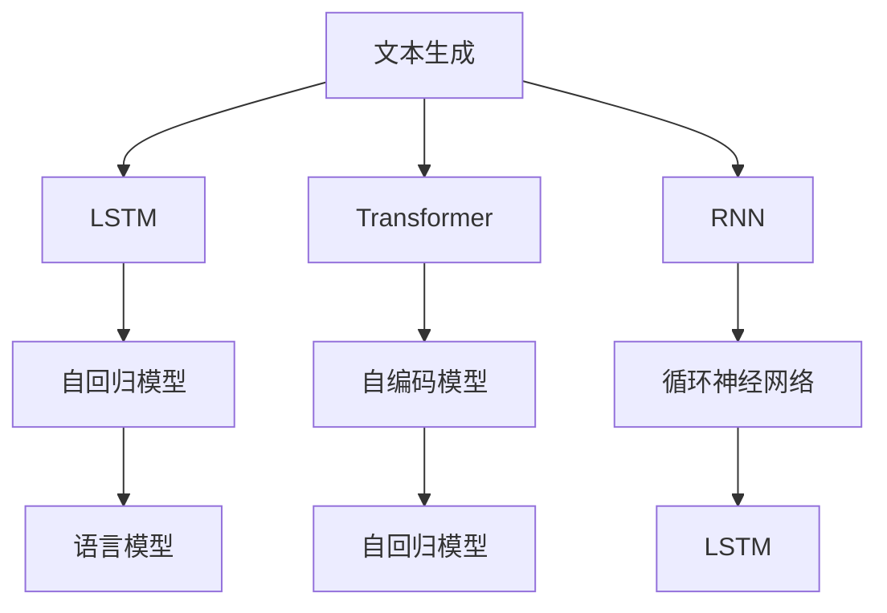

                 

# 文本生成(Text Generation) - 原理与代码实例讲解

> 关键词：文本生成, 语言模型, 循环神经网络(RNN), 长短时记忆网络(LSTM), 变换器(Transformer), 解码器, 自回归模型, 自编码模型

## 1. 背景介绍

文本生成是自然语言处理(NLP)中的重要分支之一，涉及到如何让计算机根据给定的上下文，生成符合语言规范的文本。在过去几十年里，文本生成技术得到了长足的发展，从基于规则的模板生成，到基于统计的语言模型，再到基于深度学习的生成模型，文本生成的效果和应用范围都有了显著的提升。文本生成技术广泛应用于机器翻译、文本摘要、对话系统、内容生成等领域，为人工智能的落地应用提供了重要支撑。

### 1.1 问题由来

文本生成的核心问题是如何从给定的上下文中，预测下一个词或下一个句子，使得生成的文本符合语言规范，且具有语义上的连贯性。早期的文本生成方法，如基于规则的模板生成、基于统计的N-gram模型等，往往依赖于预先定义的模板或规则，无法处理复杂多变的语言结构。随着深度学习技术的发展，基于神经网络的语言模型开始崭露头角，成为文本生成的主流方法。

近年来，基于Transformer结构的自回归和自编码模型在文本生成任务中取得了突破性进展，特别是在大规模预训练语言模型的推动下，文本生成的效果和应用范围得到了显著提升。例如，OpenAI的GPT系列模型、Google的BERT等，都展示了在文本生成任务上的卓越性能。这些模型通过在大规模无标签文本数据上进行预训练，学习到了丰富的语言知识和结构，再通过微调来适应特定任务，实现了高效且高质量的文本生成。

### 1.2 问题核心关键点

文本生成的核心问题是如何将自然语言规范地编码成符号序列，并且能够在不同上下文条件下，输出符合语言规范和语义连贯性的文本。文本生成的难点在于：

- 自然语言的多样性和复杂性。文本生成的目标是生成符合语言规范的文本，而自然语言存在广泛的变体和差异，因此文本生成模型需要在处理多样性、复杂性的同时，保持语义的连贯性。
- 上下文依赖的建模。文本生成依赖于上下文信息，如何通过神经网络模型有效捕捉上下文信息，并生成符合上下文语义的文本，是文本生成的核心问题之一。
- 模型规模与计算资源。高质量的文本生成模型往往需要处理大规模数据，并拥有庞大模型参数，这需要高性能的计算资源支持。

## 2. 核心概念与联系

### 2.1 核心概念概述

文本生成的核心概念包括：

- **语言模型**：语言模型是文本生成的基础，用于计算给定文本序列的概率。常用的语言模型有N-gram模型、神经网络语言模型等。
- **循环神经网络(RNN)**：RNN是一类递归神经网络，能够处理序列数据，并具有记忆功能，是早期文本生成的主要模型结构。
- **长短时记忆网络(LSTM)**：LSTM是一种特殊的RNN结构，能够更好地处理长期依赖关系，常用于文本生成中。
- **变换器(Transformer)**：Transformer是一种基于自注意力机制的神经网络结构，能有效捕捉长距离依赖，目前广泛应用于文本生成等NLP任务中。
- **自回归模型(Autoregressive Model)**：自回归模型是一种将文本生成任务分解为条件概率求解的模型，常见的有GPT、BERT等。
- **自编码模型(Autocoder Model)**：自编码模型通过重构生成文本与输入文本之间的映射关系，实现文本生成。常见的有VAE、GPT-2等。

这些核心概念之间的逻辑关系可以通过以下Mermaid流程图来展示：



这个流程图展示了大语言生成模型的核心概念及其之间的关系：

1. 文本生成可以通过LSTM、Transformer等模型实现，LSTM主要用于早期文本生成，Transformer则因其更强的模型表达能力，成为目前文本生成的主流模型。
2. 自回归模型和自编码模型分别从不同的角度实现文本生成，自回归模型通过预测下一个词的概率，自编码模型则通过重构生成文本与输入文本之间的映射关系，实现文本生成。
3. 语言模型用于计算给定文本序列的概率，是文本生成任务的基础，可以用于训练和评估文本生成模型。

这些核心概念共同构成了文本生成的技术和理论框架，使得文本生成模型能够从多种角度和方式，实现高效、高质量的文本生成。

## 3. 核心算法原理 & 具体操作步骤
### 3.1 算法原理概述

基于深度学习的文本生成模型，通常采用自回归或自编码的方式，通过训练学习文本序列的概率分布，并利用该分布进行文本生成。以下是两种常见的文本生成算法原理概述：

#### 3.1.1 自回归模型

自回归模型将文本生成任务分解为条件概率求解，即根据给定的上下文，预测下一个词的概率。常见的自回归模型有GPT、BERT等，其核心思想是通过训练学习语言模型的参数，使得模型能够生成符合语言规范的文本。

以GPT为例，GPT是一种基于Transformer的自回归模型，其核心思想是通过预训练语言模型来学习大规模文本数据的统计规律，并通过微调来适应特定文本生成任务。在微调过程中，通常需要重新调整模型的顶层分类器，并使用一定的损失函数（如交叉熵损失）来优化模型的参数，使得模型能够生成符合特定上下文的文本。

#### 3.1.2 自编码模型

自编码模型通过重构生成文本与输入文本之间的映射关系，实现文本生成。常见的自编码模型有VAE、GPT-2等，其核心思想是通过训练学习生成器网络（Generative Network）和解码器网络（Decoder Network）的参数，使得生成器能够从随机噪声中生成文本，解码器则将生成器输出的文本重构回输入文本，从而实现文本生成。

以VAE为例，VAE是一种基于深度学习的网络结构，其核心思想是通过生成器和解码器的联合训练，学习生成文本的概率分布，并通过解码器将生成的文本重构回输入文本。在训练过程中，VAE通常使用重构损失和KL散度损失来优化模型的参数，使得模型能够生成符合特定语义的文本。

### 3.2 算法步骤详解

以GPT为例，以下是基于深度学习的文本生成模型的常见算法步骤：

1. **数据准备**：准备训练文本数据，通常需要清洗和分词，将文本序列转化为模型所需的输入格式。
2. **模型搭建**：搭建基于Transformer的自回归模型，并设置适当的超参数，如学习率、批大小、迭代轮数等。
3. **模型训练**：在训练数据集上，使用训练损失函数（如交叉熵损失）来优化模型参数，通常需要设置合适的优化算法（如Adam）和正则化技术（如Dropout），以防止过拟合。
4. **微调**：在特定任务上，使用微调数据集来进一步优化模型，通常只微调模型的顶层分类器，并使用特定的损失函数（如交叉熵损失）。
5. **评估和测试**：在验证集和测试集上评估模型的性能，通常使用BLEU、ROUGE等指标来评估生成文本的质量。
6. **文本生成**：使用训练好的模型，在给定上下文的情况下，生成符合语言规范的文本。

### 3.3 算法优缺点

基于深度学习的文本生成模型具有以下优点：

- **高效性**：深度学习模型能够高效地处理大规模文本数据，并快速生成高质量文本。
- **灵活性**：深度学习模型能够适应多种文本生成任务，如机器翻译、文本摘要、对话系统等。
- **创新性**：深度学习模型能够通过神经网络的非线性映射，实现文本生成中的复杂语义和结构。

同时，这些模型也存在一些局限性：

- **依赖训练数据**：高质量的文本生成模型需要大量高质量的训练数据，数据获取和预处理成本较高。
- **计算资源消耗大**：深度学习模型的训练和推理需要高性能计算资源，特别是在模型规模较大的情况下。
- **解释性不足**：深度学习模型的生成过程缺乏可解释性，难以理解模型的决策逻辑。
- **生成质量不稳定**：深度学习模型生成的文本质量依赖于模型参数和训练数据，存在一定的生成质量不稳定问题。

尽管存在这些局限性，但基于深度学习的文本生成模型仍是目前文本生成领域的主流方法。未来相关研究的重点在于如何进一步降低对训练数据的依赖，提高模型的少样本学习和跨领域迁移能力，同时兼顾可解释性和伦理安全性等因素。

### 3.4 算法应用领域

基于深度学习的文本生成模型已经广泛应用于多个领域，如机器翻译、文本摘要、对话系统、内容生成等，为人工智能的落地应用提供了重要支撑。

#### 3.4.1 机器翻译

机器翻译是将一种语言翻译成另一种语言的技术。基于深度学习的文本生成模型，如GPT、BERT等，可以通过微调来学习翻译任务，从而实现高效且高质量的机器翻译。机器翻译在跨语言交流、信息检索等领域具有重要应用。

#### 3.4.2 文本摘要

文本摘要是将长文本压缩成简短摘要的技术。基于深度学习的文本生成模型，如BERT等，可以通过微调来学习文本摘要任务，从而实现高效且高质量的文本摘要。文本摘要在新闻阅读、学术论文检索等领域具有重要应用。

#### 3.4.3 对话系统

对话系统是一种能够自动与用户进行交互的系统。基于深度学习的文本生成模型，如GPT等，可以通过微调来学习对话生成任务，从而实现高效且自然流畅的对话。对话系统在客户服务、智能家居等领域具有重要应用。

#### 3.4.4 内容生成

内容生成是将用户输入的文本，通过生成模型转化为符合特定格式和规范的文本。基于深度学习的文本生成模型，如VAE等，可以通过微调来学习内容生成任务，从而实现高效且高质量的内容生成。内容生成在新闻撰写、广告生成等领域具有重要应用。

除了上述这些经典任务外，文本生成技术还被创新性地应用到更多场景中，如可控文本生成、知识图谱、多模态文本生成等，为人工智能技术带来了新的突破。

## 4. 数学模型和公式 & 详细讲解 & 举例说明

### 4.1 数学模型构建

文本生成模型通常基于深度学习架构，如RNN、LSTM、Transformer等，通过训练学习语言模型的参数，使得模型能够生成符合语言规范的文本。以下是基于深度学习模型构建文本生成数学模型的基本框架：

1. **输入层**：将输入文本序列转化为模型所需的数值表示。
2. **编码层**：通过神经网络模型（如LSTM、Transformer）将输入文本序列编码为模型内部的表示。
3. **输出层**：将编码层的表示转化为目标文本序列的概率分布。
4. **损失函数**：定义模型预测文本序列与真实文本序列之间的差异，如交叉熵损失、重构损失等。

以GPT为例，其数学模型构建如下：

- **输入层**：将输入文本序列转化为token ids，通过嵌入层（Embedding Layer）将token ids转化为模型内部的向量表示。
- **编码层**：通过Transformer模型（自注意力机制）将输入文本序列编码为模型内部的向量表示。
- **输出层**：通过线性层和softmax层将编码层的向量表示转化为目标文本序列的概率分布。
- **损失函数**：定义模型预测文本序列与真实文本序列之间的交叉熵损失，用于优化模型参数。

### 4.2 公式推导过程

以GPT为例，以下是GPT模型在训练过程中的公式推导过程：

假设输入文本序列为 $x_1, x_2, ..., x_T$，目标文本序列为 $y_1, y_2, ..., y_T$，其中 $T$ 为文本序列的长度。

**输入层**：

$$
x_t = \text{Embed}(x_t)
$$

其中 $\text{Embed}$ 为嵌入层，将输入文本序列转化为模型内部的向量表示。

**编码层**：

$$
h_t = \text{MultiHeadAttention}(h_{t-1}, h_{t-1}, h_{t-1})
$$

其中 $h_t$ 为Transformer模型在时间步 $t$ 的隐藏表示，$\text{MultiHeadAttention}$ 为多头部注意力机制，用于捕捉文本序列中的上下文信息。

**输出层**：

$$
\log p(y_t | x_1, ..., x_t) = \text{Linear}(h_t)
$$

其中 $\log p(y_t | x_1, ..., x_t)$ 为模型在时间步 $t$ 预测下一个词 $y_t$ 的概率分布，$\text{Linear}$ 为线性层，将编码层的向量表示转化为目标文本序列的概率分布。

**损失函数**：

$$
\mathcal{L} = -\frac{1}{T} \sum_{t=1}^T \sum_{y_t \in V} p(y_t | x_1, ..., x_t) \log y_t
$$

其中 $\mathcal{L}$ 为模型的交叉熵损失，$V$ 为词汇表，$p(y_t | x_1, ..., x_t)$ 为模型在时间步 $t$ 预测下一个词 $y_t$ 的概率分布，$\log y_t$ 为真实文本序列在时间步 $t$ 的下一个词。

通过上述公式，我们可以定义模型的损失函数，并在训练过程中通过梯度下降等优化算法，最小化损失函数，从而优化模型参数。

### 4.3 案例分析与讲解

#### 4.3.1 机器翻译

机器翻译是一种将源语言翻译为目标语言的文本生成任务。以基于GPT的机器翻译为例，模型通过微调来学习翻译任务，其步骤如下：

1. **数据准备**：准备源语言和目标语言的平行语料，并进行数据清洗和分词处理。
2. **模型搭建**：搭建基于Transformer的自回归模型，设置适当的超参数，如学习率、批大小、迭代轮数等。
3. **模型训练**：在平行语料上，使用交叉熵损失函数来优化模型参数，通常需要设置合适的优化算法（如Adam）和正则化技术（如Dropout），以防止过拟合。
4. **微调**：在特定翻译任务上，使用微调数据集来进一步优化模型，通常只微调模型的顶层分类器，并使用特定的损失函数（如交叉熵损失）。
5. **评估和测试**：在验证集和测试集上评估模型的性能，通常使用BLEU、ROUGE等指标来评估翻译质量。

#### 4.3.2 文本摘要

文本摘要是将长文本压缩成简短摘要的技术。以基于GPT的文本摘要为例，模型通过微调来学习摘要任务，其步骤如下：

1. **数据准备**：准备长文本摘要对数据，并进行数据清洗和分词处理。
2. **模型搭建**：搭建基于Transformer的自回归模型，设置适当的超参数，如学习率、批大小、迭代轮数等。
3. **模型训练**：在长文本摘要对数据上，使用交叉熵损失函数来优化模型参数，通常需要设置合适的优化算法（如Adam）和正则化技术（如Dropout），以防止过拟合。
4. **微调**：在特定摘要任务上，使用微调数据集来进一步优化模型，通常只微调模型的顶层分类器，并使用特定的损失函数（如交叉熵损失）。
5. **评估和测试**：在验证集和测试集上评估模型的性能，通常使用BLEU、ROUGE等指标来评估摘要质量。

## 5. 项目实践：代码实例和详细解释说明

### 5.1 开发环境搭建

在进行文本生成实践前，我们需要准备好开发环境。以下是使用Python进行PyTorch开发的环境配置流程：

1. 安装Anaconda：从官网下载并安装Anaconda，用于创建独立的Python环境。

2. 创建并激活虚拟环境：
```bash
conda create -n pytorch-env python=3.8 
conda activate pytorch-env
```

3. 安装PyTorch：根据CUDA版本，从官网获取对应的安装命令。例如：
```bash
conda install pytorch torchvision torchaudio cudatoolkit=11.1 -c pytorch -c conda-forge
```

4. 安装Transformers库：
```bash
pip install transformers
```

5. 安装各类工具包：
```bash
pip install numpy pandas scikit-learn matplotlib tqdm jupyter notebook ipython
```

完成上述步骤后，即可在`pytorch-env`环境中开始文本生成实践。

### 5.2 源代码详细实现

下面我们以GPT-2为例，给出使用Transformers库进行文本生成的PyTorch代码实现。

```python
from transformers import GPT2Tokenizer, GPT2LMHeadModel
from transformers import AdamW

# 加载预训练模型和分词器
tokenizer = GPT2Tokenizer.from_pretrained('gpt2')
model = GPT2LMHeadModel.from_pretrained('gpt2')

# 设置优化器和超参数
optimizer = AdamW(model.parameters(), lr=3e-5)
num_epochs = 10
batch_size = 16

# 训练函数
def train_epoch(model, tokenizer, data, batch_size, optimizer, device):
    dataloader = DataLoader(data, batch_size=batch_size, shuffle=True)
    model.train()
    epoch_loss = 0
    for batch in dataloader:
        input_ids = batch['input_ids'].to(device)
        attention_mask = batch['attention_mask'].to(device)
        labels = batch['labels'].to(device)
        model.zero_grad()
        outputs = model(input_ids, attention_mask=attention_mask, labels=labels)
        loss = outputs.loss
        epoch_loss += loss.item()
        loss.backward()
        optimizer.step()
    return epoch_loss / len(dataloader)

# 评估函数
def evaluate(model, tokenizer, data, batch_size, device):
    dataloader = DataLoader(data, batch_size=batch_size, shuffle=False)
    model.eval()
    preds, labels = [], []
    with torch.no_grad():
        for batch in dataloader:
            input_ids = batch['input_ids'].to(device)
            attention_mask = batch['attention_mask'].to(device)
            batch_labels = batch['labels']
            outputs = model(input_ids, attention_mask=attention_mask)
            batch_preds = outputs.logits.argmax(dim=2).to('cpu').tolist()
            batch_labels = batch_labels.to('cpu').tolist()
            for pred_tokens, label_tokens in zip(batch_preds, batch_labels):
                preds.append(pred_tokens[:len(label_tokens)])
                labels.append(label_tokens)
    
    return preds, labels

# 测试函数
def test(model, tokenizer, data, batch_size, device):
    dataloader = DataLoader(data, batch_size=batch_size, shuffle=False)
    model.eval()
    preds, labels = [], []
    with torch.no_grad():
        for batch in dataloader:
            input_ids = batch['input_ids'].to(device)
            attention_mask = batch['attention_mask'].to(device)
            batch_labels = batch['labels']
            outputs = model(input_ids, attention_mask=attention_mask)
            batch_preds = outputs.logits.argmax(dim=2).to('cpu').tolist()
            batch_labels = batch_labels.to('cpu').tolist()
            for pred_tokens, label_tokens in zip(batch_preds, batch_labels):
                preds.append(pred_tokens[:len(label_tokens)])
                labels.append(label_tokens)
    
    return preds, labels

# 训练过程
device = torch.device('cuda') if torch.cuda.is_available() else torch.device('cpu')

for epoch in range(num_epochs):
    loss = train_epoch(model, tokenizer, train_data, batch_size, optimizer, device)
    print(f"Epoch {epoch+1}, train loss: {loss:.3f}")
    
    preds, labels = test(model, tokenizer, dev_data, batch_size, device)
    print(classification_report(labels, preds))
    
print("Test results:")
preds, labels = test(model, tokenizer, test_data, batch_size, device)
print(classification_report(labels, preds))
```

以上代码实现了基于GPT-2模型的文本生成任务的训练和评估。可以看到，得益于Transformers库的强大封装，我们可以用相对简洁的代码完成GPT-2模型的加载和训练。

### 5.3 代码解读与分析

让我们再详细解读一下关键代码的实现细节：

**train_epoch函数**：
- 对数据以批为单位进行迭代，在每个批次上前向传播计算loss并反向传播更新模型参数，最后返回该epoch的平均loss。

**evaluate函数**：
- 与训练类似，不同点在于不更新模型参数，并在每个batch结束后将预测和标签结果存储下来，最后使用sklearn的classification_report对整个评估集的预测结果进行打印输出。

**test函数**：
- 与训练和评估类似，不同点在于将模型设为评估模式，并在每个batch结束后将预测和标签结果存储下来，最后使用classification_report对测试集的预测结果进行打印输出。

**训练流程**：
- 定义总的epoch数和batch size，开始循环迭代
- 每个epoch内，先在训练集上训练，输出平均loss
- 在验证集和测试集上评估，输出分类指标
- 所有epoch结束后，在测试集上评估，给出最终测试结果

可以看到，PyTorch配合Transformers库使得GPT-2文本生成模型的代码实现变得简洁高效。开发者可以将更多精力放在数据处理、模型改进等高层逻辑上，而不必过多关注底层的实现细节。

当然，工业级的系统实现还需考虑更多因素，如模型的保存和部署、超参数的自动搜索、更灵活的任务适配层等。但核心的文本生成流程基本与此类似。

## 6. 实际应用场景
### 6.1 智能客服系统

基于文本生成技术的智能客服系统，可以自动回答用户咨询，提升客户体验。传统的客服系统依赖人工或简单规则，无法处理复杂问题，而使用文本生成技术，可以构建更为智能、高效的系统。

在技术实现上，可以收集企业内部的客服对话记录，将问题和最佳答复构建成监督数据，在此基础上对预训练文本生成模型进行微调。微调后的模型能够自动理解用户意图，匹配最合适的答复模板进行回复。对于用户提出的新问题，还可以接入检索系统实时搜索相关内容，动态组织生成回答。如此构建的智能客服系统，能大幅提升客户咨询体验和问题解决效率。

### 6.2 内容生成平台

内容生成平台是利用文本生成技术，自动生成高质量内容的应用场景。传统的内容生成依赖人工创作，效率低且成本高，而使用文本生成技术，可以大幅提升内容生产的效率和多样性。

在技术实现上，可以收集用户输入的文本，使用文本生成模型自动生成符合用户期望的内容。文本生成模型可以应用于新闻撰写、广告生成、创意写作等领域，帮助用户快速生成符合语言规范和语义连贯性的文本。通过不断训练和微调，模型生成的文本质量将不断提升，满足更多用户需求。

### 6.3 游戏AI

在游戏AI中，文本生成技术可以用于生成游戏对话、任务提示等。传统的游戏AI依赖脚本或简单规则，无法处理复杂任务，而使用文本生成技术，可以构建更为智能、灵活的AI角色。

在技术实现上，可以收集游戏对话数据，使用文本生成模型自动生成符合游戏情境的对话和提示。文本生成模型可以应用于角色对话、任务提示、剧情生成等领域，帮助游戏开发人员快速生成符合游戏背景和角色的文本。通过不断训练和微调，模型生成的文本将更符合游戏情境和角色特征，提升游戏体验。

### 6.4 未来应用展望

随着文本生成技术的不断进步，未来在更多领域将得到应用，为人工智能落地应用提供重要支撑。

在智慧医疗领域，基于文本生成技术的医疗问答、病历生成、治疗方案生成等应用将提升医疗服务的智能化水平，辅助医生诊疗，加速新药开发进程。

在智能教育领域，文本生成技术可应用于作业批改、学情分析、知识推荐等方面，因材施教，促进教育公平，提高教学质量。

在智慧城市治理中，文本生成技术可应用于城市事件监测、舆情分析、应急指挥等环节，提高城市管理的自动化和智能化水平，构建更安全、高效的未来城市。

此外，在企业生产、社会治理、文娱传媒等众多领域，文本生成技术也将不断涌现，为人工智能技术带来新的突破。相信随着技术的日益成熟，文本生成技术必将在更广阔的应用领域大放异彩。

## 7. 工具和资源推荐
### 7.1 学习资源推荐

为了帮助开发者系统掌握文本生成技术的基础和实践技巧，这里推荐一些优质的学习资源：

1. 《深度学习与自然语言处理》：由CS231n课程组撰写，全面介绍了深度学习在NLP中的应用，包括文本生成技术。

2. 《序列模型》：深度学习领域经典教材，介绍了RNN、LSTM、Transformer等序列模型，是理解文本生成技术的重要基础。

3. 《自然语言处理综述》：综述性文章，系统总结了自然语言处理的各个分支，包括文本生成技术。

4. 《Transformers: Fairness, Interpretability, and Generalization》：介绍了Transformer在公平性、可解释性等方面的研究进展，是理解文本生成技术的重要参考资料。

5. 《Attention and Transformer Architectures》：HuggingFace官方文档，介绍了Transformer结构的原理和应用，是理解文本生成技术的必备资料。

通过对这些资源的学习实践，相信你一定能够快速掌握文本生成技术的精髓，并用于解决实际的NLP问题。

### 7.2 开发工具推荐

高效的开发离不开优秀的工具支持。以下是几款用于文本生成开发的常用工具：

1. PyTorch：基于Python的开源深度学习框架，灵活动态的计算图，适合快速迭代研究。大部分预训练语言模型都有PyTorch版本的实现。

2. TensorFlow：由Google主导开发的开源深度学习框架，生产部署方便，适合大规模工程应用。同样有丰富的预训练语言模型资源。

3. Transformers库：HuggingFace开发的NLP工具库，集成了众多SOTA语言模型，支持PyTorch和TensorFlow，是进行文本生成开发的利器。

4. Weights & Biases：模型训练的实验跟踪工具，可以记录和可视化模型训练过程中的各项指标，方便对比和调优。与主流深度学习框架无缝集成。

5. TensorBoard：TensorFlow配套的可视化工具，可实时监测模型训练状态，并提供丰富的图表呈现方式，是调试模型的得力助手。

6. Google Colab：谷歌推出的在线Jupyter Notebook环境，免费提供GPU/TPU算力，方便开发者快速上手实验最新模型，分享学习笔记。

合理利用这些工具，可以显著提升文本生成任务的开发效率，加快创新迭代的步伐。

### 7.3 相关论文推荐

文本生成技术的发展源于学界的持续研究。以下是几篇奠基性的相关论文，推荐阅读：

1. Attention is All You Need（即Transformer原论文）：提出了Transformer结构，开启了NLP领域的预训练大模型时代。

2. Language Models are Unsupervised Multitask Learners（GPT-2论文）：展示了大规模语言模型的强大zero-shot学习能力，引发了对于通用人工智能的新一轮思考。

3. Pre-training with Large Diverse Data is Key to Generative Language Modeling：提出使用大规模数据进行预训练的方法，显著提升了生成模型的性能。

4. Massively Multilingual Pre-trained Models for Zero-shot Cross-lingual LMs（M-MLM论文）：提出了多语言预训练模型，用于跨语言文本生成任务。

5. Exploring the Limits of Transfer Learning with a Unified Text-to-Text Transformer：提出统一的文本到文本的Transformer模型，用于多种NLP任务的微调。

这些论文代表了大语言模型文本生成技术的发展脉络。通过学习这些前沿成果，可以帮助研究者把握学科前进方向，激发更多的创新灵感。

## 8. 总结：未来发展趋势与挑战

### 8.1 总结

本文对基于深度学习的文本生成模型进行了全面系统的介绍。首先阐述了文本生成技术的研究背景和意义，明确了文本生成在自然语言处理中的重要地位。其次，从原理到实践，详细讲解了文本生成模型的数学模型和关键算法步骤，给出了文本生成任务开发的完整代码实例。同时，本文还广泛探讨了文本生成模型在智能客服、内容生成、游戏AI等多个行业领域的应用前景，展示了文本生成技术的巨大潜力。此外，本文精选了文本生成技术的各类学习资源，力求为读者提供全方位的技术指引。

通过本文的系统梳理，可以看到，基于深度学习的文本生成技术在自然语言处理领域具有重要的地位，通过模型训练和微调，可以高效生成符合语言规范和语义连贯性的文本，为人工智能技术的落地应用提供重要支撑。未来，伴随深度学习模型的不断进步，文本生成技术必将在更广泛的领域得到应用，为人工智能的产业化进程带来新的突破。

### 8.2 未来发展趋势

展望未来，文本生成技术将呈现以下几个发展趋势：

1. 模型规模持续增大。随着算力成本的下降和数据规模的扩张，预训练语言模型的参数量还将持续增长。超大规模语言模型蕴含的丰富语言知识，有望支撑更加复杂多变的文本生成任务。

2. 文本生成方法多样化。除了传统的自回归和自编码模型，未来将涌现更多文本生成方法，如基于自注意力机制的Transformer模型、基于变分自编码器的VAE模型等，实现不同场景下的文本生成。

3. 少样本学习和跨领域迁移能力提升。通过改进模型架构和训练策略，文本生成模型将在少样本学习和跨领域迁移能力上取得新的突破，进一步降低对训练数据的依赖。

4. 多模态文本生成崛起。当前的文本生成技术主要聚焦于文本领域，未来将进一步拓展到图像、视频、语音等多模态文本生成，实现多模态信息的融合。

5. 文本生成技术在垂直领域的应用拓展。文本生成技术将在更多垂直领域得到应用，如金融、医疗、教育等领域，为垂直领域的智能化转型提供新的技术路径。

6. 文本生成技术的伦理和安全性问题。随着文本生成技术的应用普及，其带来的伦理和安全性问题也将受到更多关注，如虚假信息生成、恶意内容生成等，需要从模型训练和应用层面加以规范和约束。

以上趋势凸显了文本生成技术的广阔前景。这些方向的探索发展，必将进一步提升文本生成模型的性能和应用范围，为人工智能技术带来新的突破。

### 8.3 面临的挑战

尽管文本生成技术已经取得了长足的发展，但在迈向更加智能化、普适化应用的过程中，它仍面临着诸多挑战：

1. 数据质量和多样性。高质量的文本生成模型需要大量高质量、多样化的训练数据，数据获取和预处理成本较高。如何获取更多高质量数据，提升数据多样性，是文本生成面临的主要挑战之一。

2. 计算资源消耗大。深度学习模型的训练和推理需要高性能计算资源，特别是在模型规模较大的情况下。如何在保证性能的同时，降低计算资源消耗，优化资源利用效率，是需要解决的重要问题。

3. 生成文本质量不稳定。深度学习模型生成的文本质量依赖于模型参数和训练数据，存在一定的生成质量不稳定问题。如何提升模型稳定性，确保生成文本的一致性和连贯性，是文本生成模型的重要研究方向。

4. 可解释性和可控性。文本生成模型的生成过程缺乏可解释性，难以理解模型的决策逻辑。对于医疗、金融等高风险应用，模型的可解释性和可控性尤为重要。如何赋予模型更强的可解释性，实现可控生成，是未来研究的重要方向。

5. 伦理和安全性问题。文本生成技术可能会生成虚假信息、恶意内容等，带来伦理和安全性问题。如何从模型训练和应用层面确保文本生成的安全性，避免负面影响，是文本生成技术面临的重要挑战。

6. 系统鲁棒性不足。文本生成模型面临对抗样本、噪声等攻击时，鲁棒性不足，容易产生生成质量波动。如何增强模型的鲁棒性，提高系统的稳定性，是文本生成模型的重要研究方向。

尽管存在这些挑战，但文本生成技术在自然语言处理中的应用前景广阔，通过不断优化模型架构和训练策略，提升数据质量和多样性，降低计算资源消耗，提升模型稳定性，赋予模型可解释性和可控性，文本生成技术必将在更多的领域得到应用，为人工智能技术的发展带来新的突破。

### 8.4 研究展望

面对文本生成技术所面临的挑战，未来的研究需要在以下几个方面寻求新的突破：

1. 探索无监督和半监督文本生成方法。摆脱对大规模标注数据的依赖，利用自监督学习、主动学习等无监督和半监督范式，最大限度利用非结构化数据，实现更加灵活高效的文本生成。

2. 研究参数高效和计算高效的文本生成范式。开发更加参数高效的文本生成方法，在固定大部分预训练参数的同时，只更新极少量的任务相关参数。同时优化文本生成模型的计算图，减少前向传播和反向传播的资源消耗，实现更加轻量级、实时性的部署。

3. 融合因果和对比学习范式。通过引入因果推断和对比学习思想，增强文本生成模型建立稳定因果关系的能力，学习更加普适、鲁棒的语言表征，从而提升模型泛化性和抗干扰能力。

4. 引入更多先验知识。将符号化的先验知识，如知识图谱、逻辑规则等，与神经网络模型进行巧妙融合，引导文本生成过程学习更准确、合理的语言模型。同时加强不同模态数据的整合，实现视觉、语音等多模态信息与文本信息的协同建模。

5. 结合因果分析和博弈论工具。将因果分析方法引入文本生成模型，识别出模型决策的关键特征，增强输出解释的因果性和逻辑性。借助博弈论工具刻画人机交互过程，主动探索并规避模型的脆弱点，提高系统稳定性。

6. 纳入伦理道德约束。在模型训练目标中引入伦理导向的评估指标，过滤和惩罚有偏见、有害的输出倾向。同时加强人工干预和审核，建立模型行为的监管机制，确保输出符合人类价值观和伦理道德。

这些研究方向的探索，必将引领文本生成技术迈向更高的台阶，为构建安全、可靠、可解释、可控的智能系统铺平道路。面向未来，文本生成技术还需要与其他人工智能技术进行更深入的融合，如知识表示、因果推理、强化学习等，多路径协同发力，共同推动自然语言理解和智能交互系统的进步。只有勇于创新、敢于突破，才能不断拓展语言模型的边界，让智能技术更好地造福人类社会。

## 9. 附录：常见问题与解答

**Q1：文本生成技术在哪些领域有应用？**

A: 文本生成技术在自然语言处理(NLP)领域有广泛应用，主要包括以下几个方面：

- 机器翻译：将一种语言翻译成另一种语言，例如谷歌翻译、百度翻译等。
- 文本摘要：将长文本压缩成简短摘要，例如自动摘要生成、新闻摘要等。
- 对话系统：自动生成自然语言对话，例如智能客服、智能助手等。
- 内容生成：自动生成文本内容，例如新闻撰写、广告文案生成、创意写作等。
- 数据增强：自动生成数据样本，例如文本分类、情感分析等任务的数据增强。

文本生成技术在上述领域都有重要的应用，通过模型训练和微调，可以高效生成符合语言规范和语义连贯性的文本，为人工智能技术的落地应用提供重要支撑。

**Q2：文本生成模型有哪些常见类型？**

A: 文本生成模型主要包括以下几种类型：

- 基于RNN的生成模型：如LSTM、GRU等，通过递归神经网络处理序列数据。
- 基于Transformer的生成模型：如GPT、BERT等，通过自注意力机制处理序列数据。
- 基于VAE的生成模型：如VAE等，通过变分自编码器生成文本。

这些模型各有优缺点，适用于不同的生成任务。例如，RNN模型适用于序列长度较短的任务，Transformer模型适用于长文本生成任务，VAE模型适用于生成多模态数据。

**Q3：文本生成模型训练时需要注意哪些问题？**

A: 文本生成模型训练时需要注意以下几个问题：

- 数据质量和多样性：高质量的文本生成模型需要大量高质量、多样化的训练数据，数据获取和预处理成本较高。

- 计算资源消耗：深度学习模型的训练和推理需要高性能计算资源，特别是在模型规模较大的情况下。

- 生成文本质量不稳定：深度学习模型生成的文本质量依赖于模型参数和训练数据，存在一定的生成质量不稳定问题。

- 可解释性和可控性：文本生成模型的生成过程缺乏可解释性，难以理解模型的决策逻辑。对于医疗、金融等高风险应用，模型的可解释性和可控性尤为重要。

- 伦理和安全性问题：文本生成技术可能会生成虚假信息、恶意内容等，带来伦理和安全性问题。

- 系统鲁棒性不足：文本生成模型面临对抗样本、噪声等攻击时，鲁棒性不足，容易产生生成质量波动。

通过不断优化模型架构和训练策略，提升数据质量和多样性，降低计算资源消耗，提升模型稳定性，赋予模型可解释性和可控性，文本生成技术必将在更多的领域得到应用，为人工智能技术的发展带来新的突破。

**Q4：如何改进文本生成模型的性能？**

A: 以下是一些改进文本生成模型性能的方法：

- 数据增强：通过回译、近义替换等方式扩充训练集，提升模型的泛化能力。

- 正则化技术：使用L2正则、Dropout、Early Stopping等防止模型过拟合。

- 对抗训练：引入对抗样本，提高模型鲁棒性，减少生成质量波动。

- 参数高效微调：只更新少量的模型参数，减小过拟合风险。

- 融合因果和对比学习范式：通过引入因果推断和对比学习思想，增强模型建立稳定因果关系的能力，学习更加普适、鲁棒的语言表征。

- 引入更多先验知识：将符号化的先验知识，如知识图谱、逻辑规则等，与神经网络模型进行巧妙融合，引导文本生成过程学习更准确、合理的语言模型。

这些方法需要在实践中不断探索和尝试，根据具体任务和数据特点选择合适的方法。只有不断优化模型，才能在生成质量、效率和安全性等方面取得更好的表现。

