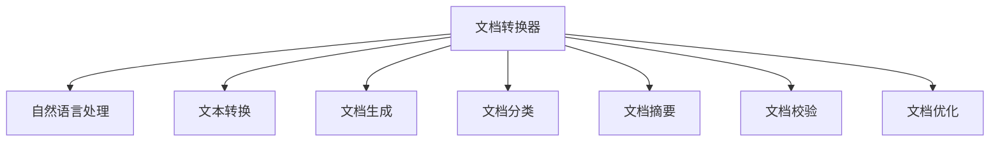

                 

# 文档转换器（Document Transformers）

> 关键词：文档处理,自然语言处理(NLP),文本转换,文档生成,文档分类,文档摘要,文档校验,文档优化

## 1. 背景介绍

### 1.1 问题由来
在数字化时代，文档处理需求急剧增加。传统文档处理依赖人工劳动，耗时耗力，且容易出错。因此，通过自动化技术对文档进行高效、准确处理，已成为当务之急。自然语言处理(Natural Language Processing, NLP)技术在文档处理领域表现出巨大潜力，尤其是在文档转换、生成、分类、摘要、校验、优化等任务中，文档转换器（Document Transformers）的应用日益普及。

文档中通常包含大量文本信息，需要对这些信息进行结构化处理、分析、提取、转换，从而便于进一步存储、检索、利用。文档转换器的目标就是通过对文档进行文本分析、转换、生成等操作，实现文档处理自动化，提高效率和准确性。

### 1.2 问题核心关键点
文档转换器通过自动化的文本处理技术，将文档信息转化为结构化数据，实现文档的自动化转换、生成、分类、摘要、校验、优化等处理。其核心关键点包括：

- 文档转换：将原始文档转换成结构化数据，方便进一步处理。
- 文档生成：根据输入的文本生成新的文档。
- 文档分类：将文档按内容、类型等进行分类，便于组织管理。
- 文档摘要：提取文档的关键信息，生成精简摘要。
- 文档校验：对文档进行准确性、完整性等校验。
- 文档优化：通过各种算法优化文档质量，如语法优化、格式调整等。

这些技术通过机器学习、深度学习等前沿技术，在大规模文档处理中展现出卓越性能，大大提升了文档处理的效率和质量。

### 1.3 问题研究意义
文档转换器作为文档处理自动化的核心工具，其研究与应用对于提升文档处理的效率和质量，推动文档管理的智能化、标准化，具有重要意义：

1. 提高处理效率：文档转换器可以快速、准确地处理大量文档，极大提高文档处理效率，减少人工工作量。
2. 确保准确性：通过自动化处理，文档转换器能够降低人为错误，确保文档处理的准确性和一致性。
3. 支持文档自动化管理：文档转换器能够对文档进行分类、索引、存储，支持文档的自动化管理。
4. 提升文档质量：文档转换器能够进行语法优化、格式调整等操作，提升文档的质量和可读性。
5. 推动产业升级：文档转换器能够支持各行各业的文档处理需求，推动文档管理系统的升级和转型。

本文将详细阐述文档转换器的工作原理、实现技术、应用场景，并探讨其未来发展方向。

## 2. 核心概念与联系

### 2.1 核心概念概述

为更好地理解文档转换器的工作原理和实现方法，本节将介绍几个密切相关的核心概念：

- 文档转换器(Document Transformers)：通过自动化技术，将文档转换为结构化数据，或对文档进行生成、分类、摘要、校验、优化等操作的系统。
- 自然语言处理(NLP)：涉及自然语言理解与生成，通过机器学习技术处理文档中的文本信息。
- 文本转换：将文本信息转换为结构化数据，方便进一步处理。
- 文档生成：根据文本信息生成新的文档。
- 文档分类：根据文本内容对文档进行分类。
- 文档摘要：提取文本关键信息，生成精简摘要。
- 文档校验：检查文档准确性、完整性等。
- 文档优化：通过算法提升文档质量。

这些概念之间的逻辑关系可以通过以下Mermaid流程图来展示：



这个流程图展示文档转换器与自然语言处理之间的联系，以及其在文本转换、文档生成、分类、摘要、校验、优化等任务中的应用。

## 3. 核心算法原理 & 具体操作步骤
### 3.1 算法原理概述

文档转换器的工作原理基于自然语言处理（NLP）技术，主要包括以下几个关键步骤：

1. 文本预处理：对文档进行分词、清洗、去噪等预处理操作，提取关键文本信息。
2. 文本分析：利用NLP技术，对文本进行语法、语义分析，识别文档结构。
3. 文本转换：将文本信息转换为结构化数据，如表格、XML、JSON等，便于进一步处理。
4. 文档生成：根据结构化数据生成新的文档，如PDF、Word、HTML等。
5. 文档分类：对文档进行内容、类型等分类，便于组织管理。
6. 文档摘要：提取文档关键信息，生成精简摘要。
7. 文档校验：检查文档准确性、完整性、格式等。
8. 文档优化：通过各种算法提升文档质量，如语法优化、格式调整等。

这些步骤通常使用深度学习、机器学习等技术来实现，确保文档转换器的智能化和高效性。

### 3.2 算法步骤详解

文档转换器的具体实现步骤如下：

1. 构建预训练模型：使用深度学习框架如TensorFlow、PyTorch等，构建预训练模型，用于处理文本数据。
2. 数据预处理：对文档进行分词、清洗、去噪等预处理操作，提取关键文本信息。
3. 文本分析：利用NLP技术，对文本进行语法、语义分析，识别文档结构。
4. 文本转换：将文本信息转换为结构化数据，如表格、XML、JSON等，便于进一步处理。
5. 文档生成：根据结构化数据生成新的文档，如PDF、Word、HTML等。
6. 文档分类：对文档进行内容、类型等分类，便于组织管理。
7. 文档摘要：提取文档关键信息，生成精简摘要。
8. 文档校验：检查文档准确性、完整性、格式等。
9. 文档优化：通过各种算法提升文档质量，如语法优化、格式调整等。

这些步骤通常使用深度学习、机器学习等技术来实现，确保文档转换器的智能化和高效性。

### 3.3 算法优缺点

文档转换器在文档处理中的应用具有以下优点：

1. 高效处理：文档转换器能够快速、准确地处理大量文档，极大提高文档处理效率。
2. 降低人工成本：文档转换器能够自动化处理文档，减少人工工作量，降低人工成本。
3. 提升文档质量：文档转换器能够进行语法优化、格式调整等操作，提升文档的质量和可读性。
4. 支持多种格式：文档转换器能够将文档转换为多种格式，便于进一步处理和利用。
5. 易于扩展：文档转换器基于模块化设计，可以灵活扩展功能，支持更多的文档处理需求。

同时，文档转换器也存在一些缺点：

1. 依赖高质量语料：文档转换器的效果很大程度上取决于语料库的质量和规模，获取高质量语料数据的成本较高。
2. 模型复杂度：构建预训练模型和微调参数复杂，需要较高的计算资源。
3. 泛化能力有限：当目标文档与预训练文档的分布差异较大时，文档转换器的泛化性能可能受限。
4. 可解释性不足：文档转换器的决策过程通常缺乏可解释性，难以对其推理逻辑进行分析和调试。

尽管存在这些局限性，但文档转换器作为文档处理自动化的核心工具，其研究与应用对于提升文档处理的效率和质量，推动文档管理的智能化、标准化，具有重要意义。

### 3.4 算法应用领域

文档转换器在文档处理中的应用非常广泛，涵盖了各个行业领域，例如：

1. 金融行业：文档转换器可以用于金融报告、审计报告、法律文书等的自动化处理。
2. 医疗行业：文档转换器可以用于医学报告、病历、论文等的自动化处理。
3. 教育行业：文档转换器可以用于学术论文、教材、考试试卷等的自动化处理。
4. 企业文档管理：文档转换器可以用于企业文档的自动化分类、索引、存储、校验等操作。
5. 政府文档管理：文档转换器可以用于政府文件、报告、公告等的自动化处理。
6. 媒体文档管理：文档转换器可以用于新闻报道、文章、评论等的自动化处理。

此外，文档转换器还可以应用于数据采集、信息提取、文档翻译等更多场景，为各行各业带来智能化处理的新模式。

## 4. 数学模型和公式 & 详细讲解 & 举例说明

### 4.1 数学模型构建

文档转换器基于自然语言处理（NLP）技术，其数学模型构建主要包括文本表示、模型训练、优化等步骤。

以文本分类任务为例，假设输入文本为 $X$，输出标签为 $Y$，文档转换器的目标是将文本 $X$ 分类到标签 $Y$。

1. 文本表示：将文本 $X$ 转换为向量表示 $x$。
2. 模型训练：使用深度学习模型，对向量表示 $x$ 进行分类训练。
3. 优化：使用优化算法，最小化损失函数，提高模型性能。

### 4.2 公式推导过程

以文本分类任务为例，文档转换器的优化目标是最小化交叉熵损失函数，即：

$$
\min_{\theta} \frac{1}{N} \sum_{i=1}^N \ell(x_i, y_i)
$$

其中 $\ell(x_i, y_i)$ 为交叉熵损失函数，$x_i$ 为文本 $X$ 的向量表示，$y_i$ 为文本 $X$ 的标签。

交叉熵损失函数定义为：

$$
\ell(x_i, y_i) = -\sum_{k=1}^K y_k \log p_k(x_i)
$$

其中 $K$ 为标签数目，$p_k(x_i)$ 为模型在输入 $x_i$ 下预测标签 $k$ 的概率。

根据链式法则，损失函数对模型参数 $\theta$ 的梯度为：

$$
\nabla_{\theta} \ell(x_i, y_i) = -\sum_{k=1}^K y_k \nabla_{\theta} p_k(x_i)
$$

其中 $\nabla_{\theta} p_k(x_i)$ 为模型预测概率对参数 $\theta$ 的梯度，可以通过反向传播算法高效计算。

在得到损失函数的梯度后，即可带入优化算法，如AdamW、SGD等，完成模型的迭代优化。重复上述过程直至收敛，最终得到适应文本分类的最优模型参数 $\theta^*$。

### 4.3 案例分析与讲解

以文档分类任务为例，假设我们希望将电子合同文本分为“有效”和“无效”两类。

1. 数据准备：收集大量电子合同文本，标注其有效性和无效性，构成训练集 $D$。
2. 模型选择：选择预训练语言模型BERT作为初始化参数。
3. 任务适配层：在模型顶层添加线性分类器和交叉熵损失函数，用于分类任务。
4. 微调：在训练集 $D$ 上进行有监督的微调，调整模型参数，使其能够准确分类电子合同文本。
5. 评估：在验证集和测试集上评估微调后的模型性能，对比微调前后的分类精度。

通过以上步骤，我们可以快速搭建一个文本分类系统，实现电子合同文本的有效性和无效性自动分类，大大提高了文档处理的效率和准确性。

## 5. 项目实践：代码实例和详细解释说明

### 5.1 开发环境搭建

在进行文档转换器开发前，我们需要准备好开发环境。以下是使用Python进行PyTorch开发的环境配置流程：

1. 安装Anaconda：从官网下载并安装Anaconda，用于创建独立的Python环境。

2. 创建并激活虚拟环境：
```bash
conda create -n pytorch-env python=3.8 
conda activate pytorch-env
```

3. 安装PyTorch：根据CUDA版本，从官网获取对应的安装命令。例如：
```bash
conda install pytorch torchvision torchaudio cudatoolkit=11.1 -c pytorch -c conda-forge
```

4. 安装Transformers库：
```bash
pip install transformers
```

5. 安装各类工具包：
```bash
pip install numpy pandas scikit-learn matplotlib tqdm jupyter notebook ipython
```

完成上述步骤后，即可在`pytorch-env`环境中开始文档转换器开发。

### 5.2 源代码详细实现

下面我们以文档分类任务为例，给出使用Transformers库进行BERT微调的PyTorch代码实现。

首先，定义文档分类任务的数据处理函数：

```python
from transformers import BertTokenizer
from torch.utils.data import Dataset
import torch

class DocumentClassificationDataset(Dataset):
    def __init__(self, texts, labels, tokenizer, max_len=128):
        self.texts = texts
        self.labels = labels
        self.tokenizer = tokenizer
        self.max_len = max_len
        
    def __len__(self):
        return len(self.texts)
    
    def __getitem__(self, item):
        text = self.texts[item]
        label = self.labels[item]
        
        encoding = self.tokenizer(text, return_tensors='pt', max_length=self.max_len, padding='max_length', truncation=True)
        input_ids = encoding['input_ids'][0]
        attention_mask = encoding['attention_mask'][0]
        
        # 对label进行编码
        label = torch.tensor(label, dtype=torch.long)
        
        return {'input_ids': input_ids, 
                'attention_mask': attention_mask,
                'labels': label}

# 创建dataset
tokenizer = BertTokenizer.from_pretrained('bert-base-cased')

train_dataset = DocumentClassificationDataset(train_texts, train_labels, tokenizer)
dev_dataset = DocumentClassificationDataset(dev_texts, dev_labels, tokenizer)
test_dataset = DocumentClassificationDataset(test_texts, test_labels, tokenizer)
```

然后，定义模型和优化器：

```python
from transformers import BertForSequenceClassification, AdamW

model = BertForSequenceClassification.from_pretrained('bert-base-cased', num_labels=2)

optimizer = AdamW(model.parameters(), lr=2e-5)
```

接着，定义训练和评估函数：

```python
from torch.utils.data import DataLoader
from tqdm import tqdm
from sklearn.metrics import accuracy_score

device = torch.device('cuda') if torch.cuda.is_available() else torch.device('cpu')
model.to(device)

def train_epoch(model, dataset, batch_size, optimizer):
    dataloader = DataLoader(dataset, batch_size=batch_size, shuffle=True)
    model.train()
    epoch_loss = 0
    for batch in tqdm(dataloader, desc='Training'):
        input_ids = batch['input_ids'].to(device)
        attention_mask = batch['attention_mask'].to(device)
        labels = batch['labels'].to(device)
        model.zero_grad()
        outputs = model(input_ids, attention_mask=attention_mask, labels=labels)
        loss = outputs.loss
        epoch_loss += loss.item()
        loss.backward()
        optimizer.step()
    return epoch_loss / len(dataloader)

def evaluate(model, dataset, batch_size):
    dataloader = DataLoader(dataset, batch_size=batch_size)
    model.eval()
    preds, labels = [], []
    with torch.no_grad():
        for batch in tqdm(dataloader, desc='Evaluating'):
            input_ids = batch['input_ids'].to(device)
            attention_mask = batch['attention_mask'].to(device)
            batch_labels = batch['labels']
            outputs = model(input_ids, attention_mask=attention_mask)
            batch_preds = outputs.logits.argmax(dim=2).to('cpu').tolist()
            batch_labels = batch_labels.to('cpu').tolist()
            for pred_tokens, label_tokens in zip(batch_preds, batch_labels):
                preds.append(pred_tokens)
                labels.append(label_tokens)
                
    print('Accuracy:', accuracy_score(labels, preds))
```

最后，启动训练流程并在测试集上评估：

```python
epochs = 5
batch_size = 16

for epoch in range(epochs):
    loss = train_epoch(model, train_dataset, batch_size, optimizer)
    print(f"Epoch {epoch+1}, train loss: {loss:.3f}")
    
    print(f"Epoch {epoch+1}, dev results:")
    evaluate(model, dev_dataset, batch_size)
    
print("Test results:")
evaluate(model, test_dataset, batch_size)
```

以上就是使用PyTorch对BERT进行文档分类任务微调的完整代码实现。可以看到，得益于Transformers库的强大封装，我们可以用相对简洁的代码完成BERT模型的加载和微调。

### 5.3 代码解读与分析

让我们再详细解读一下关键代码的实现细节：

**DocumentClassificationDataset类**：
- `__init__`方法：初始化文本、标签、分词器等关键组件。
- `__len__`方法：返回数据集的样本数量。
- `__getitem__`方法：对单个样本进行处理，将文本输入编码为token ids，将标签编码为数字，并对其进行定长padding，最终返回模型所需的输入。

**model和optimizer的定义**：
- `model`：选择BERT模型作为初始化参数，并指定输出层为二分类任务。
- `optimizer`：使用AdamW优化器，设置学习率为2e-5。

**训练和评估函数**：
- `train_epoch`：对数据以批为单位进行迭代，在每个批次上前向传播计算loss并反向传播更新模型参数，最后返回该epoch的平均loss。
- `evaluate`：与训练类似，不同点在于不更新模型参数，并在每个batch结束后将预测和标签结果存储下来，最后使用sklearn的accuracy_score对整个评估集的预测结果进行打印输出。

**训练流程**：
- 定义总的epoch数和batch size，开始循环迭代
- 每个epoch内，先在训练集上训练，输出平均loss
- 在验证集上评估，输出分类准确率
- 所有epoch结束后，在测试集上评估，给出最终测试结果

可以看到，PyTorch配合Transformers库使得BERT微调的代码实现变得简洁高效。开发者可以将更多精力放在数据处理、模型改进等高层逻辑上，而不必过多关注底层的实现细节。

当然，工业级的系统实现还需考虑更多因素，如模型的保存和部署、超参数的自动搜索、更灵活的任务适配层等。但核心的微调范式基本与此类似。

## 6. 实际应用场景
### 6.1 智能客服系统

基于文档转换器的大语言模型微调技术，可以广泛应用于智能客服系统的构建。传统客服往往需要配备大量人力，高峰期响应缓慢，且一致性和专业性难以保证。而使用文档转换器构建的智能客服系统，能够自动理解客户意图，匹配最合适的答案模板进行回复。

在技术实现上，可以收集企业内部的历史客服对话记录，将问题和最佳答复构建成监督数据，在此基础上对预训练文档转换器进行微调。微调后的文档转换器能够自动理解用户意图，匹配最合适的答案模板进行回复。对于客户提出的新问题，还可以接入检索系统实时搜索相关内容，动态组织生成回答。如此构建的智能客服系统，能大幅提升客户咨询体验和问题解决效率。

### 6.2 金融舆情监测

金融机构需要实时监测市场舆论动向，以便及时应对负面信息传播，规避金融风险。传统的人工监测方式成本高、效率低，难以应对网络时代海量信息爆发的挑战。基于文档转换器的大语言模型微调技术，为金融舆情监测提供了新的解决方案。

具体而言，可以收集金融领域相关的新闻、报道、评论等文本数据，并对其进行主题标注和情感标注。在此基础上对预训练文档转换器进行微调，使其能够自动判断文本属于何种主题，情感倾向是正面、中性还是负面。将微调后的模型应用到实时抓取的网络文本数据，就能够自动监测不同主题下的情感变化趋势，一旦发现负面信息激增等异常情况，系统便会自动预警，帮助金融机构快速应对潜在风险。

### 6.3 个性化推荐系统

当前的推荐系统往往只依赖用户的历史行为数据进行物品推荐，无法深入理解用户的真实兴趣偏好。基于文档转换器的大语言模型微调技术，个性化推荐系统可以更好地挖掘用户行为背后的语义信息，从而提供更精准、多样的推荐内容。

在实践中，可以收集用户浏览、点击、评论、分享等行为数据，提取和用户交互的物品标题、描述、标签等文本内容。将文本内容作为模型输入，用户的后续行为（如是否点击、购买等）作为监督信号，在此基础上微调预训练文档转换器。微调后的模型能够从文本内容中准确把握用户的兴趣点。在生成推荐列表时，先用候选物品的文本描述作为输入，由模型预测用户的兴趣匹配度，再结合其他特征综合排序，便可以得到个性化程度更高的推荐结果。

### 6.4 未来应用展望

随着文档转换器和文档处理自动化的不断发展，基于文档转换器的方法将在更多领域得到应用，为各行各业带来变革性影响。

在智慧医疗领域，基于文档转换器的大语言模型微调技术，可以用于医疗报告、病历、论文等的自动化处理，加速医疗信息的智能化分析和管理。

在智能教育领域，文档转换器可以应用于学术论文、教材、考试试卷等的自动化处理，提高教育资源的利用效率。

在智慧城市治理中，文档转换器可以用于城市事件监测、舆情分析、应急指挥等环节，提高城市管理的自动化和智能化水平，构建更安全、高效的未来城市。

此外，在企业生产、社会治理、文娱传媒等众多领域，文档转换器的大语言模型微调技术也将不断涌现，为传统行业带来智能化处理的新模式。相信随着技术的日益成熟，文档转换器必将在构建人机协同的智能系统、推动数字化转型等方面发挥更大的作用。

## 7. 工具和资源推荐
### 7.1 学习资源推荐

为了帮助开发者系统掌握文档转换器的理论基础和实践技巧，这里推荐一些优质的学习资源：

1. 《自然语言处理基础》系列博文：由大模型技术专家撰写，深入浅出地介绍了自然语言处理的基本概念和经典模型。

2. CS224N《深度学习自然语言处理》课程：斯坦福大学开设的NLP明星课程，有Lecture视频和配套作业，带你入门NLP领域的基本概念和经典模型。

3. 《自然语言处理与深度学习》书籍：自然语言处理领域的经典教材，全面介绍了NLP技术的基本原理和实际应用。

4. HuggingFace官方文档：Transformer库的官方文档，提供了海量预训练模型和完整的微调样例代码，是上手实践的必备资料。

5. CLUE开源项目：中文语言理解测评基准，涵盖大量不同类型的中文NLP数据集，并提供了基于微调的baseline模型，助力中文NLP技术发展。

通过对这些资源的学习实践，相信你一定能够快速掌握文档转换器的精髓，并用于解决实际的文档处理问题。

### 7.2 开发工具推荐

高效的开发离不开优秀的工具支持。以下是几款用于文档转换器开发的常用工具：

1. PyTorch：基于Python的开源深度学习框架，灵活动态的计算图，适合快速迭代研究。大部分预训练语言模型都有PyTorch版本的实现。

2. TensorFlow：由Google主导开发的开源深度学习框架，生产部署方便，适合大规模工程应用。同样有丰富的预训练语言模型资源。

3. Transformers库：HuggingFace开发的NLP工具库，集成了众多SOTA语言模型，支持PyTorch和TensorFlow，是进行文档转换器开发的利器。

4. Weights & Biases：模型训练的实验跟踪工具，可以记录和可视化模型训练过程中的各项指标，方便对比和调优。与主流深度学习框架无缝集成。

5. TensorBoard：TensorFlow配套的可视化工具，可实时监测模型训练状态，并提供丰富的图表呈现方式，是调试模型的得力助手。

6. Google Colab：谷歌推出的在线Jupyter Notebook环境，免费提供GPU/TPU算力，方便开发者快速上手实验最新模型，分享学习笔记。

合理利用这些工具，可以显著提升文档转换器开发效率，加快创新迭代的步伐。

### 7.3 相关论文推荐

文档转换器和文档处理自动化的发展源于学界的持续研究。以下是几篇奠基性的相关论文，推荐阅读：

1. Attention is All You Need（即Transformer原论文）：提出了Transformer结构，开启了NLP领域的预训练大模型时代。

2. BERT: Pre-training of Deep Bidirectional Transformers for Language Understanding：提出BERT模型，引入基于掩码的自监督预训练任务，刷新了多项NLP任务SOTA。

3. Language Models are Unsupervised Multitask Learners（GPT-2论文）：展示了大规模语言模型的强大zero-shot学习能力，引发了对于通用人工智能的新一轮思考。

4. Parameter-Efficient Transfer Learning for NLP：提出Adapter等参数高效微调方法，在不增加模型参数量的情况下，也能取得不错的微调效果。

5. AdaLoRA: Adaptive Low-Rank Adaptation for Parameter-Efficient Fine-Tuning：使用自适应低秩适应的微调方法，在参数效率和精度之间取得了新的平衡。

这些论文代表了大语言模型微调技术的发展脉络。通过学习这些前沿成果，可以帮助研究者把握学科前进方向，激发更多的创新灵感。

## 8. 总结：未来发展趋势与挑战

### 8.1 总结

本文对文档转换器的工作原理、实现技术、应用场景进行了全面系统的介绍。首先阐述了文档转换器在文档处理自动化中的重要性，明确了其在文本转换、文档生成、分类、摘要、校验、优化等任务中的应用。其次，从原理到实践，详细讲解了文档转换器的数学模型和算法步骤，给出了微调任务开发的完整代码实例。同时，本文还广泛探讨了文档转换器在各个行业领域的应用前景，展示了文档转换器在文档处理自动化中的巨大潜力。

通过本文的系统梳理，可以看到，文档转换器作为文档处理自动化的核心工具，其研究与应用对于提升文档处理的效率和质量，推动文档管理的智能化、标准化，具有重要意义。

### 8.2 未来发展趋势

展望未来，文档转换器在文档处理中的应用将呈现以下几个发展趋势：

1. 模型规模持续增大。随着算力成本的下降和数据规模的扩张，预训练语言模型的参数量还将持续增长。超大规模语言模型蕴含的丰富语言知识，有望支撑更加复杂多变的文档处理需求。

2. 文档处理自动化程度提升。未来的文档转换器将更加智能化，能够自动化处理各种类型的文档，包括文本、图像、音频等。

3. 持续学习成为常态。随着数据分布的不断变化，文档转换器也需要持续学习新知识以保持性能。如何在不遗忘原有知识的同时，高效吸收新样本信息，将成为重要的研究课题。

4. 知识整合能力增强。未来的文档转换器能够更好地与外部知识库、规则库等专家知识结合，形成更加全面、准确的信息整合能力，支持更为复杂的文档处理需求。

5. 多模态处理能力增强。未来的文档转换器将支持图像、语音等多模态数据的处理，实现多模态文档的自动化生成和分析。

6. 伦理与安全问题重视。文档转换器需要更多考虑数据隐私、伦理、安全等问题，确保其输出结果符合人类价值观和伦理道德。

以上趋势凸显了文档转换器在文档处理自动化中的广阔前景。这些方向的探索发展，必将进一步提升文档处理系统的性能和应用范围，为各行各业带来智能化处理的新模式。

### 8.3 面临的挑战

尽管文档转换器在文档处理自动化中展现出卓越性能，但在迈向更加智能化、普适化应用的过程中，它仍面临诸多挑战：

1. 标注成本瓶颈。文档转换器的性能很大程度上取决于标注数据的质量和数量，获取高质量标注数据的成本较高。如何进一步降低文档转换器对标注样本的依赖，将是一大难题。

2. 模型鲁棒性不足。当目标文档与预训练文档的分布差异较大时，文档转换器的泛化性能可能受限。对于测试样本的微小扰动，文档转换器的输出也易发生波动。

3. 推理效率有待提高。大规模语言模型虽然精度高，但在实际部署时往往面临推理速度慢、内存占用大等效率问题。

4. 可解释性不足。文档转换器的决策过程通常缺乏可解释性，难以对其推理逻辑进行分析和调试。

5. 安全性有待保障。预训练语言模型难免会学习到有偏见、有害的信息，通过文档转换器传递到下游任务，产生误导性、歧视性的输出，给实际应用带来安全隐患。

6. 知识整合能力不足。现有的文档转换器往往局限于任务内数据，难以灵活吸收和运用更广泛的先验知识。如何让文档转换器更好地与外部知识库、规则库等专家知识结合，形成更加全面、准确的信息整合能力，还有很大的想象空间。

正视文档转换器面临的这些挑战，积极应对并寻求突破，将是其走向成熟的关键。相信随着学界和产业界的共同努力，这些挑战终将一一被克服，文档转换器必将在文档处理自动化中发挥更大的作用。

### 8.4 研究展望

面向未来，文档转换器需要从以下几个方面进行研究：

1. 探索无监督和半监督文档转换器方法。摆脱对大规模标注数据的依赖，利用自监督学习、主动学习等无监督和半监督范式，最大限度利用非结构化数据，实现更加灵活高效的文档转换器。

2. 研究文档转换器中多模态文档处理能力。未来的文档转换器将支持图像、语音等多模态数据的处理，实现多模态文档的自动化生成和分析。

3. 引入更多先验知识。将符号化的先验知识，如知识图谱、逻辑规则等，与神经网络模型进行巧妙融合，引导文档转换器学习更准确、合理的文档表示。

4. 结合因果分析和博弈论工具。将因果分析方法引入文档转换器，识别出模型决策的关键特征，增强输出解释的因果性和逻辑性。借助博弈论工具刻画人机交互过程，主动探索并规避模型的脆弱点，提高系统稳定性。

5. 纳入伦理道德约束。在文档转换器的训练目标中引入伦理导向的评估指标，过滤和惩罚有偏见、有害的输出倾向。同时加强人工干预和审核，建立文档转换器的监管机制，确保其输出符合人类价值观和伦理道德。

这些研究方向的探索，必将引领文档转换器技术迈向更高的台阶，为构建安全、可靠、可解释、可控的智能系统铺平道路。面向未来，文档转换器需要与其他人工智能技术进行更深入的融合，如知识表示、因果推理、强化学习等，多路径协同发力，共同推动文档处理系统的进步。只有勇于创新、敢于突破，才能不断拓展文档处理系统的边界，让智能技术更好地造福人类社会。

## 9. 附录：常见问题与解答

**Q1：文档转换器是否适用于所有文档类型？**

A: 文档转换器适用于各种类型的文档，包括文本、PDF、Word、HTML等。但不同文档类型在预处理和分析方面可能有所不同，需要根据具体文档类型进行相应调整。

**Q2：如何选择合适的文档转换器？**

A: 选择合适的文档转换器需要根据具体的文档处理需求。通常需要考虑文档类型、处理任务、数据规模、计算资源等因素。常用的文档转换器包括BERT、GPT等，它们在不同类型的文档处理任务上表现不同，需要根据具体需求进行选择。

**Q3：文档转换器的训练过程需要注意哪些问题？**

A: 文档转换器的训练过程需要注意以下问题：
1. 数据准备：确保文档数据的质量和数量，避免数据不平衡。
2. 模型选择：选择合适的预训练模型，确保其能够处理特定类型的文档。
3. 任务适配：根据具体任务设计任务适配层，确保模型能够适应特定的文档处理需求。
4. 超参数调整：调整学习率、批大小、迭代轮数等超参数，确保模型能够快速收敛。
5. 模型验证：在训练过程中定期在验证集上进行验证，避免过拟合。

这些步骤可以帮助开发者高效训练文档转换器，提升其文档处理能力。

**Q4：文档转换器的输出结果如何解释？**

A: 文档转换器的输出结果通常需要结合具体任务进行解释。例如，在文档分类任务中，模型输出的概率分布可以直接解释为文档属于某一类别的可能性。在文档摘要任务中，模型输出的文本序列可以直接作为文档摘要。在文档校验任务中，模型输出的校验结果可以解释为文档是否符合特定规范或标准。

**Q5：文档转换器的应用场景有哪些？**

A: 文档转换器的应用场景非常广泛，包括但不限于以下几种：
1. 金融领域：用于处理金融报告、审计报告、法律文书等。
2. 医疗领域：用于处理医学报告、病历、论文等。
3. 教育领域：用于处理学术论文、教材、考试试卷等。
4. 企业文档管理：用于处理企业文档的自动化分类、索引、存储、校验等。
5. 政府文档管理：用于处理政府文件、报告、公告等。
6. 媒体文档管理：用于处理新闻报道、文章、评论等。

通过文档转换器，可以实现各种文档的自动化处理，提高文档处理效率和质量。

---

作者：禅与计算机程序设计艺术 / Zen and the Art of Computer Programming

