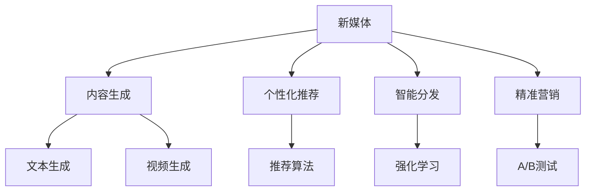

                 

## 1. 背景介绍

### 1.1 问题由来
随着移动互联网的迅猛发展，新媒体领域正在迅速崛起，成为连接用户与内容的重要平台。传统内容产业面临新的挑战和机遇，传统媒体和新媒体的融合势在必行。新媒体创业者们正借助先进的AI技术，不断探索和创新，推动内容产业的转型升级。

### 1.2 问题核心关键点
新媒体创业的核心在于如何利用AI技术提升内容生产效率，实现内容的个性化推荐、智能分发和精准营销。AI技术在新媒体中的典型应用包括：

- **内容生成**：利用NLP技术自动生成文章、视频等原创内容。
- **内容推荐**：通过个性化推荐系统，提高用户粘性和满意度。
- **智能分发**：使用强化学习算法优化内容分发策略，提高用户覆盖率。
- **精准营销**：利用机器学习技术分析用户行为，实现精准广告投放。

### 1.3 问题研究意义
新媒体创业不仅为内容产业带来了新的发展方向，也为AI技术在实际应用中的落地提供了试验田。研究新媒体创业中的AI技术应用，对于提升内容质量、优化用户体验、促进广告收入增长等方面具有重要意义。

## 2. 核心概念与联系

### 2.1 核心概念概述

为更好地理解新媒体创业中的AI技术应用，本节将介绍几个密切相关的核心概念：

- **新媒体**：利用互联网和新媒体技术，通过社交平台、视频网站、网络电台等方式提供内容和服务的新型媒体形式。
- **AI技术**：利用计算机科学和人工智能理论，模拟人类智能行为的技术，包括机器学习、深度学习、自然语言处理等。
- **内容生成**：通过自动生成技术，如文本生成、视频生成、音乐生成等，自动生成内容。
- **个性化推荐**：根据用户历史行为和兴趣，自动推荐相关内容。
- **智能分发**：利用强化学习、优化算法等，合理分配内容资源，提高分发效率。
- **精准营销**：通过用户行为数据分析，实现精准广告投放，提高转化率。

这些核心概念之间的逻辑关系可以通过以下Mermaid流程图来展示：



这个流程图展示了大语言模型在新媒体内容产业中的核心概念及其之间的关系：

1. 新媒体通过内容生成、个性化推荐、智能分发和精准营销，为用户提供优质的内容和服务。
2. 内容生成依赖于自动生成技术，如文本生成、视频生成等。
3. 个性化推荐通过推荐算法实现，可以根据用户历史行为和兴趣自动推荐内容。
4. 智能分发利用强化学习算法优化内容分发策略。
5. 精准营销通过用户行为数据分析，实现广告精准投放。

## 3. 核心算法原理 & 具体操作步骤
### 3.1 算法原理概述

新媒体创业中的核心算法主要包括内容生成、个性化推荐、智能分发和精准营销四个方面。

#### 3.1.1 内容生成算法
内容生成算法基于NLP技术，通过训练语言模型，自动生成文章、视频等原创内容。常用的算法包括：

- **文本生成**：利用Seq2Seq模型、Transformer模型等，自动生成文本内容。例如，使用GPT-2生成新闻报道、科技文章等。
- **视频生成**：通过自然语言描述生成视频内容。例如，使用VideoLan生成讲解视频、演示视频等。

#### 3.1.2 个性化推荐算法
个性化推荐算法通过用户行为数据分析，推荐相关内容。常用的算法包括：

- **协同过滤**：通过分析用户行为，推荐用户可能感兴趣的内容。例如，利用用户行为矩阵计算相似用户，再推荐相似用户喜欢的内容。
- **内容相关性**：根据内容特征，推荐相关性高的内容。例如，利用TF-IDF算法计算文本相似度，推荐相似主题的内容。
- **深度学习模型**：利用深度学习模型，如CNN、RNN、LSTM等，根据用户行为和内容特征，进行更复杂的推荐。

#### 3.1.3 智能分发算法
智能分发算法通过优化算法，合理分配内容资源，提高分发效率。常用的算法包括：

- **强化学习**：通过模拟用户行为，优化分发策略。例如，利用Q-learning算法优化广告投放策略。
- **优化算法**：利用遗传算法、蚁群算法等，优化内容分发路径。例如，利用蚁群算法优化视频分发路径，减少延迟。

#### 3.1.4 精准营销算法
精准营销算法通过用户行为数据分析，实现广告精准投放。常用的算法包括：

- **机器学习**：利用机器学习模型，分析用户行为数据，进行精准投放。例如，利用决策树模型分析用户行为，推荐个性化广告。
- **深度学习**：利用深度学习模型，如CNN、RNN、LSTM等，进行更复杂的用户行为分析。例如，利用LSTM模型分析用户行为序列，推荐个性化广告。

### 3.2 算法步骤详解

以内容生成算法为例，下面详细介绍其具体操作步骤：

#### 3.2.1 数据准备
1. 收集语料库：收集大量文本数据，用于训练语言模型。
2. 数据预处理：清洗和处理文本数据，去除噪音，划分训练集和验证集。

#### 3.2.2 模型训练
1. 选择模型：选择适合的内容生成模型，如GPT-2、Seq2Seq等。
2. 定义损失函数：定义内容生成任务的损失函数，如交叉熵损失。
3. 训练模型：使用GPU/TPU等高性能设备，进行模型训练。

#### 3.2.3 模型评估
1. 验证集评估：在验证集上评估模型的生成效果，计算BLEU、ROUGE等指标。
2. 调整参数：根据评估结果，调整模型参数和超参数，如学习率、批大小等。

#### 3.2.4 模型部署
1. 保存模型：保存训练好的模型，以便后续使用。
2. 部署模型：将模型部署到服务器或云平台上，进行实时生成内容。

### 3.3 算法优缺点

新媒体创业中的内容生成算法具有以下优点：

- **自动化**：自动生成内容，减少人工成本，提高效率。
- **多样化**：生成多样化的内容，满足不同用户的需求。
- **个性化**：根据用户兴趣和行为，生成个性化内容，提升用户满意度。

同时，也存在以下缺点：

- **质量不稳定**：自动生成的内容可能存在语法错误、逻辑不通等问题。
- **缺乏创意**：生成的内容缺乏人工创作的独特性和创新性。
- **依赖数据**：内容生成依赖大量高质量的语料库，数据不足时效果不佳。

### 3.4 算法应用领域

内容生成算法在新媒体创业中有着广泛的应用：

- **新闻生成**：利用文本生成技术，自动生成新闻报道。
- **科技文章**：利用文本生成技术，生成科技文章、论文等。
- **视频讲解**：利用视频生成技术，生成讲解视频、演示视频等。
- **产品介绍**：利用视频生成技术，生成产品介绍视频，提高用户购买转化率。

除了这些应用外，内容生成算法还被创新性地应用到更多场景中，如虚拟主播、虚拟偶像等，为新媒体创业带来了新的突破。

## 4. 数学模型和公式 & 详细讲解 & 举例说明
### 4.1 数学模型构建

假设内容生成任务为文本生成，输入为输入序列 $x_1,x_2,\ldots,x_n$，输出为文本序列 $y_1,y_2,\ldots,y_m$。

定义文本生成任务为条件概率分布 $P(y_i|x_{1:i-1})$，即给定前 $i-1$ 个词，生成第 $i$ 个词的概率。通过训练模型，最大化该条件概率，实现文本生成。

### 4.2 公式推导过程

定义条件概率分布为 $P(y_i|x_{1:i-1})$，则生成任务的目标函数为：

$$
\max_{\theta} \sum_{i=1}^m \log P(y_i|x_{1:i-1})
$$

其中 $\theta$ 为模型参数，如语言模型的权重。

目标函数的求解可以通过最大似然估计（MLE）实现，即：

$$
\theta = \arg\max_{\theta} \log P(y_1,y_2,\ldots,y_m|x_1,x_2,\ldots,x_n)
$$

利用条件概率分布，可以进一步得到：

$$
\log P(y_1,y_2,\ldots,y_m|x_1,x_2,\ldots,x_n) = \log P(y_1|x_1) + \log P(y_2|x_1,y_1) + \log P(y_3|x_1,y_1,y_2) + \ldots + \log P(y_m|x_1,y_1,y_2,\ldots,y_{m-1})
$$

上式即为自回归模型，通常使用Transformer模型进行求解。

### 4.3 案例分析与讲解

以GPT-2为例，分析其文本生成过程。

GPT-2利用Transformer模型，通过自回归方式生成文本。假设输入序列为 $x_1,x_2,\ldots,x_n$，则输出序列为：

$$
y_1 = \mathrm{softmax}(W_1x_1 + b_1)
$$

$$
y_2 = \mathrm{softmax}(W_2[x_1, y_1] + b_2)
$$

$$
y_3 = \mathrm{softmax}(W_3[x_1, y_1, y_2] + b_3)
$$

$$
\vdots
$$

其中 $W_i,b_i$ 为线性变换矩阵和偏置向量。通过训练模型，最大化上述条件概率分布，实现文本生成。

## 5. 项目实践：代码实例和详细解释说明
### 5.1 开发环境搭建

在进行内容生成项目开发前，我们需要准备好开发环境。以下是使用Python进行PyTorch开发的环境配置流程：

1. 安装Anaconda：从官网下载并安装Anaconda，用于创建独立的Python环境。

2. 创建并激活虚拟环境：
```bash
conda create -n pytorch-env python=3.8 
conda activate pytorch-env
```

3. 安装PyTorch：根据CUDA版本，从官网获取对应的安装命令。例如：
```bash
conda install pytorch torchvision torchaudio cudatoolkit=11.1 -c pytorch -c conda-forge
```

4. 安装Transformers库：
```bash
pip install transformers
```

5. 安装各类工具包：
```bash
pip install numpy pandas scikit-learn matplotlib tqdm jupyter notebook ipython
```

完成上述步骤后，即可在`pytorch-env`环境中开始内容生成项目开发。

### 5.2 源代码详细实现

下面我们以文本生成任务为例，给出使用Transformers库对GPT-2模型进行文本生成的PyTorch代码实现。

首先，定义文本生成任务的数据处理函数：

```python
from transformers import GPT2Tokenizer
from torch.utils.data import Dataset
import torch

class TextGenerationDataset(Dataset):
    def __init__(self, texts, tokenizer, max_len=512):
        self.texts = texts
        self.tokenizer = tokenizer
        self.max_len = max_len
        
    def __len__(self):
        return len(self.texts)
    
    def __getitem__(self, item):
        text = self.texts[item]
        encoding = self.tokenizer(text, return_tensors='pt', max_length=self.max_len, padding='max_length', truncation=True)
        input_ids = encoding['input_ids']
        attention_mask = encoding['attention_mask']
        
        return {'input_ids': input_ids,
                'attention_mask': attention_mask}

# 数据集
tokenizer = GPT2Tokenizer.from_pretrained('gpt2')

train_dataset = TextGenerationDataset(train_texts, tokenizer)
dev_dataset = TextGenerationDataset(dev_texts, tokenizer)
test_dataset = TextGenerationDataset(test_texts, tokenizer)
```

然后，定义模型和优化器：

```python
from transformers import GPT2LMHeadModel
from torch.optim import Adam

model = GPT2LMHeadModel.from_pretrained('gpt2')
optimizer = Adam(model.parameters(), lr=5e-5)
```

接着，定义训练和评估函数：

```python
from torch.utils.data import DataLoader
from tqdm import tqdm
import math

device = torch.device('cuda') if torch.cuda.is_available() else torch.device('cpu')
model.to(device)

def train_epoch(model, dataset, batch_size, optimizer, max_len):
    dataloader = DataLoader(dataset, batch_size=batch_size, shuffle=True)
    model.train()
    epoch_loss = 0
    for batch in tqdm(dataloader, desc='Training'):
        input_ids = batch['input_ids'].to(device)
        attention_mask = batch['attention_mask'].to(device)
        labels = input_ids
        model.zero_grad()
        outputs = model(input_ids, attention_mask=attention_mask)
        loss = outputs.loss
        epoch_loss += loss.item()
        loss.backward()
        optimizer.step()
    return epoch_loss / len(dataloader)

def evaluate(model, dataset, batch_size, max_len):
    dataloader = DataLoader(dataset, batch_size=batch_size)
    model.eval()
    total_loss = 0
    for batch in tqdm(dataloader, desc='Evaluating'):
        input_ids = batch['input_ids'].to(device)
        attention_mask = batch['attention_mask'].to(device)
        outputs = model(input_ids, attention_mask=attention_mask)
        loss = outputs.loss
        total_loss += loss.item()
    return total_loss / len(dataloader)

def generate_text(model, tokenizer, max_len, prefix=''):
    input_ids = tokenizer.encode(prefix, return_tensors='pt')
    input_ids = input_ids.to(device)
    attention_mask = torch.ones(input_ids.shape, device=device)
    generated_ids = []
    model.eval()
    with torch.no_grad():
        for i in range(max_len):
            outputs = model(input_ids, attention_mask=attention_mask)
            predicted_id = torch.argmax(outputs.logits[:, -1])
            generated_ids.append(predicted_id.item())
            input_ids = torch.cat([input_ids, predicted_id.unsqueeze(0)], dim=1)
            attention_mask = torch.cat([attention_mask, attention_mask.new_ones((1, input_ids.shape[-1]))], dim=0)
            if predicted_id.item() == tokenizer.eos_token_id:
                break
    return tokenizer.decode(generated_ids)

# 训练和评估
epochs = 5
batch_size = 16
max_len = 512

for epoch in range(epochs):
    loss = train_epoch(model, train_dataset, batch_size, optimizer, max_len)
    print(f"Epoch {epoch+1}, train loss: {loss:.3f}")
    
    print(f"Epoch {epoch+1}, dev results:")
    evaluate_loss = evaluate(model, dev_dataset, batch_size, max_len)
    print(f"Dev loss: {evaluate_loss:.3f}")
    
    print(f"Epoch {epoch+1}, generate results:")
    print(generate_text(model, tokenizer, max_len, prefix='NLP是'))
    
print("Test results:")
evaluate_loss = evaluate(model, test_dataset, batch_size, max_len)
print(f"Test loss: {evaluate_loss:.3f}")
```

以上就是使用PyTorch对GPT-2进行文本生成的完整代码实现。可以看到，得益于Transformers库的强大封装，我们可以用相对简洁的代码完成GPT-2模型的加载和训练。

### 5.3 代码解读与分析

让我们再详细解读一下关键代码的实现细节：

**TextGenerationDataset类**：
- `__init__`方法：初始化文本、分词器等关键组件。
- `__len__`方法：返回数据集的样本数量。
- `__getitem__`方法：对单个样本进行处理，将文本输入编码为token ids，并对其进行定长padding，最终返回模型所需的输入。

**数据集**：
- 定义文本生成任务的数据集，利用GPT2Tokenizer将文本转换为token ids。
- 数据集的预处理和批处理，方便模型训练和推理。

**模型和优化器**：
- 利用GPT2LMHeadModel加载预训练模型，Adam优化器进行模型训练。
- 模型训练函数`train_epoch`：对数据以批为单位进行迭代，在每个批次上前向传播计算loss并反向传播更新模型参数，最后返回该epoch的平均loss。
- 模型评估函数`evaluate`：与训练类似，不同点在于不更新模型参数，并在每个batch结束后将预测和标签结果存储下来，最后使用评估函数计算平均loss。
- 文本生成函数`generate_text`：在训练好的模型上，使用预定义的prefix作为输入，生成一定长度的文本，直到出现终止符号。

**训练流程**：
- 定义总的epoch数和batch size，开始循环迭代
- 每个epoch内，先在训练集上训练，输出平均loss
- 在验证集上评估，输出生成结果
- 所有epoch结束后，在测试集上评估，给出最终测试结果

可以看到，PyTorch配合Transformers库使得GPT-2文本生成的代码实现变得简洁高效。开发者可以将更多精力放在数据处理、模型改进等高层逻辑上，而不必过多关注底层的实现细节。

当然，工业级的系统实现还需考虑更多因素，如模型的保存和部署、超参数的自动搜索、更灵活的任务适配层等。但核心的内容生成模型基本与此类似。

## 6. 实际应用场景
### 6.1 智能内容推荐

智能内容推荐系统利用个性化推荐算法，根据用户的历史行为和兴趣，自动推荐相关内容。用户浏览网页、观看视频、收听音频等行为都会被系统记录下来，并转化为特征向量。

以新闻推荐为例，系统通过分析用户的历史浏览记录，学习用户对各类新闻主题的偏好。然后根据当前热门新闻的特征，生成个性化推荐列表。用户可以查看推荐列表，选择感兴趣的新闻进行阅读。

### 6.2 广告精准投放

广告精准投放系统利用精准营销算法，根据用户的行为数据，实现广告的精准投放。系统记录用户的点击、浏览、购买等行为，生成行为特征向量。

例如，用户浏览了一个汽车品牌的页面，系统可以通过广告精准投放算法，为用户推荐相关品牌的广告。通过精准投放，可以提高广告的转化率和投资回报率。

### 6.3 视频内容生成

视频内容生成系统利用视频生成算法，根据用户的行为数据和兴趣，生成个性化的视频内容。例如，用户浏览了体育新闻，系统可以自动生成相关体育视频，推荐给用户观看。

通过个性化视频生成，可以提高用户观看视频的活跃度和满意度。同时，系统可以收集用户观看视频的行为数据，进一步优化推荐算法。

### 6.4 未来应用展望

随着AI技术的发展，基于内容生成、个性化推荐、智能分发和精准营销的新媒体创业将迎来更多机遇和挑战。

未来，基于AI的内容生成将更加丰富和多样化，可以根据不同场景生成各类内容，如新闻报道、科普文章、教学视频等。同时，生成内容的质量也将不断提升，更符合用户的需求和期望。

基于AI的个性化推荐将更加精准和高效，能够根据用户的历史行为和兴趣，推荐更加符合其需求的内容。推荐系统将不再是简单的推荐，而是与用户进行智能互动，提升用户体验。

基于AI的智能分发将更加智能化和自动化，能够根据用户的行为和偏好，自动调整内容分发策略，提高内容分发效率。分发系统将不再是简单的分发，而是与用户进行智能互动，优化内容体验。

基于AI的精准营销将更加高效和个性化，能够根据用户的行为数据，实现广告的精准投放。广告系统将不再是简单的投放，而是与用户进行智能互动，提升广告效果。

## 7. 工具和资源推荐
### 7.1 学习资源推荐

为了帮助开发者系统掌握新媒体创业中的AI技术应用，这里推荐一些优质的学习资源：

1. 《深度学习入门》系列博文：由大模型技术专家撰写，深入浅出地介绍了深度学习的基本概念和经典模型。

2. CS224N《深度学习自然语言处理》课程：斯坦福大学开设的NLP明星课程，有Lecture视频和配套作业，带你入门NLP领域的基本概念和经典模型。

3. 《Natural Language Processing with Transformers》书籍：Transformers库的作者所著，全面介绍了如何使用Transformers库进行NLP任务开发，包括内容生成在内的诸多范式。

4. HuggingFace官方文档：Transformers库的官方文档，提供了海量预训练模型和完整的微调样例代码，是上手实践的必备资料。

5. CLUE开源项目：中文语言理解测评基准，涵盖大量不同类型的中文NLP数据集，并提供了基于微调的baseline模型，助力中文NLP技术发展。

通过对这些资源的学习实践，相信你一定能够快速掌握新媒体创业中的AI技术应用，并用于解决实际的NLP问题。
###  7.2 开发工具推荐

高效的开发离不开优秀的工具支持。以下是几款用于新媒体内容生成开发的常用工具：

1. PyTorch：基于Python的开源深度学习框架，灵活动态的计算图，适合快速迭代研究。大部分预训练语言模型都有PyTorch版本的实现。

2. TensorFlow：由Google主导开发的开源深度学习框架，生产部署方便，适合大规模工程应用。同样有丰富的预训练语言模型资源。

3. Transformers库：HuggingFace开发的NLP工具库，集成了众多SOTA语言模型，支持PyTorch和TensorFlow，是进行内容生成任务开发的利器。

4. Weights & Biases：模型训练的实验跟踪工具，可以记录和可视化模型训练过程中的各项指标，方便对比和调优。与主流深度学习框架无缝集成。

5. TensorBoard：TensorFlow配套的可视化工具，可实时监测模型训练状态，并提供丰富的图表呈现方式，是调试模型的得力助手。

6. Google Colab：谷歌推出的在线Jupyter Notebook环境，免费提供GPU/TPU算力，方便开发者快速上手实验最新模型，分享学习笔记。

合理利用这些工具，可以显著提升内容生成任务的开发效率，加快创新迭代的步伐。

### 7.3 相关论文推荐

新媒体创业中的内容生成、推荐、分发和营销技术的发展源于学界的持续研究。以下是几篇奠基性的相关论文，推荐阅读：

1. Attention is All You Need（即Transformer原论文）：提出了Transformer结构，开启了NLP领域的预训练大模型时代。

2. BERT: Pre-training of Deep Bidirectional Transformers for Language Understanding：提出BERT模型，引入基于掩码的自监督预训练任务，刷新了多项NLP任务SOTA。

3. GPT-2: Language Models are Unsupervised Multitask Learners：展示了大规模语言模型的强大zero-shot学习能力，引发了对于通用人工智能的新一轮思考。

4. Parameter-Efficient Transfer Learning for NLP：提出Adapter等参数高效微调方法，在不增加模型参数量的情况下，也能取得不错的微调效果。

5. Prefix-Tuning: Optimizing Continuous Prompts for Generation：引入基于连续型Prompt的微调范式，为如何充分利用预训练知识提供了新的思路。

6. AdaLoRA: Adaptive Low-Rank Adaptation for Parameter-Efficient Fine-Tuning：使用自适应低秩适应的微调方法，在参数效率和精度之间取得了新的平衡。

这些论文代表了大语言模型内容生成技术的发展脉络。通过学习这些前沿成果，可以帮助研究者把握学科前进方向，激发更多的创新灵感。

## 8. 总结：未来发展趋势与挑战
### 8.1 总结

本文对新媒体创业中的内容生成技术进行了全面系统的介绍。首先阐述了内容生成技术在新媒体中的重要性和应用前景，明确了内容生成在提升用户体验、优化广告收入等方面的价值。其次，从原理到实践，详细讲解了内容生成算法的核心步骤和具体操作步骤，给出了代码实例和详细解释说明。同时，本文还广泛探讨了内容生成技术在多个实际应用场景中的具体应用，展示了其在新闻推荐、广告精准投放、视频内容生成等方面的巨大潜力。此外，本文精选了内容生成技术的各类学习资源，力求为开发者提供全方位的技术指引。

通过本文的系统梳理，可以看到，基于大语言模型的内容生成技术正在成为新媒体创业的重要范式，极大地提升了内容生产效率和用户满意度。未来，伴随预训练语言模型和生成算法的持续演进，内容生成技术将为新媒体创业带来更多创新和突破。

### 8.2 未来发展趋势

展望未来，内容生成技术将呈现以下几个发展趋势：

1. **内容质量提升**：随着预训练模型和生成算法的不断优化，内容生成质量将不断提高，更加贴近用户需求和期望。

2. **多样化内容生成**：内容生成将涵盖更多类型和形式，如文本、视频、音频等，满足用户多样化的需求。

3. **个性化生成**：基于用户历史行为和兴趣，生成更加个性化的内容，提升用户体验。

4. **实时生成**：内容生成将更加智能化和自动化，能够实时生成并推送内容，提高用户粘性和满意度。

5. **跨模态生成**：内容生成将突破文本模态的限制，融合视觉、语音等多模态信息，提升内容的丰富性和交互性。

6. **交互式生成**：内容生成将更加智能和交互，能够与用户进行多轮对话，提升内容的互动性和趣味性。

以上趋势凸显了内容生成技术的广阔前景。这些方向的探索发展，必将进一步提升新媒体创业的成功率和影响力，推动内容产业的全面升级。

### 8.3 面临的挑战

尽管内容生成技术在新媒体创业中已经取得了显著成效，但在迈向更加智能化、普适化应用的过程中，仍面临诸多挑战：

1. **内容质量不稳定**：自动生成的内容可能存在语法错误、逻辑不通等问题，影响用户体验。

2. **依赖高质量语料库**：内容生成依赖大量高质量的语料库，数据不足时效果不佳。

3. **缺乏创意**：生成的内容缺乏人工创作的独特性和创新性，难以满足用户对高质量原创内容的需求。

4. **跨模态融合难度大**：跨模态内容的生成涉及多模态数据的整合，技术难度较大。

5. **实时生成资源消耗大**：实时生成的内容需要高算力和存储资源，成本较高。

6. **隐私和伦理问题**：内容生成涉及用户数据处理，需考虑隐私保护和伦理问题。

正视内容生成面临的这些挑战，积极应对并寻求突破，将是大语言模型内容生成技术迈向成熟的必由之路。相信随着学界和产业界的共同努力，这些挑战终将一一被克服，内容生成技术必将在构建智能新媒体中扮演越来越重要的角色。

### 8.4 研究展望

面向未来，内容生成技术需要在以下几个方面寻求新的突破：

1. **探索更高效的生成算法**：开发更加高效的生成算法，如自适应低秩适应算法、流式生成算法等，以提高生成速度和质量。

2. **引入更多先验知识**：将符号化的先验知识，如知识图谱、逻辑规则等，与神经网络模型进行巧妙融合，引导内容生成过程学习更准确、合理的语言模型。

3. **增强内容的可解释性**：开发更具有可解释性的内容生成模型，增强生成内容的逻辑性和可信度。

4. **强化多模态生成**：引入视觉、语音等多模态信息，进行跨模态内容生成，提升内容的丰富性和交互性。

5. **优化实时生成**：优化实时生成算法的资源消耗，提高实时生成内容的效率和质量。

6. **加强隐私保护**：引入隐私保护技术，确保内容生成过程中的数据安全，保护用户隐私。

这些研究方向的探索，必将引领内容生成技术迈向更高的台阶，为新媒体创业带来更多创新和突破。面向未来，内容生成技术需要与其他AI技术进行更深入的融合，如知识表示、因果推理、强化学习等，多路径协同发力，共同推动新媒体创业的持续创新和发展。

## 9. 附录：常见问题与解答

**Q1：内容生成算法的原理是什么？**

A: 内容生成算法基于自然语言处理（NLP）技术，通过训练语言模型，自动生成文本、视频等原创内容。常用的算法包括文本生成、视频生成、音频生成等。以文本生成为例，通过Seq2Seq模型、Transformer模型等，自动生成文本内容。生成任务的目标函数为最大化条件概率分布，实现文本生成。

**Q2：如何优化内容生成算法的性能？**

A: 内容生成算法的性能优化可以从以下几个方面入手：
1. 数据准备：收集大量高质量的语料库，进行数据预处理和清洗，确保数据的质量和多样性。
2. 模型选择：选择合适的预训练模型和生成算法，如GPT-2、Transformer等。
3. 超参数调优：调整学习率、批大小、迭代轮数等超参数，优化模型性能。
4. 正则化技术：引入L2正则、Dropout、Early Stopping等正则化技术，避免过拟合。
5. 对抗训练：引入对抗样本，提高模型鲁棒性。
6. 数据增强：通过回译、近义替换等方式扩充训练集，提高模型泛化能力。
7. 对抗生成：引入对抗生成网络（GAN），生成更丰富的内容。

这些优化策略可以结合使用，以达到最优的生成效果。

**Q3：内容生成算法在实际应用中需要注意哪些问题？**

A: 内容生成算法在实际应用中需要注意以下问题：
1. 质量不稳定：自动生成的内容可能存在语法错误、逻辑不通等问题，影响用户体验。
2. 依赖高质量语料库：内容生成依赖大量高质量的语料库，数据不足时效果不佳。
3. 缺乏创意：生成的内容缺乏人工创作的独特性和创新性，难以满足用户对高质量原创内容的需求。
4. 跨模态融合难度大：跨模态内容的生成涉及多模态数据的整合，技术难度较大。
5. 实时生成资源消耗大：实时生成的内容需要高算力和存储资源，成本较高。
6. 隐私和伦理问题：内容生成涉及用户数据处理，需考虑隐私保护和伦理问题。

开发者需要在实际应用中不断迭代和优化模型、数据和算法，方能得到理想的效果。

**Q4：内容生成算法有哪些典型的应用场景？**

A: 内容生成算法在新媒体创业中有广泛的应用场景，包括：
1. 新闻报道生成：利用文本生成技术，自动生成新闻报道、科技文章等。
2. 产品介绍视频：利用视频生成技术，生成产品介绍视频，提高用户购买转化率。
3. 个性化推荐系统：利用推荐算法，根据用户历史行为和兴趣，自动推荐相关内容。
4. 广告精准投放：利用精准营销算法，根据用户行为数据，实现广告的精准投放。
5. 视频内容生成：利用视频生成算法，根据用户行为数据和兴趣，生成个性化的视频内容。
6. 智能内容推荐：利用推荐算法，根据用户历史行为和兴趣，自动推荐相关内容。

这些应用场景覆盖了新媒体创业的各个环节，通过AI技术的应用，提升了内容生产效率和用户满意度。

**Q5：如何评估内容生成算法的性能？**

A: 内容生成算法的性能评估可以从以下几个方面入手：
1. 自动评估：利用BLEU、ROUGE等指标，评估生成文本的质量和相关性。
2. 人工评估：邀请专业评测人员，对生成内容进行主观打分，评估其流畅性和自然度。
3. 用户反馈：通过用户调查、点击率等数据，评估生成内容的用户满意度和接受度。
4. 应用效果：评估内容生成在实际应用中的效果，如广告点击率、推荐系统转化率等。

这些评估方法可以结合使用，全面衡量内容生成算法的性能和效果。

---

作者：禅与计算机程序设计艺术 / Zen and the Art of Computer Programming

