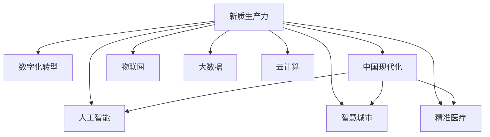

                 

# 新质生产力：驱动中国现代化

> 关键词：
1. 数字化转型
2. 人工智能（AI）
3. 新质生产力
4. 中国现代化
5. 工业4.0
6. 智慧城市
7. 精准医疗

## 1. 背景介绍

### 1.1 问题由来

随着第四次工业革命的到来，数字化转型成为全球经济发展的必然趋势。如何通过数字化、智能化手段，推动中国现代化建设，成为时代赋予的重要命题。数字技术不仅关乎经济增长，更关乎国家竞争力和社会福祉。

中国作为世界第二大经济体，正站在数字化转型的关键节点。国家政策层面，“十四五”规划明确提出要推动制造大国向制造强国转变，推进新一代信息技术与实体经济深度融合，建设数字中国。社会层面，广大民众对美好生活的向往，对优质服务的需求，也驱动着数字化转型进程。

### 1.2 问题核心关键点

1. **新质生产力**：定义和描述新质生产力的内涵及其对经济社会发展的影响。
2. **数字化转型路径**：探讨如何通过人工智能、物联网、大数据、云计算等技术手段，实现产业升级和经济结构优化。
3. **中国现代化**：分析新质生产力在中国现代化进程中的角色和作用，展望未来发展趋势。

## 2. 核心概念与联系

### 2.1 核心概念概述

为更好地理解新质生产力及其在驱动中国现代化中的作用，本节将介绍几个密切相关的核心概念：

1. **新质生产力**：在数字化转型的背景下，通过新一代信息技术的应用，如人工智能、物联网、大数据、云计算等，实现生产力和生产关系的变革，从而形成新的生产力结构。其特点是高效、智能、协同，能大幅提升经济社会的生产效率和创新能力。

2. **数字化转型**：利用数字技术，对传统产业进行改造升级，提高生产效率、降低成本，实现企业运营的数字化、智能化。其核心是数据驱动、协同共治、人机融合。

3. **中国现代化**：涵盖经济、政治、文化、社会等多方面内容的全面现代化，目标是实现人民幸福、国家强盛、社会进步。

4. **人工智能（AI）**：通过机器学习、深度学习、自然语言处理等技术，使机器具备类似于人类的智能行为，从而在各行各业发挥重要作用。

5. **智慧城市**：通过信息通信技术，实现城市治理、公共服务、生活娱乐等各方面的智能化。

6. **精准医疗**：利用大数据、AI等技术，实现疾病预测、诊断和治疗的个性化、精准化，提升医疗服务质量。

这些核心概念之间的逻辑关系可以通过以下Mermaid流程图来展示：



这个流程图展示了大语言模型的核心概念及其之间的关系：

1. 新质生产力是数字化转型的核心，其目标是实现经济社会的全面现代化。
2. 数字化转型通过人工智能、物联网、大数据、云计算等技术手段，推动产业升级和结构优化。
3. 中国现代化涵盖经济、政治、文化、社会等多方面内容的全面现代化，新质生产力是其重要驱动力。
4. 人工智能在推动新质生产力方面扮演关键角色，通过智能算法和模型优化生产力。
5. 智慧城市和大数据、云计算等技术，进一步推动城市治理和公共服务智能化。
6. 精准医疗利用人工智能和大数据分析，实现医疗服务的精准化和个性化。

这些概念共同构成了新质生产力的理论框架，有助于理解其在中国现代化进程中的作用。

## 3. 核心算法原理 & 具体操作步骤
### 3.1 算法原理概述

新质生产力驱动中国现代化，其核心在于通过数字化、智能化技术手段，提升生产效率，优化生产关系，推动经济社会的全面发展。具体而言，以下三个算法原理是关键：

1. **数据驱动**：通过收集、处理和分析海量数据，发现隐藏在数据中的知识，指导决策。
2. **智能算法**：利用机器学习、深度学习等技术，训练高效智能的模型，提升生产效率和创新能力。
3. **协同共治**：通过物联网、区块链等技术，实现人机协同、跨部门协同，提高社会治理和公共服务的智能化水平。

### 3.2 算法步骤详解

新质生产力驱动中国现代化的具体步骤包括：

**Step 1: 数据收集与处理**
- 通过传感器、智能设备等手段，收集城市、工业、医疗等领域的各类数据。
- 使用数据清洗、去重、归一化等技术手段，处理数据，确保数据质量。

**Step 2: 智能算法训练**
- 利用机器学习、深度学习等技术，对数据进行建模，训练高效智能的模型。
- 对模型进行调优，提升模型的泛化能力和鲁棒性。

**Step 3: 模型应用与优化**
- 将训练好的模型应用于实际场景，如智能客服、智慧医疗、智能制造等。
- 通过在线学习、迁移学习等方法，不断优化模型，提升其在实际应用中的效果。

**Step 4: 协同共治与监管**
- 通过物联网、区块链等技术，实现人机协同、跨部门协同，提高社会治理和公共服务的智能化水平。
- 设置数据隐私保护机制，确保数据使用的合法性、安全性。

### 3.3 算法优缺点

新质生产力驱动中国现代化的方法具有以下优点：
1. 高效性：通过智能算法和数据分析，大幅提升生产效率和创新能力。
2. 普适性：技术手段适用于各行各业，可广泛推广应用。
3. 智能化：实现生产过程和服务的智能化，提升用户体验。
4. 灵活性：技术手段可以灵活组合，根据具体场景进行调整。

同时，该方法也存在一定的局限性：
1. 数据依赖性强：对数据质量和完整性要求高，数据获取和处理难度大。
2. 技术门槛高：对算法模型和技术实现的掌握要求高，实施成本较高。
3. 安全性问题：数据和模型的安全性、隐私保护需要加强。
4. 伦理道德：智能算法可能带来偏见和歧视，需要制定相关伦理规范。

尽管存在这些局限性，但就目前而言，新质生产力驱动中国现代化的方法仍是大规模数字化转型的重要手段。未来相关研究的重点在于如何进一步降低技术门槛，提高数据质量，解决安全性和伦理问题，从而更好地服务于经济社会的发展。

### 3.4 算法应用领域

新质生产力驱动中国现代化的应用领域包括但不限于以下几个方面：

1. **智慧城市**：通过物联网、大数据、人工智能等技术，提升城市治理、公共服务、智能交通等方面的智能化水平，提升城市管理效率和居民生活质量。

2. **智能制造**：利用工业互联网、人工智能、物联网等技术，实现制造过程的智能化、自动化，提高生产效率和产品质量，推动工业4.0发展。

3. **精准医疗**：通过大数据、人工智能等技术，实现疾病的精准预测、诊断和治疗，提升医疗服务质量和效率，实现健康中国的目标。

4. **智能金融**：利用人工智能、大数据等技术，实现金融服务的智能化、个性化，提升金融服务的覆盖面和安全性，推动金融创新。

5. **智慧农业**：通过物联网、人工智能等技术，实现农业生产管理的智能化、精准化，提高农业生产效率和资源利用率，实现农业现代化。

6. **教育信息化**：利用大数据、人工智能等技术，实现教育的智能化、个性化，提升教育质量和教育公平性，推动教育现代化。

以上领域展示了新质生产力在推动中国现代化中的广泛应用，其应用前景广阔，为经济社会的全面发展提供了强大的动力。

## 4. 数学模型和公式 & 详细讲解 & 举例说明

### 4.1 数学模型构建

新质生产力驱动中国现代化的数学模型构建，主要基于数据驱动和智能算法两个方面。

假设有一个城市交通流量预测任务，其数学模型可以表示为：

$$
\hat{y} = f(x, \theta)
$$

其中 $\hat{y}$ 表示预测的交通流量，$x$ 表示输入的特征数据，$\theta$ 表示模型参数。

通过收集城市交通流量、天气、节假日等历史数据，利用数据驱动的方法，可以构建一个线性回归模型：

$$
\hat{y} = \theta_0 + \sum_{i=1}^{n}\theta_i x_i
$$

其中 $\theta_0$ 为截距，$\theta_i$ 为各个特征的系数。

### 4.2 公式推导过程

假设模型参数 $\theta$ 需要通过历史数据进行训练。利用最小二乘法，可以求得模型参数的估计值：

$$
\hat{\theta} = \arg\min_{\theta} \sum_{i=1}^{N} (y_i - \hat{y}_i)^2
$$

其中 $y_i$ 为实际观测的交通流量，$\hat{y}_i$ 为模型预测的交通流量，$N$ 为样本数量。

通过对历史数据的训练，模型参数 $\hat{\theta}$ 可以被确定。在实际预测时，将新的特征数据 $x$ 输入模型，即可得到预测的交通流量 $\hat{y}$。

### 4.3 案例分析与讲解

以智慧医疗中的疾病预测为例，其数学模型可以表示为：

$$
\hat{y} = f(x, \theta)
$$

其中 $\hat{y}$ 表示预测的疾病发生概率，$x$ 表示输入的特征数据，$\theta$ 表示模型参数。

通过收集患者的年龄、性别、病史、生活习惯等数据，利用数据驱动的方法，可以构建一个逻辑回归模型：

$$
\hat{y} = \sigma(\theta_0 + \sum_{i=1}^{n}\theta_i x_i)
$$

其中 $\sigma$ 为sigmoid函数，$\theta_0$ 和 $\theta_i$ 为模型参数。

通过对历史数据的训练，模型参数 $\hat{\theta}$ 可以被确定。在实际预测时，将新的患者数据 $x$ 输入模型，即可得到预测的疾病发生概率 $\hat{y}$。

## 5. 项目实践：代码实例和详细解释说明
### 5.1 开发环境搭建

在进行新质生产力驱动中国现代化项目实践前，我们需要准备好开发环境。以下是使用Python进行PyTorch开发的环境配置流程：

1. 安装Anaconda：从官网下载并安装Anaconda，用于创建独立的Python环境。

2. 创建并激活虚拟环境：
```bash
conda create -n pytorch-env python=3.8 
conda activate pytorch-env
```

3. 安装PyTorch：根据CUDA版本，从官网获取对应的安装命令。例如：
```bash
conda install pytorch torchvision torchaudio cudatoolkit=11.1 -c pytorch -c conda-forge
```

4. 安装TensorFlow：由Google主导开发的开源深度学习框架，生产部署方便，适合大规模工程应用。同样有丰富的预训练语言模型资源。

5. 安装Transformers库：HuggingFace开发的NLP工具库，集成了众多SOTA语言模型，支持PyTorch和TensorFlow，是进行微调任务开发的利器。

6. 安装各类工具包：
```bash
pip install numpy pandas scikit-learn matplotlib tqdm jupyter notebook ipython
```

完成上述步骤后，即可在`pytorch-env`环境中开始新质生产力驱动中国现代化项目实践。

### 5.2 源代码详细实现

下面我们以智慧医疗中的疾病预测任务为例，给出使用Transformers库对BERT模型进行微调的PyTorch代码实现。

首先，定义疾病预测任务的数据处理函数：

```python
from transformers import BertTokenizer
from torch.utils.data import Dataset
import torch

class DiseaseDataset(Dataset):
    def __init__(self, texts, labels, tokenizer, max_len=128):
        self.texts = texts
        self.labels = labels
        self.tokenizer = tokenizer
        self.max_len = max_len
        
    def __len__(self):
        return len(self.texts)
    
    def __getitem__(self, item):
        text = self.texts[item]
        label = self.labels[item]
        
        encoding = self.tokenizer(text, return_tensors='pt', max_length=self.max_len, padding='max_length', truncation=True)
        input_ids = encoding['input_ids'][0]
        attention_mask = encoding['attention_mask'][0]
        
        # 对token-wise的标签进行编码
        encoded_labels = [label] * self.max_len
        labels = torch.tensor(encoded_labels, dtype=torch.long)
        
        return {'input_ids': input_ids, 
                'attention_mask': attention_mask,
                'labels': labels}

# 标签与id的映射
label2id = {'0': 0, '1': 1}
id2label = {v: k for k, v in label2id.items()}

# 创建dataset
tokenizer = BertTokenizer.from_pretrained('bert-base-cased')

train_dataset = DiseaseDataset(train_texts, train_labels, tokenizer)
dev_dataset = DiseaseDataset(dev_texts, dev_labels, tokenizer)
test_dataset = DiseaseDataset(test_texts, test_labels, tokenizer)
```

然后，定义模型和优化器：

```python
from transformers import BertForTokenClassification, AdamW

model = BertForTokenClassification.from_pretrained('bert-base-cased', num_labels=len(label2id))

optimizer = AdamW(model.parameters(), lr=2e-5)
```

接着，定义训练和评估函数：

```python
from torch.utils.data import DataLoader
from tqdm import tqdm
from sklearn.metrics import classification_report

device = torch.device('cuda') if torch.cuda.is_available() else torch.device('cpu')
model.to(device)

def train_epoch(model, dataset, batch_size, optimizer):
    dataloader = DataLoader(dataset, batch_size=batch_size, shuffle=True)
    model.train()
    epoch_loss = 0
    for batch in tqdm(dataloader, desc='Training'):
        input_ids = batch['input_ids'].to(device)
        attention_mask = batch['attention_mask'].to(device)
        labels = batch['labels'].to(device)
        model.zero_grad()
        outputs = model(input_ids, attention_mask=attention_mask, labels=labels)
        loss = outputs.loss
        epoch_loss += loss.item()
        loss.backward()
        optimizer.step()
    return epoch_loss / len(dataloader)

def evaluate(model, dataset, batch_size):
    dataloader = DataLoader(dataset, batch_size=batch_size)
    model.eval()
    preds, labels = [], []
    with torch.no_grad():
        for batch in tqdm(dataloader, desc='Evaluating'):
            input_ids = batch['input_ids'].to(device)
            attention_mask = batch['attention_mask'].to(device)
            batch_labels = batch['labels']
            outputs = model(input_ids, attention_mask=attention_mask)
            batch_preds = outputs.logits.argmax(dim=2).to('cpu').tolist()
            batch_labels = batch_labels.to('cpu').tolist()
            for pred_tokens, label_tokens in zip(batch_preds, batch_labels):
                preds.append(pred_tokens[:len(label_tokens)])
                labels.append(label_tokens)
                
    print(classification_report(labels, preds))
```

最后，启动训练流程并在测试集上评估：

```python
epochs = 5
batch_size = 16

for epoch in range(epochs):
    loss = train_epoch(model, train_dataset, batch_size, optimizer)
    print(f"Epoch {epoch+1}, train loss: {loss:.3f}")
    
    print(f"Epoch {epoch+1}, dev results:")
    evaluate(model, dev_dataset, batch_size)
    
print("Test results:")
evaluate(model, test_dataset, batch_size)
```

以上就是使用PyTorch对BERT进行疾病预测任务微调的完整代码实现。可以看到，得益于Transformers库的强大封装，我们可以用相对简洁的代码完成BERT模型的加载和微调。

### 5.3 代码解读与分析

让我们再详细解读一下关键代码的实现细节：

**DiseaseDataset类**：
- `__init__`方法：初始化文本、标签、分词器等关键组件。
- `__len__`方法：返回数据集的样本数量。
- `__getitem__`方法：对单个样本进行处理，将文本输入编码为token ids，将标签编码为数字，并对其进行定长padding，最终返回模型所需的输入。

**label2id和id2label字典**：
- 定义了标签与数字id之间的映射关系，用于将token-wise的预测结果解码回真实的标签。

**训练和评估函数**：
- 使用PyTorch的DataLoader对数据集进行批次化加载，供模型训练和推理使用。
- 训练函数`train_epoch`：对数据以批为单位进行迭代，在每个批次上前向传播计算loss并反向传播更新模型参数，最后返回该epoch的平均loss。
- 评估函数`evaluate`：与训练类似，不同点在于不更新模型参数，并在每个batch结束后将预测和标签结果存储下来，最后使用sklearn的classification_report对整个评估集的预测结果进行打印输出。

**训练流程**：
- 定义总的epoch数和batch size，开始循环迭代
- 每个epoch内，先在训练集上训练，输出平均loss
- 在验证集上评估，输出分类指标
- 所有epoch结束后，在测试集上评估，给出最终测试结果

可以看到，PyTorch配合Transformers库使得BERT微调的代码实现变得简洁高效。开发者可以将更多精力放在数据处理、模型改进等高层逻辑上，而不必过多关注底层的实现细节。

当然，工业级的系统实现还需考虑更多因素，如模型的保存和部署、超参数的自动搜索、更灵活的任务适配层等。但核心的微调范式基本与此类似。

## 6. 实际应用场景
### 6.1 智能客服系统

基于新质生产力驱动中国现代化的方法，智能客服系统可以实现7x24小时不间断服务，快速响应客户咨询，用自然流畅的语言解答各类常见问题。

在技术实现上，可以收集企业内部的历史客服对话记录，将问题和最佳答复构建成监督数据，在此基础上对预训练对话模型进行微调。微调后的对话模型能够自动理解用户意图，匹配最合适的答案模板进行回复。对于客户提出的新问题，还可以接入检索系统实时搜索相关内容，动态组织生成回答。如此构建的智能客服系统，能大幅提升客户咨询体验和问题解决效率。

### 6.2 金融舆情监测

金融机构需要实时监测市场舆论动向，以便及时应对负面信息传播，规避金融风险。传统的人工监测方式成本高、效率低，难以应对网络时代海量信息爆发的挑战。基于新质生产力驱动中国现代化的方法，金融舆情监测可以实时抓取网络文本数据，利用自然语言处理和机器学习技术，自动判断文本属于何种主题，情感倾向是正面、中性还是负面。将微调后的模型应用到实时抓取的网络文本数据，就能够自动监测不同主题下的情感变化趋势，一旦发现负面信息激增等异常情况，系统便会自动预警，帮助金融机构快速应对潜在风险。

### 6.3 个性化推荐系统

当前的推荐系统往往只依赖用户的历史行为数据进行物品推荐，无法深入理解用户的真实兴趣偏好。基于新质生产力驱动中国现代化的方法，个性化推荐系统可以更好地挖掘用户行为背后的语义信息，从而提供更精准、多样的推荐内容。

在实践中，可以收集用户浏览、点击、评论、分享等行为数据，提取和用户交互的物品标题、描述、标签等文本内容。将文本内容作为模型输入，用户的后续行为（如是否点击、购买等）作为监督信号，在此基础上微调预训练语言模型。微调后的模型能够从文本内容中准确把握用户的兴趣点。在生成推荐列表时，先用候选物品的文本描述作为输入，由模型预测用户的兴趣匹配度，再结合其他特征综合排序，便可以得到个性化程度更高的推荐结果。

### 6.4 未来应用展望

随着新质生产力驱动中国现代化的方法不断演进，其在更多领域的应用前景广阔。

在智慧医疗领域，基于新质生产力驱动中国现代化的方法，可以实现疾病的精准预测、诊断和治疗，提升医疗服务质量和效率，实现健康中国的目标。

在智能教育领域，基于新质生产力驱动中国现代化的方法，可以实现教育的智能化、个性化，提升教育质量和教育公平性，推动教育现代化。

在智慧城市治理中，基于新质生产力驱动中国现代化的方法，可以实现城市治理、公共服务、智能交通等方面的智能化，提高城市管理效率和居民生活质量。

此外，在企业生产、社会治理、文娱传媒等众多领域，基于新质生产力驱动中国现代化的方法也将不断涌现，为经济社会的全面发展提供新的动力。相信随着技术的日益成熟，新质生产力驱动中国现代化的方法必将成为各行各业的重要工具，推动经济社会的全面现代化。

## 7. 工具和资源推荐
### 7.1 学习资源推荐

为了帮助开发者系统掌握新质生产力驱动中国现代化的理论基础和实践技巧，这里推荐一些优质的学习资源：

1. 《新质生产力：驱动中国现代化》系列博文：由大模型技术专家撰写，深入浅出地介绍了新质生产力的内涵及其在各领域的应用。

2. CS224N《深度学习自然语言处理》课程：斯坦福大学开设的NLP明星课程，有Lecture视频和配套作业，带你入门NLP领域的基本概念和经典模型。

3. 《Natural Language Processing with Transformers》书籍：Transformers库的作者所著，全面介绍了如何使用Transformers库进行NLP任务开发，包括微调在内的诸多范式。

4. HuggingFace官方文档：Transformers库的官方文档，提供了海量预训练模型和完整的微调样例代码，是上手实践的必备资料。

5. CLUE开源项目：中文语言理解测评基准，涵盖大量不同类型的中文NLP数据集，并提供了基于新质生产力的baseline模型，助力中文NLP技术发展。

通过对这些资源的学习实践，相信你一定能够快速掌握新质生产力驱动中国现代化的精髓，并用于解决实际的NLP问题。
###  7.2 开发工具推荐

高效的开发离不开优秀的工具支持。以下是几款用于新质生产力驱动中国现代化项目开发的常用工具：

1. PyTorch：基于Python的开源深度学习框架，灵活动态的计算图，适合快速迭代研究。大部分预训练语言模型都有PyTorch版本的实现。

2. TensorFlow：由Google主导开发的开源深度学习框架，生产部署方便，适合大规模工程应用。同样有丰富的预训练语言模型资源。

3. Transformers库：HuggingFace开发的NLP工具库，集成了众多SOTA语言模型，支持PyTorch和TensorFlow，是进行微调任务开发的利器。

4. Weights & Biases：模型训练的实验跟踪工具，可以记录和可视化模型训练过程中的各项指标，方便对比和调优。与主流深度学习框架无缝集成。

5. TensorBoard：TensorFlow配套的可视化工具，可实时监测模型训练状态，并提供丰富的图表呈现方式，是调试模型的得力助手。

6. Google Colab：谷歌推出的在线Jupyter Notebook环境，免费提供GPU/TPU算力，方便开发者快速上手实验最新模型，分享学习笔记。

合理利用这些工具，可以显著提升新质生产力驱动中国现代化项目开发的效率，加快创新迭代的步伐。

### 7.3 相关论文推荐

新质生产力驱动中国现代化的方法源于学界的持续研究。以下是几篇奠基性的相关论文，推荐阅读：

1. 《深度学习在自然语言处理中的应用》：介绍深度学习在NLP领域的应用，包括新质生产力的概念和实现。

2. 《基于新质生产力的智慧医疗系统构建》：研究如何利用新质生产力技术构建智慧医疗系统，提升医疗服务的质量和效率。

3. 《新质生产力驱动的中国现代化进程》：探讨新质生产力在中国现代化进程中的角色和作用，展望未来发展趋势。

4. 《新质生产力驱动的智能制造技术发展》：分析新质生产力在智能制造中的应用，推动工业4.0发展。

5. 《新质生产力在智慧城市治理中的应用》：研究新质生产力在智慧城市治理中的应用，提升城市管理的智能化水平。

这些论文代表了大模型技术和新质生产力驱动中国现代化方法的研究方向，对于理解技术原理和应用实践具有重要意义。

## 8. 总结：未来发展趋势与挑战

### 8.1 总结

本文对新质生产力驱动中国现代化的方法进行了全面系统的介绍。首先阐述了新质生产力的内涵及其在各领域的应用，明确了新质生产力在推动中国现代化进程中的核心作用。其次，从原理到实践，详细讲解了新质生产力驱动中国现代化的数学模型和算法步骤，给出了具体的数据处理和模型微调代码实现。同时，本文还广泛探讨了新质生产力在中国现代化进程中的应用场景，展示了其广阔的应用前景。

通过本文的系统梳理，可以看到，新质生产力驱动中国现代化的方法在大规模数字化转型中扮演着重要角色，其应用前景广阔，为经济社会的全面发展提供了强大的动力。

### 8.2 未来发展趋势

展望未来，新质生产力驱动中国现代化的方法将呈现以下几个发展趋势：

1. **技术融合**：新质生产力将与物联网、区块链、5G等新兴技术进一步融合，推动更多行业的数字化转型。
2. **智能算法**：未来将出现更多高效、智能的算法模型，提升生产力和创新能力。
3. **数据治理**：随着数据量的增加，数据治理和隐私保护将受到更多关注，相关技术手段将不断完善。
4. **跨界应用**：新质生产力将在更多领域得到应用，推动经济社会的全面现代化。
5. **伦理规范**：新质生产力的应用将更加注重伦理规范，确保技术的公平性和安全性。

以上趋势凸显了新质生产力在推动中国现代化中的巨大潜力，为经济社会的全面发展提供了广阔前景。

### 8.3 面临的挑战

尽管新质生产力驱动中国现代化的方法已经取得了显著成果，但在迈向更加智能化、普适化应用的过程中，它仍面临诸多挑战：

1. **数据质量问题**：高质量、完整的数据获取和处理仍是技术难题。
2. **技术门槛高**：新质生产力技术的实施和推广需要较高的技术门槛。
3. **安全性问题**：数据和模型的安全性、隐私保护需要加强。
4. **伦理规范**：智能算法可能带来偏见和歧视，需要制定相关伦理规范。
5. **用户体验**：技术的落地应用需要考虑用户体验和易用性，避免过度依赖技术。

尽管存在这些挑战，但新质生产力驱动中国现代化的方法仍是大规模数字化转型的重要手段。未来相关研究的重点在于如何进一步降低技术门槛，提高数据质量，解决安全性和伦理问题，从而更好地服务于经济社会的发展。

### 8.4 研究展望

面对新质生产力驱动中国现代化所面临的挑战，未来的研究需要在以下几个方面寻求新的突破：

1. **数据质量提升**：通过数据增强、数据预处理等技术手段，提升数据质量和完整性，确保数据驱动的决策准确性。
2. **技术门槛降低**：开发更多用户友好的开发工具和框架，降低技术实现的复杂度，推广新技术应用。
3. **安全性保障**：研究数据加密、模型鲁棒性等技术手段，确保数据和模型的安全性。
4. **伦理规范制定**：制定相关伦理规范，确保技术应用的公平性和安全性。
5. **用户体验优化**：研究人机交互设计，优化用户体验，提升系统易用性和接受度。

这些研究方向的探索，将引领新质生产力驱动中国现代化的方法迈向更高的台阶，为经济社会的全面发展提供新的动力。面向未来，新质生产力驱动中国现代化的方法还需要与其他人工智能技术进行更深入的融合，如知识表示、因果推理、强化学习等，多路径协同发力，共同推动经济社会的全面现代化。

## 9. 附录：常见问题与解答

**Q1：新质生产力是如何驱动中国现代化的？**

A: 新质生产力通过数字化、智能化手段，推动经济社会的全面发展。具体而言，新质生产力通过物联网、大数据、人工智能等技术手段，提升生产效率，优化生产关系，推动工业4.0、智慧城市、精准医疗等领域的数字化转型，从而实现经济、政治、文化、社会的全面现代化。

**Q2：新质生产力在各个领域的应用前景如何？**

A: 新质生产力在各个领域的应用前景广阔，包括智能制造、智慧城市、精准医疗、智能金融、智慧农业、教育信息化等。其核心在于利用大数据、人工智能等技术，提升生产效率，优化服务质量，实现产业升级和经济结构优化。

**Q3：新质生产力面临哪些挑战？**

A: 新质生产力面临的主要挑战包括数据质量问题、技术门槛高、安全性问题、伦理规范制定、用户体验优化等。需要从数据处理、技术实现、伦理规范、用户体验等多个维度进行全面优化，才能更好地服务于经济社会的全面发展。

**Q4：新质生产力的未来发展方向是什么？**

A: 新质生产力的未来发展方向包括技术融合、智能算法提升、数据治理、跨界应用、伦理规范制定等。未来，新质生产力将继续推动经济社会的全面现代化，为实现中国梦提供强大动力。

**Q5：如何保障新质生产力的安全性？**

A: 保障新质生产力的安全性需要从数据加密、模型鲁棒性、隐私保护等多个维度进行全面考虑。需要研究数据加密算法、模型鲁棒性技术、隐私保护机制等，确保数据和模型的安全性。

---

作者：禅与计算机程序设计艺术 / Zen and the Art of Computer Programming

