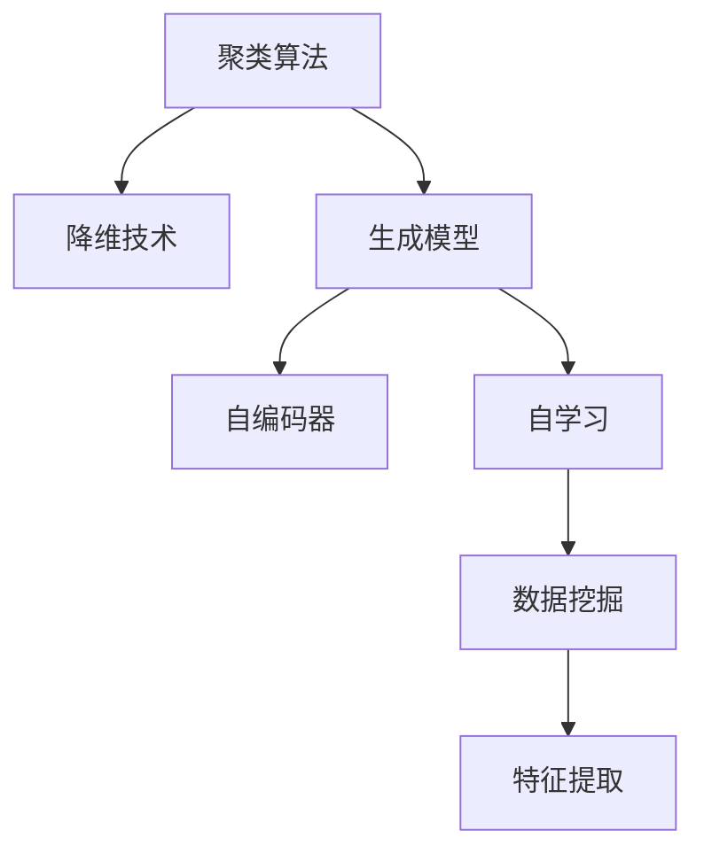

                 

# 无监督学习(Unsupervised Learning) - 原理与代码实例讲解

> 关键词：无监督学习,聚类算法,降维技术,自编码器,生成模型,自学习,数据挖掘,特征提取,实例分析

## 1. 背景介绍

### 1.1 问题由来

随着大数据时代的到来，人工智能与机器学习技术迅速发展。面对海量且未标注的数据，如何从中挖掘有价值的信息，成为当前数据科学家的主要挑战。传统的监督学习算法要求有大量标注数据，这在很多情况下难以获取。

无监督学习(Unsupervised Learning)成为了一个重要的研究方向，它能够从没有标注的数据中自动发现数据的内在结构和特征，从而为后续的任务提供支持。无监督学习不仅能够揭示数据的内在结构，还能发现潜在的数据模式，应用于数据降维、聚类分析、异常检测等多个领域。

### 1.2 问题核心关键点

无监督学习的核心目标是发现数据的内在结构和特征，而不需要依赖任何标注数据。常用的无监督学习方法包括聚类算法、降维技术、生成模型等。无监督学习在实际应用中已取得重要成果，如图像识别、文本挖掘、信号处理等领域。

## 2. 核心概念与联系

### 2.1 核心概念概述

为更好地理解无监督学习的原理和应用，本节将介绍几个关键的无监督学习概念：

- **聚类算法(Clustering Algorithm)**：无监督学习中最常见的方法之一，旨在将数据集划分为多个相似的子集。聚类算法能够自动发现数据中的自然分组，广泛应用于市场细分、图像分割、社交网络分析等领域。

- **降维技术(Dimensionality Reduction)**：通过将高维数据映射到低维空间中，保留数据的本质特征，降低计算复杂度，提高数据处理效率。常用的降维技术包括主成分分析(PCA)、线性判别分析(LDA)等。

- **生成模型(Generative Model)**：通过学习数据的生成机制，生成新的数据样本，常用于数据生成、特征学习、异常检测等任务。经典的生成模型包括高斯混合模型(GMM)、变分自编码器(VAE)等。

- **自编码器(Autoencoder)**：一种神经网络结构，用于通过学习数据的压缩表示，实现数据的降维和重构。自编码器能够学习数据的压缩表示，并在噪声中重构数据，广泛应用于数据压缩、特征提取等场景。

- **自学习(Self-Learning)**：无需外界干预，通过学习自身状态和数据特征，自动优化模型性能。自学习算法能够自动发现和优化模型参数，提升模型效果。

- **数据挖掘(Data Mining)**：从大量数据中提取有用信息，并进行分析的过程。数据挖掘常用于商业智能、金融风险分析、医疗数据分析等应用中。

- **特征提取(Feature Extraction)**：从原始数据中提取有意义的特征，用于后续的分类、聚类、回归等任务。特征提取是数据预处理的重要步骤。

这些核心概念之间的逻辑关系可以通过以下Mermaid流程图来展示：



这个流程图展示了无监督学习的核心概念及其之间的关系：

1. 聚类算法是无监督学习中最常见的方法。
2. 降维技术用于将高维数据映射到低维空间中，便于分析和处理。
3. 生成模型通过学习数据的生成机制，生成新的数据样本。
4. 自编码器用于数据的压缩表示和重构。
5. 自学习算法能够自动优化模型性能。
6. 数据挖掘是从大量数据中提取有用信息的过程。
7. 特征提取是从原始数据中提取有意义的特征。

这些概念共同构成了无监督学习的学习框架，为其在实际应用中提供了广阔的应用前景。

## 3. 核心算法原理 & 具体操作步骤
### 3.1 算法原理概述

无监督学习的核心思想是从数据中发现内在结构和特征，而不需要依赖任何标注数据。常用的无监督学习方法包括聚类算法、降维技术、生成模型等。

聚类算法的核心是寻找数据集中的自然分组，使得同一组内的数据相似度尽可能高，不同组之间的数据相似度尽可能低。常用的聚类算法包括K-means、层次聚类、DBSCAN等。

降维技术的核心是将高维数据映射到低维空间中，降低计算复杂度，同时保留数据的本质特征。常用的降维技术包括主成分分析(PCA)、线性判别分析(LDA)、t-SNE等。

生成模型的核心是通过学习数据的生成机制，生成新的数据样本。常用的生成模型包括高斯混合模型(GMM)、变分自编码器(VAE)、生成对抗网络(GAN)等。

自编码器的核心是通过学习数据的压缩表示，实现数据的降维和重构。自编码器由编码器和解码器两部分组成，能够自动学习数据的压缩表示，并在噪声中重构数据。

自学习算法的核心是无需外界干预，通过学习自身状态和数据特征，自动优化模型性能。自学习算法能够自动发现和优化模型参数，提升模型效果。

数据挖掘的核心是从大量数据中提取有用信息，并进行分析的过程。常用的数据挖掘技术包括分类、聚类、关联规则学习、异常检测等。

特征提取的核心是从原始数据中提取有意义的特征，用于后续的分类、聚类、回归等任务。特征提取是数据预处理的重要步骤。

### 3.2 算法步骤详解

无监督学习的具体步骤如下：

**Step 1: 数据预处理**
- 清洗数据：去除噪声、缺失值和异常值。
- 标准化数据：对数据进行归一化或标准化处理，使得不同特征在同一尺度上。

**Step 2: 特征提取**
- 选择特征：根据任务需求选择合适的特征。
- 提取特征：使用统计、变换、降维等方法提取特征。

**Step 3: 模型选择**
- 选择合适的无监督学习算法，如聚类、降维、生成模型等。
- 设计算法参数，如聚类中心的数量、降维的维度等。

**Step 4: 模型训练**
- 使用无监督学习算法训练模型。
- 通过迭代训练，优化模型参数。

**Step 5: 结果评估**
- 对模型结果进行评估，如聚类准确度、降维效果、生成样本的拟合度等。
- 根据评估结果调整模型参数。

**Step 6: 模型应用**
- 将训练好的模型应用于实际问题，如聚类分析、数据降维、生成数据等。

### 3.3 算法优缺点

无监督学习的优点包括：
- 无需标注数据：无监督学习不需要标注数据，适用于数据标注困难的情况。
- 发现数据内在结构：无监督学习能够自动发现数据的内在结构和特征，提供有价值的信息。
- 模型可解释性强：无监督学习模型易于解释，便于理解和应用。

无监督学习的缺点包括：
- 模型评估困难：无监督学习模型缺乏监督数据，难以评估模型效果。
- 结果不稳定：无监督学习结果受到算法和参数选择的影响较大，可能出现不稳定的情况。
- 数据分布假设：无监督学习算法通常假设数据分布符合某些特定的统计模型，可能不适用于实际数据。

### 3.4 算法应用领域

无监督学习在许多领域中都有广泛的应用，包括：

- 数据分析：从大量数据中发现数据的内在结构和特征，为后续的数据分析和决策提供支持。
- 图像处理：通过聚类和降维技术，发现图像中的特征，用于图像分类、图像检索等任务。
- 信号处理：从信号数据中提取特征，用于信号分类、信号滤波等任务。
- 自然语言处理：从文本数据中提取特征，用于文本分类、文本聚类、主题模型等任务。
- 生物信息学：从基因数据中发现基因之间的关联和特征，用于基因分类、基因表达分析等任务。
- 金融风险分析：从金融数据中发现市场模式和风险信号，用于金融风险管理。

无监督学习的应用领域非常广泛，其发现数据内在结构和特征的能力，使其在许多领域中都能发挥重要作用。

## 4. 数学模型和公式 & 详细讲解 & 举例说明

### 4.1 数学模型构建

本节将使用数学语言对无监督学习的核心算法进行更加严格的刻画。

假设无监督学习任务的数据集为 $D=\{(x_1, y_1), (x_2, y_2), ..., (x_n, y_n)\}$，其中 $x_i \in \mathbb{R}^d$ 为输入数据，$y_i \in \mathbb{R}$ 为输出标签。

定义聚类算法的目标函数为：

$$
\mathcal{L}(\theta) = \sum_{i=1}^n f(x_i, y_i; \theta)
$$

其中 $f(x_i, y_i; \theta)$ 为聚类算法损失函数，用于衡量数据与聚类中心之间的距离。

定义降维技术的目标函数为：

$$
\mathcal{L}(\theta) = \sum_{i=1}^n \|x_i - \phi(y_i; \theta)\|^2
$$

其中 $\phi(y_i; \theta)$ 为降维映射函数，用于将高维数据映射到低维空间中。

定义生成模型的目标函数为：

$$
\mathcal{L}(\theta) = \frac{1}{N}\sum_{i=1}^N -\log p(x_i; \theta)
$$

其中 $p(x_i; \theta)$ 为生成模型的概率密度函数，用于衡量数据生成模型对数据的拟合度。

定义自编码器的目标函数为：

$$
\mathcal{L}(\theta) = \frac{1}{N}\sum_{i=1}^N \|x_i - \phi(\psi(x_i); \theta)\|^2
$$

其中 $\psi(x_i)$ 和 $\phi(x_i)$ 分别为编码器和解码器，用于将数据压缩表示和重构。

定义自学习算法的目标函数为：

$$
\mathcal{L}(\theta) = \frac{1}{N}\sum_{i=1}^N -\log p(x_i; \theta)
$$

其中 $p(x_i; \theta)$ 为自学习算法的概率密度函数，用于衡量模型对数据的拟合度。

定义数据挖掘的目标函数为：

$$
\mathcal{L}(\theta) = \sum_{i=1}^N \ell(y_i, \hat{y}_i; \theta)
$$

其中 $\ell(y_i, \hat{y}_i; \theta)$ 为数据挖掘损失函数，用于衡量模型预测输出与真实标签之间的差异。

定义特征提取的目标函数为：

$$
\mathcal{L}(\theta) = \frac{1}{N}\sum_{i=1}^N \|x_i - \phi(x_i; \theta)\|^2
$$

其中 $\phi(x_i; \theta)$ 为特征提取函数，用于提取数据的有意义特征。

### 4.2 公式推导过程

以下我们以K-means聚类算法为例，推导其损失函数和梯度计算公式。

假设数据集 $D=\{x_1, x_2, ..., x_n\}$，其中 $x_i \in \mathbb{R}^d$。

K-means算法通过将数据分为 $K$ 个聚类，使得每个聚类内的数据尽可能相似。聚类中心的参数为 $\mu_1, \mu_2, ..., \mu_K \in \mathbb{R}^d$，初始化聚类中心后，使用EM算法迭代优化，最小化以下损失函数：

$$
\mathcal{L}(\mu) = \sum_{i=1}^N \min_{k=1,...,K} \|x_i - \mu_k\|^2
$$

其中 $\min$ 表示选择距离最近的聚类中心。

根据EM算法，每次迭代更新聚类中心和聚类分配的概率，步骤如下：

- 期望步骤：计算每个数据点属于每个聚类的概率 $p_k(x_i)$：

$$
p_k(x_i) = \frac{\exp(-\|x_i - \mu_k\|^2 / \sigma^2)}{\sum_{k=1}^K \exp(-\|x_i - \mu_k\|^2 / \sigma^2)}
$$

- 最大化步骤：更新聚类中心 $\mu_k$：

$$
\mu_k = \frac{\sum_{i=1}^N p_k(x_i) x_i}{\sum_{i=1}^N p_k(x_i)}
$$

### 4.3 案例分析与讲解

假设有一个公司需要从大量客户数据中发现不同的客户群体，以便制定更有效的市场策略。使用K-means算法进行聚类分析：

- 第一步，将原始客户数据进行标准化处理，使得不同特征在同一尺度上。
- 第二步，选择K值，即聚类中心的数量，通常通过肘部法则或轮廓系数确定。
- 第三步，初始化聚类中心，可以使用随机选择或K-means++算法。
- 第四步，使用EM算法迭代优化，更新聚类中心和聚类分配的概率。
- 第五步，对聚类结果进行评估，如聚类准确度、轮廓系数等。
- 第六步，将聚类结果应用于实际问题，如市场细分、客户分组等。

## 5. 项目实践：代码实例和详细解释说明
### 5.1 开发环境搭建

在进行无监督学习实践前，我们需要准备好开发环境。以下是使用Python进行Scikit-learn开发的环境配置流程：

1. 安装Anaconda：从官网下载并安装Anaconda，用于创建独立的Python环境。

2. 创建并激活虚拟环境：
```bash
conda create -n sklearn-env python=3.8 
conda activate sklearn-env
```

3. 安装Scikit-learn：
```bash
conda install scikit-learn
```

4. 安装NumPy、Pandas等工具包：
```bash
pip install numpy pandas matplotlib
```

完成上述步骤后，即可在`sklearn-env`环境中开始无监督学习实践。

### 5.2 源代码详细实现

下面我们以K-means聚类算法为例，给出使用Scikit-learn库对数据进行聚类分析的Python代码实现。

```python
from sklearn.cluster import KMeans
import numpy as np
import matplotlib.pyplot as plt

# 生成随机数据
np.random.seed(42)
X = np.random.randn(1000, 2)

# 创建KMeans模型
kmeans = KMeans(n_clusters=3, random_state=42)

# 训练模型
kmeans.fit(X)

# 绘制聚类结果
plt.scatter(X[:, 0], X[:, 1], c=kmeans.labels_)
plt.show()
```

这段代码展示了如何使用Scikit-learn库进行K-means聚类分析。代码解释如下：

- 首先生成1000个二维随机数据点。
- 创建KMeans模型，设置聚类数量为3。
- 使用`fit`方法训练模型。
- 使用`labels_`属性获取每个数据点的聚类标签。
- 最后使用Matplotlib绘制聚类结果。

### 5.3 代码解读与分析

让我们再详细解读一下关键代码的实现细节：

**生成随机数据**：
- 使用`numpy.random.randn`生成1000个二维随机数据点，每个数据点的值都在[-2, 2]范围内。

**创建KMeans模型**：
- 创建KMeans模型，设置聚类数量为3，使用`random_state`参数确保可重复性。

**训练模型**：
- 使用`fit`方法训练模型，模型会自动选择最优的聚类中心。

**绘制聚类结果**：
- 使用Matplotlib库绘制聚类结果，使用`scatter`方法将数据点按照聚类标签着色，不同颜色的点表示属于不同的聚类。

通过上述代码，我们可以看到使用Scikit-learn库进行K-means聚类分析的简单高效。代码中的关键步骤包括数据生成、模型创建、模型训练和结果可视化。

当然，工业级的系统实现还需考虑更多因素，如超参数的自动搜索、聚类结果的解释性、聚类中心的可视化等。但核心的无监督学习原理基本与此类似。

## 6. 实际应用场景
### 6.1 客户细分

无监督学习在客户细分领域有广泛应用。通过聚类算法，可以发现不同客户群体的特征，为公司制定更有针对性的营销策略提供支持。

在实践过程中，可以使用客户数据（如年龄、性别、消费行为等）进行聚类分析，将客户分为不同的群体，然后针对不同群体进行定制化的营销活动。例如，对高消费群体进行高端产品推荐，对年轻群体进行时尚产品推广等。

### 6.2 异常检测

无监督学习在异常检测领域也有重要应用。通过聚类算法，可以发现数据中的异常点，用于风险控制、欺诈检测等场景。

在金融领域，可以使用无监督学习算法对客户交易数据进行聚类分析，发现异常交易行为，及时进行风险预警。例如，当某个客户的交易行为突然发生显著变化时，系统可以自动进行异常检测并触发警报，防止金融欺诈行为的发生。

### 6.3 图像处理

无监督学习在图像处理领域有广泛应用。通过降维技术和聚类算法，可以发现图像中的特征，用于图像分类、图像检索等任务。

在实践过程中，可以使用无监督学习算法对大量图像数据进行降维，然后使用聚类算法对降维后的特征进行聚类分析，发现不同图像的特征。例如，对同一类别的图片进行聚类分析，发现不同角度、不同光照条件下的图片，然后进行图像检索和分类。

### 6.4 生物信息学

无监督学习在生物信息学领域也有重要应用。通过降维技术和聚类算法，可以发现基因之间的关联和特征，用于基因分类、基因表达分析等任务。

在实践过程中，可以使用无监督学习算法对基因数据进行降维，然后使用聚类算法对降维后的特征进行聚类分析，发现不同基因的关联和特征。例如，对基因表达数据进行聚类分析，发现不同基因在不同组织中的表达差异，然后进行基因分类和基因表达分析。

### 6.5 自然语言处理

无监督学习在自然语言处理领域有广泛应用。通过降维技术和聚类算法，可以发现文本数据中的特征，用于文本分类、文本聚类、主题模型等任务。

在实践过程中，可以使用无监督学习算法对大量文本数据进行降维，然后使用聚类算法对降维后的特征进行聚类分析，发现不同文本的特征。例如，对新闻文本进行聚类分析，发现不同类型的新闻，然后进行新闻分类和主题模型分析。

## 7. 工具和资源推荐
### 7.1 学习资源推荐

为了帮助开发者系统掌握无监督学习的理论基础和实践技巧，这里推荐一些优质的学习资源：

1. 《机器学习》（周志华著）：经典机器学习教材，涵盖了各种机器学习算法和应用。

2. 《深度学习》（Ian Goodfellow等著）：深度学习领域的经典教材，涵盖各种深度学习算法和应用。

3. 《Python数据科学手册》（Jake VanderPlas著）：全面介绍Python数据科学库的使用，包括NumPy、Pandas、Matplotlib等。

4. 《统计学习方法》（李航著）：全面介绍统计学习算法，涵盖各种监督学习、无监督学习算法。

5. 《机器学习实战》（Peter Harrington著）：实用机器学习项目实践指南，涵盖各种机器学习算法的实际应用。

通过对这些资源的学习实践，相信你一定能够快速掌握无监督学习的精髓，并用于解决实际的机器学习问题。

### 7.2 开发工具推荐

高效的开发离不开优秀的工具支持。以下是几款用于无监督学习开发的常用工具：

1. Scikit-learn：Python中的机器学习库，支持各种无监督学习算法，包括聚类、降维、生成模型等。

2. TensorFlow：Google开发的深度学习框架，支持各种无监督学习算法，包括自编码器、生成对抗网络等。

3. PyTorch：Facebook开发的深度学习框架，支持各种无监督学习算法，包括变分自编码器、自学习算法等。

4. K-means++：一种高效的聚类中心初始化算法，可以快速初始化K-means聚类中心。

5. PCA：主成分分析算法，用于数据降维。

6. t-SNE：t分布随机邻域嵌入算法，用于数据可视化。

合理利用这些工具，可以显著提升无监督学习的开发效率，加快创新迭代的步伐。

### 7.3 相关论文推荐

无监督学习在机器学习领域的发展经历了多个阶段，以下是几篇奠基性的相关论文，推荐阅读：

1. K-means: The theory and the algorithm：K-means算法的经典论文，详细介绍了K-means算法的理论基础和实现细节。

2. principal component analysis（PCA）：主成分分析算法的经典论文，详细介绍了PCA算法的理论基础和实现细节。

3. variational autoencoder（VAE）：变分自编码器的经典论文，详细介绍了VAE算法的理论基础和实现细节。

4. autoencoder for data representation：自编码器的经典论文，详细介绍了自编码器的理论基础和实现细节。

5. self-organizing map（SOM）：自组织映射算法的经典论文，详细介绍了SOM算法的理论基础和实现细节。

这些论文代表了大无监督学习的发展脉络。通过学习这些前沿成果，可以帮助研究者把握学科前进方向，激发更多的创新灵感。

## 8. 总结：未来发展趋势与挑战

### 8.1 总结

本文对无监督学习的核心算法进行了全面系统的介绍。首先阐述了无监督学习的背景和意义，明确了聚类算法、降维技术、生成模型等核心概念在无监督学习中的应用。其次，从原理到实践，详细讲解了无监督学习算法的基本原理和操作步骤，给出了无监督学习任务开发的完整代码实例。同时，本文还广泛探讨了无监督学习在客户细分、异常检测、图像处理、生物信息学、自然语言处理等多个领域的应用前景，展示了无监督学习范式的巨大潜力。此外，本文精选了无监督学习的各类学习资源，力求为读者提供全方位的技术指引。

通过本文的系统梳理，可以看到，无监督学习在数据挖掘、模式识别、异常检测等领域具有重要的应用价值，能够从数据中自动发现内在结构和特征，为后续的任务提供支持。无监督学习技术的发展，极大地推动了机器学习领域的研究和应用，为人工智能技术的发展奠定了坚实的基础。

### 8.2 未来发展趋势

展望未来，无监督学习技术将呈现以下几个发展趋势：

1. 深度学习与无监督学习的融合：深度学习与无监督学习的结合将进一步提升无监督学习的效果。通过深度学习模型进行数据生成和特征提取，可以更高效地发现数据的内在结构和特征。

2. 无监督学习与有监督学习的结合：无监督学习与有监督学习的结合将进一步提升学习模型的泛化能力。通过将无监督学习结果作为有监督学习任务的输入，可以提升模型的训练效果。

3. 多模态无监督学习：多模态无监督学习将进一步提升数据挖掘的效果。通过结合图像、声音、文本等多种数据类型，可以更全面地发现数据的内在结构和特征。

4. 自适应无监督学习：自适应无监督学习将进一步提升模型的适应能力。通过动态调整模型参数，可以根据数据特点自动优化学习过程。

5. 大规模无监督学习：大规模无监督学习将进一步提升数据挖掘的效果。通过在大规模数据集上进行无监督学习，可以更全面地发现数据的内在结构和特征。

这些趋势展示了无监督学习技术的广阔前景，预示着其在数据挖掘、模式识别、异常检测等领域将发挥更大的作用。

### 8.3 面临的挑战

尽管无监督学习技术已经取得了重要成果，但在实际应用中仍面临诸多挑战：

1. 模型评估困难：无监督学习模型缺乏监督数据，难以评估模型效果。

2. 结果不稳定：无监督学习结果受到算法和参数选择的影响较大，可能出现不稳定的情况。

3. 数据分布假设：无监督学习算法通常假设数据分布符合某些特定的统计模型，可能不适用于实际数据。

4. 数据隐私问题：无监督学习需要对大量数据进行分析和处理，可能涉及数据隐私问题。

5. 计算资源需求：无监督学习算法通常需要较大的计算资源，可能面临计算资源不足的问题。

6. 模型可解释性：无监督学习模型缺乏可解释性，难以理解和解释模型输出。

这些挑战需要研究者不断探索和改进，才能进一步推动无监督学习技术的发展和应用。

### 8.4 研究展望

未来的研究需要在以下几个方面寻求新的突破：

1. 改进模型评估方法：探索无监督学习模型的评估方法，提升模型效果和鲁棒性。

2. 提升模型稳定性：优化无监督学习算法，减少结果的不稳定性，提升模型的鲁棒性。

3. 适应不同数据分布：研究无监督学习算法对不同数据分布的适应能力，提升算法的通用性。

4. 解决数据隐私问题：研究数据隐私保护技术，保护用户隐私。

5. 优化计算资源使用：优化无监督学习算法的计算资源使用，提升算法的可扩展性。

6. 增强模型可解释性：研究无监督学习模型的可解释性，提升模型的透明度和可信度。

这些研究方向的探索，必将引领无监督学习技术迈向更高的台阶，为数据挖掘、模式识别、异常检测等领域提供更强大的工具和方法。

## 9. 附录：常见问题与解答

**Q1：无监督学习适用于所有数据集吗？**

A: 无监督学习适用于数据标注困难或数据分布未知的情况，但对于数据标注充分、数据分布明确的任务，无监督学习的效果可能不如有监督学习。因此，需要根据具体情况选择合适的学习范式。

**Q2：如何选择聚类中心的数量？**

A: 聚类中心的数量是聚类算法的重要参数，通常通过肘部法则、轮廓系数等方法确定。具体方法包括：

1. 肘部法则：绘制聚类数目与聚类误差平方和的关系图，选择使误差平方和最小化的聚类数目。

2. 轮廓系数：计算每个数据点的轮廓系数，选择轮廓系数最大的聚类数目。

**Q3：无监督学习与监督学习的区别是什么？**

A: 无监督学习与监督学习的主要区别在于训练数据是否有标签。无监督学习使用未标注的数据，通过学习数据的内在结构和特征，发现数据的内在模式。而有监督学习使用标注数据，通过学习数据与标签之间的关系，进行分类、回归等任务。

**Q4：无监督学习算法如何选择超参数？**

A: 无监督学习算法的超参数通常包括聚类中心的数量、降维维度等。可以通过交叉验证、网格搜索等方法选择最优超参数。例如，使用K-means算法时，可以通过肘部法则或轮廓系数选择聚类中心的数量。

**Q5：无监督学习与深度学习结合的难点是什么？**

A: 无监督学习与深度学习的结合主要难点在于如何将无监督学习结果应用于深度学习模型。常用的方法包括：

1. 数据生成：使用无监督学习算法生成新的数据样本，用于深度学习模型的预训练。

2. 特征提取：使用无监督学习算法提取数据特征，用于深度学习模型的输入。

3. 自学习：使用无监督学习算法训练深度学习模型，提升模型的泛化能力和鲁棒性。

通过以上方法，可以有效地将无监督学习与深度学习结合，提升模型的性能和效果。

这些研究方向的探索，必将引领无监督学习技术迈向更高的台阶，为数据挖掘、模式识别、异常检测等领域提供更强大的工具和方法。

---

作者：禅与计算机程序设计艺术 / Zen and the Art of Computer Programming

