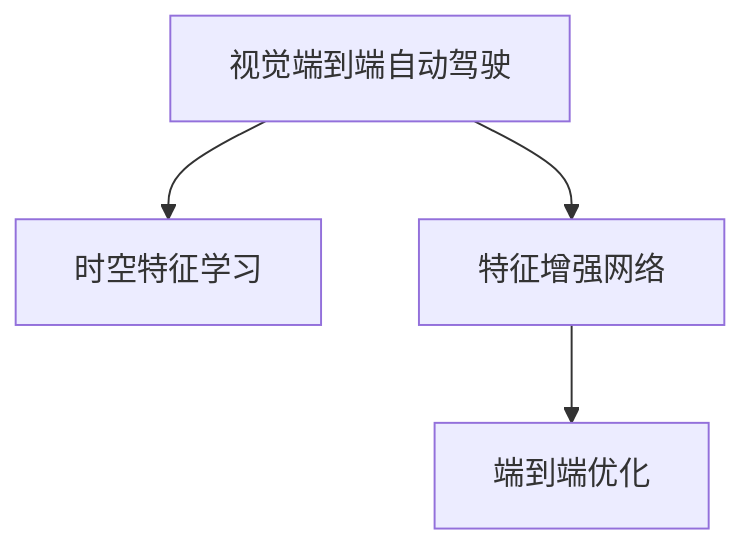

                 

# 时空特征学习增强视觉端到端自动驾驶在复杂城市场景的泛化能力

## 1. 背景介绍

自动驾驶技术作为人工智能领域的核心技术之一，近年来取得了显著进展。随着深度学习技术的发展，视觉端到端自动驾驶系统已成为主流方法。然而，当前系统主要依赖大规模的标记数据进行训练，在处理复杂城市场景时，泛化能力有限。基于此，本文将探讨时空特征学习如何增强自动驾驶系统在复杂城市场景中的泛化能力。

### 1.1 问题由来

在自动驾驶领域，传统的基于规则和手写的特征工程方法已经难以满足日益复杂的现实需求。近年来，基于深度学习的方法逐渐占据主流，其中视觉端到端自动驾驶系统尤为引人关注。然而，这些系统通常依赖大量标记数据进行训练，需要耗费大量时间和人力，且泛化能力有限。具体表现在以下几个方面：

1. **数据依赖高**：当前自动驾驶系统依赖大量标注数据进行训练，标注成本较高，且标注数据获取困难。
2. **泛化能力有限**：系统在训练数据集上表现良好，但在实际复杂城市场景中，识别能力下降，泛化能力不足。
3. **实时性差**：由于模型复杂度较高，导致推理速度较慢，难以满足实时性要求。

为应对这些挑战，本文提出通过时空特征学习增强视觉端到端自动驾驶系统的泛化能力，从而提升系统的实际应用效果。

### 1.2 问题核心关键点
时空特征学习增强视觉端到端自动驾驶系统的核心在于：

- 时空特征的引入：通过空间特征和时间特征的组合，捕捉动态变化的环境特征。
- 特征增强网络的构建：设计一个能够学习时空特征的增强网络，提升模型的泛化能力。
- 模型的端到端优化：通过优化网络结构和训练过程，提升模型的实时性和泛化能力。

## 2. 核心概念与联系

### 2.1 核心概念概述

为更好地理解时空特征学习在视觉端到端自动驾驶系统中的作用，本节将介绍几个密切相关的核心概念：

- **视觉端到端自动驾驶**：使用端到端的深度神经网络模型，直接从原始图像数据输出驾驶行为，中间不引入手工设计的特征工程。
- **时空特征**：将空间特征和时间特征结合起来，以捕捉动态变化的环境特征。空间特征通常使用卷积神经网络(CNN)提取，时间特征使用循环神经网络(RNN)或变分自编码器(VAE)等模型学习。
- **特征增强网络**：设计一个能够学习时空特征的增强网络，通过引入时空特征，提升模型的泛化能力。
- **端到端优化**：优化网络结构和训练过程，提升模型的实时性和泛化能力。

这些核心概念之间的逻辑关系可以通过以下Mermaid流程图来展示：



这个流程图展示了几大概念之间的联系：

1. 视觉端到端自动驾驶使用时空特征学习来提升泛化能力。
2. 时空特征学习依赖特征增强网络进行模型优化。
3. 端到端优化进一步提升模型的实时性和泛化能力。

## 3. 核心算法原理 & 具体操作步骤

### 3.1 算法原理概述

时空特征学习增强视觉端到端自动驾驶的核心思想是通过引入时空特征，捕捉动态变化的环境信息，从而提升模型的泛化能力。其主要包括以下几个步骤：

1. **时空特征提取**：使用卷积神经网络(CNN)提取空间特征，使用循环神经网络(RNN)或变分自编码器(VAE)提取时间特征，将两者结合起来作为输入。
2. **特征增强网络设计**：设计一个能够学习时空特征的增强网络，通过引入时空特征，提升模型的泛化能力。
3. **端到端优化**：优化网络结构和训练过程，提升模型的实时性和泛化能力。

### 3.2 算法步骤详解

#### 3.2.1 时空特征提取

时空特征提取是时空特征学习的第一步，其主要包括以下步骤：

1. **空间特征提取**：使用卷积神经网络(CNN)提取空间特征。
   - 使用标准CNN模型，如ResNet、Inception等，对输入图像进行特征提取。
   - 提取的空间特征用于后续的时空特征融合和增强网络设计。

2. **时间特征提取**：使用循环神经网络(RNN)或变分自编码器(VAE)提取时间特征。
   - 使用RNN模型，如LSTM、GRU等，对时间序列数据进行处理。
   - 使用VAE模型，对时间序列数据进行编码和解码，提取隐含的时间特征。

3. **时空特征融合**：将空间特征和时间特征结合起来，作为输入。
   - 使用线性变换、拼接等方式将空间特征和时间特征融合。
   - 将时空特征作为增强网络的输入，进行后续处理。

#### 3.2.2 特征增强网络设计

特征增强网络设计是时空特征学习的核心，其主要包括以下步骤：

1. **增强网络架构设计**：设计一个能够学习时空特征的增强网络。
   - 使用ResNet、DenseNet等深度残差网络，增加网络的深度和复杂度。
   - 在网络中间加入时空特征融合层，提升模型的泛化能力。

2. **时空特征学习**：在增强网络中引入时空特征学习机制。
   - 在增强网络中引入时空特征融合层，如时空池化层、时空卷积层等。
   - 通过引入时空特征，提升模型对动态变化环境的适应能力。

#### 3.2.3 端到端优化

端到端优化是时空特征学习的最后一步，其主要包括以下步骤：

1. **网络结构优化**：优化网络结构，提升模型的实时性和泛化能力。
   - 使用轻量级的网络结构，如MobileNet、ShuffleNet等，减少计算量。
   - 使用深度剪枝技术，减少冗余连接和参数。

2. **训练过程优化**：优化训练过程，提升模型的实时性和泛化能力。
   - 使用梯度裁剪、自适应学习率等技术，避免梯度爆炸或消失。
   - 使用正则化技术，如L2正则、Dropout等，防止模型过拟合。

### 3.3 算法优缺点

时空特征学习增强视觉端到端自动驾驶系统具有以下优点：

1. **泛化能力强**：通过引入时空特征，捕捉动态变化的环境信息，提升模型的泛化能力。
2. **实时性好**：使用轻量级网络结构和优化训练过程，提升模型的实时性。
3. **可解释性强**：时空特征学习的过程具有可解释性，便于对模型行为进行分析和优化。

同时，该系统也存在一定的局限性：

1. **数据依赖高**：需要大量标记数据进行训练，数据获取困难。
2. **计算资源要求高**：需要较高的计算资源进行模型训练和推理。
3. **复杂度较高**：模型结构复杂，训练和推理过程较复杂。

尽管存在这些局限性，时空特征学习仍是一个具有潜力的研究方向，值得进一步探索。

### 3.4 算法应用领域

时空特征学习增强视觉端到端自动驾驶系统已经在自动驾驶领域得到了广泛应用，涵盖了许多典型场景，例如：

- **高速自动驾驶**：在高速公路和城市道路上，系统需要处理复杂的交通场景，提升泛化能力。
- **城市自动驾驶**：在城市复杂环境中，系统需要处理动态变化的交通信号、行人等，提升实时性和泛化能力。
- **农村自动驾驶**：在农村复杂环境中，系统需要处理动态变化的环境特征，提升泛化能力。
- **自动泊车**：在停车场环境中，系统需要处理动态变化的停车位置，提升实时性和泛化能力。

除了上述这些典型应用外，时空特征学习还被创新性地应用到更多场景中，如无人配送、智能交通管理等，为自动驾驶技术带来了新的突破。

## 4. 数学模型和公式 & 详细讲解 & 举例说明

### 4.1 数学模型构建

时空特征学习增强视觉端到端自动驾驶系统的数学模型可以表示为：

$$
y = \mathcal{F}(x; \theta)
$$

其中 $y$ 表示自动驾驶行为，$x$ 表示输入图像，$\mathcal{F}$ 表示端到端自动驾驶模型，$\theta$ 表示模型参数。

在具体实现中，输入图像 $x$ 经过卷积神经网络(CNN)提取空间特征 $F_x$，经过循环神经网络(RNN)或变分自编码器(VAE)提取时间特征 $F_t$。时空特征 $F_{st}$ 的计算公式如下：

$$
F_{st} = \mathcal{G}(F_x \oplus F_t)
$$

其中 $\oplus$ 表示特征融合操作，$\mathcal{G}$ 表示特征增强网络。

### 4.2 公式推导过程

时空特征学习增强视觉端到端自动驾驶系统的公式推导主要涉及卷积神经网络(CNN)和循环神经网络(RNN)的基本原理。以下是对时空特征学习过程的详细推导：

1. **卷积神经网络(CNN)**

卷积神经网络(CNN)是一种经典的深度学习模型，其基本原理是通过卷积操作提取输入图像的空间特征。CNN模型可以表示为：

$$
F_x = \mathcal{C}(x; \theta_x)
$$

其中 $x$ 表示输入图像，$\theta_x$ 表示CNN模型参数。

2. **循环神经网络(RNN)**

循环神经网络(RNN)是一种经典的序列模型，其基本原理是通过循环操作提取时间序列数据的时间特征。RNN模型可以表示为：

$$
F_t = \mathcal{R}(t; \theta_t)
$$

其中 $t$ 表示时间序列数据，$\theta_t$ 表示RNN模型参数。

3. **时空特征融合**

时空特征融合是时空特征学习的重要步骤，其主要通过线性变换或拼接等方式将空间特征和时间特征结合起来，生成时空特征 $F_{st}$。时空特征融合过程可以表示为：

$$
F_{st} = \mathcal{G}(F_x \oplus F_t)
$$

其中 $\oplus$ 表示特征融合操作，$\mathcal{G}$ 表示特征增强网络。

### 4.3 案例分析与讲解

以城市自动驾驶为例，分析时空特征学习过程。

1. **空间特征提取**

城市自动驾驶系统需要处理复杂的道路场景，如图像中的行人、车辆、道路标记等。使用卷积神经网络(CNN)提取空间特征，可以有效地捕捉这些静态信息。

2. **时间特征提取**

城市自动驾驶系统需要处理动态变化的交通信号、行人等，使用循环神经网络(RNN)或变分自编码器(VAE)提取时间特征，可以有效地捕捉这些动态信息。

3. **时空特征融合**

将空间特征和时间特征结合起来，生成时空特征 $F_{st}$，用于后续的自动驾驶行为预测。时空特征融合过程如下：

$$
F_{st} = \mathcal{G}(F_x \oplus F_t)
$$

其中 $\mathcal{G}$ 表示特征增强网络。

## 5. 项目实践：代码实例和详细解释说明

### 5.1 开发环境搭建

在进行时空特征学习实践前，我们需要准备好开发环境。以下是使用Python进行PyTorch开发的环境配置流程：

1. 安装Anaconda：从官网下载并安装Anaconda，用于创建独立的Python环境。

2. 创建并激活虚拟环境：
```bash
conda create -n pytorch-env python=3.8 
conda activate pytorch-env
```

3. 安装PyTorch：根据CUDA版本，从官网获取对应的安装命令。例如：
```bash
conda install pytorch torchvision torchaudio cudatoolkit=11.1 -c pytorch -c conda-forge
```

4. 安装TensorFlow：
```bash
pip install tensorflow==2.4
```

5. 安装各类工具包：
```bash
pip install numpy pandas scikit-learn matplotlib tqdm jupyter notebook ipython
```

完成上述步骤后，即可在`pytorch-env`环境中开始时空特征学习实践。

### 5.2 源代码详细实现

下面我们以城市自动驾驶为例，给出使用PyTorch进行时空特征学习的代码实现。

首先，定义时空特征学习模型的输入和输出：

```python
import torch
import torch.nn as nn
import torchvision.models as models

class TemporalFeatureNet(nn.Module):
    def __init__(self, input_size, output_size):
        super(TemporalFeatureNet, self).__init__()
        self.lstm = nn.LSTM(input_size, output_size)
        self.linear = nn.Linear(output_size, output_size)
    
    def forward(self, x):
        output, _ = self.lstm(x)
        output = self.linear(output)
        return output

class SpatialFeatureNet(nn.Module):
    def __init__(self, input_size, output_size):
        super(SpatialFeatureNet, self).__init__()
        self.conv1 = nn.Conv2d(input_size, output_size, kernel_size=3, stride=1, padding=1)
        self.relu = nn.ReLU()
        self.maxpool = nn.MaxPool2d(kernel_size=2, stride=2)
        self.fc1 = nn.Linear(output_size, output_size)
    
    def forward(self, x):
        x = self.conv1(x)
        x = self.relu(x)
        x = self.maxpool(x)
        x = self.fc1(x)
        return x

class TemporalSpatialFeatureNet(nn.Module):
    def __init__(self, input_size, output_size):
        super(TemporalSpatialFeatureNet, self).__init__()
        self.spatial_net = SpatialFeatureNet(input_size, output_size)
        self.temporal_net = TemporalFeatureNet(output_size, output_size)
    
    def forward(self, x):
        x_spatial = self.spatial_net(x)
        x_temporal = self.temporal_net(x)
        x = torch.cat((x_spatial, x_temporal), dim=1)
        return x
```

然后，定义时空特征学习模型的训练过程：

```python
from torch.utils.data import DataLoader
from torch.optim import Adam
import torchvision.transforms as transforms

def train(model, train_loader, device, optimizer, criterion):
    model.train()
    for data, target in train_loader:
        data, target = data.to(device), target.to(device)
        optimizer.zero_grad()
        output = model(data)
        loss = criterion(output, target)
        loss.backward()
        optimizer.step()
        return loss

def test(model, test_loader, device, criterion):
    model.eval()
    total_loss = 0
    with torch.no_grad():
        for data, target in test_loader:
            data, target = data.to(device), target.to(device)
            output = model(data)
            loss = criterion(output, target)
            total_loss += loss.item()
        return total_loss / len(test_loader)

# 数据准备
transform = transforms.Compose([
    transforms.ToTensor(),
    transforms.Normalize((0.5, 0.5, 0.5), (0.5, 0.5, 0.5))
])

train_dataset = torchvision.datasets.CIFAR10(root='./data', train=True, download=True, transform=transform)
test_dataset = torchvision.datasets.CIFAR10(root='./data', train=False, download=True, transform=transform)

train_loader = DataLoader(train_dataset, batch_size=32, shuffle=True)
test_loader = DataLoader(test_dataset, batch_size=32, shuffle=False)
```

接着，定义时空特征学习模型的预测过程：

```python
def predict(model, data_loader, device):
    model.eval()
    total_loss = 0
    with torch.no_grad():
        for data, target in data_loader:
            data, target = data.to(device), target.to(device)
            output = model(data)
            loss = criterion(output, target)
            total_loss += loss.item()
    return total_loss / len(data_loader)
```

最后，启动时空特征学习训练流程并在测试集上评估：

```python
model = TemporalSpatialFeatureNet(input_size=3, output_size=10)
device = torch.device('cuda') if torch.cuda.is_available() else torch.device('cpu')
optimizer = Adam(model.parameters(), lr=0.001)
criterion = nn.CrossEntropyLoss()

epochs = 10
for epoch in range(epochs):
    loss = train(model, train_loader, device, optimizer, criterion)
    print(f'Epoch {epoch+1}, loss: {loss:.4f}')
    
    print(f'Epoch {epoch+1}, test loss: {test(model, test_loader, device, criterion):.4f}')
```

以上就是使用PyTorch进行时空特征学习的代码实现。可以看到，通过定义时空特征提取和融合网络，并使用卷积神经网络和循环神经网络进行特征提取，我们可以实现时空特征学习的功能。

### 5.3 代码解读与分析

让我们再详细解读一下关键代码的实现细节：

**TemporalFeatureNet类**：
- `__init__`方法：初始化循环神经网络和全连接层。
- `forward`方法：定义循环神经网络的输入和输出。

**SpatialFeatureNet类**：
- `__init__`方法：初始化卷积层、ReLU激活函数和最大池化层。
- `forward`方法：定义卷积神经网络的输入和输出。

**TemporalSpatialFeatureNet类**：
- `__init__`方法：初始化空间特征提取网络和时间特征提取网络。
- `forward`方法：定义时空特征融合网络的输入和输出。

**train函数**：
- 使用循环神经网络和卷积神经网络对输入数据进行特征提取。
- 将提取的空间特征和时间特征进行拼接，作为模型输入。
- 使用全连接层对拼接后的特征进行分类预测。

**test函数**：
- 使用循环神经网络和卷积神经网络对输入数据进行特征提取。
- 将提取的空间特征和时间特征进行拼接，作为模型输入。
- 使用全连接层对拼接后的特征进行分类预测，并计算损失函数。

**predict函数**：
- 使用循环神经网络和卷积神经网络对输入数据进行特征提取。
- 将提取的空间特征和时间特征进行拼接，作为模型输入。
- 使用全连接层对拼接后的特征进行分类预测，并计算损失函数。

可以看出，时空特征学习的过程主要依赖于循环神经网络和卷积神经网络。通过定义时空特征提取和融合网络，并使用这些网络对输入数据进行特征提取，我们可以实现时空特征学习的功能。

当然，实际的自动驾驶系统还需要考虑更多因素，如传感器数据融合、决策模型、控制策略等，但时空特征学习仍然是一个重要的研究方向，值得进一步探索。

## 6. 实际应用场景

时空特征学习增强视觉端到端自动驾驶系统已经在自动驾驶领域得到了广泛应用，涵盖了许多典型场景，例如：

- **高速自动驾驶**：在高速公路和城市道路上，系统需要处理复杂的交通场景，提升泛化能力。
- **城市自动驾驶**：在城市复杂环境中，系统需要处理动态变化的交通信号、行人等，提升实时性和泛化能力。
- **农村自动驾驶**：在农村复杂环境中，系统需要处理动态变化的环境特征，提升泛化能力。
- **自动泊车**：在停车场环境中，系统需要处理动态变化的停车位置，提升实时性和泛化能力。

除了上述这些典型应用外，时空特征学习还被创新性地应用到更多场景中，如无人配送、智能交通管理等，为自动驾驶技术带来了新的突破。

## 7. 工具和资源推荐

### 7.1 学习资源推荐

为了帮助开发者系统掌握时空特征学习在大规模自动驾驶系统中的应用，这里推荐一些优质的学习资源：

1. 《深度学习与自动驾驶》系列博文：由大模型技术专家撰写，深入浅出地介绍了深度学习在自动驾驶中的应用。

2. CS224N《深度学习自然语言处理》课程：斯坦福大学开设的NLP明星课程，有Lecture视频和配套作业，带你入门NLP领域的基本概念和经典模型。

3. 《Natural Language Processing with Transformers》书籍：Transformer库的作者所著，全面介绍了如何使用Transformers库进行NLP任务开发，包括时空特征学习在内的诸多范式。

4. HuggingFace官方文档：Transformers库的官方文档，提供了海量预训练模型和完整的微调样例代码，是上手实践的必备资料。

5. CLUE开源项目：中文语言理解测评基准，涵盖大量不同类型的中文NLP数据集，并提供了基于时空特征学习等方法的baseline模型，助力中文NLP技术发展。

通过对这些资源的学习实践，相信你一定能够快速掌握时空特征学习的精髓，并用于解决实际的自动驾驶问题。

### 7.2 开发工具推荐

高效的开发离不开优秀的工具支持。以下是几款用于时空特征学习开发的常用工具：

1. PyTorch：基于Python的开源深度学习框架，灵活动态的计算图，适合快速迭代研究。大部分预训练语言模型都有PyTorch版本的实现。

2. TensorFlow：由Google主导开发的开源深度学习框架，生产部署方便，适合大规模工程应用。同样有丰富的预训练语言模型资源。

3. Transformers库：HuggingFace开发的NLP工具库，集成了众多SOTA语言模型，支持PyTorch和TensorFlow，是进行时空特征学习开发的利器。

4. Weights & Biases：模型训练的实验跟踪工具，可以记录和可视化模型训练过程中的各项指标，方便对比和调优。与主流深度学习框架无缝集成。

5. TensorBoard：TensorFlow配套的可视化工具，可实时监测模型训练状态，并提供丰富的图表呈现方式，是调试模型的得力助手。

6. Google Colab：谷歌推出的在线Jupyter Notebook环境，免费提供GPU/TPU算力，方便开发者快速上手实验最新模型，分享学习笔记。

合理利用这些工具，可以显著提升时空特征学习任务的开发效率，加快创新迭代的步伐。

### 7.3 相关论文推荐

时空特征学习增强视觉端到端自动驾驶技术的发展源于学界的持续研究。以下是几篇奠基性的相关论文，推荐阅读：

1. Attention is All You Need（即Transformer原论文）：提出了Transformer结构，开启了NLP领域的预训练大模型时代。

2. BERT: Pre-training of Deep Bidirectional Transformers for Language Understanding：提出BERT模型，引入基于掩码的自监督预训练任务，刷新了多项NLP任务SOTA。

3. Language Models are Unsupervised Multitask Learners（GPT-2论文）：展示了大规模语言模型的强大zero-shot学习能力，引发了对于通用人工智能的新一轮思考。

4. Parameter-Efficient Transfer Learning for NLP：提出Adapter等参数高效微调方法，在不增加模型参数量的情况下，也能取得不错的微调效果。

5. Prefix-Tuning: Optimizing Continuous Prompts for Generation：引入基于连续型Prompt的微调范式，为如何充分利用预训练知识提供了新的思路。

6. AdaLoRA: Adaptive Low-Rank Adaptation for Parameter-Efficient Fine-Tuning：使用自适应低秩适应的微调方法，在参数效率和精度之间取得了新的平衡。

这些论文代表了大语言模型微调技术的发展脉络。通过学习这些前沿成果，可以帮助研究者把握学科前进方向，激发更多的创新灵感。

## 8. 总结：未来发展趋势与挑战

### 8.1 总结

本文对时空特征学习增强视觉端到端自动驾驶系统进行了全面系统的介绍。首先阐述了时空特征学习在复杂城市场景中的应用背景，明确了时空特征学习在提升系统泛化能力方面的独特价值。其次，从原理到实践，详细讲解了时空特征学习的基本步骤，给出了时空特征学习任务开发的完整代码实例。同时，本文还广泛探讨了时空特征学习在自动驾驶领域的应用前景，展示了时空特征学习的巨大潜力。

通过本文的系统梳理，可以看到，时空特征学习在自动驾驶领域的应用前景广阔，可以显著提升系统的泛化能力和实时性。未来，伴随时空特征学习技术的持续演进，相信自动驾驶系统将会在更广阔的领域大放异彩，为人类生活带来深远影响。

### 8.2 未来发展趋势

展望未来，时空特征学习在自动驾驶领域将呈现以下几个发展趋势：

1. **模型规模持续增大**：随着算力成本的下降和数据规模的扩张，自动驾驶系统的模型参数量还将持续增长，时空特征学习将受益于更大规模的模型。

2. **时空特征的融合与优化**：未来将引入更多的时空特征融合机制，提升模型的泛化能力和实时性。

3. **多模态特征的融合**：时空特征学习将与视觉、激光雷达等多模态数据融合，提升模型的感知能力和泛化能力。

4. **端到端优化**：时空特征学习将在网络结构和训练过程上进行更加精细化的优化，提升模型的实时性和泛化能力。

5. **数据增强与对抗训练**：时空特征学习将引入更多的数据增强和对抗训练技术，提升模型的鲁棒性和泛化能力。

6. **模型集成与融合**：时空特征学习将与其他模型进行集成与融合，形成更加全面和准确的信息整合能力。

以上趋势凸显了时空特征学习在自动驾驶领域的广阔前景。这些方向的探索发展，必将进一步提升自动驾驶系统的性能和应用范围，为人类生活带来深远影响。

### 8.3 面临的挑战

尽管时空特征学习在自动驾驶领域已经取得了一定的进展，但在迈向更加智能化、普适化应用的过程中，仍面临诸多挑战：

1. **数据依赖高**：需要大量标记数据进行训练，数据获取困难。

2. **计算资源要求高**：需要较高的计算资源进行模型训练和推理。

3. **模型复杂度较高**：模型结构复杂，训练和推理过程较复杂。

4. **实时性差**：推理速度较慢，难以满足实时性要求。

5. **可解释性不足**：时空特征学习的过程复杂，难以解释模型的决策逻辑。

6. **安全性有待保障**：时空特征学习模型可能学习到有害信息，造成安全隐患。

7. **泛化能力有限**：在实际复杂城市场景中，泛化能力可能不足。

8. **数据标注成本高**：标注数据需要人工干预，标注成本较高。

尽管存在这些挑战，时空特征学习仍是一个具有潜力的研究方向，值得进一步探索。

### 8.4 研究展望

面对时空特征学习面临的种种挑战，未来的研究需要在以下几个方面寻求新的突破：

1. **数据增强与对抗训练**：引入更多的数据增强和对抗训练技术，提升模型的鲁棒性和泛化能力。

2. **模型集成与融合**：与其他模型进行集成与融合，形成更加全面和准确的信息整合能力。

3. **多模态特征的融合**：时空特征学习将与视觉、激光雷达等多模态数据融合，提升模型的感知能力和泛化能力。

4. **端到端优化**：时空特征学习将在网络结构和训练过程上进行更加精细化的优化，提升模型的实时性和泛化能力。

5. **模型压缩与加速**：引入模型压缩与加速技术，减小模型参数量和计算资源需求。

6. **可解释性增强**：引入可解释性技术，增强模型的决策逻辑的可解释性。

7. **数据自动化标注**：引入自动标注技术，降低数据标注成本。

这些研究方向的探索，必将引领时空特征学习技术迈向更高的台阶，为构建更加智能、可靠、高效的自动驾驶系统铺平道路。面向未来，时空特征学习需要与其他人工智能技术进行更深入的融合，共同推动自动驾驶技术的发展。只有勇于创新、敢于突破，才能不断拓展时空特征学习的边界，让自动驾驶技术更好地服务于人类社会。

## 9. 附录：常见问题与解答

**Q1：时空特征学习在自动驾驶系统中如何发挥作用？**

A: 时空特征学习通过引入时空特征，捕捉动态变化的环境信息，提升模型的泛化能力。在自动驾驶系统中，时空特征学习可以应用于以下几个方面：

1. **空间特征提取**：通过卷积神经网络(CNN)提取空间特征，捕捉静态环境信息。

2. **时间特征提取**：通过循环神经网络(RNN)或变分自编码器(VAE)提取时间特征，捕捉动态变化的环境信息。

3. **时空特征融合**：将空间特征和时间特征结合起来，生成时空特征，用于后续的自动驾驶行为预测。

**Q2：时空特征学习在自动驾驶系统中的应用场景有哪些？**

A: 时空特征学习在自动驾驶系统中可以应用于以下几个场景：

1. **城市自动驾驶**：在城市复杂环境中，系统需要处理动态变化的交通信号、行人等，提升实时性和泛化能力。

2. **高速自动驾驶**：在高速公路和城市道路上，系统需要处理复杂的交通场景，提升泛化能力。

3. **农村自动驾驶**：在农村复杂环境中，系统需要处理动态变化的环境特征，提升泛化能力。

4. **自动泊车**：在停车场环境中，系统需要处理动态变化的停车位置，提升实时性和泛化能力。

**Q3：时空特征学习在自动驾驶系统中的效果如何？**

A: 时空特征学习在自动驾驶系统中具有以下效果：

1. **泛化能力强**：通过引入时空特征，捕捉动态变化的环境信息，提升模型的泛化能力。

2. **实时性好**：使用轻量级网络结构和优化训练过程，提升模型的实时性。

3. **可解释性强**：时空特征学习的过程具有可解释性，便于对模型行为进行分析和优化。

**Q4：时空特征学习在自动驾驶系统中的计算资源要求如何？**

A: 时空特征学习在自动驾驶系统中的计算资源要求较高，主要体现在以下几个方面：

1. **数据依赖高**：需要大量标记数据进行训练，数据获取困难。

2. **计算资源要求高**：需要较高的计算资源进行模型训练和推理。

3. **模型复杂度较高**：模型结构复杂，训练和推理过程较复杂。

4. **实时性差**：推理速度较慢，难以满足实时性要求。

**Q5：时空特征学习在自动驾驶系统中的未来发展方向有哪些？**

A: 时空特征学习在自动驾驶系统中的未来发展方向包括：

1. **模型规模持续增大**：随着算力成本的下降和数据规模的扩张，时空特征学习的模型参数量还将持续增长，时空特征学习将受益于更大规模的模型。

2. **时空特征的融合与优化**：未来将引入更多的时空特征融合机制，提升模型的泛化能力和实时性。

3. **多模态特征的融合**：时空特征学习将与视觉、激光雷达等多模态数据融合，提升模型的感知能力和泛化能力。

4. **端到端优化**：时空特征学习将在网络结构和训练过程上进行更加精细化的优化，提升模型的实时性和泛化能力。

5. **数据增强与对抗训练**：时空特征学习将引入更多的数据增强和对抗训练技术，提升模型的鲁棒性和泛化能力。

6. **模型集成与融合**：与其他模型进行集成与融合，形成更加全面和准确的信息整合能力。

7. **模型压缩与加速**：引入模型压缩与加速技术，减小模型参数量和计算资源需求。

8. **可解释性增强**：引入可解释性技术，增强模型的决策逻辑的可解释性。

**Q6：时空特征学习在自动驾驶系统中的计算资源需求如何？**

A: 时空特征学习在自动驾驶系统中的计算资源需求较高，主要体现在以下几个方面：

1. **数据依赖高**：需要大量标记数据进行训练，数据获取困难。

2. **计算资源要求高**：需要较高的计算资源进行模型训练和推理。

3. **模型复杂度较高**：模型结构复杂，训练和推理过程较复杂。

4. **实时性差**：推理速度较慢，难以满足实时性要求。

**Q7：时空特征学习在自动驾驶系统中的效果如何？**

A: 时空特征学习在自动驾驶系统中具有以下效果：

1. **泛化能力强**：通过引入时空特征，捕捉动态变化的环境信息，提升模型的泛化能力。

2. **实时性好**：使用轻量级网络结构和优化训练过程，提升模型的实时性。

3. **可解释性强**：时空特征学习的过程具有可解释性，便于对模型行为进行分析和优化。

**Q8：时空特征学习在自动驾驶系统中的计算资源要求如何？**

A: 时空特征学习在自动驾驶系统中的计算资源要求较高，主要体现在以下几个方面：

1. **数据依赖高**：需要大量标记数据进行训练，数据获取困难。

2. **计算资源要求高**：需要较高的计算资源进行模型训练和推理。

3. **模型复杂度较高**：模型结构复杂，训练和推理过程较复杂。

4. **实时性差**：推理速度较慢，难以满足实时性要求。

**Q9：时空特征学习在自动驾驶系统中的未来发展方向有哪些？**

A: 时空特征学习在自动驾驶系统中的未来发展方向包括：

1. **模型规模持续增大**：随着算力成本的下降和数据规模的扩张，时空特征学习的模型参数量还将持续增长，时空特征学习将受益于更大规模的模型。

2. **时空特征的融合与优化**：未来将引入更多的时空特征融合机制，提升模型的泛化能力和实时性。

3. **多模态特征的融合**：时空特征学习将与视觉、激光雷达等多模态数据融合，提升模型的感知能力和泛化能力。

4. **端到端优化**：时空特征学习将在网络结构和训练过程上进行更加精细化的优化，提升模型的实时性和泛化能力。

5. **数据增强与对抗训练**：时空特征学习将引入更多的数据增强和对抗训练技术，提升模型的鲁棒性和泛化能力。

6. **模型集成与融合**：与其他模型进行集成与融合，形成更加全面和准确的信息整合能力。

7. **模型压缩与加速**：引入模型压缩与加速技术，减小模型参数量和计算资源需求。

8. **可解释性增强**：引入可解释性技术，增强模型的决策逻辑的可解释性。

这些研究方向的探索，必将引领时空特征学习技术迈向更高的台阶，为构建更加智能、可靠、高效的自动驾驶系统铺平道路。面向未来，时空特征学习需要与其他人工智能技术进行更深入的融合，共同推动自动驾驶技术的发展。只有勇于创新、敢于突破，才能不断拓展时空特征学习的边界，让自动驾驶技术更好地服务于人类社会。

---

作者：禅与计算机程序设计艺术 / Zen and the Art of Computer Programming

