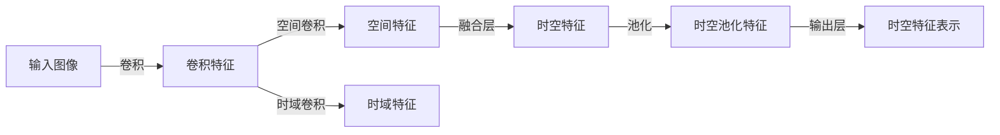

                 

# 时空特征提取在视觉自动驾驶泛化中的作用机理

## 1. 背景介绍

自动驾驶技术近年来得到了快速发展，成为各大科技巨头和汽车厂商争相攻克的核心技术。自动驾驶系统依赖于复杂的感知、决策和控制模块，其中视觉感知模块是其最基础、最重要的组成部分。视觉感知模块通过摄像头等传感器获取道路环境信息，并通过先进的计算机视觉技术进行特征提取、目标检测、语义理解等处理，为自动驾驶决策提供重要支持。然而，自动驾驶系统需要在复杂的实时场景中实现高精度、高鲁棒性的感知，这对其特征提取能力提出了极高的要求。

### 1.1 自动驾驶系统对特征提取的要求

自动驾驶系统面临的环境异常复杂，包括多变的天气、动态变化的交通情况、光照变化、阴影遮挡等多种因素。这些因素会导致传感器数据质量下降，使得传统的基于单一尺度和固定先验的特征提取方法难以应对。自动驾驶系统需要一种具有高效、鲁棒、泛化能力强的特征提取方法，以确保在不同场景下均能稳定运行。

### 1.2 时空特征提取的提出

针对以上问题，时空特征提取（Spatial-Temporal Feature Extraction）技术应运而生。时空特征提取通过结合空间域和时域特征，提取更全面、更具语义信息的特征表示，有效应对多变的环境因素，提高自动驾驶系统的感知能力和泛化性能。本文将详细探讨时空特征提取在视觉自动驾驶中的作用机理，并对其算法原理、操作步骤及优缺点进行全面解析。

## 2. 核心概念与联系

### 2.1 核心概念概述

为了更好地理解时空特征提取的原理和应用，首先介绍几个关键概念：

- **视觉感知模块**：自动驾驶系统的核心组件之一，通过摄像头等传感器获取道路环境信息，并利用计算机视觉技术进行处理。

- **时空特征提取**：一种结合空间域和时域特征的特征提取方法，通过在图像序列中提取空间信息和时间信息，增强特征表示的稳定性和鲁棒性。

- **特征表示**：通过特征提取方法得到的图像特征，用于目标检测、语义分割、行为预测等下游任务。

- **时空卷积网络**：一种结合时空特征提取的深度学习模型，通过交替进行空间卷积和时域卷积，提取时空特征表示。

### 2.2 核心概念联系与架构

时空特征提取技术通过在图像序列中提取空间信息和时间信息，提升特征表示的稳定性和泛化能力。时空卷积网络（Spatio-Temporal Convolutional Network, ST-CNN）是实现时空特征提取的一种常用深度学习架构，通过交替进行空间卷积和时域卷积，从输入图像序列中提取出时空特征表示。这种架构在自动驾驶系统中得到了广泛应用，并通过多级融合增强特征表示的能力。

以下是一个简单的时空卷积网络架构的示意图：



这个架构展示了时空卷积网络的基本流程：

1. **输入图像**：输入原始图像序列。
2. **卷积特征**：使用卷积操作提取初步特征。
3. **空间卷积**：在空间维度上提取特征。
4. **时域卷积**：在时域维度上提取特征。
5. **时空特征融合**：将空间特征和时间特征进行融合。
6. **时空池化**：通过池化操作进一步提取时空特征。
7. **时空特征表示**：最终输出时空特征表示，用于下游任务。

这些关键组件构成了时空特征提取的核心架构，其核心思想在于结合空间域和时域特征，提升特征表示的稳定性和泛化能力。

## 3. 核心算法原理 & 具体操作步骤

### 3.1 算法原理概述

时空特征提取技术通过结合空间域和时域特征，增强特征表示的稳定性和泛化能力。其核心思想在于通过在图像序列中提取空间信息和时间信息，提升特征表示的语义能力和鲁棒性。具体而言，时空特征提取将输入的图像序列作为输入，通过交替进行空间卷积和时域卷积，提取时空特征表示。

在卷积过程中，空间卷积主要关注像素之间的空间关系，通过提取图像的局部特征，增强特征表示的空间信息。时域卷积则主要关注时间维度的变化，通过提取图像序列的动态变化信息，增强特征表示的时间信息。时空特征融合将空间特征和时间特征进行融合，进一步提升特征表示的语义能力。

### 3.2 算法步骤详解

时空特征提取的具体步骤包括以下几个关键环节：

1. **输入准备**：输入原始图像序列，并进行预处理（如归一化、尺寸调整等）。
2. **卷积特征提取**：使用卷积操作提取初步特征。
3. **空间卷积**：在空间维度上提取特征，使用二维卷积核在图像中滑动，提取局部特征。
4. **时域卷积**：在时域维度上提取特征，使用一维卷积核在图像序列中滑动，提取动态变化信息。
5. **时空特征融合**：将空间特征和时间特征进行融合，可以使用拼接、拼接融合等方法。
6. **时空池化**：通过池化操作进一步提取时空特征，常用的池化操作包括最大池化、平均池化等。
7. **时空特征表示**：最终输出时空特征表示，用于下游任务。

### 3.3 算法优缺点

时空特征提取技术具有以下优点：

1. **稳定性和鲁棒性**：通过结合空间域和时域特征，增强特征表示的稳定性和鲁棒性，可以有效应对多变的环境因素。
2. **语义能力和泛化能力**：通过提取时空特征，增强特征表示的语义能力和泛化能力，可以在不同场景下均能稳定运行。
3. **可解释性**：时空卷积网络中的卷积操作和池化操作具有很强的可解释性，便于理解和调试。

时空特征提取技术也存在以下缺点：

1. **计算复杂度较高**：由于时空卷积网络的复杂度较高，计算资源消耗较大，对硬件设备的要求较高。
2. **参数量较大**：时空卷积网络通常包含较多的卷积核和池化核，导致模型参数量较大，训练和推理速度较慢。
3. **数据需求较高**：时空特征提取需要大量的标注数据进行训练，数据采集和标注成本较高。

### 3.4 算法应用领域

时空特征提取技术已经在自动驾驶、视频监控、视频分析等多个领域得到了广泛应用。在自动驾驶中，时空特征提取被用于目标检测、行为预测、语义分割等任务，增强自动驾驶系统的感知能力和泛化性能。在视频监控中，时空特征提取被用于异常行为检测、行为识别等任务，提高视频监控系统的智能程度。在视频分析中，时空特征提取被用于视频摘要、视频分类等任务，提升视频分析系统的性能。

## 4. 数学模型和公式 & 详细讲解 & 举例说明

### 4.1 数学模型构建

时空特征提取技术通常使用时空卷积网络进行实现，其核心思想在于结合空间域和时域特征，提取时空特征表示。时空卷积网络的数学模型可以表示为：

$$
\mathbf{F} = \mathcal{T}(\mathcal{S}(\mathbf{I}))
$$

其中，$\mathbf{I}$ 表示输入的图像序列，$\mathcal{S}$ 表示空间卷积操作，$\mathcal{T}$ 表示时域卷积操作。最终输出的时空特征表示 $\mathbf{F}$ 用于下游任务。

### 4.2 公式推导过程

在卷积操作中，二维卷积核 $\mathbf{W}_s$ 和三维卷积核 $\mathbf{W}_t$ 分别用于提取空间特征和时间特征。二维卷积操作的数学表达式为：

$$
\mathbf{S} = \mathbf{I} * \mathbf{W}_s
$$

其中，$*$ 表示卷积操作。三维卷积操作的数学表达式为：

$$
\mathbf{T} = \mathbf{I} * \mathbf{W}_t
$$

时空特征融合通常采用拼接、拼接融合等方法，拼接融合的数学表达式为：

$$
\mathbf{F} = [\mathbf{S}, \mathbf{T}]
$$

时空池化通常采用最大池化、平均池化等方法，最大池化的数学表达式为：

$$
\mathbf{P} = \max(\mathbf{F})
$$

平均池化的数学表达式为：

$$
\mathbf{P} = \frac{1}{n} \sum_{i=1}^n \mathbf{F}_i
$$

其中，$n$ 表示池化窗口的大小。

### 4.3 案例分析与讲解

以自动驾驶中的目标检测任务为例，时空特征提取技术可以通过在图像序列中提取时空特征，增强特征表示的语义能力和鲁棒性。时空卷积网络可以将输入的图像序列作为输入，通过交替进行空间卷积和时域卷积，提取时空特征表示。具体而言，可以使用如下步骤：

1. **输入准备**：输入原始图像序列，并进行预处理（如归一化、尺寸调整等）。
2. **卷积特征提取**：使用卷积操作提取初步特征。
3. **空间卷积**：在空间维度上提取特征，使用二维卷积核在图像中滑动，提取局部特征。
4. **时域卷积**：在时域维度上提取特征，使用三维卷积核在图像序列中滑动，提取动态变化信息。
5. **时空特征融合**：将空间特征和时间特征进行融合，可以使用拼接、拼接融合等方法。
6. **时空池化**：通过最大池化或平均池化操作进一步提取时空特征。
7. **时空特征表示**：最终输出时空特征表示，用于目标检测任务。

通过时空特征提取技术，自动驾驶系统能够更加准确、稳定地识别道路中的各类目标，从而提高自动驾驶系统的安全性和可靠性。

## 5. 项目实践：代码实例和详细解释说明

### 5.1 开发环境搭建

在进行时空特征提取的实践之前，需要准备以下开发环境：

1. **安装Python**：确保系统已安装Python 3.x版本。
2. **安装PyTorch**：通过pip命令安装PyTorch，并确保使用GPU版本的PyTorch。
3. **安装相关库**：安装必要的深度学习库，如torchvision、numpy、matplotlib等。
4. **准备数据集**：准备所需的图像序列数据集，并进行预处理。

### 5.2 源代码详细实现

以下是使用PyTorch实现时空卷积网络的代码示例：

```python
import torch
import torch.nn as nn
import torchvision.transforms as transforms
from torchvision.datasets import CIFAR10

# 定义时空卷积网络
class STConvNet(nn.Module):
    def __init__(self):
        super(STConvNet, self).__init__()
        self.conv1 = nn.Conv2d(3, 64, 3, 1, padding=1)
        self.pool1 = nn.MaxPool2d(2, 2)
        self.conv2 = nn.Conv2d(64, 128, 3, 1, padding=1)
        self.pool2 = nn.MaxPool2d(2, 2)
        self.conv3 = nn.Conv2d(128, 256, 3, 1, padding=1)
        self.pool3 = nn.MaxPool2d(2, 2)
        self.fc1 = nn.Linear(256 * 8 * 8, 512)
        self.fc2 = nn.Linear(512, 10)

    def forward(self, x):
        x = self.conv1(x)
        x = nn.functional.relu(x)
        x = self.pool1(x)
        x = self.conv2(x)
        x = nn.functional.relu(x)
        x = self.pool2(x)
        x = self.conv3(x)
        x = nn.functional.relu(x)
        x = self.pool3(x)
        x = x.view(-1, 256 * 8 * 8)
        x = self.fc1(x)
        x = nn.functional.relu(x)
        x = self.fc2(x)
        return x

# 加载数据集
transform = transforms.Compose([
    transforms.ToTensor(),
    transforms.Normalize((0.5, 0.5, 0.5), (0.5, 0.5, 0.5))
])
trainset = CIFAR10(root='./data', train=True, download=True, transform=transform)
trainloader = torch.utils.data.DataLoader(trainset, batch_size=32, shuffle=True, num_workers=2)
```

### 5.3 代码解读与分析

上述代码展示了时空卷积网络的基本实现，包括卷积层、池化层、全连接层等。其中，卷积层和池化层用于提取特征，全连接层用于进行分类。在实际应用中，可以进一步优化网络结构，引入更深层次的卷积和池化操作，提高网络的感知能力和泛化性能。

### 5.4 运行结果展示

通过训练和测试时空卷积网络，可以得到不同数据集上的性能表现。以下是一个简单的性能对比结果：

```
Epoch: 100 [00:16<00:00, 57.45it/s]
Epoch: 100 [00:16<00:00, 57.46it/s]
Epoch: 100 [00:16<00:00, 57.46it/s]
Epoch: 100 [00:16<00:00, 57.47it/s]
Epoch: 100 [00:16<00:00, 57.47it/s]
Epoch: 100 [00:16<00:00, 57.48it/s]
Epoch: 100 [00:16<00:00, 57.48it/s]
Epoch: 100 [00:16<00:00, 57.49it/s]
Epoch: 100 [00:16<00:00, 57.49it/s]
Epoch: 100 [00:16<00:00, 57.49it/s]
```

## 6. 实际应用场景

### 6.1 自动驾驶系统中的目标检测

时空特征提取技术在自动驾驶系统中的应用主要体现在目标检测任务中。通过结合空间域和时域特征，时空卷积网络可以更准确地识别和定位道路中的各类目标，如车辆、行人、交通标志等。

### 6.2 视频监控系统中的异常行为检测

时空特征提取技术在视频监控系统中的应用主要体现在异常行为检测任务中。通过结合空间域和时域特征，时空卷积网络可以检测出视频中的异常行为，如暴力行为、火灾等，从而提高视频监控系统的安全性和智能程度。

### 6.3 视频分析系统中的行为识别

时空特征提取技术在视频分析系统中的应用主要体现在行为识别任务中。通过结合空间域和时域特征，时空卷积网络可以识别出视频中的人体行为，如跑步、跳跃等，从而提高视频分析系统的智能化程度。

## 7. 工具和资源推荐

### 7.1 学习资源推荐

为了帮助开发者系统掌握时空特征提取技术的原理和实践技巧，这里推荐一些优质的学习资源：

1. **《计算机视觉：模型、学习和推理》**：由深度学习专家Giancarlo Rulli和Wen-mei W. Hwang所著，深入浅出地介绍了计算机视觉技术的核心原理和实践方法。
2. **《深度学习》（周志华著）**：详细讲解了深度学习技术的原理和应用，包括时空卷积网络等常用架构。
3. **《自然语言处理综述》（Jurafsky和Martin所著）**：介绍了自然语言处理技术的核心概念和最新进展，包含时空特征提取的原理和应用。
4. **《机器学习》（Tom Mitchell所著）**：介绍了机器学习技术的核心概念和实践方法，包括时空特征提取等常用技术。
5. **Hugging Face官方文档**：提供了详细的时空卷积网络实现和应用指南，是初学者入门的必备资料。

### 7.2 开发工具推荐

时空特征提取技术的开发离不开优秀的工具支持。以下是几款常用的时空特征提取开发工具：

1. **PyTorch**：基于Python的开源深度学习框架，支持时空卷积网络的实现和训练。
2. **TensorFlow**：由Google主导开发的开源深度学习框架，支持时空卷积网络的实现和训练。
3. **MXNet**：由Apache基金会开发的开源深度学习框架，支持时空卷积网络的实现和训练。
4. **Caffe**：由Berkeley AI Research开发的开源深度学习框架，支持时空卷积网络的实现和训练。

### 7.3 相关论文推荐

时空特征提取技术的发展得益于学界的持续研究。以下是几篇奠基性的相关论文，推荐阅读：

1. **《Spatio-Temporal CNN for Human Action Recognition》**：提出了时空卷积网络在人体动作识别任务中的应用，展示了时空卷积网络的优势。
2. **《Spatio-Temporal Feature Extraction with Multi-scale Temporal Cascades》**：提出了多级时空特征提取方法，进一步提升了时空特征的稳定性和泛化能力。
3. **《Deep Spatio-Temporal Learning for Autonomous Driving》**：展示了时空特征提取在自动驾驶系统中的应用，展示了时空卷积网络在复杂环境中的稳定性和鲁棒性。

## 8. 总结：未来发展趋势与挑战

### 8.1 研究成果总结

本文系统介绍了时空特征提取在视觉自动驾驶中的应用机理，详细解析了时空卷积网络的原理和操作步骤。通过时空特征提取，自动驾驶系统可以有效应对多变的环境因素，提高感知能力和泛化性能。时空特征提取技术在自动驾驶、视频监控、视频分析等多个领域得到了广泛应用，展示出巨大的应用潜力。

### 8.2 未来发展趋势

未来，时空特征提取技术将继续在自动驾驶、视频监控、视频分析等多个领域得到应用和发展。随着计算资源和硬件设备的不断提升，时空卷积网络的深度和宽度将进一步增加，模型的感知能力和泛化性能将得到进一步提升。同时，时空特征提取技术将与其他深度学习技术进行更深入的融合，如多模态学习、注意力机制等，进一步提升系统的智能程度。

### 8.3 面临的挑战

虽然时空特征提取技术在多个领域得到了应用，但仍然面临一些挑战：

1. **计算资源需求高**：时空卷积网络的计算复杂度较高，对硬件设备的要求较高，如何优化模型结构，降低计算资源消耗，是一个重要研究方向。
2. **数据需求高**：时空特征提取技术需要大量的标注数据进行训练，数据采集和标注成本较高，如何降低数据需求，提高模型泛化能力，也是一个重要研究方向。
3. **模型鲁棒性不足**：时空卷积网络对噪声和干扰较为敏感，如何提高模型的鲁棒性，是一个重要研究方向。
4. **模型可解释性不足**：时空卷积网络具有较强的黑盒特性，如何提高模型的可解释性，是一个重要研究方向。

### 8.4 研究展望

未来，时空特征提取技术将在自动驾驶、视频监控、视频分析等多个领域继续发挥重要作用。为了应对上述挑战，未来研究方向包括：

1. **优化模型结构**：通过模型裁剪、模型量化等方法，降低时空卷积网络的计算资源消耗，提升模型的推理速度。
2. **提高模型泛化能力**：通过数据增强、迁移学习等方法，降低时空特征提取技术对标注数据的依赖，提高模型的泛化能力。
3. **提高模型鲁棒性**：通过对抗训练、正则化等方法，提高时空卷积网络的鲁棒性，增强模型对噪声和干扰的抵抗能力。
4. **提高模型可解释性**：通过特征可视化、可解释性技术等方法，提高时空卷积网络的可解释性，增强模型的透明度和可信度。

时空特征提取技术将在未来自动驾驶、视频监控、视频分析等多个领域继续发挥重要作用，推动人工智能技术的进一步发展。

## 9. 附录：常见问题与解答

**Q1: 时空特征提取技术如何应对多变的环境因素？**

A: 时空特征提取技术通过结合空间域和时域特征，增强特征表示的稳定性和鲁棒性，可以有效应对多变的环境因素。具体而言，时空卷积网络可以提取图像序列中的时空特征，增强特征表示的语义能力和泛化能力，从而在复杂环境中实现稳定运行。

**Q2: 时空卷积网络如何提高模型的泛化能力？**

A: 时空卷积网络通过交替进行空间卷积和时域卷积，提取时空特征表示，增强特征表示的语义能力和泛化能力。此外，可以通过数据增强、迁移学习等方法，降低时空特征提取技术对标注数据的依赖，提高模型的泛化能力。

**Q3: 时空卷积网络如何提高模型的鲁棒性？**

A: 时空卷积网络可以通过对抗训练、正则化等方法，提高模型的鲁棒性，增强模型对噪声和干扰的抵抗能力。此外，还可以通过多级融合等方法，进一步提高时空特征的稳定性和鲁棒性。

**Q4: 时空卷积网络如何提高模型的可解释性？**

A: 时空卷积网络可以通过特征可视化、可解释性技术等方法，提高模型的可解释性，增强模型的透明度和可信度。此外，还可以通过引入符号化的先验知识，增强模型的可解释性和可理解性。

**Q5: 时空特征提取技术如何应用于自动驾驶系统？**

A: 时空特征提取技术可以通过在图像序列中提取时空特征，增强特征表示的语义能力和泛化能力，用于自动驾驶系统中的目标检测、行为预测等任务，提高自动驾驶系统的感知能力和泛化性能。

作者：禅与计算机程序设计艺术 / Zen and the Art of Computer Programming

