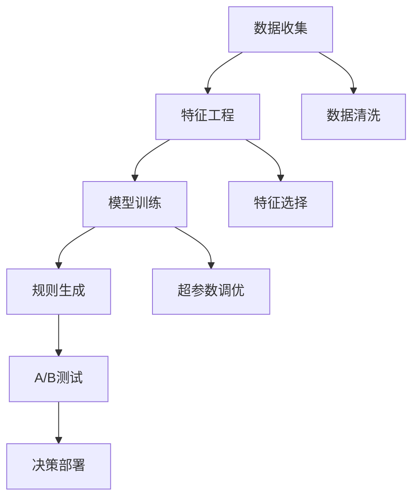

                 

# 智能促销策略的实践效果

## 1. 背景介绍

### 1.1 问题由来
在现代电商行业中，促销策略的制定与执行效果对销售业绩有着重要影响。传统上，促销策略的制定主要依赖于业务经验或统计分析，存在一定的随意性和局限性。近年来，随着人工智能和大数据技术的发展，智能促销策略开始得到广泛应用，通过机器学习算法，可以基于历史数据和用户行为，自动生成最优的促销方案，提升销售效果。

### 1.2 问题核心关键点
智能促销策略的核心在于如何将历史数据和用户行为转化为有效的促销规则。其关键点包括：
- 数据收集与预处理：收集历史销售数据、用户行为数据和外部环境数据。
- 特征工程：提取对销售有显著影响的特征，构建特征向量。
- 模型训练与优化：选择适当的机器学习模型，对历史数据进行训练，调整模型参数以提升效果。
- 规则生成与优化：根据训练结果，自动生成和优化促销规则，形成多维度、多层次的促销策略。

## 2. 核心概念与联系

### 2.1 核心概念概述

为更好地理解智能促销策略的实现原理，本节将介绍几个密切相关的核心概念：

- 机器学习(Machine Learning)：一种利用数据驱动的方式进行预测和决策的算法。智能促销策略即通过机器学习算法，分析历史数据，预测未来销售趋势，自动生成最优的促销方案。
- 数据挖掘(Data Mining)：从大量数据中提取有用信息和知识的过程。智能促销策略依赖于对用户行为数据的挖掘，提取潜在的消费规律。
- 特征工程(Feature Engineering)：提取和构造对模型有显著影响的数据特征的过程。智能促销策略需要提取用户特征、产品特征、时间特征等，构建优化的特征向量。
- 预测模型(Prediction Model)：基于历史数据训练得到的模型，用于预测未来销售趋势或用户行为。智能促销策略中常用的预测模型包括线性回归、随机森林、神经网络等。
- 规则生成(Rule Generation)：通过模型训练得到的决策规则，生成动态的促销策略。智能促销策略通常将模型训练得到的预测结果转化为具体的促销规则，如打折、优惠券等。
- A/B测试(A/B Testing)：一种比较两种或多种策略效果的方法，用于验证促销策略的优化效果。智能促销策略中，可以通过A/B测试比较不同促销策略的效果，选择最优方案。

这些核心概念之间的逻辑关系可以通过以下Mermaid流程图来展示：



这个流程图展示了一些关键步骤及其关系：

1. 数据收集阶段，收集所需的历史数据和用户行为数据。
2. 特征工程阶段，对数据进行清洗、选择、构造，构建特征向量。
3. 模型训练阶段，选择合适的模型进行训练，并调整超参数以优化模型效果。
4. 规则生成阶段，将训练好的模型转化为具体的促销策略。
5. A/B测试阶段，通过测试比较不同促销策略的效果，优化规则。
6. 决策部署阶段，将最终的促销规则应用于实际业务中。

## 3. 核心算法原理 & 具体操作步骤
### 3.1 算法原理概述

智能促销策略的实现，本质上是机器学习中的监督学习问题。其核心思想是：通过历史数据训练机器学习模型，预测未来销售趋势，生成最优的促销规则。具体来说，可以采用以下步骤：

**Step 1: 数据收集与预处理**
- 收集历史销售数据、用户行为数据、外部环境数据。
- 对数据进行清洗、去重、缺失值填补等预处理，保证数据质量。

**Step 2: 特征工程**
- 提取对销售有显著影响的特征，如用户行为特征、产品特征、时间特征等。
- 构造特征向量，对特征进行选择、组合、归一化等处理。

**Step 3: 模型训练**
- 选择合适的预测模型，如线性回归、随机森林、神经网络等。
- 使用历史数据对模型进行训练，调整超参数以优化模型效果。

**Step 4: 规则生成**
- 根据训练好的模型，生成最优的促销规则。常见的规则生成方法包括回归模型预测促销金额、分类模型预测促销类型等。
- 将规则转化为具体的促销策略，如全品类打折、满减优惠、赠品等。

**Step 5: A/B测试**
- 在实际业务中，随机选择一部分用户进行新促销策略的测试。
- 通过统计分析，比较新旧策略的效果，选择最优方案。

**Step 6: 决策部署**
- 将最终选择的促销策略应用于实际业务中，进行效果监测和优化。

### 3.2 算法步骤详解

以下我们将详细介绍智能促销策略的核心算法步骤：

**Step 1: 数据收集与预处理**

在数据收集阶段，需要确保数据的全面性和时效性。数据可以来源于销售系统、用户行为日志、外部环境数据等。对于每一种数据源，都需要进行清洗和预处理：

- 清洗：去除噪声数据、异常值，确保数据质量。
- 去重：去重重复记录，避免数据冗余。
- 缺失值填补：处理缺失值，如使用均值、中位数、插值等方法。
- 数据转换：将数据转换为模型所需的格式，如日期转换为时间戳、类别变量转换为哑变量等。

**Step 2: 特征工程**

特征工程是智能促销策略的关键步骤之一。主要任务是提取和构造对销售有显著影响的特征，构建特征向量。特征选择的常用方法包括：

- 相关性分析：使用皮尔逊相关系数、斯皮尔曼等级相关系数等方法，评估特征与销售之间的相关性。
- 方差分析：通过ANOVA等方法，识别不同特征对销售的影响。
- 特征组合：使用特征交叉、多项式特征等方法，构造新的特征。

**Step 3: 模型训练**

在模型训练阶段，需要选择适当的机器学习模型，对历史数据进行训练，调整模型参数以提升效果。常见的预测模型包括：

- 线性回归：用于预测连续型的促销金额。
- 随机森林：用于预测离散的促销类型。
- 神经网络：适用于复杂非线性关系的预测，如基于深度学习模型进行销售预测。

**Step 4: 规则生成**

根据训练好的模型，生成最优的促销规则。常见的规则生成方法包括：

- 回归模型预测促销金额：根据历史数据训练回归模型，预测未来促销金额。
- 分类模型预测促销类型：训练分类模型，预测促销类型如打折、赠品等。

**Step 5: A/B测试**

在实际业务中，随机选择一部分用户进行新促销策略的测试。通过统计分析，比较新旧策略的效果，选择最优方案：

- 随机分组：将用户随机分为实验组和对照组。
- 测试变量：设置测试变量（新促销策略）和对照变量（旧促销策略）。
- 统计分析：使用统计学方法（如t检验、卡方检验等），评估新策略的效果。
- 效果优化：根据测试结果，优化促销策略。

**Step 6: 决策部署**

将最终选择的促销策略应用于实际业务中，进行效果监测和优化：

- 策略执行：根据生成的促销规则，自动执行促销策略。
- 效果监测：实时监测促销策略的效果，如销售额、订单量等。
- 优化调整：根据效果监测结果，进行策略调整和优化。

### 3.3 算法优缺点

智能促销策略的实现，具有以下优点：

1. **自动化与高效性**：通过机器学习算法，自动生成最优的促销策略，减少了人工干预的复杂度和时间成本。
2. **预测准确性**：基于历史数据训练模型，能够预测未来的销售趋势和用户行为，提升促销策略的准确性。
3. **灵活性与可扩展性**：模型训练与规则生成过程具有较强的灵活性，可以根据不同的业务场景进行定制化优化。
4. **动态优化**：通过A/B测试等方法，持续监测和优化促销策略，保证策略效果的持续提升。

同时，该方法也存在一定的局限性：

1. **数据质量依赖**：模型的预测效果依赖于数据质量，数据偏差或不完整可能导致预测不准确。
2. **模型复杂性**：复杂的模型结构需要更多的计算资源和时间成本，训练和优化过程较为耗时。
3. **规则生成难度**：将模型预测转化为具体的促销规则，存在一定的规则生成难度。
4. **业务理解不足**：模型和算法无法完全替代人工经验，仍需业务人员对促销策略的调整和优化进行指导。

尽管存在这些局限性，但就目前而言，智能促销策略仍是目前电商行业中最主流和有效的策略生成方式。未来相关研究的重点在于如何进一步降低数据质量要求，提高模型的预测准确性和规则生成的自动化水平，同时兼顾可解释性和商业目标。

### 3.4 算法应用领域

智能促销策略在电商行业中的应用广泛，已经取得了显著的业绩提升。以下是几个主要应用领域：

- **个性化推荐**：通过分析用户的历史行为数据，生成个性化的促销策略，提升用户体验和转化率。
- **价格优化**：利用历史销售数据和市场趋势，自动生成最优的价格策略，提升销售额和利润率。
- **库存管理**：通过预测未来的销售趋势，优化库存管理，减少库存积压和缺货现象。
- **广告投放**：分析用户行为数据，生成精准的广告投放策略，提升广告ROI。
- **会员管理**：通过会员行为数据，生成差异化的促销策略，增强用户粘性和忠诚度。

除了电商行业，智能促销策略在其他领域也有广泛应用。例如：

- **金融行业**：通过分析用户的投资行为，生成个性化的投资建议和促销策略，提升客户满意度和交易量。
- **旅游行业**：通过分析用户的旅游行为，生成个性化的促销策略，提升用户粘性和转化率。
- **物流行业**：通过分析订单数据，生成最优的物流配送策略，提升配送效率和客户满意度。

未来，随着电商行业和智能技术的进一步发展，智能促销策略将会在更多场景中得到应用，为传统行业带来变革性影响。

## 4. 数学模型和公式 & 详细讲解  
### 4.1 数学模型构建

在智能促销策略中，常见的预测模型包括线性回归和随机森林。以线性回归为例，假设有如下线性回归模型：

$$
y = \beta_0 + \beta_1 x_1 + \beta_2 x_2 + \ldots + \beta_n x_n + \epsilon
$$

其中，$y$ 表示预测值，$x_i$ 表示特征向量，$\beta_i$ 表示模型参数，$\epsilon$ 表示误差项。模型的目标是最小化预测值与实际值之间的误差，常用的误差函数为均方误差（MSE）：

$$
MSE = \frac{1}{N} \sum_{i=1}^N (y_i - \hat{y}_i)^2
$$

其中，$N$ 表示样本数量，$\hat{y}_i$ 表示模型预测值。

### 4.2 公式推导过程

线性回归模型的参数估计可以使用最小二乘法进行求解。假设已知样本 $(x_{i,1}, x_{i,2}, \ldots, x_{i,n})$ 和对应的标签 $y_i$，则线性回归模型的参数估计公式为：

$$
\hat{\beta} = (X^TX)^{-1}X^Ty
$$

其中，$X$ 表示特征矩阵，$y$ 表示标签向量。上述公式中，$X^TX$ 为特征矩阵的转置乘积，$\hat{\beta}$ 为模型参数的估计值。

在实际应用中，通常会将数据进行标准化处理，以避免某些特征对模型的过度影响。标准化公式如下：

$$
x_i' = \frac{x_i - \mu}{\sigma}
$$

其中，$x_i'$ 表示标准化后的特征向量，$\mu$ 表示均值，$\sigma$ 表示标准差。

### 4.3 案例分析与讲解

假设某电商企业收集了历史销售数据，包括用户行为数据、产品特征和外部环境数据。通过特征工程，提取了用户购买次数、产品价格、季节因素等特征。利用这些特征，训练了一个线性回归模型，用于预测促销金额。

**数据收集**

- 用户行为数据：包含用户的浏览历史、购买历史、搜索历史等。
- 产品特征：包括产品价格、品牌、分类等。
- 外部环境数据：如节假日、促销活动、市场趋势等。

**特征工程**

- 用户购买次数：通过统计用户的购买次数，构造特征。
- 产品价格：将产品价格作为特征，进行归一化处理。
- 季节因素：将一年分为四个季节，作为特征进行模型训练。

**模型训练**

使用历史数据训练线性回归模型，得到模型参数估计值 $\hat{\beta}$。训练过程如下：

$$
\hat{\beta} = (X^TX)^{-1}X^Ty
$$

其中，$X$ 表示特征矩阵，$y$ 表示标签向量。

**规则生成**

根据训练好的模型，生成最优的促销金额。假设预测模型为 $y = \beta_0 + \beta_1 \times \text{购买次数} + \beta_2 \times \text{产品价格} + \beta_3 \times \text{季节因素}$，则根据模型的预测值，生成具体的促销金额。

## 5. 项目实践：代码实例和详细解释说明
### 5.1 开发环境搭建

在进行智能促销策略的实践前，我们需要准备好开发环境。以下是使用Python进行scikit-learn开发的环境配置流程：

1. 安装Anaconda：从官网下载并安装Anaconda，用于创建独立的Python环境。

2. 创建并激活虚拟环境：
```bash
conda create -n promotion-env python=3.8 
conda activate promotion-env
```

3. 安装scikit-learn：
```bash
pip install scikit-learn
```

4. 安装numpy、pandas等工具包：
```bash
pip install numpy pandas matplotlib seaborn
```

5. 安装相关的可视化库：
```bash
pip install plotly jupyter notebook
```

完成上述步骤后，即可在`promotion-env`环境中开始智能促销策略的实践。

### 5.2 源代码详细实现

下面以线性回归模型为例，给出使用scikit-learn进行促销金额预测的PyTorch代码实现。

首先，定义促销金额预测函数：

```python
import pandas as pd
import numpy as np
from sklearn.linear_model import LinearRegression

def predict_promotion_amount(data, features, target):
    # 数据预处理
    X = data[features]
    y = data[target]

    # 标准化处理
    mean = X.mean(axis=0)
    std = X.std(axis=0)
    X = (X - mean) / std

    # 训练模型
    model = LinearRegression()
    model.fit(X, y)

    # 预测促销金额
    X_test = pd.read_csv('test_data.csv')
    X_test = (X_test - mean) / std
    y_pred = model.predict(X_test)

    return y_pred
```

然后，定义数据处理和特征选择函数：

```python
def process_data(data_path, features, target):
    # 读取数据
    data = pd.read_csv(data_path)

    # 特征选择
    X = data[features]
    y = data[target]

    return X, y
```

最后，启动促销金额预测流程：

```python
if __name__ == '__main__':
    # 数据路径
    data_path = 'promotion_data.csv'

    # 特征选择
    features = ['purchase_count', 'product_price', 'season_factor']

    # 目标变量
    target = 'promotion_amount'

    # 数据预处理和特征选择
    X, y = process_data(data_path, features, target)

    # 预测促销金额
    y_pred = predict_promotion_amount(X, features, target)

    print(y_pred)
```

以上代码实现了一个简单的线性回归模型，用于预测促销金额。具体步骤如下：

1. 数据预处理：对数据进行标准化处理，消除特征之间的量纲差异。
2. 模型训练：使用历史数据训练线性回归模型。
3. 特征选择：选择对销售有显著影响的特征。
4. 预测促销金额：根据训练好的模型，预测促销金额。

### 5.3 代码解读与分析

让我们再详细解读一下关键代码的实现细节：

**process_data函数**：
- `process_data`函数：读取数据，并进行特征选择和目标变量的提取。
- `X`：提取的特征矩阵。
- `y`：目标变量向量。

**predict_promotion_amount函数**：
- `predict_promotion_amount`函数：预测促销金额，包括数据预处理、模型训练和预测等步骤。
- `X`：特征矩阵。
- `y`：目标变量向量。
- `mean`和`std`：标准化处理所需的均值和标准差。
- `model`：训练好的线性回归模型。
- `X_test`：测试数据集。
- `y_pred`：预测的促销金额。

**if __name__ == '__main__'**：
- `if __name__ == '__main__'`语句：确保脚本可以在外部调用时执行。

可以看到，scikit-learn提供了强大的机器学习库，使得模型的训练和预测过程非常简单高效。开发者可以将更多精力放在数据处理、模型优化等高层逻辑上，而不必过多关注底层的实现细节。

当然，工业级的系统实现还需考虑更多因素，如数据的质量和多样性、模型的选择和调参等。但核心的促销金额预测流程基本与此类似。

## 6. 实际应用场景
### 6.1 智能促销策略的实际应用场景

智能促销策略已经在电商行业得到了广泛的应用，取得了显著的业绩提升。以下是几个典型的应用场景：

**场景一：个性化推荐**

通过分析用户的历史行为数据，生成个性化的促销策略，提升用户体验和转化率。例如，对于常购买的商品，生成更高折扣的促销策略。

**场景二：价格优化**

利用历史销售数据和市场趋势，自动生成最优的价格策略，提升销售额和利润率。例如，根据季节因素和市场趋势，调整产品价格。

**场景三：库存管理**

通过预测未来的销售趋势，优化库存管理，减少库存积压和缺货现象。例如，根据销售预测结果，动态调整库存量。

**场景四：广告投放**

分析用户行为数据，生成精准的广告投放策略，提升广告ROI。例如，针对特定用户群体，推送相关的促销信息。

**场景五：会员管理**

通过会员行为数据，生成差异化的促销策略，增强用户粘性和忠诚度。例如，对VIP会员提供更高折扣的促销活动。

除了电商行业，智能促销策略在其他领域也有广泛应用。例如：

- **金融行业**：通过分析用户的投资行为，生成个性化的投资建议和促销策略，提升客户满意度和交易量。
- **旅游行业**：通过分析用户的旅游行为，生成个性化的促销策略，提升用户粘性和转化率。
- **物流行业**：通过分析订单数据，生成最优的物流配送策略，提升配送效率和客户满意度。

未来，随着电商行业和智能技术的进一步发展，智能促销策略将会在更多场景中得到应用，为传统行业带来变革性影响。

### 6.2 未来应用展望

随着智能促销策略的不断发展，未来将在以下几个方向取得进一步突破：

**方向一：自动化与智能化**

未来的智能促销策略将更加自动化和智能化，能够实时动态地生成和优化促销策略。例如，通过实时监测用户行为和市场趋势，自动调整促销策略。

**方向二：跨平台协同**

不同平台之间的数据和业务将更加紧密地协同，提升促销策略的整体效果。例如，通过跨平台数据分析，生成更加精准的促销策略。

**方向三：深度学习与强化学习**

未来的智能促销策略将引入深度学习和强化学习的思想，提升模型的预测能力和决策能力。例如，通过深度学习模型提取高层次的特征，通过强化学习优化促销策略。

**方向四：多模态融合**

智能促销策略将融合多种模态的数据，提升促销策略的全面性和精确性。例如，融合图像、语音、文本等多模态数据，生成更加丰富的促销策略。

**方向五：模型解释性**

未来的智能促销策略将更加注重模型的解释性，提升促销策略的可理解性和可解释性。例如，通过可解释模型技术，揭示促销策略的生成逻辑。

以上方向凸显了智能促销策略的广阔前景。这些方向的探索发展，必将进一步提升促销策略的智能化水平，为电商行业和其他领域带来新的突破。

## 7. 工具和资源推荐
### 7.1 学习资源推荐

为了帮助开发者系统掌握智能促销策略的理论基础和实践技巧，这里推荐一些优质的学习资源：

1. 《Python数据科学手册》：系统介绍了Python数据科学的基础知识和实践技巧，涵盖数据处理、模型训练等核心内容。

2. 《机器学习实战》：通俗易懂的机器学习实战指南，介绍了常见的机器学习算法和应用场景，适合初学者入门。

3. 《Python深度学习》：介绍了深度学习的基础知识和实践技巧，涵盖神经网络、卷积神经网络、循环神经网络等。

4. 《强化学习》：介绍了强化学习的基础知识和实践技巧，涵盖马尔科夫决策过程、Q-learning、深度强化学习等。

5. 《Python数据科学从入门到实践》：系统介绍了Python数据科学的全栈技术栈，涵盖数据清洗、特征工程、模型训练等。

通过对这些资源的学习实践，相信你一定能够快速掌握智能促销策略的精髓，并用于解决实际的业务问题。

### 7.2 开发工具推荐

高效的开发离不开优秀的工具支持。以下是几款用于智能促销策略开发的常用工具：

1. Jupyter Notebook：免费的开源笔记本，支持Python、R等语言，适合数据探索和模型训练。

2. PyTorch：基于Python的开源深度学习框架，灵活高效的计算图，适合快速迭代研究。

3. TensorFlow：由Google主导开发的开源深度学习框架，生产部署方便，适合大规模工程应用。

4. Scikit-learn：基于Python的机器学习库，提供了丰富的机器学习算法和工具，适合快速实现模型训练。

5. Pandas：基于Python的数据处理库，提供了高效的数据清洗、转换和分析功能。

6. Matplotlib和Seaborn：基于Python的可视化库，提供了丰富的绘图功能，适合数据可视化和结果展示。

合理利用这些工具，可以显著提升智能促销策略的开发效率，加快创新迭代的步伐。

### 7.3 相关论文推荐

智能促销策略的发展源于学界的持续研究。以下是几篇奠基性的相关论文，推荐阅读：

1. 《机器学习实战》：通俗易懂的机器学习实战指南，介绍了常见的机器学习算法和应用场景，适合初学者入门。

2. 《Python数据科学手册》：系统介绍了Python数据科学的基础知识和实践技巧，涵盖数据处理、模型训练等核心内容。

3. 《强化学习》：介绍了强化学习的基础知识和实践技巧，涵盖马尔科夫决策过程、Q-learning、深度强化学习等。

4. 《Python深度学习》：介绍了深度学习的基础知识和实践技巧，涵盖神经网络、卷积神经网络、循环神经网络等。

5. 《Python数据科学从入门到实践》：系统介绍了Python数据科学的全栈技术栈，涵盖数据清洗、特征工程、模型训练等。

这些论文代表了大数据和智能技术的发展脉络。通过学习这些前沿成果，可以帮助研究者把握学科前进方向，激发更多的创新灵感。

## 8. 总结：未来发展趋势与挑战
### 8.1 研究成果总结

本文对智能促销策略的实现过程进行了全面系统的介绍。首先阐述了智能促销策略的研究背景和意义，明确了策略生成的核心点：数据收集、特征工程、模型训练、规则生成和A/B测试。其次，从原理到实践，详细讲解了智能促销策略的数学模型和操作步骤，给出了具体的代码实现和实例分析。同时，本文还广泛探讨了智能促销策略在电商行业和其他领域的应用前景，展示了其广泛的应用价值。

通过本文的系统梳理，可以看到，智能促销策略的实现过程涉及到机器学习、数据挖掘、特征工程等多个环节，需要从数据、模型、算法等多个维度进行全面优化。智能促销策略已经成为电商行业的重要工具，通过持续的优化和改进，未来必将在更多场景中得到应用，为传统行业带来变革性影响。

### 8.2 未来发展趋势

展望未来，智能促销策略的发展趋势主要体现在以下几个方面：

**趋势一：自动化与智能化**

未来的智能促销策略将更加自动化和智能化，能够实时动态地生成和优化促销策略。例如，通过实时监测用户行为和市场趋势，自动调整促销策略。

**趋势二：跨平台协同**

不同平台之间的数据和业务将更加紧密地协同，提升促销策略的整体效果。例如，通过跨平台数据分析，生成更加精准的促销策略。

**趋势三：深度学习与强化学习**

未来的智能促销策略将引入深度学习和强化学习的思想，提升模型的预测能力和决策能力。例如，通过深度学习模型提取高层次的特征，通过强化学习优化促销策略。

**趋势四：多模态融合**

智能促销策略将融合多种模态的数据，提升促销策略的全面性和精确性。例如，融合图像、语音、文本等多模态数据，生成更加丰富的促销策略。

**趋势五：模型解释性**

未来的智能促销策略将更加注重模型的解释性，提升促销策略的可理解性和可解释性。例如，通过可解释模型技术，揭示促销策略的生成逻辑。

这些趋势凸显了智能促销策略的广阔前景。这些方向的探索发展，必将进一步提升促销策略的智能化水平，为电商行业和其他领域带来新的突破。

### 8.3 面临的挑战

尽管智能促销策略已经取得了显著的业绩提升，但在迈向更加智能化、自动化应用的过程中，它仍面临着诸多挑战：

**挑战一：数据质量瓶颈**

智能促销策略的预测效果依赖于数据质量，数据偏差或不完整可能导致预测不准确。如何进一步降低数据质量要求，提高模型的预测准确性，是需要解决的重要问题。

**挑战二：模型复杂性**

复杂的模型结构需要更多的计算资源和时间成本，训练和优化过程较为耗时。如何在保证预测精度的前提下，设计简单高效的模型结构，是未来的研究方向之一。

**挑战三：规则生成难度**

将模型预测转化为具体的促销规则，存在一定的规则生成难度。如何根据不同的业务场景，生成最优的促销规则，是另一个重要挑战。

**挑战四：业务理解不足**

模型和算法无法完全替代人工经验，仍需业务人员对促销策略的调整和优化进行指导。如何在自动化和人工经验之间找到平衡，是未来需要解决的问题。

**挑战五：模型解释性不足**

智能促销策略通常被视为“黑盒”系统，难以解释其内部工作机制和决策逻辑。如何赋予模型更强的可解释性，是未来需要解决的问题之一。

这些挑战凸显了智能促销策略的复杂性和局限性，需要研究者在算法、数据、业务等多个层面进行综合优化。只有不断提升数据质量、简化模型结构、优化规则生成，才能实现智能促销策略的进一步突破。

### 8.4 研究展望

面对智能促销策略所面临的挑战，未来的研究需要在以下几个方向寻求新的突破：

**方向一：自动化与智能化**

开发更加自动化和智能化的促销策略生成系统，提升策略生成的实时性和自动化程度。

**方向二：深度学习与强化学习**

引入深度学习和强化学习的思想，提升促销策略的预测能力和决策能力。

**方向三：多模态融合**

融合多种模态的数据，提升促销策略的全面性和精确性。

**方向四：模型解释性**

赋予模型更强的可解释性，提升促销策略的可理解性和可解释性。

**方向五：跨平台协同**

实现不同平台之间的数据和业务协同，提升促销策略的整体效果。

这些研究方向将推动智能促销策略迈向更高的台阶，为电商行业和其他领域带来新的突破。只有勇于创新、敢于突破，才能不断拓展促销策略的边界，让智能技术更好地造福人类社会。

## 9. 附录：常见问题与解答

**Q1：智能促销策略是否适用于所有电商行业？**

A: 智能促销策略在大多数电商行业都能取得不错的效果，特别是对于数据量较大的电商企业。但对于一些特定领域的电商企业，例如垂直类电商，由于其商品种类繁多、市场变化较快，可能需要更多的定制化优化。

**Q2：智能促销策略的预测效果如何？**

A: 智能促销策略的预测效果依赖于数据质量和模型选择。在数据质量和模型选择合理的情况下，预测效果可以显著提升销售业绩。但在数据质量不佳或模型选择不合适的情况下，预测效果可能较差。

**Q3：智能促销策略的训练和优化过程耗时吗？**

A: 智能促销策略的训练和优化过程相对耗时，特别是在模型结构复杂的情况下。通过合理的特征选择和模型调参，可以有效缩短训练时间。同时，通过分布式计算和模型压缩等技术，可以进一步优化模型训练过程。

**Q4：智能促销策略的实际应用效果如何？**

A: 智能促销策略在电商行业中已经得到了广泛应用，并取得了显著的业绩提升。通过分析用户行为数据，生成个性化的促销策略，提升用户体验和转化率。

**Q5：智能促销策略是否需要持续优化？**

A: 是的。智能促销策略需要持续优化，以应对不断变化的市场环境。通过实时监测用户行为和市场趋势，动态调整促销策略，才能保持其有效性。

**Q6：智能促销策略的计算资源需求大吗？**

A: 智能促销策略的计算资源需求较大，特别是在大规模数据和复杂模型的情况下。通过合理的资源优化和模型压缩，可以有效降低计算资源需求，提高计算效率。

通过这些常见问题的解答，可以看到智能促销策略的实现和应用过程中，需要注意的数据质量、模型选择、计算资源等多个维度。只有在这些关键环节进行全面优化，才能实现智能促销策略的真正落地和效果提升。

