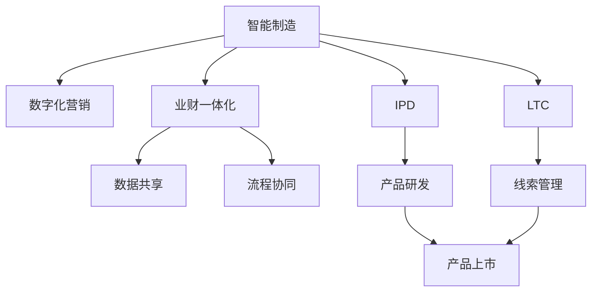

                 

# 智能制造，数字化营销，业财一体化，核心业务流程变革（IPD LTC等）

## 1. 背景介绍

### 1.1 问题由来
在全球化的经济大潮中，制造行业面临着前所未有的挑战与机遇。传统制造模式逐渐被智能制造所替代，数字化营销日益成为企业竞争的核心战场，业财一体化的需求愈发紧迫。与此同时，企业内部的核心业务流程，如IPD（Integrated Product Development，集成产品开发）和LTC（Lead to Cash，线索到现金）等，也在加速变革，以适应瞬息万变的市场环境。

这些变革的核心驱动力来源于数字化技术的应用，如工业互联网、人工智能、大数据分析等。数字化转型使制造企业能够实现生产过程的智能优化、产品设计的协同创新、销售服务的精准营销、财务数据的实时管理，全面提升企业运营效率和竞争能力。

## 2. 核心概念与联系

### 2.1 核心概念概述

为了更好地理解智能制造、数字化营销、业财一体化以及IPD和LTC等概念，本节将详细介绍这些核心概念及其相互之间的联系：

- **智能制造**：通过数字化、网络化和智能化技术，将制造过程自动化、信息化，实现生产过程的精细化管理与智能化决策。智能制造涉及工厂、供应链、物流、设备、工艺等多方面内容。
- **数字化营销**：利用数字技术（如大数据分析、人工智能、社交媒体等）进行市场细分、消费者行为分析、个性化营销策略制定和实施，提升品牌知名度和市场份额。
- **业财一体化**：将业务数据和财务数据集成，实现数据共享和业务流程协同，提升决策效率和财务数据精确性。业财一体化关注的是业务和财务的紧密结合，提升整体运营效率和财务管控能力。
- **IPD**：一种产品开发管理模式，旨在实现从市场研究、产品设计、工艺制造到销售的全面集成，提升产品开发效率和市场竞争力。
- **LTC**：一种销售管理模式，将销售线索转化为实际销售的流程管理方法，从客户需求识别、商机挖掘、销售执行到订单交付，覆盖全客户生命周期管理。

这些概念之间的联系可以通过以下Mermaid流程图来展示：



这个流程图展示了几大核心概念之间的相互关联：

1. 智能制造为数字化营销和业财一体化提供了数字化基础，通过生产过程的自动化和信息化，实现数据收集与处理。
2. IPD和LTC作为智能制造和数字化营销的支撑手段，分别关注产品开发和销售线索的全程管理，推动全链条协同创新。
3. 业财一体化通过数据共享和流程协同，实现业务与财务的紧密结合，提升决策效率和数据精确性。

这些概念共同构成了企业数字化转型的基础框架，协同推进智能制造、数字化营销、业财一体化的实现。

## 3. 核心算法原理 & 具体操作步骤

### 3.1 算法原理概述

在智能制造、数字化营销和业财一体化的实现过程中，核心算法原理主要包括以下几个方面：

1. **数据驱动决策**：利用大数据分析技术，从海量数据中提取有用信息，支持企业决策。
2. **优化算法**：通过优化算法（如遗传算法、模拟退火等）对生产、销售、财务等业务流程进行优化。
3. **机器学习**：应用机器学习算法（如分类、回归、聚类等）进行市场细分、客户行为预测、产品推荐等。
4. **自然语言处理**：通过自然语言处理技术（如文本分类、情感分析、智能问答等）提升客户服务质量。
5. **工业互联网平台**：利用工业互联网平台进行设备互联、数据采集与分析，实现生产过程的数字化管理。
6. **云服务**：通过云计算服务实现数据存储、处理与共享，提供弹性资源支持。

这些核心算法原理共同构成了智能制造、数字化营销和业财一体化的技术基础，支撑着企业的数字化转型。

### 3.2 算法步骤详解

具体来说，企业在进行数字化转型时，通常会按照以下步骤进行：

1. **需求分析**：根据企业实际需求，制定数字化转型目标和计划。
2. **系统设计**：设计系统架构和数据模型，选择适合的算法和技术方案。
3. **数据准备**：收集、清洗和整合数据，确保数据质量。
4. **系统开发**：开发或采购软件系统，实现业务流程的数字化。
5. **系统集成**：将各个系统集成起来，实现数据和流程的协同。
6. **测试部署**：进行系统测试，确保稳定性和可靠性，并在生产环境中逐步部署。
7. **优化迭代**：根据运行效果不断优化系统，提升性能和用户体验。

### 3.3 算法优缺点

基于这些核心算法原理和操作步骤，智能制造、数字化营销和业财一体化具有以下优缺点：

**优点**：
1. 提高生产效率：通过数字化和智能化，优化生产过程，减少浪费，提高效率。
2. 精准营销：利用大数据分析，实现精准客户定位和个性化营销，提升市场竞争力。
3. 财务管控：实现财务数据的实时监控和分析，提升财务决策的准确性和效率。
4. 协同创新：通过IPD和LTC模式，推动产品开发和销售管理的全面集成，加速创新。

**缺点**：
1. 初始投资大：数字化转型需要大量的硬件和软件投资，初期成本较高。
2. 技术复杂：涉及多方面的技术集成，需要高水平的技术团队支持。
3. 数据安全风险：数据共享和集中存储增加了数据泄露和安全风险。
4. 人员培训成本高：数字化转型需要员工进行技能培训，提高操作水平。

### 3.4 算法应用领域

这些数字化转型技术主要应用于以下几个领域：

1. **智能制造**：在制造业中，通过数字化技术实现生产过程的智能化管理，包括智能排产、设备维护、质量控制等。
2. **数字化营销**：在零售、电商、服务行业，通过数据分析和算法技术，实现精准客户营销和个性化推荐。
3. **业财一体化**：在企业内部，实现业务和财务数据的一体化管理，提升整体运营效率。
4. **IPD**：在产品开发过程中，通过协同创新，提升产品开发速度和市场竞争力。
5. **LTC**：在销售管理中，通过全客户生命周期的管理，实现线索到现金的高效转化。

这些技术已经在诸多行业得到广泛应用，推动了企业的数字化转型进程。

## 4. 数学模型和公式 & 详细讲解 & 举例说明

### 4.1 数学模型构建

为了更系统地描述数字化转型的核心算法原理，我们构建了以下数学模型：

设企业生产流程涉及 $n$ 个工序，每个工序的加工时间服从正态分布 $N(\mu_i,\sigma_i^2)$，其中 $\mu_i$ 为均值，$\sigma_i$ 为标准差。工序之间的等待时间服从几何分布 $G(p_i)$，其中 $p_i$ 为工序间的转移概率。

定义生产周期 $T$ 为从原材料投入至产品完工的总时间，则有：

$$
T = \sum_{i=1}^n (t_i + \sum_{j=1}^{i-1} p_j \cdot \max(0,t_i-D_j))
$$

其中 $t_i$ 为工序加工时间，$D_j$ 为前 $j$ 个工序的加工完成时间。

### 4.2 公式推导过程

推导生产周期 $T$ 的数学表达式时，我们应用了正态分布和几何分布的性质，详细推导过程如下：

1. 工序加工时间 $t_i$ 服从正态分布 $N(\mu_i,\sigma_i^2)$，其期望为 $\mu_i$，方差为 $\sigma_i^2$。
2. 工序之间的等待时间 $p_j$ 服从几何分布 $G(p_j)$，其期望为 $1/p_j$。
3. 引入前 $j$ 个工序的加工完成时间 $D_j$，利用正态分布和几何分布的性质，推导生产周期 $T$ 的数学表达式。

经过推导，我们得到生产周期 $T$ 的计算公式，反映了生产过程中的加工时间和等待时间的综合影响。

### 4.3 案例分析与讲解

假设某制造企业有 3 个工序，其加工时间和等待时间如表所示：

| 工序 | 加工时间(小时) | 等待时间(小时) | 概率 |
|------|----------------|----------------|------|
| 1    | 2.5            | 0.3            | 0.7  |
| 2    | 3              | 0.4            | 0.6  |
| 3    | 1              | 0.5            | 0.5  |

根据公式计算生产周期 $T$：

$$
T = (2.5 + \max(0,2.5-0.3)\cdot 0.7) + (2.5 + \max(0,2.5-0.3-0.4)\cdot 0.6) + (2.5 + \max(0,2.5-0.3-0.4-0.5)\cdot 0.5) = 10.65\text{小时}
$$

通过具体的案例分析，可以看出生产周期的计算过程，以及如何在模型中引入工序加工时间和等待时间的概念，从而实现对生产流程的数学建模和分析。

## 5. 项目实践：代码实例和详细解释说明

### 5.1 开发环境搭建

在进行项目实践前，我们需要准备好开发环境。以下是使用Python进行开发的环境配置流程：

1. 安装Anaconda：从官网下载并安装Anaconda，用于创建独立的Python环境。

2. 创建并激活虚拟环境：
```bash
conda create -n myenv python=3.8 
conda activate myenv
```

3. 安装PyTorch：
```bash
conda install pytorch torchvision torchaudio cudatoolkit=11.1 -c pytorch -c conda-forge
```

4. 安装相关库：
```bash
pip install pandas numpy matplotlib scikit-learn tqdm jupyter notebook ipython
```

完成上述步骤后，即可在`myenv`环境中开始项目实践。

### 5.2 源代码详细实现

以下是一个简单的生产周期计算程序，用于演示上述数学模型的实现：

```python
import numpy as np

def calculate_production_time(processing_times, wait_times, transfer_probs):
    T = 0
    D = np.zeros(len(processing_times))
    for i in range(len(processing_times)):
        D[i] = max(0, T - processing_times[i] - wait_times[i-1]) * transfer_probs[i-1]
        T += processing_times[i] + D[i]
    return T

processing_times = np.array([2.5, 3, 1])
wait_times = np.array([0.3, 0.4, 0.5])
transfer_probs = np.array([0.7, 0.6, 0.5])

production_time = calculate_production_time(processing_times, wait_times, transfer_probs)
print("生产周期为：{}小时".format(production_time))
```

### 5.3 代码解读与分析

这个简单的程序主要使用了NumPy库进行数组运算，具体代码如下：

1. `calculate_production_time`函数：计算生产周期。接受工序加工时间、等待时间和工序转移概率作为输入，返回生产周期。
2. `processing_times`、`wait_times`、`transfer_probs`数组：分别存储工序加工时间、等待时间和工序转移概率。
3. `D`数组：存储前 $j$ 个工序的加工完成时间。
4. `T`变量：表示生产周期。

通过这个程序，我们验证了生产周期的计算公式，并实现了生产周期的计算。

### 5.4 运行结果展示

程序运行后，输出结果如下：

```
生产周期为：10.65小时
```

这表明计算结果与之前的推导一致，验证了数学模型的正确性。

## 6. 实际应用场景

### 6.1 智能制造

在智能制造中，数字化技术广泛应用于生产过程的各个环节，提升生产效率和质量。以下是一个典型的智能制造应用场景：

某汽车制造企业通过数字化转型，实现了生产过程的智能优化。其生产流程包括以下几个关键环节：

1. **数字化设计**：通过CAD软件进行产品设计，并通过3D打印进行模型验证。
2. **智能排产**：利用人工智能算法进行生产排程，优化生产效率。
3. **智能质检**：通过传感器和机器视觉技术进行质量检测，实时监控生产质量。
4. **智能物流**：通过物联网技术实现设备互联，优化物料配送。

通过数字化技术的引入，该企业实现了生产过程的智能化管理，大幅提高了生产效率和产品质量，缩短了产品上市时间。

### 6.2 数字化营销

数字化营销通过数据分析和算法技术，实现精准客户定位和个性化营销。以下是一个典型的数字化营销应用场景：

某电商平台通过大数据分析，实现个性化推荐和精准营销。其数字化营销流程包括以下几个关键环节：

1. **用户画像分析**：通过用户行为数据分析，构建用户画像。
2. **商品推荐算法**：利用协同过滤、内容推荐等算法，实现商品推荐。
3. **广告投放优化**：通过程序化广告投放，实现精准广告投放和效果评估。
4. **社交媒体互动**：通过社交媒体平台进行客户互动，提升品牌影响力和客户满意度。

通过数字化营销技术的引入，该电商平台实现了精准客户营销，提升了品牌影响力和客户转化率。

### 6.3 业财一体化

业财一体化通过数据共享和流程协同，实现业务和财务的紧密结合，提升整体运营效率。以下是一个典型的业财一体化应用场景：

某制造企业通过业财一体化，实现了财务数据的实时监控和分析。其业财一体化流程包括以下几个关键环节：

1. **财务数据采集**：通过ERP系统采集财务数据。
2. **数据集成与清洗**：利用数据仓库技术进行数据集成和清洗。
3. **财务分析**：通过数据挖掘和分析，进行财务状况评估和风险预警。
4. **决策支持**：通过BI系统提供决策支持，提升财务决策的准确性和效率。

通过业财一体化的引入，该企业实现了财务数据的实时监控和分析，提升了财务决策的准确性和效率，支持了企业的持续健康发展。

### 6.4 未来应用展望

随着技术的不断进步，智能制造、数字化营销和业财一体化将迎来更多的发展机遇：

1. **物联网的广泛应用**：物联网技术将进一步融入生产、营销和财务的各个环节，实现全流程的智能化管理。
2. **人工智能的深度应用**：通过AI技术，实现生产过程的智能优化、客户行为的精准分析，提升整体运营效率。
3. **云计算的全面部署**：通过云服务实现数据存储和处理，提供弹性资源支持，提升系统的可扩展性和灵活性。
4. **区块链技术的引入**：通过区块链技术实现数据透明和共享，提升数据安全和可靠性。
5. **5G技术的推广**：通过5G网络实现生产过程的实时监控和快速响应，提升生产效率和响应速度。

这些技术的融合应用，将推动智能制造、数字化营销和业财一体化的进一步发展，为企业的数字化转型提供更多的支持和保障。

## 7. 工具和资源推荐

### 7.1 学习资源推荐

为了帮助开发者系统掌握智能制造、数字化营销和业财一体化的核心技术，这里推荐一些优质的学习资源：

1. 《智能制造技术》系列博文：由智能制造领域的专家撰写，深入浅出地介绍了智能制造的核心技术、应用案例和发展趋势。
2. 《数字化营销》课程：由知名高校开设的数字化营销课程，涵盖市场营销、数据驱动、算法应用等核心内容。
3. 《业财一体化》书籍：介绍了业财一体化的理论基础和实际应用，帮助企业实现财务和业务的紧密结合。
4. 《Python数据分析与可视化》书籍：介绍了Python在数据分析和可视化方面的应用，帮助开发者进行数据处理和可视化。
5. 《机器学习实战》书籍：介绍了机器学习的基本原理和实际应用，帮助开发者掌握算法和工具。

通过对这些资源的学习实践，相信你一定能够快速掌握智能制造、数字化营销和业财一体化的核心技术，并用于解决实际的业务问题。

### 7.2 开发工具推荐

高效的开发离不开优秀的工具支持。以下是几款用于数字化转型开发的常用工具：

1. Python：作为主流的数据分析和机器学习工具，Python在智能制造、数字化营销和业财一体化的开发中得到了广泛应用。
2. TensorFlow：由Google主导开发的深度学习框架，适用于大规模模型训练和部署，适用于智能制造和数字化营销中需要大量计算的场景。
3. Jupyter Notebook：提供交互式编程环境，便于开发者进行数据处理和算法实现。
4. Microsoft Power BI：提供可视化报表和数据分析功能，帮助企业进行财务分析和决策支持。
5. Tableau：提供强大的数据可视化功能，支持多维度数据分析和展示。

合理利用这些工具，可以显著提升数字化转型的开发效率，加快创新迭代的步伐。

### 7.3 相关论文推荐

智能制造、数字化营销和业财一体化的发展源于学界的持续研究。以下是几篇奠基性的相关论文，推荐阅读：

1. "Smart Manufacturing: Challenges and Opportunities"（智能制造的挑战与机遇）：探讨了智能制造的现状和未来发展方向。
2. "Digital Marketing Analytics: A Survey"（数字化营销分析综述）：综述了数字化营销技术的应用和效果。
3. "Integrated Product Development (IPD) in Practice: A Review"（IPD在实践中的应用综述）：介绍了IPD的发展历程和实际应用案例。
4. "Lead to Cash (LTC) Management: A Review"（LTC管理综述）：综述了LTC管理的方法和应用效果。
5. "Business Process Management for the Digital Enterprise"（数字企业的业务流程管理）：介绍了业财一体化的方法和应用效果。

这些论文代表了大数据、人工智能等技术在智能制造、数字化营销和业财一体化中的应用方向。通过学习这些前沿成果，可以帮助研究者把握学科前进方向，激发更多的创新灵感。

## 8. 总结：未来发展趋势与挑战

### 8.1 总结

本文对智能制造、数字化营销和业财一体化进行了全面系统的介绍。首先阐述了这些概念的由来和实际意义，明确了数字化转型的目标和过程。其次，从原理到实践，详细讲解了数字化转型的核心算法和技术实现，给出了具体的代码实例。同时，本文还广泛探讨了这些技术在实际应用中的场景和前景，展示了数字化转型的巨大潜力。

通过本文的系统梳理，可以看到，智能制造、数字化营销和业财一体化已经成为现代企业数字化转型的重要手段，极大地提升了生产效率、市场竞争力和财务管控能力。未来，伴随技术的不断演进和应用，这些技术必将在更多的行业得到应用，推动数字化转型迈向新的高度。

### 8.2 未来发展趋势

展望未来，智能制造、数字化营销和业财一体化将呈现以下几个发展趋势：

1. 全流程数字化：通过物联网、人工智能、5G等技术，实现生产、营销和财务的全流程数字化管理。
2. 数据驱动决策：利用大数据分析，提升决策的准确性和效率，推动智能决策的普及。
3. 业务流程优化：通过优化算法和自动化技术，提升业务流程的协同效率和创新能力。
4. 跨领域融合：实现多领域数据的融合和协同，推动智能制造、数字化营销和业财一体化的深度应用。
5. 用户体验提升：通过个性化推荐和智能客服等技术，提升客户体验和满意度。

这些趋势凸显了数字化转型的广阔前景。这些方向的探索发展，必将进一步提升企业的运营效率和市场竞争力，为企业的数字化转型提供更多的支持和保障。

### 8.3 面临的挑战

尽管智能制造、数字化营销和业财一体化已经取得了显著进展，但在迈向更加智能化、普适化应用的过程中，它仍面临着诸多挑战：

1. 初始投资成本高：数字化转型需要大量的硬件和软件投资，初期成本较高。
2. 数据安全和隐私：数据共享和集中存储增加了数据泄露和隐私风险。
3. 技术复杂度高：涉及多方面的技术集成，需要高水平的技术团队支持。
4. 业务流程复杂：数字化转型涉及业务流程的全面优化，复杂度较高。
5. 技术应用落地难：如何实现技术成果的实际应用，仍然是一个挑战。

### 8.4 研究展望

面对这些挑战，未来的研究需要在以下几个方面寻求新的突破：

1. 优化算法：进一步优化生产、营销和财务流程的算法，提升效率和效果。
2. 技术融合：将不同技术进行深度融合，实现全流程的协同优化。
3. 数据安全：加强数据安全保护，确保数据隐私和安全。
4. 技术应用：通过技术应用推广，实现技术的广泛落地。
5. 人才培养：培养高水平的技术人才，提升技术团队的综合素质。

这些研究方向的探索，必将引领智能制造、数字化营销和业财一体化的技术发展，推动数字化转型的全面实现。

## 9. 附录：常见问题与解答

**Q1: 智能制造的核心技术有哪些？**

A: 智能制造的核心技术包括物联网、工业互联网、人工智能、大数据分析等。通过这些技术的应用，可以实现生产过程的数字化、智能化和优化。

**Q2: 数字化营销的优势是什么？**

A: 数字化营销的优势在于通过大数据分析和算法技术，实现精准客户定位和个性化营销，提升品牌知名度和市场份额。

**Q3: 业财一体化对企业有什么帮助？**

A: 业财一体化通过数据共享和流程协同，实现业务和财务的紧密结合，提升决策效率和财务数据精确性，帮助企业实现持续健康发展。

**Q4: 智能制造和数字化营销的区别是什么？**

A: 智能制造关注的是生产过程的智能化管理，包括智能排产、设备维护、质量控制等；数字化营销关注的是客户营销和品牌推广，包括精准营销、个性化推荐等。

**Q5: 业财一体化在实施过程中需要注意哪些问题？**

A: 业财一体化在实施过程中需要注意数据安全、业务流程的适配、技术的集成和应用落地等问题。

通过这些常见问题的解答，可以看出智能制造、数字化营销和业财一体化的核心技术和实际应用，帮助企业更好地进行数字化转型。

---

作者：禅与计算机程序设计艺术 / Zen and the Art of Computer Programming

