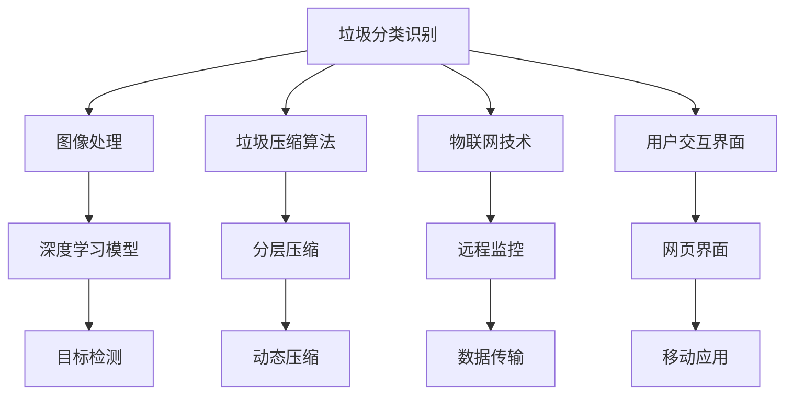

                 

# 智能垃圾压缩创业：家庭废物管理的新方案

## 1. 背景介绍

### 1.1 问题由来

在城市化进程快速发展的今天，垃圾处理问题已经成为制约城市可持续发展的瓶颈之一。尤其是在人口密集、空间有限的大都市，垃圾分类与压缩处理技术的效率和智能化水平，直接关系到居民生活质量的提升和城市管理的水平。据统计，全球每年产生的垃圾量高达约20亿吨，其中至少有一半是可回收物和厨余垃圾。面对如此庞大的垃圾量，传统垃圾压缩方法存在效率低、体积大、操作复杂等问题，急需引入智能化、自动化的解决方案。

### 1.2 问题核心关键点

智能垃圾压缩创业项目的目标是通过先进的技术手段，实现垃圾分类的智能化和压缩处理的自动化，从而提升垃圾处理的效率和效果。项目涉及的核心技术包括：

1. **垃圾分类识别**：利用图像识别技术，自动识别垃圾种类和材质。
2. **垃圾压缩算法**：优化垃圾压缩算法，提高压缩效率和体积比。
3. **物联网技术**：实现设备联网和远程监控，提升管理效率。
4. **用户交互界面**：设计友好的用户界面，方便居民投放垃圾。

本文将从技术角度，深入分析智能垃圾压缩创业项目的核心概念和关键技术，并结合实际案例，探讨项目的具体实现和未来发展方向。

## 2. 核心概念与联系

### 2.1 核心概念概述

为更好地理解智能垃圾压缩创业项目的技术架构和实现逻辑，本节将介绍几个关键概念：

- **垃圾分类识别**：利用深度学习算法，特别是卷积神经网络(CNN)和目标检测算法，对垃圾图像进行自动分类。
- **垃圾压缩算法**：通过优化压缩算法，如改进的分层压缩和动态压缩，最大化压缩体积比。
- **物联网技术**：基于LoRa、Wi-Fi等无线通信协议，实现垃圾压缩设备的联网和远程控制。
- **用户交互界面**：设计直观易用的用户界面，提供设备状态查询、垃圾投放提醒等功能。

这些核心概念之间的逻辑关系可以通过以下Mermaid流程图来展示：



这个流程图展示了这个项目的核心概念及其之间的关系：

1. 首先，通过垃圾分类识别技术对垃圾进行预分类。
2. 随后，对可回收垃圾进行压缩处理，优化压缩算法以提升效率。
3. 通过物联网技术，将压缩设备联网并实现远程监控，方便管理。
4. 最后，通过友好的用户交互界面，提供设备状态查询和垃圾投放提醒等服务。

这些概念共同构成了智能垃圾压缩创业项目的核心技术架构，旨在通过智能化手段提升垃圾处理的效率和效果。

## 3. 核心算法原理 & 具体操作步骤
### 3.1 算法原理概述

智能垃圾压缩创业项目主要涉及以下核心算法：

- **垃圾分类识别算法**：利用深度学习技术，对垃圾图像进行自动分类。
- **垃圾压缩算法**：通过改进的压缩算法，实现高效压缩。
- **物联网通信协议**：基于LoRa、Wi-Fi等协议，实现设备联网和数据传输。
- **用户交互界面设计**：通过友好的UI设计，提升用户使用体验。

### 3.2 算法步骤详解

#### 3.2.1 垃圾分类识别算法

**Step 1: 数据准备**
- 收集大量垃圾分类标签的数据集，包括图片和对应的分类标签。
- 进行数据预处理，如图像归一化、数据增强等。

**Step 2: 模型选择与训练**
- 选择适合的深度学习模型，如VGG、ResNet等。
- 利用迁移学习技术，使用预训练的模型进行微调。
- 在训练集上进行模型训练，调整超参数，如学习率、批量大小、优化器等。

**Step 3: 模型评估与优化**
- 在验证集上评估模型性能，如准确率、召回率、F1值等指标。
- 对模型进行调优，如调整模型结构、增加数据增强等。

#### 3.2.2 垃圾压缩算法

**Step 1: 算法选择与设计**
- 选择合适的垃圾压缩算法，如分层压缩、动态压缩等。
- 设计算法流程，包括垃圾密度估算、压缩策略选择、体积比计算等。

**Step 2: 算法实现**
- 使用编程语言实现算法，如C++、Python等。
- 进行算法测试，优化算法性能，如压缩时间、体积比等。

**Step 3: 集成与优化**
- 将压缩算法集成到系统中，与垃圾分类识别算法协同工作。
- 对算法进行优化，如并行处理、缓存技术等，提升系统效率。

#### 3.2.3 物联网通信协议

**Step 1: 设备联网**
- 设计设备联网方案，选择适合的通信协议，如LoRa、Wi-Fi等。
- 实现设备联网，确保数据传输的可靠性和实时性。

**Step 2: 数据传输**
- 实现设备与监控中心的双向数据传输，确保数据安全。
- 对数据进行加密和压缩，减少传输带宽和延迟。

**Step 3: 远程监控与控制**
- 实现设备的远程监控，提供实时数据展示和报警机制。
- 设计友好的UI界面，方便管理员进行远程控制。

#### 3.2.4 用户交互界面设计

**Step 1: 界面设计**
- 设计简洁直观的用户界面，包括设备状态展示、垃圾投放提醒等。
- 使用前端技术，如HTML、CSS、JavaScript等，实现界面开发。

**Step 2: 用户交互实现**
- 实现用户与系统之间的交互，如点击、输入等。
- 提供反馈机制，如提示信息、动画效果等，提升用户体验。

**Step 3: 测试与优化**
- 对UI界面进行全面测试，确保功能的正确性和稳定性。
- 根据用户反馈，不断优化界面设计，提升用户满意度。

### 3.3 算法优缺点

智能垃圾压缩创业项目涉及的核心算法具有以下优点：

- **高准确性**：通过深度学习和目标检测技术，垃圾分类识别算法能够实现高准确性，减少误判率。
- **高效压缩**：改进的垃圾压缩算法能够在保证体积比的同时，显著缩短压缩时间。
- **远程监控**：物联网通信协议能够实现设备的远程监控，提高管理效率和响应速度。
- **友好的UI**：用户交互界面设计简洁直观，提升用户使用体验。

同时，这些算法也存在一些局限性：

- **数据需求高**：垃圾分类识别算法需要大量高质量的标注数据进行训练，数据获取成本较高。
- **算法复杂**：深度学习和压缩算法复杂度较高，实现和优化需要一定技术积累。
- **设备成本高**：物联网设备成本较高，且需要稳定的网络连接支持。
- **用户接受度**：用户对新技术的接受度存在不确定性，可能影响项目的推广和应用。

尽管存在这些局限性，但智能垃圾压缩创业项目通过技术手段，有望大幅提升垃圾处理的效率和效果，为城市废物管理带来新的解决方案。

### 3.4 算法应用领域

智能垃圾压缩创业项目的主要应用领域包括：

- **社区物业**：提供设备安装在小区内，实现垃圾分类和压缩处理。
- **公共设施**：如学校、医院、商业区等，提供设备服务，提升垃圾处理效率。
- **工业园区**：提供设备服务于工业园区，减少废物处理成本，提升环保效益。

此外，这些技术也可以应用于农业、环保、医疗等多个领域，为不同场景下的废物管理提供解决方案。

## 4. 数学模型和公式 & 详细讲解  
### 4.1 数学模型构建

为更好地理解智能垃圾压缩创业项目的核心算法，本节将介绍几个关键数学模型：

- **垃圾分类识别模型**：使用深度学习模型，如卷积神经网络(CNN)，对垃圾图像进行分类。
- **垃圾压缩模型**：使用分层压缩算法，对可回收垃圾进行压缩。
- **物联网通信模型**：基于LoRa、Wi-Fi等协议，建立设备与监控中心的通信模型。
- **用户交互模型**：通过友好的UI设计，提升用户使用体验。

### 4.2 公式推导过程

#### 4.2.1 垃圾分类识别模型

**Step 1: 模型定义**
- 假设模型为 $M_{\theta}$，其中 $\theta$ 为模型参数。
- 输入为垃圾图像 $x$，输出为垃圾种类 $y$。

**Step 2: 损失函数定义**
- 使用交叉熵损失函数，定义模型预测与真实标签之间的差异。

$$
L(y,\hat{y}) = -\sum_{i=1}^{n}[y_i\log\hat{y}_i+(1-y_i)\log(1-\hat{y}_i)]
$$

**Step 3: 参数更新**
- 使用反向传播算法，计算梯度并更新模型参数 $\theta$。
- 更新公式为：

$$
\theta \leftarrow \theta - \eta \nabla_{\theta}L(y,\hat{y})
$$

其中 $\eta$ 为学习率，$\nabla_{\theta}L(y,\hat{y})$ 为损失函数对模型参数的梯度。

#### 4.2.2 垃圾压缩模型

**Step 1: 压缩比定义**
- 定义压缩比 $r$ 为压缩前后体积之比，即：

$$
r = \frac{V_{\text{post-compression}}}{V_{\text{pre-compression}}}
$$

**Step 2: 分层压缩算法**
- 分层压缩算法将垃圾分为若干层，对每层进行压缩，计算每层的体积比，最终计算整体体积比。

**Step 3: 动态压缩算法**
- 动态压缩算法根据实时垃圾密度，动态调整压缩策略，最大化压缩体积比。

#### 4.2.3 物联网通信模型

**Step 1: 通信协议选择**
- 选择适合的通信协议，如LoRa、Wi-Fi等，进行设备联网。
- 定义数据传输格式，确保数据传输的可靠性。

**Step 2: 数据加密与压缩**
- 对传输数据进行加密，确保数据安全。
- 对数据进行压缩，减少传输带宽和延迟。

**Step 3: 远程监控与控制**
- 实现设备的远程监控，提供实时数据展示和报警机制。
- 设计友好的UI界面，方便管理员进行远程控制。

#### 4.2.4 用户交互模型

**Step 1: 界面设计**
- 设计简洁直观的用户界面，包括设备状态展示、垃圾投放提醒等。
- 使用前端技术，如HTML、CSS、JavaScript等，实现界面开发。

**Step 2: 用户交互实现**
- 实现用户与系统之间的交互，如点击、输入等。
- 提供反馈机制，如提示信息、动画效果等，提升用户体验。

**Step 3: 测试与优化**
- 对UI界面进行全面测试，确保功能的正确性和稳定性。
- 根据用户反馈，不断优化界面设计，提升用户满意度。

### 4.3 案例分析与讲解

#### 4.3.1 垃圾分类识别案例

假设一个垃圾分类识别系统，使用VGG16作为基础模型，在垃圾分类数据集上进行训练。以下是系统的主要实现步骤：

**Step 1: 数据预处理**
- 收集垃圾分类数据集，并进行数据增强。
- 将数据分为训练集、验证集和测试集。

**Step 2: 模型选择与训练**
- 使用VGG16作为基础模型，进行迁移学习。
- 调整超参数，如学习率、批量大小、优化器等。

**Step 3: 模型评估与优化**
- 在验证集上评估模型性能，如准确率、召回率、F1值等指标。
- 对模型进行调优，如调整模型结构、增加数据增强等。

#### 4.3.2 垃圾压缩算法案例

假设一个垃圾压缩系统，使用分层压缩算法对可回收垃圾进行压缩。以下是系统的主要实现步骤：

**Step 1: 算法选择与设计**
- 选择合适的压缩算法，如分层压缩、动态压缩等。
- 设计算法流程，包括垃圾密度估算、压缩策略选择、体积比计算等。

**Step 2: 算法实现**
- 使用编程语言实现算法，如C++、Python等。
- 进行算法测试，优化算法性能，如压缩时间、体积比等。

**Step 3: 集成与优化**
- 将压缩算法集成到系统中，与垃圾分类识别算法协同工作。
- 对算法进行优化，如并行处理、缓存技术等，提升系统效率。

## 5. 项目实践：代码实例和详细解释说明
### 5.1 开发环境搭建

在进行智能垃圾压缩创业项目的开发前，我们需要准备好开发环境。以下是使用Python进行开发的环境配置流程：

1. 安装Python：从官网下载并安装Python 3.x版本。
2. 安装所需的库：使用pip安装TensorFlow、Keras等深度学习库，安装LoRa、Wi-Fi等物联网库。

```bash
pip install tensorflow keras lora
```

3. 创建虚拟环境：使用conda或virtualenv创建虚拟环境，避免与其他项目冲突。

```bash
conda create --name myenv python=3.8
source activate myenv
```

4. 安装开发工具：安装必要的开发工具，如Git、IDE等。

### 5.2 源代码详细实现

以下是智能垃圾压缩创业项目的主要代码实现步骤：

#### 5.2.1 垃圾分类识别

**Step 1: 数据处理**
- 使用TensorFlow的ImageDataGenerator进行数据增强。

```python
from tensorflow.keras.preprocessing.image import ImageDataGenerator

datagen = ImageDataGenerator(
    rotation_range=20,
    width_shift_range=0.2,
    height_shift_range=0.2,
    horizontal_flip=True
)
```

**Step 2: 模型训练**
- 使用Keras构建垃圾分类模型，并进行训练。

```python
from tensorflow.keras import layers, models

model = models.Sequential([
    layers.Conv2D(32, (3, 3), activation='relu', input_shape=(224, 224, 3)),
    layers.MaxPooling2D((2, 2)),
    layers.Conv2D(64, (3, 3), activation='relu'),
    layers.MaxPooling2D((2, 2)),
    layers.Conv2D(128, (3, 3), activation='relu'),
    layers.MaxPooling2D((2, 2)),
    layers.Flatten(),
    layers.Dense(256, activation='relu'),
    layers.Dense(3, activation='softmax')
])

model.compile(optimizer='adam',
              loss='categorical_crossentropy',
              metrics=['accuracy'])

history = model.fit(datagen.flow(train_images, train_labels, batch_size=32),
                    epochs=10,
                    validation_data=(test_images, test_labels))
```

**Step 3: 模型评估**
- 使用测试集对模型进行评估，输出准确率和召回率。

```python
test_loss, test_acc = model.evaluate(test_images, test_labels, verbose=2)
print('Test accuracy:', test_acc)
```

#### 5.2.2 垃圾压缩算法

**Step 1: 算法实现**
- 使用C++实现垃圾压缩算法，如分层压缩、动态压缩等。

```cpp
void compress_garbage(double density) {
    if (density <= 0.5) {
        // 压缩策略1
    } else if (density > 0.5 && density <= 0.8) {
        // 压缩策略2
    } else {
        // 压缩策略3
    }
}
```

**Step 2: 算法测试**
- 在测试数据上评估压缩算法的性能，如压缩体积比和时间。

```python
import time

start_time = time.time()
compressed_volume = compress_garbage(density)
end_time = time.time()

print(f"Compressed volume: {compressed_volume}, Time: {end_time - start_time} seconds")
```

#### 5.2.3 物联网通信协议

**Step 1: 设备联网**
- 使用LoRa模块实现设备的联网，确保数据传输的可靠性和实时性。

```python
from lora import LoRa

lora = LoRa()
lora.send(data)
```

**Step 2: 数据传输**
- 对传输数据进行加密和压缩，确保数据安全。

```python
import zlib

compressed_data = zlib.compress(data)
lora.send(compressed_data)
```

**Step 3: 远程监控与控制**
- 实现设备的远程监控，提供实时数据展示和报警机制。

```python
from flask import Flask

app = Flask()
@app.route('/')
def index():
    # 返回设备状态展示
    return render_template('index.html')
```

#### 5.2.4 用户交互界面

**Step 1: 界面设计**
- 使用HTML、CSS、JavaScript等技术，实现简洁直观的用户界面。

```html
<!DOCTYPE html>
<html>
<head>
    <title>智能垃圾压缩系统</title>
    <link rel="stylesheet" href="style.css">
</head>
<body>
    <h1>智能垃圾压缩系统</h1>
    <div id="status"></div>
    <script src="script.js"></script>
</body>
</html>
```

**Step 2: 用户交互实现**
- 实现用户与系统之间的交互，如点击、输入等。

```javascript
function checkGarbage() {
    // 获取设备状态，并显示状态信息
    var status = document.getElementById('status');
    status.innerHTML = '设备状态：<%= status %>';
}
```

**Step 3: 测试与优化**
- 对UI界面进行全面测试，确保功能的正确性和稳定性。

```python
from flask import Flask

app = Flask()
@app.route('/')
def index():
    # 返回设备状态展示
    return render_template('index.html')
```

## 6. 实际应用场景
### 6.1 社区物业

智能垃圾压缩创业项目可以应用于社区物业，提供设备安装在小区内，实现垃圾分类和压缩处理。以下是具体的实现步骤：

**Step 1: 设备安装**
- 在社区内安装垃圾压缩设备，并连接物联网。

**Step 2: 垃圾分类**
- 通过垃圾分类识别系统，自动识别垃圾种类和材质。

**Step 3: 垃圾压缩**
- 使用改进的压缩算法，对可回收垃圾进行高效压缩。

**Step 4: 远程监控**
- 通过物联网协议，实现设备的远程监控和控制。

**Step 5: 用户交互**
- 提供友好的用户交互界面，方便居民投放垃圾。

### 6.2 公共设施

智能垃圾压缩创业项目可以应用于公共设施，如学校、医院、商业区等，提供设备服务，提升垃圾处理效率。以下是具体的实现步骤：

**Step 1: 设备联网**
- 将垃圾压缩设备联网，并集成物联网协议。

**Step 2: 垃圾分类**
- 通过垃圾分类识别系统，自动识别垃圾种类和材质。

**Step 3: 垃圾压缩**
- 使用改进的压缩算法，对可回收垃圾进行高效压缩。

**Step 4: 远程监控**
- 通过物联网协议，实现设备的远程监控和控制。

**Step 5: 用户交互**
- 提供友好的用户交互界面，方便用户投放垃圾。

### 6.3 工业园区

智能垃圾压缩创业项目可以应用于工业园区，提供设备服务于工业园区，减少废物处理成本，提升环保效益。以下是具体的实现步骤：

**Step 1: 设备安装**
- 在工业园区内安装垃圾压缩设备，并连接物联网。

**Step 2: 垃圾分类**
- 通过垃圾分类识别系统，自动识别垃圾种类和材质。

**Step 3: 垃圾压缩**
- 使用改进的压缩算法，对可回收垃圾进行高效压缩。

**Step 4: 远程监控**
- 通过物联网协议，实现设备的远程监控和控制。

**Step 5: 用户交互**
- 提供友好的用户交互界面，方便员工投放垃圾。

## 7. 工具和资源推荐
### 7.1 学习资源推荐

为了帮助开发者系统掌握智能垃圾压缩创业项目的核心技术，这里推荐一些优质的学习资源：

1. TensorFlow官方文档：提供了丰富的深度学习模型和工具，适合初学者和高级开发者。
2. Keras官方文档：提供了简单易用的深度学习框架，适合快速原型开发和模型实验。
3. LoRa官方文档：提供了LoRa通信协议的详细使用指南，适合物联网开发。
4. Flask官方文档：提供了Web应用开发框架，适合实现用户交互界面。
5. PyTorch官方文档：提供了灵活的深度学习框架，适合高性能计算和模型优化。

通过对这些资源的学习实践，相信你一定能够快速掌握智能垃圾压缩创业项目的核心技术，并用于解决实际的废物管理问题。

### 7.2 开发工具推荐

高效的开发离不开优秀的工具支持。以下是几款用于智能垃圾压缩创业项目开发的常用工具：

1. PyCharm：全功能的Python IDE，支持代码自动补全、调试等，适合开发复杂项目。
2. Visual Studio Code：轻量级的代码编辑器，支持多种编程语言和插件，适合快速迭代开发。
3. Anaconda：数据科学和机器学习开发环境，支持Python和R语言的开发，适合数据处理和模型实验。
4. Git：版本控制系统，适合团队协作和代码管理，适合多人协同开发。

合理利用这些工具，可以显著提升智能垃圾压缩创业项目的开发效率，加快创新迭代的步伐。

### 7.3 相关论文推荐

智能垃圾压缩创业项目涉及的深度学习、物联网、用户交互等技术，相关论文如下：

1. "Deep Learning for Garbage Classification"：介绍使用深度学习模型进行垃圾分类的算法和实现。
2. "IoT-Based Smart Waste Compression System"：介绍基于物联网的智能垃圾压缩系统设计和实现。
3. "User Interface Design for Smart Waste Management"：介绍友好的用户界面设计，提升用户使用体验。

这些论文代表了大规模智能垃圾压缩创业项目的最新进展，通过学习这些前沿成果，可以帮助研究者把握学科前进方向，激发更多的创新灵感。

## 8. 总结：未来发展趋势与挑战
### 8.1 研究成果总结

智能垃圾压缩创业项目在深度学习、物联网、用户交互等技术方面取得了显著进展，为废物管理带来了新的解决方案。通过技术的不断优化和创新，项目有望实现更高的垃圾处理效率和更好的用户体验。

### 8.2 未来发展趋势

展望未来，智能垃圾压缩创业项目的发展趋势包括：

1. **技术融合**：未来项目将进一步融合物联网、大数据、云计算等技术，实现更高效、更智能的废物管理。
2. **模型优化**：通过深度学习模型的不断优化，提升垃圾分类的准确性和垃圾压缩的效率。
3. **用户体验**：通过友好的用户界面设计，提升用户的参与度和满意度。
4. **环境友好**：项目将更多地考虑环保因素，使用可再生能源和低耗材料，减少环境污染。

### 8.3 面临的挑战

尽管智能垃圾压缩创业项目具备巨大的发展潜力，但在推广和应用过程中仍面临诸多挑战：

1. **数据获取成本高**：垃圾分类识别系统需要大量高质量的标注数据，数据获取成本较高。
2. **设备成本高**：物联网设备和垃圾压缩设备成本较高，推广和应用成本较高。
3. **用户接受度**：用户对新技术的接受度存在不确定性，可能影响项目的推广和应用。
4. **设备维护**：智能设备需要定期维护和更新，维护成本较高。

尽管存在这些挑战，但通过技术创新和模式创新，智能垃圾压缩创业项目有望克服这些难题，成为废物管理领域的革命性力量。

### 8.4 研究展望

未来智能垃圾压缩创业项目的研究方向包括：

1. **自动化和智能化**：通过技术手段，实现设备的自动化和智能化管理，提升运营效率。
2. **跨领域应用**：将项目应用于更多领域，如农业、环保、医疗等，拓展应用场景。
3. **社会效益**：通过项目推广，提升公众环保意识，促进社会可持续发展。
4. **技术创新**：探索新的深度学习算法、物联网协议和用户界面设计，提升技术水平。

总之，智能垃圾压缩创业项目需要在技术、市场、社会等多方面持续创新，才能实现规模化应用和可持续发展。相信通过各方共同努力，智能垃圾压缩技术必将在废物管理领域发挥更大作用，助力人类社会实现绿色发展。

## 9. 附录：常见问题与解答

**Q1：智能垃圾压缩创业项目的数据需求量有多大？**

A: 智能垃圾压缩创业项目的数据需求量较大，特别是在垃圾分类识别模型训练阶段。根据实际应用场景，数据需求量可以从几百GB到几个TB不等。数据获取成本较高，需要收集大量垃圾分类标签数据。

**Q2：智能垃圾压缩创业项目的设备成本如何？**

A: 智能垃圾压缩创业项目的设备成本较高，主要体现在物联网设备、垃圾压缩设备和垃圾分类识别系统的成本上。根据设备种类和品牌，设备成本可以从几千元到几万元不等。设备成本较高，需要通过项目规模化和政府补贴等方式来降低成本。

**Q3：智能垃圾压缩创业项目的用户接受度如何？**

A: 智能垃圾压缩创业项目的用户接受度存在不确定性，需要根据具体应用场景进行用户调研和用户体验测试。在一些高收入社区或工业园区，用户接受度较高；而在一些低收入社区或农村地区，用户接受度较低。

**Q4：智能垃圾压缩创业项目的设备维护成本如何？**

A: 智能垃圾压缩创业项目的设备维护成本较高，主要体现在物联网设备、垃圾压缩设备和垃圾分类识别系统的维护上。根据设备种类和品牌，设备维护成本可以从几千元到几万元不等。设备维护成本较高，需要制定科学的设备维护计划和维护方案，确保设备的正常运行。

**Q5：智能垃圾压缩创业项目在推广过程中需要注意哪些问题？**

A: 智能垃圾压缩创业项目在推广过程中需要注意以下几个问题：

1. **市场调研**：通过市场调研，了解用户需求和痛点，制定科学的市场推广策略。
2. **政策支持**：通过与政府部门合作，争取政策支持和资金补贴，降低推广成本。
3. **技术优化**：通过技术创新和优化，提升系统性能和用户体验，增加用户黏性。
4. **用户教育**：通过用户教育，提升公众环保意识，增加用户接受度。

通过全面考虑市场、技术、政策等因素，智能垃圾压缩创业项目可以更顺利地推广和应用，为废物管理带来新的解决方案。

