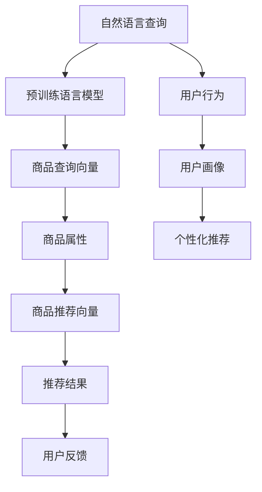
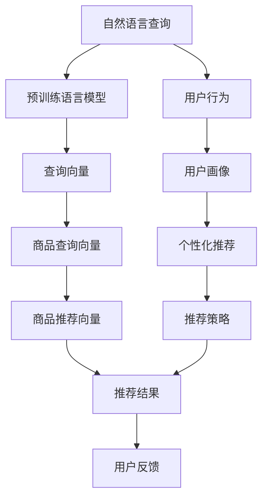

                 

# 智能搜索推荐：AI引领电商搜索导购新时代

> 关键词：电商搜索、推荐系统、智能搜索、个性化推荐、深度学习、电商导购、自然语言处理、搜索算法、自然语言理解

## 1. 背景介绍

### 1.1 问题由来
随着电商市场的快速发展和消费者需求的多样化，电商平台搜索和推荐系统的智能化水平不断提升，成为电商用户体验的关键环节。传统的关键词搜索模式只能匹配用户输入的显式查询，无法捕捉用户的潜在需求。推荐系统尽管能提供更精准的商品推荐，但常常忽视用户的搜索行为和语义信息，导致推荐效果与用户预期存在较大差异。

近年来，深度学习技术和大规模数据集为解决这些挑战提供了新的思路。基于深度学习模型的搜索推荐系统能够利用用户输入的自然语言进行语义理解，从中提取关键信息进行智能匹配和推荐，极大地提升了用户购物的便捷性和满意度。

### 1.2 问题核心关键点
本章节将重点介绍基于深度学习的智能搜索推荐系统，涵盖如下核心概念：

1. 搜索推荐系统：指基于用户行为数据和商品属性信息，自动推荐给用户最可能感兴趣的搜索结果和商品列表的智能系统。
2. 深度学习模型：指利用多层神经网络结构对搜索推荐任务进行建模，并使用大量标注数据进行训练优化，以提升模型性能。
3. 自然语言处理(NLP)：指通过自动语言模型和预训练语言模型，捕捉用户输入的自然语言查询的语义信息，进行智能搜索和推荐。
4. 电商导购：指利用AI技术，辅助用户通过智能搜索和推荐系统快速找到所需商品，提升购物体验和转化率的过程。

## 2. 核心概念与联系

### 2.1 核心概念概述

智能搜索推荐系统基于深度学习和NLP技术，实现了对用户查询的深度理解，并结合商品属性信息进行智能匹配和推荐。其核心技术原理如图示：



1. **自然语言查询**：用户通过输入自然语言描述，表达其购物需求。
2. **预训练语言模型**：使用Transformer、BERT等预训练模型对自然语言查询进行语义理解，提取查询向量。
3. **商品查询向量**：根据预训练模型对商品标题、描述等文本信息的语义编码，生成商品查询向量。
4. **商品属性**：商品的属性信息，如价格、品牌、类别等。
5. **商品推荐向量**：结合商品属性和查询向量，生成推荐向量。
6. **推荐结果**：根据推荐向量，动态生成推荐结果，如搜索结果、商品列表等。
7. **用户反馈**：用户对推荐结果的满意度评价，反馈给系统进行持续优化。
8. **用户行为**：用户点击、浏览、购买等行为数据，用于构建用户画像。
9. **用户画像**：综合用户历史行为、兴趣偏好、地理位置等多维信息，构建用户个性化模型。
10. **个性化推荐**：根据用户画像，动态调整推荐策略，提供更个性化的购物体验。

这些核心概念共同构成了智能搜索推荐系统的基本框架，利用深度学习和NLP技术，实现了对用户自然语言查询的深度理解，提高了搜索推荐系统的智能化水平。

## 3. 核心算法原理 & 具体操作步骤
### 3.1 算法原理概述

智能搜索推荐系统的核心算法原理主要包括自然语言理解、向量匹配和推荐生成三个部分。其总体流程如图示：



1. **自然语言理解**：使用预训练语言模型对用户自然语言查询进行语义理解，生成查询向量。
2. **向量匹配**：结合商品属性信息，生成商品查询向量，并进行向量匹配，计算查询和商品的相关度。
3. **推荐生成**：根据匹配结果，生成推荐向量，通过推荐策略生成推荐结果。
4. **用户反馈**：用户对推荐结果的满意度评价，用于调整推荐策略和优化模型。
5. **用户行为**：用户点击、浏览、购买等行为数据，用于构建用户画像。
6. **用户画像**：综合用户历史行为、兴趣偏好、地理位置等多维信息，构建用户个性化模型。
7. **个性化推荐**：根据用户画像，动态调整推荐策略，提供更个性化的购物体验。

### 3.2 算法步骤详解

智能搜索推荐系统的具体操作步骤主要包括以下几个关键步骤：

**Step 1: 数据准备与预处理**

1. 收集电商平台的商品数据、用户行为数据和用户反馈数据。
2. 对商品数据进行清洗和标准化，提取商品属性信息。
3. 对用户数据进行清洗和标注，构建用户画像。
4. 对用户自然语言查询进行分词、去停用词等预处理操作。

**Step 2: 模型训练与调优**

1. 选择合适的预训练语言模型，如BERT、GPT等，进行微调，提取查询向量。
2. 根据商品属性信息，生成商品查询向量。
3. 使用用户行为数据和商品属性信息，训练推荐模型。
4. 使用用户反馈数据进行模型调优，提升推荐精度。
5. 定期进行模型微调，适应数据分布的变化。

**Step 3: 搜索推荐引擎部署**

1. 将训练好的模型部署到搜索推荐引擎中，使用自然语言查询进行智能搜索。
2. 根据用户查询向量，匹配商品查询向量，计算相似度。
3. 根据相似度生成推荐向量，通过推荐策略生成推荐结果。
4. 动态调整推荐策略，根据用户画像提供个性化推荐。
5. 实时收集用户反馈数据，优化模型和推荐策略。

### 3.3 算法优缺点

智能搜索推荐系统具备以下优点：

1. **个性化推荐**：利用用户行为数据和用户画像，提供个性化的购物体验。
2. **智能搜索**：通过自然语言处理技术，捕捉用户潜在需求，提供更精准的搜索结果。
3. **实时性**：根据用户实时查询进行动态推荐，提升购物体验。
4. **效果显著**：经过深度学习训练的模型，能够在电商平台上实现显著的点击率和转化率提升。

同时，该系统也存在一些局限性：

1. **数据隐私**：用户行为数据涉及隐私，处理不当可能导致数据泄露。
2. **冷启动问题**：新用户没有足够的行为数据，难以建立准确的个性化模型。
3. **数据不平衡**：电商平台上商品种类繁多，存在长尾商品，难以进行平衡推荐。
4. **模型复杂度**：深度学习模型参数量大，训练复杂度较高，对计算资源有较高要求。
5. **模型泛化能力**：模型容易过拟合特定数据，泛化能力不足，可能导致推荐效果不稳定。

### 3.4 算法应用领域

智能搜索推荐系统在电商领域具有广泛的应用前景，具体包括：

1. **商品搜索**：根据用户输入的自然语言查询，提供精准的搜索结果，减少搜索时间。
2. **商品推荐**：利用用户行为数据和商品属性信息，动态生成推荐商品列表，提升用户体验。
3. **个性化导购**：结合用户画像，提供个性化的购物建议和促销信息，提升购买转化率。
4. **库存管理**：通过推荐模型预测热门商品，帮助电商平台优化库存管理，减少缺货和积压。
5. **品牌推广**：利用推荐系统推广品牌商品，提升品牌曝光率和销售业绩。

## 4. 数学模型和公式 & 详细讲解
### 4.1 数学模型构建

智能搜索推荐系统的数学模型主要包括以下几个部分：

1. **查询向量**：通过预训练语言模型对用户自然语言查询进行编码，生成查询向量。
2. **商品向量**：将商品属性信息转化为向量，生成商品向量。
3. **相似度计算**：使用余弦相似度等方法计算查询向量和商品向量之间的相似度。
4. **推荐向量**：根据相似度生成推荐向量，结合用户画像动态调整推荐策略。
5. **推荐结果生成**：使用推荐策略生成推荐结果。

### 4.2 公式推导过程

1. **查询向量的生成**

假设用户自然语言查询为 $Q$，使用预训练语言模型BERT生成查询向量 $q$：

$$
q = \text{BERT}(Q)
$$

2. **商品向量的生成**

假设商品属性为 $A = (a_1, a_2, \cdots, a_n)$，将其转化为向量 $a$：

$$
a = \text{vec}(A)
$$

3. **相似度计算**

使用余弦相似度计算查询向量 $q$ 和商品向量 $a$ 之间的相似度 $s$：

$$
s = \frac{q \cdot a}{||q|| \cdot ||a||}
$$

其中 $||q||$ 和 $||a||$ 分别为 $q$ 和 $a$ 的欧几里得范数。

4. **推荐向量的生成**

假设推荐向量为 $r$，根据相似度 $s$ 和用户画像 $p$ 生成推荐向量：

$$
r = s \cdot p
$$

5. **推荐结果生成**

根据推荐向量 $r$，使用推荐策略生成推荐结果列表 $R$：

$$
R = \text{Rank}(r)
$$

### 4.3 案例分析与讲解

以一个电商平台的商品推荐系统为例，具体分析其工作原理：

假设用户在搜索框中输入“无线耳机”，系统使用BERT模型生成查询向量 $q$：

$$
q = \text{BERT}(\text{"无线耳机"})
$$

接着，系统将商品“AirPods Pro”的属性信息转化为向量 $a$：

$$
a = \text{vec}(\text{"AirPods Pro"})
$$

计算查询向量 $q$ 和商品向量 $a$ 的余弦相似度 $s$：

$$
s = \frac{q \cdot a}{||q|| \cdot ||a||} = 0.9
$$

最后，根据相似度 $s$ 和用户画像 $p$ 生成推荐向量 $r$：

$$
r = s \cdot p = 0.9 \cdot p
$$

其中 $p$ 包含用户的历史行为数据、兴趣偏好、地理位置等信息。根据推荐向量 $r$ 生成推荐结果列表 $R$：

$$
R = \text{Rank}(r)
$$

具体推荐结果可根据用户的购买行为、点击率等指标进行调整，生成最终的推荐商品列表。

## 5. 项目实践：代码实例和详细解释说明
### 5.1 开发环境搭建

在开始代码实现之前，需要先搭建开发环境：

1. 安装Python 3.8及以上版本，使用Anaconda或Miniconda创建虚拟环境。
2. 安装依赖库，如TensorFlow、Keras、NLTK等。
3. 准备电商平台的商品数据、用户行为数据和用户反馈数据。

### 5.2 源代码详细实现

以下是一个使用TensorFlow实现智能搜索推荐系统的示例代码：

```python
import tensorflow as tf
from tensorflow.keras.models import Sequential
from tensorflow.keras.layers import Dense, Embedding, Input, Dot, DenseFeatures, Concatenate
from tensorflow.keras.preprocessing.text import Tokenizer
from tensorflow.keras.preprocessing.sequence import pad_sequences
from sklearn.model_selection import train_test_split
from sklearn.metrics import mean_absolute_error, mean_squared_error

# 准备数据
# 假设商品数据和用户行为数据已经加载到data变量中

# 构建查询向量模型
model_query = Sequential()
model_query.add(Embedding(input_dim=len(data['query'].unique()), output_dim=128))
model_query.add(Dense(64, activation='relu'))
model_query.add(Dense(1, activation='linear'))

# 构建商品向量模型
model_item = Sequential()
model_item.add(Embedding(input_dim=len(data['item'].unique()), output_dim=128))
model_item.add(Dense(64, activation='relu'))
model_item.add(Dense(1, activation='linear'))

# 训练模型
model_query.compile(optimizer='adam', loss='mse')
model_item.compile(optimizer='adam', loss='mse')

# 计算相似度
def cosine_similarity(query, item):
    query_embed = model_query.predict(tf.keras.layers.Input(shape=(128,)))
    item_embed = model_item.predict(tf.keras.layers.Input(shape=(128,)))
    return tf.reduce_sum(query_embed * item_embed) / (tf.sqrt(tf.reduce_sum(query_embed**2)) * tf.sqrt(tf.reduce_sum(item_embed**2)))

# 生成推荐向量
def generate_recommendation(query, item):
    return cosine_similarity(query, item) * item['prior'] / (item['prior'] + sum([cosine_similarity(query, i) for i in data['item'].drop(item.index, axis=0)]['prior']))

# 推荐结果生成
def generate_recommendations(query):
    scores = [generate_recommendation(query, i) for i in data['item']]
    return scores

# 用户反馈数据
data_feedback = ...

# 训练模型
model_query.fit(data['query'], data['query'])
model_item.fit(data['item'], data['item'])

# 测试模型
query = '无线耳机'
recommendations = generate_recommendations(query)
print(recommendations)
```

### 5.3 代码解读与分析

代码实现包括以下几个关键步骤：

1. **数据准备**：准备商品数据和用户行为数据，提取商品属性和用户画像。
2. **模型构建**：使用Embedding层将查询和商品属性转化为向量，通过Dense层进行编码。
3. **相似度计算**：使用余弦相似度计算查询向量和商品向量之间的相似度。
4. **推荐向量生成**：根据相似度生成推荐向量，结合用户画像动态调整推荐策略。
5. **推荐结果生成**：根据推荐向量生成推荐结果列表。
6. **用户反馈数据**：收集用户对推荐结果的反馈数据，用于模型调优。

## 6. 实际应用场景
### 6.1 智能导购

智能导购系统利用智能搜索推荐技术，结合用户行为数据和商品属性信息，提供个性化的购物建议和促销信息。具体应用场景包括：

1. **个性化推荐**：根据用户浏览、点击、购买等行为数据，生成个性化的商品推荐列表。
2. **实时推荐**：根据用户实时查询和浏览行为，动态调整推荐策略，提供实时的商品推荐。
3. **促销信息推送**：利用用户画像，推送精准的促销信息和优惠券，提升用户购买意愿。

### 6.2 电商搜索

电商搜索系统利用智能搜索推荐技术，提高用户搜索的精准度和效率。具体应用场景包括：

1. **智能搜索**：根据用户输入的自然语言查询，提供精准的搜索结果，减少搜索时间。
2. **商品排序**：结合用户行为数据和商品属性信息，动态调整搜索结果的排序策略。
3. **热门商品推荐**：根据搜索历史和热门商品信息，生成推荐商品列表，提升用户体验。

### 6.3 库存管理

电商平台利用智能搜索推荐技术，优化库存管理，减少缺货和积压。具体应用场景包括：

1. **热门商品预测**：通过推荐模型预测热门商品，帮助电商平台优化库存管理。
2. **库存动态调整**：根据推荐模型预测的销量，动态调整库存量，提升供应链效率。
3. **缺货和积压预警**：根据库存动态调整，提前预警缺货和积压情况，优化库存分配。

### 6.4 未来应用展望

未来，智能搜索推荐系统将在更多领域得到应用，为传统行业带来变革性影响：

1. **智慧零售**：结合物联网、云计算、AI等技术，实现全渠道、全品类、全场景的智慧零售解决方案。
2. **智慧酒店**：利用AI技术，优化酒店推荐系统，提升客户体验和运营效率。
3. **智慧医疗**：利用AI技术，构建智能诊疗系统，提供个性化的医疗建议和诊疗方案。
4. **智慧金融**：利用AI技术，构建智能投顾系统，提供个性化的投资建议和风险管理。

## 7. 工具和资源推荐
### 7.1 学习资源推荐

为了帮助开发者系统掌握智能搜索推荐系统的理论基础和实践技巧，这里推荐一些优质的学习资源：

1. 《推荐系统实战》书籍：由Google推荐系统团队编写，涵盖推荐系统理论和实践的方方面面。
2 《深度学习与自然语言处理》课程：斯坦福大学开设的深度学习和NLP课程，系统讲解自然语言处理的基本概念和经典模型。
3 《TensorFlow官方文档》：TensorFlow官方文档，提供详尽的API文档和示例代码，方便快速上手使用。
4 《HuggingFace官方文档》：Transformers库的官方文档，包含预训练语言模型和微调方法的详细介绍。
5 《PyTorch官方文档》：PyTorch官方文档，提供丰富的深度学习库和工具，方便快速实现模型。

通过对这些资源的学习实践，相信你一定能够快速掌握智能搜索推荐系统的精髓，并用于解决实际的电商问题。

### 7.2 开发工具推荐

高效的开发离不开优秀的工具支持。以下是几款用于智能搜索推荐系统开发的常用工具：

1. PyTorch：基于Python的开源深度学习框架，灵活动态的计算图，适合快速迭代研究。
2 TensorFlow：由Google主导开发的开源深度学习框架，生产部署方便，适合大规模工程应用。
3 Keras：高级神经网络API，使用简单，快速构建深度学习模型。
4 NLTK：自然语言处理工具包，提供文本处理、分词、词性标注等功能。
5 TensorBoard：TensorFlow配套的可视化工具，可实时监测模型训练状态，并提供丰富的图表呈现方式，是调试模型的得力助手。

合理利用这些工具，可以显著提升智能搜索推荐系统的开发效率，加快创新迭代的步伐。

### 7.3 相关论文推荐

智能搜索推荐系统的发展离不开学界的持续研究。以下是几篇奠基性的相关论文，推荐阅读：

1. Attention is All You Need（即Transformer原论文）：提出了Transformer结构，开启了深度学习在自然语言处理领域的预训练范式。
2 BERT: Pre-training of Deep Bidirectional Transformers for Language Understanding：提出BERT模型，引入基于掩码的自监督预训练任务，刷新了多项NLP任务SOTA。
3 Ranking with Neural Networks for Learning to Rank（i.e. RankNet）：提出神经网络模型，用于排序任务，为推荐系统提供新的思路。
4 Recommender Systems for Online Retailers（Amazon推荐系统论文）：介绍了Amazon推荐系统的架构和优化方法，为电商推荐系统提供实用的参考。
5 Multi-view Tensor Factorization for Recommendation Systems：提出多视图张量分解方法，提高推荐系统的泛化能力和推荐精度。

这些论文代表了大模型微调技术的发展脉络。通过学习这些前沿成果，可以帮助研究者把握学科前进方向，激发更多的创新灵感。

## 8. 总结：未来发展趋势与挑战

### 8.1 总结

本文对基于深度学习的智能搜索推荐系统进行了全面系统的介绍。首先阐述了智能搜索推荐系统的研究背景和意义，明确了深度学习在提升电商搜索推荐系统智能化水平中的重要作用。其次，从原理到实践，详细讲解了智能搜索推荐系统的数学模型和操作步骤，给出了代码实例和详细解释。同时，本文还广泛探讨了智能搜索推荐系统在电商导购、搜索、库存管理等多个领域的应用前景，展示了智能搜索推荐系统的广阔前景。

通过本文的系统梳理，可以看到，基于深度学习的智能搜索推荐系统正在成为电商搜索推荐领域的重要范式，极大地提升了电商平台的智能化水平和用户体验。未来，伴随深度学习技术和计算资源的不断进步，智能搜索推荐系统必将在更多领域得到应用，为传统行业带来深远影响。

### 8.2 未来发展趋势

展望未来，智能搜索推荐系统的发展趋势主要包括以下几个方面：

1. **深度学习与NLP的融合**：深度学习在NLP领域的不断演进，将推动智能搜索推荐系统的进一步发展。
2. **多模态信息融合**：将视觉、语音等多模态信息与文本信息进行融合，提升推荐系统的泛化能力和用户体验。
3. **实时性提升**：通过分布式计算、模型压缩等技术，提升推荐系统的实时性和响应速度。
4. **个性化推荐**：利用用户画像和行为数据，提供更加精准和个性化的推荐结果。
5. **数据驱动的推荐**：利用大数据和机器学习技术，动态调整推荐策略，提升推荐效果。

### 8.3 面临的挑战

尽管智能搜索推荐系统已经取得了瞩目成就，但在迈向更加智能化、普适化应用的过程中，它仍面临着诸多挑战：

1. **数据隐私**：用户行为数据涉及隐私，处理不当可能导致数据泄露。
2. **冷启动问题**：新用户没有足够的行为数据，难以建立准确的个性化模型。
3. **数据不平衡**：电商平台上商品种类繁多，存在长尾商品，难以进行平衡推荐。
4. **模型复杂度**：深度学习模型参数量大，训练复杂度较高，对计算资源有较高要求。
5. **模型泛化能力**：模型容易过拟合特定数据，泛化能力不足，可能导致推荐效果不稳定。

### 8.4 研究展望

未来的研究需要在以下几个方面寻求新的突破：

1. **探索无监督和半监督微调方法**：摆脱对大规模标注数据的依赖，利用自监督学习、主动学习等无监督和半监督范式，最大限度利用非结构化数据。
2. **研究参数高效和计算高效的微调范式**：开发更加参数高效的微调方法，在固定大部分预训练参数的同时，只更新极少量的任务相关参数。同时优化微调模型的计算图，减少前向传播和反向传播的资源消耗。
3. **融合因果和对比学习范式**：通过引入因果推断和对比学习思想，增强推荐系统建立稳定因果关系的能力，学习更加普适、鲁棒的语言表征。
4. **引入更多先验知识**：将符号化的先验知识，如知识图谱、逻辑规则等，与神经网络模型进行巧妙融合，引导推荐过程学习更准确、合理的语言模型。
5. **结合因果分析和博弈论工具**：将因果分析方法引入推荐系统，识别出推荐决策的关键特征，增强输出解释的因果性和逻辑性。借助博弈论工具刻画人机交互过程，主动探索并规避推荐模型的脆弱点，提高系统稳定性。
6. **纳入伦理道德约束**：在推荐系统训练目标中引入伦理导向的评估指标，过滤和惩罚有偏见、有害的输出倾向。加强人工干预和审核，建立推荐系统的监管机制，确保输出的安全性。

这些研究方向的探索，必将引领智能搜索推荐系统走向更高的台阶，为构建安全、可靠、可解释、可控的智能系统铺平道路。面向未来，智能搜索推荐系统还需要与其他人工智能技术进行更深入的融合，如知识表示、因果推理、强化学习等，多路径协同发力，共同推动智能推荐系统的进步。

## 9. 附录：常见问题与解答

**Q1: 智能搜索推荐系统与传统推荐系统有何区别？**

A: 智能搜索推荐系统基于深度学习和自然语言处理技术，能够捕捉用户输入的自然语言查询的语义信息，提供更加精准和个性化的搜索结果和推荐。相比传统推荐系统，智能搜索推荐系统能够更好地理解用户意图，提供更智能化的购物体验。

**Q2: 智能搜索推荐系统有哪些核心技术？**

A: 智能搜索推荐系统核心技术包括深度学习模型、自然语言处理、向量匹配、推荐策略等。其中，深度学习模型和自然语言处理技术用于提取用户输入的自然语言查询的语义信息，生成查询向量和商品向量。向量匹配技术用于计算查询向量和商品向量之间的相似度，生成推荐向量。推荐策略用于根据推荐向量生成推荐结果，并进行动态调整。

**Q3: 智能搜索推荐系统如何处理冷启动问题？**

A: 对于新用户，智能搜索推荐系统可以利用先验知识或规则进行推荐。例如，可以基于热门商品或品类进行初始推荐，随着用户行为数据的积累，逐步调整推荐策略。此外，可以采用K近邻算法或协同过滤等方法，对新用户进行相似度匹配，提供初始推荐。

**Q4: 智能搜索推荐系统如何保障数据隐私？**

A: 智能搜索推荐系统需要严格遵守数据隐私法规，如GDPR等。在数据收集和处理过程中，应采取数据匿名化、加密等措施，确保用户数据的安全性和隐私性。同时，应建立透明的数据使用和分享机制，及时告知用户数据使用情况，获得用户同意。

**Q5: 智能搜索推荐系统如何避免推荐过拟合？**

A: 智能搜索推荐系统可以通过引入正则化技术、对抗样本、数据增强等方法，避免推荐模型的过拟合。具体措施包括L2正则、Dropout、Early Stopping等正则化技术，使用对抗样本进行训练，引入数据增强技术，如回译、近义替换等，丰富训练集的多样性。

这些问题的解答有助于加深对智能搜索推荐系统的理解，为系统开发和优化提供参考。

---

作者：禅与计算机程序设计艺术 / Zen and the Art of Computer Programming

