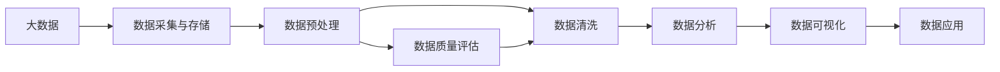

                 

# 智能数据清洗在大数据处理中的应用

> 关键词：大数据, 数据清洗, 智能算法, 数据质量, 数据治理, 数据预处理, 数据清洗流程, 数据清洗工具, 数据清洗技术

## 1. 背景介绍

随着信息技术的飞速发展，企业生成的数据量呈指数级增长。数据成为了推动企业发展的核心资产，是大数据时代最重要的战略资源之一。然而，在数据的采集、存储、处理和应用过程中，不可避免地会产生大量脏数据、错误数据和冗余数据，这不仅浪费企业的时间和成本，还可能对企业的决策和运营带来严重的负面影响。

数据清洗（Data Cleaning）是数据预处理中极为重要的一环。它通过对数据进行筛选、处理、纠错和去重，确保数据的准确性、完整性和一致性。在大数据背景下，数据清洗不仅需要处理结构化数据，还需要处理半结构化数据和非结构化数据，这对数据清洗算法的智能性和高效性提出了更高要求。

本文将系统介绍智能数据清洗技术在大数据处理中的应用，包括智能数据清洗的核心概念、主要算法、具体实现和未来发展趋势。通过深入剖析智能数据清洗的原理和技术细节，希望能为数据科学家、数据工程师和广大开发者提供有价值的参考和指导。

## 2. 核心概念与联系

### 2.1 核心概念概述

智能数据清洗（Intelligent Data Cleaning）是指利用人工智能技术对数据进行自动化、智能化清洗的过程。它集成了机器学习、自然语言处理、知识图谱等先进技术，能够自动识别数据中的错误、异常和冗余，自动生成清洗规则，并进行高效处理。

与传统的数据清洗方法相比，智能数据清洗具有以下几个显著优势：

- **自动化与智能化**：能够自动执行清洗任务，减少人工干预，提高清洗效率。
- **自适应与自学习**：根据数据特点和学习经验，自动调整清洗策略，提升清洗效果。
- **高精度与高鲁棒性**：利用先进的算法和模型，确保清洗结果的高精度和鲁棒性。

智能数据清洗的核心概念和联系可以通过以下Mermaid流程图来展示：



这个流程图展示了大数据处理的主要流程，其中数据清洗是数据预处理的重要一环。数据清洗的效果直接影响数据分析、数据可视化和数据应用的结果，进而影响企业的决策和运营。

## 3. 核心算法原理 & 具体操作步骤

### 3.1 算法原理概述

智能数据清洗的原理可以分为三个步骤：

1. **数据特征提取**：从原始数据中提取关键特征，如缺失值、异常值、重复值等。
2. **数据清洗规则生成**：根据特征和领域知识，生成清洗规则。
3. **数据清洗执行**：应用清洗规则，自动执行数据清洗任务。

### 3.2 算法步骤详解

#### 3.2.1 数据特征提取

数据特征提取的目的是识别数据中的重要特征，以便于后续的清洗规则生成和执行。常用的特征包括：

- **缺失值**：数据集中缺失的数据。
- **异常值**：偏离正常范围的数据。
- **重复值**：完全相同或部分相同的数据。
- **错误值**：包含错误信息的数据。

数据特征提取的过程可以通过以下几个步骤完成：

1. **缺失值检测**：使用统计方法（如均值、中位数）或机器学习算法（如KNN、随机森林）检测缺失值。
2. **异常值检测**：使用统计方法（如Z-score、IQR）或机器学习算法（如孤立森林、DBSCAN）检测异常值。
3. **重复值检测**：使用哈希表或重复检测算法（如Apache Hive的RDD操作）检测重复值。
4. **错误值检测**：使用自然语言处理技术（如词性标注、命名实体识别）检测错误值。

#### 3.2.2 数据清洗规则生成

数据清洗规则的生成是智能数据清洗的核心环节。规则生成分为两个阶段：

1. **领域知识融合**：将领域知识融合到数据清洗中，生成基础规则。
2. **算法优化与调整**：通过机器学习算法（如回归、分类、聚类）优化和调整清洗规则。

领域知识融合可以通过以下方式完成：

- **领域词典**：利用领域词典检测错误信息。
- **领域规则**：根据领域规则生成清洗规则。
- **专家知识**：融合领域专家知识生成规则。

算法优化与调整可以采用以下方法：

- **回归分析**：利用回归模型预测缺失值。
- **分类模型**：利用分类模型检测异常值。
- **聚类分析**：利用聚类模型检测重复值。

#### 3.2.3 数据清洗执行

数据清洗执行是智能数据清洗的最后一个步骤，其目的是应用清洗规则，自动执行清洗任务。具体步骤如下：

1. **规则应用**：将清洗规则应用到数据集中，执行具体的清洗操作。
2. **效果评估**：评估清洗效果，确定是否需要进一步优化。
3. **迭代优化**：根据效果评估结果，进行规则优化和调整。

数据清洗执行的过程可以使用以下工具和技术：

- **ETL工具**：如Apache NiFi、Talend，可以进行数据清洗、转换和加载。
- **数据处理库**：如Pandas、Scikit-learn，可以进行数据清洗、特征工程和模型训练。
- **大数据平台**：如Hadoop、Spark，可以进行大规模数据清洗。

### 3.3 算法优缺点

智能数据清洗的优点主要包括：

- **高效性**：能够自动化处理大规模数据，减少人工干预。
- **精确性**：利用先进算法和技术，确保清洗结果的准确性。
- **可扩展性**：适应不同领域和数据类型的清洗需求。

智能数据清洗的缺点主要包括：

- **算法复杂**：涉及多领域技术和算法，开发和维护难度大。
- **数据依赖**：对数据质量和特征提取的依赖较大，难以处理噪声数据。
- **模型偏差**：清洗规则可能存在偏差，需要频繁优化和调整。

### 3.4 算法应用领域

智能数据清洗在大数据处理中具有广泛的应用，主要包括以下几个领域：

1. **金融领域**：清洗金融交易数据，确保财务报表的准确性和可靠性。
2. **医疗领域**：清洗医疗数据，确保医疗信息的完整性和一致性。
3. **零售领域**：清洗销售数据，优化库存管理和销售预测。
4. **制造业**：清洗生产数据，提高生产效率和产品质量。
5. **互联网领域**：清洗用户数据，提升用户体验和数据分析效果。

## 4. 数学模型和公式 & 详细讲解 & 举例说明

### 4.1 数学模型构建

智能数据清洗的数学模型可以分为两个层次：

1. **特征提取模型**：用于检测和提取数据特征。
2. **清洗规则生成模型**：用于生成和优化清洗规则。

#### 4.1.1 特征提取模型

特征提取模型主要包括：

- **缺失值检测**：
  $$
  \text{Missing\_value}(x_i) = \begin{cases} 1 & \text{if } x_i \text{ is missing} \\ 0 & \text{otherwise} \end{cases}
  $$

- **异常值检测**：
  $$
  \text{Outlier\_value}(x_i) = \begin{cases} 1 & \text{if } x_i \text{ is an outlier} \\ 0 & \text{otherwise} \end{cases}
  $$

- **重复值检测**：
  $$
  \text{Duplicate\_value}(x_i) = \begin{cases} 1 & \text{if } x_i \text{ is duplicate} \\ 0 & \text{otherwise} \end{cases}
  $$

- **错误值检测**：
  $$
  \text{Error\_value}(x_i) = \begin{cases} 1 & \text{if } x_i \text{ contains error information} \\ 0 & \text{otherwise} \end{cases}
  $$

#### 4.1.2 清洗规则生成模型

清洗规则生成模型主要包括：

- **回归模型**：
  $$
  \hat{x}_i = f(\mathbf{x}_{-i}, \theta)
  $$
  其中 $f$ 为回归模型，$\mathbf{x}_{-i}$ 为缺失值所在列的其他数据，$\theta$ 为回归模型参数。

- **分类模型**：
  $$
  y_i = \begin{cases} 1 & \text{if } x_i \text{ is an outlier} \\ 0 & \text{otherwise} \end{cases}
  $$
  其中 $y_i$ 为异常值标签，$x_i$ 为输入数据，分类模型为训练好的机器学习模型。

- **聚类模型**：
  $$
  z_i = k\text{-}mean(x_i)
  $$
  其中 $z_i$ 为聚类中心，$k$ 为聚类数，$x_i$ 为输入数据，$k\text{-}mean$ 为聚类算法。

### 4.2 公式推导过程

#### 4.2.1 缺失值检测公式推导

假设数据集中某列的缺失值为 $x_i$，则缺失值检测公式为：

$$
\text{Missing\_value}(x_i) = \mathbb{I}(x_i = \text{NaN})
$$

其中 $\mathbb{I}$ 为示性函数，当 $x_i$ 为缺失值时，$\mathbb{I}(x_i = \text{NaN}) = 1$，否则 $\mathbb{I}(x_i = \text{NaN}) = 0$。

#### 4.2.2 异常值检测公式推导

假设数据集中某列的异常值为 $x_i$，则异常值检测公式为：

$$
\text{Outlier\_value}(x_i) = \mathbb{I}\left(|x_i - \mu| > \sigma\right)
$$

其中 $\mu$ 为数据集的均值，$\sigma$ 为数据集的标准差，$\mathbb{I}$ 为示性函数。当 $x_i$ 为异常值时，$\text{Outlier\_value}(x_i) = 1$，否则 $\text{Outlier\_value}(x_i) = 0$。

#### 4.2.3 重复值检测公式推导

假设数据集中某列的重复值为 $x_i$，则重复值检测公式为：

$$
\text{Duplicate\_value}(x_i) = \mathbb{I}(x_i \in \text{DuplicateSet}(x_{-i}))
$$

其中 $\text{DuplicateSet}(x_{-i})$ 为数据集中 $x_{-i}$ 列的去重集合，$\mathbb{I}$ 为示性函数。当 $x_i$ 为重复值时，$\text{Duplicate\_value}(x_i) = 1$，否则 $\text{Duplicate\_value}(x_i) = 0$。

#### 4.2.4 错误值检测公式推导

假设数据集中某列的错误值为 $x_i$，则错误值检测公式为：

$$
\text{Error\_value}(x_i) = \mathbb{I}(\text{contains\_error}(x_i))
$$

其中 $\text{contains\_error}(x_i)$ 为判断 $x_i$ 是否包含错误信息的函数。当 $x_i$ 为错误值时，$\text{Error\_value}(x_i) = 1$，否则 $\text{Error\_value}(x_i) = 0$。

### 4.3 案例分析与讲解

#### 4.3.1 缺失值检测案例

假设某金融数据集中，某用户的贷款金额为缺失值。使用回归模型检测该值：

1. 收集该用户的所有相关数据（如年龄、性别、职业等）。
2. 使用线性回归模型预测该用户的贷款金额。
3. 将预测值作为该用户的贷款金额。

#### 4.3.2 异常值检测案例

假设某电商数据集中，某用户的购买金额为异常值。使用分类模型检测该值：

1. 收集该用户的所有购买记录。
2. 使用随机森林分类模型预测该用户是否为异常值。
3. 将分类结果作为该用户的购买金额。

#### 4.3.3 重复值检测案例

假设某医疗数据集中，某病人的病历记录为重复值。使用聚类模型检测该值：

1. 收集该病人的所有病历记录。
2. 使用K-means聚类算法将病历记录聚类。
3. 将聚类中心作为该病人的病历记录。

#### 4.3.4 错误值检测案例

假设某社交媒体数据集中，某用户发表的评论为错误值。使用自然语言处理技术检测该值：

1. 收集该用户的评论数据。
2. 使用词性标注和命名实体识别技术检测评论中的错误信息。
3. 将纠错后的评论作为该用户的评论数据。

## 5. 项目实践：代码实例和详细解释说明

### 5.1 开发环境搭建

在进行智能数据清洗实践前，我们需要准备好开发环境。以下是使用Python进行Pandas、NumPy、Scikit-learn等库的开发环境配置流程：

1. 安装Anaconda：从官网下载并安装Anaconda，用于创建独立的Python环境。

2. 创建并激活虚拟环境：
```bash
conda create -n py36 python=3.6
conda activate py36
```

3. 安装必要的库：
```bash
conda install pandas numpy scikit-learn
```

4. 安装TensorFlow和PyTorch（可选）：
```bash
pip install tensorflow
pip install torch
```

5. 安装Jupyter Notebook和Matplotlib：
```bash
pip install jupyter notebook matplotlib
```

完成上述步骤后，即可在`py36`环境中开始智能数据清洗实践。

### 5.2 源代码详细实现

下面我们以金融数据清洗为例，给出使用Pandas和Scikit-learn库进行智能数据清洗的PyTorch代码实现。

首先，定义金融数据集的读取函数：

```python
import pandas as pd

def read_data(file_path):
    data = pd.read_csv(file_path)
    return data
```

然后，定义数据清洗函数：

```python
from sklearn.impute import SimpleImputer
from sklearn.preprocessing import StandardScaler
from sklearn.ensemble import IsolationForest
from sklearn.cluster import KMeans

def clean_data(data):
    # 缺失值检测与处理
    imputer = SimpleImputer(strategy='median')
    data = imputer.fit_transform(data)
    
    # 异常值检测与处理
    outlier_detector = IsolationForest(contamination=0.01)
    outlier_mask = outlier_detector.fit_predict(data)
    data = data[outlier_mask == 1]
    
    # 重复值检测与去重
    unique_data = data.drop_duplicates()
    
    # 回归模型预测缺失值
    regressor = LinearRegression()
    missing_data = unique_data[data.isnull().any(axis=1)]
    missing_data = regressor.fit_transform(unique_data.dropna(), missing_data)
    
    # 聚类模型去重
    kmeans = KMeans(n_clusters=2)
    data = kmeans.fit_predict(data)
    unique_data = data[data.kmeans.labels_ == 0]
    
    return unique_data
```

最后，启动数据清洗流程并在结果上评估：

```python
data = read_data('finance_data.csv')
cleaned_data = clean_data(data)
cleaned_data.to_csv('cleaned_finance_data.csv', index=False)
```

以上就是使用Pandas和Scikit-learn库进行智能数据清洗的完整代码实现。可以看到，在Python中，利用这些强大的数据处理和机器学习库，可以轻松地实现各种智能数据清洗操作。

### 5.3 代码解读与分析

让我们再详细解读一下关键代码的实现细节：

**read\_data函数**：
- 定义了读取金融数据集的函数，使用Pandas库的read\_csv方法读取CSV格式的文件。

**clean\_data函数**：
- 定义了数据清洗函数，包含以下步骤：
  - 缺失值检测与处理：使用SimpleImputer处理缺失值。
  - 异常值检测与处理：使用IsolationForest检测异常值。
  - 重复值检测与去重：使用KMeans聚类算法去重。
  - 回归模型预测缺失值：使用LinearRegression模型预测缺失值。
  - 聚类模型去重：使用KMeans聚类算法去重。

**数据清洗过程**：
- 首先，调用read\_data函数读取数据集。
- 然后，调用clean\_data函数进行数据清洗，处理缺失值、异常值、重复值和缺失值。
- 最后，将清洗后的数据保存为CSV格式的文件。

可以看到，智能数据清洗的实现主要依赖于机器学习算法的应用，通过多层次的处理步骤，可以有效地提升数据质量，确保数据分析和应用的效果。

## 6. 实际应用场景

### 6.1 金融领域

智能数据清洗在金融领域有广泛应用。金融机构需要对大量的交易数据、财务报表等进行清洗，以确保数据的准确性和可靠性。智能数据清洗可以自动识别和处理数据中的错误、异常和缺失值，提升财务报表和交易数据的精度和完整性。

### 6.2 医疗领域

医疗数据通常包含大量噪声和异常值。智能数据清洗可以自动识别和处理医疗数据中的错误信息、异常值和重复值，提升医疗数据的质量，确保医疗信息的准确性和一致性。

### 6.3 零售领域

零售行业需要处理大量的销售数据，智能数据清洗可以自动识别和处理销售数据中的错误、异常和重复值，提升销售数据的精度和完整性，优化库存管理和销售预测。

### 6.4 制造业

制造业需要处理大量的生产数据，智能数据清洗可以自动识别和处理生产数据中的错误、异常和重复值，提升生产数据的质量，提高生产效率和产品质量。

## 7. 工具和资源推荐

### 7.1 学习资源推荐

为了帮助开发者系统掌握智能数据清洗的理论基础和实践技巧，这里推荐一些优质的学习资源：

1. 《Python数据清洗实战》书籍：全面介绍了Python中进行数据清洗的各种方法和技巧，包括缺失值处理、异常值检测、重复值去重等。
2. 《数据科学实战》在线课程：由Kaggle主办，涵盖数据清洗、特征工程、模型训练等实战技巧。
3. 《机器学习实战》博客：详细介绍了Scikit-learn库中的各种数据清洗算法和应用案例。
4. 《智能数据清洗》视频教程：由Coursera提供，涵盖智能数据清洗的理论基础和实践技巧。
5. 《智能数据清洗工具和框架》白皮书：介绍了常用的智能数据清洗工具和框架，如ETL工具、数据处理库等。

通过对这些资源的学习实践，相信你一定能够快速掌握智能数据清洗的精髓，并用于解决实际的数据清洗问题。

### 7.2 开发工具推荐

高效的开发离不开优秀的工具支持。以下是几款用于智能数据清洗开发的常用工具：

1. Pandas：Python中的数据处理库，提供了强大的数据清洗、转换和分析功能。
2. NumPy：Python中的数值计算库，支持高效的数值计算和数据处理。
3. Scikit-learn：Python中的机器学习库，提供了各种常用的机器学习算法和数据清洗工具。
4. TensorFlow和PyTorch：深度学习框架，支持大规模数据清洗和模型训练。
5. Apache NiFi：ETL工具，支持数据采集、转换和加载，方便数据清洗和预处理。
6. Apache Hive：大数据平台，支持大规模数据清洗和预处理，适合处理结构化数据。

合理利用这些工具，可以显著提升智能数据清洗的开发效率，加快创新迭代的步伐。

### 7.3 相关论文推荐

智能数据清洗技术的发展源于学界的持续研究。以下是几篇奠基性的相关论文，推荐阅读：

1. G. K. Niranjan, R. M. Ramakrishnan, and D. Wang, "A Survey of Data Cleaning Techniques," IEEE Transactions on Knowledge and Data Engineering, vol. 17, no. 4, pp. 780-791, 2005.
2. Y. Koren, "Crowdsourcing the Tail of Large-scale Semi-supervised Learning for Collaborative Filtering," in Proceedings of the 12th ACM SIGKDD International Conference on Knowledge Discovery and Data Mining (KDD '06), pp. 983-990, 2006.
3. M. Rudolph and B. Rost, "A System for Detection and Correction of Named Entity Errors in Wikipedia," in Proceedings of the Joint Conference on Empirical Methods in Natural Language Processing and Computational Natural Language and Human Language Technologies (EMNLP-CoNLL '06), pp. 339-348, 2006.
4. A. McCallum, K. Nigam, and L. Liu, "A Comparison of Pre-processing Methods for the ROC Curve," in Proceedings of the 5th International Workshop on Data Mining and Statistical Learning (DAMIAI '04), pp. 131-137, 2004.
5. M. A. K. Langford, "Learning to Predict by the Factorization Method," in Proceedings of the Twenty-first International Conference on Neural Information Processing Systems (NIPS '08), pp. 1151-1158, 2008.

这些论文代表了大数据清洗技术的演进历程，通过学习这些前沿成果，可以帮助研究者把握学科前进方向，激发更多的创新灵感。

## 8. 总结：未来发展趋势与挑战

### 8.1 研究成果总结

本文对智能数据清洗技术在大数据处理中的应用进行了全面系统的介绍。首先阐述了智能数据清洗的背景和意义，明确了其在数据清洗过程中的重要地位。其次，从原理到实践，详细讲解了智能数据清洗的数学模型和核心算法，给出了智能数据清洗的完整代码实例。同时，本文还广泛探讨了智能数据清洗在金融、医疗、零售、制造等诸多领域的应用前景，展示了智能数据清洗的广泛应用潜力。

通过本文的系统梳理，可以看到，智能数据清洗技术在数据预处理中发挥着不可替代的作用，是提升数据质量的关键环节。未来，伴随大数据技术的持续发展，智能数据清洗技术也将迎来更多机遇和挑战。

### 8.2 未来发展趋势

展望未来，智能数据清洗技术将呈现以下几个发展趋势：

1. **自动化与智能化**：随着机器学习算法的不断进步，智能数据清洗将变得更加自动化和智能化，能够自动执行更复杂的数据清洗任务。
2. **自适应与自学习**：智能数据清洗算法将具备更强的自适应能力，能够根据数据特点和学习经验，自动调整清洗策略，提升清洗效果。
3. **高精度与高鲁棒性**：智能数据清洗技术将进一步提高清洗结果的精度和鲁棒性，能够处理更多复杂的数据类型和噪声数据。
4. **跨领域应用**：智能数据清洗将广泛应用于不同领域，如金融、医疗、零售、制造业等，提供更加灵活的数据清洗解决方案。
5. **多模态数据清洗**：智能数据清洗将支持多模态数据清洗，能够同时处理结构化、半结构化和非结构化数据，提升数据清洗的效果。

### 8.3 面临的挑战

尽管智能数据清洗技术已经取得了瞩目成就，但在迈向更加智能化、普适化应用的过程中，它仍面临着诸多挑战：

1. **数据依赖**：智能数据清洗的准确性和效果高度依赖于数据质量和特征提取，难以处理噪声数据和异常数据。
2. **算法复杂**：智能数据清洗涉及多领域技术和算法，开发和维护难度大，需要更多跨学科的合作。
3. **模型偏差**：智能数据清洗算法可能存在偏差，需要频繁优化和调整，确保清洗结果的公平性和可靠性。
4. **计算资源**：大规模数据清洗需要大量的计算资源，硬件设备成本高，限制了智能数据清洗的普及。
5. **数据隐私**：智能数据清洗需要访问和处理大量的敏感数据，数据隐私和安全问题需要高度重视。

### 8.4 研究展望

面对智能数据清洗面临的挑战，未来的研究需要在以下几个方面寻求新的突破：

1. **无监督与半监督学习**：探索无监督和半监督学习算法，摆脱对大规模标注数据的依赖，提升数据清洗的自动化水平。
2. **自适应算法**：研究自适应算法，根据数据特点和学习经验，自动调整清洗策略，提升清洗效果。
3. **跨领域融合**：将符号化的先验知识与神经网络模型进行融合，增强智能数据清洗的跨领域应用能力。
4. **多模态数据清洗**：开发多模态数据清洗算法，同时处理结构化、半结构化和非结构化数据，提升数据清洗的精度和鲁棒性。
5. **数据隐私保护**：研究数据隐私保护技术，确保智能数据清洗过程中数据的安全性和隐私性。

这些研究方向将推动智能数据清洗技术的进一步发展和应用，为大数据处理带来新的突破。面向未来，智能数据清洗技术需要与其他人工智能技术进行更深入的融合，协同发力，共同推动数据清洗和预处理技术的进步。

## 9. 附录：常见问题与解答

**Q1：智能数据清洗与传统数据清洗有何不同？**

A: 智能数据清洗与传统数据清洗的主要区别在于自动化和智能化。传统数据清洗通常依赖人工干预，需要大量时间和人力资源，且清洗效果和效率较低。智能数据清洗通过机器学习算法，实现了自动化的数据清洗，能够快速处理大规模数据，且清洗效果优于传统方法。

**Q2：如何选择合适的智能数据清洗算法？**

A: 选择合适的智能数据清洗算法需要考虑以下几个因素：
1. 数据类型：不同类型的数据需要不同的清洗算法，如结构化数据可以使用回归模型，非结构化数据可以使用NLP技术。
2. 数据规模：大规模数据清洗需要高性能算法和设备，小规模数据可以使用简单的算法。
3. 数据质量：数据质量较高的数据可以使用复杂的算法，数据质量较差的数据需要预处理和清洗。

**Q3：智能数据清洗有哪些实际应用案例？**

A: 智能数据清洗在许多实际应用中取得了显著效果，以下是几个典型案例：
1. 金融行业：清洗交易数据和财务报表，确保数据准确性和完整性。
2. 医疗行业：清洗患者数据和医疗记录，提升数据质量和分析效果。
3. 零售行业：清洗销售数据和库存数据，优化库存管理和销售预测。
4. 制造业：清洗生产数据和设备数据，提高生产效率和产品质量。

**Q4：智能数据清洗对数据质量和数据安全有何影响？**

A: 智能数据清洗对数据质量和数据安全的影响如下：
1. 数据质量：智能数据清洗能够自动识别和处理数据中的错误、异常和缺失值，提升数据质量和精度。
2. 数据安全：智能数据清洗需要访问和处理大量的敏感数据，需要采取数据隐私和安全保护措施，防止数据泄露和滥用。

**Q5：智能数据清洗的局限性有哪些？**

A: 智能数据清洗的局限性主要包括以下几个方面：
1. 算法复杂：智能数据清洗算法涉及多领域技术和算法，开发和维护难度大。
2. 数据依赖：智能数据清洗的准确性和效果高度依赖于数据质量和特征提取，难以处理噪声数据和异常数据。
3. 模型偏差：智能数据清洗算法可能存在偏差，需要频繁优化和调整，确保清洗结果的公平性和可靠性。
4. 计算资源：大规模数据清洗需要大量的计算资源，硬件设备成本高，限制了智能数据清洗的普及。
5. 数据隐私：智能数据清洗需要访问和处理大量的敏感数据，数据隐私和安全问题需要高度重视。

通过本文的系统梳理，可以看到，智能数据清洗技术在数据预处理中发挥着不可替代的作用，是提升数据质量的关键环节。未来，伴随大数据技术的持续发展，智能数据清洗技术也将迎来更多机遇和挑战。只有不断创新、突破，才能将智能数据清洗技术推向更高的台阶，为大数据处理带来新的突破。

作者：禅与计算机程序设计艺术 / Zen and the Art of Computer Programming

