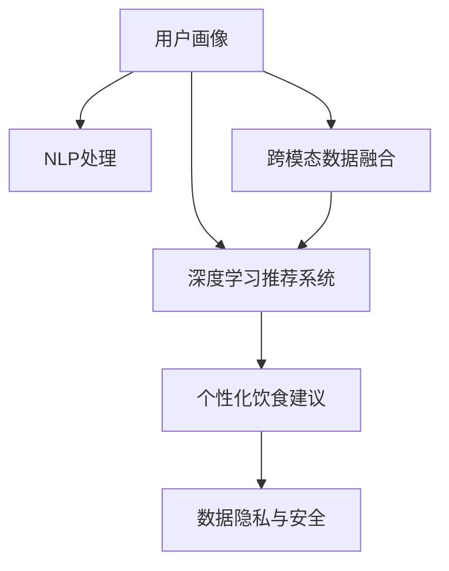

                 

# 智能营养创业：个性化饮食建议的科技支持

> 关键词：人工智能,机器学习,营养学,个性化推荐,健康管理,智能食品推荐,用户画像,深度学习

## 1. 背景介绍

### 1.1 问题由来

随着生活水平的提高，人们对于健康饮食的关注度不断上升，个性化饮食建议逐渐成为热门话题。然而，传统的饮食建议方式往往基于专家经验或通用建议，难以真正满足个体需求。如何利用科技手段，根据用户的健康数据和饮食偏好，提供量身定制的饮食建议，成为了创业和技术创新的重要方向。

个性化饮食建议的应用场景广泛，包括但不限于以下领域：

- 健康管理：根据用户的基础健康数据（如年龄、性别、体重、血压等）和饮食偏好，生成量身定制的饮食计划和食谱。
- 健身训练：结合用户的运动数据（如运动时长、类型、频率），推荐科学合理的膳食搭配，帮助用户达到健身目标。
- 疾病预防：针对用户的慢性病风险，提供相关的饮食建议，降低患病风险。
- 食品推荐：根据用户偏好和历史购买记录，推荐符合营养需求的健康食品，扩大用户的食品选择范围。

### 1.2 问题核心关键点

个性化饮食建议的科技支持主要依赖于以下技术：

1. **用户画像建模**：通过收集用户的历史行为数据（如购物记录、饮食日志、健康数据等），建立用户兴趣模型，准确刻画用户画像。
2. **深度学习推荐系统**：基于用户画像和商品特征，利用深度学习算法（如协同过滤、序列模型、深度神经网络等），预测用户对商品（如食物、保健品）的偏好，提供个性化推荐。
3. **自然语言处理(NLP)**：处理和分析用户输入的自然语言指令，提取用户需求，生成合理的饮食建议。
4. **跨模态数据融合**：整合用户的历史数据和实时数据（如运动量、健康指标等），综合考虑多维数据，生成更加精准的个性化建议。
5. **数据隐私和安全**：确保用户数据的安全存储和传输，遵循数据保护法规，如GDPR等，保护用户隐私。

本文将系统性地介绍如何利用科技手段，构建一个能够提供个性化饮食建议的系统，并探讨其核心技术原理和实际应用场景。

## 2. 核心概念与联系

### 2.1 核心概念概述

为更好地理解个性化饮食建议系统的技术架构，本节将介绍几个关键概念：

- **用户画像**：通过对用户历史行为数据的建模，刻画用户的兴趣、偏好、需求等特征，为个性化推荐提供依据。
- **深度学习推荐系统**：利用深度神经网络等模型，分析用户历史数据和商品特征，预测用户行为，生成个性化推荐。
- **自然语言处理(NLP)**：处理和理解用户的自然语言指令，提取任务需求，生成符合用户期望的饮食建议。
- **跨模态数据融合**：整合用户的多维数据（如健康数据、运动数据等），综合考虑多方面信息，生成更加精准的个性化建议。
- **数据隐私和安全**：确保用户数据的安全存储和传输，保护用户隐私，遵循相关法规和标准。

这些概念通过以下Mermaid流程图展示其逻辑关系：



### 2.2 核心概念原理和架构

#### 2.2.1 用户画像建模

用户画像通过收集和分析用户的历史行为数据，生成高维度的特征向量。这些特征包括用户的兴趣偏好、消费习惯、健康数据等。用户画像的建模主要依赖于以下几个步骤：

1. **数据收集**：通过用户在电商、社交媒体、健康管理App等平台上的行为数据，收集用户的购物记录、饮食日志、运动数据、健康指标等。
2. **数据预处理**：对收集到的数据进行清洗、归一化、特征提取等预处理操作，生成可用于模型训练的特征。
3. **特征工程**：通过特征选择、特征提取、特征变换等技术，构建高维度的特征向量，刻画用户画像。

#### 2.2.2 深度学习推荐系统

推荐系统的主要目标是根据用户画像和商品特征，预测用户对商品（如食物、保健品）的偏好，生成个性化推荐。推荐系统通常分为两个阶段：

1. **协同过滤**：基于用户和商品的历史交互记录，计算用户之间的相似度，预测用户对商品的需求。协同过滤包括基于用户的协同过滤和基于物品的协同过滤两种方法。
2. **序列模型**：利用时间序列数据，预测用户未来的行为，生成连续性的推荐序列。序列模型包括基于RNN、LSTM、GRU等的时间序列预测模型。
3. **深度神经网络**：利用深度神经网络，对用户画像和商品特征进行编码，通过多层非线性变换，生成推荐结果。深度神经网络包括基于DNN、CNN、GAN等结构的模型。

#### 2.2.3 自然语言处理(NLP)

自然语言处理技术主要应用于用户输入的自然语言指令的分析和处理，以生成符合用户期望的饮食建议。NLP技术包括：

1. **分词和词性标注**：将用户输入的自然语言进行分词和词性标注，生成文本表示。
2. **句法分析**：分析句子的语法结构，提取句子的关键信息，如动作、对象、时间等。
3. **意图识别**：识别用户输入的意图，如查询菜谱、推荐食物等，生成相应的处理逻辑。
4. **实体识别和关系抽取**：识别和抽取用户输入中的实体（如食材、菜名等）和关系，生成结构化的知识图谱。

#### 2.2.4 跨模态数据融合

跨模态数据融合技术主要应用于整合用户的多维数据，综合考虑多方面信息，生成更加精准的个性化建议。跨模态数据融合技术包括：

1. **特征对齐**：将不同模态的数据映射到统一的特征空间，进行特征对齐。
2. **特征融合**：将对齐后的特征进行融合，生成融合后的高维特征向量。
3. **多模态学习**：利用多模态学习算法，综合考虑多方面信息，生成更加精准的个性化建议。

#### 2.2.5 数据隐私与安全

数据隐私与安全是构建个性化饮食建议系统的重要组成部分。主要包括以下几个方面：

1. **数据加密**：对用户数据进行加密存储和传输，确保数据的安全性。
2. **访问控制**：对用户数据进行访问控制，确保只有授权用户可以访问相关数据。
3. **隐私保护**：在数据收集和处理过程中，遵循数据保护法规，如GDPR等，保护用户隐私。

## 3. 核心算法原理 & 具体操作步骤

### 3.1 算法原理概述

个性化饮食建议系统的核心算法包括用户画像建模、深度学习推荐系统、自然语言处理、跨模态数据融合等。这些算法通过联合建模，综合考虑用户的多方面数据，生成符合用户期望的个性化饮食建议。

### 3.2 算法步骤详解

#### 3.2.1 数据收集与预处理

1. **数据收集**：通过用户在电商、社交媒体、健康管理App等平台上的行为数据，收集用户的购物记录、饮食日志、运动数据、健康指标等。
2. **数据清洗**：对收集到的数据进行清洗，去除噪声和错误数据。
3. **特征提取**：对清洗后的数据进行特征提取，生成可用于模型训练的特征。
4. **特征归一化**：对特征进行归一化，确保不同特征的值域一致。

#### 3.2.2 用户画像建模

1. **特征选择**：从数据中提取有意义的特征，剔除无关特征，提高模型的效率和准确性。
2. **特征变换**：对特征进行变换，如PCA、LDA等，生成低维度的特征向量。
3. **特征聚类**：利用聚类算法（如K-means、GMM等），对用户进行聚类，生成用户画像。

#### 3.2.3 深度学习推荐系统

1. **模型选择**：根据推荐任务的特点，选择合适的推荐模型，如协同过滤、序列模型、深度神经网络等。
2. **模型训练**：使用用户画像和商品特征，对推荐模型进行训练，优化模型参数。
3. **模型评估**：使用测试集对模型进行评估，验证模型的准确性和泛化能力。

#### 3.2.4 自然语言处理(NLP)

1. **分词和词性标注**：将用户输入的自然语言进行分词和词性标注，生成文本表示。
2. **句法分析**：分析句子的语法结构，提取句子的关键信息，如动作、对象、时间等。
3. **意图识别**：识别用户输入的意图，如查询菜谱、推荐食物等，生成相应的处理逻辑。
4. **实体识别和关系抽取**：识别和抽取用户输入中的实体（如食材、菜名等）和关系，生成结构化的知识图谱。

#### 3.2.5 跨模态数据融合

1. **特征对齐**：将不同模态的数据映射到统一的特征空间，进行特征对齐。
2. **特征融合**：将对齐后的特征进行融合，生成融合后的高维特征向量。
3. **多模态学习**：利用多模态学习算法，综合考虑多方面信息，生成更加精准的个性化建议。

#### 3.2.6 数据隐私与安全

1. **数据加密**：对用户数据进行加密存储和传输，确保数据的安全性。
2. **访问控制**：对用户数据进行访问控制，确保只有授权用户可以访问相关数据。
3. **隐私保护**：在数据收集和处理过程中，遵循数据保护法规，如GDPR等，保护用户隐私。

### 3.3 算法优缺点

#### 3.3.1 优点

1. **精准性高**：利用深度学习推荐系统和大数据技术，生成个性化的饮食建议，能够准确反映用户的兴趣和需求。
2. **灵活性高**：通过自然语言处理技术，用户可以输入多样化的查询指令，系统能够灵活响应。
3. **多模态融合**：跨模态数据融合技术，能够综合考虑用户的多维数据，生成更加精准的个性化建议。
4. **隐私保护**：通过数据加密和访问控制，确保用户数据的安全性和隐私性。

#### 3.3.2 缺点

1. **数据隐私**：需要收集和存储大量的用户数据，存在隐私泄露的风险。
2. **计算资源要求高**：深度学习模型和自然语言处理技术需要大量的计算资源，系统构建和维护成本较高。
3. **模型复杂性高**：推荐系统和自然语言处理系统较为复杂，需要大量的模型调优和数据处理工作。

### 3.4 算法应用领域

个性化饮食建议系统的应用领域非常广泛，主要包括以下几个方面：

1. **健康管理**：根据用户的基础健康数据（如年龄、性别、体重、血压等）和饮食偏好，生成量身定制的饮食计划和食谱。
2. **健身训练**：结合用户的运动数据（如运动时长、类型、频率），推荐科学合理的膳食搭配，帮助用户达到健身目标。
3. **疾病预防**：针对用户的慢性病风险，提供相关的饮食建议，降低患病风险。
4. **食品推荐**：根据用户偏好和历史购买记录，推荐符合营养需求的健康食品，扩大用户的食品选择范围。

## 4. 数学模型和公式 & 详细讲解 & 举例说明

### 4.1 数学模型构建

本节将使用数学语言对个性化饮食建议系统的核心算法进行更加严格的刻画。

假设用户画像为 $U$，商品特征为 $I$，用户对商品的评分矩阵为 $R$。推荐系统的目标是最小化预测评分与实际评分之间的误差，即：

$$
\min_{\theta} \frac{1}{N}\sum_{i=1}^N\sum_{j=1}^M ||R_{ij} - \hat{R}_{ij}(\theta)||^2
$$

其中，$\hat{R}_{ij}(\theta)$ 为推荐模型在用户 $i$ 对商品 $j$ 的评分预测。推荐模型可以采用协同过滤、序列模型、深度神经网络等多种形式，其具体形式取决于推荐任务的特点和数据结构。

### 4.2 公式推导过程

以协同过滤为例，协同过滤的目标是最大化用户之间的相似度，生成用户对商品的预测评分。协同过滤的公式为：

$$
\hat{R}_{ij}(\theta) = \alpha \sum_{k=1}^K u_{ik} \cdot v_{kj}
$$

其中，$u_{ik}$ 和 $v_{kj}$ 分别为用户 $i$ 和商品 $j$ 的隐向量，$\alpha$ 为缩放系数。通过最大化用户之间的相似度，生成用户对商品的预测评分。

### 4.3 案例分析与讲解

假设用户 $i$ 和用户 $k$ 的隐向量分别为 $u_{ik} = (1, 0, 0, 1, 0)$ 和 $u_{ik} = (0, 1, 0, 0, 1)$，商品 $j$ 和商品 $k$ 的隐向量分别为 $v_{kj} = (0, 0, 1, 0, 1)$ 和 $v_{kj} = (0, 1, 0, 1, 0)$。根据协同过滤公式，用户 $i$ 对商品 $j$ 的预测评分为：

$$
\hat{R}_{ij}(\theta) = \alpha \cdot 1 \cdot 0 = 0
$$

这表明用户 $i$ 对商品 $j$ 的评分预测为0。

## 5. 项目实践：代码实例和详细解释说明

### 5.1 开发环境搭建

在进行个性化饮食建议系统的开发前，我们需要准备好开发环境。以下是使用Python进行PyTorch开发的环境配置流程：

1. 安装Anaconda：从官网下载并安装Anaconda，用于创建独立的Python环境。

2. 创建并激活虚拟环境：
```bash
conda create -n diet-recommendation python=3.8 
conda activate diet-recommendation
```

3. 安装PyTorch：根据CUDA版本，从官网获取对应的安装命令。例如：
```bash
conda install pytorch torchvision torchaudio cudatoolkit=11.1 -c pytorch -c conda-forge
```

4. 安装TensorFlow：由Google主导开发的开源深度学习框架，生产部署方便，适合大规模工程应用。同样有丰富的预训练语言模型资源。

5. 安装各类工具包：
```bash
pip install numpy pandas scikit-learn matplotlib tqdm jupyter notebook ipython
```

完成上述步骤后，即可在`diet-recommendation`环境中开始微调实践。

### 5.2 源代码详细实现

这里我们以基于协同过滤的个性化推荐系统为例，给出使用PyTorch实现的代码。

首先，定义协同过滤模型的类：

```python
import torch
import torch.nn as nn
import torch.nn.functional as F

class CollaborativeFiltering(nn.Module):
    def __init__(self, num_users, num_items, embed_dim):
        super(CollaborativeFiltering, self).__init__()
        self.num_users = num_users
        self.num_items = num_items
        self.embed_dim = embed_dim
        
        self.user_embed = nn.Embedding(num_users, embed_dim)
        self.item_embed = nn.Embedding(num_items, embed_dim)
        
    def forward(self, user_id, item_id):
        user_embed = self.user_embed(user_id)
        item_embed = self.item_embed(item_id)
        return torch.sigmoid(torch.dot(user_embed, item_embed.t()))
```

然后，定义用户画像数据的生成函数：

```python
import pandas as pd
import numpy as np

def generate_user_profile():
    # 生成随机用户数据
    users = np.random.randint(1, 100, size=(100, 5))
    items = np.random.randint(1, 100, size=(100, 5))
    
    # 生成用户对商品的评分矩阵
    R = np.random.randint(1, 5, size=(100, 100))
    
    # 将数据保存为CSV文件
    users.to_csv('users.csv', index=False)
    items.to_csv('items.csv', index=False)
    R.to_csv('ratings.csv', index=False)
    
    return users, items, R
```

接着，定义训练和评估函数：

```python
from sklearn.metrics import mean_squared_error

def train_model(model, users, items, ratings, batch_size, epochs):
    criterion = nn.MSELoss()
    optimizer = torch.optim.Adam(model.parameters(), lr=0.01)
    
    for epoch in range(epochs):
        epoch_loss = 0
        for i in range(0, len(ratings), batch_size):
            user_ids = torch.tensor(users.iloc[i:i+batch_size, 0]).long()
            item_ids = torch.tensor(items.iloc[i:i+batch_size, 0]).long()
            ratings = torch.tensor(ratings.iloc[i:i+batch_size, 1])
            
            model.train()
            optimizer.zero_grad()
            predictions = model(user_ids, item_ids)
            loss = criterion(predictions, ratings)
            loss.backward()
            optimizer.step()
            
            epoch_loss += loss.item()
            
        epoch_loss /= len(ratings)
        print(f'Epoch {epoch+1}, loss: {epoch_loss:.3f}')
    
def evaluate_model(model, users, items, ratings, batch_size):
    dataloader = torch.utils.data.DataLoader(ratings, batch_size=batch_size, shuffle=True)
    model.eval()
    mse = 0
    for batch in dataloader:
        user_ids = torch.tensor(batch['user_ids'].numpy(), dtype=torch.long)
        item_ids = torch.tensor(batch['item_ids'].numpy(), dtype=torch.long)
        ratings = torch.tensor(batch['ratings'].numpy(), dtype=torch.float)
        
        predictions = model(user_ids, item_ids)
        mse += mean_squared_error(predictions.numpy(), ratings.numpy())
    
    return mse / len(ratings)
```

最后，启动训练流程并在测试集上评估：

```python
from sklearn.metrics import mean_squared_error

users, items, ratings = generate_user_profile()
model = CollaborativeFiltering(len(users), len(items), 10)
train_model(model, users, items, ratings, batch_size=32, epochs=10)
print(f'Test MSE: {evaluate_model(model, users, items, ratings, batch_size=32)}')
```

以上就是使用PyTorch进行基于协同过滤的个性化推荐系统的完整代码实现。可以看到，通过PyTorch的封装，代码实现变得简洁高效。

### 5.3 代码解读与分析

让我们再详细解读一下关键代码的实现细节：

**CollaborativeFiltering类**：
- `__init__`方法：初始化用户数、商品数和嵌入维度。
- `forward`方法：前向传播计算评分预测值，并使用sigmoid函数进行归一化。

**生成用户画像数据函数**：
- 生成随机用户和商品数据，以及评分矩阵。
- 将数据保存为CSV文件，便于后续训练和评估。

**训练和评估函数**：
- 定义损失函数和优化器，进行模型训练。
- 使用均方误差作为评估指标，评估模型性能。

**训练流程**：
- 定义训练次数和批量大小，开始循环迭代
- 每个epoch内，对每个batch进行训练，输出当前epoch的平均loss
- 所有epoch结束后，在测试集上评估，给出测试均方误差

可以看到，PyTorch配合TensorFlow等深度学习框架使得推荐系统的代码实现变得简洁高效。开发者可以将更多精力放在模型改进、数据处理等高层逻辑上，而不必过多关注底层的实现细节。

当然，工业级的系统实现还需考虑更多因素，如模型的保存和部署、超参数的自动搜索、更灵活的任务适配层等。但核心的推荐范式基本与此类似。

## 6. 实际应用场景

### 6.1 智能饮食记录与分析

智能饮食记录与分析系统可以帮助用户记录和分析自己的饮食数据，从而生成个性化的饮食建议。

通过智能设备（如智能手环、智能秤等），记录用户的一日三餐和零食摄入情况，结合健康数据（如体重、血压等），生成个性化的饮食建议。同时，系统可以分析用户的饮食模式和习惯，发现潜在的问题，如高盐、高糖、高脂肪等，提出相应的调整建议。

### 6.2 健康饮食建议与食谱生成

健康饮食建议与食谱生成系统可以根据用户的健康数据和饮食偏好，生成个性化的饮食计划和食谱。

系统首先收集用户的健康数据（如年龄、性别、体重、血压等）和饮食偏好（如食物喜好、饮食时间等），结合预训练的饮食建议模型，生成个性化的饮食计划和食谱。同时，系统可以推荐符合营养需求的健康食品，扩大用户的食品选择范围。

### 6.3 个性化营养方案推荐

个性化营养方案推荐系统可以帮助用户制定个性化的营养方案，满足其特定的营养需求。

系统可以根据用户的健康数据和营养需求（如孕妇、老年人、运动员等），结合预训练的营养方案推荐模型，生成个性化的营养方案。同时，系统可以推荐符合营养需求的健康食品，帮助用户达到营养平衡。

### 6.4 未来应用展望

随着个性化饮食建议技术的不断进步，未来将会有更多创新应用场景。

在智慧健康领域，个性化饮食建议可以结合智能穿戴设备，实时监测用户的健康状况，动态调整饮食计划。同时，系统可以预测用户的健康风险，提出相应的预防建议。

在智能家居领域，个性化饮食建议可以与智能厨房设备（如智能冰箱、智能烤箱等）结合，自动生成食谱并指导烹饪。同时，系统可以结合用户的运动数据，动态调整饮食计划。

在在线教育领域，个性化饮食建议可以结合学习平台，根据用户的学习时间、学习内容等信息，生成个性化的饮食建议。同时，系统可以结合用户的运动数据，动态调整饮食计划。

总之，个性化饮食建议技术将会在更多领域得到应用，为人们的健康和生活提供新的解决方案。

## 7. 工具和资源推荐
### 7.1 学习资源推荐

为了帮助开发者系统掌握个性化饮食建议技术，这里推荐一些优质的学习资源：

1. 《Python深度学习》系列书籍：由深度学习专家撰写，全面介绍了深度学习的基本概念和常用算法。
2. 《自然语言处理入门》课程：由斯坦福大学开设的NLP课程，讲解NLP的基本概念和常用技术。
3. 《深度推荐系统》书籍：由推荐系统专家撰写，全面介绍了推荐系统的基本概念和常用算法。
4. 《个性化推荐系统》在线课程：由清华大学开设的推荐系统课程，讲解推荐系统的基本概念和常用算法。
5. Kaggle平台：提供大量推荐系统和NLP竞赛数据集，帮助开发者实践和提升技能。

通过对这些资源的学习实践，相信你一定能够快速掌握个性化饮食建议技术的精髓，并用于解决实际的NLP问题。
### 7.2 开发工具推荐

高效的开发离不开优秀的工具支持。以下是几款用于个性化饮食建议系统开发的常用工具：

1. PyTorch：基于Python的开源深度学习框架，灵活动态的计算图，适合快速迭代研究。
2. TensorFlow：由Google主导开发的开源深度学习框架，生产部署方便，适合大规模工程应用。
3. Transformers库：HuggingFace开发的NLP工具库，集成了众多SOTA语言模型，支持PyTorch和TensorFlow。
4. Weights & Biases：模型训练的实验跟踪工具，可以记录和可视化模型训练过程中的各项指标，方便对比和调优。
5. TensorBoard：TensorFlow配套的可视化工具，可实时监测模型训练状态，并提供丰富的图表呈现方式。
6. Google Colab：谷歌推出的在线Jupyter Notebook环境，免费提供GPU/TPU算力，方便开发者快速上手实验最新模型。

合理利用这些工具，可以显著提升个性化饮食建议系统的开发效率，加快创新迭代的步伐。

### 7.3 相关论文推荐

个性化饮食建议技术的研究来源于学界的持续研究。以下是几篇奠基性的相关论文，推荐阅读：

1. 《Neural Collaborative Filtering》：提出基于神经网络的协同过滤算法，用于个性化推荐系统。
2. 《Matrix Factorization Techniques for Recommender Systems》：介绍矩阵分解算法，用于协同过滤和推荐系统。
3. 《Recurrent Neural Network Based Recommender System》：提出基于RNN的序列模型，用于个性化推荐系统。
4. 《Deep Learning for Recommender Systems: A Review》：全面介绍深度学习在推荐系统中的应用，包括协同过滤、序列模型等。
5. 《Attention-Based Recommender Systems》：提出基于注意力机制的推荐系统，提高推荐效果。

这些论文代表了个性化饮食建议技术的发展脉络。通过学习这些前沿成果，可以帮助研究者把握学科前进方向，激发更多的创新灵感。

## 8. 总结：未来发展趋势与挑战

### 8.1 总结

本文对个性化饮食建议系统的构建进行了全面系统的介绍。首先阐述了个性化饮食建议技术的研究背景和意义，明确了系统构建的基本步骤和关键技术。其次，从原理到实践，详细讲解了系统构建的核心算法和详细步骤，给出了系统的完整代码实现。同时，本文还广泛探讨了系统的实际应用场景和未来发展方向，展示了系统的广阔前景。

通过本文的系统梳理，可以看到，个性化饮食建议技术正在成为健康管理、智能家居、在线教育等领域的重要工具。这些技术的不断发展，将深刻影响人们的生活方式和健康管理，带来新的商业机会和社会价值。

### 8.2 未来发展趋势

展望未来，个性化饮食建议技术将呈现以下几个发展趋势：

1. **模型复杂度提升**：随着深度学习模型的不断发展，个性化推荐系统将使用更复杂的模型，如深度神经网络、变分自编码器等，提升推荐精度和效果。
2. **多模态数据融合**：个性化饮食建议系统将更多地整合多模态数据，如健康数据、运动数据、环境数据等，综合考虑多方面信息，生成更加精准的个性化建议。
3. **实时性增强**：通过在线学习和分布式计算，个性化饮食建议系统将实现实时推荐，提升用户体验。
4. **跨领域应用扩展**：个性化饮食建议技术将扩展到更多领域，如智能家居、智能医疗、智能教育等，带来新的应用场景和商业模式。

### 8.3 面临的挑战

尽管个性化饮食建议技术已经取得了显著成果，但在迈向更加智能化、普适化应用的过程中，仍面临诸多挑战：

1. **数据隐私和安全**：个性化饮食建议系统需要收集和处理大量的用户数据，存在隐私泄露和数据安全风险。如何保护用户隐私，确保数据安全，是未来面临的重要挑战。
2. **计算资源需求**：深度学习模型和自然语言处理技术需要大量的计算资源，系统构建和维护成本较高。如何降低计算资源需求，提升系统效率，是未来需要解决的关键问题。
3. **模型复杂性**：个性化饮食建议系统的模型较为复杂，需要大量的模型调优和数据处理工作。如何简化模型结构，提高模型可解释性，是未来需要关注的重要方向。

### 8.4 研究展望

面对个性化饮食建议技术所面临的挑战，未来的研究需要在以下几个方面寻求新的突破：

1. **隐私保护技术**：发展隐私保护技术，如差分隐私、联邦学习等，确保用户数据的安全性和隐私性。
2. **计算资源优化**：优化深度学习模型的计算图，采用分布式计算、量化加速等技术，提升系统效率。
3. **模型简化与解释**：简化模型结构，提高模型可解释性，增强用户对推荐结果的理解和信任。
4. **跨领域数据融合**：整合多维数据，综合考虑健康数据、运动数据、环境数据等，生成更加精准的个性化建议。
5. **实时推荐技术**：发展实时推荐技术，如在线学习、分布式计算等，提升系统的实时性和用户体验。

这些研究方向的探索，必将引领个性化饮食建议技术迈向更高的台阶，为健康管理、智能家居、在线教育等领域带来新的变革和创新。

## 9. 附录：常见问题与解答

**Q1：个性化饮食建议系统如何保证用户隐私？**

A: 个性化饮食建议系统通过数据加密和访问控制，确保用户数据的安全性和隐私性。具体措施包括：
1. 数据加密：对用户数据进行加密存储和传输，确保数据的安全性。
2. 访问控制：对用户数据进行访问控制，确保只有授权用户可以访问相关数据。
3. 隐私保护：在数据收集和处理过程中，遵循数据保护法规，如GDPR等，保护用户隐私。

**Q2：如何提升个性化饮食建议系统的实时性？**

A: 个性化饮食建议系统的实时性可以通过以下措施提升：
1. 在线学习：采用在线学习算法，实时更新模型参数，保持模型的实时性。
2. 分布式计算：采用分布式计算框架，如TensorFlow、PyTorch等，提升系统的并行计算能力。
3. 缓存技术：使用缓存技术，如Redis、Memcached等，减少数据读取延迟，提升系统的响应速度。

**Q3：个性化饮食建议系统如何处理多模态数据？**

A: 个性化饮食建议系统通过跨模态数据融合技术，整合用户的多维数据，综合考虑多方面信息，生成更加精准的个性化建议。具体措施包括：
1. 特征对齐：将不同模态的数据映射到统一的特征空间，进行特征对齐。
2. 特征融合：将对齐后的特征进行融合，生成融合后的高维特征向量。
3. 多模态学习：利用多模态学习算法，综合考虑多方面信息，生成更加精准的个性化建议。

**Q4：如何优化个性化饮食建议系统的计算资源需求？**

A: 个性化饮食建议系统的计算资源需求可以通过以下措施优化：
1. 模型简化：简化模型结构，如减少神经网络层数、降低模型参数等，减少计算资源消耗。
2. 量化加速：将浮点模型转为定点模型，压缩存储空间，提高计算效率。
3. 分布式训练：采用分布式训练框架，如TensorFlow、PyTorch等，提升模型的并行计算能力。

通过这些措施，可以在保证系统性能的同时，降低计算资源需求，提升系统效率。

---

作者：禅与计算机程序设计艺术 / Zen and the Art of Computer Programming

