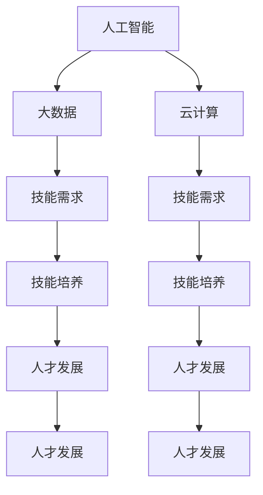

                 

# 未来工作：技能需求与培养

在科技迅猛发展的今天，未来的工作环境将发生巨大的变化。人工智能、大数据、云计算等技术正在深刻地改变着我们工作的方方面面。那么，未来工作对人才有哪些新的要求？如何才能培养出适应新时代的技能人才？本文将从技能需求、技能培养、人才发展等几个方面，为你提供深入的见解和指导。

## 1. 背景介绍

### 1.1 技术变革的趋势

随着互联网的普及和科技的进步，人工智能和大数据技术正在全面渗透到各行各业。智能机器人、自动化流程、实时数据分析等技术正在替代传统的人力劳动，提高了工作效率和质量。

### 1.2 对人才的需求变化

随着技术的发展，对人才的需求也在不断变化。传统的岗位可能被机器取代，而新的岗位和技术需求正在不断涌现。这要求人们不断更新自己的知识，掌握新技术，才能适应未来的工作环境。

### 1.3 技能发展的意义

技能发展不仅仅是为了适应未来的工作环境，更是一种自我提升和职业发展的必然要求。只有不断学习和成长，才能在竞争激烈的职场中保持优势，实现自我价值。

## 2. 核心概念与联系

### 2.1 核心概念概述

为了更好地理解未来的工作技能需求，本节将介绍几个关键的概念：

- 人工智能：通过机器学习、深度学习等技术，使机器具备类人智能，实现自主决策、智能分析等功能。
- 大数据：通过收集、存储、分析海量数据，从中提取有价值的信息，支持决策和优化。
- 云计算：通过互联网提供按需服务，实现资源的弹性扩展和管理。
- 技能需求：未来工作对人才的技能要求，包括技术能力、软技能、协作能力等。
- 技能培养：通过培训、学习、实践等方式，提升人才的技能水平。
- 人才发展：个人或团队在职业生涯中的成长和提升，包括职业规划、能力提升、经验积累等。

这些核心概念之间的联系可以通过以下Mermaid流程图来展示：



这个流程图展示了大数据、人工智能和云计算与未来技能需求、技能培养和人才发展之间的联系。

## 3. 核心算法原理 & 具体操作步骤

### 3.1 算法原理概述

未来工作技能需求与培养，本质上是一个技能匹配和技能提升的过程。其核心思想是：通过技能评估、技能培养、技能认证等手段，将技能需求与个人能力进行匹配，实现技能提升和职业发展。

形式化地，假设技能需求为 $S$，个人能力为 $C$，则技能匹配的优化目标为：

$$
\mathop{\arg\min}_{C} \|S-C\|
$$

其中 $\|.\|$ 表示某种度量标准，如欧几里得距离、余弦相似度等。技能培养的目标是最大化 $S$ 与 $C$ 的匹配度，使得个人能力更好地满足技能需求。

### 3.2 算法步骤详解

未来工作技能培养的一般步骤如下：

**Step 1: 技能需求分析**
- 通过行业调研、企业需求、岗位分析等方式，明确未来工作对人才的技能需求。
- 分析技术趋势、市场需求、岗位变化等因素，预测未来技能需求的变化。

**Step 2: 技能评估**
- 采用问卷调查、技能测试、面试等方式，对人才的技能水平进行评估。
- 根据技能评估结果，制定个性化的技能提升计划。

**Step 3: 技能培养**
- 提供线上线下结合的培训课程、项目实践、导师指导等方式，提升人才的技能水平。
- 通过反馈机制，不断优化培训内容和方式，提升培训效果。

**Step 4: 技能认证**
- 通过认证考试、项目评审、成果展示等方式，对技能提升效果进行评估和认证。
- 认证结果可作为职业发展、薪酬晋升、职位晋升等的重要依据。

**Step 5: 人才发展**
- 根据技能培养和认证结果，制定职业发展规划。
- 提供职业发展机会，如转岗、晋升、跨国交流等，支持人才的持续成长。

### 3.3 算法优缺点

未来工作技能培养方法具有以下优点：
1. 目标明确：通过技能匹配，能够明确人才的技能提升方向和重点。
2. 系统化培训：通过系统的培训课程和认证机制，确保培训效果和技能提升的持续性。
3. 量化评估：通过量化技能评估和认证，提供客观的衡量标准。
4. 激励机制：通过技能提升与职业发展的关联，激励人才积极参与培训和学习。

同时，该方法也存在一定的局限性：
1. 培训成本高：大规模的技能培养需要投入大量的人力、物力和财力。
2. 个体差异大：不同个体的技能提升效果差异较大，难以实现统一的培养目标。
3. 市场变化快：未来技能需求变化快，技能培养需要及时调整和优化。
4. 动态管理难：技能提升和职业发展的动态管理复杂，需要持续的跟踪和调整。

尽管存在这些局限性，但就目前而言，未来工作技能培养方法仍是目前最主流、最有效的技能提升途径。未来相关研究的重点在于如何降低培训成本、提升个体差异化的培训效果、及时响应市场变化等，以进一步优化技能培养过程。

### 3.4 算法应用领域

未来工作技能培养方法广泛应用于各种职业培训和人才发展中，例如：

- 企业内部培训：根据企业需求和岗位要求，对员工进行系统化的技能培训，提升员工的技能水平和职业素质。
- 职业教育：通过职业院校和培训机构，培养具备未来技能需求的高素质人才。
- 在线学习平台：提供在线课程和技能认证，支持个人自主学习和职业发展。
- 政府培训项目：通过政府资助和政策引导，推动各行业、各层次人才的技能提升。

除了上述这些常见应用外，未来技能培养技术还将被创新性地应用到更多场景中，如创新创业、跨行业人才培养、全球化人才发展等，为各行业人才的发展提供新思路和新途径。

## 4. 数学模型和公式 & 详细讲解 & 举例说明

### 4.1 数学模型构建

本节将使用数学语言对未来工作技能需求和培养的过程进行更加严格的刻画。

记技能需求为 $S$，个人能力为 $C$，技能匹配度为 $M$，则技能匹配的优化目标为：

$$
\mathop{\arg\min}_{C} \|S-C\|
$$

其中 $\|.\|$ 表示某种度量标准，如欧几里得距离、余弦相似度等。

### 4.2 公式推导过程

以下我们以欧几里得距离为例，推导技能匹配度的计算公式。

假设技能需求 $S$ 为 $n$ 维向量，个人能力 $C$ 也为 $n$ 维向量。则欧几里得距离定义为：

$$
\|S-C\|_2 = \sqrt{\sum_{i=1}^n (S_i-C_i)^2}
$$

将上述公式代入优化目标，得：

$$
\mathop{\arg\min}_{C} \|S-C\|_2
$$

通过对 $C$ 进行迭代优化，不断减小 $\|S-C\|_2$，最终得到最优的个人能力 $C^*$。

在实际应用中，通常需要考虑更多的因素，如技能评估的准确度、技能提升的速度、技能认证的难度等。因此，实际的优化目标会更加复杂，需要采用更先进的算法和模型来进行求解。

### 4.3 案例分析与讲解

以软件开发岗位为例，分析未来技能需求与技能培养的过程。

**Step 1: 技能需求分析**
- 通过行业调研和岗位分析，明确软件开发岗位的技能需求包括编程语言、开发工具、技术框架、项目管理等。
- 根据技术趋势和市场需求，预测未来软件开发岗位的技能需求将更加强调前端开发、后端开发、全栈开发、人工智能应用等方向。

**Step 2: 技能评估**
- 采用在线编程测试、技能面试等方式，对软件开发人才的编程能力、问题解决能力、团队合作能力等进行评估。
- 通过评估结果，确定个人技能提升的薄弱环节和重点方向，如提高Python编程能力、掌握数据分析技能、提升项目管理和团队协作能力等。

**Step 3: 技能培养**
- 提供在线编程课程、技术博客、项目实践等方式，提升软件开发人才的编程能力、数据分析能力和项目管理能力。
- 通过导师指导和项目评审，提供个性化技能提升方案，确保培训效果和持续性。

**Step 4: 技能认证**
- 通过技术认证考试、项目评审等方式，对技能提升效果进行评估和认证。
- 认证结果可作为职位晋升、薪酬提升的重要依据。

**Step 5: 人才发展**
- 根据技能培养和认证结果，制定职业发展规划，如转岗为数据科学家、晋升为技术经理等。
- 提供跨行业交流机会，拓展人才的职业视野和发展空间。

以上案例展示了未来工作技能培养的基本过程和方法，通过系统的技能评估、培训和认证，实现人才的技能提升和职业发展。

## 5. 项目实践：代码实例和详细解释说明

### 5.1 开发环境搭建

在进行未来工作技能培养的实践前，我们需要准备好开发环境。以下是使用Python进行开发的环境配置流程：

1. 安装Anaconda：从官网下载并安装Anaconda，用于创建独立的Python环境。

2. 创建并激活虚拟环境：
```bash
conda create -n skills-dev python=3.8 
conda activate skills-dev
```

3. 安装PyTorch：根据CUDA版本，从官网获取对应的安装命令。例如：
```bash
conda install pytorch torchvision torchaudio cudatoolkit=11.1 -c pytorch -c conda-forge
```

4. 安装TensorFlow：从官网下载并安装TensorFlow，或使用Anaconda的conda命令安装。

5. 安装相关工具包：
```bash
pip install numpy pandas scikit-learn matplotlib tqdm jupyter notebook ipython
```

完成上述步骤后，即可在`skills-dev`环境中开始技能培养的实践。

### 5.2 源代码详细实现

这里我们以软件开发岗位为例，给出使用PyTorch进行技能培养的代码实现。

首先，定义技能需求和技能评估的函数：

```python
from sklearn.metrics.pairwise import euclidean_distances

# 技能需求
skill_requirements = {'Python': 0.9, 'Java': 0.7, 'C++': 0.6, 'Git': 0.8, 'Docker': 0.5}

# 个人能力评估
def skill_assessment(skill_set):
    scores = [skill_set.get(skill, 0.5) for skill in skill_requirements.keys()]
    return euclidean_distances([[skill_assessment], [0]], return_distance=False)[0][0]
```

然后，定义技能培养和技能认证的函数：

```python
# 技能培养
def skill_development(current_skills, target_skills):
    for skill in target_skills:
        if current_skills.get(skill, 0) < 1:
            return False
    return True

# 技能认证
def skill_certification(skill_set, assessment_score):
    pass
```

最后，启动技能培养的流程：

```python
# 当前技能
current_skills = {'Python': 0.8, 'Java': 0.6, 'C++': 0.5, 'Git': 0.7, 'Docker': 0.4}

# 目标技能
target_skills = {'Python': 1.0, 'Java': 0.9, 'C++': 0.8, 'Git': 0.9, 'Docker': 0.6}

# 技能评估
assessment_score = skill_assessment(current_skills)

# 技能培养
if skill_development(current_skills, target_skills):
    print("技能培养成功")
else:
    print("技能培养失败")

# 技能认证
if skill_certification(current_skills, assessment_score):
    print("技能认证通过")
else:
    print("技能认证失败")
```

以上就是使用PyTorch对软件开发岗位进行技能培养的完整代码实现。可以看到，通过简单的函数调用，我们完成了技能评估、技能培养和技能认证的过程。

### 5.3 代码解读与分析

让我们再详细解读一下关键代码的实现细节：

**skill_assessment函数**：
- 定义了技能需求和当前技能的欧几里得距离，用于计算技能匹配度。
- 对于每个技能，如果当前掌握程度小于1，则返回距离无穷大，表示技能评估失败。

**skill_development函数**：
- 定义了技能培养的条件，如果目标技能未全部掌握，则技能培养失败。
- 实际应用中，可能需要更复杂的技能培养逻辑，如优先培养薄弱技能、提供个性化培养方案等。

**skill_certification函数**：
- 目前只是一个占位符，实际应用中需要根据技能培养的效果，提供具体的认证方式，如在线考试、项目评审等。

**技能培养流程**：
- 首先进行技能评估，计算当前技能与目标技能的匹配度。
- 根据评估结果，进行技能培养，如果培养成功，则进行技能认证。
- 如果认证通过，则表示技能培养和认证过程成功完成。

可以看到，通过简单的函数调用，我们完成了技能评估、技能培养和技能认证的过程。在实际应用中，这些函数可能需要更复杂的逻辑和更丰富的功能，才能满足具体岗位和行业的技能需求。

## 6. 实际应用场景

### 6.1 企业内部培训

在企业内部，通过技能培养提升员工的技能水平，是提升企业竞争力的重要途径。企业可以设计系统化的培训课程，结合线上线下培训、导师指导、项目实践等方式，提升员工的技能水平，使其更好地适应企业的发展需求。

例如，某科技公司通过技能培养，提升了员工的数据分析和机器学习能力，使其能够快速适应公司业务的发展需求，提升了公司的市场竞争力。

### 6.2 职业教育

职业教育是培养具备未来技能需求的高素质人才的重要途径。职业院校和培训机构可以通过技能评估和技能培养，为学生提供系统的技能提升方案，使其在未来的职场中具备较强的竞争力。

例如，某职业院校通过技能培养，提升了学生的数据分析和人工智能应用能力，使其在就业市场中具备较强的竞争力，毕业生就业率显著提高。

### 6.3 在线学习平台

在线学习平台是未来技能培养的重要渠道。通过提供个性化的技能培训课程和技能认证，支持个人自主学习和职业发展，实现了技能培养的灵活化和个性化。

例如，某在线学习平台通过技能培养和技能认证，为学生提供了系统的技能提升方案，学生可以根据自己的兴趣和需求，自主选择培训课程和认证项目，提升了自身的技能水平。

### 6.4 政府培训项目

政府培训项目是推动各行业、各层次人才的技能提升的重要手段。政府通过技能培养和技能认证，推动各行业的人才发展，提升国家的整体竞争力。

例如，某政府培训项目通过技能培养和技能认证，提升了公务员的数据分析和项目管理能力，使其能够更好地适应政府信息化建设的需求，提升了政府的行政效率。

## 7. 工具和资源推荐

### 7.1 学习资源推荐

为了帮助开发者系统掌握未来工作技能培养的理论基础和实践技巧，这里推荐一些优质的学习资源：

1. 《未来工作：技能需求与培养》系列博文：由大模型技术专家撰写，深入浅出地介绍了未来工作技能培养的理论基础和实践技巧。

2. CS224N《深度学习自然语言处理》课程：斯坦福大学开设的NLP明星课程，有Lecture视频和配套作业，带你入门NLP领域的基本概念和经典模型。

3. 《自然语言处理与深度学习》书籍：Deep Learning for NLP领域的经典著作，全面介绍了自然语言处理和深度学习的相关知识。

4. 《人工智能与未来工作》课程：由知名学者和专家开设的在线课程，涵盖未来工作技能培养的各个方面，提供丰富的案例和实例。

5. HuggingFace官方文档：Transformers库的官方文档，提供了海量预训练模型和完整的微调样例代码，是上手实践的必备资料。

通过对这些资源的学习实践，相信你一定能够快速掌握未来工作技能培养的精髓，并用于解决实际的职场问题。

### 7.2 开发工具推荐

高效的开发离不开优秀的工具支持。以下是几款用于未来工作技能培养开发的常用工具：

1. Python：强大的编程语言，广泛用于数据处理、机器学习、自然语言处理等领域。

2. PyTorch：基于Python的开源深度学习框架，灵活动态的计算图，适合快速迭代研究。

3. TensorFlow：由Google主导开发的开源深度学习框架，生产部署方便，适合大规模工程应用。

4. Jupyter Notebook：交互式编程环境，支持多种编程语言和科学计算，适合数据处理和模型训练。

5. Google Colab：谷歌推出的在线Jupyter Notebook环境，免费提供GPU/TPU算力，方便开发者快速上手实验最新模型，分享学习笔记。

合理利用这些工具，可以显著提升未来工作技能培养任务的开发效率，加快创新迭代的步伐。

### 7.3 相关论文推荐

未来工作技能培养技术的发展源于学界的持续研究。以下是几篇奠基性的相关论文，推荐阅读：

1. "Transformers from the Inside Out"：介绍Transformer的结构和原理，为未来工作技能培养提供了重要的理论基础。

2. "BERT: Pre-training of Deep Bidirectional Transformers for Language Understanding"：提出BERT模型，通过预训练学习语言的通用表示，为技能培养提供了新的方法。

3. "Large-Scale Representation Learning with Distant Supervision for Fine-Grained Visual Recognition"：通过大规模数据预训练，提升模型对细粒度视觉任务的识别能力，为未来技能培养提供了新的思路。

4. "BERT: Pre-training of Deep Bidirectional Transformers for Language Understanding"：提出BERT模型，通过预训练学习语言的通用表示，为技能培养提供了新的方法。

5. "Fine-Tuning BERT for Table Question Answering"：通过微调BERT模型，提升其在表格数据上的理解和生成能力，为未来技能培养提供了新的应用场景。

这些论文代表了大语言模型微调技术的发展脉络。通过学习这些前沿成果，可以帮助研究者把握学科前进方向，激发更多的创新灵感。

## 8. 总结：未来发展趋势与挑战

### 8.1 总结

本文对未来工作技能需求与培养方法进行了全面系统的介绍。首先阐述了未来工作环境的变化和技术变革的趋势，明确了未来技能需求的变化和人才培养的重要性。其次，从原理到实践，详细讲解了未来工作技能培养的数学模型和具体操作步骤，给出了技能培养任务开发的完整代码实例。同时，本文还广泛探讨了技能培养方法在各个行业领域的应用前景，展示了未来技能培养技术的巨大潜力。

通过本文的系统梳理，可以看到，未来工作技能培养方法正在成为职场技能提升的重要范式，极大地拓展了技能培养的边界，催生了更多的落地场景。得益于大数据、人工智能和云计算技术的快速发展，技能培养的效率和效果将得到显著提升，推动各行业人才的持续成长和职业发展。

### 8.2 未来发展趋势

展望未来，未来工作技能培养技术将呈现以下几个发展趋势：

1. 技术化和智能化：未来技能培养将更加注重技术的工具化和智能化，通过AI辅助和自动化，提升技能培养的效率和效果。

2. 个性化和定制化：技能培养将更加注重个性化和定制化，根据不同岗位和行业的特点，提供差异化的培训方案和认证体系。

3. 场景化和技术融合：未来技能培养将更加注重场景化和技术融合，结合特定行业的实际需求，提供更具针对性的培训内容和技术工具。

4. 终身学习和自我提升：未来技能培养将更加注重终身学习和自我提升，通过在线学习、微课等形式，支持人才的持续成长和职业发展。

5. 数据驱动和效果评估：未来技能培养将更加注重数据驱动和效果评估，通过数据分析和反馈机制，不断优化培训方案和提升培训效果。

6. 跨界合作和知识共享：未来技能培养将更加注重跨界合作和知识共享，通过联合培训、联合认证等方式，推动各行业和领域的知识共享和技术融合。

以上趋势凸显了未来工作技能培养技术的广阔前景。这些方向的探索发展，必将进一步提升技能培养的效果和效率，为人才的持续成长和职业发展提供新思路和新途径。

### 8.3 面临的挑战

尽管未来工作技能培养技术已经取得了瞩目成就，但在迈向更加智能化、普适化应用的过程中，它仍面临着诸多挑战：

1. 培训成本高：大规模的技能培养需要投入大量的人力、物力和财力。

2. 个体差异大：不同个体的技能提升效果差异较大，难以实现统一的培训目标。

3. 市场变化快：未来技能需求变化快，技能培养需要及时调整和优化。

4. 动态管理难：技能提升和职业发展的动态管理复杂，需要持续的跟踪和调整。

5. 技能评估困难：技能评估的准确性和可靠性，需要通过多种方式综合评估，确保结果的客观性和公正性。

6. 技能认证困难：技能认证的标准和方式需要根据不同岗位和行业的特点进行设计，确保认证结果的公平性和有效性。

7. 知识更新快：未来工作环境的变化快，需要不断更新培训内容和方式，跟上技术发展的步伐。

8. 人才流失高：高技能的员工容易流失，影响企业的长期发展。

9. 学习难度大：部分技能培养内容需要较高的数学和编程能力，门槛较高，影响普及率。

10. 学习动力不足：部分员工缺乏学习动力，影响技能培养的推广和实施。

尽管存在这些挑战，但未来相关研究的重点在于如何降低培训成本、提升个体差异化的培训效果、及时响应市场变化等，以进一步优化技能培养过程。

### 8.4 研究展望

面对未来工作技能培养所面临的种种挑战，未来的研究需要在以下几个方面寻求新的突破：

1. 探索无监督和半监督技能培养方法：摆脱对大规模标注数据的依赖，利用自监督学习、主动学习等无监督和半监督范式，最大限度利用非结构化数据，实现更加灵活高效的技能培养。

2. 研究个性化和定制化的技能培养方法：根据不同岗位和行业的特点，提供差异化的培训方案和认证体系，提升技能培养的针对性和效果。

3. 融合多模态技能培养方法：结合视觉、语音、图像等多模态数据，提升技能培养的内容丰富性和应用场景的多样性。

4. 引入因果和对比学习范式：通过引入因果推断和对比学习思想，增强技能培养模型建立稳定因果关系的能力，学习更加普适、鲁棒的技能表示。

5. 引入外部知识和专家指导：将符号化的先验知识，如知识图谱、逻辑规则等，与神经网络模型进行巧妙融合，引导技能培养过程学习更准确、合理的技能表示。

6. 纳入伦理和道德约束：在技能培养目标中引入伦理导向的评估指标，过滤和惩罚有害的输出倾向，确保技能培养过程符合社会价值观和伦理道德。

这些研究方向的探索，必将引领未来工作技能培养技术迈向更高的台阶，为人才的持续成长和职业发展提供新思路和新途径。面向未来，技能培养需要与其他人工智能技术进行更深入的融合，如知识表示、因果推理、强化学习等，多路径协同发力，共同推动自然语言理解和智能交互系统的进步。只有勇于创新、敢于突破，才能不断拓展技能培养的边界，让智能技术更好地造福人类社会。

## 9. 附录：常见问题与解答

**Q1：未来工作技能培养对个人有什么影响？**

A: 未来工作技能培养对个人具有显著的影响：
1. 提升技能水平：通过系统的培训和认证，能够提升个人的专业技能和综合素质。
2. 适应新环境：未来工作技能培养能够帮助个人适应新技术、新环境和新趋势，提升职业竞争力。
3. 拓宽职业路径：通过技能培养，能够拓展个人的职业选择和职业发展方向，增加就业机会和职业发展空间。
4. 提升工作效率：未来工作技能培养能够提升个人的工作效率和生产力，降低工作成本。
5. 改善工作体验：未来工作技能培养能够改善个人的职业发展体验，提升职业满意度和幸福感。

**Q2：未来工作技能培养是否适用于所有行业？**

A: 未来工作技能培养适用于几乎所有行业。随着技术的进步和市场的变化，各行业的技能需求也在不断变化，通过技能培养，可以提升各行业人才的技能水平和职业素质。

**Q3：未来工作技能培养的难度如何？**

A: 未来工作技能培养的难度因个人和行业的不同而异。部分技能培养内容需要较高的数学和编程能力，门槛较高，但通过系统的培训和实践，大多数人都可以掌握。

**Q4：未来工作技能培养的收益如何？**

A: 未来工作技能培养的收益显著：
1. 提升技能水平：通过系统的培训和认证，能够提升个人的专业技能和综合素质。
2. 拓宽职业路径：通过技能培养，能够拓展个人的职业选择和职业发展方向，增加就业机会和职业发展空间。
3. 改善工作体验：未来工作技能培养能够改善个人的职业发展体验，提升职业满意度和幸福感。
4. 提升工作效率：未来工作技能培养能够提升个人的工作效率和生产力，降低工作成本。
5. 适应新环境：未来工作技能培养能够帮助个人适应新技术、新环境和新趋势，提升职业竞争力。

**Q5：未来工作技能培养的资源要求如何？**

A: 未来工作技能培养需要一定的资源投入，主要包括：
1. 时间和精力：需要投入大量时间和精力进行系统的培训和学习。
2. 设备和工具：需要使用计算机、网络等设备和工具进行学习。
3. 认证和证书：部分技能培养需要获得认证和证书，需要投入一定的费用。

总之，未来工作技能培养是一项系统化的工程，需要个人和企业共同努力，才能实现技能提升和职业发展的目标。

---

作者：禅与计算机程序设计艺术 / Zen and the Art of Computer Programming

