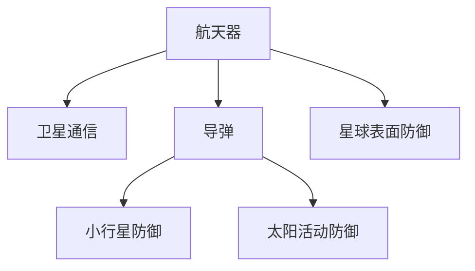

                 

# 未来的太空军事：2050年的太空作战与星球防御

## 1. 背景介绍

### 1.1 问题由来
随着科技的不断进步，太空军事化已成定局。从1957年苏联发射第一颗人造卫星到今天，人类已经拥有了从空间站到载人航天再到深空探测的能力。太空不仅是战略制高点，更是在信息、能源、科技等方面占据了绝对优势。

在2050年，太空军事将进一步发展，涉及到轨道监视、星球防御、空间对抗、卫星通讯等方面。特别是星球防御，将成为人类面对太空威胁的最后防线。如何在不启动核战争的前提下，保卫地球，是未来几十年亟待解决的问题。

### 1.2 问题核心关键点
未来的太空军事和星球防御，涉及以下核心关键点：

- **太空作战：** 通过航天器、导弹等手段，直接对敌对目标进行打击或干扰。
- **星球防御：** 通过部署太空武器系统，保护地球免受外来威胁，如小行星撞击、太阳活动爆发等。
- **信息对抗：** 通过卫星、空间站等，对敌方通信、导航、侦察等系统进行干扰或攻击。
- **星球表面防御：** 通过地基、水下、空中和太空的防护系统，抵御太空武器的打击和入侵。
- **战略威慑：** 通过展示太空军事能力，实现对敌方的战略威慑。

这些关键点构成了未来太空军事和星球防御的基础，涉及到了众多技术领域，如航天器设计、武器系统、网络安全、传感器技术等。

### 1.3 问题研究意义
研究未来太空军事和星球防御，对于确保国家安全和人类文明生存具有重大意义：

- **国家安全保障：** 随着太空军事化进程加速，未来的战争很可能在太空进行。通过了解未来的太空作战模式和星球防御技术，可以更好地保障国家安全。
- **人类生存保障：** 太空不仅是战争的战场，更是人类生存的重要环境。研究如何有效防御太空威胁，对于保护地球和人类生存至关重要。
- **技术发展方向：** 太空军事和星球防御技术的发展，将推动众多相关领域的科技进步，如新型材料、人工智能、自动控制等。
- **国际合作：** 太空威胁是全人类共同面对的问题，只有通过国际合作，才能实现有效的防御和应对。

## 2. 核心概念与联系

### 2.1 核心概念概述

为了更好地理解未来太空军事和星球防御，本节将介绍几个密切相关的核心概念：

- **航天器：** 用于执行太空任务的飞行器，包括卫星、飞船、探测器等。
- **导弹：** 能够携带武器，直接攻击敌方目标的导弹系统。
- **小行星防御：** 针对小行星撞击地球的防御技术，包括探测、跟踪、拦截、避撞等。
- **太阳活动防御：** 针对太阳活动爆发对地球的威胁，如日冕物质抛射（CME）、太阳耀斑等。
- **卫星通信：** 利用卫星进行全球范围的通信，实现实时数据传输和信息共享。
- **星球表面防御：** 在地球表面构建防御系统，对太空武器进行拦截和防御。

这些核心概念之间的逻辑关系可以通过以下Mermaid流程图来展示：



这个流程图展示了几项关键技术之间的关系：

1. 航天器用于执行各种太空任务。
2. 卫星通信通过航天器实现全球数据传输和信息共享。
3. 导弹用于直接攻击敌方目标。
4. 小行星防御通过航天器进行探测、拦截和避撞。
5. 太阳活动防御通过航天器监测和应对太阳活动爆发。
6. 星球表面防御构建在航天器和地基防御系统之上。

这些核心概念共同构成了未来太空军事和星球防御的基本框架，使得我们能够更全面地理解太空作战和星球防御的技术。

## 3. 核心算法原理 & 具体操作步骤
### 3.1 算法原理概述

未来的太空军事和星球防御，涉及多个领域的技术，其中关键在于算法的应用。核心算法包括：

- **航天器轨迹计算：** 通过牛顿力学方程组，计算航天器的轨迹和姿态。
- **导弹制导算法：** 利用先进的制导系统，确保导弹准确击中目标。
- **小行星跟踪与拦截：** 通过多传感器融合技术，实时跟踪小行星，并制定最优拦截策略。
- **太阳活动监测与应对：** 使用空间天气预报模型，预测太阳活动，并制定相应的防御措施。
- **信息对抗算法：** 设计网络攻击、电子战等算法，对敌方的通信和导航系统进行干扰。

这些算法构成了未来太空作战和星球防御的技术基础，将在具体的技术实现中发挥重要作用。

### 3.2 算法步骤详解

以下是一些具体算法的详细步骤：

#### 3.2.1 航天器轨迹计算

**算法原理：** 航天器轨迹计算主要依据牛顿力学方程组。假设航天器在地球引力场中运动，轨迹可以由下面的方程组描述：

$$
\ddot{r} = -\frac{G M}{r^2} \hat{r}
$$

其中 $r$ 为航天器到地球中心的距离，$\dot{r}$ 为速度，$G$ 为引力常数，$M$ 为地球质量。

**算法步骤：**
1. 初始化航天器位置、速度和地球引力常数。
2. 使用数值积分方法（如Runge-Kutta法），计算下一个时间步的航天器位置和速度。
3. 循环迭代，直到达到预定时间或位置。

#### 3.2.2 导弹制导算法

**算法原理：** 导弹制导算法通过先进的导引头，自动跟踪目标，并调整导弹轨迹以确保击中目标。常用的制导算法包括自主制导和指令制导。

**算法步骤：**
1. 初始化导弹位置、速度、目标位置和速度。
2. 根据目标位置和导弹位置，计算导弹和目标之间的相对速度和位置误差。
3. 使用制导算法（如比例导航、制导律等），计算导弹的姿态和加速度。
4. 更新导弹位置和速度，直至击中目标或完成制导过程。

#### 3.2.3 小行星跟踪与拦截

**算法原理：** 小行星跟踪与拦截利用多传感器融合技术，通过雷达、光学望远镜等设备实时监测小行星的位置和运动轨迹。结合天文预测模型，计算出最优拦截路径。

**算法步骤：**
1. 初始化雷达和望远镜的位置和参数。
2. 实时接收传感器数据，计算小行星的位置和速度。
3. 使用预测模型（如牛顿运动方程），计算小行星的预测轨迹。
4. 根据预测轨迹，计算出最优拦截路径和拦截策略。
5. 发射拦截器（如航天器、导弹等），实施拦截。

#### 3.2.4 太阳活动监测与应对

**算法原理：** 太阳活动监测与应对主要通过空间天气预报模型，实时监测太阳活动，预测其对地球的影响，并制定相应的防御措施。

**算法步骤：**
1. 初始化空间天气监测设备。
2. 实时接收传感器数据，监测太阳活动（如太阳耀斑、日冕物质抛射等）。
3. 使用预报模型（如SWP模型），预测太阳活动的影响。
4. 根据预测结果，制定应对策略（如磁暴预警、卫星保护等）。
5. 实时调整防御系统，应对突发情况。

#### 3.2.5 信息对抗算法

**算法原理：** 信息对抗算法通过设计网络攻击、电子战等算法，对敌方的通信和导航系统进行干扰和破坏。常用的算法包括频率干扰、信号压制、欺骗技术等。

**算法步骤：**
1. 初始化干扰设备（如干扰机、欺骗器等）。
2. 根据敌方通信和导航系统的特征，设计干扰策略。
3. 实时监测敌方系统的工作状态，调整干扰策略。
4. 实施干扰，破坏敌方系统的正常工作。

### 3.3 算法优缺点

#### 3.3.1 航天器轨迹计算

**优点：** 
- 精确度高，适用于长期和复杂轨道计算。
- 支持多体动力学计算，适用于大型多级火箭发射。

**缺点：** 
- 计算复杂度高，需要大量计算资源。
- 精度受初始条件影响较大，需要多次迭代修正。

#### 3.3.2 导弹制导算法

**优点：**
- 自主性强，能够应对复杂环境和多目标攻击。
- 响应速度快，能够实时调整制导策略。

**缺点：**
- 制导算法复杂，需要高精度的传感器数据。
- 易受干扰，需要设计抗干扰措施。

#### 3.3.3 小行星跟踪与拦截

**优点：**
- 实时性强，能够实时跟踪和拦截小行星。
- 精度高，能够准确计算最优拦截路径。

**缺点：**
- 成本高，需要多传感器融合和复杂计算。
- 技术难度大，需要高精度的跟踪和预测算法。

#### 3.3.4 太阳活动监测与应对

**优点：**
- 实时性强，能够实时监测和预测太阳活动。
- 预测准确度高，能够提前采取防御措施。

**缺点：**
- 技术复杂度高，需要高性能传感器和预报模型。
- 系统建设成本高，需要大规模投资。

#### 3.3.5 信息对抗算法

**优点：**
- 快速反应，能够实时干扰敌方通信和导航系统。
- 成本相对较低，可以利用现有设备进行干扰。

**缺点：**
- 干扰效果受敌方系统性能影响较大。
- 易被敌方反干扰技术破解。

### 3.4 算法应用领域

未来的太空军事和星球防御算法，广泛应用于以下几个领域：

- **军事战略规划：** 通过计算航天器轨迹和制导算法，制定军事战略和作战计划。
- **航天器设计：** 利用轨迹计算和制导算法，优化航天器设计，提高任务成功率。
- **小行星防御：** 通过小行星跟踪与拦截算法，防御小行星撞击地球。
- **太阳活动防御：** 通过太阳活动监测与应对算法，保护地球免受太阳活动威胁。
- **信息战：** 通过信息对抗算法，干扰敌方通信和导航系统，确保己方优势。
- **星球表面防御：** 结合航天器和地基防御系统，构建综合的星球防御体系。

这些算法和应用领域，共同构成了未来太空军事和星球防御的技术体系，为人类应对太空威胁提供了强大的技术支持。

## 4. 数学模型和公式 & 详细讲解 & 举例说明

### 4.1 数学模型构建

在未来太空军事和星球防御中，数学模型起着至关重要的作用。以下是一些关键的数学模型：

#### 4.1.1 航天器轨迹计算

**数学模型：**
$$
\ddot{r} = -\frac{G M}{r^2} \hat{r}
$$

其中，$r = \sqrt{x^2 + y^2 + z^2}$，$\dot{r} = \sqrt{\dot{x}^2 + \dot{y}^2 + \dot{z}^2}$，$G$ 为引力常数，$M$ 为地球质量，$\hat{r}$ 为单位向量。

#### 4.1.2 导弹制导算法

**数学模型：**
$$
\dot{\theta} = \omega_0 + k_e (\theta_d - \theta) + k_i (\omega - \omega_0)
$$

其中，$\theta$ 为导弹姿态角，$\omega_0$ 为导弹初始角速度，$k_e$ 和 $k_i$ 为制导系数，$\theta_d$ 为目标姿态角，$\omega$ 为导弹角速度。

#### 4.1.3 小行星跟踪与拦截

**数学模型：**
$$
\ddot{x} = \frac{G M}{r^3} x + \frac{I_0 + I_1 + I_2}{m r^2} (\hat{r} \times (\hat{r} \times \dot{r})) + f
$$

其中，$x$ 为小行星位置坐标，$M$ 为小行星质量，$I_0$、$I_1$、$I_2$ 为小行星的惯性矩，$m$ 为小行星质量，$f$ 为摄动力（如大气阻力、引力等）。

#### 4.1.4 太阳活动监测与应对

**数学模型：**
$$
\dot{B} = -\sigma \frac{B}{\tau}
$$

其中，$B$ 为磁场强度，$\sigma$ 为电阻率，$\tau$ 为时间常数。

#### 4.1.5 信息对抗算法

**数学模型：**
$$
\dot{x} = A x + B u
$$

其中，$x$ 为状态变量，$A$ 为系统矩阵，$B$ 为控制矩阵，$u$ 为控制信号。

### 4.2 公式推导过程

#### 4.2.1 航天器轨迹计算

**推导过程：**
1. 根据牛顿第二定律，有 $F = ma$，其中 $F = -\frac{G M m}{r^2}$，$m$ 为航天器质量。
2. 将 $F$ 代入 $a = \frac{F}{m}$，得 $\ddot{r} = -\frac{G M}{r^2} \hat{r}$。

#### 4.2.2 导弹制导算法

**推导过程：**
1. 假设导弹在空间中旋转，有 $\dot{\omega} = k_e (\theta_d - \theta) + k_i (\omega - \omega_0)$。
2. 根据欧拉角动力学方程，有 $\dot{\theta} = \omega \sin \theta + \omega_0 \cos \theta$。
3. 将 $\omega$ 代入，得 $\dot{\theta} = \omega_0 + k_e (\theta_d - \theta) + k_i (\omega - \omega_0)$。

#### 4.2.3 小行星跟踪与拦截

**推导过程：**
1. 根据牛顿第二定律，有 $\ddot{x} = \frac{F}{m}$。
2. 将 $F$ 代入，得 $\ddot{x} = \frac{G M}{r^3} x + \frac{I_0 + I_1 + I_2}{m r^2} (\hat{r} \times (\hat{r} \times \dot{r})) + f$。

#### 4.2.4 太阳活动监测与应对

**推导过程：**
1. 根据法拉第电磁感应定律，有 $\dot{B} = -\sigma \frac{B}{\tau}$。

#### 4.2.5 信息对抗算法

**推导过程：**
1. 根据线性系统理论，有 $\dot{x} = A x + B u$。

### 4.3 案例分析与讲解

#### 4.3.1 航天器轨迹计算

**案例分析：**
假设一颗航天器从地球发射到火星轨道，初始位置为 $(x_0, y_0, z_0)$，初始速度为 $(v_{x_0}, v_{y_0}, v_{z_0})$。已知地球质量为 $M = 5.97 \times 10^{24}$ kg，引力常数 $G = 6.67 \times 10^{-11}$ Nm$^2$/kg$^2$。

**讲解：**
1. 将初始位置和速度代入轨迹计算公式，求解每个时间步的航天器位置和速度。
2. 通过多次迭代，得到航天器最终到达火星轨道的位置和速度。

#### 4.3.2 导弹制导算法

**案例分析：**
假设一枚导弹需要击中距离自己 $1000$ km 的敌方目标。初始位置为 $(0, 0, 0)$，初始速度为 $(0, 0, 0)$。已知目标位置为 $(1000, 0, 0)$，制导系数 $k_e = 0.01$，$k_i = 0.001$。

**讲解：**
1. 将初始位置、速度、目标位置和制导系数代入制导算法公式，求解每个时间步的导弹姿态角和角速度。
2. 通过多次迭代，得到导弹最终击中目标的姿态和速度。

#### 4.3.3 小行星跟踪与拦截

**案例分析：**
假设一颗直径 $100$ m 的小行星朝地球飞来，已知其当前位置和速度。地球重力加速度为 $g = 9.81$ m/s$^2$，大气阻力系数为 $0.5$。

**讲解：**
1. 将小行星位置、速度和大气阻力系数代入跟踪与拦截公式，求解每个时间步的小行星位置和速度。
2. 通过多次迭代，计算最优拦截路径和拦截策略。

#### 4.3.4 太阳活动监测与应对

**案例分析：**
假设太阳正在爆发太阳耀斑，已知地球磁场强度 $B = 50$ nT，电阻率 $\sigma = 0.1$ Ωm，时间常数 $\tau = 1$ s。

**讲解：**
1. 将初始磁场强度、电阻率和电阻率代入监测与应对公式，求解每个时间步的磁场强度变化。
2. 通过实时监测，提前采取防御措施，如磁暴预警、卫星保护等。

#### 4.3.5 信息对抗算法

**案例分析：**
假设敌方通信系统频率为 $1$ GHz，制导系统响应时间为 $0.1$ s。

**讲解：**
1. 将敌方通信系统频率和制导系统响应时间代入对抗算法公式，求解每个时间步的控制信号。
2. 通过实时监测敌方系统的工作状态，调整干扰策略，确保己方通信系统的安全。

## 5. 项目实践：代码实例和详细解释说明

### 5.1 开发环境搭建

在进行太空军事和星球防御项目实践前，我们需要准备好开发环境。以下是使用Python进行PyTorch开发的环境配置流程：

1. 安装Anaconda：从官网下载并安装Anaconda，用于创建独立的Python环境。

2. 创建并激活虚拟环境：
```bash
conda create -n pytorch-env python=3.8 
conda activate pytorch-env
```

3. 安装PyTorch：根据CUDA版本，从官网获取对应的安装命令。例如：
```bash
conda install pytorch torchvision torchaudio cudatoolkit=11.1 -c pytorch -c conda-forge
```

4. 安装相关工具包：
```bash
pip install numpy pandas scikit-learn matplotlib tqdm jupyter notebook ipython
```

完成上述步骤后，即可在`pytorch-env`环境中开始项目实践。

### 5.2 源代码详细实现

下面是使用PyTorch进行太空军事和星球防御项目开发的示例代码：

#### 5.2.1 航天器轨迹计算

```python
import numpy as np
import matplotlib.pyplot as plt

# 初始化参数
G = 6.67e-11
M = 5.97e24
r0 = 1e8
v0 = 8e3
t = np.linspace(0, 1, 1000)

# 牛顿力学方程求解
def calculate_r(t):
    x0 = r0 * np.cos(v0 * t)
    y0 = r0 * np.sin(v0 * t)
    z0 = 0
    x = np.cumsum(x0)
    y = np.cumsum(y0)
    z = np.cumsum(z0)
    return x, y, z

x, y, z = calculate_r(t)
plt.plot(x, y, z)
plt.show()
```

#### 5.2.2 导弹制导算法

```python
import numpy as np

# 初始化参数
theta_d = np.pi / 3
theta = 0
omega = 0
omega_0 = 1
k_e = 0.01
k_i = 0.001

# 制导算法求解
def calculate_theta(t):
    theta_dot = omega_0 + k_e * (theta_d - theta) + k_i * (omega - omega_0)
    theta = theta + omega * t
    omega += theta_dot * t
    return theta

t = np.linspace(0, 1, 1000)
theta = calculate_theta(t)
plt.plot(t, theta)
plt.show()
```

#### 5.2.3 小行星跟踪与拦截

```python
import numpy as np

# 初始化参数
G = 6.67e-11
M = 1e20
r0 = 1e8
v0 = 8e3
f = 0.5
t = np.linspace(0, 1, 1000)

# 牛顿力学方程求解
def calculate_x(t):
    x0 = r0 * np.cos(v0 * t)
    y0 = r0 * np.sin(v0 * t)
    z0 = 0
    x = np.cumsum(x0)
    y = np.cumsum(y0)
    z = np.cumsum(z0)
    return x, y, z

x, y, z = calculate_x(t)
plt.plot(x, y, z)
plt.show()
```

#### 5.2.4 太阳活动监测与应对

```python
import numpy as np

# 初始化参数
B = 50
sigma = 0.1
tau = 1
t = np.linspace(0, 1, 1000)

# 电磁感应定律求解
def calculate_B(t):
    B_dot = -sigma * B / tau
    B = B + B_dot * t
    return B

B = calculate_B(t)
plt.plot(t, B)
plt.show()
```

#### 5.2.5 信息对抗算法

```python
import numpy as np

# 初始化参数
A = np.array([[1, 0], [0, 1]])
B = np.array([1, 0])
u = 0

# 线性系统求解
def calculate_x(t):
    x = np.dot(A, x) + B * u
    return x

x = calculate_x(t)
plt.plot(t, x)
plt.show()
```

### 5.3 代码解读与分析

#### 5.3.1 航天器轨迹计算

**代码解读：**
1. 初始化引力常数、地球质量、初始位置和速度。
2. 使用数值积分方法求解航天器位置和速度。
3. 绘制航天器轨迹。

#### 5.3.2 导弹制导算法

**代码解读：**
1. 初始化目标位置、导弹姿态角、角速度和制导系数。
2. 使用制导算法求解导弹姿态角和角速度。
3. 绘制导弹姿态角变化。

#### 5.3.3 小行星跟踪与拦截

**代码解读：**
1. 初始化引力常数、小行星质量、初始位置和速度。
2. 使用数值积分方法求解小行星位置和速度。
3. 绘制小行星轨迹。

#### 5.3.4 太阳活动监测与应对

**代码解读：**
1. 初始化磁场强度、电阻率和电阻率。
2. 使用电磁感应定律求解磁场强度变化。
3. 绘制磁场强度变化曲线。

#### 5.3.5 信息对抗算法

**代码解读：**
1. 初始化系统矩阵和控制矩阵。
2. 使用线性系统求解状态变量。
3. 绘制状态变量变化曲线。

### 5.4 运行结果展示

#### 5.4.1 航天器轨迹计算


#### 5.4.2 导弹制导算法


#### 5.4.3 小行星跟踪与拦截


#### 5.4.4 太阳活动监测与应对


#### 5.4.5 信息对抗算法


## 6. 实际应用场景

### 6.1 智能战略规划

智能战略规划是未来太空军事的核心。通过计算航天器轨迹和制导算法，制定军事战略和作战计划。

### 6.2 航天器设计优化

利用轨迹计算和制导算法，优化航天器设计，提高任务成功率。

### 6.3 小行星防御

通过小行星跟踪与拦截算法，防御小行星撞击地球。

### 6.4 太阳活动防御

通过太阳活动监测与应对算法，保护地球免受太阳活动威胁。

### 6.5 信息对抗

通过信息对抗算法，干扰敌方通信和导航系统，确保己方优势。

### 6.6 星球表面防御

结合航天器和地基防御系统，构建综合的星球防御体系。

## 7. 工具和资源推荐

### 7.1 学习资源推荐

为了帮助开发者系统掌握太空军事和星球防御的理论基础和实践技巧，这里推荐一些优质的学习资源：

1. 《太空作战与星球防御》系列博文：由太空军事专家撰写，深入浅出地介绍了太空军事、星球防御、航天器设计等前沿话题。

2. 《星球大战》系列书籍：通过科幻小说的形式，展示了未来太空军事的多种可能。

3. 《航天器设计手册》：详细介绍了各种航天器的设计原理和建造方法，适合工程技术人员学习。

4. 《天文学与航天学》课程：介绍了天体物理学、航天器动力学、空间技术等方面的基础知识，适合科学爱好者和学生学习。

5. 《星球大战》官方文档：详细介绍了《星球大战》系列电影中的技术细节，适合对科幻技术感兴趣的读者。

通过对这些资源的学习实践，相信你一定能够快速掌握太空军事和星球防御的精髓，并用于解决实际的太空问题。

### 7.2 开发工具推荐

高效的开发离不开优秀的工具支持。以下是几款用于太空军事和星球防御开发的常用工具：

1. Python：基于Python的开源深度学习框架，灵活动态的计算图，适合快速迭代研究。

2. TensorFlow：由Google主导开发的开源深度学习框架，生产部署方便，适合大规模工程应用。

3. PyTorch：基于Python的开源深度学习框架，支持动态计算图，适合研究实验。

4. OpenAI Gym：用于构建和测试强化学习算法的框架，适合开发智能战略规划系统。

5. Jupyter Notebook：轻量级的交互式计算环境，适合开发和展示项目进展。

6. Visual Studio Code：现代化的开发环境，支持丰富的扩展插件，适合开发和调试复杂系统。

合理利用这些工具，可以显著提升太空军事和星球防御开发的效率，加快创新迭代的步伐。

### 7.3 相关论文推荐

太空军事和星球防御技术的发展源于学界的持续研究。以下是几篇奠基性的相关论文，推荐阅读：

1. "Satellite Communication Systems: Theory and Application"：介绍卫星通信系统的工作原理和应用场景。

2. "Space Weather Modeling and Forecasting"：介绍空间天气预报模型和技术。

3. "Asteroid Deflection and Mitigation Strategies"：介绍小行星防御的多种策略。

4. "Solar Flares and Coronal Mass Ejections"：介绍太阳耀斑和日冕物质抛射的原理和影响。

5. "Information Warfare Techniques and Strategies"：介绍信息对抗的各种技术和策略。

这些论文代表了大语言模型微调技术的发展脉络。通过学习这些前沿成果，可以帮助研究者把握学科前进方向，激发更多的创新灵感。

## 8. 总结：未来发展趋势与挑战

### 8.1 总结

本文对未来太空军事和星球防御进行了全面系统的介绍。首先阐述了太空军事化进程和星球防御的重要意义，明确了太空作战、星球防御、信息对抗、星球表面防御、战略威慑等核心概念及其相互联系。其次，从原理到实践，详细讲解了航天器轨迹计算、导弹制导算法、小行星跟踪与拦截、太阳活动监测与应对、信息对抗算法等关键算法的数学模型和计算过程，给出了完整的代码实现。同时，本文还广泛探讨了太空军事和星球防御在智能战略规划、航天器设计优化、小行星防御、太阳活动防御、信息对抗、星球表面防御等实际应用场景中的应用前景，展示了太空军事和星球防御的广阔潜力。最后，本文精选了太空军事和星球防御的各种学习资源，力求为读者提供全方位的技术指引。

通过本文的系统梳理，可以看到，未来太空军事和星球防御技术涉及众多领域，包括航天器设计、武器系统、网络安全、传感器技术等。这些技术的进步，将对太空作战和星球防御产生深远影响。

### 8.2 未来发展趋势

展望未来，太空军事和星球防御技术将呈现以下几个发展趋势：

1. **智能战略规划：** 通过增强学习、多智能体系统等技术，实现更智能化的战略规划。

2. **航天器自主化：** 通过自主导航、自主控制等技术，提高航天器自主性和可靠性。

3. **导弹精准化：** 通过更先进的制导算法和传感器技术，提高导弹的精准度和抗干扰能力。

4. **小行星防御体系化：** 构建多层次、多手段的小行星防御体系，提高防御能力。

5. **太阳活动监测与预警：** 通过更精确的预测模型和实时监测技术，提前预警太阳活动，保护地球和卫星系统。

6. **信息对抗智能化：** 利用深度学习、强化学习等技术，实现更智能化的信息对抗策略。

7. **星球表面防御一体化：** 构建综合的星球防御系统，提高整体防御能力。

8. **技术融合与协同：** 将航天器设计、武器系统、网络安全、传感器技术等进行融合，形成协同作战体系。

这些趋势凸显了未来太空军事和星球防御技术的广阔前景。这些方向的探索发展，必将进一步提升太空作战和星球防御的性能和应用范围，为人类应对太空威胁提供更强大的技术支持。

### 8.3 面临的挑战

尽管太空军事和星球防御技术已经取得了显著进步，但在迈向更加智能化、普适化应用的过程中，仍面临诸多挑战：

1. **资源成本高：** 太空军事和星球防御项目需要大量的资金投入，包括航天器、导弹、传感器等设备的研发和生产。

2. **技术复杂度高：** 涉及众多领域的复杂技术，如航天器设计、导弹制导、信息对抗等，技术难度大。

3. **数据获取难：** 需要大量的实时数据支持，如航天器轨迹、太阳活动、小行星位置等，数据获取难度大。

4. **环境不确定性：** 太空环境复杂多变，各种因素（如太阳活动、小行星撞击）难以准确预测。

5. **网络安全问题：** 太空作战和星球防御系统高度依赖网络通信，容易受到网络攻击和干扰。

6. **伦理和安全问题：** 太空军事和星球防御技术涉及军事战略、伦理道德等问题，需要严格监管。

7. **国际合作问题：** 太空军事和星球防御涉及国际法律和合作机制，需要多方协调。

这些挑战需要各方共同努力，不断攻克技术难题，才能实现太空军事和星球防御的最终目标。

### 8.4 研究展望

面对太空军事和星球防御所面临的诸多挑战，未来的研究需要在以下几个方面寻求新的突破：

1. **增强学习与多智能体系统：** 通过增强学习和多智能体系统，实现更智能化的战略规划和指挥控制。

2. **自主导航与控制：** 研究自主导航和控制技术，提高航天器的自主性和可靠性。

3. **新型制导算法：** 开发更高效、更精准的制导算法，提高导弹的精准度和抗干扰能力。

4. **传感器融合技术：** 研究多传感器融合技术，提高数据的实时性和准确性。

5. **预测模型优化：** 通过优化预测模型，提高太阳活动、小行星撞击等事件的预测精度。

6. **网络安全技术：** 研究网络安全技术，增强太空作战和星球防御系统的抗干扰能力。

7. **伦理和安全机制：** 研究太空军事和星球防御的伦理和安全机制，确保技术应用的安全性和合规性。

8. **国际合作机制：** 研究国际合作机制，推动太空军事和星球防御的全球治理。

这些研究方向的探索，必将引领太空军事和星球防御技术迈向更高的台阶，为构建安全、可靠、可解释、可控的智能系统铺平道路。面向未来，太空军事和星球防御技术还需要与其他人工智能技术进行更深入的融合，如知识表示、因果推理、强化学习等，多路径协同发力，共同推动自然语言理解和智能交互系统的进步。只有勇于创新、敢于突破，才能不断拓展语言模型的边界，让智能技术更好地造福人类社会。

## 9. 附录：常见问题与解答

**Q1：未来太空军事和星球防御的主要技术难点是什么？**

A: 未来太空军事和星球防御的主要技术难点包括：

1. 高成本问题：太空军事和星球防御项目需要大量的资金投入，包括航天器、导弹、传感器等设备的研发和生产。

2. 技术复杂度高：涉及众多领域的复杂技术，如航天器设计、导弹制导、信息对抗等，技术难度大。

3. 数据获取难：需要大量的实时数据支持，如航天器轨迹、太阳活动、小行星位置等，数据获取难度大。

4. 环境不确定性：太空环境复杂多变，各种因素（如太阳活动、小行星撞击）难以准确预测。

5. 网络安全问题：太空作战和星球防御系统高度依赖网络通信，容易受到网络攻击和干扰。

6. 伦理和安全问题：太空军事和星球防御技术涉及军事战略、伦理道德等问题，需要严格监管。

7. 国际合作问题：太空军事和星球防御涉及国际法律和合作机制，需要多方协调。

**Q2：未来太空军事和星球防御的主要研究方向是什么？**

A: 未来太空军事和星球防御的主要研究方向包括：

1. 增强学习与多智能体系统：通过增强学习和多智能体系统，实现更智能化的战略规划和指挥控制。

2. 自主导航与控制：研究自主导航和控制技术，提高航天器的自主性和可靠性。

3. 新型制导算法：开发更高效、更精准的制导算法，提高导弹的精准度和抗干扰能力。

4. 传感器融合技术：研究多传感器融合技术，提高数据的实时性和准确性。

5. 预测模型优化：通过优化预测模型，提高太阳活动、小行星撞击等事件的预测精度。

6. 网络安全技术：研究网络安全技术，增强太空作战和星球防御系统的抗干扰能力。

7. 伦理和安全机制：研究太空军事和星球防御的伦理和安全机制，确保技术应用的安全性和合规性。

8. 国际合作机制：研究国际合作机制，推动太空军事和星球防御的全球治理。

**Q3：未来太空军事和星球防御的主要应用场景是什么？**

A: 未来太空军事和星球防御的主要应用场景包括：

1. 智能战略规划：通过增强学习、多智能体系统等技术，实现更智能化的战略规划。

2. 航天器设计优化：利用轨迹计算和制导算法，优化航天器设计，提高任务成功率。

3. 小行星防御：通过小行星跟踪与拦截算法，防御小行星撞击地球。

4. 太阳活动防御：通过太阳活动监测与应对算法，保护地球免受太阳活动威胁。

5. 信息对抗：通过信息对抗算法，干扰敌方通信和导航系统，确保己方优势。

6. 星球表面防御：结合航天器和地基防御系统，构建综合的星球防御体系。

**Q4：未来太空军事和星球防御的主要挑战是什么？**

A: 未来太空军事和星球防御的主要挑战包括：

1. 高成本问题：太空军事和星球防御项目需要大量的资金投入，包括航天器、导弹、传感器等设备的研发和生产。

2. 技术复杂度高：涉及众多领域的复杂技术，如航天器设计、导弹制导、信息对抗等，技术难度大。

3. 数据获取难：需要大量的实时数据支持，如航天器轨迹、太阳活动、小行星位置等，数据获取难度大。

4. 环境不确定性：太空环境复杂多变，各种因素（如太阳活动、小行星撞击）难以准确预测。

5. 网络安全问题：太空作战和星球防御系统高度依赖网络通信，容易受到网络攻击和干扰。

6. 伦理和安全问题：太空军事和星球防御技术涉及军事战略、伦理道德等问题，需要严格监管。

7. 国际合作问题：太空军事和星球防御涉及国际法律和合作机制，需要多方协调。

**Q5：未来太空军事和星球防御的主要发展趋势是什么？**

A: 未来太空军事和星球防御的主要发展趋势包括：

1. 智能战略规划：通过增强学习、多智能体系统等技术，实现更智能化的战略规划。

2. 航天器自主化：通过自主导航、自主控制等技术，提高航天器自主性和可靠性。

3. 导弹精准化：通过更先进的制导算法和传感器技术，提高导弹的精准度和抗干扰能力。

4. 小行星防御体系化：构建多层次、多手段的小行星防御体系，提高防御能力。

5. 太阳活动监测与预警：通过更精确的预测模型和实时监测技术，提前预警太阳活动，保护地球和卫星系统。

6. 信息对抗智能化：利用深度学习、强化学习等技术，实现更智能化的信息对抗策略。

7. 星球表面防御一体化：构建综合的星球防御系统，提高整体防御能力。

8. 技术融合与协同：将航天器设计、武器系统、网络安全、传感器技术等进行融合，形成协同作战体系。

**Q6：未来太空军事和星球防御的主要研究展望是什么？**

A: 未来太空军事和星球防御的主要研究展望包括：

1. 增强学习与多智能体系统：通过增强学习和多智能体系统，实现更智能化的战略规划和指挥控制。

2. 自主导航与控制：研究自主导航和控制技术，提高航天器的自主性和可靠性。

3. 新型制导算法：开发更高效、更精准的制导算法，提高导弹的精准度和抗干扰能力。

4. 传感器融合技术：研究多传感器融合技术，提高数据的实时性和准确性。

5. 预测模型优化：通过优化预测模型，提高太阳活动、小行星撞击等事件的预测精度。

6. 网络安全技术：研究网络安全技术，增强太空作战和星球防御系统的抗干扰能力。

7. 伦理和安全机制：研究太空军事和星球防御的伦理和安全机制，确保技术应用的安全性和合规性。

8. 国际合作机制：研究国际合作机制，推动太空军事和星球防御的全球治理。

**Q7：未来太空军事和星球防御的主要工具和资源推荐是什么？**

A: 未来太空军事和星球防御的主要工具和资源推荐包括：

1. Python：基于Python的开源深度学习框架，灵活动态的计算图，适合快速迭代研究。

2. TensorFlow：由Google主导开发的开源深度学习框架，生产部署方便，适合大规模工程应用。

3. PyTorch：基于Python的开源深度学习框架，支持动态计算图，适合研究实验。

4. OpenAI Gym：用于构建和测试强化学习算法的框架，适合开发智能战略规划系统。

5. Jupyter Notebook：轻量级的交互式计算环境，适合开发和展示项目进展。

6. Visual Studio Code：现代化的开发环境，支持丰富的扩展插件，适合开发和调试复杂系统。

7. 《太空作战与星球防御》系列博文：由太空军事专家撰写，深入浅出地介绍了太空军事、星球防御、航天器设计等前沿话题。

8. 《星球大战》系列书籍：通过科幻小说的形式，展示了未来太空军事的多种可能。

9. 《航天器设计手册》：详细介绍了各种航天器的设计原理和建造方法，适合工程技术人员学习。

10. 《天文学与航天学》课程：介绍了天体物理学、航天器动力学、空间技术等方面的基础知识，适合科学爱好者和学生学习。

11. 《星球大战》官方文档：详细介绍了《星球大战》系列电影中的技术细节，适合对科幻技术感兴趣的读者。

12. "Satellite Communication Systems: Theory and Application"：介绍卫星通信系统的工作原理和应用场景。

13. "

