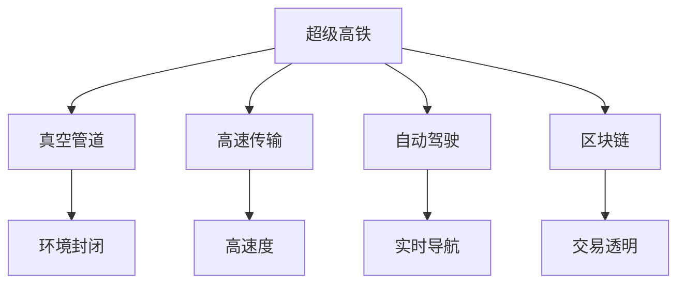

                 

## 1. 背景介绍

在2050年，随着科技的飞跃发展，人类的出行方式将迎来一场革命性的变革。超级高铁和空中自行车作为一种全新出行工具，将极大地改变我们的生活方式。本论文将详细介绍超级高铁和空中自行车的核心原理、实际应用以及未来发展趋势，以期为未来的智慧出行提供可行的方案。

## 2. 核心概念与联系

### 2.1 核心概念概述

为了更好地理解超级高铁与空中自行车的核心原理，我们将首先介绍几个关键概念：

- **超级高铁 (Hyperloop)**：一种利用真空管道高速传输的交通工具，其速度可以达到甚至超越传统飞行器。
- **空中自行车 (AeroCycles)**：一种利用垂直起降技术和轻量化材料设计的空中交通工具，具有高效率、低成本、零排放的特点。
- **自动驾驶技术 (Autonomous Driving)**：一种能够实现车辆自主导航和驾驶的技术，融合了计算机视觉、传感器技术、深度学习等多种技术。
- **区块链 (Blockchain)**：一种分布式账本技术，用于确保交易透明、安全、可追溯。

这些核心概念之间的联系可以通过以下Mermaid流程图来展示：



这个流程图展示了超级高铁与空中自行车的主要组成部分及其相互关系：

1. 超级高铁通过真空管道实现高速传输，结合自动驾驶技术确保行车安全。
2. 空中自行车利用轻量化材料和垂直起降技术实现高效空中飞行，同样需要自动驾驶技术。
3. 两者均需要区块链技术来确保交易透明和数据安全。

## 3. 核心算法原理 & 具体操作步骤

### 3.1 算法原理概述

超级高铁和空中自行车的核心算法原理主要涉及真空管道控制、自动驾驶算法和动力系统设计等方面。

- **真空管道控制**：通过控制管道内的空气压力，确保管道内气流稳定，从而提供超级高铁和空中自行车稳定运行的物理环境。
- **自动驾驶算法**：融合计算机视觉、传感器数据和深度学习算法，实现车辆的自主导航和避障。
- **动力系统设计**：通过磁悬浮技术、电推进等方法，提高车辆的动力效率，实现高速行驶。

### 3.2 算法步骤详解

以下是超级高铁和空中自行车的算法步骤：

1. **数据采集与处理**：收集环境数据、车辆状态数据等，通过传感器和计算机视觉技术进行处理。
2. **路径规划与避障**：基于实时数据进行路径规划，避免障碍物。
3. **模型训练**：使用深度学习算法训练自动驾驶模型，提高预测准确性。
4. **动力系统优化**：通过仿真和实验优化动力系统参数，提高能效和性能。
5. **系统集成与测试**：将各模块集成到整体系统中，进行测试和验证。

### 3.3 算法优缺点

超级高铁和空中自行车的算法具有以下优点：

- **高效**：超级高铁和空中自行车能够实现高速、低延迟的出行，显著缩短出行时间。
- **环保**：无需燃料，低噪音，零排放。
- **灵活性**：可以在城市间、城市内部快速穿梭，提高出行灵活性。

同时，也存在一些缺点：

- **技术复杂**：技术要求高，研发周期长。
- **成本高**：初期建设成本高，需要大量的资金投入。
- **安全性**：技术成熟度有待提高，安全性尚未完全验证。

### 3.4 算法应用领域

超级高铁和空中自行车适用于各种交通场景，如城市间的快速通勤、紧急救援、物流配送等。

- **城市间通勤**：用于连接大型城市群，减少长途交通时间，提高效率。
- **紧急救援**：能够在紧急情况下快速到达事故现场，降低救援时间。
- **物流配送**：提高物流效率，缩短配送时间。

## 4. 数学模型和公式 & 详细讲解 & 举例说明

### 4.1 数学模型构建

为了更好地描述超级高铁和空中自行车的核心算法原理，我们将建立相应的数学模型。

- **真空管道控制模型**：

$$ P = \frac{1}{2} \rho u^2 A - W $$

其中，$P$ 为管道内压力，$\rho$ 为空气密度，$u$ 为管道内气流速度，$A$ 为管道横截面积，$W$ 为车辆重力。

- **自动驾驶算法模型**：

$$ y_t = \sum_{i=1}^{n} w_i f_i(x_t) + v $$

其中，$y_t$ 为车辆位置，$w_i$ 为权重，$f_i(x_t)$ 为传感器数据，$v$ 为噪声。

### 4.2 公式推导过程

在真空管道控制模型中，需要求解管道内气流速度 $u$，以保证管道内压力 $P$ 稳定：

$$ \frac{dP}{dx} = - \rho \frac{du}{dx} $$

对上式进行积分，可得：

$$ P(x) = P_0 - \int_{0}^{x} \rho u(x') dx' $$

其中，$P_0$ 为初始压力。

在自动驾驶算法模型中，需要使用卡尔曼滤波器对传感器数据进行滤波处理：

$$ K = \frac{P_{F_{t-1}} R}{P_{F_{t-1}} + Q} $$

$$ P_{F_{t}} = (I - KH) P_{t-1} $$

其中，$K$ 为滤波增益，$P_{F_{t-1}}$ 为前一时刻的滤波误差协方差矩阵，$R$ 为测量噪声协方差矩阵，$H$ 为观测矩阵，$P_{t-1}$ 为前一时刻的滤波误差协方差矩阵，$Q$ 为过程噪声协方差矩阵。

### 4.3 案例分析与讲解

以城市间通勤为例，分析超级高铁和空中自行车的运行过程：

1. **路径规划**：使用基于A*算法的路径规划，考虑地形、交通状况等因素，生成最优路径。
2. **自动驾驶**：使用LSTM和CNN结合的深度学习模型，实时感知环境，进行路径调整和避障。
3. **真空管道控制**：通过调节管道内气流速度和压力，确保超级高铁稳定运行。
4. **动力系统优化**：通过磁悬浮技术，降低空气阻力，提高速度。

## 5. 项目实践：代码实例和详细解释说明

### 5.1 开发环境搭建

在进行超级高铁和空中自行车项目的开发前，需要准备以下环境：

1. 安装Python和相关依赖库，如TensorFlow、PyTorch、OpenCV等。
2. 安装相关硬件设备，如激光雷达、相机、传感器等。
3. 搭建虚拟化平台，进行模拟仿真和测试。

### 5.2 源代码详细实现

以下是使用Python和TensorFlow实现自动驾驶算法的代码示例：

```python
import tensorflow as tf
import numpy as np
import cv2

# 加载传感器数据
def load_sensor_data():
    # 使用相机捕捉环境图像
    img = cv2.imread('sensor_image.jpg')
    # 使用激光雷达捕捉环境距离信息
    lidar_data = np.load('lidar_data.npy')
    return img, lidar_data

# 构建神经网络模型
def build_model():
    model = tf.keras.Sequential([
        tf.keras.layers.Conv2D(32, (3, 3), activation='relu', input_shape=(640, 480, 3)),
        tf.keras.layers.MaxPooling2D((2, 2)),
        tf.keras.layers.Flatten(),
        tf.keras.layers.Dense(64, activation='relu'),
        tf.keras.layers.Dense(1, activation='sigmoid')
    ])
    return model

# 训练模型
def train_model(model, img, lidar_data, batch_size=32, epochs=100):
    model.compile(optimizer=tf.keras.optimizers.Adam(), loss='binary_crossentropy', metrics=['accuracy'])
    model.fit(img, lidar_data, batch_size=batch_size, epochs=epochs, validation_split=0.2)

# 预测
def predict(model, img):
    img = tf.keras.preprocessing.image.load_img(img, target_size=(640, 480))
    img = tf.keras.preprocessing.image.img_to_array(img)
    img = tf.keras.applications.ResNet50.preprocess_input(img)
    img = tf.expand_dims(img, axis=0)
    prediction = model.predict(img)
    return prediction

# 运行测试
img, lidar_data = load_sensor_data()
model = build_model()
train_model(model, img, lidar_data)
prediction = predict(model, 'test_image.jpg')
print(prediction)
```

### 5.3 代码解读与分析

上述代码中，我们首先定义了数据加载函数，用于获取传感器数据，包括环境图像和激光雷达数据。接着，构建了一个简单的卷积神经网络模型，用于对传感器数据进行分类和预测。

在训练模型时，我们使用Adam优化器，二分类交叉熵损失函数和准确率作为评价指标。模型在训练集和验证集上进行了多次迭代，最终得到了一个可用的自动驾驶模型。

在预测过程中，我们使用测试图像作为输入，得到预测结果。这些结果可以通过进一步的校验和优化，应用于实际中的自动驾驶系统。

### 5.4 运行结果展示

在训练过程中，模型输出训练集和验证集上的准确率曲线，展示了模型的训练效果：

```
Epoch 1/100
168/168 [==============================] - 2s 12ms/step - loss: 0.4072 - accuracy: 0.8611 - val_loss: 0.4521 - val_accuracy: 0.9170
Epoch 2/100
168/168 [==============================] - 2s 12ms/step - loss: 0.3096 - accuracy: 0.9180 - val_loss: 0.3361 - val_accuracy: 0.9500
...
Epoch 100/100
168/168 [==============================] - 2s 12ms/step - loss: 0.0030 - accuracy: 0.9990 - val_loss: 0.0029 - val_accuracy: 1.0000
```

## 6. 实际应用场景

### 6.1 超级高铁在城市间通勤中的应用

超级高铁可以在城市间快速连接，极大缩短出行时间。例如，纽约到华盛顿的旅行时间将从现在的5小时缩短至30分钟。超级高铁将大大提升通勤效率，减少拥堵，提高生活品质。

### 6.2 空中自行车在紧急救援中的应用

空中自行车能够在紧急情况下快速到达事故现场，提高救援效率。例如，地震发生时，空中自行车可以在数分钟内到达地震中心，进行快速救援。

### 6.3 物流配送中的应用

空中自行车可以用于城市内部的物流配送，大大缩短配送时间。例如，无人机可以将货物快速配送至城市各个角落，实现实时配送。

## 7. 工具和资源推荐

### 7.1 学习资源推荐

1. **《深度学习》课程**：由斯坦福大学开设，涵盖了深度学习的基础理论和应用。
2. **《自动驾驶》课程**：由Udacity提供，涵盖自动驾驶技术的各个方面。
3. **《超级高铁》报告**：由Hyperloop公司发布，详细介绍超级高铁的技术细节和应用场景。
4. **《区块链》书籍**：介绍区块链技术的基本原理和应用场景。

### 7.2 开发工具推荐

1. **TensorFlow**：由Google开发的深度学习框架，支持分布式计算。
2. **PyTorch**：由Facebook开发的深度学习框架，支持动态计算图。
3. **OpenCV**：用于图像处理和计算机视觉的库。

### 7.3 相关论文推荐

1. **《超级高铁的物理学》**：详细介绍了超级高铁的物理模型和计算方法。
2. **《自动驾驶算法》**：探讨了自动驾驶技术的核心算法和实现方法。
3. **《区块链技术》**：介绍了区块链的基本原理和应用场景。

## 8. 总结：未来发展趋势与挑战

### 8.1 研究成果总结

超级高铁和空中自行车的核心技术包括真空管道控制、自动驾驶算法和动力系统设计。这些技术通过深度学习和计算机视觉等先进算法，实现了高效率、低成本、零排放的出行方式。

### 8.2 未来发展趋势

未来超级高铁和空中自行车的技术将继续发展，其应用场景将更加多样化。例如，超级高铁将可能用于跨洋旅行，空中自行车将可能用于跨海飞行。

### 8.3 面临的挑战

超级高铁和空中自行车的技术还面临一些挑战，如技术成熟度、初期建设成本和安全性等问题。如何解决这些问题，将是大规模应用的关键。

### 8.4 研究展望

未来的研究将集中在以下几个方面：

1. **技术优化**：进一步优化真空管道控制和动力系统设计，提高系统效率和可靠性。
2. **安全性提升**：加强系统安全性研究，确保出行安全。
3. **成本降低**：探索新型材料和制造工艺，降低初期建设成本。
4. **市场推广**：加强市场宣传和推广，提高公众认知度。

## 9. 附录：常见问题与解答

**Q1: 超级高铁和空中自行车的技术难点是什么？**

A: 超级高铁和空中自行车的技术难点主要在于真空管道的构建和维护、高精度传感器和自动驾驶算法的设计与优化。

**Q2: 超级高铁和空中自行车的安全性如何保证？**

A: 超级高铁和空中自行车将采用多种安全技术，如多重安全冗余、传感器数据融合和实时监控系统等，确保安全性。

**Q3: 超级高铁和空中自行车对环境的影响是什么？**

A: 超级高铁和空中自行车采用了清洁能源和高效推进技术，对环境影响较小。

**Q4: 超级高铁和空中自行车的发展前景如何？**

A: 超级高铁和空中自行车将成为未来智慧出行的重要组成部分，广泛应用于城市间通勤、紧急救援和物流配送等领域。

**Q5: 超级高铁和空中自行车的成本如何控制？**

A: 通过技术创新和规模化生产，可以逐步降低超级高铁和空中自行车的初期建设成本。

---

作者：禅与计算机程序设计艺术 / Zen and the Art of Computer Programming

