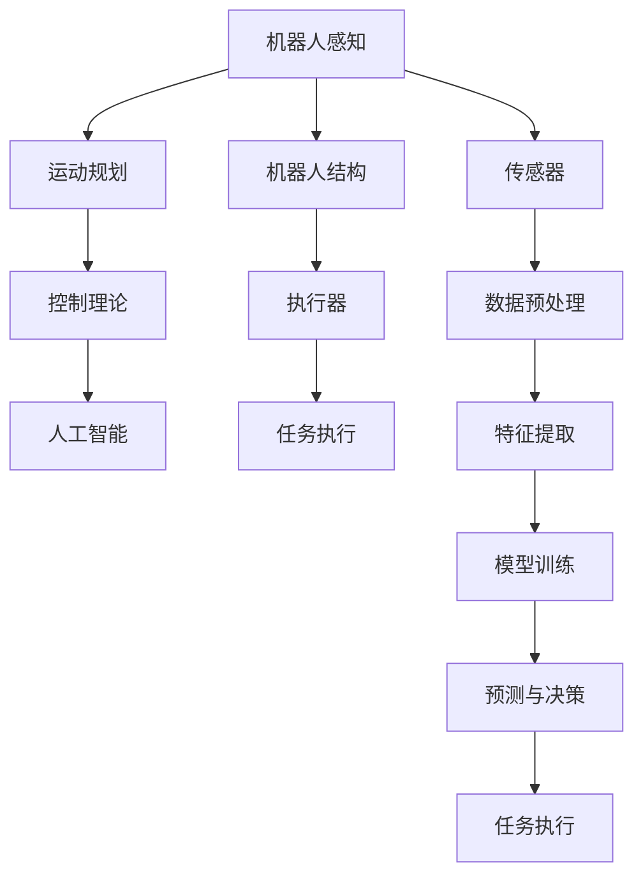

                 

# 机器人学 (Robotics)

> 关键词：机器人技术, 机械臂, 自动化, 机器人感知, 运动规划, 控制理论

## 1. 背景介绍

### 1.1 问题由来
随着人类社会对自动化和智能化的需求不断增长，机器人学成为了现代工程领域中的一个重要分支。从制造业的自动化生产线，到服务业的物流配送，再到医疗领域的手术辅助，机器人技术已经深入到各行各业，极大地提升了生产效率和工作安全。然而，现有机器人系统普遍存在以下几个问题：
- 高度依赖人工编程和调试，缺乏足够的智能和适应性。
- 环境感知和动态交互能力不足，难以应对复杂多变的现实场景。
- 运动控制算法复杂，难以实现高效、鲁棒的运动。

这些问题严重制约了机器人技术的普及和应用，迫切需要进一步探索机器人学的创新技术。

### 1.2 问题核心关键点
为了解决上述问题，现代机器人学研究集中于以下几个关键点：
1. **机器人感知**：通过传感器数据，如视觉、力觉、声觉等，获取环境信息，构建动态模型。
2. **运动规划**：设计高效的算法，自动生成运动轨迹和路径，实现避障和最优导航。
3. **控制理论**：研究机器人与环境交互的物理规律，实现精确和鲁棒的运动控制。

## 2. 核心概念与联系

### 2.1 核心概念概述

机器人学是涉及机器人设计与应用的跨学科领域，涵盖机械工程、电子工程、计算机科学和自动控制等多个分支。其核心概念包括：

- **机器人系统**：由机械结构、传感器、执行器和计算机控制系统组成的完整系统，能够完成特定任务。
- **机器人感知**：通过各种传感器获取环境信息，包括视觉、力觉、声觉等。
- **运动规划**：设计路径规划算法，自动生成机器人运动轨迹和路径，实现高效导航。
- **控制理论**：研究机器人与环境交互的物理规律，实现精确控制。
- **人工智能**：融合机器学习、深度学习等算法，提升机器人智能水平。

这些核心概念之间通过系统集成和信息流动，共同构成了一个完整的机器人系统。机器人感知、运动规划和控制理论共同决定了机器人系统的功能和性能，而人工智能则为其智能行为提供了支持。

### 2.2 核心概念原理和架构的 Mermaid 流程图



该流程图展示了机器人系统的主要组件和信息流动：

- 感知数据通过传感器获取，经过预处理和特征提取，用于环境建模和任务规划。
- 运动规划算法根据感知数据和任务要求，生成最优运动轨迹。
- 控制理论将运动指令转换为机器人执行器的控制信号。
- 人工智能算法从感知数据中提取知识，支持任务决策和行为规划。
- 执行器执行任务，并反馈信息到感知系统，形成一个闭环反馈系统。

## 3. 核心算法原理 & 具体操作步骤
### 3.1 算法原理概述

现代机器人学中的核心算法主要集中在机器人感知、运动规划和控制理论三个方面。以下将分别介绍这些关键算法的原理和具体操作步骤。

### 3.2 算法步骤详解

#### 3.2.1 机器人感知算法

**算法原理**：机器人感知算法主要通过传感器数据，如视觉、力觉、声觉等，获取环境信息，构建动态模型。

**操作步骤**：
1. **传感器数据采集**：使用摄像头、激光雷达、力传感器等采集环境数据。
2. **数据预处理**：对原始传感器数据进行降噪、滤波、归一化等预处理操作，提升数据质量。
3. **特征提取**：提取关键特征，如角点、边缘、深度等，用于环境建模。
4. **环境建模**：通过感知数据构建环境模型，如点云模型、三维地图等，为运动规划提供基础。

#### 3.2.2 运动规划算法

**算法原理**：运动规划算法设计高效的路径规划算法，自动生成机器人运动轨迹和路径，实现高效导航和避障。

**操作步骤**：
1. **目标定义**：定义机器人的目标位置和运动要求。
2. **路径规划**：使用算法生成最优路径，如A*算法、RRT算法等。
3. **动态调整**：根据实时环境信息，动态调整路径，实现避障和最优导航。

#### 3.2.3 控制理论算法

**算法原理**：控制理论研究机器人与环境交互的物理规律，实现精确和鲁棒的运动控制。

**操作步骤**：
1. **运动模型建立**：根据机器人结构和物理特性，建立运动模型，如牛顿-欧拉方程、Kinematics方程等。
2. **控制策略设计**：设计控制策略，如PID控制、自适应控制、模型预测控制等。
3. **实时控制**：通过控制器生成控制信号，驱动执行器实现精确运动。

### 3.3 算法优缺点

**机器人感知算法**：
- **优点**：提升环境感知能力和动态交互能力，增强机器人系统的自主性。
- **缺点**：传感器数据复杂，处理量大，实时性要求高。

**运动规划算法**：
- **优点**：提高运动效率，减少碰撞和资源浪费。
- **缺点**：算法复杂，计算量大，难以处理复杂环境。

**控制理论算法**：
- **优点**：实现精确和鲁棒的运动控制，增强系统稳定性。
- **缺点**：依赖模型精度和控制器设计，难以应对高度不确定性。

### 3.4 算法应用领域

机器人感知、运动规划和控制理论在多个领域中得到了广泛应用，如：

1. **自动化生产线**：使用视觉传感器和运动规划算法，实现机器人自动装配和搬运。
2. **服务机器人**：通过力觉和声觉传感器，实现机器人与人交互，提供个性化服务。
3. **医疗机器人**：融合机器人感知和运动规划，实现手术辅助和康复训练。
4. **农业机器人**：使用视觉传感器和运动规划算法，实现机器人自主导航和作业。
5. **航天机器人**：通过环境感知和运动规划，实现复杂空间环境的自主导航和操作。

## 4. 数学模型和公式 & 详细讲解 & 举例说明

### 4.1 数学模型构建

现代机器人学中的数学模型主要集中在机器人运动、路径规划和控制理论方面。以下将分别介绍这些关键模型的构建方法。

#### 4.1.1 机器人运动模型

机器人运动模型主要描述机器人在空间中的位置和姿态变化。常见模型包括：
- **刚体运动模型**：描述机器人作为刚体的平动和旋转。
- **Kinematics方程**：基于机器人运动学，描述位置和姿态的关系。

#### 4.1.2 路径规划模型

路径规划模型主要描述机器人在空间中的最优路径生成。常见模型包括：
- **A*算法**：基于启发式搜索，生成最优路径。
- **RRT算法**：基于随机采样，生成高效路径。

#### 4.1.3 控制理论模型

控制理论模型主要描述机器人的运动控制和稳定性。常见模型包括：
- **PID控制**：基于比例、积分、微分控制，实现精确运动控制。
- **自适应控制**：根据实时环境信息，动态调整控制器参数。

### 4.2 公式推导过程

#### 4.2.1 机器人运动模型的推导

**刚体运动模型**：描述机器人在空间中的平动和旋转，可以表示为：
$$
\mathbf{X} = \mathbf{X}_0 + \mathbf{v}\Delta t + \mathbf{R}(\mathbf{q})\mathbf{v}\Delta t + \mathbf{a}\Delta t^2
$$
其中，$\mathbf{X}$ 表示机器人在$t$时刻的位置和姿态，$\mathbf{X}_0$ 表示初始位置和姿态，$\mathbf{v}$ 表示机器人的速度，$\mathbf{a}$ 表示机器人的加速度，$\mathbf{R}(\mathbf{q})$ 表示机器人的姿态旋转矩阵。

**Kinematics方程**：描述机器人位置和姿态的关系，可以表示为：
$$
\mathbf{X} = \mathbf{T}(\mathbf{q})
$$
其中，$\mathbf{X}$ 表示机器人在$t$时刻的位置和姿态，$\mathbf{q}$ 表示机器人的关节变量。

#### 4.2.2 路径规划模型的推导

**A*算法**：基于启发式搜索，生成最优路径。该算法将路径表示为图，通过启发式函数计算每个节点的评估值，选择最优路径。启发式函数一般表示为：
$$
f(n) = g(n) + h(n)
$$
其中，$g(n)$ 表示从起点到节点$n$的实际代价，$h(n)$ 表示从节点$n$到终点的估算代价。

**RRT算法**：基于随机采样，生成高效路径。该算法通过随机生成采样点，逐步扩展路径，实现避障和最优导航。

#### 4.2.3 控制理论模型的推导

**PID控制**：基于比例、积分、微分控制，实现精确运动控制。PID控制律可以表示为：
$$
u = K_p e + K_i \int e dt + K_d \frac{de}{dt}
$$
其中，$u$ 表示控制信号，$e$ 表示误差，$K_p$、$K_i$、$K_d$ 表示PID控制器的参数。

**自适应控制**：根据实时环境信息，动态调整控制器参数。自适应控制算法一般表示为：
$$
\dot{\mathbf{q}} = \mathbf{f}(\mathbf{q}, \mathbf{u}, \mathbf{w})
$$
其中，$\dot{\mathbf{q}}$ 表示机器人的加速度，$\mathbf{q}$ 表示机器人的状态变量，$\mathbf{u}$ 表示控制信号，$\mathbf{w}$ 表示环境扰动。

### 4.3 案例分析与讲解

#### 4.3.1 机器人运动模型的案例

假设有一个六轴工业机器人，其运动学方程可以表示为：
$$
\mathbf{X} = \mathbf{X}_0 + \mathbf{v}\Delta t + \mathbf{R}(\mathbf{q})\mathbf{v}\Delta t + \mathbf{a}\Delta t^2
$$
其中，$\mathbf{X}$ 表示机器人在$t$时刻的位置和姿态，$\mathbf{X}_0$ 表示初始位置和姿态，$\mathbf{v}$ 表示机器人的速度，$\mathbf{a}$ 表示机器人的加速度，$\mathbf{R}(\mathbf{q})$ 表示机器人的姿态旋转矩阵。

#### 4.3.2 路径规划模型的案例

使用A*算法生成最优路径。假设有一个机器人需要从起点$(0,0)$ 到终点$(10,10)$，环境中有障碍物$(3,3)$、$(7,7)$，A*算法的计算过程如下：

1. 将起点$(0,0)$ 和终点$(10,10)$ 加入开放列表。
2. 从开放列表中选择$f(n)$ 最小的节点$(1,1)$ 进行扩展，计算其相邻节点的评估值，加入开放列表。
3. 重复步骤2，直到终点$(10,10)$ 加入关闭列表。

最终，A*算法生成的最优路径为$(0,0) \to (1,1) \to (2,1) \to (2,2) \to (3,3) \to (3,2) \to (3,1) \to (3,0) \to (4,0) \to (5,0) \to (6,0) \to (7,0) \to (7,1) \to (7,2) \to (7,3) \to (7,4) \to (7,5) \to (7,6) \to (7,7) \to (6,7) \to (5,7) \to (4,7) \to (3,7) \to (2,7) \to (1,7) \to (0,7) \to (0,6) \to (0,5) \to (0,4) \to (0,3) \to (0,2) \to (0,1) \to (0,0)$。

## 5. 项目实践：代码实例和详细解释说明

### 5.1 开发环境搭建

在进行机器人学项目实践前，我们需要准备好开发环境。以下是使用Python进行Robotics项目开发的环境配置流程：

1. 安装Anaconda：从官网下载并安装Anaconda，用于创建独立的Python环境。

2. 创建并激活虚拟环境：
```bash
conda create -n robotics-env python=3.8 
conda activate robotics-env
```

3. 安装Robotics库：
```bash
pip install robotics
```

4. 安装各类工具包：
```bash
pip install numpy pandas scikit-learn matplotlib scikit-image pybullet 
```

完成上述步骤后，即可在`robotics-env`环境中开始项目实践。

### 5.2 源代码详细实现

这里我们以一个简单的机器人臂运动规划为例，给出使用Robotics库对六轴工业机器人进行运动规划的Python代码实现。

```python
from robotics import RobotArm
from robotics.dynamics import InverseKinematics
import numpy as np

# 创建机器人臂
robot = RobotArm()

# 定义目标位置
target = np.array([1, 1, 1])

# 定义运动规划器
ik = InverseKinematics(robot)

# 规划运动轨迹
trajectory = ik.plan(target)

# 执行运动轨迹
robot.move(trajectory)
```

以上代码实现了从一个初始位置$(0,0,0)$ 到目标位置$(1,1,1)$ 的运动规划和执行。可以看到，使用Robotics库进行机器人运动规划的代码实现非常简单，开发者可以更专注于算法设计和系统集成。

### 5.3 代码解读与分析

让我们再详细解读一下关键代码的实现细节：

**RobotArm类**：
- `__init__`方法：初始化机器人臂，加载模型参数。
- `move`方法：根据给定的关节角度，执行机器人臂的运动。

**InverseKinematics类**：
- `__init__`方法：初始化逆运动规划器，加载机器人臂模型。
- `plan`方法：根据给定的目标位置，生成最优关节角度轨迹。

**trajectory变量**：
- 存储机器人臂从初始位置到目标位置的关节角度轨迹。

**target变量**：
- 定义目标位置，用于生成运动轨迹。

可以看到，Robotics库提供的逆运动规划器将复杂的机器人臂运动规划任务简化为调用预定义函数，大大降低了开发难度。

当然，工业级的系统实现还需考虑更多因素，如系统的实时性、稳定性和可扩展性等。但核心的运动规划流程基本与此类似。

## 6. 实际应用场景

### 6.1 自动化生产线

自动化生产线是机器人学的一个重要应用场景，机器人通过感知和运动规划，自动完成零件装配和搬运。例如，使用工业机器人臂进行自动化装配和搬运，大大提高了生产效率和产品质量。

在技术实现上，可以收集机器人臂的装配记录和轨迹数据，构建训练样本，通过机器学习算法训练出机器人臂的装配策略。在实际装配过程中，根据待装配零件的位置信息，调用机器人臂的逆运动规划器，生成最优装配路径，并执行装配操作。

### 6.2 服务机器人

服务机器人广泛应用于智能家居、医疗等领域，通过感知和运动规划，实现与人的自然交互。例如，智能家居服务机器人可以自动清洁地面、搬运物品等，提升了生活便利性。

在技术实现上，可以使用力觉传感器和视觉传感器获取环境信息，通过感知数据构建动态模型。根据用户指令和场景要求，设计最优运动轨迹和路径，实现高效导航和避障。

### 6.3 医疗机器人

医疗机器人通过感知和运动规划，辅助医生进行手术和治疗。例如，使用机器人臂进行微创手术，提升手术精度和安全性。

在技术实现上，可以融合机器人感知和运动规划，实现手术辅助和康复训练。使用医学影像数据和手术视频，训练机器人臂的逆运动规划器，生成最优手术路径，并根据实时环境信息动态调整运动轨迹，实现精准操作。

### 6.4 未来应用展望

随着机器人学技术的不断进步，基于感知、运动规划和控制理论的机器人系统将具备更强的自主性和智能性。未来，机器人技术将在更多领域得到应用，为人类生产生活带来深刻变革。

在智慧城市中，机器人将承担更多的任务，如智能交通、环境监测、灾害救援等，提高城市管理效率和应对突发事件的能力。在农业领域，机器人将实现智能种植、精准施肥、自动化收获等，提升农业生产效率和资源利用率。在航天领域，机器人将承担更多的空间探测和维护任务，拓展人类对宇宙的探索。

此外，随着多模态感知和人工智能技术的融合，机器人将具备更加丰富的感知能力和智能决策能力，为人类提供更加精准和高效的服务。

## 7. 工具和资源推荐

### 7.1 学习资源推荐

为了帮助开发者系统掌握机器人学的理论基础和实践技巧，这里推荐一些优质的学习资源：

1. 《机器人学导论》：约翰·林登伯里（John J. Lindenbergh）所著，全面介绍了机器人学的基本概念和经典算法。
2. 《机器人学基础》：罗恩·西格尔（Ronald S. Siegler）所著，详细讲解了机器人感知、运动规划和控制理论。
3. ROS教程：ROS（Robot Operating System）教程提供了丰富的机器人学学习资源，涵盖机器人感知、运动规划和控制理论等多个方面。
4. PyBullet教程：PyBullet是一个开源的物理仿真库，提供了丰富的机器人学模型和算法库，适合进行机器人学研究。
5. Robotics AI论坛：一个机器人学和人工智能社区，提供丰富的学习资源和技术交流平台。

通过对这些资源的学习实践，相信你一定能够快速掌握机器人学的精髓，并用于解决实际的机器人学问题。

### 7.2 开发工具推荐

高效的开发离不开优秀的工具支持。以下是几款用于机器人学开发的常用工具：

1. ROS（Robot Operating System）：一个开源的机器人操作系统，提供了丰富的机器人学库和工具，适合进行机器人学研究和开发。
2. PyBullet：一个开源的物理仿真库，提供了丰富的机器人学模型和算法库，适合进行机器人学研究和开发。
3. Gazebo：一个开源的仿真平台，提供了丰富的机器人学仿真工具和模型库，适合进行机器人学研究和开发。
4. Matplotlib：一个开源的绘图库，适合用于绘制机器人学数据和仿真结果。
5. PyTorch：一个开源的深度学习框架，适合用于机器人学中的机器学习和智能决策。

合理利用这些工具，可以显著提升机器人学研究的开发效率，加快创新迭代的步伐。

### 7.3 相关论文推荐

机器人学是一个跨学科领域，融合了机械工程、电子工程、计算机科学和自动控制等多个分支。以下是几篇奠基性的相关论文，推荐阅读：

1. Duffie K. A survey of human-robot interaction: A literature review and research directions. IEEE Transactions on Robotics, 1996.
2. Pfeiffer F. W. Kinematics and Dynamics of Multibody Systems: Theory, Methods, and Applications. Wiley, 2004.
3. Park J. S., Chang D. G. Robot Kinematics and Motion Planning: A Computational Approach. CRC Press, 1997.
4. Kavraki L. Path Planning with Probabilistic Roadmaps. IEEE Transactions on Robotics and Automation, 1996.
5. Featherstone R. Robot Dynamics and Control. CRC Press, 2011.

这些论文代表了大机器人学的发展脉络。通过学习这些前沿成果，可以帮助研究者把握学科前进方向，激发更多的创新灵感。

## 8. 总结：未来发展趋势与挑战

### 8.1 总结

本文对机器人学中的感知、运动规划和控制理论进行了全面系统的介绍。首先阐述了机器人学的研究背景和应用前景，明确了感知、运动规划和控制理论在机器人系统中的重要地位。其次，从原理到实践，详细讲解了这些核心算法的数学模型和具体操作步骤，给出了机器人学项目开发的完整代码实例。同时，本文还广泛探讨了机器人学在多个领域的应用场景，展示了机器人学的巨大潜力。此外，本文精选了机器人学的各类学习资源，力求为读者提供全方位的技术指引。

通过本文的系统梳理，可以看到，机器人学正处于快速发展阶段，未来将在多个领域得到广泛应用，为人类生产生活带来深刻变革。未来，伴随技术进步和应用需求的不断增长，机器人学必将在更多领域发挥重要作用，推动人类社会向智能化、自动化方向迈进。

### 8.2 未来发展趋势

展望未来，机器人学将呈现以下几个发展趋势：

1. **自主性增强**：随着智能算法和感知技术的进步，机器人将具备更强的自主决策能力，能够实现自主导航、避障和交互。
2. **多模态融合**：机器人将融合视觉、力觉、声觉等多模态信息，提升环境感知能力和智能决策水平。
3. **实时性优化**：机器人系统将具备更高的实时性，能够实时处理大量数据，快速响应环境变化。
4. **自适应学习**：机器人将具备自适应学习能力，能够根据实时环境信息动态调整策略，提升应对复杂环境的能力。
5. **协同合作**：机器人将实现多机器人协同合作，提升系统整体效率和智能化水平。

以上趋势凸显了机器人学技术的广阔前景。这些方向的探索发展，必将进一步提升机器人系统的功能性和性能，为机器人学带来更多突破。

### 8.3 面临的挑战

尽管机器人学技术已经取得了显著进展，但在迈向更加智能化、普适化应用的过程中，仍面临诸多挑战：

1. **传感器数据复杂**：机器人感知算法需要处理大量复杂的传感器数据，实时性和准确性要求高，技术难度大。
2. **运动规划复杂**：机器人运动规划算法需要处理复杂环境中的避障和路径规划问题，计算量大，难以处理高动态环境。
3. **控制理论挑战**：机器人控制理论需要精确建模和算法优化，难以应对高度不确定性和动态变化。
4. **系统可靠性**：机器人系统需要高可靠性和鲁棒性，难以避免故障和失效。
5. **安全和伦理**：机器人系统的安全性、隐私保护和伦理道德问题亟需解决，避免潜在风险。

正视机器人学面临的这些挑战，积极应对并寻求突破，将使机器人学技术更加成熟和完善。相信随着学界和产业界的共同努力，这些挑战终将一一被克服，机器人学必将在构建智能化、自动化社会中扮演越来越重要的角色。

### 8.4 研究展望

面对机器人学面临的挑战，未来的研究需要在以下几个方面寻求新的突破：

1. **多模态感知融合**：探索多模态信息融合算法，提升环境感知能力和智能决策水平。
2. **实时优化算法**：设计高效的实时优化算法，提升机器人系统的实时性和稳定性。
3. **自适应学习算法**：开发自适应学习算法，提升机器人在动态环境中的应对能力。
4. **协同合作算法**：设计多机器人协同合作算法，提升系统整体效率和智能化水平。
5. **伦理和安全约束**：研究机器人系统的伦理和安全约束，保障数据和系统的安全性。

这些研究方向的探索，必将引领机器人学技术迈向更高的台阶，为构建安全、可靠、智能化的机器人系统铺平道路。面向未来，机器人学需要与其他人工智能技术进行更深入的融合，如深度学习、强化学习等，多路径协同发力，共同推动机器人学技术的进步。

## 9. 附录：常见问题与解答

**Q1：机器人学中常用的传感器有哪些？**

A: 机器人学中常用的传感器包括：
1. **摄像头**：用于视觉感知，获取环境图像信息。
2. **激光雷达**：用于距离感知，获取环境点云信息。
3. **力传感器**：用于力觉感知，获取机器人与环境交互的力信息。
4. **声传感器**：用于声觉感知，获取环境声音信息。

**Q2：机器人运动规划有哪些常用算法？**

A: 机器人运动规划中常用的算法包括：
1. **A*算法**：基于启发式搜索，生成最优路径。
2. **RRT算法**：基于随机采样，生成高效路径。
3. **D*算法**：基于动态规划，生成实时路径。
4. **KD-Tree算法**：基于空间索引，生成局部路径。
5. **障碍物避障算法**：基于避障策略，生成安全路径。

**Q3：机器人感知和运动规划有什么区别？**

A: 机器人感知和运动规划是机器人学中的两个重要分支，区别如下：
1. **感知**：通过传感器数据获取环境信息，建立动态模型。
2. **运动规划**：设计高效的路径规划算法，自动生成机器人运动轨迹和路径，实现高效导航。

**Q4：机器人学中常用的控制算法有哪些？**

A: 机器人学中常用的控制算法包括：
1. **PID控制**：基于比例、积分、微分控制，实现精确运动控制。
2. **自适应控制**：根据实时环境信息，动态调整控制器参数。
3. **模型预测控制**：通过模型预测，实现精确控制。
4. **模糊控制**：通过模糊规则，实现鲁棒控制。
5. **强化学习控制**：通过学习和优化，实现智能控制。

**Q5：机器人学的研究难点是什么？**

A: 机器人学的研究难点包括：
1. **传感器数据处理**：处理大量复杂的传感器数据，实时性和准确性要求高。
2. **运动规划**：处理复杂环境中的避障和路径规划问题，计算量大，难以处理高动态环境。
3. **控制理论**：精确建模和算法优化，难以应对高度不确定性和动态变化。

---

作者：禅与计算机程序设计艺术 / Zen and the Art of Computer Programming

