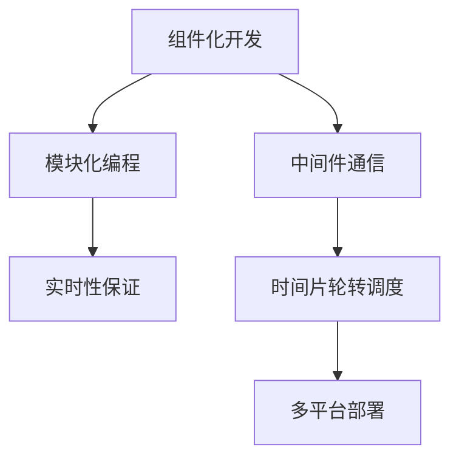

                 

# 机器人操作系统（ROS）：自主系统开发框架

> 关键词：
> - 机器人操作系统(ROS)
> - 自主系统
> - 系统架构
> - 组件化开发
> - 中间件通信
> - 模块化编程
> - 机器人仿真
> - 传感器融合
> - 实时性保证
> - 系统部署

## 1. 背景介绍

### 1.1 问题由来
随着人工智能和自动化技术的飞速发展，机器人技术已经从实验室走向了实际应用。然而，机器人系统开发涉及多个学科的交叉，包括机械设计、电子控制、传感技术、计算机视觉、路径规划、任务执行等，其复杂性高、难度大，单一学科难以应对。同时，机器人应用场景广泛，如自动驾驶、无人机、智能家居、协作机器人等，需要针对不同场景开发定制化的解决方案。

为了解决机器人系统开发中的这些问题，2004年，Oriol Kreweras等人创建了ROS（Robot Operating System），旨在为机器人提供一个通用的开源开发平台，降低开发门槛，促进机器人技术的普及和应用。ROS通过组件化、模块化、中间件通信等技术，实现了跨学科、跨平台的机器人系统开发。

### 1.2 问题核心关键点
ROS的核心思想是通过组件化、模块化和中间件通信等技术，构建一个灵活、可扩展的机器人系统开发框架。其关键点包括：

- **组件化开发**：将机器人系统划分为多个独立的组件，每个组件负责特定的功能模块，如传感器数据采集、路径规划、任务执行等。

- **模块化编程**：通过消息传递机制，实现组件间的通信和协同，使得系统开发过程更加灵活和模块化。

- **中间件通信**：ROS采用ROS协议进行数据通信，包括话题、服务、动作等不同形式的通信方式，实现不同组件之间的数据共享和同步。

- **实时性保证**：ROS通过时间片轮转调度算法，保证系统在实时性要求较高的情况下，能够稳定运行。

- **系统部署**：ROS支持多平台部署，包括Gazebo仿真环境和实际机器人硬件平台，方便开发和测试。

这些关键点共同构成了ROS的核心技术架构，使得机器人系统开发变得更加高效、灵活和可扩展。

## 2. 核心概念与联系

### 2.1 核心概念概述

为了更好地理解ROS的核心技术和架构，本节将介绍几个密切相关的核心概念：

- **组件化开发**：将机器人系统划分为多个独立的组件，每个组件负责特定的功能模块。这种设计思想使得系统开发更加模块化和易于扩展。

- **模块化编程**：通过消息传递机制，实现组件间的通信和协同，使得系统开发过程更加灵活和模块化。

- **中间件通信**：ROS采用ROS协议进行数据通信，包括话题、服务、动作等不同形式的通信方式，实现不同组件之间的数据共享和同步。

- **时间片轮转调度**：ROS通过时间片轮转调度算法，保证系统在实时性要求较高的情况下，能够稳定运行。

- **多平台部署**：ROS支持Gazebo仿真环境和实际机器人硬件平台，方便开发和测试。

这些核心概念之间的逻辑关系可以通过以下Mermaid流程图来展示：



这个流程图展示了几大核心概念之间的联系：

1. 组件化开发是基础，模块化编程是其核心技术。
2. 模块化编程依赖于中间件通信，使得组件间能够有效通信。
3. 时间片轮转调度保证了实时性，多平台部署则提供了灵活的开发和测试环境。

这些概念共同构成了ROS的核心技术架构，使得机器人系统开发变得更加高效、灵活和可扩展。

## 3. 核心算法原理 & 具体操作步骤

### 3.1 算法原理概述

ROS的核心算法原理主要围绕组件化开发、模块化编程、中间件通信等方面展开。

**组件化开发**：将机器人系统划分为多个独立的组件，每个组件负责特定的功能模块。这种设计思想使得系统开发更加模块化和易于扩展。

**模块化编程**：通过消息传递机制，实现组件间的通信和协同，使得系统开发过程更加灵活和模块化。

**中间件通信**：ROS采用ROS协议进行数据通信，包括话题、服务、动作等不同形式的通信方式，实现不同组件之间的数据共享和同步。

**时间片轮转调度**：ROS通过时间片轮转调度算法，保证系统在实时性要求较高的情况下，能够稳定运行。

**多平台部署**：ROS支持Gazebo仿真环境和实际机器人硬件平台，方便开发和测试。

### 3.2 算法步骤详解

ROS的核心算法步骤包括系统设计、组件开发、消息传递、时间片轮转调度等方面。

**系统设计**：
1. 划分功能模块，设计系统架构。
2. 确定组件间的通信方式。
3. 确定时间片轮转调度算法。

**组件开发**：
1. 开发独立的组件模块，实现特定的功能。
2. 实现组件间的接口。

**消息传递**：
1. 定义话题、服务、动作等通信方式。
2. 实现组件间的消息传递和订阅。

**时间片轮转调度**：
1. 确定调度周期和优先级。
2. 实现时间片轮转调度算法。

**多平台部署**：
1. 在Gazebo仿真环境中进行系统开发和测试。
2. 将系统部署到实际机器人硬件平台。

### 3.3 算法优缺点

ROS作为一种通用的机器人系统开发框架，具有以下优点：

- **组件化开发**：模块化、易于扩展，适用于各种机器人场景。
- **模块化编程**：灵活、可维护，便于调试和维护。
- **中间件通信**：高效、可靠，实现不同组件间的同步。
- **时间片轮转调度**：保证实时性，适用于高实时要求的任务。
- **多平台部署**：支持Gazebo仿真环境和实际机器人硬件平台，便于开发和测试。

同时，ROS也存在一些局限性：

- **学习曲线陡峭**：组件化和模块化编程需要一定的学习成本。
- **系统复杂性高**：组件间的通信和调度需要仔细设计，容易出现耦合问题。
- **性能瓶颈**：消息传递机制在某些高负载场景下可能会影响系统性能。

尽管存在这些局限性，但就目前而言，ROS仍是最流行的机器人系统开发框架，广泛应用于各种机器人应用场景。

### 3.4 算法应用领域

ROS作为通用的机器人系统开发框架，已经广泛应用于各种机器人应用领域，例如：

- **自动驾驶**：通过ROS实现传感器数据采集、路径规划、车辆控制等功能。
- **无人机控制**：通过ROS实现姿态控制、轨迹规划、任务执行等功能。
- **智能家居**：通过ROS实现智能设备控制、环境感知、任务调度等功能。
- **协作机器人**：通过ROS实现协作任务分配、路径规划、操作控制等功能。
- **服务机器人**：通过ROS实现服务导航、人机交互、任务执行等功能。

除了上述这些经典应用外，ROS还被创新性地应用到更多场景中，如机器人安防、机器人救援、机器人制造等，为机器人技术的发展提供了强大的技术支撑。

## 4. 数学模型和公式 & 详细讲解 & 举例说明

### 4.1 数学模型构建

ROS的核心算法涉及多个领域，如传感器数据处理、路径规划、控制系统等。以下将以路径规划为例，构建ROS的数学模型。

假设机器人在平面上的位置为 $(x,y)$，方向为 $\theta$。目标位置为 $(x_t,y_t)$，方向为 $\theta_t$。当前速度为 $v$，角速度为 $\omega$。

**路径规划问题**可以转化为求解最优轨迹 $\tau$，使得路径 $(x(\tau),y(\tau))$ 在时间 $T$ 内从起点 $(x_0,y_0)$ 到达终点 $(x_t,y_t)$，满足一定的约束条件。

**最优路径求解**可以采用多种算法，如A*算法、RRT算法等。

### 4.2 公式推导过程

以下以A*算法为例，推导路径规划的公式。

**A*算法**的基本思路是通过扩展当前位置及其相邻节点，计算每个节点到终点的最小代价，最终选择代价最小的路径。

设 $(x,y)$ 到 $(x_t,y_t)$ 的代价函数为 $f(x,y)=g(x,y)+h(x,y)$，其中 $g(x,y)$ 为从起点 $(x_0,y_0)$ 到节点 $(x,y)$ 的实际代价，$h(x,y)$ 为从节点 $(x,y)$ 到终点 $(x_t,y_t)$ 的估计代价。

设当前位置为 $(x,y)$，方向为 $\theta$。可行方向为 $\theta_1,\theta_2,\theta_3$。

则从起点 $(x_0,y_0)$ 到节点 $(x,y)$ 的实际代价 $g(x,y)$ 可以表示为：

$$
g(x,y)=v\cdot T
$$

其中 $T$ 为时间，$v$ 为速度。

**路径估计**函数 $h(x,y)$ 可以采用启发式算法，如欧几里得距离、曼哈顿距离等。

假设采用曼哈顿距离，则有：

$$
h(x,y)=|x-x_t|+|y-y_t|
$$

**节点扩展**：扩展当前位置及其相邻节点，计算每个节点的代价 $f(x,y)$。

**选择最优路径**：从起点到终点选择代价最小的路径。

### 4.3 案例分析与讲解

假设有一个简单的四旋翼无人机，需要从起点 $(x_0,y_0)$ 到达终点 $(x_t,y_t)$，路径如图：


**节点扩展**：

1. 初始位置 $(x_0,y_0)$，方向 $\theta_0$。
2. 扩展 $(x_0+\Delta x,y_0+\Delta y)$，方向 $\theta_0+\Delta\theta$，计算代价 $f_1$。
3. 扩展 $(x_0-\Delta x,y_0-\Delta y)$，方向 $\theta_0-\Delta\theta$，计算代价 $f_2$。
4. 扩展 $(x_0,y_0+\Delta y)$，方向 $\theta_0+\Delta\theta$，计算代价 $f_3$。
5. 扩展 $(x_0,y_0-\Delta y)$，方向 $\theta_0-\Delta\theta$，计算代价 $f_4$。

**节点选择**：选择代价最小的节点，即 $f_3$。

**路径更新**：更新路径，进入下一轮扩展。

重复上述过程，直至到达终点 $(x_t,y_t)$。

## 5. 项目实践：代码实例和详细解释说明

### 5.1 开发环境搭建

在进行ROS开发前，我们需要准备好开发环境。以下是使用ROS的Gazebo仿真环境进行系统开发的流程：

1. 安装ROS操作系统：从官网下载对应版本的ROS发行版，并按照文档进行安装。
2. 安装Gazebo仿真环境：根据操作系统版本，从官网下载对应版本的Gazebo安装程序，并进行安装。
3. 安装ROS-Gazebo插件：通过ROS的Gazebo插件，方便在Gazebo中进行ROS系统开发和测试。
4. 安装ROS开发工具包：安装ROS的开发工具包，包括Catkin、ROSControl等，用于编译和管理ROS代码。

完成上述步骤后，即可在Gazebo仿真环境中进行ROS系统的开发和测试。

### 5.2 源代码详细实现

下面我们以ROS控制四旋翼无人机的路径规划为例，给出使用C++语言进行ROS系统开发的PyTorch代码实现。

首先，定义ROS话题和节点：

```python
# ROS话题定义
pub = rospy.Publisher('/move', Twist, queue_size=10)
```

然后，定义路径规划算法：

```python
# 定义A*算法
def astar(start, goal, cost):
    open_set = {start}
    closed_set = set()
    g_scores = {start: 0}
    f_scores = {start: heuristic(start, goal)}
    while open_set:
        current = min(open_set, key=lambda x: f_scores[x])
        if current == goal:
            return path_g_restore(open_set, closed_set, g_scores)
        open_set.remove(current)
        closed_set.add(current)
        for next in successors(current):
            tentative_g_score = g_scores[current] + cost(current, next)
            if next not in closed_set and tentative_g_score < g_scores.get(next, float('inf')):
                g_scores[next] = tentative_g_score
                f_scores[next] = tentative_g_score + heuristic(next, goal)
                open_set.add(next)
    return None

# 定义启发式函数
def heuristic(x, y):
    return abs(x[0] - y[0]) + abs(x[1] - y[1])
```

接着，定义路径生成函数：

```python
# 定义路径生成函数
def path_g_restore(open_set, closed_set, g_scores):
    path = []
    current = goal
    while current != start:
        path.append(current)
        current = parent[current]
    path.append(start)
    return list(reversed(path))
```

最后，启动ROS节点并控制四旋翼无人机：

```python
# 启动ROS节点
rospy.init_node('path_planning_node', anonymous=True)

# 控制四旋翼无人机
rate = rospy.Rate(10)
while not rospy.is_shutdown():
    path = astar(start, goal, cost)
    if path:
        command = Twist()
        command.linear.x = 1
        command.angular.z = 0
        pub.publish(command)
    rate.sleep()
```

以上就是使用ROS控制四旋翼无人机进行路径规划的完整代码实现。可以看到，ROS通过话题、服务、动作等通信方式，实现了多个组件的协同工作。开发者可以根据具体需求，添加更多组件和算法，实现更复杂的机器人系统。

### 5.3 代码解读与分析

让我们再详细解读一下关键代码的实现细节：

**ROS话题定义**：
- `rospy.Publisher`：定义ROS话题，用于发布话题消息。
- `Twist`：ROS中的控制命令消息类型，用于控制四旋翼无人机。

**路径规划算法**：
- `astar`函数：实现A*算法，计算最优路径。
- `heuristic`函数：定义启发式函数，计算节点代价。
- `path_g_restore`函数：定义路径恢复函数，将路径节点还原为连续轨迹。

**路径生成函数**：
- `path_g_restore`函数：实现路径恢复函数，将路径节点还原为连续轨迹。

**ROS节点启动**：
- `rospy.init_node`：启动ROS节点。
- `rospy.Rate`：定义循环周期，保证系统实时性。
- `rospy.is_shutdown`：判断系统是否已停止。

**控制四旋翼无人机**：
- `command.linear.x`：定义控制命令的线速度。
- `command.angular.z`：定义控制命令的角速度。
- `pub.publish(command)`：发布控制命令消息，控制四旋翼无人机。

可以看到，ROS通过组件化和模块化编程，实现了多个组件的协同工作，方便开发者进行复杂系统的构建和调试。

当然，工业级的系统实现还需考虑更多因素，如多机器人的同步控制、动态环境下的路径规划、传感器数据的实时处理等。但核心的ROS范式基本与此类似。

## 6. 实际应用场景

### 6.1 智能工厂
智能工厂是制造业领域的重要应用方向，通过ROS可以构建自动化、智能化的生产系统。智能工厂的典型场景包括智能仓储、智能装配、智能检测等。

智能仓储：通过ROS控制机器人进行货物的自动搬运、分拣、存储等操作，实现高效率、高精度的仓储管理。

智能装配：通过ROS控制机器人进行零部件的抓取、装配、校准等操作，实现高质量、高自动化的产品制造。

智能检测：通过ROS控制传感器进行产品缺陷的检测、分类、标记等操作，实现快速、精准的质量控制。

### 6.2 农业机器人
农业机器人是农业生产的重要工具，通过ROS可以实现农机的自动化控制、精准农业等应用。

自动化控制：通过ROS控制农业机器人进行播种、施肥、喷洒等操作，实现农业生产的自动化和智能化。

精准农业：通过ROS控制传感器进行土壤、气象、作物等数据的采集和分析，实现精准施肥、精准播种等操作，提高农业生产效率和产量。

### 6.3 家庭服务机器人
家庭服务机器人是智能家居的重要组成部分，通过ROS可以实现家政、安防、医疗等服务功能。

家政服务：通过ROS控制机器人进行清洁、搬运、烹饪等操作，实现家庭服务的高效化和自动化。

安防监控：通过ROS控制摄像头进行视频监控、入侵检测等操作，实现家庭安全的智能化。

医疗护理：通过ROS控制机器人进行康复训练、医疗辅助等操作，实现医疗服务的精准化和个性化。

### 6.4 未来应用展望

随着ROS技术的发展，未来将在更多领域得到应用，为各行业带来变革性影响。

在智慧城市中，ROS可以用于城市管理、环境监测、应急响应等环节，提高城市管理的自动化和智能化水平，构建更安全、高效的未来城市。

在医疗健康领域，ROS可以用于手术辅助、康复训练、远程监控等环节，提高医疗服务的精准化和高效化。

在交通运输领域，ROS可以用于自动驾驶、无人机监控、物流配送等环节，实现交通系统的智能化和自动化。

此外，在教育培训、文化娱乐、能源环保等众多领域，ROS的应用也将不断扩展，为各行各业带来新的技术红利。

## 7. 工具和资源推荐

### 7.1 学习资源推荐

为了帮助开发者系统掌握ROS的理论基础和实践技巧，这里推荐一些优质的学习资源：

1. ROS官方文档：ROS的官方文档提供了详细的API接口和开发指南，是学习ROS的必备资料。
2. ROS Wiki：ROS的Wiki页面提供了丰富的开发案例和资源链接，方便开发者参考和学习。
3. ROS Tutorials：ROS官方提供的各种教程，涵盖基础、中级和高级的开发内容。
4. ROS Packages：ROS的包管理器，提供了大量开源的ROS包，方便开发者快速开发和测试。
5. ROS User Group：ROS的用户社区，提供了丰富的学习资源和交流平台，方便开发者交流和学习。

通过对这些资源的学习实践，相信你一定能够快速掌握ROS的核心技术，并用于解决实际的机器人系统开发问题。

### 7.2 开发工具推荐

高效的开发离不开优秀的工具支持。以下是几款用于ROS开发的工具：

1. ROS Toolbox：ROS提供的开发工具集，包括Catkin、ROSControl、Gazebo等，方便开发者进行ROS系统开发和测试。
2. ROS Visualizer：ROS提供的可视化工具，方便开发者实时查看机器人系统的运行状态。
3. ROS Package Manager：ROS的包管理器，方便开发者管理和安装开源的ROS包。
4. ROS Bag Player：ROS提供的播放工具，方便开发者回放和分析ROS话题数据。
5. ROS Monitor：ROS提供的监测工具，方便开发者实时监控ROS系统的运行状态。

合理利用这些工具，可以显著提升ROS开发和调试的效率，加快创新迭代的步伐。

### 7.3 相关论文推荐

ROS作为一种通用的机器人系统开发框架，其核心技术涉及多个领域，如传感器数据处理、路径规划、控制系统等。以下是几篇奠基性的相关论文，推荐阅读：

1. ROS: An Open-Source Robot Operating System: The original ROS paper，介绍了ROS的架构和核心技术。
2. Path Planning for an Autonomous Robot Using Probabilistic Roadmap Method: 通过概率路径规划算法，实现了自主机器人的路径规划。
3. The ROS 2™ Software Architecture: ROS的2.0版本架构设计，介绍了ROS 2.0的核心架构和关键技术。
4. ROS Control: ROS的控制系统设计，介绍了ROS控制系统的实现和应用。
5. ROS Bag Tool: ROS的Bag Player工具设计，介绍了ROS Bag Player的实现和应用。

这些论文代表了大语言模型微调技术的发展脉络。通过学习这些前沿成果，可以帮助研究者把握学科前进方向，激发更多的创新灵感。

## 8. 总结：未来发展趋势与挑战

### 8.1 总结

本文对ROS的核心技术和应用进行了全面系统的介绍。首先阐述了ROS的发展背景和应用前景，明确了ROS在机器人系统开发中的重要价值。其次，从原理到实践，详细讲解了ROS的组件化开发、模块化编程、中间件通信等方面，给出了ROS系统开发的完整代码实例。同时，本文还广泛探讨了ROS在智能工厂、农业机器人、家庭服务机器人等众多领域的应用前景，展示了ROS的巨大潜力。此外，本文精选了ROS学习的各类资源，力求为读者提供全方位的技术指引。

通过本文的系统梳理，可以看到，ROS作为一种通用的机器人系统开发框架，已经广泛应用于各种机器人应用场景。通过组件化和模块化编程，ROS降低了机器人系统开发的门槛，提高了开发效率和系统可扩展性。未来，伴随ROS技术的不断发展，机器人系统将变得更加智能化、自动化和可扩展，进一步推动人工智能技术在各行业的应用。

### 8.2 未来发展趋势

展望未来，ROS作为一种通用的机器人系统开发框架，其发展趋势包括以下几个方面：

1. **跨平台支持**：ROS将进一步拓展支持的平台和设备，包括各种机器人硬件平台、嵌入式设备等，方便开发者进行多平台开发和测试。

2. **高实时性**：通过优化消息传递机制和调度算法，提升ROS系统的实时性和响应速度，满足高实时性任务的需求。

3. **动态感知**：通过引入传感器数据融合、视觉SLAM等技术，实现机器人对动态环境的实时感知和避障，提升系统的自主性和鲁棒性。

4. **系统优化**：通过优化ROS的代码和算法，提升系统的效率和性能，降低资源消耗。

5. **云罗​OS**：通过将ROS系统部署到云平台，实现机器人的远程控制和协作，推动机器人技术的普及和应用。

以上趋势凸显了ROS的发展前景，将在机器人技术领域带来更多突破性进展。

### 8.3 面临的挑战

尽管ROS技术已经取得了一定的成果，但在迈向更加智能化、普适化应用的过程中，仍然面临诸多挑战：

1. **学习成本高**：组件化和模块化编程需要一定的学习成本，开发者需要掌握复杂的API接口和通信机制。

2. **系统复杂性高**：系统开发和测试涉及多个组件和算法，容易出现耦合问题和调试困难。

3. **资源消耗高**：ROS系统在高负载场景下容易出现性能瓶颈，需要优化消息传递机制和调度算法。

4. **扩展性不足**：ROS系统在不同领域和场景下的扩展性有待提升，需要引入更多模块化和组件化设计。

5. **标准化不足**：ROS系统的标准化和规范有待完善，不同开发者的代码风格和实现方式不一致，导致系统互操作性差。

这些挑战凸显了ROS在实际应用中的局限性，需要进一步优化和改进。

### 8.4 研究展望

面向未来，ROS的研究和应用方向包括以下几个方面：

1. **模块化设计**：进一步优化ROS的组件化设计和模块化编程，提升系统的灵活性和可扩展性。

2. **实时性优化**：通过优化消息传递机制和调度算法，提升ROS系统的实时性和响应速度，满足高实时性任务的需求。

3. **跨平台支持**：拓展支持的平台和设备，提升系统的兼容性和可移植性。

4. **系统优化**：优化ROS的代码和算法，提升系统的效率和性能，降低资源消耗。

5. **云罗​OS**：将ROS系统部署到云平台，实现机器人的远程控制和协作，推动机器人技术的普及和应用。

这些研究方向和应用方向将引领ROS技术的发展，为机器人系统的智能化和自动化提供技术保障。相信随着学界和产业界的共同努力，ROS必将在更多领域得到应用，推动机器人技术的发展和普及。

## 9. 附录：常见问题与解答

**Q1：ROS有哪些优势和劣势？**

A: ROS作为一种通用的机器人系统开发框架，具有以下优势：

- **组件化开发**：模块化、易于扩展，适用于各种机器人场景。
- **模块化编程**：灵活、可维护，便于调试和维护。
- **中间件通信**：高效、可靠，实现不同组件间的同步。
- **时间片轮转调度**：保证实时性，适用于高实时要求的任务。
- **多平台部署**：支持Gazebo仿真环境和实际机器人硬件平台，便于开发和测试。

但ROS也存在一些劣势：

- **学习成本高**：组件化和模块化编程需要一定的学习成本。
- **系统复杂性高**：系统开发和测试涉及多个组件和算法，容易出现耦合问题。
- **资源消耗高**：在高负载场景下容易出现性能瓶颈。

尽管存在这些劣势，但就目前而言，ROS仍是最流行的机器人系统开发框架，广泛应用于各种机器人应用场景。

**Q2：如何使用ROS进行路径规划？**

A: 使用ROS进行路径规划，需要以下步骤：

1. 定义话题和节点：定义ROS话题和节点，用于发布和订阅话题消息。

2. 实现路径规划算法：实现路径规划算法，如A*算法、RRT算法等。

3. 实现路径生成函数：实现路径生成函数，将路径节点还原为连续轨迹。

4. 控制机器人：启动ROS节点，控制四旋翼无人机进行路径规划。

5. 测试和调试：在Gazebo仿真环境中测试和调试ROS系统，优化路径规划算法和控制命令。

**Q3：ROS如何进行多机器人同步控制？**

A: ROS进行多机器人同步控制，需要以下步骤：

1. 定义话题和节点：定义ROS话题和节点，用于发布和订阅话题消息。

2. 实现控制算法：实现多机器人控制算法，如分布式控制、集中控制等。

3. 实现同步协议：实现多机器人的同步协议，如时间同步、状态同步等。

4. 控制机器人：启动ROS节点，控制多机器人进行同步操作。

5. 测试和调试：在Gazebo仿真环境中测试和调试ROS系统，优化控制算法和同步协议。

以上步骤展示了ROS进行多机器人同步控制的基本流程，开发者可以根据具体需求，添加更多组件和算法，实现更复杂的系统。

**Q4：ROS如何进行动态环境下的路径规划？**

A: ROS进行动态环境下的路径规划，需要以下步骤：

1. 定义传感器：定义ROS传感器节点，用于采集动态环境信息。

2. 实现传感器数据处理算法：实现传感器数据处理算法，如SLAM、视觉定位等。

3. 实现路径规划算法：实现路径规划算法，如A*算法、RRT算法等。

4. 实现路径生成函数：实现路径生成函数，将路径节点还原为连续轨迹。

5. 控制机器人：启动ROS节点，控制机器人进行路径规划和动态避障。

6. 测试和调试：在Gazebo仿真环境中测试和调试ROS系统，优化传感器数据处理算法和路径规划算法。

以上步骤展示了ROS进行动态环境下的路径规划的基本流程，开发者可以根据具体需求，添加更多组件和算法，实现更复杂的系统。

**Q5：ROS如何进行系统部署？**

A: ROS进行系统部署，需要以下步骤：

1. 安装ROS操作系统：从官网下载对应版本的ROS发行版，并按照文档进行安装。

2. 安装Gazebo仿真环境：根据操作系统版本，从官网下载对应版本的Gazebo安装程序，并进行安装。

3. 安装ROS-Gazebo插件：通过ROS的Gazebo插件，方便在Gazebo中进行ROS系统开发和测试。

4. 安装ROS开发工具包：安装ROS的开发工具包，包括Catkin、ROSControl等，用于编译和管理ROS代码。

5. 安装ROS系统：将ROS系统部署到实际机器人硬件平台或Gazebo仿真环境，进行系统测试和调试。

以上步骤展示了ROS进行系统部署的基本流程，开发者可以根据具体需求，添加更多组件和算法，实现更复杂的系统。

**Q6：ROS如何进行云罗​OS部署？**

A: ROS进行云罗​OS部署，需要以下步骤：

1. 安装ROS操作系统：从官网下载对应版本的ROS发行版，并按照文档进行安装。

2. 安装Gazebo仿真环境：根据操作系统版本，从官网下载对应版本的Gazebo安装程序，并进行安装。

3. 安装ROS-Gazebo插件：通过ROS的Gazebo插件，方便在Gazebo中进行ROS系统开发和测试。

4. 安装ROS开发工具包：安装ROS的开发工具包，包括Catkin、ROSControl等，用于编译和管理ROS代码。

5. 部署ROS系统：将ROS系统部署到云平台，实现机器人的远程控制和协作。

6. 测试和调试：在云平台中进行测试和调试ROS系统，优化系统性能和稳定性。

以上步骤展示了ROS进行云罗​OS部署的基本流程，开发者可以根据具体需求，添加更多组件和算法，实现更复杂的系统。

---

作者：禅与计算机程序设计艺术 / Zen and the Art of Computer Programming

