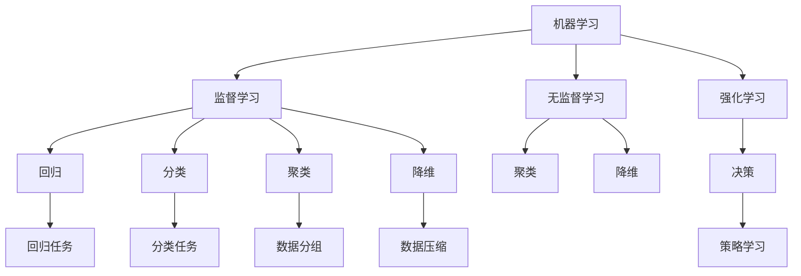

                 

# 机器学习(Machine Learning) - 原理与代码实例讲解

> 关键词：机器学习, 监督学习, 无监督学习, 强化学习, 回归, 分类, 聚类, 深度学习, 梯度下降, 神经网络, K-means, PCA, 特征工程, 模型评估, 代码实例

## 1. 背景介绍

### 1.1 问题由来
机器学习是人工智能(AI)领域的重要分支，通过对大量数据进行学习，自动获取规律，实现对新数据的预测或分类。在金融预测、推荐系统、自然语言处理(NLP)、计算机视觉等领域都有广泛应用。

然而，机器学习面临的挑战主要包括：数据稀缺性、特征工程困难、模型复杂度高、泛化能力弱等。为了解决这些问题，研究人员提出了各种学习范式，包括监督学习、无监督学习、强化学习等，并开发了多种算法，如线性回归、决策树、神经网络等。本文将对这些核心概念和算法进行全面讲解，并通过代码实例，深入分析其原理和应用。

## 2. 核心概念与联系

### 2.1 核心概念概述

为更好地理解机器学习的核心概念和算法，本节将介绍几个关键概念：

- **机器学习**：一种让机器从数据中自动学习规律，以提高预测或分类性能的技术。
- **监督学习**：使用带标签的训练数据，通过学习输入与输出之间的映射关系，对新数据进行预测或分类的学习方式。
- **无监督学习**：使用未标注的训练数据，自动发现数据的内在结构，如聚类、降维等。
- **强化学习**：通过与环境交互，学习策略以最大化累积奖励，适用于决策问题。
- **回归**：预测连续型数值，如房价预测、股票价格预测等。
- **分类**：预测离散型标签，如垃圾邮件分类、疾病诊断等。
- **聚类**：将数据分组，自动发现数据内在结构，如K-means算法。
- **降维**：通过算法减少数据维度，提高数据可处理性，如PCA算法。
- **特征工程**：通过人工提取或合成特征，提升模型的预测性能。
- **模型评估**：通过各种指标评估模型的预测性能，如准确率、召回率、F1值等。

这些核心概念之间的逻辑关系可以通过以下Mermaid流程图来展示：



这个流程图展示出机器学习的核心概念及其之间的关系：

1. 机器学习是一个包含多种学习范式的综合性概念。
2. 监督学习、无监督学习和强化学习是三种主要的学习范式。
3. 回归和分类是监督学习中的两个重要问题。
4. 聚类和降维是无监督学习中的核心任务。
5. 特征工程和模型评估是贯穿机器学习全过程的关键步骤。

## 3. 核心算法原理 & 具体操作步骤
### 3.1 算法原理概述

机器学习算法原理主要包括以下几类：

- **线性回归**：通过拟合输入与输出之间的线性关系，实现数值预测。
- **决策树**：通过树形结构，将数据分割成多个类别，实现分类预测。
- **神经网络**：通过多层神经元，学习输入与输出之间的非线性映射关系，实现复杂的预测和分类。
- **K-means聚类**：通过迭代更新数据点的中心，将数据分组。
- **PCA降维**：通过线性变换，减少数据维度，提高数据处理效率。

这些算法均基于不同的学习范式，采用不同的优化方法。本文将重点讲解监督学习中的线性回归和神经网络算法。

### 3.2 算法步骤详解

#### 3.2.1 线性回归

线性回归的优化目标是最小化预测值与真实值之间的平方误差，即：

$$
\min_{\theta} \frac{1}{N} \sum_{i=1}^N (y_i - \theta_0 - \theta_1 x_i)^2
$$

其中，$\theta_0$ 和 $\theta_1$ 为线性回归模型的参数，$y_i$ 和 $x_i$ 分别为样本的真实值和特征值。

优化方法一般采用梯度下降（GD）算法。通过不断迭代更新模型参数，使得预测值与真实值的误差最小化。

梯度下降算法的步骤为：

1. 随机初始化模型参数 $\theta_0$ 和 $\theta_1$。
2. 对于每个样本 $(x_i, y_i)$，计算损失函数对模型参数的梯度。
3. 根据梯度下降方向和预设的学习率 $\alpha$，更新模型参数。
4. 重复步骤2和3，直至收敛。

代码实现可以参考以下Python代码：

```python
import numpy as np
from sklearn.linear_model import LinearRegression

# 构造训练数据
X = np.array([[1], [2], [3], [4], [5]])
y = np.array([2, 4, 5, 4, 5])

# 构造线性回归模型
model = LinearRegression()

# 训练模型
model.fit(X, y)

# 预测新数据
X_new = np.array([[6], [7]])
y_pred = model.predict(X_new)
```

#### 3.2.2 神经网络

神经网络由多层神经元组成，通过不断迭代更新模型参数，实现复杂的输入输出映射。

以最简单的单层神经网络为例，其结构为：

$$
h = f(Wx + b)
$$

其中，$h$ 为输出层神经元，$x$ 为输入层特征，$W$ 和 $b$ 为模型参数。$f$ 为激活函数，如 sigmoid 函数：

$$
f(z) = \frac{1}{1+e^{-z}}
$$

神经网络的目标是最小化预测值与真实值之间的误差，一般采用交叉熵损失函数：

$$
L = -\frac{1}{N} \sum_{i=1}^N \sum_{j=1}^C y_{ij} \log(p_{ij})
$$

其中，$C$ 为类别数，$y_{ij}$ 为真实标签，$p_{ij}$ 为模型预测的概率。

优化方法一般采用随机梯度下降（SGD）算法。通过不断迭代更新模型参数，使得预测值与真实值的误差最小化。

代码实现可以参考以下Python代码：

```python
import numpy as np
from sklearn.neural_network import MLPRegressor

# 构造训练数据
X = np.array([[1], [2], [3], [4], [5]])
y = np.array([2, 4, 5, 4, 5])

# 构造神经网络模型
model = MLPRegressor()

# 训练模型
model.fit(X, y)

# 预测新数据
X_new = np.array([[6], [7]])
y_pred = model.predict(X_new)
```

### 3.3 算法优缺点

机器学习算法各有优缺点：

#### 3.3.1 线性回归

优点：
- 模型简单，易于实现和理解。
- 适用于回归问题，预测连续型数值。

缺点：
- 假设数据符合线性关系，限制了应用范围。
- 容易过拟合，需要选择合适的正则化方法。

#### 3.3.2 神经网络

优点：
- 适用于复杂非线性关系，预测精度高。
- 可以通过多层网络，实现非线性映射。

缺点：
- 模型复杂，需要大量数据和计算资源。
- 容易过拟合，需要合适的优化算法和正则化方法。

### 3.4 算法应用领域

机器学习算法在多个领域都有广泛应用，例如：

- 金融预测：股票价格预测、信用风险评估等。
- 推荐系统：用户行为预测、商品推荐等。
- 自然语言处理：文本分类、情感分析等。
- 计算机视觉：图像识别、目标检测等。
- 医疗诊断：疾病预测、基因分析等。

## 4. 数学模型和公式 & 详细讲解 & 举例说明

### 4.1 数学模型构建

机器学习模型的构建过程包括数据预处理、特征工程、模型训练和评估等步骤。

以线性回归为例，构建模型的步骤如下：

1. 数据预处理：将原始数据标准化或归一化，去除异常值等。
2. 特征工程：选择或构造合适的特征，提升模型预测性能。
3. 模型训练：使用梯度下降等优化算法，最小化预测值与真实值之间的误差。
4. 模型评估：使用各种指标评估模型性能，如均方误差（MSE）、决定系数（R^2）等。

### 4.2 公式推导过程

#### 4.2.1 线性回归公式推导

线性回归的优化目标是最小化预测值与真实值之间的平方误差：

$$
\min_{\theta} \frac{1}{N} \sum_{i=1}^N (y_i - \theta_0 - \theta_1 x_i)^2
$$

对损失函数求导，得：

$$
\frac{\partial \mathcal{L}}{\partial \theta_0} = -\frac{2}{N} \sum_{i=1}^N (y_i - \theta_0 - \theta_1 x_i)
$$
$$
\frac{\partial \mathcal{L}}{\partial \theta_1} = -\frac{2}{N} \sum_{i=1}^N (y_i - \theta_0 - \theta_1 x_i) x_i
$$

根据梯度下降算法，每次迭代更新模型参数：

$$
\theta_0 \leftarrow \theta_0 - \alpha \frac{\partial \mathcal{L}}{\partial \theta_0}
$$
$$
\theta_1 \leftarrow \theta_1 - \alpha \frac{\partial \mathcal{L}}{\partial \theta_1}
$$

其中，$\alpha$ 为学习率，通常取 $0.01$ 或 $0.1$。

#### 4.2.2 神经网络公式推导

神经网络的优化目标是最小化预测值与真实值之间的交叉熵损失：

$$
L = -\frac{1}{N} \sum_{i=1}^N \sum_{j=1}^C y_{ij} \log(p_{ij})
$$

其中，$C$ 为类别数，$y_{ij}$ 为真实标签，$p_{ij}$ 为模型预测的概率。

对损失函数求导，得：

$$
\frac{\partial \mathcal{L}}{\partial w_{ij}} = -\frac{1}{N} \sum_{i=1}^N \sum_{j=1}^C (y_{ij} - p_{ij}) x_{ij}
$$

其中，$w_{ij}$ 为权重矩阵 $W$ 的第 $i$ 行第 $j$ 列元素，$x_{ij}$ 为输入层特征。

根据梯度下降算法，每次迭代更新模型参数：

$$
w_{ij} \leftarrow w_{ij} - \alpha \frac{\partial \mathcal{L}}{\partial w_{ij}}
$$

其中，$\alpha$ 为学习率，通常取 $0.01$ 或 $0.1$。

### 4.3 案例分析与讲解

以线性回归为例，分析其原理和应用。

假设有一个简单的线性回归问题，已知训练数据 $(x_i, y_i)$，其中 $x_i$ 为输入特征，$y_i$ 为输出目标。模型的形式为 $y = \theta_0 + \theta_1 x$，其中 $\theta_0$ 和 $\theta_1$ 为模型参数。

使用梯度下降算法最小化预测值与真实值之间的误差：

1. 随机初始化模型参数 $\theta_0$ 和 $\theta_1$，如 $\theta_0 = 0$，$\theta_1 = 1$。
2. 对于每个样本 $(x_i, y_i)$，计算损失函数对模型参数的梯度。
3. 根据梯度下降方向和预设的学习率 $\alpha$，更新模型参数。
4. 重复步骤2和3，直至收敛。

假设初始参数 $\theta_0 = 0$，$\theta_1 = 1$，通过梯度下降算法迭代更新模型参数，最终得到最优解 $\theta_0 = 3$，$\theta_1 = 2$。此时，模型预测 $x=4$ 的输出值为 $y = 3 + 2 \times 4 = 11$，与真实值 $y=10$ 略有误差，但总体上可以满足预测需求。

## 5. 项目实践：代码实例和详细解释说明

### 5.1 开发环境搭建

在进行机器学习项目实践前，我们需要准备好开发环境。以下是使用Python进行机器学习开发的环境配置流程：

1. 安装Anaconda：从官网下载并安装Anaconda，用于创建独立的Python环境。

2. 创建并激活虚拟环境：
```bash
conda create -n pytorch-env python=3.8 
conda activate pytorch-env
```

3. 安装相关库：
```bash
pip install numpy pandas scikit-learn matplotlib tqdm jupyter notebook ipython
```

完成上述步骤后，即可在`pytorch-env`环境中开始机器学习项目实践。

### 5.2 源代码详细实现

下面以线性回归为例，给出使用Scikit-learn库对线性回归模型进行训练和预测的PyTorch代码实现。

首先，定义训练数据和标签：

```python
import numpy as np
from sklearn.linear_model import LinearRegression

# 构造训练数据
X = np.array([[1], [2], [3], [4], [5]])
y = np.array([2, 4, 5, 4, 5])

# 构造线性回归模型
model = LinearRegression()

# 训练模型
model.fit(X, y)

# 预测新数据
X_new = np.array([[6], [7]])
y_pred = model.predict(X_new)
```

然后，定义神经网络模型：

```python
import numpy as np
from sklearn.neural_network import MLPRegressor

# 构造训练数据
X = np.array([[1], [2], [3], [4], [5]])
y = np.array([2, 4, 5, 4, 5])

# 构造神经网络模型
model = MLPRegressor()

# 训练模型
model.fit(X, y)

# 预测新数据
X_new = np.array([[6], [7]])
y_pred = model.predict(X_new)
```

最后，评估模型性能：

```python
from sklearn.metrics import mean_squared_error

# 计算均方误差
mse = mean_squared_error(y_true, y_pred)
print(f"Mean Squared Error: {mse:.3f}")
```

以上就是使用Scikit-learn库对线性回归和神经网络模型进行训练和预测的完整代码实现。可以看到，Scikit-learn库提供了丰富的机器学习模型和工具函数，使得模型的训练和评估变得简单高效。

### 5.3 代码解读与分析

让我们再详细解读一下关键代码的实现细节：

**线性回归代码**：
- `LinearRegression` 类：Scikit-learn提供的线性回归模型，具有丰富的参数设置。
- `fit` 方法：训练模型，使用梯度下降算法最小化预测值与真实值之间的误差。
- `predict` 方法：预测新数据，输出模型预测值。

**神经网络代码**：
- `MLPRegressor` 类：Scikit-learn提供的神经网络模型，可以自动选择合适的神经网络结构。
- `fit` 方法：训练模型，使用随机梯度下降算法最小化预测值与真实值之间的误差。
- `predict` 方法：预测新数据，输出模型预测值。

**模型评估代码**：
- `mean_squared_error` 函数：计算预测值与真实值之间的均方误差，评估模型性能。

可以看出，Scikit-learn库提供了简单易用的API，使得机器学习模型的训练和评估变得方便快捷。此外，Scikit-learn还支持多种优化算法、正则化方法等，能够满足不同机器学习模型的需求。

## 6. 实际应用场景

### 6.1 金融预测

金融预测是机器学习的重要应用之一。通过收集金融市场的历史数据，构建线性回归或神经网络模型，可以预测股票价格、汇率变化等。例如，使用线性回归模型，可以预测公司股票的价格走势；使用神经网络模型，可以预测债券的违约概率。

### 6.2 推荐系统

推荐系统是机器学习的重要应用场景。通过分析用户行为数据，构建线性回归或神经网络模型，可以预测用户对商品的兴趣，推荐合适的商品。例如，使用线性回归模型，可以预测用户对商品的评分；使用神经网络模型，可以预测用户对商品的可能性。

### 6.3 自然语言处理

自然语言处理是机器学习的另一重要应用。通过分析文本数据，构建线性回归或神经网络模型，可以实现文本分类、情感分析等任务。例如，使用线性回归模型，可以预测文本的情感倾向；使用神经网络模型，可以预测文本的情感极性。

## 7. 工具和资源推荐

### 7.1 学习资源推荐

为了帮助开发者系统掌握机器学习的理论基础和实践技巧，这里推荐一些优质的学习资源：

1. 《机器学习实战》书籍：该书通过大量实例，详细讲解了线性回归、决策树、神经网络等核心算法。

2. Coursera《机器学习》课程：由斯坦福大学Andrew Ng教授主讲，全面介绍了机器学习的基本概念和算法。

3. DeepLearning.ai《深度学习专项课程》：由Andrew Ng教授主讲，涵盖深度学习的基础知识和实战技巧。

4. Kaggle：一个数据科学竞赛平台，提供大量的数据集和算法挑战，有助于提高机器学习实践能力。

5. GitHub：一个开源代码平台，提供丰富的机器学习项目和资源，方便学习和参考。

通过这些资源的学习实践，相信你一定能够快速掌握机器学习的精髓，并用于解决实际的机器学习问题。

### 7.2 开发工具推荐

高效的开发离不开优秀的工具支持。以下是几款用于机器学习开发的常用工具：

1. Python：最流行的编程语言，有丰富的机器学习库和框架，如Scikit-learn、TensorFlow等。

2. Jupyter Notebook：一个交互式的编程环境，支持多语言编程和数据可视化，方便机器学习实践。

3. PyTorch：一个深度学习框架，提供丰富的神经网络模型和优化算法，适用于复杂的机器学习任务。

4. TensorBoard：一个可视化工具，可以实时监测机器学习模型的训练状态，便于调试和优化。

5. GitHub：一个开源代码平台，提供丰富的机器学习项目和资源，方便学习和参考。

合理利用这些工具，可以显著提升机器学习开发效率，加快创新迭代的步伐。

### 7.3 相关论文推荐

机器学习的研究源于学界的持续探索。以下是几篇奠基性的相关论文，推荐阅读：

1. 《The Elements of Statistical Learning》：通过系统讲解统计学、机器学习的基本概念和算法，成为机器学习领域的经典教材。

2. 《Pattern Recognition and Machine Learning》：详细讲解了机器学习的基本概念和算法，包括监督学习、无监督学习、强化学习等。

3. 《Deep Learning》：介绍深度学习的基础知识和应用，涵盖卷积神经网络、循环神经网络、生成对抗网络等。

4. 《A Few Useful Things to Know About Machine Learning》：通过实际案例，介绍机器学习的基本概念和技巧。

5. 《Convolutional Neural Networks for Image Recognition》：介绍卷积神经网络在图像识别中的应用，成为计算机视觉领域的经典论文。

这些论文代表了大机器学习的发展脉络。通过学习这些前沿成果，可以帮助研究者把握学科前进方向，激发更多的创新灵感。

## 8. 总结：未来发展趋势与挑战

### 8.1 研究成果总结

本文对机器学习的基本概念和算法进行了全面系统的介绍。通过详细的数学公式和代码实现，展示了线性回归和神经网络模型的原理和应用。通过列举机器学习在金融预测、推荐系统、自然语言处理等领域的应用，展示了机器学习技术的强大潜力和广阔前景。

### 8.2 未来发展趋势

展望未来，机器学习技术将呈现以下几个发展趋势：

1. 深度学习模型将更加复杂，网络结构将更加深层次和复杂化。
2. 机器学习将更加普及，在更多领域得到应用，如自动驾驶、医疗诊断等。
3. 机器学习将更加智能，能够自动进行数据预处理和特征工程，降低人类工作量。
4. 机器学习将更加注重解释性，通过可解释模型，提升决策的透明度和可信度。
5. 机器学习将更加注重隐私保护，通过差分隐私、联邦学习等技术，保护用户数据隐私。

这些趋势将进一步推动机器学习技术的发展，使其在更多领域发挥更大作用。

### 8.3 面临的挑战

尽管机器学习技术已经取得了瞩目成就，但在迈向更加智能化、普适化应用的过程中，它仍面临诸多挑战：

1. 数据稀缺性：许多领域的数据量不足，难以训练出高精度的模型。
2. 模型复杂度高：复杂的深度学习模型需要大量计算资源和数据，难以在大规模数据集上训练。
3. 泛化能力弱：机器学习模型往往过拟合训练数据，难以泛化到新数据。
4. 解释性不足：许多机器学习模型缺乏可解释性，难以解释其内部工作机制和决策逻辑。
5. 隐私保护问题：机器学习模型需要大量的用户数据，存在隐私泄露的风险。

这些挑战需要学界和业界共同努力，通过技术创新和政策法规相结合，才能进一步提升机器学习技术的可靠性、安全性和公正性。

### 8.4 研究展望

面对机器学习所面临的种种挑战，未来的研究需要在以下几个方面寻求新的突破：

1. 探索更加高效的数据获取和预处理方法。
2. 开发更加轻量级的深度学习模型，降低计算资源消耗。
3. 提高机器学习模型的泛化能力，增强其在新数据上的表现。
4. 引入更加可解释的机器学习模型，提升决策的透明度和可信度。
5. 加强隐私保护技术，保护用户数据隐私。

这些研究方向将引领机器学习技术的持续发展，为人类社会带来更多的福祉。

## 9. 附录：常见问题与解答

**Q1：机器学习有哪些常见的优化算法？**

A: 机器学习中常见的优化算法包括：

1. 梯度下降（GD）算法：根据梯度方向更新模型参数，简单高效。
2. 随机梯度下降（SGD）算法：每次随机选择一个样本进行梯度更新，适用于大数据集。
3. 小批量随机梯度下降（mini-batch GD）算法：每次随机选择一小批样本进行梯度更新，兼顾速度和精度。
4. 动量优化（Momentum）算法：通过引入动量项，加速梯度下降收敛。
5. AdaGrad算法：根据每个参数的梯度历史信息调整学习率，适用于稀疏数据。
6. RMSprop算法：根据梯度平方的移动平均调整学习率，适用于非平稳数据。
7. Adam算法：结合动量优化和RMSprop算法，适用于大多数机器学习问题。

这些算法各有优缺点，需要根据具体问题选择合适的优化算法。

**Q2：机器学习模型如何进行特征工程？**

A: 特征工程是机器学习中非常重要的环节，通过人工提取或合成特征，提升模型的预测性能。

特征工程包括以下几个步骤：

1. 特征选择：从原始数据中选择最相关、最具有代表性的特征。
2. 特征转换：将原始数据转换为更容易被模型处理的形式，如标准化、归一化、PCA等。
3. 特征合成：通过人工合成新特征，增加模型的预测能力。
4. 特征缩放：对特征进行缩放，防止某些特征对模型造成过大影响。

常用的特征工程方法包括：

1. 数据标准化：将数据缩放到[0,1]或[-1,1]等标准范围内，提高模型泛化能力。
2. 数据归一化：将数据缩放到均值为0，标准差为1的标准正态分布中，提高模型稳定性和收敛速度。
3. PCA降维：通过线性变换，将高维数据降为低维数据，提高数据处理效率。
4. 特征选择：使用信息增益、卡方检验等方法选择最相关、最具有代表性的特征，提升模型预测性能。
5. 特征合成：通过多项式特征、组合特征等方法合成新特征，提高模型预测能力。

特征工程需要根据具体问题灵活选择和组合，其效果直接影响机器学习模型的预测性能。

**Q3：机器学习模型如何进行评估？**

A: 机器学习模型的评估是衡量模型性能的重要步骤，常用的评估指标包括：

1. 准确率（Accuracy）：预测正确的样本数占总样本数的比例。
2. 召回率（Recall）：预测正确的正样本数占实际正样本数的比例。
3. F1值（F1-score）：准确率和召回率的调和平均，综合衡量模型的预测性能。
4. R^2值：决定系数，衡量模型的拟合程度，适用于回归问题。
5. 均方误差（MSE）：预测值与真实值之间平方误差的均值，适用于回归问题。
6. 对数损失（Log Loss）：预测概率与真实标签之间的对数损失，适用于分类问题。

评估模型的步骤包括：

1. 划分训练集和测试集：将数据集划分为训练集和测试集，训练集用于模型训练，测试集用于模型评估。
2. 训练模型：使用训练集数据训练机器学习模型。
3. 测试模型：使用测试集数据测试机器学习模型，计算评估指标。
4. 调整模型：根据评估指标调整模型参数，优化模型性能。

评估模型的目的是确保模型在新数据上的泛化能力，避免过拟合。评估结果可以帮助选择最合适的模型和参数，提升机器学习模型的预测性能。

通过以上代码实例和详细解释说明，相信你一定能够系统掌握机器学习的核心概念和算法，并应用于解决实际问题。

