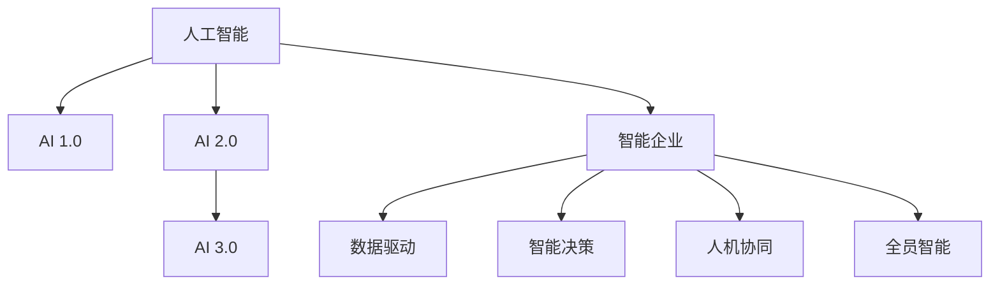

                 

# 李开复：AI 2.0 时代的商业价值

> 关键词：人工智能,商业价值,创新,智能企业,数据驱动

## 1. 背景介绍

### 1.1 问题由来
在过去的几十年中，人工智能(AI)技术经历了几次重大变革，从最初的专家系统，到机器学习、深度学习，再到目前备受关注的生成对抗网络(GAN)、大语言模型(Large Language Model, LLM)等。这些技术的出现，使得AI在各个行业的应用变得更加广泛和深入。而随着AI技术的不断进步，商业环境也在发生深刻的变化。在这样的背景下，如何理解和挖掘AI 2.0时代的商业价值，成为了一个亟待解答的问题。

### 1.2 问题核心关键点
AI 2.0时代的商业价值，主要体现在以下几个方面：

- **创新驱动**：AI技术带来了新的业务模式、产品创新和服务方式，帮助企业在激烈的市场竞争中脱颖而出。
- **效率提升**：AI自动化处理大量重复性任务，大幅提升企业运营效率和决策速度。
- **数据驱动**：AI技术通过分析大量数据，提供精准的市场预测和决策支持，帮助企业抓住市场机遇。
- **人机协同**：AI与人类智能相结合，实现更高效、更智能的协同工作，提升工作质量和创新能力。
- **全员智能**：AI技术的普及应用，使得企业中的每个人都能更高效地完成工作，提升企业整体智能化水平。

这些关键点共同构成了AI 2.0时代的商业价值核心，为企业提供了全新的竞争优势和发展机遇。

## 2. 核心概念与联系

### 2.1 核心概念概述

为更好地理解AI 2.0时代的商业价值，本节将介绍几个密切相关的核心概念：

- **人工智能**：以模拟、延伸和扩展人的智能为目的，通过算法和数据驱动的技术手段，实现对复杂问题进行处理和决策的技术体系。

- **AI 1.0**：基于规则的专家系统和知识工程系统，主要依赖领域专家知识和手工编写规则，实现特定任务的自动化处理。

- **AI 2.0**：基于数据驱动的机器学习和深度学习系统，通过大量数据训练模型，实现复杂任务的高效处理和智能化决策。

- **AI 3.0**：基于自我学习和自我优化能力的强通用智能系统，能够在不断学习和自我优化中，实现对未知问题的处理和创新。

- **智能企业**：以AI技术为核心驱动力，实现全企业智能化运营和决策的企业形态。

- **数据驱动**：通过收集、分析和应用数据，支持企业决策和运营，提升企业竞争力。

- **智能决策**：利用AI技术对海量数据进行分析和处理，提供精准的市场预测和决策支持。

- **人机协同**：通过AI技术实现人与机器的协同工作，提升工作效率和质量。

- **全员智能**：通过AI技术普及应用，使得企业中的每个人都能更高效地完成工作，提升企业整体智能化水平。

这些核心概念之间的逻辑关系可以通过以下Mermaid流程图来展示：



这个流程图展示了人工智能技术从早期到未来的发展脉络，以及AI技术在智能企业中的应用场景。

## 3. 核心算法原理 & 具体操作步骤
### 3.1 算法原理概述

AI 2.0时代的商业价值，主要通过数据驱动的机器学习和深度学习算法来实现。其核心思想是：通过收集、分析和应用数据，训练出高效的AI模型，支持企业的决策和运营。

形式化地，假设企业有历史数据集 $D=\{(x_i,y_i)\}_{i=1}^N, x_i \in \mathcal{X}, y_i \in \mathcal{Y}$，其中 $\mathcal{X}$ 为输入空间，$\mathcal{Y}$ 为输出空间。定义模型 $M_{\theta}$ 在输入 $x$ 上的输出为 $\hat{y}=M_{\theta}(x) \in \mathcal{Y}$，则AI 2.0模型的训练目标是最小化经验风险：

$$
\theta^* = \mathop{\arg\min}_{\theta} \mathcal{L}(M_{\theta},D)
$$

其中 $\mathcal{L}$ 为损失函数，用于衡量模型预测输出与真实标签之间的差异。常见的损失函数包括交叉熵损失、均方误差损失等。

### 3.2 算法步骤详解

AI 2.0的商业价值实现，一般包括以下几个关键步骤：

**Step 1: 数据准备和预处理**
- 收集企业内部和外部的历史数据，清洗和标注数据，构建训练集、验证集和测试集。
- 选择合适的特征提取方法，将数据转化为模型可以处理的格式。

**Step 2: 模型选择和训练**
- 选择合适的机器学习或深度学习模型，如线性回归、决策树、支持向量机、神经网络等。
- 在训练集上训练模型，调整模型参数，最小化损失函数。

**Step 3: 模型评估和调优**
- 在验证集上评估模型性能，选择最优模型。
- 根据评估结果，调整模型参数或选择更合适的模型，进一步优化性能。

**Step 4: 应用部署**
- 将训练好的模型部署到生产环境中，提供实时服务。
- 实时收集用户反馈和业务数据，持续优化模型。

**Step 5: 持续学习**
- 利用新收集的数据不断训练模型，提升模型性能。
- 结合领域专家的知识和经验，人工干预和优化模型。

以上是AI 2.0模型的基本训练和应用流程。在实际应用中，还需要针对具体业务场景，对模型的各个环节进行优化设计，如改进特征工程、引入正则化技术、优化模型结构等，以进一步提升模型性能。

### 3.3 算法优缺点

AI 2.0的商业价值算法具有以下优点：

- **高效性**：通过数据驱动的算法，可以高效地处理大量数据，实现快速决策和运营。
- **精度高**：机器学习和深度学习算法能够处理复杂的数据模式，提供精准的预测和决策支持。
- **灵活性**：算法可以轻松调整模型参数，适应不同的业务场景和需求。

同时，该算法也存在一些局限性：

- **数据依赖**：算法的性能很大程度上取决于数据的质量和数量，获取高质量数据的成本较高。
- **模型复杂**：深度学习模型的复杂度较高，需要大量的计算资源和专业技能进行训练和优化。
- **可解释性差**：深度学习模型的决策过程缺乏可解释性，难以对其推理逻辑进行分析和调试。

尽管存在这些局限性，但AI 2.0的算法依然是大数据时代企业智能化转型的重要手段，为企业的决策和运营提供了强大的技术支持。

### 3.4 算法应用领域

AI 2.0的算法在商业价值实现中，已经广泛应用于多个领域，例如：

- **市场预测**：利用历史销售数据和市场趋势，预测未来的销售量和产品需求。
- **客户分析**：通过分析客户行为数据，了解客户偏好和需求，优化客户体验。
- **风险管理**：利用风险模型，预测和评估金融风险，防范金融危机。
- **供应链优化**：通过供应链数据分析，优化物流、库存管理，提高运营效率。
- **智能客服**：利用自然语言处理技术，提供7x24小时不间断的客户服务，提升客户满意度。
- **个性化推荐**：根据用户历史行为数据，推荐个性化的产品和服务，提升用户体验。
- **智能制造**：利用工业数据和AI模型，实现智能生产、质量控制和设备维护。

除了上述这些经典应用外，AI 2.0算法还被创新性地应用到更多场景中，如智能广告投放、智能健康管理、智能交通管理等，为企业的数字化转型和智能化升级提供了新的技术路径。

## 4. 数学模型和公式 & 详细讲解 & 举例说明（备注：数学公式请使用latex格式，latex嵌入文中独立段落使用 $$，段落内使用 $)
### 4.1 数学模型构建

本节将使用数学语言对AI 2.0算法的商业价值实现过程进行更加严格的刻画。

假设企业有历史数据集 $D=\{(x_i,y_i)\}_{i=1}^N, x_i \in \mathcal{X}, y_i \in \mathcal{Y}$，定义模型 $M_{\theta}$ 在输入 $x$ 上的输出为 $\hat{y}=M_{\theta}(x) \in \mathcal{Y}$，其中 $\theta$ 为模型参数。定义模型 $M_{\theta}$ 在数据样本 $(x,y)$ 上的损失函数为 $\ell(M_{\theta}(x),y)$，则在数据集 $D$ 上的经验风险为：

$$
\mathcal{L}(\theta) = \frac{1}{N} \sum_{i=1}^N \ell(M_{\theta}(x_i),y_i)
$$

AI 2.0算法的目标是最小化经验风险，即找到最优参数：

$$
\theta^* = \mathop{\arg\min}_{\theta} \mathcal{L}(\theta)
$$

在实践中，我们通常使用基于梯度的优化算法（如SGD、Adam等）来近似求解上述最优化问题。设 $\eta$ 为学习率，$\lambda$ 为正则化系数，则参数的更新公式为：

$$
\theta \leftarrow \theta - \eta \nabla_{\theta}\mathcal{L}(\theta) - \eta\lambda\theta
$$

其中 $\nabla_{\theta}\mathcal{L}(\theta)$ 为损失函数对参数 $\theta$ 的梯度，可通过反向传播算法高效计算。

### 4.2 公式推导过程

以下我们以线性回归为例，推导最小二乘损失函数及其梯度的计算公式。

假设模型 $M_{\theta}$ 在输入 $x$ 上的输出为 $\hat{y}=M_{\theta}(x) = \theta^T x$，其中 $\theta$ 为权重向量。定义模型在数据样本 $(x,y)$ 上的损失函数为：

$$
\ell(M_{\theta}(x),y) = (y - M_{\theta}(x))^2
$$

将其代入经验风险公式，得：

$$
\mathcal{L}(\theta) = \frac{1}{N} \sum_{i=1}^N (y_i - \theta^T x_i)^2
$$

根据链式法则，损失函数对参数 $\theta_k$ 的梯度为：

$$
\frac{\partial \mathcal{L}(\theta)}{\partial \theta_k} = \frac{1}{N} \sum_{i=1}^N (-2x_{i,k})(y_i - \theta^T x_i)
$$

其中 $x_{i,k}$ 为第 $i$ 个样本中第 $k$ 个特征的值。

在得到损失函数的梯度后，即可带入参数更新公式，完成模型的迭代优化。重复上述过程直至收敛，最终得到适应商业价值目标的最优模型参数 $\theta^*$。

## 5. 项目实践：代码实例和详细解释说明
### 5.1 开发环境搭建

在进行AI 2.0商业价值实现前，我们需要准备好开发环境。以下是使用Python进行TensorFlow开发的环境配置流程：

1. 安装Anaconda：从官网下载并安装Anaconda，用于创建独立的Python环境。

2. 创建并激活虚拟环境：
```bash
conda create -n tensorflow-env python=3.8 
conda activate tensorflow-env
```

3. 安装TensorFlow：根据CUDA版本，从官网获取对应的安装命令。例如：
```bash
conda install tensorflow -c pytorch -c conda-forge
```

4. 安装TensorBoard：
```bash
pip install tensorboard
```

5. 安装各类工具包：
```bash
pip install numpy pandas scikit-learn matplotlib tqdm jupyter notebook ipython
```

完成上述步骤后，即可在`tensorflow-env`环境中开始AI 2.0商业价值实现。

### 5.2 源代码详细实现

下面我们以市场预测为例，给出使用TensorFlow对线性回归模型进行训练和预测的PyTorch代码实现。

首先，定义数据集：

```python
import pandas as pd
import numpy as np
from sklearn.model_selection import train_test_split
from tensorflow.keras.models import Sequential
from tensorflow.keras.layers import Dense
from tensorflow.keras.optimizers import Adam
import matplotlib.pyplot as plt

# 加载数据集
data = pd.read_csv('sales_data.csv')

# 数据预处理
data['date'] = pd.to_datetime(data['date'])
X = data.drop('sales', axis=1)
y = data['sales']
X = X.values

# 数据标准化
from sklearn.preprocessing import StandardScaler
scaler = StandardScaler()
X_scaled = scaler.fit_transform(X)

# 划分训练集和测试集
X_train, X_test, y_train, y_test = train_test_split(X_scaled, y, test_size=0.2, random_state=42)

# 构建模型
model = Sequential([
    Dense(64, activation='relu', input_shape=(X_train.shape[1],)),
    Dense(1)
])

# 定义损失函数和优化器
loss = 'mse'
optimizer = Adam(lr=0.001)

# 训练模型
model.compile(optimizer=optimizer, loss=loss)
history = model.fit(X_train, y_train, epochs=50, validation_data=(X_test, y_test))

# 模型评估和预测
mse_test = model.evaluate(X_test, y_test, verbose=0)
y_pred = model.predict(X_test)
```

然后，定义训练和评估函数：

```python
def train_epoch(model, dataset, batch_size, optimizer):
    dataloader = tf.data.Dataset.from_tensor_slices(dataset)
    dataloader = dataloader.shuffle(buffer_size=1000).batch(batch_size).prefetch(1)
    model.train_on_batch(dataloader)
    return

def evaluate(model, dataset, batch_size):
    dataloader = tf.data.Dataset.from_tensor_slices(dataset)
    dataloader = dataloader.shuffle(buffer_size=1000).batch(batch_size).prefetch(1)
    loss, preds = model.evaluate(dataloader)
    return loss, preds
```

最后，启动训练流程并在测试集上评估：

```python
epochs = 50
batch_size = 32

for epoch in range(epochs):
    train_epoch(model, X_train, batch_size, optimizer)
    
    loss, preds = evaluate(model, X_test, batch_size)
    print(f"Epoch {epoch+1}, test loss: {loss:.3f}")
    
print("Final test loss: ", mse_test)
```

以上就是使用TensorFlow对线性回归模型进行市场预测的完整代码实现。可以看到，TensorFlow提供了高度集成的API，使得模型构建和训练过程变得简洁高效。

### 5.3 代码解读与分析

让我们再详细解读一下关键代码的实现细节：

**市场预测数据集**：
- `pd.read_csv`方法：从CSV文件中读取数据集。
- `pd.to_datetime`方法：将日期字符串转换为日期对象。
- `X.drop('sales', axis=1)`：去除销量列作为输入特征。
- `X_scaled`：对特征进行标准化，避免数值差异对模型训练的影响。

**模型构建**：
- `Sequential`类：定义线性回归模型的顺序结构。
- `Dense`层：定义全连接层，使用ReLU激活函数。
- `input_shape`参数：指定输入特征的形状。

**损失函数和优化器**：
- `mse`损失函数：均方误差，用于回归任务。
- `Adam`优化器：自适应学习率的优化算法，收敛速度快且鲁棒性高。

**训练和评估**：
- `train_on_batch`方法：在单批次数据上训练模型。
- `evaluate`方法：在测试集上评估模型性能，返回损失值和预测值。

**训练流程**：
- `epochs`和`batch_size`参数：指定训练轮数和批次大小。
- `train_epoch`函数：在每个epoch上训练模型。
- `evaluate`函数：在每个epoch后评估模型性能，输出测试损失和预测结果。

可以看到，TensorFlow的API设计使得模型训练和评估过程变得简洁高效，大大降低了开发者的工作量。合理利用这些API，可以显著提升模型开发的效率和质量。

## 6. 实际应用场景
### 6.1 智能客服系统

AI 2.0技术在智能客服系统中的应用，显著提升了客户服务体验和运营效率。通过自然语言处理(NLP)和机器学习算法，智能客服系统能够自动理解和响应客户咨询，处理常见问题和复杂需求，实现24小时不间断服务。

在技术实现上，可以收集企业内部的历史客服对话记录，将问题和最佳答复构建成监督数据，在此基础上训练NLP模型。智能客服系统能够自动理解客户意图，匹配最合适的答案模板进行回复，并实时生成生成式对话，实现高效互动。对于客户提出的新问题，还可以接入检索系统实时搜索相关内容，动态组织生成回答，提供更加个性化的服务。

### 6.2 金融舆情监测

AI 2.0技术在金融舆情监测中的应用，能够实时监测市场舆论动向，为金融机构提供精准的风险预警和决策支持。通过文本分析、情感分析等技术，AI 2.0系统能够自动识别和分析大量金融新闻、评论和社交媒体内容，预测市场趋势和舆情变化。一旦发现负面信息激增等异常情况，系统便会自动预警，帮助金融机构快速应对潜在风险。

在技术实现上，可以收集金融领域相关的新闻、报道、评论等文本数据，并对其进行情感标注和主题标注。在此基础上训练情感分类和主题分类模型，利用模型分析实时抓取的网络文本数据，就能够自动监测不同主题下的情感变化趋势，及时发现和防范金融风险。

### 6.3 个性化推荐系统

AI 2.0技术在个性化推荐系统中的应用，能够提供精准的产品推荐和用户体验，提升企业的销售额和客户满意度。通过分析用户的历史行为数据，AI 2.0系统能够理解用户偏好和需求，推荐个性化的产品和服务。

在技术实现上，可以收集用户浏览、点击、评论、分享等行为数据，提取和用户交互的物品标题、描述、标签等文本内容。将文本内容作为模型输入，用户的后续行为（如是否点击、购买等）作为监督信号，在此基础上训练文本分类和推荐模型。AI 2.0系统能够从文本内容中准确把握用户的兴趣点，生成个性化的推荐列表，提升用户体验和转化率。

### 6.4 未来应用展望

随着AI 2.0技术的不断发展，其在更多行业领域的应用前景也将愈发广阔。未来，AI 2.0技术有望在医疗、教育、智能制造等多个领域实现突破，为各行各业带来颠覆性变革。

- **医疗领域**：AI 2.0技术能够帮助医疗机构进行疾病诊断、治疗方案推荐和病人管理，提升医疗服务的智能化水平。
- **教育领域**：AI 2.0技术能够提供个性化的学习内容和教育资源，提升教育质量和效率。
- **智能制造**：AI 2.0技术能够实现智能生产、质量控制和设备维护，提升制造业的智能化水平。
- **智能交通**：AI 2.0技术能够优化交通流量、降低交通事故率，提升城市交通的智能化水平。

这些领域的应用，将进一步推动AI 2.0技术的普及和深入，为企业的智能化转型和数字化升级提供新的技术路径。相信随着AI 2.0技术的不断演进，其商业价值将进一步得到挖掘和拓展，带来更加深远的影响。

## 7. 工具和资源推荐
### 7.1 学习资源推荐

为了帮助开发者系统掌握AI 2.0技术的应用，这里推荐一些优质的学习资源：

1. **Coursera《机器学习》课程**：斯坦福大学提供的经典课程，系统介绍了机器学习的基本概念和算法。
2. **Udacity《深度学习》课程**：Udacity的深度学习课程，涵盖了深度学习的理论和实践，适合入门和进阶学习。
3. **Kaggle平台**：数据科学竞赛平台，提供大量公开数据集和代码实现，是学习和实践AI技术的绝佳资源。
4. **TensorFlow官方文档**：TensorFlow的官方文档，提供了丰富的API文档和示例代码，是TensorFlow应用的重要参考。
5. **PyTorch官方文档**：PyTorch的官方文档，提供了详细的API文档和代码示例，是PyTorch应用的重要参考。

通过对这些资源的学习实践，相信你一定能够系统掌握AI 2.0技术的核心原理和应用技巧，用于解决实际的商业问题。

### 7.2 开发工具推荐

高效的开发离不开优秀的工具支持。以下是几款用于AI 2.0应用开发的常用工具：

1. **TensorFlow**：由Google主导开发的深度学习框架，生产部署方便，适合大规模工程应用。
2. **PyTorch**：Facebook开源的深度学习框架，灵活性高，适合研究和快速迭代。
3. **Jupyter Notebook**：开源的交互式笔记本，支持Python、R等多种语言，方便实验和代码共享。
4. **Git**：版本控制系统，支持多人协作开发，是版本管理的重要工具。
5. **Docker**：容器化技术，支持快速部署和应用迁移，是分布式开发和运维的重要工具。

合理利用这些工具，可以显著提升AI 2.0应用的开发效率和质量，加快创新迭代的步伐。

### 7.3 相关论文推荐

AI 2.0技术的发展源于学界的持续研究。以下是几篇奠基性的相关论文，推荐阅读：

1. **Deep Learning**：Hinton等人发表的经典论文，介绍了深度学习的基本概念和算法。
2. **ImageNet Classification with Deep Convolutional Neural Networks**：Krizhevsky等人发表的ImageNet分类任务论文，标志着深度学习在图像领域的突破。
3. **Natural Language Processing with Transformers**：Vaswani等人发表的Transformer论文，介绍了自注意力机制，推动了自然语言处理领域的发展。
4. **Learning Deep Architectures for AI**：Hinton等人发表的深度学习架构论文，介绍了深度学习在语音识别、计算机视觉等多个领域的突破。
5. **A Survey of Deep Learning Applications in NLP**：Jurafsky等人发表的深度学习在自然语言处理应用的综述论文，系统介绍了深度学习在NLP领域的应用。

这些论文代表了大数据时代AI 2.0技术的发展脉络，为AI 2.0技术的应用提供了理论支持。

## 8. 总结：未来发展趋势与挑战
### 8.1 总结

本文对AI 2.0技术的商业价值进行了全面系统的介绍。首先阐述了AI 2.0技术的背景和意义，明确了其在市场预测、客户分析、风险管理等领域的应用价值。其次，从原理到实践，详细讲解了AI 2.0技术的核心算法和操作步骤，给出了市场预测任务的完整代码实现。同时，本文还广泛探讨了AI 2.0技术在智能客服、金融舆情、个性化推荐等多个行业领域的应用前景，展示了AI 2.0技术的巨大潜力。此外，本文精选了AI 2.0技术的各类学习资源，力求为读者提供全方位的技术指引。

通过本文的系统梳理，可以看到，AI 2.0技术在商业应用中的广泛性和重要性。未来，伴随AI 2.0技术的持续演进，其在各个行业的落地应用将不断深入，为企业的智能化转型和数字化升级提供新的技术路径。AI 2.0技术的商业价值，不仅体现在提升效率和精准度上，更在于其对企业决策和运营的深远影响。通过合理应用AI 2.0技术，企业能够在激烈的市场竞争中脱颖而出，实现更加智能化、高效化的运营。

### 8.2 未来发展趋势

展望未来，AI 2.0技术的商业价值将呈现以下几个发展趋势：

1. **全面智能化**：AI 2.0技术将渗透到企业各个环节，实现全智能化运营和决策。智能客服、智能制造、智能交通等领域的应用将进一步普及，提升企业运营效率和客户满意度。
2. **多模态融合**：AI 2.0技术将融合视觉、语音、文本等多种模态数据，实现多模态智能系统。智能安防、智能医疗、智能城市等领域的应用将更加丰富多样。
3. **实时化应用**：AI 2.0技术将实现实时化处理和决策，提升企业响应速度和决策质量。智能推荐、智能客服、智能监测等领域的应用将更加及时准确。
4. **可解释性增强**：AI 2.0技术的商业价值将更加注重可解释性，帮助企业理解和信任AI决策。可解释性AI（XAI）技术将逐渐普及，提升企业决策透明度和信任度。
5. **自适应学习**：AI 2.0技术将具备自适应学习的能力，不断从新数据中学习，优化模型性能。持续学习技术将逐渐普及，提升模型实时性和适应性。
6. **跨领域应用**：AI 2.0技术将在更多领域实现应用突破，推动各行各业数字化升级和智能化转型。智慧医疗、智能制造、智慧城市等领域的应用将更加广泛深入。

以上趋势凸显了AI 2.0技术的广泛前景，为企业提供了全新的竞争优势和发展机遇。未来，AI 2.0技术将继续推动各行各业的智能化转型，带来更加深刻的影响和变革。

### 8.3 面临的挑战

尽管AI 2.0技术的商业价值前景广阔，但在迈向更加智能化、普适化应用的过程中，仍面临诸多挑战：

1. **数据质量和隐私问题**：AI 2.0技术依赖高质量的数据，但数据隐私和安全问题难以保障。如何在保护隐私的前提下，获取高质量的数据，将是一大难题。
2. **模型鲁棒性和泛化能力**：AI 2.0模型在面对未知数据时，泛化能力有限，容易过拟合。如何提升模型的鲁棒性和泛化能力，是未来的一大挑战。
3. **计算资源和成本**：AI 2.0模型通常需要大量的计算资源，高昂的硬件和维护成本限制了模型的普及应用。如何降低计算资源成本，提升模型部署效率，仍需进一步探索。
4. **模型可解释性和透明性**：AI 2.0模型的决策过程缺乏可解释性，难以理解和调试。如何在保证模型性能的同时，提升模型的可解释性和透明性，将是未来的一个重要研究方向。
5. **伦理和社会影响**：AI 2.0技术的应用可能带来伦理和社会问题，如数据偏见、算法歧视、隐私泄露等。如何在技术应用中体现社会责任和伦理道德，确保技术的健康发展，是一大挑战。

正视这些挑战，积极应对并寻求突破，将是大数据时代AI 2.0技术继续发展的关键。未来，需要在数据治理、模型优化、计算资源优化、伦理和社会责任等多个方面协同发力，共同推动AI 2.0技术的发展和应用。

### 8.4 研究展望

面对AI 2.0技术面临的诸多挑战，未来的研究需要在以下几个方面寻求新的突破：

1. **数据治理和隐私保护**：开发更加高效的数据治理和隐私保护技术，确保数据质量和安全。
2. **模型鲁棒性和泛化能力**：引入对抗训练、正则化等技术，提升模型的鲁棒性和泛化能力。
3. **计算资源优化**：优化模型结构，引入混合精度训练、模型压缩等技术，降低计算资源成本。
4. **可解释性AI技术**：开发更加可解释的AI模型和工具，提升模型的透明性和可解释性。
5. **伦理和社会责任**：引入伦理导向的算法设计和社会责任评估机制，确保AI技术的健康发展。

这些研究方向的探索，必将引领AI 2.0技术迈向更高的台阶，为构建安全、可靠、可解释、可控的智能系统铺平道路。面向未来，AI 2.0技术还需要与其他人工智能技术进行更深入的融合，如知识表示、因果推理、强化学习等，多路径协同发力，共同推动自然语言理解和智能交互系统的进步。只有勇于创新、敢于突破，才能不断拓展AI 2.0技术的边界，让智能技术更好地造福人类社会。

## 9. 附录：常见问题与解答

**Q1：AI 2.0技术是否适用于所有行业？**

A: AI 2.0技术在大多数行业中都具备广泛的应用潜力。但不同行业对数据和算法的依赖程度不同，应用方式和效果也会有所不同。例如，医疗、金融等高风险领域需要更加严格的数据治理和伦理保障，而电商、制造业等低风险领域则更注重运营效率和生产优化。因此，AI 2.0技术的应用需要根据具体行业特点进行量身定制。

**Q2：AI 2.0技术的商业价值是否仅限于企业内部？**

A: AI 2.0技术的商业价值不仅限于企业内部，更在于通过技术应用提升社会整体效率和质量。例如，智能客服、智能推荐、智能交通等领域的应用，不仅能够提升企业的运营效率，还能显著改善社会服务质量和用户体验。未来，AI 2.0技术的应用将更加广泛深入，对社会经济的发展产生深远影响。

**Q3：AI 2.0技术在落地应用中需要注意哪些问题？**

A: AI 2.0技术在落地应用中需要注意以下几个问题：
1. 数据质量：确保数据准确性和完整性，避免数据偏见和噪音影响模型性能。
2. 模型鲁棒性：引入对抗训练、正则化等技术，提升模型的鲁棒性和泛化能力。
3. 计算资源：优化模型结构，引入混合精度训练、模型压缩等技术，降低计算资源成本。
4. 伦理和社会责任：引入伦理导向的算法设计和社会责任评估机制，确保技术应用符合社会价值观和伦理道德。
5. 人机协同：确保AI技术与人类智能的协同工作，提升系统稳定性和可解释性。

合理应对这些问题，将有助于AI 2.0技术的成功落地应用。

**Q4：AI 2.0技术是否需要大量标注数据？**

A: AI 2.0技术并不一定需要大量标注数据，特别是在迁移学习和预训练模型的基础上，只需少量标注数据即可进行微调和优化。例如，利用预训练模型和少量标注数据，通过微调技术可以显著提升模型性能，适应特定的业务场景。但对于一些高风险领域，如医疗、金融等，高质量的标注数据仍然是必要的。

**Q5：AI 2.0技术是否容易被滥用？**

A: AI 2.0技术在带来巨大商业价值的同时，也存在被滥用的风险。例如，AI 2.0技术可能被用于制造虚假信息、诈骗、侵犯隐私等不道德行为。因此，需要建立健全的法律法规和伦理规范，对AI技术的开发和应用进行规范和约束，确保技术应用符合伦理道德和社会价值观。

---

作者：禅与计算机程序设计艺术 / Zen and the Art of Computer Programming

