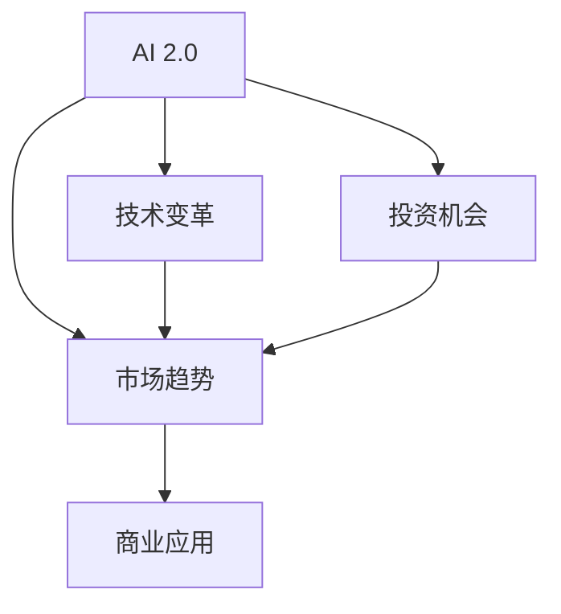

                 

# 李开复：AI 2.0 时代的市场

> 关键词：人工智能, AI 2.0, 市场趋势, 技术变革, 投资机会

## 1. 背景介绍

### 1.1 问题由来
随着人工智能技术的飞速发展，AI 2.0 时代已经到来。李开复作为世界级的人工智能专家，对这一现象有着深刻的认识。他指出，AI 2.0 不仅意味着技术上的飞跃，更代表了一个全新的市场机遇。在AI 2.0时代，人工智能技术正在从实验室走向商业应用，从边缘技术变成主流，其应用场景和市场潜力前所未有。

### 1.2 问题核心关键点
AI 2.0 时代，人工智能技术的发展速度和技术水平都在不断提升。AI 2.0 的核心在于其广泛的可用性，即人工智能技术已经不再局限于特定领域或任务，而是能够应用于各行各业，解决各种问题。李开复认为，AI 2.0 技术的广泛应用将会带来巨大的市场变革和投资机会。

### 1.3 问题研究意义
李开复的研究对于理解AI 2.0时代的市场动态、识别投资机会以及指导企业战略决策具有重要意义。通过深入分析AI 2.0技术的发展趋势、市场应用及潜在挑战，可以为相关企业提供有价值的市场洞察和战略指导。

## 2. 核心概念与联系

### 2.1 核心概念概述

要全面理解AI 2.0时代的市场，首先需要掌握几个核心概念：

- **AI 2.0**：AI 2.0 指的是新一代人工智能技术，其特点是具有更强的自适应性、更高的智能水平和更广泛的适用性。AI 2.0 技术能够在各种复杂的场景中自主学习和优化，提供更高效、更准确的解决方案。
- **市场趋势**：市场趋势是指某个市场在未来一段时间内的发展方向和动向。理解市场趋势对于把握投资机会和制定企业战略具有重要意义。
- **技术变革**：技术变革是指技术从原始形态向新形态转变的过程。AI 2.0 时代的技术变革将带来全新的产品、服务和商业模式。
- **投资机会**：投资机会是指投资者能够通过投资某一领域获得经济收益的机会。在AI 2.0时代，投资机会将集中在那些能够快速实现商业化的AI技术领域。

这些概念之间的逻辑关系可以通过以下Mermaid流程图来展示：



这个流程图展示了AI 2.0技术的市场发展路径：

1. AI 2.0技术推动市场趋势变化。
2. 技术变革带来新的市场趋势。
3. 投资机会主要集中在具有商业应用前景的AI技术领域。
4. 商业应用推动市场趋势和投资机会的形成。

## 3. 核心算法原理 & 具体操作步骤
### 3.1 算法原理概述

AI 2.0技术的核心在于其先进的算法和架构。以下是对AI 2.0算法原理的概述：

1. **深度学习**：深度学习是AI 2.0技术的核心算法之一。通过多层神经网络的堆叠，深度学习能够处理大规模数据集，提取高层次的特征表示。
2. **迁移学习**：迁移学习是指将一个领域学到的知识迁移到另一个领域。在AI 2.0时代，迁移学习可以帮助模型在不同场景中快速适应和优化。
3. **强化学习**：强化学习通过试错的方式，优化模型在特定任务中的表现。其核心在于模型通过与环境的交互来学习最优策略。
4. **自然语言处理**：自然语言处理（NLP）是AI 2.0技术的重要应用领域。通过深度学习和迁移学习，NLP技术可以实现对自然语言的理解和生成。

### 3.2 算法步骤详解

以下是AI 2.0技术的具体操作步骤：

1. **数据准备**：收集和预处理数据集，用于训练AI模型。数据集的选择和质量直接影响模型的表现。
2. **模型训练**：使用深度学习、迁移学习和强化学习等算法，训练AI模型。模型训练需要大量的计算资源和时间。
3. **模型优化**：通过调整模型结构和超参数，优化模型的性能。优化过程包括正则化、早停等技术。
4. **模型应用**：将训练好的模型应用于实际场景中，进行推理和预测。
5. **模型评估**：评估模型在实际应用中的表现，并根据评估结果进行迭代优化。

### 3.3 算法优缺点

AI 2.0技术的优点包括：

1. **高效性**：深度学习和迁移学习等技术能够处理大规模数据集，提取高层次的特征表示，大幅提升模型效率。
2. **自适应性**：强化学习等技术使得模型能够自主适应复杂环境，解决实际问题。
3. **通用性**：AI 2.0技术能够应用于各种场景，解决各种问题，具有广泛的适用性。

同时，AI 2.0技术也存在一些局限性：

1. **数据依赖**：AI 2.0技术依赖于高质量的数据集，数据质量直接影响模型表现。
2. **计算资源需求高**：深度学习和强化学习等算法需要大量的计算资源和时间，对硬件设施要求较高。
3. **可解释性不足**：AI 2.0模型通常被视为“黑盒”系统，难以解释其决策过程和推理逻辑。

### 3.4 算法应用领域

AI 2.0技术已经广泛应用于各个领域：

1. **医疗**：AI 2.0技术可以用于疾病诊断、药物研发和个性化医疗等领域，提高医疗服务的质量和效率。
2. **金融**：AI 2.0技术可以用于风险评估、投资分析和欺诈检测等领域，提升金融行业的智能化水平。
3. **制造业**：AI 2.0技术可以用于生产优化、质量控制和供应链管理等领域，提升制造业的自动化和智能化水平。
4. **零售**：AI 2.0技术可以用于客户分析、库存管理和推荐系统等领域，提升零售行业的精准度和效率。

## 4. 数学模型和公式 & 详细讲解 & 举例说明

### 4.1 数学模型构建

AI 2.0技术的数学模型通常基于深度学习框架。以下是一个简单的神经网络模型：

$$
y = \sigma(Wx + b)
$$

其中，$x$ 是输入向量，$W$ 是权重矩阵，$b$ 是偏置项，$\sigma$ 是激活函数。

### 4.2 公式推导过程

以一个简单的多分类问题为例，推导逻辑回归模型的公式。

假设输入数据为 $x$，目标变量为 $y$，模型参数为 $W$ 和 $b$。则逻辑回归模型的预测概率为：

$$
P(y|x; W, b) = \frac{1}{1 + \exp(-W^Tx - b)}
$$

目标函数为交叉熵损失函数：

$$
L(W, b) = -\frac{1}{N} \sum_{i=1}^N \sum_{k=1}^K y^{(k)}_i \log P(y^{(k)}_i|x_i; W, b)
$$

通过反向传播算法更新模型参数：

$$
\frac{\partial L}{\partial W} = \frac{1}{N} \sum_{i=1}^N \sum_{k=1}^K (y^{(k)}_i - P(y^{(k)}_i|x_i; W, b))x_i
$$

$$
\frac{\partial L}{\partial b} = \frac{1}{N} \sum_{i=1}^N \sum_{k=1}^K (y^{(k)}_i - P(y^{(k)}_i|x_i; W, b))
$$

### 4.3 案例分析与讲解

以AI 2.0在医疗领域的应用为例，分析其在疾病诊断中的应用。

假设有一个简单的二分类问题：判断患者是否患有某种疾病。模型输入为患者的临床特征，目标为1或0。训练数据集包含10000个样本，其中5000个为患病样本，5000个为非患病样本。模型使用逻辑回归算法进行训练，学习率为0.01。

1. **数据准备**：收集患者数据，进行预处理和特征工程。
2. **模型训练**：使用交叉熵损失函数和逻辑回归模型，对数据集进行训练。
3. **模型优化**：通过反向传播算法和梯度下降，优化模型参数。
4. **模型应用**：将训练好的模型应用于新的患者数据，进行疾病诊断。

## 5. 项目实践：代码实例和详细解释说明
### 5.1 开发环境搭建

在AI 2.0技术的开发过程中，需要使用Python和深度学习框架如TensorFlow、PyTorch等。以下是在Python和TensorFlow环境下搭建AI 2.0开发环境的步骤：

1. 安装Python和TensorFlow：
```bash
pip install tensorflow
```

2. 创建虚拟环境：
```bash
python -m venv myenv
source myenv/bin/activate
```

3. 安装依赖库：
```bash
pip install numpy pandas scikit-learn matplotlib
```

4. 安装TensorFlow的预训练模型：
```bash
pip install tensorflow_addons
```

### 5.2 源代码详细实现

以下是一个简单的AI 2.0医疗诊断模型的Python代码实现：

```python
import tensorflow as tf
from tensorflow.keras import layers

# 定义模型结构
model = tf.keras.Sequential([
    layers.Dense(64, activation='relu', input_shape=(10,)),
    layers.Dense(1, activation='sigmoid')
])

# 定义损失函数和优化器
loss_fn = tf.keras.losses.BinaryCrossentropy()
optimizer = tf.keras.optimizers.SGD(learning_rate=0.01)

# 训练数据集
train_dataset = tf.data.Dataset.from_tensor_slices((train_x, train_y))
train_dataset = train_dataset.shuffle(buffer_size=10000).batch(32)

# 训练模型
model.compile(optimizer=optimizer, loss=loss_fn, metrics=['accuracy'])
model.fit(train_dataset, epochs=10)

# 测试数据集
test_dataset = tf.data.Dataset.from_tensor_slices((test_x, test_y))
test_dataset = test_dataset.shuffle(buffer_size=10000).batch(32)

# 评估模型
test_loss, test_acc = model.evaluate(test_dataset)
print(f'Test accuracy: {test_acc}')
```

### 5.3 代码解读与分析

这段代码实现了使用TensorFlow进行逻辑回归模型训练和测试的过程。其中：

- `layers.Dense`：定义全连接层，使用ReLU激活函数和sigmoid输出层。
- `tf.keras.losses.BinaryCrossentropy`：定义二分类交叉熵损失函数。
- `tf.keras.optimizers.SGD`：定义随机梯度下降优化器。
- `model.compile`：编译模型，指定优化器和损失函数。
- `model.fit`：训练模型，指定训练数据集和训练轮数。
- `model.evaluate`：评估模型，指定测试数据集。

## 6. 实际应用场景
### 6.1 医疗领域

AI 2.0技术在医疗领域的应用前景广阔。例如，AI 2.0技术可以用于：

- **疾病诊断**：通过分析患者的临床数据和影像数据，AI 2.0模型可以辅助医生进行疾病诊断，提高诊断准确率和效率。
- **药物研发**：AI 2.0技术可以加速药物研发过程，通过分析大量数据，发现潜在药物候选。
- **个性化医疗**：AI 2.0技术可以分析患者基因数据，制定个性化的治疗方案。

### 6.2 金融领域

AI 2.0技术在金融领域也有广泛应用，例如：

- **风险评估**：AI 2.0模型可以分析交易数据和市场数据，评估投资风险。
- **欺诈检测**：AI 2.0技术可以分析交易行为和用户数据，识别异常交易和欺诈行为。
- **智能投顾**：AI 2.0技术可以分析用户数据，提供个性化的投资建议。

### 6.3 制造业

AI 2.0技术在制造业中的应用包括：

- **生产优化**：AI 2.0模型可以分析生产数据，优化生产流程和设备配置。
- **质量控制**：AI 2.0技术可以分析产品数据，检测和预测产品质量问题。
- **供应链管理**：AI 2.0技术可以优化供应链流程，降低成本和提升效率。

### 6.4 零售领域

AI 2.0技术在零售领域的应用包括：

- **客户分析**：AI 2.0模型可以分析客户数据，了解客户需求和行为。
- **库存管理**：AI 2.0技术可以预测商品需求，优化库存管理。
- **推荐系统**：AI 2.0技术可以分析用户行为和商品数据，提供个性化的推荐服务。

## 7. 工具和资源推荐
### 7.1 学习资源推荐

为了深入理解AI 2.0技术的原理和应用，以下是一些优质的学习资源：

1. **TensorFlow官方文档**：包含TensorFlow的详细使用指南和示例代码。
2. **Deep Learning with Python**：由深度学习专家Francois Chollet编写的书籍，系统介绍深度学习原理和实践。
3. **Deep Learning Specialization**：由斯坦福大学Andrew Ng教授开设的Coursera课程，深入浅出地介绍深度学习算法和应用。
4. **AI for Everyone**：由李开复教授开设的Coursera课程，介绍AI技术的基本概念和应用场景。
5. **OpenAI博客**：OpenAI官方博客，发布最新的AI研究成果和技术趋势。

### 7.2 开发工具推荐

以下是一些常用的AI 2.0开发工具：

1. **TensorFlow**：由Google开发的深度学习框架，支持CPU和GPU计算，功能强大。
2. **PyTorch**：由Facebook开发的深度学习框架，易于使用，支持动态图计算。
3. **MXNet**：由亚马逊开发的深度学习框架，支持多种计算设备，性能高效。
4. **JAX**：由Google开发的深度学习框架，支持自动微分和分布式计算。
5. **Keras**：一个高级深度学习API，易于上手，支持多种后端计算引擎。

### 7.3 相关论文推荐

以下是一些与AI 2.0技术相关的经典论文：

1. **Deep Learning**：由Ian Goodfellow等人编写的书籍，系统介绍深度学习算法和应用。
2. **NIPS 2016: Building Machines that Understand**：涉及自然语言处理和AI 2.0技术的论文集，由Yoshua Bengio等人编辑。
3. **ICML 2019: The 7th International Conference on Learning Representations**：涉及深度学习和AI 2.0技术的论文集，由Curtis Millsap等人编辑。
4. **NeurIPS 2020: 33rd International Conference on Neural Information Processing Systems**：涉及深度学习和AI 2.0技术的论文集，由Marc'Aurelio Ranzato等人编辑。
5. **IJCAI 2021: The 28th International Joint Conference on Artificial Intelligence**：涉及AI 2.0技术和AI伦理的论文集，由Kai-Fan Chung等人编辑。

## 8. 总结：未来发展趋势与挑战
### 8.1 研究成果总结

AI 2.0技术的快速发展带来了巨大的市场机遇和挑战。以下是对AI 2.0技术的总结：

1. **高效性**：深度学习和迁移学习等技术能够处理大规模数据集，提取高层次的特征表示，大幅提升模型效率。
2. **自适应性**：强化学习等技术使得模型能够自主适应复杂环境，解决实际问题。
3. **通用性**：AI 2.0技术能够应用于各种场景，解决各种问题，具有广泛的适用性。

### 8.2 未来发展趋势

AI 2.0技术将呈现以下几个发展趋势：

1. **模型规模增大**：随着算力成本的下降和数据规模的扩张，预训练语言模型的参数量还将持续增长。超大批次的训练和推理也将变得更加高效。
2. **参数高效微调**：未来将开发更加参数高效的微调方法，只调整少量参数(如Adapter、Prefix等)，减小过拟合风险。
3. **知识整合能力增强**：AI 2.0技术将更好地整合符号化的先验知识，如知识图谱、逻辑规则等，形成更加全面、准确的信息整合能力。
4. **多模态微调崛起**：AI 2.0技术将进一步拓展到图像、视频、语音等多模态数据微调，提升模型的感知能力。
5. **持续学习成为常态**：AI 2.0技术将能够持续学习新知识，保持性能，适应数据分布的变化。

### 8.3 面临的挑战

AI 2.0技术虽然取得了显著的进展，但仍面临一些挑战：

1. **数据依赖**：AI 2.0技术依赖于高质量的数据集，数据质量直接影响模型表现。
2. **计算资源需求高**：深度学习和强化学习等算法需要大量的计算资源和时间，对硬件设施要求较高。
3. **可解释性不足**：AI 2.0模型通常被视为“黑盒”系统，难以解释其决策过程和推理逻辑。

### 8.4 研究展望

未来，AI 2.0技术需要在以下几个方面进行进一步研究：

1. **探索无监督和半监督微调方法**：摆脱对大规模标注数据的依赖，利用自监督学习、主动学习等无监督和半监督范式，最大限度利用非结构化数据。
2. **研究参数高效和计算高效的微调范式**：开发更加参数高效的微调方法，在固定大部分预训练参数的同时，只更新极少量的任务相关参数。
3. **融合因果和对比学习范式**：引入因果推断和对比学习思想，增强模型建立稳定因果关系的能力，学习更加普适、鲁棒的语言表征。
4. **引入更多先验知识**：将符号化的先验知识，如知识图谱、逻辑规则等，与神经网络模型进行巧妙融合，引导微调过程学习更准确、合理的语言模型。
5. **结合因果分析和博弈论工具**：将因果分析方法引入微调模型，识别出模型决策的关键特征，增强输出解释的因果性和逻辑性。

这些研究方向将推动AI 2.0技术迈向更高的台阶，为构建安全、可靠、可解释、可控的智能系统铺平道路。

## 9. 附录：常见问题与解答

**Q1：AI 2.0技术在各个领域的应用前景如何？**

A: AI 2.0技术在医疗、金融、制造业、零售等领域都有广泛应用前景。在医疗领域，AI 2.0技术可以辅助医生进行疾病诊断、药物研发和个性化医疗；在金融领域，AI 2.0技术可以用于风险评估、欺诈检测和智能投顾；在制造业领域，AI 2.0技术可以优化生产流程、质量控制和供应链管理；在零售领域，AI 2.0技术可以分析客户数据、优化库存管理和提供推荐服务。

**Q2：AI 2.0技术在开发过程中需要注意哪些问题？**

A: 在开发AI 2.0技术时，需要注意以下问题：

1. **数据质量**：AI 2.0技术依赖于高质量的数据集，数据质量直接影响模型表现。
2. **计算资源**：深度学习和强化学习等算法需要大量的计算资源和时间，对硬件设施要求较高。
3. **模型可解释性**：AI 2.0模型通常被视为“黑盒”系统，难以解释其决策过程和推理逻辑。
4. **模型泛化能力**：AI 2.0模型需要具备良好的泛化能力，能够在新数据上表现良好。

**Q3：AI 2.0技术在落地应用过程中需要注意哪些问题？**

A: 在AI 2.0技术的落地应用过程中，需要注意以下问题：

1. **模型裁剪**：去除不必要的层和参数，减小模型尺寸，加快推理速度。
2. **量化加速**：将浮点模型转为定点模型，压缩存储空间，提高计算效率。
3. **服务化封装**：将模型封装为标准化服务接口，便于集成调用。
4. **弹性伸缩**：根据请求流量动态调整资源配置，平衡服务质量和成本。
5. **监控告警**：实时采集系统指标，设置异常告警阈值，确保服务稳定性。

**Q4：AI 2.0技术在实际应用中需要注意哪些问题？**

A: 在AI 2.0技术的实际应用中，需要注意以下问题：

1. **数据隐私**：保护用户数据隐私，避免数据泄露。
2. **模型鲁棒性**：确保模型在不同数据分布下的鲁棒性，避免灾难性遗忘。
3. **系统安全性**：确保系统的安全性，防止恶意攻击和滥用。
4. **用户可接受性**：确保用户对AI 2.0技术的理解和接受，避免对用户产生误导。

作者：禅与计算机程序设计艺术 / Zen and the Art of Computer Programming

