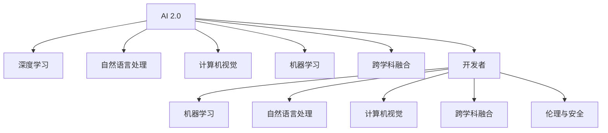

                 

# 李开复：AI 2.0 时代的开发者

> 关键词：AI 2.0, 开发者, 人工智能, 技术趋势, 未来发展, 应用场景, 挑战, 学习资源, 开发工具

## 1. 背景介绍

### 1.1 问题由来
在人工智能（AI）领域，开发者一直扮演着极其重要的角色。从最初的机器学习、数据科学，到如今的热门领域深度学习与自然语言处理，开发者不仅推动了技术的演进，还促进了AI应用的广泛普及。随着AI 2.0时代的到来，开发者面临着前所未有的机遇和挑战。AI 2.0代表着人工智能技术的突破性进展，将AI应用推向了一个全新的高度。开发者需要在这一时代中不断学习，适应新技术，以满足日益增长的AI需求。

### 1.2 问题核心关键点
AI 2.0时代，开发者的核心挑战在于：
- **技术快速迭代**：新技术、新算法层出不穷，开发者需要不断学习以跟上技术前沿。
- **跨学科融合**：AI 2.0不仅仅是技术问题，更是跨学科的综合性挑战。开发者需要理解不同领域的知识。
- **实际应用落地**：如何将AI技术应用于实际问题，实现真正的商业价值，是开发者面临的重要问题。
- **伦理与安全**：在AI应用中，开发者需考虑到伦理与安全问题，确保技术健康、安全地发展。

### 1.3 问题研究意义
研究AI 2.0时代的开发者问题，对于推动AI技术的广泛应用，提升AI应用的商业价值，促进跨学科合作，确保AI伦理与安全，具有重要意义：

1. **推动AI应用普及**：通过开发者的努力，将AI技术应用到各行各业，推动技术落地。
2. **提升商业价值**：帮助企业利用AI技术提升产品和服务，实现业务增长。
3. **促进跨学科合作**：开发者需要理解不同学科的知识，推动技术与业务、科学与工程的有效结合。
4. **确保技术健康发展**：开发者需考虑到伦理与安全问题，确保AI技术的发展符合人类价值观。

## 2. 核心概念与联系

### 2.1 核心概念概述

为更好地理解AI 2.0时代开发者的角色，本节将介绍几个密切相关的核心概念：

- **AI 2.0**：指新一代人工智能技术，以深度学习、自然语言处理、计算机视觉等为代表，正在重塑各行各业。
- **开发者**：通过编写代码、设计算法等方式实现AI技术的开发者群体。
- **机器学习**：通过数据训练算法，使计算机能够自我学习和改进。
- **深度学习**：一种特殊形式的机器学习，使用多层神经网络模型，实现复杂任务的解决。
- **自然语言处理（NLP）**：使计算机能够理解、生成人类语言，实现人机交互。
- **计算机视觉**：使计算机能够“看”懂图片、视频，进行图像识别、视频分析等。
- **跨学科融合**：AI 2.0不仅仅是技术问题，还涉及到心理学、伦理学、社会学等多学科的融合。
- **伦理与安全**：AI应用中需考虑的伦理问题，如隐私保护、公平性、安全性等。

这些核心概念之间的逻辑关系可以通过以下Mermaid流程图来展示：



这个流程图展示了几大核心概念之间的关系：

1. AI 2.0 是深度学习、自然语言处理、计算机视觉等技术的集合，并强调了跨学科融合的重要性。
2. 开发者是实现AI 2.0的核心力量，需要通过编写代码、设计算法等方式将AI技术应用到实际问题中。
3. 开发者需要具备机器学习、深度学习等技术，能够处理复杂的数据和任务。
4. 开发者需要理解跨学科的知识，如心理学、伦理学等，确保AI技术的发展符合人类价值观。
5. 开发者需关注伦理与安全问题，确保AI应用的公正、透明和安全性。

## 3. 核心算法原理 & 具体操作步骤
### 3.1 算法原理概述

AI 2.0时代的开发者，需要对核心算法原理有深入理解。以下是对主要算法的简要介绍：

- **深度学习**：使用多层神经网络模型，通过反向传播算法进行优化，实现复杂函数的逼近。
- **卷积神经网络（CNN）**：用于图像处理、视频分析等任务，通过卷积操作提取局部特征。
- **循环神经网络（RNN）**：用于序列数据处理，如自然语言处理中的时间依赖性任务。
- **生成对抗网络（GAN）**：通过生成器与判别器的对抗过程，生成逼真的人工数据。
- **自监督学习**：利用未标注数据，通过自我监督任务训练模型，无需大量标注数据。
- **强化学习**：通过奖励反馈，训练模型在复杂环境中进行决策。

### 3.2 算法步骤详解

AI 2.0时代的开发者，在实际应用中需遵循以下算法步骤：

**Step 1: 数据准备与预处理**
- 收集并标注数据集，确保数据质量与多样性。
- 进行数据清洗、归一化等预处理操作，确保数据适合模型训练。

**Step 2: 模型选择与设计**
- 根据任务需求选择合适的模型架构，如CNN、RNN、GAN等。
- 设计模型的输入、输出与中间层，确保模型具有合理的表达能力。

**Step 3: 模型训练与优化**
- 使用优化算法（如Adam、SGD等）更新模型参数。
- 采用损失函数（如交叉熵、均方误差等）衡量模型性能。
- 使用正则化技术（如L2正则、Dropout等）避免过拟合。

**Step 4: 模型评估与部署**
- 在验证集上评估模型性能，选择最优模型。
- 进行模型部署，集成到实际应用系统中。
- 定期收集反馈数据，持续改进模型性能。

**Step 5: 模型迭代与优化**
- 根据实际应用反馈，迭代优化模型设计。
- 引入新技术、新算法，提升模型性能。
- 关注模型可解释性、可维护性，确保模型易于理解和调试。

### 3.3 算法优缺点

AI 2.0时代的算法具有以下优点：
- **复杂任务处理**：深度学习、自然语言处理等算法，能够处理复杂的非线性问题。
- **高效性能**：通过反向传播算法等优化方法，训练速度快，模型效果显著。
- **广泛应用**：广泛应用于图像识别、语音识别、自然语言处理等领域，推动AI应用的普及。

同时，这些算法也存在一些局限性：
- **高计算资源需求**：深度学习等算法需要大量的计算资源，如GPU、TPU等。
- **数据依赖**：算法效果高度依赖于数据质量与数量，数据不足可能导致模型性能不佳。
- **可解释性不足**：黑盒模型难以解释其内部工作机制，缺乏透明度。
- **伦理问题**：模型决策过程可能存在偏见、歧视，需关注伦理与公平性问题。

### 3.4 算法应用领域

AI 2.0时代的算法在多个领域得到了广泛应用，例如：

- **医疗健康**：通过深度学习模型，实现疾病诊断、药物发现等。
- **金融服务**：利用自然语言处理模型，进行金融分析、风险评估等。
- **智能制造**：应用计算机视觉技术，进行质量检测、故障诊断等。
- **自动驾驶**：通过计算机视觉与深度学习模型，实现车辆自主导航。
- **智能客服**：使用自然语言处理与生成对抗网络模型，提升客户服务体验。
- **智慧城市**：应用计算机视觉与自然语言处理模型，实现城市管理与公共服务优化。
- **教育培训**：通过自监督学习与强化学习模型，提升在线教育与培训效果。

除了这些经典应用外，AI 2.0技术还在更多新兴领域得到创新应用，如可控生成、智能推荐、社交网络分析等，为各行业带来了革命性变革。

## 4. 数学模型和公式 & 详细讲解 & 举例说明

### 4.1 数学模型构建

本节将使用数学语言对AI 2.0算法进行更加严格的刻画。

记深度学习模型为 $M_{\theta}(x)$，其中 $x$ 为输入数据，$\theta$ 为模型参数。假设训练集为 $D=\{(x_i,y_i)\}_{i=1}^N$，其中 $y_i$ 为标签。模型的损失函数为 $\ell(M_{\theta}(x),y_i)$，则经验风险为：

$$
\mathcal{L}(\theta) = \frac{1}{N}\sum_{i=1}^N \ell(M_{\theta}(x_i),y_i)
$$

模型的优化目标是最小化经验风险，即：

$$
\theta^* = \mathop{\arg\min}_{\theta} \mathcal{L}(\theta)
$$

在实践中，通常使用基于梯度的优化算法，如Adam、SGD等，通过反向传播算法更新模型参数：

$$
\theta \leftarrow \theta - \eta \nabla_{\theta}\mathcal{L}(\theta)
$$

其中 $\eta$ 为学习率，$\nabla_{\theta}\mathcal{L}(\theta)$ 为损失函数对参数 $\theta$ 的梯度。

### 4.2 公式推导过程

以下以多层感知器（MLP）为例，推导其优化过程。

假设模型 $M_{\theta}(x)$ 包含 $L$ 层，其中第 $l$ 层的激活函数为 $f_l$，参数为 $\theta_l$。则前向传播过程为：

$$
z_1 = W_1x + b_1
$$
$$
a_1 = f_1(z_1)
$$
$$
z_2 = W_2a_1 + b_2
$$
$$
a_2 = f_2(z_2)
$$
$$
\cdots
$$
$$
z_L = W_La_{L-1} + b_L
$$
$$
a_L = f_L(z_L)
$$

其中 $W_l$ 为权重矩阵，$b_l$ 为偏置项，$a_l$ 为第 $l$ 层的输出。后向传播过程为：

$$
\frac{\partial \mathcal{L}}{\partial z_L} = \frac{\partial \mathcal{L}}{\partial a_L}\frac{\partial a_L}{\partial z_L} = (\frac{\partial \mathcal{L}}{\partial y})\delta_L = \frac{\partial \mathcal{L}}{\partial a_{L-1}}W_L^T\delta_L
$$
$$
\delta_L = \frac{\partial \mathcal{L}}{\partial z_L}\frac{\partial z_L}{\partial a_{L-1}}f_L'(z_L)
$$

通过链式法则计算损失函数对每一层参数的梯度：

$$
\frac{\partial \mathcal{L}}{\partial W_l} = \frac{\partial \mathcal{L}}{\partial z_l}\frac{\partial z_l}{\partial a_{l-1}}\frac{\partial a_{l-1}}{\partial W_l} = \delta_{l-1}a_{l-1}^T
$$
$$
\frac{\partial \mathcal{L}}{\partial b_l} = \frac{\partial \mathcal{L}}{\partial z_l}\frac{\partial z_l}{\partial a_{l-1}} = \delta_{l-1}
$$

因此，优化算法更新模型参数的公式为：

$$
W_l \leftarrow W_l - \eta \delta_{l-1}a_{l-1}^T
$$
$$
b_l \leftarrow b_l - \eta \delta_{l-1}
$$

其中 $\delta_{l-1}$ 为第 $l-1$ 层的梯度，$a_{l-1}^T$ 为第 $l-1$ 层的输出矩阵，$\eta$ 为学习率。

### 4.3 案例分析与讲解

以图像分类任务为例，分析深度学习模型的优化过程。

假设训练集包含 $N$ 张图像，每张图像大小为 $H \times W \times C$，其中 $C$ 为通道数，如RGB图像。模型 $M_{\theta}(x)$ 包含 $L$ 层，每层有 $n$ 个神经元。则输入数据 $x$ 表示为 $H \times W \times C$ 的矩阵。

模型定义如下：

$$
z_1 = W_1x + b_1
$$
$$
a_1 = f_1(z_1)
$$
$$
z_2 = W_2a_1 + b_2
$$
$$
a_2 = f_2(z_2)
$$
$$
\cdots
$$
$$
z_L = W_La_{L-1} + b_L
$$
$$
a_L = f_L(z_L)
$$

其中 $W_l$ 为权重矩阵，$b_l$ 为偏置项，$f_l$ 为激活函数，如ReLU、Sigmoid等。假设模型的输出层有 $K$ 个神经元，每个神经元对应一个类别。则模型的输出表示为 $K$ 维向量 $a_L$。

假设训练集中的每张图像 $x_i$ 的真实标签为 $y_i \in \{1, 2, \cdots, K\}$，则损失函数为交叉熵损失：

$$
\ell(M_{\theta}(x_i),y_i) = -y_i\log a_i + (1-y_i)\log(1-a_i)
$$

其中 $a_i$ 为模型对图像 $x_i$ 的分类概率。

模型的优化目标是最小化交叉熵损失：

$$
\mathcal{L}(\theta) = \frac{1}{N}\sum_{i=1}^N \ell(M_{\theta}(x_i),y_i)
$$

在实践中，通常使用随机梯度下降（SGD）算法更新模型参数，每次随机抽取一张图像进行优化：

$$
W_l \leftarrow W_l - \eta \frac{\partial \mathcal{L}}{\partial W_l}
$$
$$
b_l \leftarrow b_l - \eta \frac{\partial \mathcal{L}}{\partial b_l}
$$

其中 $\eta$ 为学习率。

## 5. 项目实践：代码实例和详细解释说明

### 5.1 开发环境搭建

在进行AI 2.0算法实践前，我们需要准备好开发环境。以下是使用Python进行TensorFlow开发的环境配置流程：

1. 安装Anaconda：从官网下载并安装Anaconda，用于创建独立的Python环境。

2. 创建并激活虚拟环境：
```bash
conda create -n tf-env python=3.8 
conda activate tf-env
```

3. 安装TensorFlow：根据CUDA版本，从官网获取对应的安装命令。例如：
```bash
conda install tensorflow -c conda-forge -c pytorch
```

4. 安装各类工具包：
```bash
pip install numpy pandas scikit-learn matplotlib tqdm jupyter notebook ipython
```

完成上述步骤后，即可在`tf-env`环境中开始AI 2.0算法实践。

### 5.2 源代码详细实现

下面我们以图像分类任务为例，给出使用TensorFlow对多层感知器（MLP）模型进行训练的PyTorch代码实现。

首先，定义模型结构：

```python
import tensorflow as tf

# 定义模型
def mlp_model(input_shape, num_classes):
    model = tf.keras.Sequential([
        tf.keras.layers.Dense(256, activation='relu', input_shape=input_shape),
        tf.keras.layers.Dense(256, activation='relu'),
        tf.keras.layers.Dense(num_classes, activation='softmax')
    ])
    return model

# 创建模型实例
input_shape = (28, 28, 1)
num_classes = 10
model = mlp_model(input_shape, num_classes)
```

然后，定义数据处理函数：

```python
import numpy as np
from tensorflow.keras.datasets import mnist

# 加载数据集
(x_train, y_train), (x_test, y_test) = mnist.load_data()

# 数据预处理
x_train = x_train.reshape(-1, 28, 28, 1) / 255.0
x_test = x_test.reshape(-1, 28, 28, 1) / 255.0

# 将标签转换为one-hot编码
y_train = tf.keras.utils.to_categorical(y_train, num_classes)
y_test = tf.keras.utils.to_categorical(y_test, num_classes)
```

接着，定义优化器、损失函数和训练流程：

```python
from tensorflow.keras.optimizers import Adam

# 定义优化器
optimizer = Adam(learning_rate=0.001)

# 定义损失函数
loss_fn = tf.keras.losses.CategoricalCrossentropy()

# 定义训练过程
@tf.function
def train_step(x, y):
    with tf.GradientTape() as tape:
        logits = model(x)
        loss = loss_fn(y, logits)
    grads = tape.gradient(loss, model.trainable_variables)
    optimizer.apply_gradients(zip(grads, model.trainable_variables))
    return loss

# 训练过程
epochs = 10
batch_size = 64

for epoch in range(epochs):
    for i in range(0, len(x_train), batch_size):
        x_batch = x_train[i:i+batch_size]
        y_batch = y_train[i:i+batch_size]
        loss = train_step(x_batch, y_batch)
        print(f'Epoch {epoch+1}, Loss: {loss:.4f}')
```

最后，进行模型评估：

```python
import matplotlib.pyplot as plt

# 评估模型
losses = []
accuracies = []
for i in range(0, len(x_test), batch_size):
    x_batch = x_test[i:i+batch_size]
    y_batch = y_test[i:i+batch_size]
    loss = train_step(x_batch, y_batch)
    losses.append(loss)
    y_pred = tf.argmax(model(x_batch), axis=1)
    accuracy = tf.reduce_mean(tf.cast(tf.equal(y_pred, y_batch), tf.float32))
    accuracies.append(accuracy)

plt.plot(accuracies)
plt.xlabel('Epoch')
plt.ylabel('Accuracy')
plt.show()

print(f'Test Accuracy: {np.mean(accuracies):.4f}')
```

以上就是使用TensorFlow对多层感知器模型进行图像分类任务训练的完整代码实现。可以看到，得益于TensorFlow的强大封装，我们可以用相对简洁的代码完成MLP模型的训练。

### 5.3 代码解读与分析

让我们再详细解读一下关键代码的实现细节：

**mlp_model函数**：
- 定义了包含三个全连接层的MLP模型，使用ReLU作为激活函数。

**data_preprocess函数**：
- 加载MNIST数据集，将图像大小调整为一维向量，并归一化到[0, 1]区间。
- 将标签转换为one-hot编码，方便模型训练。

**train_step函数**：
- 定义了训练过程，使用GradientTape记录梯度，通过Adam优化器更新模型参数。
- 在每次训练中，随机抽取一个批次的数据进行更新，计算损失并返回。

**训练流程**：
- 定义总的epoch数和批大小，开始循环迭代
- 每个epoch内，对数据集进行批次化加载，对每个批次进行训练
- 记录损失并打印
- 在测试集上进行评估，计算测试准确率

可以看到，TensorFlow使得MLP模型的训练过程变得简洁高效。开发者可以将更多精力放在模型架构、数据处理等高层逻辑上，而不必过多关注底层实现细节。

当然，工业级的系统实现还需考虑更多因素，如模型的保存和部署、超参数的自动搜索、更灵活的任务适配层等。但核心的算法流程基本与此类似。

## 6. 实际应用场景
### 6.1 智能医疗

AI 2.0时代的开发者，在智能医疗领域可以发挥重要作用。利用深度学习模型，开发者可以构建用于疾病诊断、药物发现、患者监控等应用的智能系统。

在实践过程中，开发者可以收集并标注医疗影像、电子病历等数据，训练图像分类、文本分类等模型。例如，使用卷积神经网络（CNN）对医学影像进行分类，使用长短期记忆网络（LSTM）对患者记录进行分析，构建智能诊断系统。

### 6.2 金融风险管理

在金融领域，开发者可以利用自然语言处理模型，进行市场分析、风险评估、舆情监测等任务。通过收集和标注财经新闻、公告、评论等数据，训练文本分类、情感分析等模型，构建智能分析系统。

例如，使用BERT模型对新闻和公告进行情感分析，识别出市场情绪的变化，帮助投资者做出更明智的投资决策。同时，利用GPT模型生成投资报告和建议，提升服务质量。

### 6.3 自动驾驶

自动驾驶技术是AI 2.0时代的典型应用之一。开发者可以利用计算机视觉与深度学习模型，实现车辆自主导航、路径规划、障碍物检测等功能。

例如，使用卷积神经网络（CNN）对车辆周围环境进行图像识别，使用生成对抗网络（GAN）生成模拟训练数据，提升模型的鲁棒性和泛化能力。通过实时监测车辆周围环境，进行避障、转向等决策，实现车辆自主导航。

### 6.4 教育培训

教育培训领域是AI 2.0技术的另一个重要应用。开发者可以利用自然语言处理与强化学习模型，构建智能教学系统、在线教育平台等。

例如，使用BERT模型对学生回答进行情感分析，识别出学生的学习状态和需求，提供个性化学习建议。利用GPT模型生成教学内容和学习资源，提升教育质量。

### 6.5 未来应用展望

随着AI 2.0技术的发展，未来开发者将在更多领域发挥重要作用：

- **智慧农业**：利用计算机视觉与自然语言处理模型，进行农作物的检测与分析，提升农业生产效率。
- **环境保护**：使用自然语言处理模型，对环境数据进行分析，识别出环境污染问题，制定治理方案。
- **城市管理**：构建智能交通、智慧安防等系统，提升城市运行效率和安全性。
- **文化遗产**：利用计算机视觉与自然语言处理模型，对文化遗产进行数字化保护和传承。
- **智能家居**：开发智能家居系统，实现语音识别、图像分析等功能，提升居住体验。

AI 2.0技术的应用领域将不断拓展，为各行各业带来颠覆性变革。相信在开发者的努力下，AI 2.0技术将加速落地，推动社会进步。

## 7. 工具和资源推荐
### 7.1 学习资源推荐

为了帮助开发者掌握AI 2.0技术，以下是一些优质的学习资源：

1. Coursera《深度学习》课程：由深度学习领域的大师级教授Andrew Ng讲授，系统介绍了深度学习的基本概念和核心算法。
2. Udacity《AI 2.0》课程：涵盖深度学习、自然语言处理、计算机视觉等技术，适合希望全面掌握AI 2.0技术的开发者。
3. TensorFlow官方文档：详细介绍了TensorFlow的使用方法、API、最佳实践等，是开发AI应用的重要参考资料。
4. PyTorch官方文档：提供了PyTorch的详细文档、教程、案例等，帮助开发者快速上手。
5. Google Colab：免费的在线Jupyter Notebook环境，提供GPU/TPU算力，方便开发者进行实验和调试。

通过对这些资源的学习实践，相信你一定能够快速掌握AI 2.0技术的精髓，并用于解决实际的NLP问题。
###  7.2 开发工具推荐

高效的开发离不开优秀的工具支持。以下是几款用于AI 2.0算法开发的常用工具：

1. PyTorch：基于Python的开源深度学习框架，灵活的计算图设计，适合快速迭代研究。
2. TensorFlow：由Google主导的开源深度学习框架，生产部署方便，适合大规模工程应用。
3. Jupyter Notebook：开源的交互式编程环境，支持多语言代码编写，适合进行数据分析和模型实验。
4. Keras：基于TensorFlow和Theano的高层API，方便进行模型构建和训练。
5. Google Colab：免费的在线Jupyter Notebook环境，提供GPU/TPU算力，方便开发者进行实验和调试。

合理利用这些工具，可以显著提升AI 2.0算法开发的效率，加快创新迭代的步伐。

### 7.3 相关论文推荐

AI 2.0技术的发展源于学界的持续研究。以下是几篇奠基性的相关论文，推荐阅读：

1. AlexNet：ImageNet 2012年比赛冠军模型，开创了深度学习在计算机视觉领域的应用。
2. VGGNet：使用卷积神经网络对大规模图像数据进行分类，提升了计算机视觉模型的准确性。
3. ResNet：提出残差网络结构，解决了深度神经网络中的梯度消失问题，提升了模型的训练深度。
4. AlphaGo：使用深度学习与蒙特卡洛树搜索，提升了棋类游戏AI的水平。
5. GPT-3：利用大规模预训练语言模型，在自然语言处理任务上取得了突破性进展。

这些论文代表了AI 2.0技术的演进脉络。通过学习这些前沿成果，可以帮助研究者把握学科前进方向，激发更多的创新灵感。

## 8. 总结：未来发展趋势与挑战

### 8.1 总结

本文对AI 2.0时代的开发者问题进行了全面系统的介绍。首先阐述了AI 2.0技术的发展背景和应用场景，明确了开发者在其中的核心作用。其次，从原理到实践，详细讲解了深度学习、自然语言处理等核心算法，给出了AI 2.0算法开发的完整代码实例。同时，本文还广泛探讨了AI 2.0技术在医疗、金融、自动驾驶等领域的实际应用，展示了AI 2.0技术的广阔前景。

通过本文的系统梳理，可以看到，AI 2.0技术正在引领AI领域的突破性进展，为各行各业带来了深刻的变革。未来，开发者需要在技术迭代、跨学科融合、实际应用等方面不断努力，才能更好地推动AI 2.0技术的发展，实现其商业价值。

### 8.2 未来发展趋势

展望未来，AI 2.0时代的开发者将面临以下发展趋势：

1. **技术快速迭代**：新技术、新算法层出不穷，开发者需不断学习以跟上技术前沿。
2. **跨学科融合**：AI 2.0不仅仅是技术问题，更是跨学科的综合性挑战。开发者需理解不同领域的知识。
3. **实际应用落地**：如何将AI技术应用于实际问题，实现真正的商业价值，是开发者面临的重要问题。
4. **伦理与安全**：在AI应用中，开发者需考虑到伦理与安全问题，确保技术健康、安全地发展。

这些趋势凸显了AI 2.0技术的广泛应用前景。开发者需不断探索新算法、新技术，推动AI技术在更多领域落地。

### 8.3 面临的挑战

尽管AI 2.0技术取得了显著进展，但在迈向更加智能化、普适化应用的过程中，开发者仍需面对以下挑战：

1. **技术复杂性**：深度学习、自然语言处理等技术的复杂性高，开发者需具备较强的数学和编程能力。
2. **数据质量与标注成本**：AI 2.0技术高度依赖高质量数据和标注，获取高质量数据成本高。
3. **计算资源需求**：深度学习等算法需要大量的计算资源，开发者需具备一定的计算资源。
4. **模型可解释性**：AI 2.0模型通常是黑盒模型，缺乏透明度，需进一步提高模型可解释性。
5. **伦理与安全问题**：AI 2.0模型可能存在偏见、歧视，开发者需关注伦理与安全问题。

这些挑战需要开发者在技术、资源、伦理等方面进行全面优化。唯有从多个维度协同发力，才能更好地推动AI 2.0技术的发展。

### 8.4 研究展望

未来，在AI 2.0技术的推动下，开发者将在更多领域发挥重要作用：

1. **医疗健康**：利用深度学习模型，进行疾病诊断、药物发现、患者监控等应用。
2. **金融风险管理**：利用自然语言处理模型，进行市场分析、风险评估、舆情监测等任务。
3. **自动驾驶**：利用计算机视觉与深度学习模型，实现车辆自主导航、路径规划、障碍物检测等功能。
4. **教育培训**：利用自然语言处理与强化学习模型，构建智能教学系统、在线教育平台等。
5. **智慧农业**：利用计算机视觉与自然语言处理模型，进行农作物的检测与分析，提升农业生产效率。
6. **环境保护**：使用自然语言处理模型，对环境数据进行分析，识别出环境污染问题，制定治理方案。
7. **城市管理**：构建智能交通、智慧安防等系统，提升城市运行效率和安全性。
8. **文化遗产**：利用计算机视觉与自然语言处理模型，对文化遗产进行数字化保护和传承。
9. **智能家居**：开发智能家居系统，实现语音识别、图像分析等功能，提升居住体验。

AI 2.0技术的应用领域将不断拓展，为各行各业带来颠覆性变革。相信在开发者的努力下，AI 2.0技术将加速落地，推动社会进步。

## 9. 附录：常见问题与解答

**Q1：AI 2.0时代，开发者如何保持学习？**

A: 开发者需不断关注最新的AI技术动态，参加相关的培训、研讨会、黑客松等活动，保持学习热情。同时，利用在线资源如Coursera、Udacity等，进行系统的课程学习。

**Q2：AI 2.0算法的计算资源需求如何满足？**

A: 开发者需具备一定的计算资源，如GPU、TPU等高性能设备。可以加入开源项目或公司，共享计算资源。同时，利用云计算平台如Google Colab、AWS等，获取云端计算资源。

**Q3：如何提高AI 2.0模型的可解释性？**

A: 开发者需关注模型的决策过程，使用可解释性技术如LIME、SHAP等，帮助理解和解释模型输出。同时，加入知识图谱、规则库等外部知识，提升模型的可解释性。

**Q4：如何在AI 2.0开发中保持伦理与安全意识？**

A: 开发者需关注AI技术的伦理与安全问题，设计算法时避免偏见、歧视等不良现象。同时，加入伦理审查机制，对算法进行定期审查，确保技术的公平性与安全性。

---

作者：禅与计算机程序设计艺术 / Zen and the Art of Computer Programming

