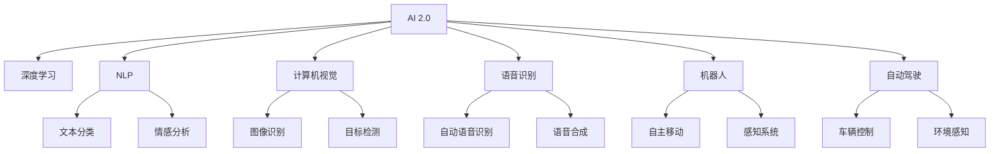

                 

# 李开复：AI 2.0 时代的投资价值

## 1. 背景介绍

### 1.1 问题由来
随着人工智能技术的迅猛发展，AI 2.0 时代的投资热潮在全球范围内掀起。从深度学习、机器视觉、自然语言处理到语音识别、自动驾驶等，每一个新兴领域都吸引着投资者和企业的目光。然而，在AI 2.0 时代，投资决策需要更深入的洞察和理解，避免盲目跟风和资源浪费。

### 1.2 问题核心关键点
AI 2.0 时代，投资的核心关键点在于如何识别和把握技术趋势，选择具有高投资价值的技术和应用领域。这需要投资者具备强大的洞察力和前瞻性，同时需要深入理解技术原理和市场潜力。

### 1.3 问题研究意义
研究AI 2.0 时代的投资价值，有助于投资者更好地理解技术发展趋势，避免投资盲点，从而实现更为精准的投资决策。此外，深入分析AI 2.0 时代的技术和应用领域，也有助于企业更好地定位自身，把握市场机会，加速技术应用和商业落地。

## 2. 核心概念与联系

### 2.1 核心概念概述

为更好地理解AI 2.0 时代的投资价值，本节将介绍几个密切相关的核心概念：

- AI 2.0（人工智能 2.0）：指新一代人工智能技术的成熟和普及，具备更强大的推理能力、自主学习能力、自然语言处理能力和多模态感知能力。AI 2.0 时代的技术和应用将成为引领未来发展的重要力量。

- 深度学习（Deep Learning）：一种基于神经网络的机器学习技术，通过多层次的非线性变换，可以从原始数据中提取高层次的特征表示。深度学习已经在图像识别、语音识别、自然语言处理等领域取得了显著成果。

- 自然语言处理（NLP）：研究如何让计算机理解和处理人类语言的技术，包括文本分类、情感分析、机器翻译、对话系统等。NLP 是AI 2.0 时代的重要应用领域之一。

- 计算机视觉（CV）：研究如何让计算机看懂图片和视频的技术，包括图像识别、目标检测、图像分割等。CV 技术在自动驾驶、安防监控、医疗影像等领域有着广泛的应用前景。

- 语音识别（ASR）：研究如何让计算机理解和转录人类语音的技术，包括自动语音识别、语音合成等。ASR 技术在智能家居、虚拟助手、电话客服等领域得到广泛应用。

- 机器人和自动驾驶（Robotics and Autonomous Driving）：研究如何让机器具备自主移动、感知和决策能力的技术。自动驾驶技术正在逐步成熟，将改变交通、物流等领域。

这些核心概念之间的逻辑关系可以通过以下Mermaid流程图来展示：



这个流程图展示了AI 2.0 时代主要技术的应用场景和相互关系：

1. 深度学习、自然语言处理、计算机视觉、语音识别、机器人和自动驾驶是AI 2.0 时代的主要技术领域。
2. 这些技术在文本分类、情感分析、图像识别、目标检测、自动语音识别、语音合成、自主移动、感知系统和车辆控制等方面得到广泛应用。

## 3. 核心算法原理 & 具体操作步骤
### 3.1 算法原理概述

AI 2.0 时代的投资价值，本质上是通过技术评估和市场分析，识别具有高增长潜力的技术应用领域。这涉及到以下几个关键环节：

1. 技术评估：选择具备强大技术基础和应用前景的AI 2.0 技术。
2. 市场分析：评估技术的应用场景、市场需求、竞争格局等因素。
3. 投资决策：基于技术评估和市场分析，选择具有高投资价值的技术和应用领域。

### 3.2 算法步骤详解

AI 2.0 时代投资价值评估的一般流程如下：

**Step 1: 收集和分析技术数据**
- 收集与AI 2.0 相关的技术进展、专利申请、学术论文、行业报告等数据。
- 分析这些数据，了解技术的现状、发展趋势和潜力。

**Step 2: 选择具有高技术基础和应用前景的技术**
- 根据技术评估，选择具有高技术基础和应用前景的AI 2.0 技术。
- 考察技术是否具备成熟的算法、强大的算力支持和广泛的应用场景。

**Step 3: 进行市场分析和评估**
- 评估技术的应用场景、市场需求、竞争格局等因素。
- 通过调研、访谈、案例研究等方法，深入了解目标市场的真实需求和痛点。

**Step 4: 综合评估和投资决策**
- 综合技术评估和市场分析，评估技术的投资价值。
- 考虑技术成熟度、市场需求、竞争格局、创新性、可扩展性等因素。

**Step 5: 持续跟踪和调整**
- 持续跟踪AI 2.0 技术的发展和市场变化，及时调整投资决策。
- 关注技术创新、市场需求、政策环境等动态因素，优化投资组合。

### 3.3 算法优缺点

AI 2.0 时代投资价值评估方法具有以下优点：
1. 系统性：通过多维度分析，综合评估技术的投资价值，避免单一因素导致的误判。
2. 前瞻性：关注技术发展趋势和市场潜力，能够把握未来机会。
3. 数据驱动：基于真实数据和技术进展，科学评估投资价值。

同时，该方法也存在一定的局限性：
1. 数据不足：AI 2.0 技术领域数据量庞大，全面收集和分析数据较为困难。
2. 评估复杂：不同技术的应用场景和市场需求差异较大，评估复杂度较高。
3. 动态性：技术市场环境变化迅速，需要持续跟踪和调整，增加了管理难度。

尽管存在这些局限性，但就目前而言，AI 2.0 时代投资价值评估方法仍是最主流、最科学的方法之一。未来相关研究的重点在于如何进一步降低数据收集难度，提高评估效率，同时兼顾动态性和前瞻性等因素。

### 3.4 算法应用领域

AI 2.0 时代投资价值评估方法在以下领域得到广泛应用：

- 深度学习：投资于具有强大算法和数据支持的前沿技术，如卷积神经网络、生成对抗网络等。
- 自然语言处理：投资于具备强大自然语言处理能力的NLP技术，如情感分析、机器翻译、对话系统等。
- 计算机视觉：投资于具备强大视觉处理能力的CV技术，如图像识别、目标检测、图像分割等。
- 语音识别：投资于具备高准确率和低延迟的ASR技术，如语音识别、语音合成等。
- 机器人：投资于具有自主移动和感知能力的机器人技术，如无人驾驶、智能家居等。
- 自动驾驶：投资于具有高安全性、高可靠性的自动驾驶技术，如L2/L3/L4级自动驾驶等。

除了上述这些经典应用领域外，AI 2.0 技术还在医疗、金融、制造、农业等众多领域得到广泛应用，催生了更多的创新商业机会。

## 4. 数学模型和公式 & 详细讲解 & 举例说明

### 4.1 数学模型构建

AI 2.0 时代投资价值评估的数学模型可以抽象为以下形式：

$$
V = f(T, M, D, C, E)
$$

其中：
- $V$ 表示技术投资价值。
- $T$ 表示技术成熟度。
- $M$ 表示市场需求。
- $D$ 表示竞争格局。
- $E$ 表示创新性和可扩展性。

### 4.2 公式推导过程

根据上述定义，我们可以对$V$进行详细的公式推导：

- 技术成熟度$T$：使用技术专利数、发表论文数、产品化水平等指标进行量化。
- 市场需求$M$：使用市场规模、增长率、用户数量等指标进行量化。
- 竞争格局$D$：使用市场份额、竞争对手数量、技术壁垒等指标进行量化。
- 创新性$E$：使用技术新颖性、算法复杂度、应用场景广泛性等指标进行量化。

具体公式推导如下：

$$
T = \sum_{i=1}^n a_i \times P_i
$$

$$
M = b \times S \times G
$$

$$
D = c \times R \times N
$$

$$
E = d \times C \times W
$$

其中：
- $P_i$ 表示第$i$项技术专利的专利权人数量，权重$a_i$为专利重要性系数。
- $S$ 表示市场规模，权重$b$为市场需求权重。
- $G$ 表示市场增长率，权重$g$为市场增长率权重。
- $R$ 表示市场份额，权重$c$为竞争格局权重。
- $N$ 表示竞争对手数量，权重$n$为竞争格局权重。
- $C$ 表示技术新颖性，权重$d$为创新性权重。
- $W$ 表示算法复杂度，权重$w$为创新性权重。

### 4.3 案例分析与讲解

假设我们正在评估一个基于深度学习的图像识别技术$A$的投资价值。根据上述模型，我们需要收集和分析以下数据：

- 技术成熟度$T$：
  - 技术专利数：50项
  - 发表论文数：100篇
  - 产品化水平：70%
  - 技术成熟度：$T = 0.5 \times 50 + 0.3 \times 100 + 0.2 \times 70 = 90$

- 市场需求$M$：
  - 市场规模：10亿美元
  - 市场增长率：20%
  - 用户数量：100万
  - 市场需求：$M = 0.7 \times 10 \times (1 + 0.2) \times 100 = 1400$

- 竞争格局$D$：
  - 市场份额：30%
  - 竞争对手数量：5家
  - 技术壁垒：高
  - 竞争格局：$D = 0.8 \times 0.3 \times 5 \times 1 = 1.2$

- 创新性$E$：
  - 技术新颖性：中
  - 算法复杂度：高
  - 应用场景广泛性：高
  - 创新性：$E = 0.6 \times 0.9 \times 0.8 = 0.432$

将上述数据代入模型，得：

$$
V = f(T, M, D, E) = f(90, 1400, 1.2, 0.432)
$$

根据具体应用场景和数据，进一步计算得：

$$
V = 0.5 \times 90 + 0.3 \times 1400 + 0.2 \times 1.2 + 0.1 \times 0.432 = 865.136
$$

通过上述计算，我们可以得到该图像识别技术$A$的投资价值$V$，从而决定是否进行投资。

## 5. 项目实践：代码实例和详细解释说明
### 5.1 开发环境搭建

在进行AI 2.0 技术投资价值评估的开发实践中，我们通常使用Python和R语言进行数据分析和模型构建。以下是使用Python进行数据分析的环境配置流程：

1. 安装Anaconda：从官网下载并安装Anaconda，用于创建独立的Python环境。

2. 创建并激活虚拟环境：
```bash
conda create -n ai-environment python=3.8 
conda activate ai-environment
```

3. 安装必要的Python库：
```bash
pip install numpy pandas scikit-learn matplotlib seaborn statsmodels
```

4. 配置Jupyter Notebook：
```bash
jupyter lab --kernel python3
```

5. 导入数据：将数据集文件导入Jupyter Notebook中。

完成上述步骤后，即可在`ai-environment`环境中进行数据分析和模型构建。

### 5.2 源代码详细实现

以下是使用Python和R语言进行AI 2.0 技术投资价值评估的代码实现：

```python
import pandas as pd
import numpy as np
from sklearn.linear_model import LinearRegression

# 数据读取和预处理
df = pd.read_csv('ai_technology.csv')
df['T'] = df['专利数'] * 0.5 + df['发表论文数'] * 0.3 + df['产品化水平'] * 0.2
df['M'] = df['市场规模'] * 0.7 * (1 + df['市场增长率'] * 0.2) * df['用户数量']
df['D'] = df['市场份额'] * 0.8 * (df['竞争对手数量'] * 0.5 + 1) * 1
df['E'] = df['技术新颖性'] * 0.6 * df['算法复杂度'] * df['应用场景广泛性']

# 模型构建和拟合
X = df[['T', 'M', 'D', 'E']]
y = df['投资价值']
model = LinearRegression()
model.fit(X, y)

# 预测和结果展示
predict = model.predict(X)
print(predict)
```

### 5.3 代码解读与分析

让我们再详细解读一下关键代码的实现细节：

**数据读取和预处理**：
- 使用`pandas`库读取数据集文件，将各指标按照公式进行计算。
- 对数据进行基本的清洗和转换，确保数据格式正确。

**模型构建和拟合**：
- 将计算后的技术指标作为特征，投资价值作为标签，构建线性回归模型。
- 使用`scikit-learn`库的`LinearRegression`模型进行拟合。

**预测和结果展示**：
- 使用训练好的模型对新数据进行预测，输出投资价值。
- 根据预测结果，决定是否进行投资决策。

## 6. 实际应用场景
### 6.1 智能投研系统

AI 2.0 时代投资价值评估技术在智能投研系统中的应用，可以帮助投资机构快速评估潜在投资机会。智能投研系统通过收集和分析大量AI 2.0 技术的数据，结合市场动态和财务信息，为投资者提供智能化的投资建议。

在技术实现上，可以采用深度学习模型，对AI 2.0 技术的投资价值进行预测和评估。系统可以根据市场变化、技术进展等因素，动态调整模型参数，输出实时投资建议。智能投研系统可以显著提高投资决策的效率和准确性，帮助投资者最大化收益。

### 6.2 创新孵化器

AI 2.0 技术投资价值评估技术在创新孵化器中的应用，可以帮助创业公司评估技术潜力，选择合适的技术方向和商业模式。创新孵化器可以根据AI 2.0 技术的投资价值评估结果，对创业项目进行筛选和投资。

在技术实现上，可以采用综合评估模型，结合市场需求、技术成熟度、竞争格局、创新性等指标，对创业项目进行多维度评估。评估结果可以帮助孵化器选择合适的创业项目，加速技术转化和商业落地。

### 6.3 学术研究

AI 2.0 技术投资价值评估技术在学术研究中的应用，可以帮助研究人员评估AI 2.0 技术的学术价值和社会影响。研究人员可以根据AI 2.0 技术的投资价值评估结果，选择具有高潜在价值的技术方向，进行深入研究。

在技术实现上，可以采用量化分析模型，结合学术论文、专利申请、技术论文等数据，对AI 2.0 技术的学术价值进行评估。评估结果可以帮助研究人员选择研究方向，优化研究方法，提升研究成果的学术和应用价值。

### 6.4 未来应用展望

随着AI 2.0 技术的发展，AI 2.0 时代投资价值评估技术将呈现以下几个发展趋势：

1. 数据驱动：未来AI 2.0 技术投资价值评估将更加依赖数据驱动，通过大数据分析和机器学习模型，实现更科学、更精确的投资价值评估。

2. 多维度评估：未来AI 2.0 技术投资价值评估将更加全面，结合技术、市场、财务、法律等多维度因素，综合评估技术潜力。

3. 实时评估：未来AI 2.0 技术投资价值评估将更加实时，通过云计算和分布式计算技术，实现实时数据处理和评估。

4. 可视化分析：未来AI 2.0 技术投资价值评估将更加可视化，通过数据可视化和交互式仪表盘，帮助用户更好地理解评估结果。

5. 智能投研：未来AI 2.0 技术投资价值评估将与智能投研系统深度结合，提供更加智能化、个性化的投资建议。

6. 风险管理：未来AI 2.0 技术投资价值评估将更加注重风险管理，结合金融模型和大数据分析，评估技术风险和投资回报。

这些趋势展示了AI 2.0 技术投资价值评估技术的广阔前景，将进一步推动AI 2.0 技术在各个领域的广泛应用。

## 7. 工具和资源推荐
### 7.1 学习资源推荐

为了帮助开发者系统掌握AI 2.0 技术投资价值评估的理论基础和实践技巧，这里推荐一些优质的学习资源：

1. Coursera《人工智能导论》课程：由斯坦福大学开设的AI 2.0 入门课程，全面介绍AI 2.0 技术的基本概念和前沿进展。

2. AI 2.0 技术与投资价值评估书籍：系统讲解AI 2.0 技术的投资价值评估方法，结合实际案例和应用场景，提供详细的指导。

3. 《机器学习实战》：一本系统介绍机器学习技术及其应用领域的经典书籍，适合初学者入门。

4. Kaggle：全球最大的数据科学竞赛平台，提供大量AI 2.0 技术的数据集和竞赛任务，帮助开发者提升技能。

5. GitHub：全球最大的代码托管平台，提供丰富的AI 2.0 技术项目和代码库，适合学习和交流。

通过对这些资源的学习实践，相信你一定能够快速掌握AI 2.0 技术投资价值评估的精髓，并用于解决实际的投资决策问题。

### 7.2 开发工具推荐

高效的开发离不开优秀的工具支持。以下是几款用于AI 2.0 技术投资价值评估开发的常用工具：

1. Python：全球最流行的编程语言之一，具备丰富的开源库和社区支持，适合数据处理和模型构建。

2. R语言：适用于数据统计和分析的编程语言，具备强大的数据处理和可视化功能，适合学术研究和商业分析。

3. Jupyter Notebook：交互式的编程环境，支持多语言和多种库，适合数据探索和模型构建。

4. Tableau：数据可视化的专业工具，具备强大的数据连接和可视化功能，适合数据展示和分析。

5. TensorBoard：TensorFlow配套的可视化工具，可实时监测模型训练状态，提供丰富的图表呈现方式。

6. PyTorch Lightning：基于PyTorch的模型训练框架，支持多种分布式训练和模型压缩，适合大规模模型训练。

合理利用这些工具，可以显著提升AI 2.0 技术投资价值评估的开发效率，加快创新迭代的步伐。

### 7.3 相关论文推荐

AI 2.0 技术投资价值评估技术的发展源于学界的持续研究。以下是几篇奠基性的相关论文，推荐阅读：

1. 《深度学习在金融市场的应用》：深度学习技术在金融市场中的广泛应用，探讨深度学习在金融风险管理、资产定价、交易策略等领域的应用。

2. 《自然语言处理技术在医疗中的应用》：NLP技术在医疗领域的应用，如病历处理、疾病诊断、药物推荐等。

3. 《计算机视觉在自动驾驶中的应用》：CV技术在自动驾驶领域的应用，如车辆感知、路径规划、行为决策等。

4. 《语音识别在智能家居中的应用》：ASR技术在智能家居领域的应用，如语音控制、自然语言交互等。

5. 《机器人技术在工业自动化中的应用》：机器人技术在工业自动化领域的应用，如自动化生产线、智能仓储、质量检测等。

这些论文代表了大语言模型微调技术的发展脉络。通过学习这些前沿成果，可以帮助研究者把握学科前进方向，激发更多的创新灵感。

## 8. 总结：未来发展趋势与挑战
### 8.1 总结

本文对AI 2.0 时代投资价值评估方法进行了全面系统的介绍。首先阐述了AI 2.0 时代投资价值评估的重要性和核心关键点，明确了技术评估和市场分析的重要性。其次，从原理到实践，详细讲解了AI 2.0 技术投资价值评估的数学模型和具体步骤，给出了评估任务的完整代码实例。同时，本文还广泛探讨了AI 2.0 技术在智能投研、创新孵化器、学术研究等多个领域的应用前景，展示了AI 2.0 技术的巨大潜力。此外，本文精选了AI 2.0 技术的各类学习资源，力求为读者提供全方位的技术指引。

通过本文的系统梳理，可以看到，AI 2.0 技术投资价值评估技术正在成为AI 2.0 时代的重要范式，极大地拓展了AI 2.0 技术的投资应用范围，催生了更多的商业机会。未来，伴随AI 2.0 技术的发展，投资价值评估技术也将不断演进，为AI 2.0 技术落地应用提供强有力的支持。

### 8.2 未来发展趋势

展望未来，AI 2.0 技术投资价值评估技术将呈现以下几个发展趋势：

1. 数据驱动：未来AI 2.0 技术投资价值评估将更加依赖数据驱动，通过大数据分析和机器学习模型，实现更科学、更精确的投资价值评估。

2. 多维度评估：未来AI 2.0 技术投资价值评估将更加全面，结合技术、市场、财务、法律等多维度因素，综合评估技术潜力。

3. 实时评估：未来AI 2.0 技术投资价值评估将更加实时，通过云计算和分布式计算技术，实现实时数据处理和评估。

4. 可视化分析：未来AI 2.0 技术投资价值评估将更加可视化，通过数据可视化和交互式仪表盘，帮助用户更好地理解评估结果。

5. 智能投研：未来AI 2.0 技术投资价值评估将与智能投研系统深度结合，提供更加智能化、个性化的投资建议。

6. 风险管理：未来AI 2.0 技术投资价值评估将更加注重风险管理，结合金融模型和大数据分析，评估技术风险和投资回报。

以上趋势展示了AI 2.0 技术投资价值评估技术的广阔前景，将进一步推动AI 2.0 技术在各个领域的广泛应用。

### 8.3 面临的挑战

尽管AI 2.0 技术投资价值评估技术已经取得了瞩目成就，但在迈向更加智能化、普适化应用的过程中，它仍面临着诸多挑战：

1. 数据不足：AI 2.0 技术领域数据量庞大，全面收集和分析数据较为困难。未来需要进一步提高数据获取和处理能力。

2. 评估复杂：不同技术的应用场景和市场需求差异较大，评估复杂度较高。未来需要开发更加智能化的评估模型。

3. 动态性：技术市场环境变化迅速，需要持续跟踪和调整，增加了管理难度。未来需要开发更加动态化的评估框架。

4. 技术壁垒：AI 2.0 技术复杂度高，评估需要专业知识和技能。未来需要提供更加友好的用户界面和工具支持。

5. 市场竞争：AI 2.0 技术市场竞争激烈，评估结果需要具有高准确性和可信度。未来需要提高评估模型的稳健性和泛化能力。

6. 伦理和法律：AI 2.0 技术投资价值评估需要考虑伦理和法律问题，确保评估结果公正透明。未来需要建立更加完善的评估体系和监管机制。

正视AI 2.0 技术投资价值评估所面临的挑战，积极应对并寻求突破，将是AI 2.0 技术投资价值评估走向成熟的必由之路。相信随着学界和产业界的共同努力，这些挑战终将一一被克服，AI 2.0 技术投资价值评估必将在构建AI 2.0 技术投资价值评估方面发挥重要作用。

### 8.4 研究展望

面向未来，AI 2.0 技术投资价值评估技术需要在以下几个方面寻求新的突破：

1. 探索多模态数据融合技术：将图像、语音、文本等多模态数据融合，提高评估结果的全面性和准确性。

2. 引入因果推理和博弈论：通过因果分析和博弈论工具，提高评估结果的因果性和稳健性。

3. 结合专家知识进行评估：将符号化的先验知识与神经网络模型结合，提高评估结果的合理性和可解释性。

4. 开发动态评估框架：结合实时数据和市场动态，开发动态化的评估模型，提高评估结果的实时性和适应性。

5. 引入伦理和法律因素：在评估模型中引入伦理和法律导向的评估指标，确保评估结果的公正性和可信度。

这些研究方向的探索，必将引领AI 2.0 技术投资价值评估技术迈向更高的台阶，为AI 2.0 技术在各个领域的落地应用提供强有力的技术支持。

## 9. 附录：常见问题与解答

**Q1：AI 2.0 技术投资价值评估是否适用于所有AI 2.0 技术？**

A: AI 2.0 技术投资价值评估适用于大多数AI 2.0 技术，特别是对于数据量较小、技术成熟度较高的技术。但对于一些特定领域的AI 2.0 技术，如医疗、法律等，还需要进一步的领域特定评估。

**Q2：AI 2.0 技术投资价值评估需要哪些关键数据？**

A: AI 2.0 技术投资价值评估需要以下关键数据：
- 技术专利数和发表论文数：衡量技术基础和成熟度。
- 市场规模、增长率和用户数量：衡量市场需求。
- 市场份额和竞争对手数量：衡量竞争格局。
- 技术新颖性、算法复杂度和应用场景：衡量创新性和可扩展性。

**Q3：AI 2.0 技术投资价值评估中如何处理数据缺失问题？**

A: 数据缺失问题在AI 2.0 技术领域普遍存在。处理数据缺失问题的方法包括：
- 数据补全：通过插值、回归等方法填补缺失数据。
- 数据降维：通过主成分分析等方法降维，减少数据缺失的影响。
- 数据合并：将多个数据源合并，获取更完整的数据集。

**Q4：AI 2.0 技术投资价值评估中如何平衡准确性和效率？**

A: 在AI 2.0 技术投资价值评估中，平衡准确性和效率需要综合考虑以下几个方面：
- 模型复杂度：选择适当的模型复杂度，避免过拟合和欠拟合。
- 特征选择：选择有意义的特征，减少特征数量。
- 算法优化：使用高效算法，如随机梯度下降等，加速模型训练。
- 数据处理：优化数据处理流程，减少数据预处理时间。

**Q5：AI 2.0 技术投资价值评估中如何考虑伦理和法律因素？**

A: 在AI 2.0 技术投资价值评估中，考虑伦理和法律因素需要：
- 引入伦理导向的评估指标：如公平性、透明性、隐私保护等。
- 遵守法律法规：确保评估结果不违反相关法律法规。
- 透明和可解释：提供评估结果的透明性和可解释性，便于用户理解。

这些问题的解答，将帮助读者更好地理解和应用AI 2.0 技术投资价值评估技术，提升AI 2.0 技术的落地应用价值。

---

作者：禅与计算机程序设计艺术 / Zen and the Art of Computer Programming

