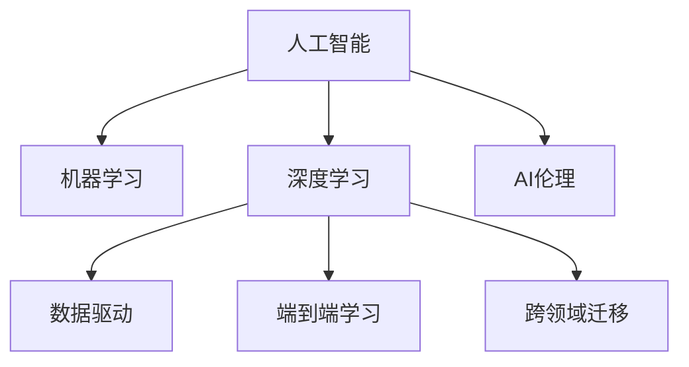

                 

# 李开复：AI 2.0 时代的未来展望

> 关键词：人工智能, 2.0时代, 未来展望, AI伦理, 机器学习, 深度学习, 数据驱动

## 1. 背景介绍

### 1.1 问题由来

近年来，人工智能（AI）技术取得了飞速的发展，尤其是在机器学习和深度学习领域的突破，使得AI技术从传统的基于规则的专家系统，迈入了以数据驱动、自适应学习为核心的2.0时代。AI 2.0时代的到来，带来了前所未有的机会和挑战。

人工智能的发展历程，大致经历了以下几个阶段：

1. **第一代人工智能**：以知识工程为基础，通过手工编写规则和专家知识，构建推理系统和专家系统，解决特定领域的问题。

2. **第二代人工智能**：以统计学习为基础，采用监督学习、无监督学习和半监督学习等方法，从大规模数据中学习知识，训练模型，并应用于图像识别、自然语言处理等任务。

3. **第三代人工智能**：以深度学习为基础，通过构建深层神经网络，实现端到端的自动化学习和特征提取，使得AI系统在视觉识别、语音识别、自然语言理解等方面取得了巨大突破。

AI 2.0时代的到来，标志着AI技术在计算能力、数据规模、模型复杂性等方面达到了新的高度，为人类社会带来了深远的影响。

### 1.2 问题核心关键点

AI 2.0时代的核心挑战包括：

- **数据驱动**：AI 2.0时代的AI系统，高度依赖于大规模、高质量的数据，数据的质量和多样性直接影响了模型的性能。
- **深度学习**：深度学习成为AI 2.0时代的主流方法，通过构建深层神经网络，实现端到端的自动化学习和特征提取。
- **模型复杂性**：AI 2.0时代的模型规模和复杂性显著提升，如何优化模型性能、降低计算成本、提高可解释性成为重要研究方向。
- **应用多样性**：AI 2.0时代的应用场景和任务多样性，要求AI系统具备更强的泛化能力和跨领域迁移能力。
- **伦理和安全**：AI 2.0时代的AI系统，涉及隐私、公平性、安全性等伦理问题，如何构建可信赖的AI系统是重要挑战。

这些关键点共同构成了AI 2.0时代的核心问题，需要通过技术创新、算法改进、数据治理、伦理审查等手段来解决。

## 2. 核心概念与联系

### 2.1 核心概念概述

为更好地理解AI 2.0时代的未来展望，本节将介绍几个密切相关的核心概念：

- **人工智能**：通过计算机系统模拟人类智能，实现自主学习、推理、决策等功能。
- **机器学习**：通过数据驱动的方式，让机器从经验中学习，不断优化模型性能。
- **深度学习**：一种特殊的机器学习算法，通过构建深层神经网络，实现高效的特征提取和模式识别。
- **数据驱动**：AI 2.0时代，模型性能和应用效果高度依赖于数据的质量和多样性。
- **端到端学习**：AI 2.0时代的AI系统，实现了从原始数据到最终结果的端到端自动化学习。
- **跨领域迁移**：AI 2.0时代的AI系统，具备更强的泛化能力和跨领域迁移能力，能从一种任务迁移到另一种任务。
- **AI伦理**：涉及隐私、公平性、安全性等伦理问题，如何构建可信赖的AI系统是重要研究方向。

这些核心概念之间的逻辑关系可以通过以下Mermaid流程图来展示：



这个流程图展示了他核心概念及其之间的关系：

1. 人工智能通过机器学习和深度学习，实现自主学习和推理。
2. 机器学习和深度学习依赖于数据驱动的端到端学习，从原始数据中学习知识。
3. AI系统需要具备跨领域迁移能力，实现不同任务之间的知识迁移。
4. AI系统涉及伦理问题，需要关注隐私、公平性、安全性等。

这些概念共同构成了AI 2.0时代的核心框架，使得AI系统具备更强的智能能力和广泛的应用潜力。通过理解这些核心概念，我们可以更好地把握AI 2.0时代的未来发展方向。

## 3. 核心算法原理 & 具体操作步骤

### 3.1 算法原理概述

AI 2.0时代的核心算法原理主要包括：

- **深度学习算法**：通过构建深层神经网络，实现高效的特征提取和模式识别，广泛应用于图像识别、自然语言处理等领域。
- **监督学习算法**：通过标记好的数据集训练模型，让机器学习如何从输入到输出进行映射。
- **无监督学习算法**：通过未标记的数据集，让机器学习数据的内在结构，如聚类、降维等。
- **半监督学习算法**：结合少量标记数据和大量未标记数据，提升模型性能。

AI 2.0时代的核心操作步骤主要包括：

1. **数据收集和预处理**：收集高质量的数据，并进行清洗、标注等预处理，确保数据的质量和多样性。
2. **模型选择和训练**：根据任务特点选择适合的模型，并通过大量数据训练模型，优化模型参数。
3. **模型评估和调优**：在验证集上评估模型性能，根据评估结果调整模型超参数，提升模型效果。
4. **模型部署和应用**：将训练好的模型部署到实际应用中，并进行持续监控和调优。

### 3.2 算法步骤详解

以下是一个典型的AI 2.0时代的深度学习项目流程：

**Step 1: 数据收集和预处理**
- 收集高质量的数据集，确保数据的质量和多样性。
- 对数据进行清洗、去噪、标注等预处理，确保数据的一致性和准确性。

**Step 2: 模型选择和训练**
- 根据任务特点，选择适合的深度学习模型，如卷积神经网络、循环神经网络、Transformer等。
- 在训练集上使用监督学习算法训练模型，优化模型参数。
- 设置合适的超参数，如学习率、批大小、迭代轮数等，避免过拟合。

**Step 3: 模型评估和调优**
- 在验证集上评估模型性能，使用评估指标如准确率、召回率、F1值等。
- 根据评估结果调整模型超参数，如学习率、批大小、迭代轮数等。
- 使用交叉验证等技术，避免模型过拟合。

**Step 4: 模型部署和应用**
- 将训练好的模型部署到实际应用中，如图像识别、自然语言处理等。
- 在生产环境中进行持续监控和调优，确保模型性能稳定。

### 3.3 算法优缺点

AI 2.0时代的深度学习算法具有以下优点：

- **高效特征提取**：深度学习算法能够高效地从原始数据中提取特征，使得模型具备强大的泛化能力和表现力。
- **广泛应用场景**：深度学习算法适用于各种类型的应用场景，如图像识别、自然语言处理、推荐系统等。
- **端到端学习**：深度学习算法实现了从原始数据到最终结果的端到端自动化学习，简化了系统的复杂度。

同时，该算法也存在一些缺点：

- **计算资源消耗大**：深度学习算法需要大量的计算资源，如GPU/TPU等，对硬件要求较高。
- **模型复杂度高**：深度学习算法模型的复杂性较高，需要大量的数据和计算资源来训练和优化。
- **可解释性差**：深度学习算法的模型黑盒特性，使得其内部机制难以解释，增加了模型的不可信性。

### 3.4 算法应用领域

AI 2.0时代的深度学习算法广泛应用于多个领域，包括但不限于：

- **计算机视觉**：图像识别、目标检测、人脸识别等。
- **自然语言处理**：机器翻译、文本生成、情感分析等。
- **语音识别**：语音识别、情感分析、对话系统等。
- **推荐系统**：商品推荐、内容推荐、广告推荐等。
- **医疗健康**：疾病诊断、药物研发、健康监测等。
- **金融科技**：信用评估、风险管理、智能投顾等。

除了上述这些经典应用外，深度学习算法还被创新性地应用于更多场景中，如可控文本生成、常识推理、代码生成、数据增强等，为NLP技术带来了全新的突破。

## 4. 数学模型和公式 & 详细讲解 & 举例说明

### 4.1 数学模型构建

本节将使用数学语言对AI 2.0时代的深度学习模型进行更加严格的刻画。

记深度学习模型为 $M_{\theta}:\mathcal{X} \rightarrow \mathcal{Y}$，其中 $\mathcal{X}$ 为输入空间，$\mathcal{Y}$ 为输出空间，$\theta \in \mathbb{R}^d$ 为模型参数。假设训练集为 $D=\{(x_i,y_i)\}_{i=1}^N, x_i \in \mathcal{X}, y_i \in \mathcal{Y}$。

定义模型 $M_{\theta}$ 在输入 $x$ 上的损失函数为 $\ell(M_{\theta}(x),y)$，则在数据集 $D$ 上的经验风险为：

$$
\mathcal{L}(\theta) = \frac{1}{N} \sum_{i=1}^N \ell(M_{\theta}(x_i),y_i)
$$

在实践中，我们通常使用基于梯度的优化算法（如SGD、Adam等）来近似求解上述最优化问题。设 $\eta$ 为学习率，$\lambda$ 为正则化系数，则参数的更新公式为：

$$
\theta \leftarrow \theta - \eta \nabla_{\theta}\mathcal{L}(\theta) - \eta\lambda\theta
$$

其中 $\nabla_{\theta}\mathcal{L}(\theta)$ 为损失函数对参数 $\theta$ 的梯度，可通过反向传播算法高效计算。

### 4.2 公式推导过程

以下我们以二分类任务为例，推导交叉熵损失函数及其梯度的计算公式。

假设模型 $M_{\theta}$ 在输入 $x$ 上的输出为 $\hat{y}=M_{\theta}(x) \in [0,1]$，表示样本属于正类的概率。真实标签 $y \in \{0,1\}$。则二分类交叉熵损失函数定义为：

$$
\ell(M_{\theta}(x),y) = -[y\log \hat{y} + (1-y)\log (1-\hat{y})]
$$

将其代入经验风险公式，得：

$$
\mathcal{L}(\theta) = -\frac{1}{N}\sum_{i=1}^N [y_i\log M_{\theta}(x_i)+(1-y_i)\log(1-M_{\theta}(x_i))]
$$

根据链式法则，损失函数对参数 $\theta_k$ 的梯度为：

$$
\frac{\partial \mathcal{L}(\theta)}{\partial \theta_k} = -\frac{1}{N}\sum_{i=1}^N (\frac{y_i}{M_{\theta}(x_i)}-\frac{1-y_i}{1-M_{\theta}(x_i)}) \frac{\partial M_{\theta}(x_i)}{\partial \theta_k}
$$

其中 $\frac{\partial M_{\theta}(x_i)}{\partial \theta_k}$ 可进一步递归展开，利用自动微分技术完成计算。

在得到损失函数的梯度后，即可带入参数更新公式，完成模型的迭代优化。重复上述过程直至收敛，最终得到适应下游任务的最优模型参数 $\theta^*$。

## 5. 项目实践：代码实例和详细解释说明

### 5.1 开发环境搭建

在进行深度学习项目实践前，我们需要准备好开发环境。以下是使用Python进行TensorFlow开发的环境配置流程：

1. 安装Anaconda：从官网下载并安装Anaconda，用于创建独立的Python环境。

2. 创建并激活虚拟环境：
```bash
conda create -n tf-env python=3.8 
conda activate tf-env
```

3. 安装TensorFlow：根据CUDA版本，从官网获取对应的安装命令。例如：
```bash
conda install tensorflow-gpu=2.6 -c pytorch -c conda-forge
```

4. 安装各类工具包：
```bash
pip install numpy pandas scikit-learn matplotlib tqdm jupyter notebook ipython
```

完成上述步骤后，即可在`tf-env`环境中开始深度学习实践。

### 5.2 源代码详细实现

这里我们以图像分类任务为例，给出使用TensorFlow进行卷积神经网络训练的PyTorch代码实现。

首先，定义图像分类任务的数据处理函数：

```python
import tensorflow as tf
from tensorflow.keras import datasets, layers, models

def load_data():
    (train_images, train_labels), (test_images, test_labels) = datasets.cifar10.load_data()

    train_images, test_images = train_images / 255.0, test_images / 255.0

    return train_images, train_labels, test_images, test_labels
```

然后，定义模型和优化器：

```python
def create_model(input_shape):
    model = models.Sequential()
    model.add(layers.Conv2D(32, (3, 3), activation='relu', input_shape=input_shape))
    model.add(layers.MaxPooling2D((2, 2)))
    model.add(layers.Conv2D(64, (3, 3), activation='relu'))
    model.add(layers.MaxPooling2D((2, 2)))
    model.add(layers.Conv2D(64, (3, 3), activation='relu'))
    model.add(layers.Flatten())
    model.add(layers.Dense(64, activation='relu'))
    model.add(layers.Dense(10))

    return model

model = create_model(input_shape=(32, 32, 3))
optimizer = tf.keras.optimizers.Adam(learning_rate=0.001)
```

接着，定义训练和评估函数：

```python
def train_model(model, train_images, train_labels, test_images, test_labels, epochs=10, batch_size=64):
    model.compile(optimizer=optimizer,
                  loss=tf.keras.losses.SparseCategoricalCrossentropy(from_logits=True),
                  metrics=['accuracy'])

    history = model.fit(train_images, train_labels, epochs=epochs, 
                       validation_data=(test_images, test_labels), batch_size=batch_size)

    return model, history
```

最后，启动训练流程并在测试集上评估：

```python
train_images, train_labels, test_images, test_labels = load_data()

model, history = train_model(model, train_images, train_labels, test_images, test_labels)

print(history.history.keys())
print(history.history['accuracy'])
print(history.history['val_accuracy'])
```

以上就是使用TensorFlow进行卷积神经网络训练的完整代码实现。可以看到，TensorFlow提供了强大的API和工具支持，使得深度学习模型构建和训练变得非常便捷。

### 5.3 代码解读与分析

让我们再详细解读一下关键代码的实现细节：

**load_data函数**：
- 使用CIFAR-10数据集，加载训练和测试数据，并进行归一化处理。

**create_model函数**：
- 定义卷积神经网络模型，包含卷积层、池化层和全连接层。
- 使用ReLU激活函数和非线性变换，增加模型的非线性能力。

**train_model函数**：
- 使用Adam优化器，设置损失函数为交叉熵，并设置评价指标为准确率。
- 在训练集上进行模型训练，并在验证集上评估模型性能。
- 返回训练好的模型和训练历史。

**训练流程**：
- 加载数据集，定义模型和优化器。
- 调用train_model函数进行模型训练。
- 输出模型历史和评价指标。

可以看到，TensorFlow提供了丰富的API和工具支持，使得深度学习模型的构建和训练变得非常便捷。开发者可以通过简单的代码实现，高效地完成复杂的深度学习任务。

当然，工业级的系统实现还需考虑更多因素，如模型的保存和部署、超参数的自动搜索、更灵活的任务适配层等。但核心的训练范式基本与此类似。

## 6. 实际应用场景

### 6.1 智能客服系统

基于深度学习技术的智能客服系统，可以应用于各类企业客户服务，提供24小时不间断服务，解决客户咨询和问题解决。智能客服系统通过深度学习模型，可以从历史客服对话记录中学习常见问题和最佳答复，自动生成响应，提高客服效率和服务质量。

在技术实现上，可以收集企业内部的历史客服对话记录，将问题和最佳答复构建成监督数据，在此基础上对预训练模型进行微调。微调后的模型能够自动理解用户意图，匹配最合适的答案模板进行回复。对于客户提出的新问题，还可以接入检索系统实时搜索相关内容，动态组织生成回答。

### 6.2 金融舆情监测

金融机构需要实时监测市场舆论动向，以便及时应对负面信息传播，规避金融风险。深度学习模型可以用于金融舆情监测，通过分析大量金融新闻、评论、社交媒体等数据，自动识别出舆情热点和负面信息，及时预警，帮助金融机构快速应对潜在风险。

具体而言，可以收集金融领域相关的新闻、报道、评论等文本数据，并对其进行主题标注和情感标注。在此基础上对预训练语言模型进行微调，使其能够自动判断文本属于何种主题，情感倾向是正面、中性还是负面。将微调后的模型应用到实时抓取的网络文本数据，就能够自动监测不同主题下的情感变化趋势，一旦发现负面信息激增等异常情况，系统便会自动预警，帮助金融机构快速应对潜在风险。

### 6.3 个性化推荐系统

当前的推荐系统往往只依赖用户的历史行为数据进行物品推荐，无法深入理解用户的真实兴趣偏好。深度学习模型可以用于个性化推荐系统，通过分析用户浏览、点击、评论、分享等行为数据，提取和用户交互的物品标题、描述、标签等文本内容。将文本内容作为模型输入，用户的后续行为（如是否点击、购买等）作为监督信号，在此基础上微调预训练语言模型。微调后的模型能够从文本内容中准确把握用户的兴趣点。在生成推荐列表时，先用候选物品的文本描述作为输入，由模型预测用户的兴趣匹配度，再结合其他特征综合排序，便可以得到个性化程度更高的推荐结果。

### 6.4 未来应用展望

随着深度学习技术的发展，深度学习模型在更多领域的应用前景广阔。未来，基于深度学习的AI系统将更加智能、高效、可信赖，为各行各业带来新的变革。

在智慧医疗领域，深度学习模型可以用于疾病诊断、药物研发、健康监测等任务，提升医疗服务的智能化水平，辅助医生诊疗，加速新药开发进程。

在智能教育领域，深度学习模型可以用于作业批改、学情分析、知识推荐等方面，因材施教，促进教育公平，提高教学质量。

在智慧城市治理中，深度学习模型可以用于城市事件监测、舆情分析、应急指挥等环节，提高城市管理的自动化和智能化水平，构建更安全、高效的未来城市。

此外，在企业生产、社会治理、文娱传媒等众多领域，深度学习模型也将不断涌现，为NLP技术带来新的突破。随着预训练模型和深度学习方法的不断进步，相信NLP技术将在更广阔的应用领域大放异彩。

## 7. 工具和资源推荐

### 7.1 学习资源推荐

为了帮助开发者系统掌握深度学习技术的理论基础和实践技巧，这里推荐一些优质的学习资源：

1. 《深度学习》系列书籍：由Ian Goodfellow等作者撰写，全面介绍了深度学习的原理和实践，是深度学习入门的经典之作。

2. Coursera《深度学习专项课程》：由斯坦福大学Andrew Ng教授主讲的深度学习课程，涵盖深度学习的基础理论和实践技巧。

3. 《TensorFlow实战Google深度学习框架》：由TensorFlow官方出版，详细介绍了TensorFlow的使用方法和深度学习模型的构建和训练技巧。

4. Kaggle深度学习竞赛：Kaggle是一个数据科学竞赛平台，提供大量深度学习竞赛，可以帮助开发者实践深度学习模型，提升实战能力。

5. ArXiv预印本平台：ArXiv是计算机科学的预印本平台，大量深度学习研究论文在此发布，可以帮助开发者跟踪最新研究进展。

通过对这些资源的学习实践，相信你一定能够快速掌握深度学习技术的精髓，并用于解决实际的深度学习问题。

### 7.2 开发工具推荐

高效的开发离不开优秀的工具支持。以下是几款用于深度学习开发的常用工具：

1. PyTorch：基于Python的开源深度学习框架，灵活动态的计算图，适合快速迭代研究。

2. TensorFlow：由Google主导开发的开源深度学习框架，生产部署方便，适合大规模工程应用。

3. Keras：基于TensorFlow和Theano的高层API，使得深度学习模型构建和训练变得非常便捷。

4. MXNet：由Apache基金会开发的深度学习框架，支持分布式训练，适合大规模分布式系统。

5. JAX：由Google开发的深度学习框架，支持高性能自动微分和JIT编译，提高模型的计算效率。

6. HuggingFace Transformers库：提供了大量预训练语言模型，方便开发者进行微调和应用。

合理利用这些工具，可以显著提升深度学习模型的开发效率，加快创新迭代的步伐。

### 7.3 相关论文推荐

深度学习技术的发展源于学界的持续研究。以下是几篇奠基性的相关论文，推荐阅读：

1. AlexNet：ImageNet大规模视觉识别挑战赛（ILSVRC）2012年的冠军，首次展示了深度卷积神经网络在图像分类任务上的强大能力。

2. InceptionNet：Google提出的深度卷积神经网络架构，通过引入多尺度卷积层，提升了模型性能和效率。

3. ResNet：微软提出的残差网络架构，通过残差连接解决了深层网络训练中的梯度消失问题，提升了模型深度。

4. YOLOv3：You Only Look Once v3，是一种实时目标检测算法，通过卷积神经网络直接预测目标位置和类别，具有较高的检测速度和精度。

5. GPT-3：OpenAI提出的自然语言生成模型，通过大规模语言模型的预训练，实现了高质量的自然语言理解和生成。

这些论文代表了大深度学习技术的发展脉络。通过学习这些前沿成果，可以帮助研究者把握学科前进方向，激发更多的创新灵感。

## 8. 总结：未来发展趋势与挑战

### 8.1 总结

本文对AI 2.0时代的深度学习技术进行了全面系统的介绍。首先阐述了深度学习技术的发展历程和核心概念，明确了深度学习在AI 2.0时代的重要性。其次，从原理到实践，详细讲解了深度学习模型的构建和训练过程，给出了深度学习模型在实际应用中的完整代码实现。同时，本文还广泛探讨了深度学习技术在多个领域的应用前景，展示了深度学习技术的广阔应用潜力。最后，本文精选了深度学习技术的各类学习资源，力求为读者提供全方位的技术指引。

通过本文的系统梳理，可以看到，AI 2.0时代的深度学习技术在计算能力、数据规模、模型复杂性等方面达到了新的高度，为人类社会带来了深远的影响。未来，深度学习技术将不断深化和发展，为更多领域带来新的突破和变革。

### 8.2 未来发展趋势

展望未来，深度学习技术将呈现以下几个发展趋势：

1. **计算能力提升**：随着计算硬件的不断发展，深度学习模型的计算能力将进一步提升，能够处理更复杂、更大规模的数据。

2. **模型规模扩大**：深度学习模型的参数规模将不断扩大，模型的复杂度和表现力将进一步提升。

3. **端到端学习优化**：深度学习模型将实现更加高效的端到端学习，提升模型的泛化能力和迁移能力。

4. **跨领域迁移能力增强**：深度学习模型将具备更强的跨领域迁移能力，能够从一种任务迁移到另一种任务。

5. **模型可解释性增强**：深度学习模型将具备更强的可解释性，使得模型的内部机制和决策过程更加透明。

6. **数据驱动优化**：深度学习模型将更加依赖于高质量的数据，数据的质量和多样性将直接影响模型的性能。

7. **多模态融合**：深度学习模型将实现多模态信息的融合，实现视觉、语音、文本等多种模态信息的协同建模。

以上趋势凸显了深度学习技术在未来发展中的巨大潜力，相信在学界和产业界的共同努力下，深度学习技术将在更多领域带来新的突破和变革。

### 8.3 面临的挑战

尽管深度学习技术已经取得了瞩目成就，但在迈向更加智能化、普适化应用的过程中，它仍面临着诸多挑战：

1. **计算资源消耗大**：深度学习模型需要大量的计算资源，如GPU/TPU等，对硬件要求较高。

2. **模型复杂度高**：深度学习模型模型的复杂性较高，需要大量的数据和计算资源来训练和优化。

3. **可解释性差**：深度学习模型的模型黑盒特性，使得其内部机制难以解释，增加了模型的不可信性。

4. **数据获取难**：深度学习模型高度依赖于高质量的数据，数据的质量和多样性直接影响模型的性能。

5. **模型鲁棒性不足**：深度学习模型面对域外数据时，泛化性能往往大打折扣。对于测试样本的微小扰动，模型的预测也容易发生波动。

6. **安全性问题**：深度学习模型可能学习到有偏见、有害的信息，通过模型传递到下游任务，产生误导性、歧视性的输出，给实际应用带来安全隐患。

7. **隐私保护**：深度学习模型的训练和应用过程中，涉及大量个人隐私数据，如何保护数据隐私是重要挑战。

正视深度学习面临的这些挑战，积极应对并寻求突破，将使深度学习技术更加成熟、可靠、可信。

### 8.4 研究展望

面对深度学习面临的种种挑战，未来的研究需要在以下几个方面寻求新的突破：

1. **无监督学习**：摆脱对大规模标注数据的依赖，利用自监督学习、主动学习等无监督范式，最大限度利用非结构化数据，实现更加灵活高效的深度学习。

2. **参数高效优化**：开发更加参数高效的深度学习算法，在固定大部分预训练参数的情况下，只更新极少量的任务相关参数。

3. **模型压缩和量化**：通过模型压缩和量化技术，减少深度学习模型的计算资源消耗，提升模型的部署效率。

4. **可解释性增强**：引入因果推断、可解释性学习等方法，增强深度学习模型的可解释性，使得模型的决策过程更加透明。

5. **跨领域迁移**：研究跨领域迁移学习方法，使得深度学习模型能够在不同领域和任务间进行迁移。

6. **数据治理**：加强数据隐私保护和伦理审查，构建数据治理机制，保障数据安全和隐私。

7. **模型鲁棒性提升**：研究鲁棒性学习方法，提升深度学习模型的泛化能力和鲁棒性。

8. **安全性保障**：开发安全性学习算法，构建可信赖的深度学习模型，保障模型的安全性和可信性。

这些研究方向凸显了深度学习技术未来发展的关键方向，相信在学界和产业界的共同努力下，深度学习技术将在更多领域带来新的突破和变革。

## 9. 附录：常见问题与解答

**Q1：深度学习模型为何需要大规模数据？**

A: 深度学习模型需要大量的数据进行训练，以学习数据的复杂结构和分布规律。数据量越大，模型的泛化能力和表现力越强。

**Q2：如何提高深度学习模型的可解释性？**

A: 提高深度学习模型的可解释性需要从多个方面入手，包括模型结构设计、特征提取、解释方法等。使用可解释性学习技术，如LIME、SHAP等，可以生成模型的局部解释，帮助理解模型的决策过程。

**Q3：深度学习模型如何应对计算资源消耗大的问题？**

A: 可以通过模型压缩、量化、分布式训练等技术，减少深度学习模型的计算资源消耗。使用分布式训练框架，如TensorFlow、PyTorch等，可以在多台机器上并行训练，加速训练过程。

**Q4：深度学习模型如何应对模型鲁棒性不足的问题？**

A: 可以通过数据增强、对抗训练、鲁棒性学习方法等技术，提升深度学习模型的鲁棒性。数据增强技术可以扩充训练数据的多样性，对抗训练技术可以提升模型的鲁棒性。

**Q5：深度学习模型如何应对模型可解释性差的问题？**

A: 可以使用可解释性学习技术，如LIME、SHAP等，生成模型的局部解释，帮助理解模型的决策过程。同时，通过简化模型结构，使用浅层模型进行决策，可以提高模型的可解释性。

这些问题的解答，可以帮助开发者更好地理解深度学习技术，并指导实际应用中的模型设计和优化。

---

作者：禅与计算机程序设计艺术 / Zen and the Art of Computer Programming

