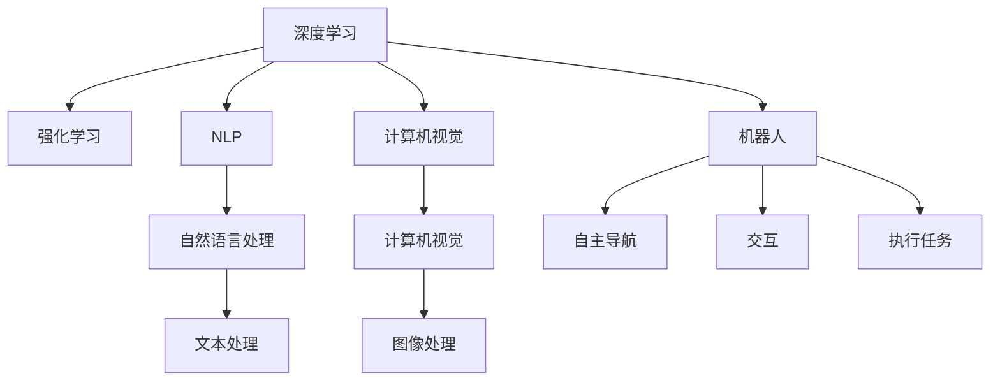

                 

# 李开复：AI 2.0 时代的机遇

> 关键词：AI 2.0, 深度学习, 人工智能, 机器学习, 自然语言处理, 计算机视觉, 机器人

## 1. 背景介绍

人工智能（AI）已经成为21世纪最激动人心的技术之一。自上世纪60年代以来，AI已经经历了几次浪潮，从最初的符号逻辑到专家系统，再到深度学习和人工智能的黄金时代。现在，我们正处在AI 2.0的时代，这是AI技术的下一个阶段，其中深度学习和强化学习是核心。

### 1.1 AI 2.0 的兴起

AI 2.0的兴起是数据科学、计算能力、算法创新、大数据和云计算等多因素共同作用的结果。深度学习的发展尤为突出，它已经成为人工智能的核心。深度学习能够自动提取数据中的特征，并在大量数据上进行训练，从而实现了图像识别、语音识别、自然语言处理等领域的重大突破。

### 1.2 AI 2.0 的应用领域

AI 2.0 已经被广泛应用于医疗、金融、零售、制造业、交通、能源、教育、农业等多个行业。医疗领域中的AI已经能够辅助诊断、药物研发、个性化医疗等；金融领域中的AI可以用于风险管理、自动化交易、欺诈检测等；零售领域中的AI可以用于推荐系统、库存管理、客户服务；制造业中的AI可以用于预测维护、质量控制、供应链优化等。

## 2. 核心概念与联系

### 2.1 核心概念概述

为了更好地理解AI 2.0，我们需要先了解一些关键概念：

- **深度学习（Deep Learning）**：基于多层神经网络，通过反向传播算法进行训练，能够自动提取特征，用于图像、语音、文本等多种数据类型的处理。
- **强化学习（Reinforcement Learning）**：通过试错机制，让智能体在环境中学习如何做出最优决策，适用于机器人、游戏等任务。
- **自然语言处理（NLP）**：使计算机能够理解和生成人类语言，包括文本分类、情感分析、机器翻译等。
- **计算机视觉（Computer Vision）**：使计算机能够识别和理解图像和视频中的内容，如目标检测、人脸识别、图像分割等。
- **机器人（Robotics）**：将AI技术应用到机器人系统中，使其能够自主导航、交互、执行复杂任务。

这些概念之间的联系可以通过以下Mermaid流程图来展示：



## 3. 核心算法原理 & 具体操作步骤

### 3.1 算法原理概述

AI 2.0 的核心算法包括深度学习、强化学习和自然语言处理等。深度学习主要依赖于多层神经网络，通过反向传播算法进行训练。强化学习则通过奖励机制让智能体在环境中学习。自然语言处理则通过语言模型、文本分类、情感分析等技术实现。

### 3.2 算法步骤详解

以深度学习为例，其基本的步骤包括：

1. **数据预处理**：将原始数据进行清洗、归一化、标记等操作，以便进行训练。
2. **模型搭建**：选择合适的神经网络结构，如卷积神经网络（CNN）、循环神经网络（RNN）、长短期记忆网络（LSTM）等。
3. **模型训练**：通过反向传播算法更新模型参数，最小化损失函数。
4. **模型评估**：在测试集上评估模型的性能，如准确率、召回率、F1值等。
5. **模型优化**：根据评估结果，对模型进行优化，如调整超参数、增加训练数据等。

### 3.3 算法优缺点

深度学习的优点包括：

- 能够自动提取特征，减少人工干预。
- 在大数据上训练效果显著，能够处理复杂的数据类型。

但其缺点也显而易见：

- 需要大量的标注数据和计算资源。
- 容易过拟合，需要严格控制超参数。
- 模型复杂，难以解释。

### 3.4 算法应用领域

深度学习在图像识别、语音识别、自然语言处理、机器翻译等众多领域都有广泛应用。在医疗领域，深度学习被用于疾病诊断、医学影像分析等；在金融领域，深度学习被用于信用评估、股票预测等；在交通领域，深度学习被用于交通流量预测、自动驾驶等。

## 4. 数学模型和公式 & 详细讲解 & 举例说明

### 4.1 数学模型构建

以卷积神经网络（CNN）为例，其基本的数学模型包括：

- **输入层**：将原始图像进行像素级别的编码。
- **卷积层**：通过卷积核对图像进行特征提取。
- **池化层**：对特征图进行下采样，减少计算量。
- **全连接层**：将池化层输出的特征进行分类。

### 4.2 公式推导过程

以一个简单的卷积神经网络为例，其基本公式包括：

$$
y = \sum_{i=1}^{n}w_i x_i
$$

其中，$w_i$为卷积核的权重，$x_i$为输入图像的像素值，$y$为输出结果。

### 4.3 案例分析与讲解

以图像分类为例，我们先用一个简单的卷积神经网络进行训练。首先，将原始图像进行像素级别的编码，然后通过卷积核提取特征，接着对特征图进行下采样，最后通过全连接层进行分类。在训练过程中，我们通过反向传播算法更新模型参数，最小化损失函数。

## 5. 项目实践：代码实例和详细解释说明

### 5.1 开发环境搭建

在进行深度学习开发之前，我们需要准备好开发环境。以下是使用Python进行TensorFlow开发的环境配置流程：

1. 安装Anaconda：从官网下载并安装Anaconda，用于创建独立的Python环境。

2. 创建并激活虚拟环境：
```bash
conda create -n tf-env python=3.8 
conda activate tf-env
```

3. 安装TensorFlow：根据CUDA版本，从官网获取对应的安装命令。例如：
```bash
conda install tensorflow==2.6 -c conda-forge
```

4. 安装各类工具包：
```bash
pip install numpy pandas scikit-learn matplotlib tqdm jupyter notebook ipython
```

完成上述步骤后，即可在`tf-env`环境中开始深度学习实践。

### 5.2 源代码详细实现

下面我们以图像分类任务为例，给出使用TensorFlow对卷积神经网络进行训练的Python代码实现。

```python
import tensorflow as tf
from tensorflow.keras import datasets, layers, models

# 加载数据集
(train_images, train_labels), (test_images, test_labels) = datasets.cifar10.load_data()

# 数据预处理
train_images, test_images = train_images / 255.0, test_images / 255.0

# 搭建模型
model = models.Sequential([
    layers.Conv2D(32, (3, 3), activation='relu', input_shape=(32, 32, 3)),
    layers.MaxPooling2D((2, 2)),
    layers.Conv2D(64, (3, 3), activation='relu'),
    layers.MaxPooling2D((2, 2)),
    layers.Conv2D(64, (3, 3), activation='relu'),
    layers.Flatten(),
    layers.Dense(64, activation='relu'),
    layers.Dense(10)
])

# 编译模型
model.compile(optimizer='adam',
              loss=tf.keras.losses.SparseCategoricalCrossentropy(from_logits=True),
              metrics=['accuracy'])

# 训练模型
history = model.fit(train_images, train_labels, epochs=10, 
                    validation_data=(test_images, test_labels))

# 评估模型
test_loss, test_acc = model.evaluate(test_images, test_labels, verbose=2)
print(test_acc)
```

### 5.3 代码解读与分析

让我们再详细解读一下关键代码的实现细节：

**模型搭建**：
- `Sequential`类：用于搭建顺序结构的神经网络。
- `Conv2D`层：卷积层，用于提取图像特征。
- `MaxPooling2D`层：池化层，用于降低计算量。
- `Dense`层：全连接层，用于分类。

**数据预处理**：
- 将像素值归一化到0-1之间，以便模型更好地训练。

**模型编译**：
- `compile`方法：设置优化器、损失函数和评估指标。

**模型训练**：
- `fit`方法：在训练集上训练模型，并验证集上进行验证。

**模型评估**：
- `evaluate`方法：在测试集上评估模型性能。

## 6. 实际应用场景

### 6.1 医疗影像分析

深度学习在医疗影像分析中有着广泛的应用。通过训练深度神经网络，可以从医学影像中自动检测出病变区域，辅助医生进行诊断和治疗。

以肺癌检测为例，我们可以使用卷积神经网络对医学影像进行训练，使其能够自动识别出肺癌病灶。在实际应用中，将病人CT影像输入模型，输出病灶区域的位置和大小，即可辅助医生进行诊断。

### 6.2 金融欺诈检测

在金融领域，深度学习被用于欺诈检测。通过训练神经网络，可以从交易数据中自动识别出异常交易，及时发现和防范欺诈行为。

以信用卡交易为例，我们可以使用循环神经网络对交易数据进行建模，并设置异常阈值，当交易金额超过阈值时，自动标记为异常交易。在实际应用中，将信用卡交易数据输入模型，输出异常标记，即可辅助银行进行欺诈检测。

### 6.3 自动驾驶

深度学习在自动驾驶中也有着重要的应用。通过训练神经网络，可以从摄像头和雷达数据中自动识别出道路和车辆，进行自主导航。

以自动驾驶车辆为例，我们可以使用卷积神经网络对摄像头和雷达数据进行训练，并设置决策规则，当检测到道路和车辆时，自动进行避障和导航。在实际应用中，将车辆传感器数据输入模型，输出导航指令，即可辅助车辆进行自动驾驶。

## 7. 工具和资源推荐

### 7.1 学习资源推荐

为了帮助开发者系统掌握深度学习的应用，这里推荐一些优质的学习资源：

1. 《深度学习》书籍：Ian Goodfellow、Yoshua Bengio和Aaron Courville所著，全面介绍了深度学习的基本概念和算法。
2. 《Python深度学习》书籍：Francois Chollet所著，详细讲解了使用Keras进行深度学习的实践方法。
3. TensorFlow官方文档：TensorFlow的官方文档，提供了大量的样例和教程，是深度学习开发的好帮手。
4. PyTorch官方文档：PyTorch的官方文档，提供了丰富的学习资源和工具。
5. Coursera深度学习课程：由Andrew Ng教授主讲，系统介绍了深度学习的基本概念和算法。

通过对这些资源的学习实践，相信你一定能够快速掌握深度学习的应用。

### 7.2 开发工具推荐

高效的深度学习开发离不开优秀的工具支持。以下是几款用于深度学习开发的常用工具：

1. TensorFlow：由Google主导开发的开源深度学习框架，生产部署方便，适合大规模工程应用。
2. PyTorch：基于Python的开源深度学习框架，灵活动态的计算图，适合快速迭代研究。
3. Keras：一个高级神经网络API，提供简单易用的接口，适合初学者入门。
4. Jupyter Notebook：一个交互式的开发环境，支持Python、R等多种语言。
5. Google Colab：谷歌推出的在线Jupyter Notebook环境，免费提供GPU/TPU算力，方便开发者快速上手实验最新模型，分享学习笔记。

合理利用这些工具，可以显著提升深度学习开发的效率，加快创新迭代的步伐。

### 7.3 相关论文推荐

深度学习的发展源于学界的持续研究。以下是几篇奠基性的相关论文，推荐阅读：

1. AlexNet：提出卷积神经网络，在ImageNet图像分类比赛中获得优异成绩。
2. ResNet：提出残差网络，缓解了深度神经网络的退化问题，使得更深的网络能够训练。
3. InceptionNet：提出Inception模块，提高了深度神经网络的计算效率。
4. Transformer：提出自注意力机制，实现了自然语言处理任务的突破。
5. YOLO：提出单阶段目标检测方法，实现了实时性和准确性的提升。

这些论文代表了大深度学习的发展脉络。通过学习这些前沿成果，可以帮助研究者把握学科前进方向，激发更多的创新灵感。

## 8. 总结：未来发展趋势与挑战

### 8.1 总结

本文对AI 2.0时代的技术进行了全面系统的介绍。首先阐述了AI 2.0的兴起，明确了深度学习、强化学习和自然语言处理等技术的应用。其次，从原理到实践，详细讲解了深度学习的数学模型和操作步骤，给出了深度学习任务开发的完整代码实例。同时，本文还广泛探讨了深度学习在医疗、金融、自动驾驶等多个行业领域的应用前景，展示了深度学习范式的巨大潜力。此外，本文精选了深度学习的各类学习资源，力求为读者提供全方位的技术指引。

通过本文的系统梳理，可以看到，深度学习在AI 2.0时代已经占据核心地位，极大地拓展了人工智能的应用边界，催生了更多的落地场景。随着深度学习模型的不断发展，未来将有更多的领域受益于深度学习技术的赋能，为人工智能技术在各行业的深入应用提供新的推动力。

### 8.2 未来发展趋势

展望未来，深度学习技术将呈现以下几个发展趋势：

1. 模型规模持续增大。随着算力成本的下降和数据规模的扩张，深度学习模型的参数量还将持续增长。超大规模深度学习模型蕴含的丰富知识，有望支撑更加复杂多变的下游任务。
2. 迁移学习成为常态。深度学习模型可以在不同任务之间迁移，通过微调或迁移学习快速适应新任务。
3. 自监督学习兴起。自监督学习可以通过无标签数据进行预训练，提升模型的泛化能力和鲁棒性。
4. 多模态学习崛起。深度学习模型可以融合视觉、语音、文本等多种模态数据，提升模型的综合能力和应用范围。
5. 弱监督学习和半监督学习成为重要方向。深度学习模型可以通过少量有标签数据和大量无标签数据进行训练，提升模型的鲁棒性和泛化能力。

以上趋势凸显了深度学习技术的广阔前景。这些方向的探索发展，必将进一步提升深度学习系统的性能和应用范围，为人工智能技术在各行业的深入应用提供新的推动力。

### 8.3 面临的挑战

尽管深度学习技术已经取得了瞩目成就，但在迈向更加智能化、普适化应用的过程中，它仍面临着诸多挑战：

1. 数据依赖。深度学习模型需要大量标注数据进行训练，对于长尾应用场景，难以获得充足的高质量标注数据。
2. 计算资源需求高。深度学习模型训练和推理需要大量计算资源，对于小规模企业，难以负担高昂的成本。
3. 过拟合问题。深度学习模型容易过拟合，需要严格控制超参数，调整模型结构。
4. 模型可解释性不足。深度学习模型通常缺乏可解释性，难以解释其内部工作机制和决策逻辑。
5. 伦理和安全问题。深度学习模型容易学习到有偏见、有害的信息，传递到下游任务，产生误导性、歧视性的输出，给实际应用带来安全隐患。

尽管存在这些挑战，但深度学习技术仍具有广阔的应用前景。未来需要在数据、算法、工程、伦理等多个方面进行全面优化，才能将深度学习技术推向新的高度。

### 8.4 研究展望

面对深度学习面临的挑战，未来的研究需要在以下几个方面寻求新的突破：

1. 探索无监督和半监督深度学习算法。摆脱对大量标注数据的依赖，利用自监督学习、主动学习等无监督和半监督算法，最大限度利用非结构化数据，实现更加灵活高效的训练。
2. 研究参数高效和计算高效的深度学习范式。开发更加参数高效和计算高效的深度学习模型，在固定大部分预训练参数的情况下，只更新极少量的任务相关参数。
3. 融合因果学习和强化学习。引入因果推理机制，增强深度学习模型的可解释性和鲁棒性，提高模型的决策能力。
4. 引入更多先验知识。将符号化的先验知识，如知识图谱、逻辑规则等，与深度学习模型进行巧妙融合，引导模型学习更准确、合理的知识表征。
5. 研究模型架构和优化算法。开发更加高效、稳定的深度学习模型架构和优化算法，提高模型的训练效率和泛化能力。
6. 纳入伦理道德约束。在深度学习模型训练目标中引入伦理导向的评估指标，过滤和惩罚有偏见、有害的输出倾向，确保模型的安全性和公平性。

这些研究方向的探索，必将引领深度学习技术迈向更高的台阶，为构建安全、可靠、可解释、可控的智能系统铺平道路。面向未来，深度学习技术还需要与其他人工智能技术进行更深入的融合，如知识表示、因果推理、强化学习等，多路径协同发力，共同推动人工智能技术在各行业的深入应用。只有勇于创新、敢于突破，才能不断拓展深度学习技术的边界，让智能技术更好地造福人类社会。

## 9. 附录：常见问题与解答

**Q1：深度学习是否适用于所有NLP任务？**

A: 深度学习在NLP领域有广泛的应用，特别是对于数据量较大的任务，如文本分类、情感分析、机器翻译等。但对于一些特定领域的任务，如法律、医学等，仅仅依靠通用语料预训练的模型可能难以很好地适应。此时需要在特定领域语料上进一步预训练，再进行微调，才能获得理想效果。

**Q2：深度学习模型的训练时间是否很长？**

A: 深度学习模型通常需要大量时间和计算资源进行训练。但是，随着硬件设备的发展，深度学习模型的训练速度也在不断提升。此外，通过分布式训练、模型剪枝等优化技术，可以显著缩短训练时间。

**Q3：深度学习模型是否容易出现过拟合？**

A: 深度学习模型容易过拟合，特别是在数据量较少的情况下。为缓解过拟合，可以采用正则化技术、数据增强、迁移学习等方法。

**Q4：深度学习模型的输出是否可解释？**

A: 深度学习模型通常缺乏可解释性，难以解释其内部工作机制和决策逻辑。为了提高可解释性，可以引入符号化的先验知识，如知识图谱、逻辑规则等，与深度学习模型进行融合。

**Q5：深度学习模型是否面临伦理和安全问题？**

A: 深度学习模型容易学习到有偏见、有害的信息，传递到下游任务，产生误导性、歧视性的输出，给实际应用带来安全隐患。因此，在深度学习模型的训练目标中引入伦理导向的评估指标，过滤和惩罚有偏见、有害的输出倾向，确保模型的安全性和公平性。

---

作者：禅与计算机程序设计艺术 / Zen and the Art of Computer Programming

