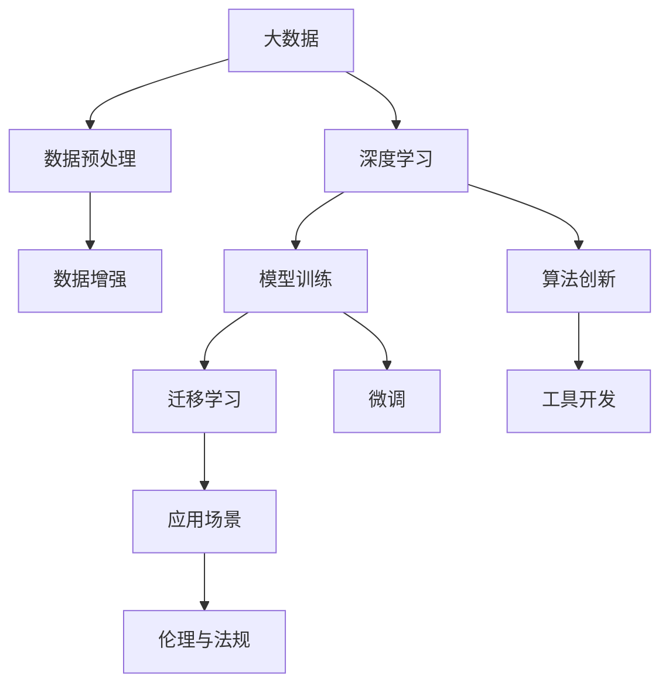

                 

# 李开复：AI 2.0 时代的生态

> 关键词：AI 2.0, 生态系统, 人工智能, 大数据, 深度学习, 技术创新, 应用场景, 伦理道德, 未来展望

## 1. 背景介绍

### 1.1 问题由来

当前，我们正处于人工智能发展的分水岭时刻：AI 1.0 向 AI 2.0 的跨越。AI 1.0 以算法、数据和计算为中心，注重于提升计算效率和算法准确性，更多关注算法和系统的性能提升。而 AI 2.0 则注重于数据的获取和处理，强调对人类行为、社会现象的理解，以及如何利用这些理解来解决实际问题。AI 2.0 时代的核心是数据和模型，而非仅仅算法和计算。

AI 2.0 时代的大数据量、高维度和多模态特征给传统的数据处理技术带来了巨大的挑战。如何高效地处理和利用这些数据，并构建起强大的智能模型，成为当前人工智能领域的热点问题。AI 2.0 时代需要一种全新的生态系统来支撑其发展，这既包括技术架构，也包括伦理、法律、社会等方面的综合考量。

### 1.2 问题核心关键点

AI 2.0 时代的生态系统构建，需要从以下几个方面着手：

- **数据采集与管理**：如何高效、安全地采集和处理大规模数据，构建高质量的数据集。
- **模型训练与优化**：如何构建高效、鲁棒的深度学习模型，并通过迁移学习、微调等手段优化模型性能。
- **算法创新与工具**：如何通过算法创新和工具开发，加速模型的训练和优化，提升智能系统的实用性。
- **应用场景探索**：如何在实际应用中充分发挥 AI 模型的潜力，解决实际问题。
- **伦理与社会影响**：如何在智能系统开发和使用中，考虑到伦理道德、隐私保护等问题，确保技术的健康发展。

## 2. 核心概念与联系

### 2.1 核心概念概述

要理解 AI 2.0 时代的生态系统，首先需要了解几个核心概念：

- **大数据**：指海量的、复杂的数据集合，通常用于构建 AI 模型的训练集。大数据不仅包括结构化数据，还包括非结构化数据，如文本、图像、视频等。
- **深度学习**：一种基于多层神经网络的机器学习算法，能够通过大量数据自动提取特征，并建立复杂模型，广泛应用于图像识别、自然语言处理等领域。
- **迁移学习**：一种通过在不同任务之间迁移知识，提升新任务性能的学习方法。与从头训练相比，迁移学习可以大大减少训练时间，提升模型效果。
- **微调**：一种基于现有模型，针对特定任务进行细粒度优化的技术，如通过调整模型的最后几层，以适应新的任务需求。
- **AI 生态系统**：指 AI 技术在各个领域的应用、服务、工具、标准和法规等构成的综合体系，涵盖技术研发、应用落地、伦理法规等各个方面。

### 2.2 核心概念原理和架构的 Mermaid 流程图



## 3. 核心算法原理 & 具体操作步骤

### 3.1 算法原理概述

AI 2.0 时代的算法原理主要基于深度学习，其核心思想是通过多层神经网络对大量数据进行学习，自动提取数据中的特征，并通过反向传播算法不断优化模型参数，从而实现对复杂问题的理解和预测。

深度学习算法主要包括卷积神经网络(CNN)、循环神经网络(RNN)、长短时记忆网络(LSTM)、生成对抗网络(GAN)等。这些算法在图像识别、语音识别、自然语言处理等领域取得了巨大的成功。

### 3.2 算法步骤详解

AI 2.0 时代的算法步骤大致包括以下几个环节：

1. **数据采集与预处理**：从各种来源获取原始数据，并对数据进行清洗、标注、归一化等预处理操作。
2. **特征提取**：利用深度学习模型自动提取数据中的特征。
3. **模型训练**：通过反向传播算法，利用标注数据对模型进行训练，调整模型参数。
4. **迁移学习**：在已有模型基础上，通过微调或添加新层等方式，对新任务进行优化。
5. **模型评估与优化**：在验证集和测试集上评估模型性能，并根据性能调整模型参数或架构。

### 3.3 算法优缺点

深度学习算法的优点在于其强大的表达能力和泛化能力，能够处理复杂的多模态数据，实现高精度的预测和分类。同时，深度学习算法可以利用迁移学习，减少新任务的学习时间，提升模型效果。

然而，深度学习算法也存在一些缺点：

- **计算资源需求高**：深度学习模型通常需要大量的计算资源进行训练和推理。
- **过拟合风险高**：由于模型参数较多，容易过拟合训练集。
- **可解释性差**：深度学习模型通常是"黑盒"系统，难以解释其决策过程。

### 3.4 算法应用领域

深度学习算法已经在多个领域取得了广泛应用，包括计算机视觉、自然语言处理、语音识别、机器人控制等。

- **计算机视觉**：如图像分类、物体检测、人脸识别等任务。
- **自然语言处理**：如机器翻译、文本生成、情感分析等任务。
- **语音识别**：如语音转文本、语音合成、语音情感识别等任务。
- **机器人控制**：如机器人导航、物体抓取、人机交互等任务。

## 4. 数学模型和公式 & 详细讲解 & 举例说明

### 4.1 数学模型构建

深度学习模型的数学基础是神经网络，其核心是多层神经元的连接和权重。以卷积神经网络为例，其结构可以表示为：

$$
\text{CNN} = \left\{ (\text{Conv}, \text{Relu}, \text{Pooling}, \text{Flatten}), \ldots, (\text{Linear}, \text{Softmax}) \right\}
$$

其中，Conv 表示卷积层，Relu 表示激活函数，Pooling 表示池化层，Flatten 表示展平层，Linear 表示全连接层，Softmax 表示分类层。

### 4.2 公式推导过程

以卷积神经网络的损失函数为例，假设输入为 $x$，模型输出为 $y$，真实标签为 $t$，则交叉熵损失函数为：

$$
\mathcal{L}(y, t) = -\frac{1}{N}\sum_{i=1}^N t_i \log y_i
$$

其中 $N$ 为样本数。在训练过程中，通过反向传播算法，利用梯度下降法不断更新模型参数 $w$，使得损失函数 $\mathcal{L}$ 最小化。

### 4.3 案例分析与讲解

以图像分类为例，假设有一组训练数据集 $\{(x_i, t_i)\}$，其中 $x_i$ 为输入图像，$t_i$ 为标签。通过卷积神经网络训练模型 $M$，可以得到模型的预测标签 $y_i = M(x_i)$。然后通过交叉熵损失函数计算损失，并利用梯度下降法优化模型参数。

## 5. 项目实践：代码实例和详细解释说明

### 5.1 开发环境搭建

AI 2.0 时代的项目实践，通常需要以下开发环境：

- **编程语言**：Python、C++、Java 等。
- **深度学习框架**：TensorFlow、PyTorch、Keras 等。
- **数据处理工具**：Pandas、NumPy、Scikit-learn 等。
- **模型部署工具**：TorchServe、TensorFlow Serving 等。

### 5.2 源代码详细实现

以卷积神经网络为例，使用 PyTorch 框架的代码实现如下：

```python
import torch
import torch.nn as nn
import torch.optim as optim

# 定义卷积神经网络
class CNN(nn.Module):
    def __init__(self):
        super(CNN, self).__init__()
        self.conv1 = nn.Conv2d(3, 64, kernel_size=3, stride=1, padding=1)
        self.relu = nn.ReLU()
        self.pool = nn.MaxPool2d(kernel_size=2, stride=2)
        self.fc1 = nn.Linear(64*28*28, 128)
        self.fc2 = nn.Linear(128, 10)

    def forward(self, x):
        x = self.conv1(x)
        x = self.relu(x)
        x = self.pool(x)
        x = x.view(-1, 64*28*28)
        x = self.fc1(x)
        x = self.relu(x)
        x = self.fc2(x)
        return x

# 加载数据集
train_data = ...
train_labels = ...
test_data = ...
test_labels = ...

# 构建模型
model = CNN()
criterion = nn.CrossEntropyLoss()
optimizer = optim.SGD(model.parameters(), lr=0.001, momentum=0.9)

# 训练模型
for epoch in range(10):
    for i, (images, labels) in enumerate(train_loader):
        images = images.view(-1, 3, 28, 28)
        optimizer.zero_grad()
        outputs = model(images)
        loss = criterion(outputs, labels)
        loss.backward()
        optimizer.step()
```

### 5.3 代码解读与分析

上述代码实现了卷积神经网络的训练过程。首先定义了网络结构，然后加载数据集，构建模型，并定义损失函数和优化器。在每个 epoch 中，遍历训练集数据，通过前向传播计算输出，并利用反向传播计算梯度，更新模型参数。

## 6. 实际应用场景

### 6.1 智能推荐系统

AI 2.0 时代的智能推荐系统，通过深度学习模型分析用户行为数据，构建用户画像，并推荐符合用户兴趣的商品或内容。例如，Amazon、Netflix 等电商和视频网站，利用推荐系统提升用户体验，增加用户粘性。

### 6.2 医疗影像诊断

AI 2.0 时代的医疗影像诊断系统，通过深度学习模型自动分析医疗影像数据，辅助医生诊断疾病。例如，Google Health 的 DeepMind 团队开发的 AI 系统，可以检测乳腺癌、眼科疾病等疾病。

### 6.3 自动驾驶

AI 2.0 时代的自动驾驶系统，通过深度学习模型实时分析道路环境和交通状况，辅助驾驶员驾驶车辆。例如，Waymo、Tesla 等公司正在开发自动驾驶技术，以提升驾驶安全性和舒适性。

### 6.4 未来应用展望

随着 AI 2.0 技术的发展，未来将出现更多智能应用场景：

- **智能城市**：通过深度学习模型分析城市交通、环境数据，优化城市管理和公共服务。
- **智能制造**：通过深度学习模型优化生产流程和质量控制，提升制造业效率和产品品质。
- **智能金融**：通过深度学习模型分析金融市场数据，辅助投资决策和风险控制。
- **智能物流**：通过深度学习模型优化物流路线和库存管理，提升物流效率和客户满意度。

## 7. 工具和资源推荐

### 7.1 学习资源推荐

以下是一些优质的 AI 2.0 学习资源：

- **《深度学习》(Deep Learning) by Ian Goodfellow**：介绍深度学习模型的基本原理和实践，是入门深度学习的首选书籍。
- **《Python 深度学习》(Deep Learning with Python) by François Chollet**：介绍如何使用 Keras 深度学习框架进行模型开发和训练，适合初学者使用。
- **《TensorFlow 官方文档》**：提供 TensorFlow 深度学习框架的详细文档和教程，是 TensorFlow 学习者的必备资源。
- **《PyTorch 官方文档》**：提供 PyTorch 深度学习框架的详细文档和教程，是 PyTorch 学习者的必备资源。
- **Coursera AI 课程**：提供由深度学习领域的专家讲授的 AI 课程，涵盖深度学习、计算机视觉、自然语言处理等多个领域。

### 7.2 开发工具推荐

以下是一些常用的 AI 2.0 开发工具：

- **TensorFlow**：由 Google 开发的深度学习框架，支持分布式计算和模型部署。
- **PyTorch**：由 Facebook 开发的深度学习框架，灵活性好，易于使用。
- **Keras**：基于 TensorFlow 和 Theano 的高级深度学习框架，简单易用。
- **TensorBoard**：由 Google 开发的可视化工具，用于监控模型训练过程。
- **Weights & Biases**：用于模型训练的实验跟踪工具，记录和可视化模型训练过程中的各项指标。

### 7.3 相关论文推荐

以下是一些 AI 2.0 领域的经典论文：

- **ImageNet Classification with Deep Convolutional Neural Networks**：提出卷积神经网络，并在 ImageNet 数据集上取得了突破性成果。
- **Attention is All You Need**：提出 Transformer 模型，改变了深度学习模型的架构和训练方式。
- **AlphaGo Zero**：利用深度强化学习算法，构建了可以自主学习的 AlphaGo 系统，取得了围棋领域的突破性成果。
- **BERT: Pre-training of Deep Bidirectional Transformers for Language Understanding**：提出 BERT 模型，实现了大规模预训练和微调，刷新了多项自然语言处理任务的 SOTA。

## 8. 总结：未来发展趋势与挑战

### 8.1 研究成果总结

AI 2.0 时代的生态系统构建，需要从数据、模型、算法、工具等多个方面协同推进。经过多年的发展，AI 2.0 技术已经取得了显著进展，广泛应用于多个领域。然而，AI 2.0 技术的发展也面临着诸多挑战，如计算资源需求高、模型可解释性差、伦理道德问题等。

### 8.2 未来发展趋势

AI 2.0 时代的未来发展趋势如下：

- **技术融合**：AI 2.0 技术与物联网、区块链、边缘计算等技术深度融合，推动智能化系统的应用。
- **行业应用**：AI 2.0 技术在智能制造、智能金融、智能城市等领域的深度应用，将带来巨大的经济效益和社会效益。
- **数据共享**：构建数据共享平台，促进跨领域、跨行业的合作，提升数据利用效率。
- **伦理道德**：建立 AI 伦理和法规体系，确保 AI 技术的发展符合伦理道德标准。

### 8.3 面临的挑战

AI 2.0 技术的发展也面临着诸多挑战：

- **计算资源瓶颈**：AI 2.0 技术需要大量的计算资源进行模型训练和推理，如何优化资源利用，降低成本，是一个重要的研究方向。
- **模型可解释性**：AI 2.0 模型通常是"黑盒"系统，难以解释其决策过程，如何提升模型的可解释性，是一个亟待解决的问题。
- **伦理道德**：AI 2.0 技术的应用可能涉及隐私、安全等伦理道德问题，如何确保技术的健康发展，是一个重要的课题。
- **数据隐私保护**：如何保护用户隐私，避免数据滥用，是一个需要关注的问题。

### 8.4 研究展望

未来 AI 2.0 技术的研究展望如下：

- **多模态学习**：构建多模态学习模型，融合视觉、语音、文本等多种数据，提升智能系统的泛化能力和表现。
- **自监督学习**：利用无监督学习技术，在缺少标注数据的情况下，训练高质量的 AI 模型。
- **小样本学习**：通过小样本学习技术，在少量标注数据下，实现高效的模型训练和性能提升。
- **联邦学习**：通过分布式学习技术，保护用户隐私，提升模型性能。

## 9. 附录：常见问题与解答

### Q1: AI 2.0 与 AI 1.0 的区别是什么？

A: AI 1.0 以算法、数据和计算为中心，注重于提升计算效率和算法准确性，更多关注算法和系统的性能提升。而 AI 2.0 则注重于数据的获取和处理，强调对人类行为、社会现象的理解，以及如何利用这些理解来解决实际问题。

### Q2: 为什么 AI 2.0 需要大规模数据？

A: AI 2.0 技术依赖于深度学习模型，而深度学习模型需要大量的数据进行训练，以学习数据的复杂结构和模式。大规模数据能够提升模型的泛化能力和表现。

### Q3: 如何优化 AI 2.0 模型的计算资源需求？

A: 可以采用分布式训练、模型剪枝、量化压缩等方法，优化模型的计算资源需求，提高模型的推理速度和效率。

### Q4: 如何提升 AI 2.0 模型的可解释性？

A: 可以引入可解释性技术，如 SHAP、LIME 等，对模型进行解释和可视化，提升模型的可解释性。

### Q5: AI 2.0 技术的应用有哪些？

A: AI 2.0 技术广泛应用于智能推荐、医疗影像诊断、自动驾驶、智能城市等多个领域，推动智能系统的应用和发展。

作者：禅与计算机程序设计艺术 / Zen and the Art of Computer Programming

