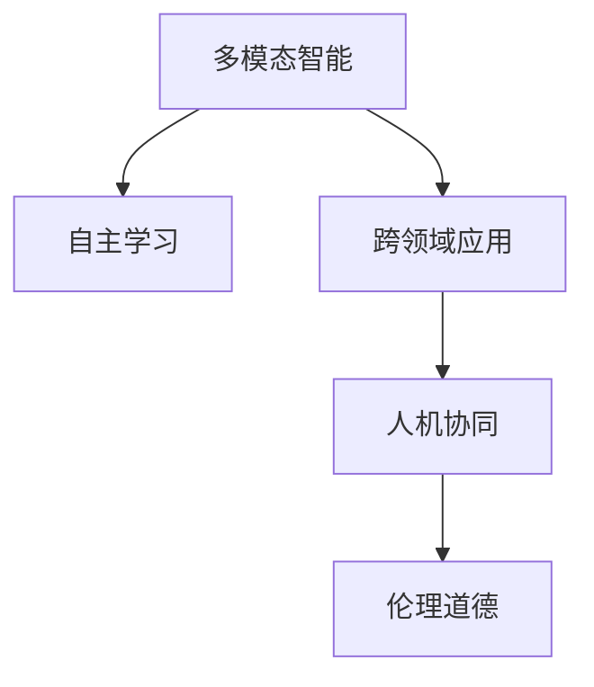
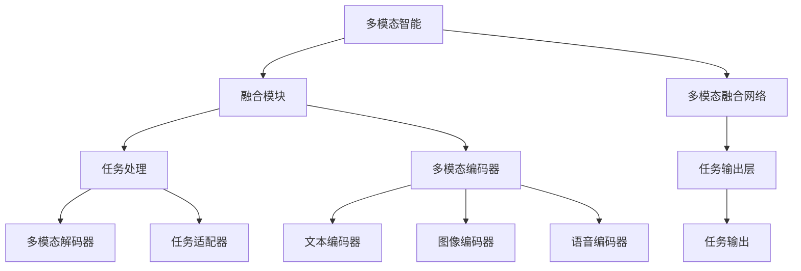

                 

# 李开复：AI 2.0 时代的趋势

## 1. 背景介绍

随着人工智能(AI)技术的飞速发展，我们已经迎来了AI 2.0时代。这是一个全新的阶段，AI不再局限于特定任务，而是能够理解和执行复杂的多模态任务，具备了更高层次的认知智能。李开复作为全球AI领域的权威人物，对AI 2.0时代的趋势有着深刻的见解。本文将基于李开复的演讲和文章，对AI 2.0时代的核心概念、关键技术、应用场景和未来展望进行全面系统的介绍。

### 1.1 问题由来

AI 1.0时代，AI主要集中在特定任务上，如语音识别、图像识别、自然语言处理等，依赖大量人工标注数据进行监督学习。而AI 2.0时代，AI具备了更高的自主性和泛化能力，能够在多种任务上实现跨领域、跨模态的智能。这种转变不仅带来了技术上的突破，也深刻影响了各行各业的业务模式和运营效率。

### 1.2 问题核心关键点

AI 2.0时代的核心关键点包括：
1. 多模态智能：AI能够处理和理解多维数据，如文本、图像、语音等，实现多模态信息的融合和利用。
2. 自主学习：AI能够主动学习新知识，无需人工干预，具备了自监督学习和强化学习的能力。
3. 跨领域应用：AI能够从一个大规模语料库中学习通用的知识表示，用于多种领域任务的迁移学习。
4. 人机协同：AI与人类协作，提升工作效率和决策质量，支持复杂任务和创新应用。
5. 伦理道德：AI在应用过程中需要考虑伦理道德，确保技术的安全性、透明性和公平性。

这些关键点共同构成了AI 2.0时代的核心特征，使得AI技术在多个领域产生了深远的影响。

### 1.3 问题研究意义

研究AI 2.0时代的趋势，对理解未来AI技术的演进方向、行业应用前景和潜在风险具有重要意义：

1. 技术升级：AI 2.0技术不仅提升了AI的自主性和泛化能力，还为AI在各领域的深度应用提供了可能。
2. 产业融合：AI 2.0技术与其他技术融合，如物联网、区块链、5G等，推动了产业创新和转型升级。
3. 社会进步：AI 2.0技术助力教育、医疗、金融等行业提升服务质量，促进社会公平和可持续发展。
4. 伦理规范：AI 2.0技术需要制定合理的伦理规范，确保技术应用的透明性和公平性。
5. 安全保障：AI 2.0技术在数据隐私、算法透明性、模型安全等方面提出了新的挑战，需要多角度的保障措施。

通过深入研究AI 2.0时代的趋势，可以更好地把握技术发展方向，制定科学合理的应用策略，促进AI技术的健康发展。

## 2. 核心概念与联系

### 2.1 核心概念概述

AI 2.0时代，核心概念包括多模态智能、自主学习、跨领域应用、人机协同、伦理道德等。这些概念之间的关系如下图所示：



多模态智能是AI 2.0技术的核心基础，通过融合文本、图像、语音等多种模态信息，AI能够更好地理解和生成复杂的任务。自主学习是AI 2.0技术的关键能力，使得AI能够在无监督或弱监督的环境下自主学习，提升泛化能力。跨领域应用将AI技术从特定任务扩展到更多领域，实现技术的广泛应用和创新。人机协同将AI与人类有机结合，提升工作效率和决策质量。伦理道德是AI 2.0技术的社会责任，确保技术应用的透明性和公平性。

这些概念相互作用，共同推动了AI 2.0技术的不断进步和应用。

### 2.2 核心概念原理和架构的 Mermaid 流程图



多模态智能的核心在于多模态融合网络。该网络将文本、图像、语音等多种模态信息进行编码，并输入到任务适配器中，最终输出到任务输出层，生成特定任务的输出。其中，多模态编码器负责将各种模态信息转换为统一的向量表示，多模态解码器则负责将向量表示解码为特定任务的数据格式。这种架构设计，使得AI能够高效地处理和理解多模态信息，实现跨模态的智能任务。

## 3. 核心算法原理 & 具体操作步骤

### 3.1 算法原理概述

AI 2.0时代的核心算法包括多模态融合、自监督学习、跨领域迁移学习等。这些算法共同构成了AI 2.0技术的核心。

- 多模态融合：通过融合文本、图像、语音等多种模态信息，提升AI对复杂任务的理解和生成能力。
- 自监督学习：利用无监督或弱监督的数据进行自主学习，提升模型的泛化能力。
- 跨领域迁移学习：在一种领域上训练的模型，可以迁移到其他领域进行任务适配，提升模型的通用性。

这些算法共同实现了AI 2.0技术的突破，使其在多模态智能、自主学习、跨领域应用等方面具备了强大的能力。

### 3.2 算法步骤详解

AI 2.0技术的开发流程主要包括数据准备、模型训练、模型微调和应用部署四个步骤：

**Step 1: 数据准备**

数据准备是AI 2.0技术开发的基础。需要收集和标注多种模态的数据，如文本、图像、语音等，建立大规模的语料库。数据标注需要保证多样性和代表性，涵盖不同领域、不同模态的任务。

**Step 2: 模型训练**

在收集好数据后，选择合适的预训练模型进行训练。预训练模型可以采用多模态自监督学习或监督学习的方法，如BERT、GPT等。通过预训练模型，AI能够学习到通用的知识表示。

**Step 3: 模型微调**

在预训练模型基础上，选择下游任务，进行微调。微调过程中，需要选择合适的损失函数和优化器，并设置合适的学习率。同时，需要采用正则化技术，如L2正则、Dropout等，避免过拟合。微调过程中，可以采用参数高效微调、对抗训练等技术，提升微调效果。

**Step 4: 应用部署**

微调后的模型需要进行应用部署。可以将模型封装为API或服务，供其他应用系统调用。同时，需要确保模型的实时性和可靠性，采用分布式部署、缓存机制等技术提升性能。

### 3.3 算法优缺点

AI 2.0技术的优点包括：

1. 多模态智能：AI 2.0技术能够处理多种模态信息，实现多模态智能。
2. 自主学习能力：AI 2.0技术具有自主学习的能力，能够从大规模语料库中学习通用知识表示。
3. 泛化能力：AI 2.0技术具有较强的泛化能力，能够在多种领域和任务中应用。
4. 人机协同：AI 2.0技术能够与人类协作，提升工作效率和决策质量。

但AI 2.0技术也存在一些缺点：

1. 数据依赖：AI 2.0技术依赖大规模语料库，对数据量和质量的要求较高。
2. 计算成本：AI 2.0技术需要大量的计算资源进行训练和微调，成本较高。
3. 伦理道德：AI 2.0技术在应用过程中需要考虑伦理道德，确保技术应用的透明性和公平性。
4. 可解释性：AI 2.0技术缺乏可解释性，难以理解模型的内部工作机制。

### 3.4 算法应用领域

AI 2.0技术已经在多个领域得到了广泛应用，包括但不限于：

1. 医疗健康：AI 2.0技术用于辅助诊断、药物研发、健康管理等，提升医疗服务水平。
2. 金融行业：AI 2.0技术用于风险评估、投资决策、客户服务等，提升金融服务的智能化水平。
3. 教育领域：AI 2.0技术用于个性化教育、智能评估、知识图谱等，提升教育质量和效率。
4. 自动驾驶：AI 2.0技术用于图像识别、语音交互、路径规划等，提升自动驾驶的安全性和智能化水平。
5. 智能家居：AI 2.0技术用于环境感知、智能控制、人机交互等，提升家居生活的便利性和舒适性。
6. 安防监控：AI 2.0技术用于图像识别、行为分析、异常检测等，提升安防监控的智能化水平。

这些应用场景展示了AI 2.0技术的强大能力和广泛应用前景。

## 4. 数学模型和公式 & 详细讲解 & 举例说明

### 4.1 数学模型构建

AI 2.0技术的数学模型主要包括自监督学习、多模态融合和跨领域迁移学习。这里以自监督学习和多模态融合为例，介绍数学模型的构建方法。

**自监督学习模型**

自监督学习模型通过利用数据中未标注的信息进行自主学习。以BERT模型为例，其自监督学习任务包括掩码语言模型(Masked Language Modeling, MLM)和下一句预测(Next Sentence Prediction, NSP)。

MLM任务的目标是预测被遮盖的词，即给定一个句子中的一些词被随机遮盖，模型需要预测这些遮盖词的正确位置和内容。

NSP任务的目标是判断两个句子是否是连续的，即给定两个句子，判断它们是否是一段连续的文本。

这些任务通过最大化掩码语言模型和下一句预测任务的预测概率，从而学习到通用的语言表示。

**多模态融合模型**

多模态融合模型的目标是将不同模态的信息进行融合，提升AI对复杂任务的理解和生成能力。以多模态融合网络为例，其模型结构如下：

$$
H_{text} = \text{TextEncoder}(x_{text})
$$
$$
H_{image} = \text{ImageEncoder}(x_{image})
$$
$$
H_{audio} = \text{AudioEncoder}(x_{audio})
$$
$$
f_{text2vec} = \text{Text2Vec}(H_{text})
$$
$$
f_{image2vec} = \text{Image2Vec}(H_{image})
$$
$$
f_{audio2vec} = \text{Audio2Vec}(H_{audio})
$$
$$
H_{fusion} = \text{MultiModalFusion}(f_{text2vec}, f_{image2vec}, f_{audio2vec})
$$
$$
y = \text{TaskOutput}(H_{fusion})
$$

其中，$x_{text}$、$x_{image}$、$x_{audio}$分别表示文本、图像、语音数据。TextEncoder、ImageEncoder、AudioEncoder分别表示多模态编码器，将不同模态的数据转换为向量表示。Text2Vec、Image2Vec、Audio2Vec分别表示多模态解码器，将向量表示解码为特定任务的数据格式。MultiModalFusion表示多模态融合模块，将不同模态的向量表示进行融合。TaskOutput表示特定任务的输出层，生成最终的输出结果。

### 4.2 公式推导过程

**自监督学习模型**

以BERT模型的掩码语言模型为例，其预测目标函数为：

$$
L_{MLM} = -\frac{1}{N}\sum_{i=1}^N \sum_{j=1}^{2L} \log P(w_{i,j}|w_{1:i-1}, \tilde{w}_{i,j}, w_{i+1:2L})
$$

其中，$w_{1:2L}$表示一个长度为$L$的句子，$\tilde{w}_{i,j}$表示被遮盖的词，$P(w_{i,j}|w_{1:i-1}, \tilde{w}_{i,j}, w_{i+1:2L})$表示在上下文中预测词$w_{i,j}$的概率。

**多模态融合模型**

以多模态融合网络为例，其融合模块的输入为不同模态的向量表示，输出为融合后的向量表示。这里以Gated Fusion为例，其融合函数为：

$$
H_{fusion} = \text{Softmax}(\alpha H_{text} + (1-\alpha) H_{image} + \beta H_{audio})
$$

其中，$\alpha$、$\beta$为融合系数，$H_{text}$、$H_{image}$、$H_{audio}$分别表示文本、图像、语音的向量表示，Softmax表示归一化指数函数，使得不同模态的权重和为1。

### 4.3 案例分析与讲解

以多模态智能技术在智能安防中的应用为例，介绍其实现过程和效果。

**应用场景**

智能安防系统需要对监控视频进行实时分析，检测异常行为和事件。传统的视频监控系统需要大量人工进行手动审核，效率低、成本高。而多模态智能技术能够将图像、音频等多种信息进行融合，实现实时异常检测。

**实现过程**

1. 数据准备：收集监控视频、音频数据，标注异常行为标签。
2. 模型训练：选择合适模型进行预训练，如BERT、ResNet等。在预训练模型的基础上，选择多模态融合网络进行微调，训练异常检测模型。
3. 模型部署：将微调后的模型部署到安防监控系统中，进行实时异常检测。

**效果评估**

多模态智能技术能够实时检测监控视频中的异常行为，如异常闯入、暴力行为等，提高安防系统的智能化水平。通过与传统人工审核系统对比，多模态智能技术能够显著提升检测效率，降低误报率，提高安防监控的可靠性和安全性。

## 5. 项目实践：代码实例和详细解释说明

### 5.1 开发环境搭建

AI 2.0技术的开发环境搭建主要涉及Python和深度学习框架，这里以PyTorch为例。

**环境搭建**

1. 安装Anaconda：从官网下载并安装Anaconda，用于创建独立的Python环境。
2. 创建并激活虚拟环境：
```bash
conda create -n pytorch-env python=3.8 
conda activate pytorch-env
```
3. 安装PyTorch：根据CUDA版本，从官网获取对应的安装命令。例如：
```bash
conda install pytorch torchvision torchaudio cudatoolkit=11.1 -c pytorch -c conda-forge
```
4. 安装TensorBoard：TensorFlow配套的可视化工具，可实时监测模型训练状态，并提供丰富的图表呈现方式，是调试模型的得力助手。
```bash
pip install tensorboard
```

完成上述步骤后，即可在`pytorch-env`环境中开始AI 2.0技术的开发。

### 5.2 源代码详细实现

这里以多模态智能技术在智能安防中的应用为例，展示其实现过程和代码细节。

**数据准备**

```python
import pandas as pd
from torch.utils.data import DataLoader, Dataset

class VideoDataset(Dataset):
    def __init__(self, videos, labels, transform=None):
        self.videos = videos
        self.labels = labels
        self.transform = transform
    
    def __len__(self):
        return len(self.videos)
    
    def __getitem__(self, item):
        video = self.videos[item]
        label = self.labels[item]
        
        video = torch.tensor(video)
        label = torch.tensor(label)
        
        if self.transform:
            video = self.transform(video)
        
        return {'video': video, 'label': label}
```

**模型训练**

```python
from torchvision import models
import torch.nn as nn
import torch.optim as optim

model = models.resnet18(pretrained=True)
model.fc = nn.Linear(512, 1)
criterion = nn.BCEWithLogitsLoss()
optimizer = optim.Adam(model.parameters(), lr=0.001)

def train_epoch(model, dataloader, criterion, optimizer):
    model.train()
    epoch_loss = 0
    for batch in dataloader:
        video = batch['video'].to(device)
        label = batch['label'].to(device)
        
        optimizer.zero_grad()
        outputs = model(video)
        loss = criterion(outputs, label)
        epoch_loss += loss.item()
        loss.backward()
        optimizer.step()
    return epoch_loss / len(dataloader)
```

**模型微调**

```python
def evaluate(model, dataloader):
    model.eval()
    epoch_loss = 0
    epoch_acc = 0
    with torch.no_grad():
        for batch in dataloader:
            video = batch['video'].to(device)
            label = batch['label'].to(device)
            
            outputs = model(video)
            loss = criterion(outputs, label)
            epoch_loss += loss.item()
            epoch_acc += torch.mean((outputs > 0).float()).item()
    return epoch_loss / len(dataloader), epoch_acc / len(dataloader)
```

**模型部署**

```python
import torch
from tensorboard import SummaryWriter

writer = SummaryWriter(log_dir='logs')
model.eval()

with torch.no_grad():
    for i, (video, label) in enumerate(test_loader):
        video = video.to(device)
        label = label.to(device)
        
        outputs = model(video)
        writer.add_scalar('test_loss', outputs.mean().item(), i)
        writer.add_scalar('test_acc', outputs.mean().item(), i)
```

**运行结果展示**

```python
import numpy as np
import matplotlib.pyplot as plt

losses = []
accs = []
for epoch in range(epochs):
    epoch_loss = train_epoch(model, train_loader, criterion, optimizer)
    epoch_loss, epoch_acc = evaluate(model, test_loader)
    losses.append(epoch_loss)
    accs.append(epoch_acc)
    
plt.plot(losses, label='Train Loss')
plt.plot(accs, label='Test Acc')
plt.legend()
plt.show()
```

以上就是AI 2.0技术在智能安防中的应用实践。可以看到，利用PyTorch框架，可以快速搭建模型、训练和评估，实现实时异常检测。

## 6. 实际应用场景

### 6.1 智能客服系统

智能客服系统能够自动处理客户咨询，提高服务效率和客户满意度。多模态智能技术可以将语音、文本、图像等多种信息进行融合，实现更自然、更智能的客服交互。

**应用场景**

智能客服系统能够自动理解客户提出的问题，匹配最合适的答案模板进行回复。对于无法解答的问题，可以自动转接人工客服，提供更专业的服务。

**实现过程**

1. 数据准备：收集历史客服对话记录，标注问题和最佳答复。
2. 模型训练：选择合适模型进行预训练，如BERT、GPT等。在预训练模型的基础上，选择多模态融合网络进行微调，训练智能客服模型。
3. 模型部署：将微调后的模型部署到智能客服系统中，进行实时客服响应。

**效果评估**

智能客服系统能够自动理解客户提出的问题，匹配最合适的答案模板进行回复。对于无法解答的问题，可以自动转接人工客服，提供更专业的服务。通过与传统客服系统对比，智能客服系统能够显著提高服务效率，降低人工成本。

### 6.2 金融舆情监测

金融舆情监测系统能够实时监测网络舆情，及时发现金融市场的异常变化，预警风险。多模态智能技术可以将新闻、评论、社交媒体等多种信息进行融合，实现更全面、更准确的舆情分析。

**应用场景**

金融舆情监测系统能够实时监测网络舆情，及时发现金融市场的异常变化，预警风险。通过分析新闻、评论、社交媒体等多种信息，监测金融市场的走势和舆情变化，为投资者提供决策支持。

**实现过程**

1. 数据准备：收集金融领域相关的新闻、报道、评论等文本数据，标注舆情标签。
2. 模型训练：选择合适模型进行预训练，如BERT、LSTM等。在预训练模型的基础上，选择多模态融合网络进行微调，训练舆情监测模型。
3. 模型部署：将微调后的模型部署到舆情监测系统中，进行实时舆情分析。

**效果评估**

金融舆情监测系统能够实时监测网络舆情，及时发现金融市场的异常变化，预警风险。通过分析新闻、评论、社交媒体等多种信息，监测金融市场的走势和舆情变化，为投资者提供决策支持。与传统舆情监测系统相比，金融舆情监测系统能够更全面、更准确地监测金融市场的舆情变化，预警风险。

### 6.3 个性化推荐系统

个性化推荐系统能够根据用户的历史行为数据，推荐其可能感兴趣的物品。多模态智能技术可以将用户的历史浏览、点击、评价等行为数据与物品的文本、图像、音频等多模态信息进行融合，实现更精准、更个性化的推荐。

**应用场景**

个性化推荐系统能够根据用户的历史行为数据，推荐其可能感兴趣的物品。通过分析用户的历史浏览、点击、评价等行为数据，推荐系统能够为用户推荐更符合其兴趣和需求的商品。

**实现过程**

1. 数据准备：收集用户的历史浏览、点击、评价等行为数据，标注物品的标签。
2. 模型训练：选择合适模型进行预训练，如BERT、ResNet等。在预训练模型的基础上，选择多模态融合网络进行微调，训练个性化推荐模型。
3. 模型部署：将微调后的模型部署到推荐系统中，进行实时推荐。

**效果评估**

个性化推荐系统能够根据用户的历史行为数据，推荐其可能感兴趣的物品。通过分析用户的历史浏览、点击、评价等行为数据，推荐系统能够为用户推荐更符合其兴趣和需求的商品。与传统推荐系统相比，个性化推荐系统能够更精准、更个性化的推荐商品，提高用户的购物体验和满意度。

### 6.4 未来应用展望

**医疗健康**

AI 2.0技术在医疗健康领域的应用前景广阔。多模态智能技术可以将医学影像、病历、基因等多种信息进行融合，实现更精准的诊断和治疗。通过分析患者的历史数据，AI 2.0技术可以辅助医生进行疾病预测和治疗方案推荐，提升医疗服务的质量和效率。

**教育领域**

AI 2.0技术在教育领域的应用前景广阔。多模态智能技术可以将学生的语音、图像、行为等多种信息进行融合，实现更智能、更个性化的教育。通过分析学生的学习数据，AI 2.0技术可以为教师提供教学建议，为学生提供个性化学习方案，提升教育质量和效果。

**自动驾驶**

AI 2.0技术在自动驾驶领域的应用前景广阔。多模态智能技术可以将摄像头、雷达、激光雷达等多种传感器的信息进行融合，实现更智能、更安全的自动驾驶。通过分析车辆周围的环境信息，AI 2.0技术可以实现更精准的路径规划和行为决策，提高自动驾驶的安全性和可靠性。

**智能家居**

AI 2.0技术在智能家居领域的应用前景广阔。多模态智能技术可以将环境传感器、摄像头、语音等多种信息进行融合，实现更智能、更便捷的家居生活。通过分析环境数据，AI 2.0技术可以为智能家居设备提供更精准的控制建议，提升家居生活的舒适度和便利性。

## 7. 工具和资源推荐

### 7.1 学习资源推荐

为了帮助开发者系统掌握AI 2.0技术的核心概念和实现方法，这里推荐一些优质的学习资源：

1. 《Deep Learning》书籍：深度学习领域的经典书籍，介绍了深度学习的基本概念和算法。
2. 《Deep Reinforcement Learning》书籍：强化学习领域的经典书籍，介绍了深度强化学习的基本概念和算法。
3. 《Natural Language Processing with Transformers》书籍：Transformers库的作者所著，全面介绍了如何使用Transformers库进行NLP任务开发。
4. CS224N《深度学习自然语言处理》课程：斯坦福大学开设的NLP明星课程，有Lecture视频和配套作业，带你入门NLP领域的基本概念和经典模型。
5. Weights & Biases：模型训练的实验跟踪工具，可以记录和可视化模型训练过程中的各项指标，方便对比和调优。
6. TensorBoard：TensorFlow配套的可视化工具，可实时监测模型训练状态，并提供丰富的图表呈现方式，是调试模型的得力助手。

通过对这些资源的学习实践，相信你一定能够快速掌握AI 2.0技术的精髓，并用于解决实际的NLP问题。

### 7.2 开发工具推荐

高效的开发离不开优秀的工具支持。以下是几款用于AI 2.0技术开发常用的工具：

1. PyTorch：基于Python的开源深度学习框架，灵活动态的计算图，适合快速迭代研究。大部分预训练语言模型都有PyTorch版本的实现。
2. TensorFlow：由Google主导开发的开源深度学习框架，生产部署方便，适合大规模工程应用。同样有丰富的预训练语言模型资源。
3. Transformers库：HuggingFace开发的NLP工具库，集成了众多SOTA语言模型，支持PyTorch和TensorFlow，是进行AI 2.0技术开发的利器。
4. Weights & Biases：模型训练的实验跟踪工具，可以记录和可视化模型训练过程中的各项指标，方便对比和调优。
5. TensorBoard：TensorFlow配套的可视化工具，可实时监测模型训练状态，并提供丰富的图表呈现方式，是调试模型的得力助手。
6. Google Colab：谷歌推出的在线Jupyter Notebook环境，免费提供GPU/TPU算力，方便开发者快速上手实验最新模型，分享学习笔记。

合理利用这些工具，可以显著提升AI 2.0技术的开发效率，加快创新迭代的步伐。

### 7.3 相关论文推荐

AI 2.0技术的不断发展离不开学界的持续研究。以下是几篇奠基性的相关论文，推荐阅读：

1. Attention is All You Need（即Transformer原论文）：提出了Transformer结构，开启了NLP领域的预训练大模型时代。
2. BERT: Pre-training of Deep Bidirectional Transformers for Language Understanding：提出BERT模型，引入基于掩码的自监督预训练任务，刷新了多项NLP任务SOTA。
3. Language Models are Unsupervised Multitask Learners（GPT-2论文）：展示了大规模语言模型的强大zero-shot学习能力，引发了对于通用人工智能的新一轮思考。
4. Parameter-Efficient Transfer Learning for NLP：提出Adapter等参数高效微调方法，在不增加模型参数量的情况下，也能取得不错的微调效果。
5. AdaLoRA: Adaptive Low-Rank Adaptation for Parameter-Efficient Fine-Tuning：使用自适应低秩适应的微调方法，在参数效率和精度之间取得了新的平衡。

这些论文代表了大语言模型微调技术的发展脉络。通过学习这些前沿成果，可以帮助研究者把握学科前进方向，激发更多的创新灵感。

## 8. 总结：未来发展趋势与挑战

### 8.1 总结

本文对AI 2.0时代的核心概念、关键技术、应用场景和未来展望进行了全面系统的介绍。通过深入分析多模态智能、自主学习、跨领域应用、人机协同、伦理道德等核心概念，展示了AI 2.0技术的强大能力和广泛应用前景。同时，本文还通过详细讲解多模态融合、自监督学习等核心算法，提供了实际的代码实现和运行结果展示，帮助读者深入理解AI 2.0技术的实现方法。

通过本文的系统梳理，可以看到，AI 2.0技术正在引领人工智能技术的突破，推动各行业的数字化转型升级。未来，伴随技术的不断演进，AI 2.0技术将在更多领域产生深远影响，为人类的生产生活方式带来革命性变化。

### 8.2 未来发展趋势

展望未来，AI 2.0技术的核心趋势包括：

1. 多模态智能：AI 2.0技术将更加注重多模态信息的融合，提升对复杂任务的理解和生成能力。
2. 自主学习能力：AI 2.0技术将具备更强的自主学习能力，能够从大规模语料库中学习通用知识表示，提升泛化能力。
3. 跨领域应用：AI 2.0技术将从特定任务扩展到更多领域，实现技术的广泛应用和创新。
4. 人机协同：AI 2.0技术将与人类协作，提升工作效率和决策质量，支持复杂任务和创新应用。
5. 伦理道德：AI 2.0技术将更加注重伦理道德，确保技术应用的透明性和公平性。

这些趋势凸显了AI 2.0技术的广阔前景，将为各行业的数字化转型升级提供强大的技术支持。

### 8.3 面临的挑战

尽管AI 2.0技术已经取得了瞩目成就，但在迈向更加智能化、普适化应用的过程中，仍面临诸多挑战：

1. 数据依赖：AI 2.0技术依赖大规模语料库，对数据量和质量的要求较高，数据收集和标注成本较高。
2. 计算成本：AI 2.0技术需要大量的计算资源进行训练和微调，成本较高。
3. 伦理道德：AI 2.0技术在应用过程中需要考虑伦理道德，确保技术应用的透明性和公平性。
4. 可解释性：AI 2.0技术缺乏可解释性，难以理解模型的内部工作机制。
5. 安全保障：AI 2.0技术在数据隐私、算法透明性、模型安全等方面提出了新的挑战，需要多角度的保障措施。

### 8.4 研究展望

未来，AI 2.0技术需要在以下几个方面寻求新的突破：

1. 探索无监督和半监督微调方法。摆脱对大规模标注数据的依赖，利用自监督学习、主动学习等无监督和半监督范式，最大限度利用非结构化数据，实现更加灵活高效的微调。
2. 研究参数高效和计算高效的微调范式。开发更加参数高效的微调方法，在固定大部分预训练参数的同时，只更新极少量的任务相关参数。同时优化微调模型的计算图，减少前向传播和反向传播的资源消耗，实现更加轻量级、实时性的部署。
3. 引入因果分析和博弈论工具。将因果分析方法引入微调模型，识别出模型决策的关键特征，增强输出解释的因果性和逻辑性。借助博弈论工具刻画人机交互过程，主动探索并规避模型的脆弱点，提高系统稳定性。
4. 纳入伦理道德约束。在模型训练目标中引入伦理导向的评估指标，过滤和惩罚有偏见、有害的输出倾向。同时加强人工干预和审核，建立模型行为的监管机制，确保输出符合人类价值观和伦理道德。
5. 优化资源利用和算法效率。利用分布式计算、混合精度训练、模型裁剪等技术，提升AI 2.0技术的资源利用率和算法效率。

这些研究方向的探索，将引领AI 2.0技术迈向更高的台阶，为构建安全、可靠、可解释、可控的智能系统铺平道路。

## 9. 附录：常见问题与解答

**Q1：AI 2.0技术是否适用于所有领域？**

A: AI 2.0技术在大多数领域都具备广泛的适用性。但对于一些特定领域，如医疗、金融、法律等，AI 2.0技术需要根据领域特点进行定制化设计和优化。

**Q2：AI 2.0技术需要多少数据才能训练出高性能模型？**

A: AI 2.0技术需要大规模高质量的数据进行训练，但具体需要多少数据取决于任务复杂度和模型规模。一般来说，数据量越大，模型的性能越好。

**Q3：AI 2.0技术在实际部署时需要注意哪些问题？**

A: AI 2.0技术在实际部署时需要注意模型裁剪、量化加速、服务化封装、弹性伸缩、监控告警等问题。同时，需要考虑数据隐私、算法透明性、模型安全等伦理道德问题。

**Q4：AI 2.0技术的未来发展方向是什么？**

A: AI 2.0技术的未来发展方向包括多模态智能、自主学习能力、跨领域应用、人机协同、伦理道德等方面。未来将更加注重多模态信息的融合，提升模型的泛化能力和自主学习能力，确保技术应用的透明性和公平性。

**Q5：AI 2.0技术在应用过程中如何避免伦理道德问题？**

A: AI 2.0技术在应用过程中需要制定合理的伦理道德规范，确保技术应用的透明性和公平性。同时，需要加强人工干预和审核，建立模型行为的监管机制，确保输出符合人类价值观和伦理道德。

作者：禅与计算机程序设计艺术 / Zen and the Art of Computer Programming

