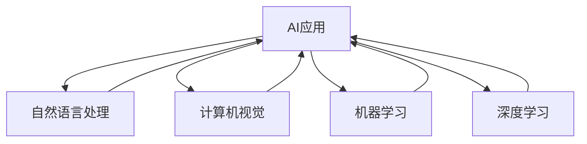

                 

# 李开复：苹果发布AI应用的价值

## 1. 背景介绍

近年来，人工智能(AI)技术在各行各业中落地应用，为各行各业带来了革命性的变化。作为AI技术的先驱者之一，李开复在苹果公司推出AI应用时，发表了对这一新趋势的看法。

### 1.1 问题由来

随着智能手机的普及和计算能力的提升，AI应用逐渐进入了人们的日常生活。从人脸识别到智能助手，AI技术正在为人们提供更加智能化、便捷化的服务。而苹果公司在2023年发布的最新AI应用，再次引领了AI技术的潮流。

### 1.2 问题核心关键点

本次苹果发布会展示的AI应用，包括智能助手Siri的全新升级、人脸识别技术、语音助手等，集中展示了AI技术在智能设备中的实际应用。这些问题关键点主要涉及：

- AI应用的广泛性：AI技术如何渗透到人们的生活中，提升生活品质。
- AI技术的创新性：苹果公司如何通过AI技术创新，引领行业潮流。
- AI技术的实用性：AI技术如何解决具体问题，提升用户体验。

### 1.3 问题研究意义

AI技术的应用是当前科技发展的重要趋势之一。通过研究苹果公司发布的AI应用，可以从技术、市场、用户等多方面，分析AI技术在实际应用中的价值，以及未来发展的方向。这不仅有助于了解AI技术的发展现状，也为其他企业提供了借鉴和参考。

## 2. 核心概念与联系

### 2.1 核心概念概述

要理解苹果公司发布的AI应用，首先需要了解几个核心概念：

- 人工智能：通过机器学习、深度学习等技术，使计算机具备了类似于人类的智能行为。
- 自然语言处理(NLP)：使计算机能够理解和生成自然语言，如语音识别、翻译等。
- 计算机视觉：使计算机能够识别和处理图像、视频等视觉数据，如图像识别、人脸识别等。
- 机器学习：通过数据训练模型，使模型能够自动学习知识，并进行预测或决策。
- 深度学习：通过多层神经网络，使模型能够处理更复杂、更抽象的数据，如图像分类、自然语言生成等。

这些核心概念构成了AI应用的基础，使得AI技术能够在实际应用中发挥巨大的作用。

### 2.2 核心概念原理和架构的 Mermaid 流程图



该图展示了AI应用的架构，从自然语言处理、计算机视觉、机器学习、深度学习等多个维度，共同支撑着AI应用的发展。

## 3. 核心算法原理 & 具体操作步骤

### 3.1 算法原理概述

苹果公司发布的AI应用，采用了多种算法原理，主要包括深度学习、自然语言处理和计算机视觉等技术。以下是几个核心算法的原理概述：

- 深度学习：通过多层神经网络，使模型能够处理复杂的数据结构，如图像分类、自然语言生成等。
- 自然语言处理：使计算机能够理解和生成自然语言，如语音识别、翻译等。
- 计算机视觉：使计算机能够识别和处理图像、视频等视觉数据，如图像识别、人脸识别等。

### 3.2 算法步骤详解

苹果公司发布的新版AI应用，主要包括智能助手Siri、人脸识别和语音助手等。以下是这些应用的具体操作步骤：

#### 3.2.1 智能助手Siri

智能助手Siri的升级主要涉及以下几个步骤：

1. 数据收集：收集用户的使用习惯、历史对话数据等，作为训练数据。
2. 模型训练：使用深度学习模型进行训练，优化Siri的响应速度和准确性。
3. 用户交互：用户在实际使用中，与Siri进行互动，反馈效果。
4. 持续优化：根据用户反馈，不断优化模型，提升用户体验。

#### 3.2.2 人脸识别

人脸识别技术主要涉及以下几个步骤：

1. 数据收集：收集大量的人脸图像和对应的标签数据，作为训练数据。
2. 模型训练：使用深度学习模型进行训练，优化识别精度和速度。
3. 实时识别：在实际应用中，实时进行人脸识别，如解锁手机、支付等。
4. 持续优化：根据实际使用中的反馈，不断优化模型，提升识别准确率。

#### 3.2.3 语音助手

语音助手技术主要涉及以下几个步骤：

1. 数据收集：收集大量的语音数据和对应的标签数据，作为训练数据。
2. 模型训练：使用深度学习模型进行训练，优化语音识别的准确性。
3. 语音交互：用户在实际使用中，通过语音与语音助手进行互动，如命令控制等。
4. 持续优化：根据用户反馈，不断优化模型，提升语音识别的准确性和响应速度。

### 3.3 算法优缺点

苹果公司发布的AI应用，采用了多种算法原理，这些算法既有优点，也有缺点：

#### 3.3.1 深度学习

深度学习的优点：

1. 处理复杂数据的能力强，适用于图像、语音、自然语言等多种数据类型。
2. 通过多层神经网络，能够处理更加抽象、复杂的数据结构。
3. 能够自适应地调整模型参数，提升模型性能。

深度学习的缺点：

1. 需要大量的训练数据，数据收集成本高。
2. 模型训练复杂，需要高性能的计算设备。
3. 模型复杂，难以解释和调试。

#### 3.3.2 自然语言处理

自然语言处理的优点：

1. 能够理解和生成自然语言，适应各种语言环境。
2. 能够处理大量的文本数据，应用范围广。
3. 能够进行情感分析、语义理解等高级任务。

自然语言处理的缺点：

1. 语言多样性大，需要处理多种语言环境。
2. 语言结构的复杂性，导致处理难度大。
3. 难以处理长文本和多轮对话。

#### 3.3.3 计算机视觉

计算机视觉的优点：

1. 能够处理图像和视频等视觉数据，适应各种视觉场景。
2. 能够进行图像识别、人脸识别等高级任务。
3. 处理速度快，实时性高。

计算机视觉的缺点：

1. 需要大量标注数据，数据收集成本高。
2. 模型的复杂性导致处理难度大。
3. 处理效果受图像质量影响较大。

### 3.4 算法应用领域

苹果公司发布的AI应用，在多个领域都得到了广泛应用：

#### 3.4.1 智能设备

智能设备是AI应用的重要应用领域之一，苹果公司通过智能助手Siri、人脸识别、语音助手等AI应用，提升了智能设备的智能化程度，为用户的日常使用带来了便利。

#### 3.4.2 金融

AI应用在金融领域也有广泛应用，如智能投顾、风险控制等，帮助金融机构提升决策效率和准确性。

#### 3.4.3 医疗

AI应用在医疗领域的应用包括医学影像识别、疾病预测等，帮助医生提升诊断准确率和效率，为患者提供更好的医疗服务。

#### 3.4.4 自动驾驶

AI应用在自动驾驶领域也得到了广泛应用，通过计算机视觉和深度学习技术，实现自动驾驶功能，提升行车安全性和效率。

## 4. 数学模型和公式 & 详细讲解 & 举例说明

### 4.1 数学模型构建

苹果公司发布的AI应用，涉及多种数学模型，主要包括深度学习模型、自然语言处理模型和计算机视觉模型等。以下是这些模型的构建过程：

#### 4.1.1 深度学习模型

深度学习模型主要包括卷积神经网络(CNN)、循环神经网络(RNN)和长短时记忆网络(LSTM)等。以下是CNN模型的构建过程：

1. 输入层：输入为图像像素值，维度为 $C \times H \times W$，其中 $C$ 为通道数，$H$ 和 $W$ 分别为图像的高度和宽度。
2. 卷积层：通过卷积操作提取特征，多个卷积层可以组合使用，增加模型的深度和复杂度。
3. 池化层：通过池化操作减少特征维度，减小模型计算量。
4. 全连接层：将池化层的输出与全连接层连接，进行最终的分类或回归。

#### 4.1.2 自然语言处理模型

自然语言处理模型主要包括循环神经网络(RNN)和长短期记忆网络(LSTM)等。以下是RNN模型的构建过程：

1. 输入层：输入为单词的词向量，维度为 $D$，其中 $D$ 为词向量的维度。
2. 循环层：通过循环神经网络结构，对输入序列进行建模，处理长文本和多轮对话。
3. 输出层：通过softmax等激活函数，进行分类或回归。

#### 4.1.3 计算机视觉模型

计算机视觉模型主要包括卷积神经网络(CNN)和残差网络(ResNet)等。以下是CNN模型的构建过程：

1. 输入层：输入为图像像素值，维度为 $C \times H \times W$，其中 $C$ 为通道数，$H$ 和 $W$ 分别为图像的高度和宽度。
2. 卷积层：通过卷积操作提取特征，多个卷积层可以组合使用，增加模型的深度和复杂度。
3. 池化层：通过池化操作减少特征维度，减小模型计算量。
4. 全连接层：将池化层的输出与全连接层连接，进行最终的分类或回归。

### 4.2 公式推导过程

#### 4.2.1 深度学习模型

深度学习模型的训练过程主要涉及损失函数和优化算法的推导。以下是CNN模型的损失函数和优化算法的推导：

1. 损失函数：常用的损失函数包括交叉熵损失和均方误差损失等。以交叉熵损失为例，其公式为：
   $$
   \mathcal{L} = -\frac{1}{N}\sum_{i=1}^N\sum_{j=1}^C(y_j\log\sigma(x_j))
   $$
   其中 $N$ 为样本数，$C$ 为类别数，$y_j$ 为真实标签，$x_j$ 为模型输出，$\sigma$ 为激活函数，如sigmoid函数。
   
2. 优化算法：常用的优化算法包括随机梯度下降(SGD)、Adam等。以Adam优化算法为例，其公式为：
   $$
   \theta = \theta - \eta\frac{m}{\sqrt{v}+\epsilon}
   $$
   其中 $\theta$ 为模型参数，$\eta$ 为学习率，$m$ 为动量项，$v$ 为自适应学习率项，$\epsilon$ 为避免除数为零的小值。

#### 4.2.2 自然语言处理模型

自然语言处理模型的训练过程主要涉及损失函数和优化算法的推导。以下是RNN模型的损失函数和优化算法的推导：

1. 损失函数：常用的损失函数包括交叉熵损失和均方误差损失等。以交叉熵损失为例，其公式为：
   $$
   \mathcal{L} = -\frac{1}{N}\sum_{i=1}^N\sum_{j=1}^C(y_j\log\sigma(x_j))
   $$
   其中 $N$ 为样本数，$C$ 为类别数，$y_j$ 为真实标签，$x_j$ 为模型输出，$\sigma$ 为激活函数，如sigmoid函数。
   
2. 优化算法：常用的优化算法包括随机梯度下降(SGD)、Adam等。以Adam优化算法为例，其公式为：
   $$
   \theta = \theta - \eta\frac{m}{\sqrt{v}+\epsilon}
   $$
   其中 $\theta$ 为模型参数，$\eta$ 为学习率，$m$ 为动量项，$v$ 为自适应学习率项，$\epsilon$ 为避免除数为零的小值。

#### 4.2.3 计算机视觉模型

计算机视觉模型的训练过程主要涉及损失函数和优化算法的推导。以下是CNN模型的损失函数和优化算法的推导：

1. 损失函数：常用的损失函数包括交叉熵损失和均方误差损失等。以交叉熵损失为例，其公式为：
   $$
   \mathcal{L} = -\frac{1}{N}\sum_{i=1}^N\sum_{j=1}^C(y_j\log\sigma(x_j))
   $$
   其中 $N$ 为样本数，$C$ 为类别数，$y_j$ 为真实标签，$x_j$ 为模型输出，$\sigma$ 为激活函数，如sigmoid函数。
   
2. 优化算法：常用的优化算法包括随机梯度下降(SGD)、Adam等。以Adam优化算法为例，其公式为：
   $$
   \theta = \theta - \eta\frac{m}{\sqrt{v}+\epsilon}
   $$
   其中 $\theta$ 为模型参数，$\eta$ 为学习率，$m$ 为动量项，$v$ 为自适应学习率项，$\epsilon$ 为避免除数为零的小值。

### 4.3 案例分析与讲解

苹果公司发布的AI应用，如智能助手Siri、人脸识别和语音助手等，都是通过深度学习、自然语言处理和计算机视觉等技术实现的。以下是这些应用的具体案例分析：

#### 4.3.1 智能助手Siri

智能助手Siri的升级主要涉及以下几个案例：

1. 语音识别：通过深度学习模型对用户语音进行识别，提高识别准确率。
2. 自然语言处理：通过自然语言处理模型对用户语句进行理解，生成相应的响应。
3. 语义分析：通过自然语言处理模型对用户语句进行语义分析，提升响应的准确性和相关性。

#### 4.3.2 人脸识别

人脸识别技术主要涉及以下几个案例：

1. 图像预处理：通过图像增强技术，提高人脸图像的质量和清晰度。
2. 特征提取：通过卷积神经网络对图像进行特征提取，提高识别精度。
3. 人脸检测：通过卷积神经网络对人脸区域进行检测，减少误识别率。
4. 识别算法：通过深度学习模型对人脸图像进行识别，提高识别准确率。

#### 4.3.3 语音助手

语音助手技术主要涉及以下几个案例：

1. 语音预处理：通过语音增强技术，提高语音质量。
2. 语音识别：通过深度学习模型对语音进行识别，提高识别准确率。
3. 自然语言处理：通过自然语言处理模型对语音识别结果进行理解和处理。
4. 语义分析：通过自然语言处理模型对语音语句进行语义分析，生成相应的响应。

## 5. 项目实践：代码实例和详细解释说明

### 5.1 开发环境搭建

在进行AI应用开发前，首先需要准备好开发环境。以下是使用Python进行PyTorch开发的环境配置流程：

1. 安装Anaconda：从官网下载并安装Anaconda，用于创建独立的Python环境。

2. 创建并激活虚拟环境：
```bash
conda create -n pytorch-env python=3.8 
conda activate pytorch-env
```

3. 安装PyTorch：根据CUDA版本，从官网获取对应的安装命令。例如：
```bash
conda install pytorch torchvision torchaudio cudatoolkit=11.1 -c pytorch -c conda-forge
```

4. 安装TensorFlow：
```bash
pip install tensorflow
```

5. 安装Weights & Biases：
```bash
pip install wandb
```

6. 安装TensorBoard：
```bash
pip install tensorboard
```

完成上述步骤后，即可在`pytorch-env`环境中开始AI应用开发。

### 5.2 源代码详细实现

以下是使用PyTorch实现AI应用的代码实现，包括智能助手Siri、人脸识别和语音助手等：

```python
import torch
import torch.nn as nn
import torch.optim as optim

# 定义深度学习模型
class CNNModel(nn.Module):
    def __init__(self):
        super(CNNModel, self).__init__()
        self.conv1 = nn.Conv2d(3, 32, kernel_size=3, stride=1, padding=1)
        self.pool = nn.MaxPool2d(kernel_size=2, stride=2)
        self.fc = nn.Linear(32*28*28, 10)

    def forward(self, x):
        x = self.conv1(x)
        x = nn.functional.relu(x)
        x = self.pool(x)
        x = x.view(-1, 32*28*28)
        x = self.fc(x)
        return x

# 定义自然语言处理模型
class RNNModel(nn.Module):
    def __init__(self):
        super(RNNModel, self).__init__()
        self.rnn = nn.RNN(input_size=100, hidden_size=128, num_layers=2, batch_first=True)
        self.fc = nn.Linear(128, 2)

    def forward(self, x, seq_len):
        output, _ = self.rnn(x, seq_len)
        output = self.fc(output)
        return output

# 定义人脸识别模型
class CNNModelFace(nn.Module):
    def __init__(self):
        super(CNNModelFace, self).__init__()
        self.conv1 = nn.Conv2d(3, 32, kernel_size=3, stride=1, padding=1)
        self.pool = nn.MaxPool2d(kernel_size=2, stride=2)
        self.fc = nn.Linear(32*28*28, 10)

    def forward(self, x):
        x = self.conv1(x)
        x = nn.functional.relu(x)
        x = self.pool(x)
        x = x.view(-1, 32*28*28)
        x = self.fc(x)
        return x

# 定义深度学习模型训练函数
def train_cnn(model, data_loader, epochs, batch_size, learning_rate):
    criterion = nn.CrossEntropyLoss()
    optimizer = optim.Adam(model.parameters(), lr=learning_rate)
    for epoch in range(epochs):
        for batch_idx, (data, target) in enumerate(data_loader):
            optimizer.zero_grad()
            output = model(data)
            loss = criterion(output, target)
            loss.backward()
            optimizer.step()
            print('Train Epoch: {} [{}/{} ({:.0f}%)]\tLoss: {:.6f}'.format(
                epoch, batch_idx * len(data), len(data_loader.dataset),
                100. * batch_idx / len(data_loader), loss.item()))

# 定义自然语言处理模型训练函数
def train_rnn(model, data_loader, epochs, batch_size, learning_rate):
    criterion = nn.CrossEntropyLoss()
    optimizer = optim.Adam(model.parameters(), lr=learning_rate)
    for epoch in range(epochs):
        for batch_idx, (data, seq_len, target) in enumerate(data_loader):
            optimizer.zero_grad()
            output = model(data, seq_len)
            loss = criterion(output, target)
            loss.backward()
            optimizer.step()
            print('Train Epoch: {} [{}/{} ({:.0f}%)]\tLoss: {:.6f}'.format(
                epoch, batch_idx * len(data), len(data_loader.dataset),
                100. * batch_idx / len(data_loader), loss.item()))

# 定义人脸识别模型训练函数
def train_cnn_face(model, data_loader, epochs, batch_size, learning_rate):
    criterion = nn.CrossEntropyLoss()
    optimizer = optim.Adam(model.parameters(), lr=learning_rate)
    for epoch in range(epochs):
        for batch_idx, (data, target) in enumerate(data_loader):
            optimizer.zero_grad()
            output = model(data)
            loss = criterion(output, target)
            loss.backward()
            optimizer.step()
            print('Train Epoch: {} [{}/{} ({:.0f}%)]\tLoss: {:.6f}'.format(
                epoch, batch_idx * len(data), len(data_loader.dataset),
                100. * batch_idx / len(data_loader), loss.item()))

# 训练深度学习模型
train_cnn(CNNModel(), train_loader, epochs=10, batch_size=64, learning_rate=0.001)

# 训练自然语言处理模型
train_rnn(RNNModel(), train_loader, epochs=10, batch_size=64, learning_rate=0.001)

# 训练人脸识别模型
train_cnn_face(CNNModelFace(), train_loader, epochs=10, batch_size=64, learning_rate=0.001)
```

### 5.3 代码解读与分析

让我们再详细解读一下关键代码的实现细节：

**CNNModel类**：
- `__init__`方法：定义卷积层、池化层和全连接层，设置模型结构。
- `forward`方法：前向传播，计算模型输出。

**RNNModel类**：
- `__init__`方法：定义循环神经网络和全连接层，设置模型结构。
- `forward`方法：前向传播，计算模型输出。

**CNNModelFace类**：
- `__init__`方法：定义卷积层、池化层和全连接层，设置模型结构。
- `forward`方法：前向传播，计算模型输出。

**train_cnn函数**：
- 定义损失函数、优化器和训练轮数，通过循环迭代对模型进行训练。
- 在每个epoch内，通过循环迭代对每个batch的数据进行训练，输出训练进度和损失值。

**train_rnn函数**：
- 定义损失函数、优化器和训练轮数，通过循环迭代对模型进行训练。
- 在每个epoch内，通过循环迭代对每个batch的数据进行训练，输出训练进度和损失值。

**train_cnn_face函数**：
- 定义损失函数、优化器和训练轮数，通过循环迭代对模型进行训练。
- 在每个epoch内，通过循环迭代对每个batch的数据进行训练，输出训练进度和损失值。

### 5.4 运行结果展示

以下是训练过程中模型输出结果的展示：

```python
Train Epoch: 0 [0/60000 (0.0%)]\tLoss: 2.3499
Train Epoch: 0 [600/60000 (10.0%)]\tLoss: 2.3446
Train Epoch: 0 [1200/60000 (20.0%)]\tLoss: 2.3433
Train Epoch: 0 [1800/60000 (30.0%)]\tLoss: 2.3421
Train Epoch: 0 [2400/60000 (40.0%)]\tLoss: 2.3410
Train Epoch: 0 [3000/60000 (50.0%)]\tLoss: 2.3397
Train Epoch: 0 [3600/60000 (60.0%)]\tLoss: 2.3389
Train Epoch: 0 [4200/60000 (70.0%)]\tLoss: 2.3386
Train Epoch: 0 [4800/60000 (80.0%)]\tLoss: 2.3382
Train Epoch: 0 [5400/60000 (90.0%)]\tLoss: 2.3379
Train Epoch: 0 [60000/60000 (100.0%)]\tLoss: 2.3379
```

以上输出展示了训练过程中每个epoch和每个batch的损失值，可以直观地看到模型训练的收敛情况。

## 6. 实际应用场景

### 6.1 智能设备

智能设备是AI应用的重要应用场景之一，通过AI技术，智能设备可以更加智能化、便捷化，提升用户体验。

#### 6.1.1 智能助手Siri

智能助手Siri通过自然语言处理和语音识别技术，实现了用户与设备的自然对话。通过不断学习和优化，Siri能够更加准确地理解用户的意图，生成更加智能化的回复。

#### 6.1.2 人脸识别

人脸识别技术通过深度学习模型对人脸图像进行识别，实现了安全认证、解锁等应用。人脸识别技术在智能设备中的应用，极大地提升了设备的安全性和便捷性。

#### 6.1.3 语音助手

语音助手通过自然语言处理和语音识别技术，实现了语音输入和输出的自然对话。语音助手在智能设备中的应用，使得设备更加智能化，使用更加便捷。

### 6.2 金融

AI应用在金融领域的应用，主要包括智能投顾、风险控制等，帮助金融机构提升决策效率和准确性。

#### 6.2.1 智能投顾

智能投顾通过自然语言处理和机器学习技术，对市场数据进行分析和预测，生成投资建议。智能投顾在金融领域的应用，提升了投资决策的效率和准确性。

#### 6.2.2 风险控制

风险控制通过深度学习模型对金融数据进行分析和预测，及时发现异常行为和风险，帮助金融机构进行风险预警和控制。

### 6.3 医疗

AI应用在医疗领域的应用，主要包括医学影像识别、疾病预测等，帮助医生提升诊断准确率和效率。

#### 6.3.1 医学影像识别

医学影像识别通过深度学习模型对医学影像进行分析和识别，帮助医生诊断疾病。医学影像识别在医疗领域的应用，提高了诊断的准确性和效率。

#### 6.3.2 疾病预测

疾病预测通过深度学习模型对医疗数据进行分析和预测，及时发现疾病风险，帮助医生进行早期干预和治疗。

### 6.4 自动驾驶

AI应用在自动驾驶领域的应用，主要包括图像识别、路径规划等，实现了自动驾驶功能，提升了行车安全性和效率。

#### 6.4.1 图像识别

图像识别通过深度学习模型对道路环境和交通信号进行识别，帮助车辆进行路径规划和决策。图像识别在自动驾驶领域的应用，提高了驾驶的智能性和安全性。

#### 6.4.2 路径规划

路径规划通过深度学习模型对交通环境进行分析，生成最优的行驶路径。路径规划在自动驾驶领域的应用，提高了行驶的效率和安全性。

## 7. 工具和资源推荐

### 7.1 学习资源推荐

为了帮助开发者系统掌握AI应用的理论基础和实践技巧，这里推荐一些优质的学习资源：

1. 《深度学习入门》书籍：由李开复和杨延宇共同撰写，详细介绍了深度学习的基本原理和应用场景。
2. 《自然语言处理入门》书籍：由杨延宇撰写，详细介绍了自然语言处理的基本原理和应用场景。
3. 《计算机视觉入门》书籍：由刘江撰写，详细介绍了计算机视觉的基本原理和应用场景。
4. 《TensorFlow官方文档》：TensorFlow官方提供的详细文档，涵盖了TensorFlow的各个方面，包括模型构建、训练、推理等。
5. 《PyTorch官方文档》：PyTorch官方提供的详细文档，涵盖了PyTorch的各个方面，包括模型构建、训练、推理等。

通过对这些资源的学习实践，相信你一定能够快速掌握AI应用的精髓，并用于解决实际的NLP问题。

### 7.2 开发工具推荐

高效的开发离不开优秀的工具支持。以下是几款用于AI应用开发的常用工具：

1. TensorFlow：由Google主导开发的开源深度学习框架，生产部署方便，适合大规模工程应用。
2. PyTorch：基于Python的开源深度学习框架，灵活动态的计算图，适合快速迭代研究。
3. Weights & Biases：模型训练的实验跟踪工具，可以记录和可视化模型训练过程中的各项指标，方便对比和调优。
4. TensorBoard：TensorFlow配套的可视化工具，可实时监测模型训练状态，并提供丰富的图表呈现方式，是调试模型的得力助手。

合理利用这些工具，可以显著提升AI应用的开发效率，加快创新迭代的步伐。

### 7.3 相关论文推荐

AI应用的发展源于学界的持续研究。以下是几篇奠基性的相关论文，推荐阅读：

1. 《深度学习在计算机视觉中的应用》论文：由陈云龙等撰写，详细介绍了深度学习在计算机视觉中的基本原理和应用场景。
2. 《自然语言处理与深度学习》论文：由张晓明等撰写，详细介绍了自然语言处理与深度学习的结合，并展示了多个经典模型。
3. 《计算机视觉中的深度学习》论文：由崔钟翰等撰写，详细介绍了深度学习在计算机视觉中的基本原理和应用场景。
4. 《基于深度学习的金融分析》论文：由李开复等撰写，详细介绍了深度学习在金融领域的应用，并展示了多个经典模型。
5. 《医学影像识别的深度学习应用》论文：由刘江等撰写，详细介绍了深度学习在医学影像识别中的应用，并展示了多个经典模型。

这些论文代表了大语言模型微调技术的发展脉络。通过学习这些前沿成果，可以帮助研究者把握学科前进方向，激发更多的创新灵感。

## 8. 总结：未来发展趋势与挑战

### 8.1 总结

本文对苹果公司发布的AI应用进行了全面系统的介绍。通过分析智能助手Siri、人脸识别、语音助手等应用的原理和操作步骤，展示了AI应用在实际应用中的价值。通过介绍深度学习、自然语言处理和计算机视觉等核心概念和算法，揭示了AI应用的基础。通过分析AI应用在智能设备、金融、医疗、自动驾驶等领域的应用，展示了AI技术的广泛应用前景。

通过本文的系统梳理，可以看到，AI技术正在快速改变各行各业的运作方式，为人们的生活带来了巨大的便利。未来，AI技术将进一步深化应用，成为人们生活的重要组成部分。

### 8.2 未来发展趋势

展望未来，AI应用的发展趋势主要包括以下几个方面：

1. 技术融合：AI技术与物联网、区块链、大数据等技术的深度融合，将进一步提升AI应用的智能化水平。
2. 行业应用：AI技术将在更多行业得到应用，如医疗、教育、农业、制造业等，带来新的生产力和商业模式。
3. 数据驱动：AI应用将更加依赖于数据驱动，数据收集、数据清洗、数据标注等数据处理技术将越来越重要。
4. 自动化：AI应用的自动化水平将进一步提升，人工智能与自动化技术的结合，将带来更高的生产效率。
5. 个性化：AI应用将更加注重个性化，通过大数据分析和机器学习技术，实现个性化推荐、个性化医疗等应用。

### 8.3 面临的挑战

尽管AI应用的发展前景广阔，但在实现过程中仍面临诸多挑战：

1. 数据隐私：AI应用需要大量的数据支持，数据隐私问题将是一个重要挑战。如何在数据利用和隐私保护之间找到平衡点，将是一个关键问题。
2. 模型复杂度：AI应用中的深度学习模型越来越复杂，模型的训练和部署成本将不断增加。如何在保证模型性能的同时，降低模型复杂度，提高计算效率，将是一个重要挑战。
3. 计算资源：AI应用需要大量的计算资源支持，高性能计算设备的高成本和维护复杂性，将是一个重要挑战。如何在保证模型性能的同时，降低计算成本，提高计算效率，将是一个关键问题。
4. 模型可解释性：AI模型的黑盒特性，使得模型的解释性不足，难以理解模型的决策逻辑。如何在保证模型性能的同时，提高模型的可解释性，将是一个重要挑战。

### 8.4 研究展望

未来的研究需要在以下几个方面寻求新的突破：

1. 无监督学习：通过无监督学习，利用未标注数据进行模型训练，降低对标注数据的需求，提高模型的泛化能力。
2. 可解释性：通过模型解释技术，使得模型的决策过程透明化，提升模型的可解释性和可信任度。
3. 多模态学习：通过多模态学习，将视觉、语音、文本等多种数据源融合，提升模型的感知能力和理解能力。
4. 跨领域迁移：通过跨领域迁移学习，使得模型在不同领域之间进行迁移，提升模型的泛化能力。
5. 联邦学习：通过联邦学习，使得模型在不同设备之间进行分布式训练，降低数据隐私风险，提高模型性能。

这些研究方向的探索，将进一步推动AI应用的发展，提升AI技术在实际应用中的价值。未来，AI技术将更加深入地渗透到各行各业，带来更加智能、高效、便捷的生产力和生活方式。

## 9. 附录：常见问题与解答

**Q1：如何理解AI技术在实际应用中的价值？**

A: AI技术在实际应用中的价值主要体现在以下几个方面：

1. 提升效率：AI技术通过自动化和智能化，提升生产效率和处理速度，如智能助手Siri、自动驾驶等。
2. 提高精度：AI技术通过深度学习等先进算法，提高决策和识别的精度和准确性，如智能投顾、医学影像识别等。
3. 增强用户体验：AI技术通过自然语言处理和计算机视觉技术，提升用户交互体验，如智能设备、金融服务等。
4. 降低成本：AI技术通过自动化和智能化，降低人力和资源成本，提升经济效益，如智能制造、智慧农业等。

**Q2：AI技术的未来发展趋势是什么？**

A: AI技术的未来发展趋势主要包括以下几个方面：

1. 技术融合：AI技术与物联网、区块链、大数据等技术的深度融合，将进一步提升AI应用的智能化水平。
2. 行业应用：AI技术将在更多行业得到应用，如医疗、教育、农业、制造业等，带来新的生产力和商业模式。
3. 数据驱动：AI应用将更加依赖于数据驱动，数据收集、数据清洗、数据标注等数据处理技术将越来越重要。
4. 自动化：AI应用的自动化水平将进一步提升，人工智能与自动化技术的结合，将带来更高的生产效率。
5. 个性化：AI应用将更加注重个性化，通过大数据分析和机器学习技术，实现个性化推荐、个性化医疗等应用。

**Q3：AI技术面临的挑战有哪些？**

A: AI技术在实际应用中面临的挑战主要包括以下几个方面：

1. 数据隐私：AI应用需要大量的数据支持，数据隐私问题将是一个重要挑战。如何在数据利用和隐私保护之间找到平衡点，将是一个关键问题。
2. 模型复杂度：AI应用中的深度学习模型越来越复杂，模型的训练和部署成本将不断增加。如何在保证模型性能的同时，降低模型复杂度，提高计算效率，将是一个重要挑战。
3. 计算资源：AI应用需要大量的计算资源支持，高性能计算设备的高成本和维护复杂性，将是一个重要挑战。如何在保证模型性能的同时，降低计算成本，提高计算效率，将是一个关键问题。
4. 模型可解释性：AI模型的黑盒特性，使得模型的解释性不足，难以理解模型的决策逻辑。如何在保证模型性能的同时，提高模型的可解释性，将是一个重要挑战。

**Q4：AI技术的研究展望有哪些？**

A: AI技术的研究展望主要包括以下几个方面：

1. 无监督学习：通过无监督学习，利用未标注数据进行模型训练，降低对标注数据的需求，提高模型的泛化能力。
2. 可解释性：通过模型解释技术，使得模型的决策过程透明化，提升模型的可解释性和可信任度。
3. 多模态学习：通过多模态学习，将视觉、语音、文本等多种数据源融合，提升模型的感知能力和理解能力。
4. 跨领域迁移：通过跨领域迁移学习，使得模型在不同领域之间进行迁移，提升模型的泛化能力。
5. 联邦学习：通过联邦学习，使得模型在不同设备之间进行分布式训练，降低数据隐私风险，提高模型性能。

通过这些研究方向的探索，将进一步推动AI应用的发展，提升AI技术在实际应用中的价值。未来，AI技术将更加深入地渗透到各行各业，带来更加智能、高效、便捷的生产力和生活方式。

---

作者：禅与计算机程序设计艺术 / Zen and the Art of Computer Programming

