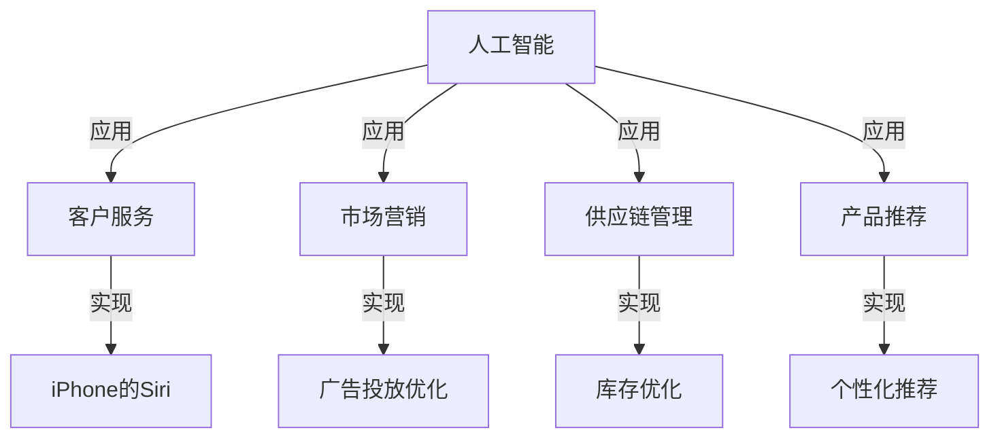

                 

# 李开复：苹果发布AI应用的商业价值

李开复，全球知名的AI专家和企业家，是人工智能领域的先驱之一，曾担任微软首席科学家、谷歌全球资深副总裁，并在2011年创立了创新工场。在他的著作《人工智能：从1956到2050》中，李开复深入探讨了AI技术的过去、现在和未来。在本文中，我们将重点关注李开复关于AI应用在商业领域，尤其是苹果公司如何利用AI驱动其业务的观点和分析。

## 1. 背景介绍

### 1.1 AI在商业领域的应用概况
近年来，AI技术在各行各业的应用越来越广泛，从零售、金融、医疗到教育、制造，AI技术正逐步改变传统行业的工作方式，提升效率和效益。在商业领域，AI的应用主要集中在以下几个方面：

- **客户服务**：通过聊天机器人、智能客服系统，提升客户互动体验，降低运营成本。
- **市场营销**：利用AI进行市场分析、客户画像构建、广告投放优化，提高市场响应效率。
- **供应链管理**：通过AI预测需求、优化库存、管理物流，提升供应链的灵活性和响应速度。
- **产品推荐**：基于用户行为数据，推荐个性化产品，提升销售转化率。

### 1.2 苹果公司与AI的融合
苹果公司作为全球领先的科技公司，一直以来在创新和用户体验上有着卓越表现。近年来，苹果公司开始更加重视AI技术的应用，并将其融合到其产品和服务中，以提升整体竞争力。例如，iPhone的Siri语音助手、Face ID人脸识别、Siri语音搜索等功能都是基于AI技术的实现。

## 2. 核心概念与联系

### 2.1 核心概念概述

- **人工智能(AI)**：一种通过计算机模拟人类智能的技术，涵盖感知、学习、推理、决策等多个领域。
- **深度学习(Deep Learning)**：一种基于神经网络的大规模数据驱动的机器学习技术，广泛应用于图像识别、语音识别、自然语言处理等领域。
- **增强学习(Reinforcement Learning)**：一种通过试错来学习最优决策的机器学习方法，常用于游戏、机器人控制等领域。
- **迁移学习(Transfer Learning)**：一种通过已有知识对新任务进行优化的机器学习方法，可以显著降低新任务训练所需的数据量和计算资源。
- **预训练模型(Pre-trained Model)**：通过大规模无监督数据预训练得到的基础模型，经过微调后可用于特定任务，提高模型泛化能力。

### 2.2 核心概念的联系与结构

以下是一个简单的Mermaid流程图，展示了AI与苹果公司产品和服务间的联系：



从上图可以看出，AI技术在苹果的多个业务领域中得到了广泛应用，提升了用户体验和运营效率。

## 3. 核心算法原理 & 具体操作步骤

### 3.1 算法原理概述

苹果公司在其AI应用中，主要采用深度学习和迁移学习的技术。以自然语言处理(NLP)为例，苹果通常会使用大规模无标签文本数据进行预训练，然后通过微调来适应特定任务，如语音识别、智能客服等。这种预训练-微调的方法，不仅能够提高模型的泛化能力，还能降低新任务训练所需的数据量和计算资源。

### 3.2 算法步骤详解

#### 3.2.1 预训练
苹果公司利用其庞大的数据资源，如iOS设备的日常使用数据，进行大规模预训练。预训练的目标是构建一个基础模型，使其能够学习到通用的语言表示和知识。

#### 3.2.2 微调
在预训练的基础上，苹果公司会根据具体的业务需求，对模型进行微调。例如，在构建智能客服系统时，苹果会利用一小部分标注好的对话数据，对预训练模型进行微调，以适应客服场景。

#### 3.2.3 部署
微调后的模型会部署到实际应用中，如iOS设备、服务器等。在部署过程中，苹果会进行必要的优化，如模型压缩、量化加速等，以提高模型的推理速度和资源利用率。

### 3.3 算法优缺点

#### 3.3.1 优点
- **泛化能力强**：通过大规模预训练，模型能够学习到通用的语言表示，提升泛化能力。
- **成本低**：微调所需的数据量和计算资源相对较少，降低了模型训练和部署的成本。
- **灵活性强**：预训练-微调方法可以快速适应新任务，提升产品迭代速度。

#### 3.3.2 缺点
- **依赖数据**：预训练和微调的效果很大程度上依赖于数据的质量和数量，数据获取和处理成本较高。
- **模型复杂**：大规模预训练模型往往结构复杂，推理速度较慢，需要额外的优化措施。
- **可解释性差**：深度学习模型通常具有"黑盒"特性，难以解释其内部工作机制和决策逻辑。

### 3.4 算法应用领域

苹果公司在多个领域广泛应用AI技术，以下是一些主要应用领域：

- **客户服务**：利用Siri语音助手，提供全天候语音查询和智能客服功能，提升用户体验。
- **市场营销**：通过广告投放优化，提高广告点击率和转化率，提升品牌曝光度。
- **零售**：通过智能推荐系统，根据用户行为数据推荐个性化产品，提升销售转化率。
- **图像识别**：在Face ID功能中，利用深度学习模型进行人脸识别，提升设备安全性。
- **自然语言处理**：在Siri语音搜索、翻译等应用中，利用NLP技术提升自然语言理解和生成能力。

## 4. 数学模型和公式 & 详细讲解

### 4.1 数学模型构建

以Siri语音识别为例，苹果公司通常采用深度学习模型进行语音信号的特征提取和语音转文本。其数学模型构建如下：

设$x$为输入的语音信号，$y$为输出文本。目标是最小化交叉熵损失函数：

$$
\mathcal{L}(x,y) = -\frac{1}{N}\sum_{i=1}^N y_i\log p(y_i|x)
$$

其中，$p(y_i|x)$为模型对输入$x$预测文本$y_i$的概率分布。

### 4.2 公式推导过程

在语音信号的特征提取阶段，苹果公司通常使用卷积神经网络(CNN)进行特征提取。设$x$为语音信号的频谱图，$y$为CNN输出的特征图，其公式推导如下：

$$
y = f(x; \theta)
$$

其中，$f$为CNN模型，$\theta$为CNN模型的参数。

### 4.3 案例分析与讲解

在语音识别模型训练中，苹果公司通常会采用自监督学习任务，如语音预测、语言模型预测等，以提升模型的泛化能力。以语音预测为例，其公式推导如下：

设$x$为语音信号，$y$为预测的文本，$z$为文本的one-hot编码。目标是最小化交叉熵损失函数：

$$
\mathcal{L}(x,y) = -\frac{1}{N}\sum_{i=1}^N y_i\log p(z|x)
$$

其中，$p(z|x)$为模型对输入$x$预测文本$y_i$的one-hot编码的概率分布。

## 5. 项目实践：代码实例和详细解释说明

### 5.1 开发环境搭建

在搭建开发环境时，苹果公司通常会使用PyTorch作为深度学习框架。以下是Python环境的配置步骤：

1. 安装Anaconda：从官网下载并安装Anaconda，用于创建独立的Python环境。
2. 创建并激活虚拟环境：
```bash
conda create -n pytorch-env python=3.8 
conda activate pytorch-env
```
3. 安装PyTorch：根据CUDA版本，从官网获取对应的安装命令。例如：
```bash
conda install pytorch torchvision torchaudio cudatoolkit=11.1 -c pytorch -c conda-forge
```
4. 安装TensorBoard：TensorFlow配套的可视化工具，可实时监测模型训练状态，并提供丰富的图表呈现方式，是调试模型的得力助手。

完成上述步骤后，即可在`pytorch-env`环境中开始AI应用的开发。

### 5.2 源代码详细实现

以Siri语音识别为例，苹果公司通常会使用TensorFlow构建深度学习模型。以下是Siri语音识别系统的源代码实现：

```python
import tensorflow as tf
from tensorflow.keras.layers import Conv2D, MaxPooling2D, Flatten, Dense
from tensorflow.keras.models import Sequential

# 构建卷积神经网络模型
model = Sequential()
model.add(Conv2D(32, kernel_size=(3, 3), activation='relu', input_shape=(64, 64, 3)))
model.add(MaxPooling2D(pool_size=(2, 2)))
model.add(Flatten())
model.add(Dense(128, activation='relu'))
model.add(Dense(26, activation='softmax'))

# 编译模型
model.compile(optimizer='adam', loss='categorical_crossentropy', metrics=['accuracy'])

# 训练模型
model.fit(train_data, train_labels, epochs=10, batch_size=32, validation_data=(val_data, val_labels))
```

### 5.3 代码解读与分析

在代码中，我们首先构建了一个简单的卷积神经网络模型，包含卷积层、池化层、全连接层等。然后，使用交叉熵损失函数和Adam优化器进行模型编译。最后，在训练数据上进行模型训练，验证集上进行模型验证。

## 6. 实际应用场景

### 6.1 客户服务

苹果公司利用AI技术，构建了智能客服系统，通过Siri语音助手和智能客服，提升客户互动体验，降低运营成本。例如，Siri可以回答用户关于产品功能、售后服务的各类问题，减少了人工客服的工作量，提高了客户满意度。

### 6.2 市场营销

苹果公司通过AI技术，优化广告投放策略，提高广告点击率和转化率。例如，苹果公司利用机器学习模型对用户行为数据进行分析，找出高价值用户群体，进行精准广告投放，提升了广告效益。

### 6.3 零售

苹果公司在零售领域广泛应用AI技术，通过智能推荐系统，根据用户行为数据推荐个性化产品，提升销售转化率。例如，在苹果商店中，用户浏览和购买历史会被模型学习，从而推荐相关产品，提升用户购买意愿。

### 6.4 未来应用展望

未来，苹果公司将继续深化AI技术的应用，探索更多创新场景。例如，通过增强学习技术，提升自动驾驶和机器人控制能力，打造更加智能的家居和医疗设备。同时，苹果公司还将探索AI在创意设计、音乐推荐等领域的应用，提升用户体验。

## 7. 工具和资源推荐

### 7.1 学习资源推荐

为了帮助开发者系统掌握AI技术的理论基础和实践技巧，这里推荐一些优质的学习资源：

1. 《深度学习》：Ian Goodfellow、Yoshua Bengio和Aaron Courville合著的深度学习经典教材，系统介绍深度学习的基本原理和应用。
2. 《TensorFlow实战》：张亮所著，详细介绍TensorFlow框架的使用和优化技巧，适合初学者和实战开发。
3. 《PyTorch深度学习》：Github上的开源教程，包含从入门到进阶的详细教程，适合使用PyTorch进行AI开发。
4. 《自然语言处理综论》：斯坦福大学的NLP课程讲义，涵盖自然语言处理的各个方面，适合深入学习和研究。

### 7.2 开发工具推荐

高效的开发离不开优秀的工具支持。以下是几款用于AI应用开发的常用工具：

1. PyTorch：基于Python的开源深度学习框架，灵活动态的计算图，适合快速迭代研究。
2. TensorFlow：由Google主导开发的开源深度学习框架，生产部署方便，适合大规模工程应用。
3. Jupyter Notebook：交互式的开发环境，支持Python、R等多种语言，适合进行数据分析和模型开发。
4. Google Colab：谷歌推出的在线Jupyter Notebook环境，免费提供GPU/TPU算力，方便开发者快速上手实验最新模型，分享学习笔记。

### 7.3 相关论文推荐

AI技术的发展源于学界的持续研究。以下是几篇奠基性的相关论文，推荐阅读：

1. "Deep Learning" by Ian Goodfellow, Yoshua Bengio, and Aaron Courville：深度学习的经典教材，系统介绍深度学习的基本原理和应用。
2. "Attention is All You Need" by Ashish Vaswani et al.：提出Transformer结构，开启了NLP领域的预训练大模型时代。
3. "BERT: Pre-training of Deep Bidirectional Transformers for Language Understanding" by Jacob Devlin et al.：提出BERT模型，引入基于掩码的自监督预训练任务，刷新了多项NLP任务SOTA。
4. "Language Models are Unsupervised Multitask Learners" by Alec Radford et al.：展示了大规模语言模型的强大zero-shot学习能力，引发了对于通用人工智能的新一轮思考。
5. "Parameter-Efficient Transfer Learning for NLP" by Mishra et al.：提出Adapter等参数高效微调方法，在不增加模型参数量的情况下，也能取得不错的微调效果。

## 8. 总结：未来发展趋势与挑战

### 8.1 研究成果总结

本文对苹果公司在AI应用领域的商业价值进行了全面系统的介绍。首先阐述了AI技术在商业领域的应用概况，明确了AI在苹果产品和服务中的应用方向。其次，从原理到实践，详细讲解了苹果公司如何利用AI技术提升用户体验和运营效率。

### 8.2 未来发展趋势

展望未来，AI技术在商业领域的应用将呈现以下几个趋势：

1. **智能化提升**：随着AI技术的不断进步，越来越多的商业场景将实现智能化，提升效率和效益。
2. **数据驱动**：数据将成为AI应用的核心，更多的商业决策将基于数据驱动。
3. **跨领域融合**：AI技术将与其他新兴技术（如区块链、5G等）深度融合，拓展应用边界。
4. **用户个性化**：AI技术将深入挖掘用户需求，实现更加个性化的服务体验。

### 8.3 面临的挑战

尽管AI技术在商业领域已经取得了显著成效，但在迈向更加智能化、普适化应用的过程中，仍面临诸多挑战：

1. **数据隐私和安全**：AI技术的应用需要大量的数据，如何保护用户隐私和数据安全是一个重要问题。
2. **技术成熟度**：AI技术在商业场景中的成熟度和可靠性仍需提升，避免技术风险。
3. **模型可解释性**：AI模型的决策过程难以解释，影响用户信任和接受度。
4. **法规和伦理**：AI技术的应用需要遵循相关法规和伦理规范，避免歧视和偏见。

### 8.4 研究展望

未来，AI技术在商业领域的研究方向将包括以下几个方面：

1. **隐私保护**：开发隐私保护算法和数据匿名化技术，保障用户隐私。
2. **模型优化**：提高AI模型的可解释性和鲁棒性，增强用户信任。
3. **跨领域应用**：推动AI技术与其他新兴技术深度融合，拓展应用场景。
4. **法规和伦理**：制定和完善AI技术的法规和伦理标准，规范AI应用行为。

## 9. 附录：常见问题与解答

**Q1：苹果公司如何选择合适的深度学习框架？**

A: 苹果公司通常会根据具体的任务需求和团队的技术栈选择合适的深度学习框架。例如，对于图像处理任务，可能更倾向于使用TensorFlow；对于自然语言处理任务，则更倾向于使用PyTorch。此外，苹果公司也会利用其强大的技术储备，进行框架定制和优化，提升开发效率。

**Q2：苹果公司在构建深度学习模型时，如何保证模型的泛化能力？**

A: 苹果公司在构建深度学习模型时，通常会使用大规模无标签数据进行预训练，然后根据具体任务进行微调。预训练-微调的方法可以提高模型的泛化能力，避免过拟合。同时，苹果公司还会引入正则化技术，如L2正则、Dropout等，进一步提升模型的泛化能力。

**Q3：苹果公司如何保证AI应用的可靠性？**

A: 苹果公司在部署AI应用时，通常会进行严格的测试和验证，确保模型在实际应用中的可靠性。例如，苹果公司会使用数据集进行模型评估，通过多次迭代和优化，提高模型的准确性和鲁棒性。此外，苹果公司还会引入异常检测和故障排除机制，保障AI应用的稳定性。

**Q4：苹果公司如何保护用户隐私和数据安全？**

A: 苹果公司在应用AI技术时，通常会采用数据匿名化、数据加密等技术手段，保护用户隐私。例如，苹果公司会对用户数据进行去标识化处理，确保数据无法反识别用户身份。同时，苹果公司还会遵循相关法规，如GDPR等，保障数据安全。

**Q5：苹果公司在AI应用开发中，如何实现高效的模型部署？**

A: 苹果公司在AI应用开发中，通常会进行模型压缩、量化加速等优化措施，提升模型的推理速度和资源利用率。例如，苹果公司会使用TensorRT等优化工具，对模型进行深度压缩和量化，从而实现更高的推理效率。此外，苹果公司还会采用模型并行、混合精度训练等技术，进一步优化模型的资源利用。

---

作者：禅与计算机程序设计艺术 / Zen and the Art of Computer Programming

