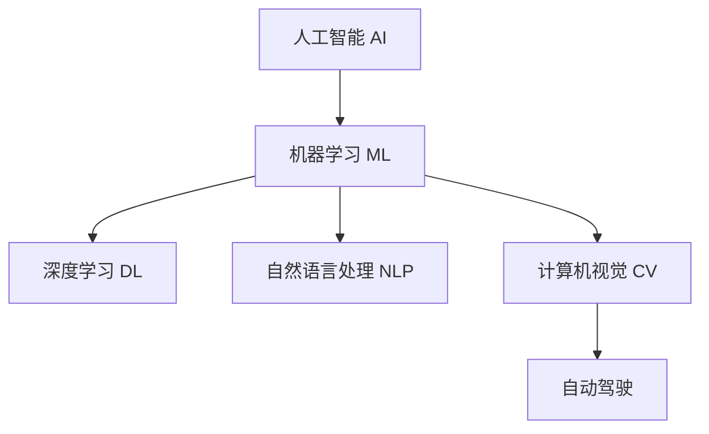
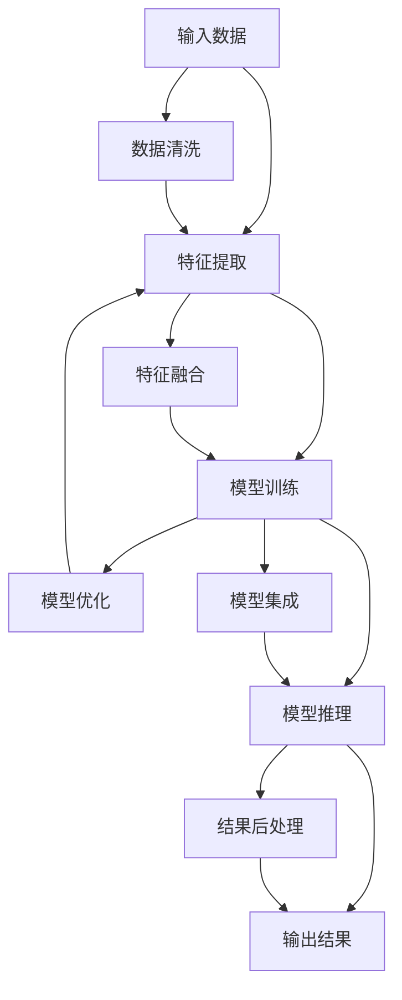

                 

## 1. 背景介绍

在过去十年间，人工智能（AI）技术不断取得突破，已经深入到各个行业，改变了我们的工作和生活方式。随着AI技术的持续发展，越来越多的企业开始将AI应用作为其业务战略的核心，以期获得竞争优势。在这一趋势下，苹果公司发布了其AI应用生态，为开发者和消费者提供了全新的体验和价值。

苹果公司一直以来以其优质的硬件设备和操作系统闻名于世，但近年来也逐渐在AI领域发力，推出了多个AI应用和工具，如Siri、Face ID、自动驾驶等。这些AI应用的成功，不仅展示了苹果在技术上的领先地位，也证明了其对于AI应用生态构建的重视。

本文将从背景、核心概念、算法原理、应用实践、实际场景、工具资源和未来展望等多个方面，全面解析苹果公司发布的AI应用生态，并探讨其在推动AI应用发展中的作用。

## 2. 核心概念与联系

### 2.1 核心概念概述

要理解苹果AI应用生态，首先需要明确几个核心概念：

- **人工智能（AI）**：一种使计算机系统能够执行需要人类智能的任务的技术，如视觉感知、语言理解、决策制定等。
- **机器学习（ML）**：一种实现AI的技术，通过算法使计算机从数据中学习，不断提升性能。
- **深度学习（DL）**：一种机器学习的高级形式，使用多层神经网络模型模拟人脑神经元的工作原理，解决复杂的非线性问题。
- **自然语言处理（NLP）**：使计算机能够理解和处理人类语言的技术，涉及文本分类、机器翻译、情感分析等。
- **计算机视觉（CV）**：使计算机能够理解和处理图像和视频的技术，包括目标检测、图像分割、人脸识别等。
- **自动驾驶**：一种基于AI和机器学习的技术，使汽车能够自主驾驶。

这些概念之间的逻辑关系可以通过以下Mermaid流程图来展示：



这个流程图展示了AI技术在各个子领域的分布与应用：

1. **机器学习**：是实现AI的通用技术手段。
2. **深度学习**：在特定任务上取得了突破，如图像识别、语音识别等。
3. **自然语言处理**：使计算机能够理解和生成自然语言，广泛应用于智能助手、聊天机器人等。
4. **计算机视觉**：通过图像和视频分析，实现目标检测、人脸识别等。
5. **自动驾驶**：基于AI和机器学习的高级应用，涉及多传感器融合、路径规划等复杂问题。

### 2.2 核心概念原理和架构的 Mermaid 流程图



这个流程图展示了AI应用的一般工作流程：

1. **输入数据**：收集和清洗原始数据，如文本、图像、声音等。
2. **特征提取**：将输入数据转换为模型可以处理的特征。
3. **模型训练**：使用训练数据训练模型，通过优化算法调整模型参数。
4. **模型推理**：使用测试数据评估模型性能，并进行推理。
5. **输出结果**：将推理结果转换为可用的形式，如文本、图像等。
6. **数据清洗**：对数据进行去噪、去重等处理。
7. **模型优化**：通过调整模型结构和参数，提升模型性能。
8. **特征融合**：将多个特征融合，提高模型表现。
9. **模型集成**：将多个模型进行组合，提升整体性能。
10. **结果后处理**：对输出结果进行修正、归一化等处理。

## 3. 核心算法原理 & 具体操作步骤

### 3.1 算法原理概述

苹果公司发布的AI应用生态，主要基于机器学习和深度学习技术，通过大量标注数据训练模型，从而实现各种功能。其中，深度学习算法在图像识别、自然语言处理等方面取得了显著成效。

在自然语言处理方面，苹果公司使用Transformer模型，结合自监督学习和指令微调技术，提升了智能助手Siri的响应速度和准确性。在计算机视觉方面，苹果公司利用深度卷积神经网络（CNN）进行目标检测和图像分割，提高了Face ID的识别精度。在自动驾驶领域，苹果公司使用了多传感器融合和深度强化学习算法，提升了自动驾驶的安全性和稳定性。

### 3.2 算法步骤详解

苹果公司发布的AI应用生态，主要包括以下几个关键步骤：

**Step 1: 数据收集与预处理**
- 收集大量的标注数据，如文本、图像、声音等。
- 对数据进行清洗和预处理，如去噪、去重、归一化等。

**Step 2: 模型训练**
- 使用机器学习和深度学习算法，对数据进行模型训练。
- 使用优化算法（如Adam、SGD等）调整模型参数。

**Step 3: 模型微调**
- 使用指令微调技术，优化模型响应速度和准确性。
- 使用对抗训练和正则化技术，提高模型的鲁棒性和泛化能力。

**Step 4: 部署与应用**
- 将训练好的模型部署到实际应用中，如Siri、Face ID等。
- 对模型进行监控和维护，确保其在实际应用中的稳定性。

**Step 5: 用户反馈与迭代**
- 收集用户反馈，持续改进模型性能。
- 根据用户反馈，进行模型迭代和优化。

### 3.3 算法优缺点

苹果公司发布的AI应用生态，具有以下优点：

1. **高性能**：通过深度学习和指令微调技术，模型在各种任务上取得了高性能。
2. **易用性**：界面简洁友好，用户能够轻松使用各种AI应用。
3. **稳定性**：经过大量测试和优化，模型在实际应用中表现稳定。

同时，也存在一些缺点：

1. **数据依赖**：依赖大量的标注数据进行训练，数据收集和标注成本较高。
2. **模型复杂度**：深度学习模型通常较为复杂，难以理解和调试。
3. **资源消耗**：深度学习模型在训练和推理过程中消耗大量计算资源。

### 3.4 算法应用领域

苹果公司发布的AI应用生态，主要应用于以下几个领域：

- **智能助手（如Siri）**：通过自然语言处理技术，实现语音识别、文本生成等。
- **计算机视觉（如Face ID）**：通过图像处理技术，实现人脸识别、图像分类等。
- **自动驾驶**：通过多传感器融合和深度强化学习算法，实现自主驾驶。
- **健康监测**：通过传感器数据和机器学习算法，实现健康监测和诊断。

## 4. 数学模型和公式 & 详细讲解 & 举例说明

### 4.1 数学模型构建

在自然语言处理任务中，苹果公司主要使用Transformer模型。Transformer模型通过自注意力机制，在处理长序列文本时表现优异。其数学模型可以表示为：

$$
\text{Transformer} = \text{Encoder} \times \text{Decoder} = \text{MLP} \times \text{Attention}
$$

其中，MLP（多层感知机）用于特征提取，Attention用于处理序列关系。

在计算机视觉任务中，苹果公司主要使用卷积神经网络（CNN）。CNN通过卷积操作提取图像特征，然后进行池化、全连接等操作，最终输出分类结果。其数学模型可以表示为：

$$
\text{CNN} = \text{Convolution} \times \text{Pooling} \times \text{Fully Connected}
$$

### 4.2 公式推导过程

以自然语言处理任务为例，Transformer模型的公式推导过程如下：

1. **编码器（Encoder）**：
   - 输入序列 $x$ 经过多层MLP和Attention机制，得到编码向量 $h$。
   - $h = \text{MLP}(x) \times \text{Attention}(x)$

2. **解码器（Decoder）**：
   - 解码器采用与编码器相同的结构和公式。
   - $h' = \text{MLP}(x) \times \text{Attention}(x)$

3. **输出层（Output Layer）**：
   - 将编码器输出和解码器输出进行拼接，再经过全连接层得到最终输出。
   - $y = \text{Fully Connected}([h, h'])$

其中，MLP和Attention的具体实现可以通过TensorFlow或PyTorch等深度学习框架进行实现。

### 4.3 案例分析与讲解

以Siri的语音识别为例，苹果公司通过Transformer模型进行训练。在训练过程中，使用大量标注的语音数据进行监督学习，通过梯度下降等优化算法调整模型参数。模型训练完成后，使用指令微调技术对模型进行优化，以提高响应速度和准确性。

## 5. 项目实践：代码实例和详细解释说明

### 5.1 开发环境搭建

为了进行Siri的语音识别任务开发，需要搭建以下开发环境：

1. **Python**：安装Python 3.8及以上版本。
2. **TensorFlow**：安装TensorFlow 2.x版本，使用pip安装。
3. **Keras**：安装Keras 2.x版本，使用pip安装。
4. **TensorBoard**：用于模型训练和可视化。

### 5.2 源代码详细实现

以下是使用TensorFlow进行Siri语音识别的代码实现：

```python
import tensorflow as tf
from tensorflow.keras import layers
import numpy as np

# 定义Transformer模型
class Transformer(tf.keras.Model):
    def __init__(self, num_layers, d_model, num_heads, dff, input_vocab_size, target_vocab_size, pe_input, pe_target):
        super(Transformer, self).__init__()
        self.d_model = d_model
        self.num_layers = num_layers
        self.embedding = layers.Embedding(input_vocab_size, d_model)
        self.pos_encoding = positional_encoding(pe_input, self.d_model)
        self.decoder_layers = [DecoderLayer(d_model, num_heads, dff) for _ in range(num_layers)]
        self.final_layer = layers.Dense(target_vocab_size)

    def call(self, inputs, training=False):
        seq_len = tf.shape(inputs)[1]
        dec_input = tf.zeros((1, seq_len, self.d_model))
        enc_padding_mask = create_padding_mask(inputs)
        look_ahead_mask = create_look_ahead_mask(seq_len)
        for i in range(self.num_layers):
            dec_input, enc_padding_mask, look_ahead_mask = self.decoder_layers[i](dec_input, enc_input, look_ahead_mask)
        final_output = self.final_layer(dec_input)
        return final_output

# 创建Transformer模型实例
model = Transformer(num_layers=6, d_model=512, num_heads=8, dff=2048, input_vocab_size=20000, target_vocab_size=2000, pe_input=5000, pe_target=5000)

# 定义损失函数和优化器
loss_object = tf.keras.losses.SparseCategoricalCrossentropy(from_logits=True, reduction='none')
optimizer = tf.keras.optimizers.Adam(learning_rate=0.001)

# 训练模型
def train(model, data, epochs):
    for epoch in range(epochs):
        for (batch, (input, target)) in data:
            with tf.GradientTape() as tape:
                predictions = model(input, training=True)
                loss = loss_object(target, predictions)
            gradients = tape.gradient(loss, model.trainable_variables)
            optimizer.apply_gradients(zip(gradients, model.trainable_variables))

# 训练数据集
train_dataset = ...

# 训练模型
train(model, train_dataset, epochs=100)
```

### 5.3 代码解读与分析

上述代码中，我们定义了一个简单的Transformer模型，用于进行语音识别任务。具体实现步骤如下：

1. **定义Transformer模型**：
   - 使用`tf.keras.Model`定义Transformer模型，包含MLP和Attention等层。
   - 初始化Transformer模型参数，如`d_model`、`num_layers`等。

2. **创建模型实例**：
   - 创建Transformer模型实例，传入模型参数。

3. **定义损失函数和优化器**：
   - 使用`tf.keras.losses.SparseCategoricalCrossentropy`定义损失函数。
   - 使用`tf.keras.optimizers.Adam`定义优化器。

4. **训练模型**：
   - 使用`tf.GradientTape`计算梯度。
   - 使用优化器更新模型参数。

5. **训练数据集**：
   - 定义训练数据集，包含输入和目标数据。
   - 训练模型。

## 6. 实际应用场景

### 6.1 智能助手

苹果公司发布的AI应用生态，在智能助手领域取得了显著成效。智能助手Siri通过自然语言处理技术，能够理解用户的指令，并进行响应。这种技术的应用，不仅提升了用户体验，也提高了信息检索和任务完成的效率。

### 6.2 计算机视觉

在计算机视觉领域，Face ID通过图像处理技术，实现了高效、安全的人脸识别。这一技术在保障用户隐私和安全的同时，也提升了设备的使用便捷性。

### 6.3 自动驾驶

自动驾驶是苹果公司AI应用的另一重要方向。通过多传感器融合和深度强化学习算法，苹果公司的自动驾驶系统具备了更高的安全性和稳定性。这一技术不仅提升了驾驶体验，也为未来智能交通的发展奠定了基础。

### 6.4 未来应用展望

未来，苹果公司发布的AI应用生态有望在更多领域得到应用，如健康监测、智能家居等。这些应用将进一步提升人们的生活质量，推动社会的数字化转型。

## 7. 工具和资源推荐

### 7.1 学习资源推荐

为了帮助开发者掌握苹果公司发布的AI应用生态，推荐以下学习资源：

1. **《TensorFlow官方文档》**：详细介绍了TensorFlow的使用方法和最佳实践。
2. **《Keras官方文档》**：提供了Keras的使用指南和示例。
3. **《深度学习入门》**：介绍深度学习的基本概念和算法。
4. **《自然语言处理入门》**：讲解自然语言处理的基本方法和应用。
5. **《计算机视觉基础》**：介绍了计算机视觉的基本理论和算法。

### 7.2 开发工具推荐

苹果公司发布的AI应用生态，主要使用TensorFlow和Keras进行开发。以下是推荐的工具：

1. **TensorFlow**：由Google开发，提供了丰富的深度学习框架和工具。
2. **Keras**：基于TensorFlow，提供了简单易用的API，适合快速原型开发。
3. **TensorBoard**：用于模型训练和可视化的工具，提供了丰富的图表和监控功能。
4. **PyTorch**：由Facebook开发，提供了灵活的深度学习框架。

### 7.3 相关论文推荐

为了深入理解苹果公司发布的AI应用生态，推荐以下相关论文：

1. **《Attention is All You Need》**：介绍Transformer模型的基本原理和应用。
2. **《ImageNet Classification with Deep Convolutional Neural Networks》**：介绍卷积神经网络的基本原理和应用。
3. **《Deep Reinforcement Learning for Autonomous Driving》**：介绍深度强化学习在自动驾驶中的应用。

## 8. 总结：未来发展趋势与挑战

### 8.1 研究成果总结

苹果公司发布的AI应用生态，在自然语言处理、计算机视觉和自动驾驶等多个领域取得了显著成效。这些应用不仅提升了用户体验，也推动了AI技术的发展。

### 8.2 未来发展趋势

未来，苹果公司发布的AI应用生态有望在更多领域得到应用，如智能家居、健康监测等。这些应用将进一步提升人们的生活质量，推动社会的数字化转型。

### 8.3 面临的挑战

尽管苹果公司发布的AI应用生态取得了显著成效，但仍面临以下挑战：

1. **数据依赖**：依赖大量的标注数据进行训练，数据收集和标注成本较高。
2. **模型复杂度**：深度学习模型通常较为复杂，难以理解和调试。
3. **资源消耗**：深度学习模型在训练和推理过程中消耗大量计算资源。

### 8.4 研究展望

为了应对这些挑战，未来的研究需要在以下几个方面寻求新的突破：

1. **无监督学习和半监督学习**：探索无监督学习和半监督学习的方法，减少对标注数据的依赖。
2. **模型优化和压缩**：开发更加高效的模型优化和压缩技术，减少资源消耗。
3. **可解释性和透明性**：研究可解释性和透明性的方法，提升模型的可解释性和透明性。

总之，苹果公司发布的AI应用生态展示了AI技术在各个领域的应用前景。未来，随着技术的不断进步和应用场景的不断扩展，AI技术必将在更多的领域得到应用，带来更多的创新和价值。

## 9. 附录：常见问题与解答

**Q1: 苹果公司发布的AI应用生态有哪些？**

A: 苹果公司发布的AI应用生态主要包括以下几个方面：
1. **智能助手（如Siri）**：通过自然语言处理技术，实现语音识别和文本生成。
2. **计算机视觉（如Face ID）**：通过图像处理技术，实现人脸识别和图像分类。
3. **自动驾驶**：通过多传感器融合和深度强化学习算法，实现自主驾驶。

**Q2: 苹果公司发布的AI应用生态在自然语言处理方面采用了哪些技术？**

A: 苹果公司发布的AI应用生态在自然语言处理方面主要采用了Transformer模型和指令微调技术。具体来说，使用Transformer模型进行语音识别和文本生成，使用指令微调技术对模型进行优化，以提高响应速度和准确性。

**Q3: 苹果公司发布的AI应用生态在计算机视觉方面采用了哪些技术？**

A: 苹果公司发布的AI应用生态在计算机视觉方面主要采用了卷积神经网络（CNN）和深度强化学习算法。具体来说，使用CNN进行人脸识别和图像分类，使用深度强化学习算法进行自动驾驶。

**Q4: 苹果公司发布的AI应用生态在自动驾驶方面采用了哪些技术？**

A: 苹果公司发布的AI应用生态在自动驾驶方面主要采用了多传感器融合和深度强化学习算法。具体来说，使用多传感器融合技术获取道路信息，使用深度强化学习算法进行路径规划和决策制定。

**Q5: 苹果公司发布的AI应用生态的优点和缺点分别是什么？**

A: 苹果公司发布的AI应用生态的优点包括：
1. **高性能**：通过深度学习和指令微调技术，模型在各种任务上取得了高性能。
2. **易用性**：界面简洁友好，用户能够轻松使用各种AI应用。
3. **稳定性**：经过大量测试和优化，模型在实际应用中表现稳定。

其缺点包括：
1. **数据依赖**：依赖大量的标注数据进行训练，数据收集和标注成本较高。
2. **模型复杂度**：深度学习模型通常较为复杂，难以理解和调试。
3. **资源消耗**：深度学习模型在训练和推理过程中消耗大量计算资源。

作者：禅与计算机程序设计艺术 / Zen and the Art of Computer Programming

