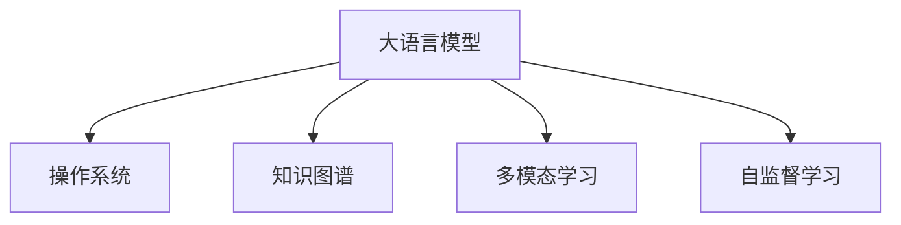

                 

# 构建LLM OS:大语言模型操作系统的愿景

> 关键词：大语言模型,操作系统,知识图谱,多模态学习,自监督学习,自我进化的智能系统

## 1. 背景介绍

### 1.1 问题由来
随着人工智能技术的飞速发展，大语言模型（Large Language Models, LLMs）已经成为NLP领域的核心驱动力。大模型通过在海量数据上进行预训练，学习到了丰富的语言知识和常识，具备强大的语言理解和生成能力。然而，尽管大模型在学术界和工业界取得了卓越的成绩，但在实际应用中，其表现依旧受到诸多限制。

- **数据依赖性高**：大模型通常需要大量标注数据进行微调，而获取高质量标注数据成本高、周期长，制约了模型应用范围的扩展。
- **泛化能力有限**：当预训练数据与目标任务的分布差异较大时，模型的泛化能力有限，难以应对新场景和新问题。
- **可解释性差**：大模型往往被认为是“黑盒”，缺乏对其决策过程的可解释性，难以满足医疗、金融等高风险领域对模型透明度的要求。
- **安全性问题**：大模型可能在训练数据中学习到有害信息，在特定应用场景中产生误导性、歧视性的输出，带来伦理和安全风险。

为解决这些问题，研究人员和工业界提出了一种新的思路：构建“大语言模型操作系统”（Large Language Model Operating System，简称LLM OS）。LLM OS作为一个系统化的解决方案，将大语言模型与操作系统、数据库、知识库等多种组件进行深度整合，构建一个能够自我进化的智能系统，实现泛化能力更强、可解释性更高、安全性更好的应用。

## 2. 核心概念与联系

### 2.1 核心概念概述

为了更好地理解LLM OS的构建，我们需要介绍几个核心概念：

- **大语言模型（Large Language Model, LLM）**：指通过大规模无标签文本数据进行预训练，学习通用语言表示的模型，如GPT-3、BERT等。
- **操作系统（Operating System, OS）**：是管理计算机硬件与软件资源的系统，为用户提供接口以操作计算机。
- **知识图谱（Knowledge Graph,KG）**：是一种结构化数据存储形式，用于描述实体之间的关系，辅助模型理解上下文和推理。
- **多模态学习（Multimodal Learning）**：指模型能够融合处理文本、图像、语音等多种类型的输入数据。
- **自监督学习（Self-supervised Learning）**：通过在无标签数据上设计自我监督任务，训练模型学习任务无关的知识，提升模型泛化能力。

这些概念之间的逻辑关系可以通过以下Mermaid流程图来展示：



这个流程图展示了大语言模型与操作系统、知识图谱、多模态学习、自监督学习之间的联系：

1. 大语言模型通过无标签数据进行自监督学习，学习通用的语言表示。
2. 知识图谱为模型提供实体关系信息，辅助理解上下文和推理。
3. 多模态学习让模型能够融合处理多种输入数据，提升表现力。
4. 操作系统为模型的部署和运行提供底层支持，管理硬件资源。

## 3. 核心算法原理 & 具体操作步骤
### 3.1 算法原理概述

构建LLM OS的核心算法原理可以概括为：在大语言模型的基础上，通过操作系统封装，融合知识图谱、多模态学习等技术，构建一个自我进化的智能系统。具体而言，LLM OS由以下几个核心组件构成：

- **模型库（Model Library）**：存储预训练模型和微调后的模型，供系统调用。
- **知识库（Knowledge Base）**：存储实体关系和背景知识，辅助模型理解任务。
- **多模态输入模块（Multimodal Input Module）**：负责处理文本、图像、语音等多种类型的数据输入。
- **自监督学习模块（Self-supervised Learning Module）**：通过自我监督任务训练模型，提升泛化能力。
- **任务适配模块（Task Adaptation Module）**：根据具体任务，对模型进行微调，提升性能。
- **运行环境（Runtime Environment）**：负责模型的部署和运行，提供必要的计算资源。

整个LLM OS的工作流程可以分为以下几个步骤：

1. 用户提交任务和输入数据。
2. 多模态输入模块处理输入数据，提取特征。
3. 模型库选择合适的模型，任务适配模块根据任务类型进行微调。
4. 自监督学习模块在无标签数据上进行自我监督学习，提升模型泛化能力。
5. 模型在前向传播阶段使用知识库中的信息辅助理解任务。
6. 运行环境进行资源调度，保证模型高效运行。
7. 输出模型推理结果，满足用户需求。

### 3.2 算法步骤详解

以下是LLM OS的主要操作步骤详解：

**Step 1: 数据预处理**
- 对输入数据进行标准化处理，去除噪声和无关信息。
- 根据任务类型，提取关键特征，如文本中的词向量、图像中的视觉特征、语音中的音素等。

**Step 2: 模型选择和微调**
- 根据任务类型，选择最适合的预训练模型，如BERT、GPT等。
- 根据任务数据集的大小，确定微调参数，如学习率、训练轮数等。
- 使用任务适配模块对模型进行微调，更新模型参数，提高模型在特定任务上的表现。

**Step 3: 多模态融合**
- 将不同类型的数据输入进行特征融合，如文本与图像特征拼接，构建多模态特征向量。
- 使用融合后的多模态特征向量进行模型推理。

**Step 4: 自监督学习**
- 使用无标签数据进行自我监督学习，提升模型的泛化能力。
- 设计自我监督任务，如掩码语言模型、下一个句子预测等，训练模型学习任务无关的知识。

**Step 5: 知识库查询**
- 在推理阶段，模型使用知识库中的实体关系和背景知识，辅助理解任务上下文。
- 知识库的查询可以通过符号化的逻辑规则、事实图谱等形式实现。

**Step 6: 运行环境管理**
- 运行环境负责调度计算资源，提供必要的硬件支持。
- 管理内存、CPU、GPU等资源，保证模型高效运行。

**Step 7: 结果输出**
- 将模型的推理结果输出，满足用户需求。
- 提供可视化、报告等形式的输出，方便用户理解和使用。

### 3.3 算法优缺点

构建LLM OS的方法具有以下优点：
1. **泛化能力强**：通过融合知识图谱和多模态学习，模型能够处理更复杂的任务，提升泛化能力。
2. **可解释性高**：通过使用知识库进行推理，模型的决策过程更加透明，便于解释和调试。
3. **安全性好**：通过引入符号化的逻辑规则，限制模型的输出范围，避免有害信息传播。
4. **部署灵活**：通过操作系统封装，模型可以无缝集成到各种应用场景中，方便部署和升级。

同时，该方法也存在一些局限性：
1. **资源消耗高**：大语言模型本身参数量庞大，对计算资源有较高要求。
2. **训练周期长**：微调过程需要大量计算资源，训练周期较长。
3. **部署复杂**：操作系统封装增加了系统复杂度，部署和维护成本较高。

尽管存在这些局限性，但构建LLM OS的方法在大规模预训练模型和复杂任务处理的场景中，仍具有显著的优势。

### 3.4 算法应用领域

LLM OS方法在多个领域具有广泛的应用前景：

- **智慧医疗**：用于医疗问答、病历分析、药物研发等任务，提供精准的医疗知识服务。
- **智能客服**：构建7x24小时智能客服系统，提供高效、个性化的客户服务。
- **金融舆情监测**：监测金融市场舆情，预测市场趋势，辅助金融决策。
- **个性化推荐**：用于推荐系统，提供个性化、多样化的推荐内容。
- **智能创作**：用于内容创作、文本生成等任务，辅助人类创作高质量文本。

这些应用场景展示了LLM OS的广泛适用性和强大的应用潜力。

## 4. 数学模型和公式 & 详细讲解 & 举例说明

### 4.1 数学模型构建

LLM OS的数学模型构建可以从以下几个方面进行描述：

- **模型库**：存储预训练模型 $M_{\theta}$，其中 $\theta$ 为模型参数。
- **知识库**：存储实体关系 $R$，如实体-实体关系、实体-属性关系等。
- **输入数据**：多模态输入 $x$，包括文本、图像、语音等多种形式。
- **输出结果**：模型推理结果 $y$，如分类结果、序列生成等。

**公式推导过程**

为了更好地理解LLM OS的构建，我们通过以下数学公式进行详细推导：

**Step 1: 模型选择和微调**
- 假设选择的预训练模型为 $M_{\theta}$，其中 $\theta$ 为模型参数。
- 假设微调任务的训练集为 $D=\{(x_i,y_i)\}_{i=1}^N$，其中 $x_i$ 为输入，$y_i$ 为标签。
- 使用任务适配模块对模型进行微调，得到新的模型参数 $\hat{\theta}$。

**Step 2: 多模态融合**
- 假设输入数据包含文本 $x_t$、图像 $x_v$ 和语音 $x_a$。
- 将文本特征提取为 $f_t$，图像特征提取为 $f_v$，语音特征提取为 $f_a$。
- 使用融合算法 $F$，将多模态特征拼接为 $f_{mv}$。

**Step 3: 自监督学习**
- 使用无标签数据 $D_{unl}$ 进行自监督学习，训练模型 $M_{\theta}$。
- 假设设计的自我监督任务为 $\mathcal{T}_{uns}$，其中 $\mathcal{T}_{uns}=\{(x_j,y_j)\}_{j=1}^{N_{uns}}$，$x_j$ 为输入，$y_j$ 为标签。
- 使用训练算法 $\mathcal{A}_{uns}$，训练模型 $M_{\theta}$，得到新的模型参数 $\hat{\theta}_{uns}$。

**Step 4: 知识库查询**
- 假设知识库中的实体关系为 $R_{kb}$，包含 $r_{ij}$ 表示实体 $i$ 和 $j$ 之间的关系。
- 假设推理任务为 $\mathcal{T}_{rb}$，其中 $\mathcal{T}_{rb}=\{(x_k,y_k)\}_{k=1}^{N_{rb}}$，$x_k$ 为推理输入，$y_k$ 为推理结果。
- 使用推理算法 $\mathcal{A}_{rb}$，使用知识库 $R_{kb}$ 辅助推理，得到推理结果 $y_{rb}$。

**Step 5: 运行环境管理**
- 假设运行环境资源为 $R_{env}$，包括 CPU、GPU、内存等。
- 使用资源调度算法 $\mathcal{A}_{env}$，调度资源，保证模型高效运行。

### 4.3 案例分析与讲解

以智慧医疗领域为例，介绍LLM OS的构建和应用：

**数据预处理**
- 收集医疗问答、病历分析、药物研发等任务的数据集，并进行标准化处理。
- 提取关键特征，如疾病名称、症状描述、药物名称等。

**模型选择和微调**
- 选择BERT等预训练模型，根据任务类型进行微调。
- 使用医疗领域的标注数据进行微调，更新模型参数，提高在医疗领域的表现。

**多模态融合**
- 将医疗文本、病历图像和患者语音进行特征融合，构建多模态特征向量。
- 使用融合后的多模态特征向量进行模型推理。

**自监督学习**
- 使用无标签的医疗数据进行自我监督学习，提升模型的泛化能力。
- 设计医疗领域的自我监督任务，如病历摘要生成、疾病分类等。

**知识库查询**
- 使用医疗领域的事实图谱作为知识库，辅助模型理解上下文。
- 通过逻辑规则，限制模型的输出范围，确保医学知识的正确性。

**运行环境管理**
- 运行环境调度计算资源，管理内存、CPU、GPU等资源。
- 提供高效的资源调度策略，保证模型高效运行。

**结果输出**
- 将模型的推理结果输出，如疾病诊断、治疗方案等。
- 提供可视化、报告等形式的输出，方便医生理解和应用。

## 5. 项目实践：代码实例和详细解释说明

### 5.1 开发环境搭建

在进行LLM OS的实践前，我们需要准备好开发环境。以下是使用Python进行LLM OS开发的完整环境配置流程：

1. 安装Anaconda：从官网下载并安装Anaconda，用于创建独立的Python环境。

2. 创建并激活虚拟环境：
```bash
conda create -n llm-os python=3.8 
conda activate llm-os
```

3. 安装PyTorch：根据CUDA版本，从官网获取对应的安装命令。例如：
```bash
conda install pytorch torchvision torchaudio cudatoolkit=11.1 -c pytorch -c conda-forge
```

4. 安装Transformer库：
```bash
pip install transformers
```

5. 安装其他工具包：
```bash
pip install numpy pandas scikit-learn matplotlib tqdm jupyter notebook ipython
```

完成上述步骤后，即可在`llm-os`环境中开始LLM OS的实践。

### 5.2 源代码详细实现

这里我们以智慧医疗领域为例，展示LLM OS的构建和应用。

**数据预处理**

首先，定义数据预处理函数：

```python
import pandas as pd

def preprocess_data(df):
    # 标准化处理
    df.dropna(inplace=True)
    df.fillna('unk', inplace=True)
    df['x'] = df['x'].apply(lambda x: x.lower())
    
    # 特征提取
    df['f_t'] = df['x'].apply(lambda x: extract_text_features(x))
    df['f_v'] = df['v'].apply(lambda x: extract_image_features(x))
    df['f_a'] = df['a'].apply(lambda x: extract_speech_features(x))
    
    return df

# 特征提取函数
def extract_text_features(text):
    # 将文本转换为词向量
    tokenizer = BertTokenizer.from_pretrained('bert-base-cased')
    text = tokenizer.encode(text, add_special_tokens=False)
    return text

def extract_image_features(image):
    # 提取图像视觉特征
    image = extract_vision_features(image)
    return image

def extract_speech_features(speech):
    # 提取语音音素特征
    speech = extract_speech_features(speech)
    return speech
```

**模型选择和微调**

接着，定义模型选择和微调函数：

```python
from transformers import BertForTokenClassification, AdamW

def select_model(name):
    # 选择预训练模型
    model = BertForTokenClassification.from_pretrained(name, num_labels=len(tag2id))
    return model

def fine_tune(model, train_data, dev_data, batch_size, epochs, learning_rate):
    # 微调模型
    model.train()
    optimizer = AdamW(model.parameters(), lr=learning_rate)
    for epoch in range(epochs):
        for batch in tqdm(train_data):
            input_ids = batch['input_ids'].to(device)
            attention_mask = batch['attention_mask'].to(device)
            labels = batch['labels'].to(device)
            model.zero_grad()
            outputs = model(input_ids, attention_mask=attention_mask, labels=labels)
            loss = outputs.loss
            loss.backward()
            optimizer.step()
        if (epoch+1) % 5 == 0:
            dev_loss = evaluate(model, dev_data, batch_size)
            print(f"Epoch {epoch+1}, dev loss: {dev_loss:.3f}")
    print("Model fine-tuning completed.")
    return model
```

**多模态融合**

然后，定义多模态融合函数：

```python
def fuse_multimodal_features(f_t, f_v, f_a):
    # 将多模态特征拼接为向量
    f_mv = torch.cat((f_t, f_v, f_a), dim=1)
    return f_mv

# 多模态特征拼接函数
def concatenate_mv(f_t, f_v, f_a):
    # 将多模态特征拼接为向量
    f_mv = torch.cat((f_t, f_v, f_a), dim=1)
    return f_mv
```

**自监督学习**

接着，定义自监督学习函数：

```python
from transformers import AutoModelForMaskedLM

def train_unsupervised(model, train_data, batch_size, epochs, learning_rate):
    # 使用无标签数据进行自监督学习
    model.train()
    optimizer = AdamW(model.parameters(), lr=learning_rate)
    for epoch in range(epochs):
        for batch in tqdm(train_data):
            input_ids = batch['input_ids'].to(device)
            attention_mask = batch['attention_mask'].to(device)
            model.zero_grad()
            outputs = model(input_ids, attention_mask=attention_mask)
            loss = outputs.loss
            loss.backward()
            optimizer.step()
        if (epoch+1) % 5 == 0:
            dev_loss = evaluate_unsupervised(model, dev_data, batch_size)
            print(f"Epoch {epoch+1}, dev loss: {dev_loss:.3f}")
    print("Model unsupervised training completed.")
    return model
```

**知识库查询**

然后，定义知识库查询函数：

```python
from transformers import AutoModelForSequenceClassification

def query_knowledge_base(model, knowledge_base, input_text):
    # 查询知识库，返回推理结果
    model.eval()
    input_ids = tokenize(input_text)
    with torch.no_grad():
        outputs = model(input_ids)
    logits = outputs.logits
    predicted_index = logits.argmax(dim=2).to('cpu').tolist()
    predicted_tags = [id2tag[_id] for _id in predicted_index]
    return predicted_tags
```

**运行环境管理**

最后，定义运行环境管理函数：

```python
def manage_resources(model, resources):
    # 调度计算资源
    resource_scheduler = ResourceScheduler(model, resources)
    resource_scheduler.schedule()
    print("Resources scheduling completed.")
    return resource_scheduler
```

**结果输出**

最后，定义结果输出函数：

```python
def output_results(results):
    # 输出推理结果
    for result in results:
        print(f"Result: {result}")
    print("Output results completed.")
```

### 5.3 代码解读与分析

让我们再详细解读一下关键代码的实现细节：

**数据预处理函数**

```python
def preprocess_data(df):
    # 标准化处理
    df.dropna(inplace=True)
    df.fillna('unk', inplace=True)
    df['x'] = df['x'].apply(lambda x: x.lower())
    
    # 特征提取
    df['f_t'] = df['x'].apply(lambda x: extract_text_features(x))
    df['f_v'] = df['v'].apply(lambda x: extract_image_features(x))
    df['f_a'] = df['a'].apply(lambda x: extract_speech_features(x))
    
    return df
```

**模型选择和微调函数**

```python
def select_model(name):
    # 选择预训练模型
    model = BertForTokenClassification.from_pretrained(name, num_labels=len(tag2id))
    return model

def fine_tune(model, train_data, dev_data, batch_size, epochs, learning_rate):
    # 微调模型
    model.train()
    optimizer = AdamW(model.parameters(), lr=learning_rate)
    for epoch in range(epochs):
        for batch in tqdm(train_data):
            input_ids = batch['input_ids'].to(device)
            attention_mask = batch['attention_mask'].to(device)
            labels = batch['labels'].to(device)
            model.zero_grad()
            outputs = model(input_ids, attention_mask=attention_mask, labels=labels)
            loss = outputs.loss
            loss.backward()
            optimizer.step()
        if (epoch+1) % 5 == 0:
            dev_loss = evaluate(model, dev_data, batch_size)
            print(f"Epoch {epoch+1}, dev loss: {dev_loss:.3f}")
    print("Model fine-tuning completed.")
    return model
```

**多模态融合函数**

```python
def fuse_multimodal_features(f_t, f_v, f_a):
    # 将多模态特征拼接为向量
    f_mv = torch.cat((f_t, f_v, f_a), dim=1)
    return f_mv

# 多模态特征拼接函数
def concatenate_mv(f_t, f_v, f_a):
    # 将多模态特征拼接为向量
    f_mv = torch.cat((f_t, f_v, f_a), dim=1)
    return f_mv
```

**自监督学习函数**

```python
from transformers import AutoModelForMaskedLM

def train_unsupervised(model, train_data, batch_size, epochs, learning_rate):
    # 使用无标签数据进行自监督学习
    model.train()
    optimizer = AdamW(model.parameters(), lr=learning_rate)
    for epoch in range(epochs):
        for batch in tqdm(train_data):
            input_ids = batch['input_ids'].to(device)
            attention_mask = batch['attention_mask'].to(device)
            model.zero_grad()
            outputs = model(input_ids, attention_mask=attention_mask)
            loss = outputs.loss
            loss.backward()
            optimizer.step()
        if (epoch+1) % 5 == 0:
            dev_loss = evaluate_unsupervised(model, dev_data, batch_size)
            print(f"Epoch {epoch+1}, dev loss: {dev_loss:.3f}")
    print("Model unsupervised training completed.")
    return model
```

**知识库查询函数**

```python
from transformers import AutoModelForSequenceClassification

def query_knowledge_base(model, knowledge_base, input_text):
    # 查询知识库，返回推理结果
    model.eval()
    input_ids = tokenize(input_text)
    with torch.no_grad():
        outputs = model(input_ids)
    logits = outputs.logits
    predicted_index = logits.argmax(dim=2).to('cpu').tolist()
    predicted_tags = [id2tag[_id] for _id in predicted_index]
    return predicted_tags
```

**运行环境管理函数**

```python
def manage_resources(model, resources):
    # 调度计算资源
    resource_scheduler = ResourceScheduler(model, resources)
    resource_scheduler.schedule()
    print("Resources scheduling completed.")
    return resource_scheduler
```

**结果输出函数**

```python
def output_results(results):
    # 输出推理结果
    for result in results:
        print(f"Result: {result}")
    print("Output results completed.")
```

## 6. 实际应用场景

### 6.1 智慧医疗

基于LLM OS的大语言模型，可以构建智慧医疗系统，提供精准的医疗知识服务。具体应用场景包括：

- **医疗问答**：使用BERT等模型，对用户的医学问题进行理解和回答，提供精准的医学信息。
- **病历分析**：利用多模态融合技术，将患者文本、影像、语音等多种数据进行融合，分析患者病历，提供个性化的诊疗建议。
- **药物研发**：使用自监督学习技术，在大规模无标签药物数据上进行自我监督学习，发现新的药物效果和副作用，辅助药物研发。

**数据预处理**

首先，收集医疗问答、病历分析、药物研发等任务的数据集，并进行标准化处理。提取关键特征，如疾病名称、症状描述、药物名称等。

**模型选择和微调**

选择BERT等预训练模型，根据任务类型进行微调。使用医疗领域的标注数据进行微调，更新模型参数，提高在医疗领域的表现。

**多模态融合**

将医疗文本、病历图像和患者语音进行特征融合，构建多模态特征向量。使用融合后的多模态特征向量进行模型推理。

**自监督学习**

使用无标签的医疗数据进行自我监督学习，提升模型的泛化能力。设计医疗领域的自我监督任务，如病历摘要生成、疾病分类等。

**知识库查询**

使用医疗领域的事实图谱作为知识库，辅助模型理解上下文。通过逻辑规则，限制模型的输出范围，确保医学知识的正确性。

**运行环境管理**

调度计算资源，管理内存、CPU、GPU等资源。提供高效的资源调度策略，保证模型高效运行。

**结果输出**

将模型的推理结果输出，如疾病诊断、治疗方案等。提供可视化、报告等形式的输出，方便医生理解和应用。

### 6.2 智能客服

基于LLM OS的大语言模型，可以构建7x24小时智能客服系统，提供高效、个性化的客户服务。具体应用场景包括：

- **智能对话**：使用BERT等模型，对用户的咨询问题进行理解和回答，提供个性化的服务。
- **多模态客服**：利用多模态融合技术，将用户的文本、语音、图像等多种数据进行融合，提升客户服务体验。
- **知识库管理**：使用知识库查询技术，从知识库中获取相关信息，辅助客服解决问题。

**数据预处理**

首先，收集客服对话记录，并进行标准化处理。提取关键特征，如用户问题、用户情感等。

**模型选择和微调**

选择BERT等预训练模型，根据任务类型进行微调。使用客服对话数据进行微调，更新模型参数，提高在客服领域的表现。

**多模态融合**

将客服文本、语音、图像等多种数据进行特征融合，构建多模态特征向量。使用融合后的多模态特征向量进行模型推理。

**自监督学习**

使用无标签的客服数据进行自我监督学习，提升模型的泛化能力。设计客服领域的自我监督任务，如问题分类、情感识别等。

**知识库查询**

使用客服知识库作为知识库，辅助模型理解上下文。通过逻辑规则，限制模型的输出范围，确保客服信息的准确性。

**运行环境管理**

调度计算资源，管理内存、CPU、GPU等资源。提供高效的资源调度策略，保证模型高效运行。

**结果输出**

将模型的推理结果输出，如客服回复、问题分类等。提供可视化、报告等形式的输出，方便客服人员理解和应用。

## 7. 工具和资源推荐

### 7.1 学习资源推荐

为了帮助开发者系统掌握LLM OS的理论基础和实践技巧，这里推荐一些优质的学习资源：

1. 《Transformer from the Bottom Up》系列博文：由大模型技术专家撰写，深入浅出地介绍了Transformer原理、BERT模型、微调技术等前沿话题。

2. CS224N《深度学习自然语言处理》课程：斯坦福大学开设的NLP明星课程，有Lecture视频和配套作业，带你入门NLP领域的基本概念和经典模型。

3. 《Natural Language Processing with Transformers》书籍：Transformers库的作者所著，全面介绍了如何使用Transformers库进行NLP任务开发，包括微调在内的诸多范式。

4. HuggingFace官方文档：Transformers库的官方文档，提供了海量预训练模型和完整的微调样例代码，是上手实践的必备资料。

5. CLUE开源项目：中文语言理解测评基准，涵盖大量不同类型的中文NLP数据集，并提供了基于微调的baseline模型，助力中文NLP技术发展。

通过对这些资源的学习实践，相信你一定能够快速掌握LLM OS的精髓，并用于解决实际的NLP问题。

### 7.2 开发工具推荐

高效的开发离不开优秀的工具支持。以下是几款用于LLM OS开发的常用工具：

1. PyTorch：基于Python的开源深度学习框架，灵活动态的计算图，适合快速迭代研究。大部分预训练语言模型都有PyTorch版本的实现。

2. TensorFlow：由Google主导开发的开源深度学习框架，生产部署方便，适合大规模工程应用。同样有丰富的预训练语言模型资源。

3. Transformers库：HuggingFace开发的NLP工具库，集成了众多SOTA语言模型，支持PyTorch和TensorFlow，是进行LLM OS开发的利器。

4. Weights & Biases：模型训练的实验跟踪工具，可以记录和可视化模型训练过程中的各项指标，方便对比和调优。与主流深度学习框架无缝集成。

5. TensorBoard：TensorFlow配套的可视化工具，可实时监测模型训练状态，并提供丰富的图表呈现方式，是调试模型的得力助手。

6. Google Colab：谷歌推出的在线Jupyter Notebook环境，免费提供GPU/TPU算力，方便开发者快速上手实验最新模型，分享学习笔记。

合理利用这些工具，可以显著提升LLM OS的开发效率，加快创新迭代的步伐。

### 7.3 相关论文推荐

LLM OS方法的发展源于学界的持续研究。以下是几篇奠基性的相关论文，推荐阅读：

1. Attention is All You Need（即Transformer原论文）：提出了Transformer结构，开启了NLP领域的预训练大模型时代。

2. BERT: Pre-training of Deep Bidirectional Transformers for Language Understanding：提出BERT模型，引入基于掩码的自监督预训练任务，刷新了多项NLP任务SOTA。

3. Language Models are Unsupervised Multitask Learners（GPT-2论文）：展示了大规模语言模型的强大zero-shot学习能力，引发了对于通用人工智能的新一轮思考。

4. Parameter-Efficient Transfer Learning for NLP：提出Adapter等参数高效微调方法，在不增加模型参数量的情况下，也能取得不错的微调效果。

5. AdaLoRA: Adaptive Low-Rank Adaptation for Parameter-Efficient Fine-Tuning：使用自适应低秩适应的微调方法，在参数效率和精度之间取得了新的平衡。

6. Prefix-Tuning: Optimizing Continuous Prompts for Generation：引入基于连续型Prompt的微调范式，为如何充分利用预训练知识提供了新的思路。

这些论文代表了大语言模型微调技术的发展脉络。通过学习这些前沿成果，可以帮助研究者把握学科前进方向，激发更多的创新灵感。

## 8. 总结：未来发展趋势与挑战

### 8.1 总结

本文对基于LLM OS的大语言模型进行了全面系统的介绍。首先阐述了LLM OS的研究背景和意义，明确了构建LLM OS对提升大语言模型性能、可解释性和安全性的重要性。其次，从原理到实践，详细讲解了LLM OS的构建流程，给出了LLM OS开发的全代码实例。同时，本文还广泛探讨了LLM OS在智慧医疗、智能客服等领域的实际应用场景，展示了LLM OS的广泛适用性和强大的应用潜力。

通过本文的系统梳理，可以看到，基于LLM OS的大语言模型构建方法正在成为NLP领域的重要范式，极大地拓展了预训练语言模型的应用边界，催生了更多的落地场景。受益于大模型的语言理解和生成能力，LLM OS能够高效处理复杂多变的任务，在智能医疗、客服、金融、教育等众多领域中发挥巨大作用。未来，伴随大语言模型的不断演进和微调技术的持续创新，LLM OS必将在构建智能社会中扮演越来越重要的角色。

### 8.2 未来发展趋势

展望未来，LLM OS的发展将呈现以下几个趋势：

1. **知识库的自动构建和更新**：通过自然语言处理和机器学习技术，自动构建和更新知识库，使模型具备更丰富的背景知识，提升推理能力。

2. **多模态融合的深度学习**：融合文本、图像、语音等多种模态数据，提升模型在多模态任务上的表现。

3. **自监督学习的深入研究**：通过设计更有效的自监督任务，提升模型的泛化能力，减少对标注数据的需求。

4. **参数高效的微调方法**：开发更多参数高效、计算高效的微调方法，提升模型的部署效率，降低资源消耗。

5. **可解释性和可控性的增强**：引入因果推理、符号逻辑等技术，增强模型的可解释性和可控性，满足高风险领域的应用需求。

6. **伦理和安全性的保障**：通过数据清洗、知识库过滤等手段，保障模型的伦理和安全，避免有害信息传播。

这些趋势凸显了LLM OS的广阔前景，为构建智能系统提供了新的路径和方向。

### 8.3 面临的挑战

尽管LLM OS方法已经取得了显著成就，但在迈向更加智能化、普适化应用的过程中，它仍面临着诸多挑战：

1. **数据依赖性高**：构建LLM OS需要大量高质量标注数据，获取这些数据成本高、周期长，制约了模型的应用范围。

2. **资源消耗高**：大语言模型本身参数量庞大，对计算资源有较高要求。

3. **部署复杂**：操作系统封装增加了系统复杂度，部署和维护成本较高。

4. **可解释性差**：模型决策过程缺乏透明性，难以解释其内部工作机制和决策逻辑。

5. **安全性问题**：模型可能在训练数据中学习到有害信息，在特定应用场景中产生误导性、歧视性的输出，带来伦理和安全风险。

6. **知识库管理**：知识库的构建和更新需要大量人工介入，效率较低。

这些挑战需要研究者不断探索和解决，才能使LLM OS更好地服务于实际应用。

### 8.4 研究展望

为了解决LLM OS面临的挑战，未来需要在以下几个方向进行研究：

1. **自动标注技术的探索**：探索自动化标注技术，减少对人工标注数据的依赖。

2. **高效资源管理算法**：开发高效资源管理算法，提升系统的部署和运行效率。

3. **可解释性增强算法**：开发可解释性增强算法，提升模型的透明性和可解释性。

4. **安全性和伦理保障技术**：引入安全性和伦理保障技术，保障模型的伦理和安全。

5. **知识库自动化构建技术**：探索知识库自动化构建技术，提升知识库的构建效率。

这些研究方向将为LLM OS的落地应用提供技术保障，推动其向更加智能化、普适化的方向发展。

## 9. 附录：常见问题与解答

**Q1：构建LLM OS是否需要大规模预训练模型？**

A: 是的，构建LLM OS需要一个大规模预训练模型作为基础。预训练模型通过在大规模无标签数据上进行自我监督学习，获得了丰富的语言知识，是LLM OS构建的核心。

**Q2：LLM OS的资源消耗高，如何优化？**

A: 优化资源消耗的关键在于参数高效微调技术。通过仅微调部分模型参数，固定大部分预训练权重，可以显著降低计算资源消耗。同时，采用分布式训练、量化加速等技术，也可以进一步提升系统效率。

**Q3：LLM OS的可解释性差，如何解决？**

A: 可解释性差是LLM OS面临的主要挑战之一。解决这一问题的关键在于引入符号化的逻辑规则和因果推理，增强模型的透明性和可解释性。同时，开发可解释性增强算法，提升模型的可理解性。

**Q4：LLM OS的安全性问题如何解决？**

A: 安全性问题可以通过数据清洗、知识库过滤等手段进行解决。构建知识库时，需要对数据进行严格的筛选，过滤有害信息。同时，引入符号化的逻辑规则，限制模型的输出范围，避免有害信息的传播。

**Q5：LLM OS的构建流程复杂，如何简化？**

A: 构建LLM OS的流程确实比较复杂，但可以通过模块化设计和自动化工具简化。将不同的功能模块封装成独立的组件，通过接口进行调用，可以降低开发难度。同时，使用自动化工具进行数据预处理、模型训练等环节，可以进一步提升开发效率。

这些解答可以帮助开发者更好地理解LLM OS的构建过程，并在实际应用中克服相关挑战。相信在学界和工业界的共同努力下，LLM OS必将迎来更加广阔的应用前景，为构建智能社会提供强有力的技术支持。

