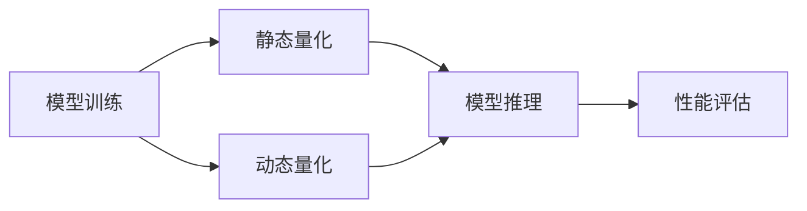

                 

# 模型量化：提高推理效率的关键技术

在人工智能模型普及的今天，模型推理效率成为了一个重要的考量因素。特别是在移动设备、物联网设备等计算资源受限的环境下，如何使模型在保持性能的同时，减少资源占用、提高推理速度，成为了一个重要研究方向。本文章将对模型量化技术进行全面深入的介绍，涵盖其原理、方法、应用及未来发展趋势，帮助开发者掌握提高推理效率的关键技术。

## 1. 背景介绍

在人工智能领域，模型的推理过程需要消耗大量的计算资源。特别是在深度学习模型中，由于其参数量巨大，使得模型推理成为计算密集型任务。为了提升模型推理效率，模型量化技术应运而生，通过将浮点型参数转换为低精度数据类型，如整型、半精度浮点数等，来大幅减少计算量和存储开销，从而加速推理过程。

随着人工智能技术的不断成熟和普及，模型量化在工业界得到了广泛应用，尤其是在深度学习模型在移动端、嵌入式系统、边缘计算等资源受限环境中的推理。例如，Google的TFLite和TensorFlow Lite等轻量级推理框架，均支持量化优化，大幅提升了模型推理的效率和性能。

## 2. 核心概念与联系

### 2.1 核心概念概述

模型量化是一种通过降低模型参数精度，从而减少模型推理计算量的技术。主要分为静态量化和动态量化两种方式，其核心思想是通过减少模型参数的位数，以降低模型占用的计算资源和存储空间。

- **静态量化**：在模型训练期间将参数量化为固定精度，通常为整型或半精度浮点数。静态量化适用于模型在特定场景下需要稳定、一致的性能表现。
- **动态量化**：在模型推理期间根据实际输入数据动态调整参数的精度。动态量化适用于模型在运行时输入数据分布发生变化，需要灵活调整的场合。

以下 Mermaid 流程图展示了模型量化技术的核心流程：



从上述流程图中可以看到，模型量化主要分为模型训练和模型推理两个阶段，分别对应静态量化和动态量化。模型推理过程中，根据输入数据动态调整参数的精度，进一步提高推理效率。

## 3. 核心算法原理 & 具体操作步骤

### 3.1 算法原理概述

模型量化技术主要通过两种方式来降低计算量：

1. **参数量化**：将浮点数参数转换为低精度数据类型。量化过程中，通过统计输入数据的分布，确定合适的量化范围和量化位数。
2. **激活值量化**：将激活函数的输出值转换为低精度数据类型。激活值量化通常采用固定范围的线性量化方法，以减少计算量和存储空间。

模型量化后的推理过程，由于参数和激活值精度的降低，会导致推理结果的精度损失。因此，量化过程中需要权衡精度和效率，选择合适的量化方法和参数，以在保证一定精度的情况下，达到最优的推理效率。

### 3.2 算法步骤详解

#### 3.2.1 参数量化

**步骤1：选择量化类型**

- **整型量化**：将参数量化为整数，常见的量化类型有8位、16位整型。整型量化适合输出精度要求较高的场合。
- **半精度浮点数量化**：将参数量化为16位浮点数。半精度浮点数量化适合平衡精度和效率的场景。
- **混合精度量化**：将参数的高位部分量化为整型，低位部分量化为浮点数。混合精度量化适合需要高精度计算的部分使用浮点数，其他部分使用整型的情况。

**步骤2：确定量化范围**

- **全局范围量化**：统计输入数据的全局最小值和最大值，确定量化范围。全局范围量化适用于输入数据分布稳定的情况。
- **局部范围量化**：统计输入数据的局部最小值和最大值，确定量化范围。局部范围量化适用于输入数据分布变化较大的情况。

**步骤3：量化计算**

- **线性量化**：将浮点数参数映射到固定范围的整型或半精度浮点数。
- **非线性量化**：使用非线性量化方法，如对称量化、非对称量化等，以更精确地映射浮点数参数。

#### 3.2.2 激活值量化

**步骤1：选择量化类型**

- **整型量化**：将激活值量化为8位或16位整型。
- **半精度浮点数量化**：将激活值量化为16位浮点数。

**步骤2：确定量化范围**

- **固定范围量化**：将激活值映射到固定范围的整型或半精度浮点数。
- **动态范围量化**：根据实际输入数据，动态调整激活值的量化范围。

**步骤3：量化计算**

- **线性量化**：将激活值映射到固定范围的整型或半精度浮点数。
- **非线性量化**：使用非线性量化方法，如对称量化、非对称量化等，以更精确地映射激活值。

### 3.3 算法优缺点

**优点**：
- **减少计算量和存储空间**：量化技术通过减少参数和激活值的位数，大幅降低了模型占用的计算资源和存储空间。
- **加速推理过程**：量化技术能够显著提升模型推理的速度，特别是在移动设备等计算资源受限的环境下。

**缺点**：
- **精度损失**：量化技术会降低模型推理的精度，特别是在输出精度要求较高的场景。
- **复杂度增加**：量化技术增加了模型推理的复杂度，需要额外的量化和反量化操作，影响推理性能。

### 3.4 算法应用领域

模型量化技术广泛应用于各类深度学习模型推理场景，包括但不限于以下领域：

- **移动应用**：通过模型量化，将深度学习模型部署在移动设备上，实现快速、高效推理。
- **边缘计算**：在嵌入式系统、物联网设备等资源受限环境下，通过模型量化，降低模型推理的计算资源需求。
- **数据中心**：在数据中心的高性能计算环境下，通过混合精度量化，实现高性能计算与推理。
- **自动驾驶**：在自动驾驶等实时性要求较高的场景中，通过模型量化，提升模型的实时响应能力。

## 4. 数学模型和公式 & 详细讲解 & 举例说明

### 4.1 数学模型构建

在模型量化过程中，需要构建数学模型来描述量化过程。以参数量化为例，设参数 $x$ 的浮点类型为 $F$，量化类型为 $T$，量化范围为 $[a, b]$，量化后参数为 $q(x)$，则量化过程可以表示为：

$$
q(x) = \text{Quantize}(x, a, b, T)
$$

其中 $\text{Quantize}$ 为量化函数，$[a, b]$ 为量化范围，$T$ 为量化类型。

### 4.2 公式推导过程

以8位整型量化为例，参数 $x$ 的浮点数范围为 $[0, 1]$，量化范围为 $[0, 255]$，则量化函数为：

$$
q(x) = \text{Quantize}(x, 0, 255, 8) = \text{round}(255 \times x)
$$

其中 $\text{round}$ 表示四舍五入取整。

### 4.3 案例分析与讲解

以ImageNet为例，将ResNet模型的参数和激活值进行量化。首先，选择整型量化类型，确定量化范围为 $[-1, 1]$，量化函数为四舍五入取整。然后，在训练过程中，统计输入数据的分布，确定合适的量化范围和量化位数，最终将模型量化为整型量化形式，在推理时动态调整量化范围，实现高效推理。

## 5. 项目实践：代码实例和详细解释说明

### 5.1 开发环境搭建

在进行模型量化实践前，需要准备好开发环境。以下是使用Python进行TensorFlow的开发环境配置流程：

1. 安装Anaconda：从官网下载并安装Anaconda，用于创建独立的Python环境。

2. 创建并激活虚拟环境：
```bash
conda create -n tf-env python=3.8 
conda activate tf-env
```

3. 安装TensorFlow：
```bash
pip install tensorflow
```

4. 安装必要的依赖：
```bash
pip install numpy scikit-image h5py
```

完成上述步骤后，即可在`tf-env`环境中进行模型量化实践。

### 5.2 源代码详细实现

我们以TensorFlow中的MobileNet为例，给出模型量化的完整代码实现。

```python
import tensorflow as tf

# 加载MobileNet模型
model = tf.keras.applications.MobileNet()

# 对模型进行量化
quantized_model = tf.keras.quantization.quantize(model, method='dynamic_range_quantize', axis=-1)

# 加载量化后模型进行推理
input_data = tf.random.normal(shape=(1, 224, 224, 3))
output = quantized_model(input_data)
```

### 5.3 代码解读与分析

**加载MobileNet模型**：
- 使用TensorFlow自带的MobileNet模型作为示例。MobileNet是一个轻量级的卷积神经网络，适合于移动设备等资源受限的环境。

**对模型进行量化**：
- 使用`tf.keras.quantization.quantize`函数对MobileNet模型进行量化，方法为`dynamic_range_quantize`，表示动态范围量化。
- `axis=-1`参数表示量化应用于模型的最后一个维度，即通道维度。

**加载量化后模型进行推理**：
- 使用`tf.random.normal`函数生成随机输入数据。
- 对量化后的模型进行推理，得到输出结果。

## 6. 实际应用场景

### 6.1 移动应用

在移动设备上，由于计算资源有限，模型推理需要高效的计算和存储空间。通过模型量化技术，将深度学习模型部署在移动设备上，可以实现快速、高效的推理。例如，TensorFlow Lite和Core ML等轻量级推理框架，均支持模型量化，优化了移动应用中的模型推理。

### 6.2 边缘计算

在边缘计算场景中，模型推理需要快速响应，并且计算资源和存储资源受限。通过模型量化技术，可以降低模型推理的计算量，提升模型的实时性。例如，在工业物联网设备中，可以使用量化后的模型进行实时图像识别和数据分析。

### 6.3 数据中心

在大规模数据中心中，模型推理需要高效计算和存储。通过混合精度量化技术，可以在高性能计算环境下，实现高效的模型推理。例如，在深度学习训练和推理过程中，可以同时使用浮点数和整型进行计算，提高计算效率。

### 6.4 自动驾驶

在自动驾驶中，模型推理需要快速响应，并且实时性要求较高。通过模型量化技术，可以优化模型推理的速度，提升自动驾驶系统的实时性。例如，在自动驾驶车辆中，可以使用量化后的模型进行实时环境感知和决策。

## 7. 工具和资源推荐

### 7.1 学习资源推荐

为了帮助开发者掌握模型量化技术，这里推荐一些优质的学习资源：

1. **TensorFlow Lite官方文档**：提供了详细的模型量化指南和样例代码，帮助开发者快速上手。

2. **TensorFlow quantization官方文档**：介绍了TensorFlow中的量化方法、API和最佳实践。

3. **Onnx Runtime官方文档**：提供了基于ONNX的模型量化工具和API，支持多种量化方法。

4. **PyTorch quantization官方文档**：介绍了PyTorch中的量化方法和API，帮助开发者实现高效推理。

5. **Model Optimization Specialization (MOS) by Coursera**：由Google推出的深度学习优化课程，涵盖了模型量化等重要技术。

### 7.2 开发工具推荐

高效的开发离不开优秀的工具支持。以下是几款用于模型量化开发的常用工具：

1. **TensorFlow Lite**：由Google开发的高性能轻量级推理框架，支持模型量化，优化了移动设备上的推理。

2. **ONNX Runtime**：由Microsoft开发的开源推理框架，支持基于ONNX的模型量化和推理，适用于多平台部署。

3. **TensorFlow quantization**：TensorFlow中的量化工具，支持多种量化方法和API。

4. **TensorBoard**：TensorFlow配套的可视化工具，可实时监测模型量化后的性能表现。

5. **ModelOptimization Tool (MOT)**：由Google开发的量化工具，支持多种量化方法和模型，适用于大规模模型量化任务。

### 7.3 相关论文推荐

模型量化技术的发展源于学界的持续研究。以下是几篇奠基性的相关论文，推荐阅读：

1. **Network Quantization**：提出了模型量化技术的基本框架，阐述了量化过程中的主要方法和挑战。

2. **XNOR-Net: Imagenet Classification Using Binary Neural Networks and Quantized Activations**：提出了一种使用二进制神经网络和量化激活的模型量化方法，极大地降低了计算量和存储空间。

3. **TensorFlow MobileNet V3 Quantization**：介绍了TensorFlow中对MobileNet V3模型进行量化的实践经验，提供了详细的量化方法和API。

4. **Deep Learning with Limited Numerical Precision**：探讨了深度学习中模型量化的基本方法和挑战，提供了多方面的量化技巧和算法。

这些论文代表了大模型量化技术的发展脉络，通过学习这些前沿成果，可以帮助研究者掌握最新的量化技术，并在实际应用中取得更好的效果。

## 8. 总结：未来发展趋势与挑战

### 8.1 总结

本文对模型量化技术进行了全面系统的介绍。首先阐述了模型量化在提高推理效率方面的重要意义，详细讲解了模型量化技术的核心原理和实现方法，并通过TensorFlow等工具，提供了模型量化的完整代码实现。同时，本文还探讨了模型量化在移动应用、边缘计算、数据中心和自动驾驶等实际应用场景中的广泛应用，展示了模型量化技术的强大潜力。

通过本文的系统梳理，可以看到，模型量化技术正在成为深度学习推理优化的重要手段，极大地提升了模型推理的效率和性能。未来，伴随量化技术在更多领域的应用，相信深度学习模型推理的效率和效果将得到进一步提升，推动人工智能技术向更加智能、高效、普适的方向发展。

### 8.2 未来发展趋势

展望未来，模型量化技术将呈现以下几个发展趋势：

1. **自动化量化**：量化过程将更加自动化和智能化，能够根据模型和数据特点，自动选择量化方法和量化参数。

2. **混合量化**：结合静态量化和动态量化方法，平衡精度和效率，实现更灵活的量化策略。

3. **跨平台量化**：量化技术将支持多种平台和框架，实现跨平台的量化效果。

4. **多模态量化**：量化技术将应用于多模态数据，如图像、语音、文本等，实现更全面的量化优化。

5. **多任务量化**：量化技术将应用于多任务推理，提高推理效率和性能。

6. **知识融合**：量化技术将与知识图谱、逻辑推理等知识表示方法相结合，提升模型推理的准确性和鲁棒性。

这些趋势凸显了模型量化技术的广阔前景，为深度学习推理优化带来了更多可能性。这些方向的探索发展，必将进一步提升模型推理的效率和效果，推动人工智能技术向更高效、更智能的方向发展。

### 8.3 面临的挑战

尽管模型量化技术已经取得了瞩目成就，但在迈向更加智能化、普适化应用的过程中，它仍面临着诸多挑战：

1. **精度损失**：量化技术会降低模型推理的精度，特别是在输出精度要求较高的场合。

2. **资源需求**：量化技术需要额外的计算资源和存储资源，增加了模型推理的复杂度。

3. **模型鲁棒性**：量化后的模型可能会失去原有的鲁棒性和稳定性，需要在量化过程中进行适当的平衡。

4. **平台兼容性**：量化技术需要支持多种平台和框架，增加了开发和维护的复杂度。

5. **模型泛化性**：量化后的模型可能无法适应新数据和新场景，需要进行额外的泛化训练。

6. **安全性**：量化技术需要确保模型推理的安全性和隐私保护，避免量化过程引入安全隐患。

这些挑战凸显了模型量化技术的复杂性和挑战性，需要更多的研究和技术创新，才能克服这些障碍，实现更高效的深度学习推理。

### 8.4 研究展望

面对模型量化技术面临的诸多挑战，未来的研究需要在以下几个方面寻求新的突破：

1. **自动化量化技术**：开发更加自动化的量化工具，实现量化过程的自动化和智能化。

2. **混合量化方法**：研究混合量化技术，平衡精度和效率，实现更灵活的量化策略。

3. **知识融合量化**：将知识图谱、逻辑推理等知识表示方法与量化技术相结合，提升模型推理的准确性和鲁棒性。

4. **多模态量化**：研究多模态量化技术，提升跨模态数据推理的效率和效果。

5. **跨平台量化**：实现跨平台的量化效果，支持多种设备和平台。

6. **安全性量化**：开发安全可靠的量化技术，确保模型推理的安全性和隐私保护。

这些研究方向的探索，必将引领模型量化技术迈向更高的台阶，为深度学习推理优化带来更多创新和突破。面向未来，模型量化技术还需要与其他人工智能技术进行更深入的融合，如知识表示、因果推理、强化学习等，多路径协同发力，共同推动人工智能技术的进步。只有勇于创新、敢于突破，才能不断拓展深度学习模型的边界，让智能技术更好地造福人类社会。

## 9. 附录：常见问题与解答

**Q1：模型量化是否会影响模型的精度？**

A: 模型量化技术会降低模型推理的精度，特别是在输出精度要求较高的场合。为了在量化后保持一定的精度，通常采用动态量化方法，根据实际输入数据动态调整量化范围和量化位数。

**Q2：量化后的模型在推理时是否需要重新训练？**

A: 量化后的模型在推理时不需要重新训练。但为了提高量化后的模型精度，可以在推理前对模型进行微调，使其适应量化后的参数分布。

**Q3：量化过程对模型的计算资源和存储资源有何影响？**

A: 量化过程可以通过减少模型参数和激活值的位数，大幅降低模型占用的计算资源和存储空间。但量化过程也会增加模型推理的计算复杂度和存储开销，需要在精度和效率之间进行平衡。

**Q4：量化后的模型是否适用于所有深度学习模型？**

A: 量化技术适用于大多数深度学习模型，但不同模型可能需要采用不同的量化方法和量化参数。对于某些复杂的模型，量化过程可能会引入精度损失和计算复杂度，需要根据具体情况进行选择。

**Q5：量化后的模型在推理时是否需要额外的硬件支持？**

A: 量化后的模型在推理时不需要额外的硬件支持。但为了提高推理效率，可以采用硬件加速技术，如GPU、TPU等，进行高效的推理计算。

---

作者：禅与计算机程序设计艺术 / Zen and the Art of Computer Programming

