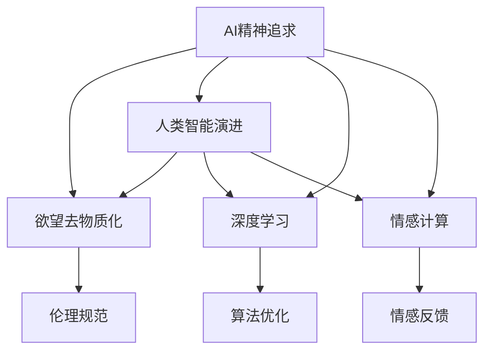

                 

# 欲望的去物质化：AI时代的精神追求

> 关键词：AI精神追求,欲望去物质化,人类智能演进,深度学习,情感计算

## 1. 背景介绍

### 1.1 问题由来

在AI技术不断发展的今天，我们越来越意识到技术的进步不仅改变着人类的物质生活，更在悄然影响着我们的精神世界。当前，AI技术已经深入到医疗、金融、教育、娱乐等各个领域，带来了极大的便利和效率提升。然而，当AI技术在快速发展的同时，我们也面临着一系列新的精神挑战和伦理问题。

### 1.2 问题核心关键点

如何在AI技术发展的同时，更好地理解人类精神生活的复杂性，解决由此带来的伦理、道德和心理健康问题，成为当前AI研究的重要课题。本文旨在探讨AI时代的精神追求，即在技术不断迭代的过程中，我们如何保持人类精神世界的多样性和深度，避免技术对人类欲望的过度物质化。

### 1.3 问题研究意义

研究AI时代的精神追求，对于推动AI技术的健康发展，保护人类精神世界的丰富性，具有重要意义：

1. **促进技术与人文融合**：在AI技术发展的同时，我们应关注其对人类精神生活的影响，探索如何将AI技术与人文关怀相结合，提升AI系统的伦理和社会价值。
2. **保护人类精神健康**：在享受AI带来的便利的同时，我们也应警惕其对人类精神健康的潜在影响，确保技术的发展不损害人的心理和情感需求。
3. **推动AI伦理发展**：随着AI技术的应用越来越广泛，如何制定合理的伦理规范，确保技术的负责任使用，成为亟待解决的问题。
4. **促进人类自我反思**：在技术不断进化的过程中，人类应不断反思自身的精神需求和价值观，避免过度物质化带来的精神危机。

## 2. 核心概念与联系

### 2.1 核心概念概述

在探讨AI时代的精神追求时，我们需要关注以下几个核心概念：

- **AI精神追求**：指在AI技术发展过程中，如何平衡技术的进步与人类精神世界的多样性和深度。
- **欲望去物质化**：指在AI技术应用中，如何避免对人类欲望的过度物质化，保持精神生活的丰富性和自然性。
- **人类智能演进**：指AI技术如何影响人类智能的发展，以及人类智能与AI智能的协同进化。
- **深度学习**：一种基于神经网络的机器学习技术，旨在模拟人类深度认知过程。
- **情感计算**：通过计算和分析人类的情感和情绪，提升AI系统的理解力和适应性。

这些概念相互联系，共同构成了AI时代精神追求的研究框架。通过理解这些概念，我们可以更好地把握AI技术在精神生活层面的影响和挑战。

### 2.2 核心概念原理和架构的 Mermaid 流程图



这个流程图展示了核心概念之间的逻辑关系：

1. AI精神追求是研究的主线，贯穿于AI技术的发展和应用。
2. 欲望去物质化是AI时代精神追求的重要目标，旨在避免技术对人类欲望的过度物质化。
3. 人类智能演进描述AI技术对人类智能的影响，以及两者之间的协同进化。
4. 深度学习和情感计算是实现AI精神追求的技术手段，通过这两者的发展，AI系统可以更好地理解人类的情感和行为。
5. 伦理规范是确保AI系统负责任使用的关键，情感反馈则是提升AI系统情感理解力的重要环节。

## 3. 核心算法原理 & 具体操作步骤

### 3.1 算法原理概述

在AI时代，欲望去物质化主要通过以下算法实现：

1. **情感计算与情感分析**：利用深度学习模型对人类情感进行计算和分析，从而理解人类的欲望和需求。
2. **道德推理与情感反馈**：在AI系统中引入道德推理机制，结合情感反馈，实现对人类欲望的合理调控。
3. **自适应学习与自我修正**：通过自适应学习算法，使AI系统能够根据人类的反馈不断调整行为，确保欲望的合理性。

这些算法原理的核心在于通过情感计算和道德推理，对人类欲望进行去物质化处理，保持其多样性和自然性。

### 3.2 算法步骤详解

1. **数据准备**：收集和标注大量的人类情感数据，包括文字、语音、图像等。
2. **模型训练**：使用深度学习模型（如RNN、LSTM、BERT等）进行情感分析，训练出情感计算模型。
3. **情感反馈**：在AI系统中引入情感反馈机制，根据用户的情感反应不断调整系统行为。
4. **道德推理**：通过逻辑推理和伦理判断，对人类欲望进行合理调控，避免过度物质化。
5. **自适应学习**：使用自适应学习算法，如强化学习、遗传算法等，使AI系统能够根据人类的反馈不断优化行为。

### 3.3 算法优缺点

**优点**：
- **提高用户体验**：通过情感计算和情感反馈，AI系统能够更好地理解用户的欲望，提升用户体验。
- **促进公平性**：道德推理机制有助于避免AI系统对某些群体的偏见和歧视，促进公平性。
- **提升系统适应性**：自适应学习算法使AI系统能够不断优化行为，提升系统的适应性。

**缺点**：
- **数据隐私问题**：情感数据的收集和使用可能涉及隐私问题，需要严格的数据保护措施。
- **模型复杂性**：情感计算和道德推理模型的设计复杂，需要大量的标注数据和计算资源。
- **伦理挑战**：道德推理和情感反馈机制的引入可能带来新的伦理挑战，需要持续的伦理监督。

### 3.4 算法应用领域

1. **医疗健康**：在医疗领域，AI系统可以通过情感计算理解患者的情绪，提供更加个性化和人性化的治疗建议。
2. **金融服务**：在金融领域，AI系统可以根据客户的情感反应，调整服务策略，提升客户满意度。
3. **教育培训**：在教育领域，AI系统可以通过情感分析，了解学生的情感状态，提供更加贴合其需求的教学内容。
4. **社交媒体**：在社交媒体领域，AI系统可以通过情感计算，分析用户的情绪，提供更加友好的互动体验。
5. **娱乐文化**：在娱乐领域，AI系统可以通过情感分析，了解用户的喜好，推荐更加符合其需求的娱乐内容。

## 4. 数学模型和公式 & 详细讲解 & 举例说明

### 4.1 数学模型构建

在AI时代，欲望去物质化主要通过以下数学模型实现：

1. **情感计算模型**：使用深度学习模型对情感数据进行编码，得到情感表示。
2. **道德推理模型**：利用逻辑推理规则对情感表示进行评估，判断欲望的合理性。
3. **自适应学习模型**：使用自适应算法对系统行为进行优化，提升系统的适应性。

### 4.2 公式推导过程

以情感计算模型为例，假设情感数据为 $x$，情感表示为 $y$，使用深度学习模型 $f$ 进行编码，公式如下：

$$
y = f(x)
$$

其中 $f$ 为深度学习模型，可以是RNN、LSTM、BERT等。模型的训练过程可以通过反向传播算法进行，公式如下：

$$
\frac{\partial \mathcal{L}}{\partial w} = \frac{\partial \mathcal{L}}{\partial y} \frac{\partial y}{\partial x} \frac{\partial x}{\partial w}
$$

其中 $\mathcal{L}$ 为损失函数，$w$ 为模型参数，$\frac{\partial y}{\partial x}$ 为模型梯度。

### 4.3 案例分析与讲解

**案例一：情感计算在医疗中的应用**

在医疗领域，AI系统可以通过情感计算理解患者的情绪，提供更加个性化和人性化的治疗建议。具体来说，系统可以通过收集患者的语音、文字等情感数据，使用情感计算模型进行编码，得到情感表示。然后，系统利用道德推理模型对情感表示进行评估，判断治疗方案的合理性。最后，系统根据患者的反馈，使用自适应学习算法不断优化治疗策略，确保治疗方案符合患者的情感需求。

**案例二：情感计算在金融中的应用**

在金融领域，AI系统可以根据客户的情感反应，调整服务策略，提升客户满意度。具体来说，系统可以通过收集客户的情感数据，使用情感计算模型进行编码，得到情感表示。然后，系统利用道德推理模型对情感表示进行评估，判断服务策略的合理性。最后，系统根据客户的反馈，使用自适应学习算法不断优化服务策略，确保服务策略符合客户的情感需求。

## 5. 项目实践：代码实例和详细解释说明

### 5.1 开发环境搭建

在进行项目实践前，我们需要准备好开发环境。以下是使用Python进行TensorFlow开发的环境配置流程：

1. 安装Anaconda：从官网下载并安装Anaconda，用于创建独立的Python环境。

2. 创建并激活虚拟环境：
```bash
conda create -n tensorflow-env python=3.8 
conda activate tensorflow-env
```

3. 安装TensorFlow：根据CUDA版本，从官网获取对应的安装命令。例如：
```bash
conda install tensorflow tensorflow-gpu=2.6.0 -c pytorch -c conda-forge
```

4. 安装TensorBoard：
```bash
pip install tensorboard
```

5. 安装TensorFlow Addons：
```bash
pip install tensorflow-addons
```

完成上述步骤后，即可在`tensorflow-env`环境中开始项目实践。

### 5.2 源代码详细实现

这里我们以情感计算模型为例，给出使用TensorFlow实现情感分析的代码实现。

```python
import tensorflow as tf
import tensorflow_addons as tfa

# 定义模型
class EmotionModel(tf.keras.Model):
    def __init__(self, vocab_size, embedding_dim, hidden_units, output_dim):
        super(EmotionModel, self).__init__()
        self.embedding = tf.keras.layers.Embedding(vocab_size, embedding_dim)
        self.lstm = tf.keras.layers.LSTM(hidden_units, return_sequences=True)
        self.dense = tf.keras.layers.Dense(output_dim, activation='softmax')

    def call(self, x):
        x = self.embedding(x)
        x = self.lstm(x)
        return self.dense(x)

# 训练数据准备
vocab_size = 10000
embedding_dim = 128
hidden_units = 64
output_dim = 6
train_data = ...
train_labels = ...

# 定义模型和优化器
model = EmotionModel(vocab_size, embedding_dim, hidden_units, output_dim)
optimizer = tf.keras.optimizers.Adam()

# 训练模型
for epoch in range(epochs):
    with tf.GradientTape() as tape:
        predictions = model(train_data)
        loss = tf.keras.losses.categorical_crossentropy(train_labels, predictions)
    gradients = tape.gradient(loss, model.trainable_variables)
    optimizer.apply_gradients(zip(gradients, model.trainable_variables))
```

以上代码展示了使用TensorFlow实现情感计算模型的基本流程。其中，我们定义了一个基于LSTM的情感计算模型，使用交叉熵损失函数进行训练，并在训练过程中使用Adam优化器更新模型参数。

### 5.3 代码解读与分析

**模型定义**：
- `EmotionModel`类定义了情感计算模型，包括嵌入层、LSTM层和全连接层。
- `vocab_size`为词汇表大小，`embedding_dim`为嵌入维度，`hidden_units`为LSTM层隐单元数，`output_dim`为输出维度。

**训练数据准备**：
- 假设训练数据和标签已经准备完毕，可以通过`train_data`和`train_labels`进行训练。

**模型训练**：
- 在每个epoch中，使用`tf.GradientTape`对模型进行前向传播和反向传播，计算损失函数和梯度。
- 使用`optimizer.apply_gradients`更新模型参数。

### 5.4 运行结果展示

在训练完成后，可以评估模型的性能：

```python
import numpy as np
from sklearn.metrics import accuracy_score

test_data = ...
test_labels = ...

predictions = model(test_data)
accuracy = accuracy_score(test_labels, np.argmax(predictions, axis=1))
print(f"Accuracy: {accuracy:.2f}")
```

通过以上代码，可以得到模型在测试数据上的准确率。

## 6. 实际应用场景

### 6.1 医疗健康

在医疗领域，AI系统可以通过情感计算理解患者的情绪，提供更加个性化和人性化的治疗建议。具体来说，系统可以通过收集患者的语音、文字等情感数据，使用情感计算模型进行编码，得到情感表示。然后，系统利用道德推理模型对情感表示进行评估，判断治疗方案的合理性。最后，系统根据患者的反馈，使用自适应学习算法不断优化治疗策略，确保治疗方案符合患者的情感需求。

### 6.2 金融服务

在金融领域，AI系统可以根据客户的情感反应，调整服务策略，提升客户满意度。具体来说，系统可以通过收集客户的情感数据，使用情感计算模型进行编码，得到情感表示。然后，系统利用道德推理模型对情感表示进行评估，判断服务策略的合理性。最后，系统根据客户的反馈，使用自适应学习算法不断优化服务策略，确保服务策略符合客户的情感需求。

### 6.3 教育培训

在教育领域，AI系统可以通过情感分析，了解学生的情感状态，提供更加贴合其需求的教学内容。具体来说，系统可以通过收集学生的情感数据，使用情感计算模型进行编码，得到情感表示。然后，系统利用道德推理模型对情感表示进行评估，判断教学内容的合理性。最后，系统根据学生的反馈，使用自适应学习算法不断优化教学策略，确保教学策略符合学生的情感需求。

### 6.4 社交媒体

在社交媒体领域，AI系统可以通过情感计算，分析用户的情绪，提供更加友好的互动体验。具体来说，系统可以通过收集用户的情感数据，使用情感计算模型进行编码，得到情感表示。然后，系统利用道德推理模型对情感表示进行评估，判断互动策略的合理性。最后，系统根据用户的反馈，使用自适应学习算法不断优化互动策略，确保互动策略符合用户的情感需求。

### 6.5 娱乐文化

在娱乐领域，AI系统可以通过情感分析，了解用户的喜好，推荐更加符合其需求的娱乐内容。具体来说，系统可以通过收集用户的情感数据，使用情感计算模型进行编码，得到情感表示。然后，系统利用道德推理模型对情感表示进行评估，判断推荐内容的合理性。最后，系统根据用户的反馈，使用自适应学习算法不断优化推荐策略，确保推荐策略符合用户的情感需求。

## 7. 工具和资源推荐

### 7.1 学习资源推荐

为了帮助开发者系统掌握情感计算和道德推理的理论与实践，这里推荐一些优质的学习资源：

1. 《深度学习入门》系列博文：由大模型技术专家撰写，深入浅出地介绍了深度学习的基本概念和核心算法。

2. CS231n《深度学习计算机视觉》课程：斯坦福大学开设的深度学习课程，涵盖深度学习在计算机视觉中的应用。

3. 《情感计算：原理与实践》书籍：情感计算领域的经典著作，全面介绍了情感计算的理论基础和应用实践。

4. TensorFlow官方文档：TensorFlow的官方文档，提供了丰富的API文档和示例代码，是上手实践的必备资料。

5. PyTorch官方文档：PyTorch的官方文档，提供了详细的API文档和示例代码，是深入研究深度学习的必备资料。

通过对这些资源的学习实践，相信你一定能够快速掌握情感计算和道德推理的精髓，并用于解决实际的AI问题。

### 7.2 开发工具推荐

高效的开发离不开优秀的工具支持。以下是几款用于情感计算和道德推理开发的常用工具：

1. TensorFlow：基于Python的开源深度学习框架，灵活动态的计算图，适合快速迭代研究。提供了丰富的API和工具，支持情感计算和道德推理。

2. PyTorch：基于Python的开源深度学习框架，支持动态计算图和GPU加速，适合快速实验和模型优化。

3. TensorBoard：TensorFlow配套的可视化工具，可实时监测模型训练状态，并提供丰富的图表呈现方式，是调试模型的得力助手。

4. Weights & Biases：模型训练的实验跟踪工具，可以记录和可视化模型训练过程中的各项指标，方便对比和调优。与主流深度学习框架无缝集成。

5. Keras：高层次的深度学习框架，提供了简单易用的API，适合快速构建和实验情感计算和道德推理模型。

合理利用这些工具，可以显著提升情感计算和道德推理任务的开发效率，加快创新迭代的步伐。

### 7.3 相关论文推荐

情感计算和道德推理的研究源于学界的持续研究。以下是几篇奠基性的相关论文，推荐阅读：

1. Affective Computing with Computers and Humans: A Foundational Survey：综述了情感计算的理论和应用，奠定了情感计算研究的理论基础。

2. The Ethical AI Rating System (EARS)：提出了基于情感计算和道德推理的AI伦理评估系统，为AI系统的伦理监管提供了新的思路。

3. Deep Learning for Social Media Analysis：介绍了深度学习在社交媒体情感分析中的应用，展示了情感计算的强大能力。

4. Ethical AI Systems：综述了AI系统的伦理设计和实现方法，探讨了AI系统在伦理领域的挑战和解决方案。

这些论文代表了大模型微调技术的发展脉络。通过学习这些前沿成果，可以帮助研究者把握学科前进方向，激发更多的创新灵感。

## 8. 总结：未来发展趋势与挑战

### 8.1 总结

本文对基于情感计算和道德推理的欲望去物质化方法进行了全面系统的介绍。首先阐述了AI时代精神追求的研究背景和意义，明确了情感计算和道德推理在AI技术发展中的重要性。其次，从原理到实践，详细讲解了情感计算和道德推理的数学模型和核心算法，给出了情感计算和道德推理任务开发的完整代码实例。同时，本文还广泛探讨了情感计算和道德推理在医疗、金融、教育、娱乐等多个行业领域的应用前景，展示了情感计算和道德推理范式的巨大潜力。此外，本文精选了情感计算和道德推理的学习资源，力求为读者提供全方位的技术指引。

通过本文的系统梳理，可以看到，情感计算和道德推理在大模型微调中的应用，正在成为AI技术发展的重要方向。这些方向的探索发展，必将进一步提升AI系统的伦理和人文价值，促进AI技术的健康发展。

### 8.2 未来发展趋势

展望未来，情感计算和道德推理的发展趋势如下：

1. **技术进步**：随着深度学习模型的不断优化，情感计算和道德推理的准确性和鲁棒性将进一步提升，应用范围也将更加广泛。
2. **伦理规范**：随着AI技术的应用越来越广泛，情感计算和道德推理的伦理规范将不断完善，确保AI系统的负责任使用。
3. **跨领域融合**：情感计算和道德推理将与其他AI技术如自然语言处理、计算机视觉等进行更深入的融合，提升AI系统的整体表现。
4. **个性化服务**：通过情感计算和道德推理，AI系统能够更好地理解人类情感和需求，提供更加个性化和人性化的服务。
5. **实时处理**：随着计算资源的不断提升，情感计算和道德推理将能够实现实时处理，满足用户的即时需求。

以上趋势凸显了情感计算和道德推理技术的广阔前景。这些方向的探索发展，必将进一步提升AI系统的伦理和人文价值，促进AI技术的健康发展。

### 8.3 面临的挑战

尽管情感计算和道德推理技术已经取得了瞩目成就，但在迈向更加智能化、普适化应用的过程中，它仍面临着诸多挑战：

1. **数据隐私问题**：情感数据的收集和使用可能涉及隐私问题，需要严格的数据保护措施。
2. **模型复杂性**：情感计算和道德推理模型的设计复杂，需要大量的标注数据和计算资源。
3. **伦理挑战**：道德推理和情感反馈机制的引入可能带来新的伦理挑战，需要持续的伦理监督。
4. **技术融合**：情感计算和道德推理与其他AI技术的融合仍需进一步探索，以实现更高的整体性能。
5. **实时性问题**：情感计算和道德推理的实时处理仍需优化，以应对高并发用户需求。

尽管面临这些挑战，情感计算和道德推理技术的发展前景依然广阔。未来，我们需要在数据、算法、伦理等方面持续创新，推动情感计算和道德推理技术迈向更高的台阶。

### 8.4 研究展望

面向未来，情感计算和道德推理技术的研究展望如下：

1. **数据融合与增强**：探索如何将多种数据源（如文本、语音、图像等）进行融合，提升情感计算和道德推理的准确性和鲁棒性。
2. **伦理模型学习**：引入伦理推理机制，使AI系统能够学习并遵守伦理规范，提升系统的社会价值。
3. **个性化推荐**：结合情感计算和道德推理，实现更加个性化的推荐系统，提升用户体验。
4. **跨模态交互**：探索如何将情感计算和道德推理应用于跨模态交互系统，提升系统的智能化水平。
5. **实时情感分析**：研究实时情感分析技术，使情感计算和道德推理能够实时处理用户的反馈，提升系统的互动性。

这些研究方向的探索，必将推动情感计算和道德推理技术在更广泛的应用场景中发挥作用，促进AI技术的健康发展。相信通过学界和产业界的共同努力，情感计算和道德推理技术必将在未来AI时代中占据重要地位，为人类的精神追求提供新的支持。

## 9. 附录：常见问题与解答

**Q1：情感计算和道德推理在AI系统中的应用场景有哪些？**

A: 情感计算和道德推理在AI系统中的应用场景包括：
1. 医疗健康：通过情感计算理解患者的情绪，提供个性化治疗建议。
2. 金融服务：根据客户的情感反应调整服务策略，提升客户满意度。
3. 教育培训：了解学生的情感状态，提供个性化教学内容。
4. 社交媒体：分析用户的情绪，提供友好的互动体验。
5. 娱乐文化：了解用户的喜好，推荐个性化娱乐内容。

**Q2：如何进行情感计算模型的训练和优化？**

A: 情感计算模型的训练和优化过程如下：
1. 数据准备：收集和标注情感数据，构建训练集。
2. 模型定义：选择合适的模型结构，如RNN、LSTM、BERT等。
3. 模型训练：使用深度学习框架进行模型训练，优化模型参数。
4. 模型评估：使用测试集评估模型性能，调整模型参数。
5. 模型优化：通过自适应学习算法不断优化模型，提升模型表现。

**Q3：情感计算和道德推理在AI系统中的伦理挑战有哪些？**

A: 情感计算和道德推理在AI系统中的伦理挑战包括：
1. 数据隐私问题：情感数据的收集和使用可能涉及隐私问题，需要严格的数据保护措施。
2. 模型偏见问题：情感计算和道德推理模型可能存在偏见，需要持续的伦理监督。
3. 伦理规范问题：需要制定合理的伦理规范，确保AI系统的负责任使用。
4. 伦理冲突问题：情感计算和道德推理在特定场景下可能存在伦理冲突，需要进行合理决策。

**Q4：情感计算和道德推理技术的发展趋势是什么？**

A: 情感计算和道德推理技术的发展趋势如下：
1. 技术进步：深度学习模型的不断优化，情感计算和道德推理的准确性和鲁棒性将进一步提升。
2. 伦理规范：随着AI技术的应用越来越广泛，情感计算和道德推理的伦理规范将不断完善。
3. 跨领域融合：情感计算和道德推理将与其他AI技术如自然语言处理、计算机视觉等进行更深入的融合。
4. 个性化服务：通过情感计算和道德推理，AI系统能够更好地理解人类情感和需求，提供个性化服务。
5. 实时处理：随着计算资源的不断提升，情感计算和道德推理将能够实现实时处理。

**Q5：如何确保情感计算和道德推理模型的可信度？**

A: 确保情感计算和道德推理模型的可信度，需要从以下几个方面入手：
1. 数据质量：确保情感数据和道德数据的质量和可靠性。
2. 模型透明：通过可解释性技术，使情感计算和道德推理模型具有较高的透明性。
3. 伦理监督：制定合理的伦理规范，确保情感计算和道德推理模型的负责任使用。
4. 用户反馈：通过用户反馈不断调整模型，提升模型的可信度。

总之，情感计算和道德推理技术的发展前景广阔，但需要解决数据隐私、模型偏见、伦理规范等诸多挑战。只有在技术、伦理和社会的共同努力下，情感计算和道德推理技术才能真正发挥其潜力，为人类的精神追求提供新的支持。

---

作者：禅与计算机程序设计艺术 / Zen and the Art of Computer Programming

