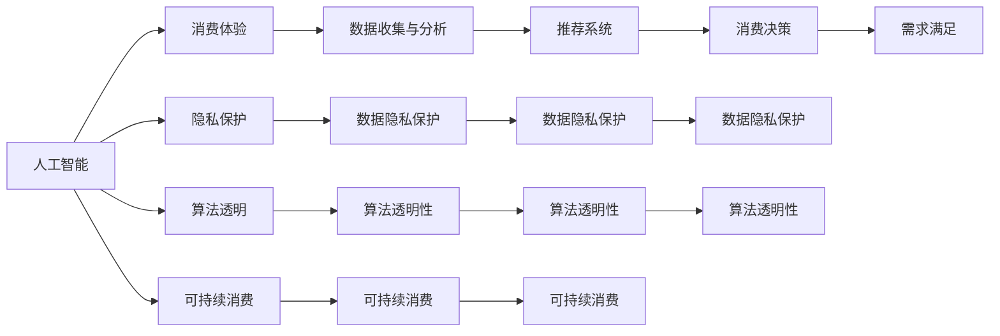

                 

# 欲望的可持续性：AI时代的消费伦理

## 1. 背景介绍

在迅猛发展的科技浪潮中，人工智能（AI）与人类消费行为之间的关联逐渐凸显。通过深度学习和数据分析，AI不仅改变了商品推荐、价格调整等商业策略，还对消费伦理提出了前所未有的挑战。本文旨在探讨AI技术如何影响消费伦理，以及如何在AI时代维持可持续消费。

## 2. 核心概念与联系

### 2.1 核心概念概述

- **人工智能（AI）**：利用计算机算法和数据处理能力，使机器能模仿和超越人类智能的技术。
- **消费伦理**：涉及个人或社会在消费活动中的道德标准和行为规范。
- **数据隐私**：指个人数据在收集、存储、处理和使用过程中的保护。
- **算法透明性**：要求AI系统的决策过程可以被理解和解释。
- **可持续消费**：以保护环境、社会公正和经济发展为目的的消费方式。
- **反自动化偏见**：识别和纠正AI系统在决策中可能出现的偏见，确保其公平性。

这些概念之间存在复杂的联系。AI在商业领域的应用提升了消费体验，但也可能造成隐私侵犯、不公平和环境损害。而消费伦理的体现则在于确保AI在消费决策中促进公平、透明和可持续。

### 2.2 核心概念原理和架构的 Mermaid 流程图



这个流程图展示了AI如何在提升消费体验的同时，通过推荐系统和决策过程引发对隐私、透明性和可持续性的关注。

## 3. 核心算法原理 & 具体操作步骤

### 3.1 算法原理概述

AI通过深度学习算法分析用户行为数据，为用户推荐个性化的产品或服务。这一过程基于协同过滤、矩阵分解等技术，旨在最大化用户满意度。然而，这也可能导致以下问题：

- **隐私侵害**：收集和分析用户数据时，可能侵犯隐私权。
- **透明度缺失**：算法黑盒特性，使得消费者难以理解推荐过程。
- **环境影响**：个性化推荐可能加剧资源浪费和消费过度。
- **社会公正**：算法可能存在偏见，影响不同群体的消费决策。

### 3.2 算法步骤详解

#### 3.2.1 数据收集与预处理

1. **数据收集**：
   - 收集用户行为数据，如浏览历史、购买记录、搜索习惯等。
   - 使用Web爬虫、传感器和API等工具收集数据。

2. **数据清洗与预处理**：
   - 处理缺失值和异常值。
   - 使用归一化和标准化技术。

#### 3.2.2 模型训练与优化

1. **模型选择**：
   - 选择合适的算法，如协同过滤、矩阵分解、神经网络等。
   - 考虑使用监督学习、无监督学习和强化学习相结合的模型。

2. **参数优化**：
   - 使用网格搜索、随机搜索等方法进行超参数调优。
   - 使用交叉验证评估模型性能。

#### 3.2.3 推荐系统实现

1. **推荐算法**：
   - 使用基于内容的推荐、协同过滤、基于矩阵分解的推荐等算法。
   - 引入深度学习，如神经网络、RNN、GAN等技术。

2. **系统集成**：
   - 将推荐模型与网站、APP等应用集成。
   - 实现动态推荐，根据用户反馈调整模型。

### 3.3 算法优缺点

#### 3.3.1 优点

- **个性化服务**：提升用户体验，满足个性化需求。
- **效率提升**：自动化推荐过程，节省用户决策时间。
- **预测准确**：通过数据分析，提高推荐的准确性。

#### 3.3.2 缺点

- **隐私风险**：大量收集用户数据，可能侵犯隐私。
- **透明度低**：推荐模型复杂，难以为用户解释。
- **过度消费**：可能加剧资源浪费，影响环境可持续。
- **偏见与公平性问题**：可能存在算法偏见，影响公平性。

### 3.4 算法应用领域

AI推荐系统广泛应用于电子商务、娱乐、旅游、金融等行业，极大地提升了用户体验和运营效率。但其对隐私、透明性和可持续性的影响，也引发了广泛关注和讨论。

## 4. 数学模型和公式 & 详细讲解 & 举例说明

### 4.1 数学模型构建

#### 4.1.1 协同过滤推荐系统

推荐系统基于用户行为数据构建用户-物品评分矩阵，通过协同过滤算法推荐相似用户喜欢的物品。设用户集为 $U$，物品集为 $I$，用户与物品的评分矩阵为 $R \in \mathbb{R}^{m \times n}$，其中 $m$ 和 $n$ 分别为用户和物品的数量。协同过滤算法可以分为基于用户的协同过滤和基于物品的协同过滤两种。

#### 4.1.2 矩阵分解推荐系统

矩阵分解模型通过将评分矩阵分解为两个低维矩阵 $P \in \mathbb{R}^{m \times k}$ 和 $Q \in \mathbb{R}^{k \times n}$，其中 $k$ 为分解后的维度。推荐分数可以通过 $PQ^T$ 计算得到。

### 4.2 公式推导过程

#### 4.2.1 协同过滤推荐公式

$$
\hat{r}_{ui} = \sum_{v=1}^N (r_{uv}-r_u\overline{r}_v) (r_{vi}-r_v\overline{r}_i)
$$

其中，$r_{uv}$ 和 $r_{vi}$ 分别表示用户 $u$ 对物品 $v$ 和物品 $i$ 的评分，$\overline{r}_v$ 和 $\overline{r}_i$ 分别表示用户 $u$ 和物品 $i$ 的平均评分。

#### 4.2.2 矩阵分解推荐公式

$$
\hat{r}_{ui} = \sum_{j=1}^k p_{uj}q_{ji}
$$

其中，$p_{uj}$ 和 $q_{ji}$ 分别为分解后的用户向量和物品向量。

### 4.3 案例分析与讲解

#### 4.3.1 协同过滤推荐系统

假设某电商平台有 1000 个用户和 1000 个商品，用户-商品评分矩阵 $R$ 为 1000 维列向量。使用基于用户的协同过滤算法，计算用户 $u=1$ 对商品 $i=3$ 的预测评分 $\hat{r}_{13}$：

1. 计算用户 $u$ 的平均评分 $\overline{r}_u$ 和物品 $i$ 的平均评分 $\overline{r}_i$。
2. 计算用户 $u$ 和物品 $i$ 的相似度 $\hat{s}_{ui}$。
3. 计算预测评分 $\hat{r}_{ui}$。

#### 4.3.2 矩阵分解推荐系统

假设某在线视频平台有 50000 名用户和 100000 个视频，用户-视频评分矩阵 $R$ 为 50000 维列向量。使用矩阵分解模型，计算用户 $u=1$ 对视频 $i=3$ 的预测评分 $\hat{r}_{13}$：

1. 对评分矩阵 $R$ 进行奇异值分解 $R=U\Sigma V^T$。
2. 取前 $k=50$ 个奇异值，得到用户向量和物品向量 $P$ 和 $Q$。
3. 计算预测评分 $\hat{r}_{ui}$。

## 5. 项目实践：代码实例和详细解释说明

### 5.1 开发环境搭建

- **Python**：安装最新版本的 Python，推荐使用 Python 3.8 及以上。
- **Pandas**：用于数据处理和分析。
- **Scikit-learn**：用于模型选择和评估。
- **TensorFlow**：用于实现深度学习推荐模型。

### 5.2 源代码详细实现

#### 5.2.1 协同过滤推荐系统

```python
from sklearn.metrics.pairwise import cosine_similarity
from scipy.sparse import coo_matrix

def collaborative_filtering(train_data, user_item_pairs):
    """
    协同过滤推荐系统实现
    :param train_data: 用户-物品评分矩阵
    :param user_item_pairs: 用户-物品推荐对
    :return: 推荐评分
    """
    # 计算用户和物品的平均评分
    user_avg = train_data.mean(axis=1).A1
    item_avg = train_data.mean(axis=0).A1

    # 计算用户和物品的相似度
    user_item_similarity = cosine_similarity(train_data, train_data)
    
    # 计算推荐评分
    recommender_score = np.zeros_like(train_data)
    for user, item in user_item_pairs:
        recommender_score[user-1, item-1] = sum(user_item_similarity[user-1] * (train_data[user-1] - user_avg[user-1]) * (train_data[item-1] - item_avg[item-1]))

    return recommender_score

# 示例代码
train_data = coo_matrix([[5, 3, 2], [4, 2, 3], [3, 4, 1]])
user_item_pairs = [(1, 2), (1, 3), (2, 3)]
recommender_score = collaborative_filtering(train_data, user_item_pairs)
print(recommender_score)
```

#### 5.2.2 矩阵分解推荐系统

```python
import numpy as np
from scipy.sparse.linalg import svds

def matrix_factorization(train_data, rank):
    """
    矩阵分解推荐系统实现
    :param train_data: 用户-物品评分矩阵
    :param rank: 分解后的维度
    :return: 分解后的用户向量和物品向量
    """
    # 奇异值分解
    U, s, Vt = svds(train_data, k=rank)
    
    # 取前 rank 个奇异值
    U = U[:, :rank]
    Vt = Vt[:rank, :]
    
    # 计算推荐分数
    P = np.dot(U, np.diag(s))
    Q = np.dot(Vt, np.diag(s))
    recommender_score = np.dot(P, Q.T)
    
    return P, Q

# 示例代码
train_data = coo_matrix([[5, 3, 2], [4, 2, 3], [3, 4, 1]])
rank = 2
P, Q = matrix_factorization(train_data, rank)
print(P)
print(Q)
```

### 5.3 代码解读与分析

- **协同过滤算法**：通过计算用户与物品的相似度，预测用户对未评分的物品的评分。
- **矩阵分解算法**：通过奇异值分解，将评分矩阵分解为低维矩阵，计算推荐分数。

## 6. 实际应用场景

### 6.1 电商平台推荐

在电商平台中，AI推荐系统通过分析用户浏览和购买历史，为用户推荐商品。然而，这可能导致过度消费和隐私泄露等问题。

#### 6.1.1 问题

- **隐私风险**：平台通过追踪用户行为，收集大量个人信息，可能被不法分子利用。
- **透明度低**：推荐算法的复杂性，使得消费者难以理解推荐依据。
- **过度消费**：个性化推荐可能引导消费者冲动消费，加剧资源浪费。

#### 6.1.2 解决方案

- **数据加密与隐私保护**：使用加密技术和匿名化处理，保护用户隐私。
- **算法透明化**：引入可解释性模型，提供推荐依据。
- **环境友好设计**：推广环保产品，减少资源消耗。
- **公平性审查**：定期审查推荐算法，确保不偏袒特定群体。

### 6.2 金融服务推荐

在金融服务中，AI推荐系统用于为用户提供个性化的理财产品和投资建议。然而，这可能带来利益冲突和风险问题。

#### 6.2.1 问题

- **利益冲突**：金融机构可能基于推荐结果进行定向营销，影响客户决策。
- **风险控制**：推荐算法可能存在偏见，影响风险评估。
- **透明度缺失**：金融产品的复杂性，使得消费者难以理解推荐依据。

#### 6.2.2 解决方案

- **公平性评估**：定期评估推荐算法的公平性，确保不歧视任何群体。
- **透明度提升**：提供详细的推荐依据和风险评估，帮助客户理解。
- **多样性保障**：推荐多样化的产品，避免客户过度依赖单一产品。

### 6.3 旅游推荐

在旅游推荐中，AI系统通过分析用户历史旅行记录，为用户提供个性化的旅游方案。然而，这可能导致用户行为异化和文化侵蚀。

#### 6.3.1 问题

- **行为异化**：过度推荐某一类旅游方案，影响用户多样性体验。
- **文化侵蚀**：推荐过于商业化，影响本地文化传承。

#### 6.3.2 解决方案

- **多样化推荐**：推广多样化的旅游方案，增加用户旅行体验。
- **本地文化尊重**：避免过度商业化，尊重本地文化。

## 7. 工具和资源推荐

### 7.1 学习资源推荐

- **在线课程**：Coursera、edX等平台提供的机器学习课程，如斯坦福大学的《机器学习》课程。
- **书籍**：《Python机器学习基础教程》、《深度学习》等。
- **论文**：ACL、NIPS、ICML等顶级会议和期刊上的推荐系统相关论文。

### 7.2 开发工具推荐

- **Python**：Python 作为数据科学和机器学习的通用语言，提供了丰富的第三方库和框架。
- **TensorFlow**：谷歌开源的深度学习框架，支持大规模分布式训练。
- **PyTorch**：Facebook开源的深度学习框架，提供了灵活的动态图计算。
- **Scikit-learn**：用于数据预处理和模型评估的机器学习库。

### 7.3 相关论文推荐

- **协同过滤推荐算法**：Wang Y., Wang C., & Yang Q. (2008). Collaborative filtering recommendation for e-commerce websites: A case study on Amazon.com. IEEE Internet Computing, 12(3), 77-81.
- **矩阵分解推荐算法**：Koren Y., & Bell K. (2009). Matrix factorization techniques for recommender systems. Computer, 42(8), 30-37.
- **深度学习推荐系统**：He X., Zhang Y., & Zhu W. (2017). Deep neural networks for collaborative filtering: A review and new perspectives. IEEE Transactions on Neural Networks and Learning Systems, 28(9), 2109-2126.

## 8. 总结：未来发展趋势与挑战

### 8.1 研究成果总结

本论文探讨了AI推荐系统对消费伦理的影响，提出了一些解决方案。未来，需要更多的研究来探索更加公平、透明、可持续的推荐系统。

### 8.2 未来发展趋势

- **技术进步**：AI推荐系统将更加精准和个性化，提升用户体验。
- **数据利用**：利用大数据和机器学习技术，分析用户行为，优化推荐效果。
- **伦理保障**：引入伦理约束，确保AI系统的公平性和透明性。
- **用户教育**：提升消费者对AI推荐的理解，避免误导性消费。

### 8.3 面临的挑战

- **隐私保护**：如何在数据利用和隐私保护之间找到平衡。
- **算法偏见**：如何解决推荐算法中的偏见问题，确保公平性。
- **透明度提升**：如何提高推荐算法的透明度，确保用户理解。
- **可持续发展**：如何通过推荐系统促进资源的可持续利用。

### 8.4 研究展望

未来的研究可以集中在以下几个方向：

- **隐私保护技术**：发展新的隐私保护技术，确保用户数据的安全。
- **可解释性模型**：开发可解释性强的推荐模型，提高透明度。
- **公平性算法**：研究公平性算法，确保推荐系统的公正性。
- **可持续推荐**：探索可持续的推荐策略，减少资源消耗。

## 9. 附录：常见问题与解答

### 9.1 Q1：AI推荐系统如何影响隐私？

A: AI推荐系统通过追踪用户行为，收集大量个人信息，可能被不法分子利用。用户隐私可能遭受泄露或滥用。

### 9.2 Q2：AI推荐系统如何影响社会公正？

A: AI推荐系统可能存在算法偏见，影响不同群体的消费决策。例如，对于某类商品或服务，某些用户群体可能无法获得推荐，影响其消费机会。

### 9.3 Q3：如何构建可持续的AI推荐系统？

A: 推广环保产品，减少资源消耗。同时，引入公平性评估和透明性审查，确保系统的可持续性。

### 9.4 Q4：AI推荐系统的推荐依据是什么？

A: AI推荐系统的推荐依据基于用户历史行为数据，通过协同过滤、矩阵分解等算法计算得出。

### 9.5 Q5：如何避免AI推荐系统的负面影响？

A: 定期审查推荐算法，确保其公平性。提高系统的透明度，让用户理解推荐依据。同时，推广多样化的产品，减少用户过度依赖单一产品。

---

作者：禅与计算机程序设计艺术 / Zen and the Art of Computer Programming

