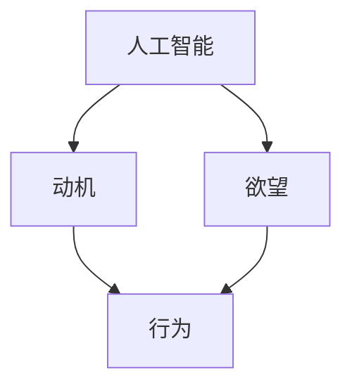

                 

## 1. 背景介绍

在人工智能（AI）飞速发展的今天，我们不仅惊叹于其强大无比的计算能力和高效精确的数据处理方式，更惊异于其深入人类生活的程度和能力。从个性化推荐到智能客服，从智能家居到自动驾驶，AI的应用几乎无所不在。然而，在这些炫目的应用背后，我们是否思考过AI是如何塑造我们的欲望、动机和行为的？本文将围绕这个问题展开讨论，以期深入理解AI对人类行为的影响，并探讨AI在塑造欲望、动机和行为方面的可能性和挑战。

## 2. 核心概念与联系

### 2.1 核心概念概述

**人工智能（Artificial Intelligence, AI）**：指通过算法和计算机程序让机器模拟人类智能行为的能力。AI技术主要包括机器学习、自然语言处理、计算机视觉等。

**动机（Motivation）**：指驱动个体进行特定行为的内部力量。动机可分为内在动机和外在动机，外在动机往往源于外部奖励或惩罚，而内在动机更多源自内心需求和兴趣。

**欲望（Desire）**：指个体对特定目标或行为的强烈渴望和需求。欲望可以是物质的、情感的、精神的，是人的一种基本驱动力。

**行为（Behavior）**：指个体为了满足欲望或实现动机所采取的行动。行为是欲望和动机外化的表现形式。

### 2.2 核心概念原理和架构的 Mermaid 流程图(Mermaid 流程节点中不要有括号、逗号等特殊字符)



该图展示了人工智能、动机、欲望和行为之间的联系。AI技术通过对大量数据的学习和分析，能够预测和塑造个体的动机和欲望，进而影响其行为。例如，个性化推荐系统通过分析用户的浏览和购买历史数据，推测其欲望和动机，从而向用户推荐其可能感兴趣的商品或内容。

## 3. 核心算法原理 & 具体操作步骤

### 3.1 算法原理概述

基于AI塑造人类欲望和动机的方法，其核心原理包括：

1. **数据收集与分析**：收集个体的行为数据（如浏览记录、购买记录、社交媒体互动等），通过机器学习算法分析这些数据，提取个体的行为模式和偏好。
2. **动机预测**：根据个体行为数据，使用AI模型预测个体的动机和欲望。例如，通过用户兴趣模型预测用户可能对哪些商品或服务感兴趣。
3. **行为干预**：根据预测的动机和欲望，设计个性化的内容和推荐，干预个体的行为。例如，推荐系统通过展示特定广告或商品，引导用户产生购买欲望。
4. **反馈循环**：AI系统不断收集用户的行为数据，更新模型，进一步提高预测准确度，形成良性反馈循环。

### 3.2 算法步骤详解

**Step 1: 数据收集与预处理**

1. 收集个体的行为数据，包括浏览记录、购买记录、搜索历史、社交媒体互动等。
2. 对数据进行清洗和标准化处理，去除噪声和异常值，确保数据质量。

**Step 2: 特征工程**

1. 从行为数据中提取有意义的特征，如浏览时间、点击次数、购物车停留时间等。
2. 使用特征选择算法，选择对个体行为影响较大的特征。

**Step 3: 动机预测模型训练**

1. 选择或设计合适的预测模型，如决策树、随机森林、神经网络等。
2. 使用历史行为数据对模型进行训练，调整模型参数以提高预测准确度。

**Step 4: 行为干预**

1. 根据预测的动机和欲望，设计个性化的推荐内容。
2. 通过个性化推荐系统向个体展示推荐内容，引导其行为。

**Step 5: 反馈与优化**

1. 收集用户对推荐内容的反馈数据。
2. 使用反馈数据更新动机预测模型，提高模型预测准确度。

### 3.3 算法优缺点

**优点**：

1. **效率高**：AI技术可以快速分析大量数据，预测个体动机和欲望，引导其行为。
2. **个性化强**：通过分析个体的行为数据，AI能够提供高度个性化的推荐和服务，提升用户体验。
3. **效果显著**：AI系统通过持续学习，不断优化模型，显著提高预测准确度和推荐效果。

**缺点**：

1. **隐私风险**：AI系统需要收集大量个人数据，存在隐私泄露的风险。
2. **依赖性**：个体行为受到AI系统的干预，可能逐渐失去主动性和独立性。
3. **道德问题**：AI系统可能基于偏见的数据进行预测，导致不公平或不道德的行为干预。

### 3.4 算法应用领域

基于AI塑造人类欲望和动机的方法，已经在多个领域得到应用：

1. **电子商务**：个性化推荐系统通过分析用户行为数据，预测用户兴趣和需求，提供个性化商品推荐，提升销售转化率。
2. **社交媒体**：内容推荐系统通过分析用户互动数据，预测用户偏好，推荐相关内容，增加用户粘性。
3. **健康医疗**：智能健康管理系统通过分析用户健康数据，预测健康需求，提供个性化健康建议。
4. **教育培训**：个性化学习系统通过分析学生学习行为，预测学习需求，提供个性化教学内容，提升学习效果。

## 4. 数学模型和公式 & 详细讲解 & 举例说明

### 4.1 数学模型构建

我们以电子商务个性化推荐为例，构建一个简单的动机预测模型。假设有一个用户集 $U=\{u_1, u_2, ..., u_N\}$，每个用户有 $M$ 个行为记录 $D=\{d_{uj}\}_{j=1}^M$，每个行为记录 $d_{uj}=(\text{item}, \text{timestamp}, \text{duration}, ...) \in \mathcal{D}$。我们的目标是通过用户的历史行为数据 $D$ 预测用户 $u$ 的购买欲望 $\mathcal{D}_{uj}$。

### 4.2 公式推导过程

我们定义用户 $u$ 在商品 $i$ 上的购买欲望 $D_{ui}$ 为：

$$ D_{ui} = \sum_{j=1}^M \alpha_j d_{uj} $$

其中 $\alpha_j$ 为行为 $d_{uj}$ 的权重系数，可以通过机器学习算法训练得到。然后，我们使用softmax函数将多个商品 $i$ 的欲望进行归一化，得到每个商品 $i$ 被购买的概率：

$$ P_{ui} = \frac{\exp(D_{ui})}{\sum_{k=1}^K \exp(D_{uk})} $$

最后，我们将每个用户 $u$ 对商品 $i$ 的购买概率排序，选择前 $K$ 个商品进行推荐。

### 4.3 案例分析与讲解

假设某电商平台有 $N=1000$ 名用户，每个用户有 $M=100$ 个行为记录。我们使用上述模型对用户购买欲望进行预测和推荐。首先，我们收集用户的历史浏览、点击、购买数据，并对其进行清洗和标准化处理。然后，使用决策树算法训练权重系数 $\alpha_j$，得到每个行为记录对用户购买欲望的贡献度。最后，根据预测的购买欲望，向用户推荐可能感兴趣的商品。

## 5. 项目实践：代码实例和详细解释说明

### 5.1 开发环境搭建

我们需要使用Python和PyTorch库进行动机预测模型的开发。具体步骤如下：

1. 安装Python 3.7及以上版本，确保有足够的内存和计算资源。
2. 安装PyTorch库和相关的数据处理库，如Pandas、NumPy等。
3. 准备好训练数据和测试数据，并将其存储在本地或云存储中。

### 5.2 源代码详细实现

以下是一个简单的动机预测模型示例代码：

```python
import torch
import torch.nn as nn
import torch.optim as optim
import pandas as pd
import numpy as np

# 加载数据
train_data = pd.read_csv('train.csv')
test_data = pd.read_csv('test.csv')

# 数据预处理
train_data = train_data.dropna()  # 去除缺失数据
train_data = train_data.drop_duplicates()  # 去除重复数据

# 特征工程
train_data['duration'] = train_data['duration'].astype('float32') / 1000  # 标准化特征值
train_data['timestamp'] = (train_data['timestamp'] - train_data['timestamp'].min()) / (train_data['timestamp'].max() - train_data['timestamp'].min())  # 标准化时间特征

# 定义模型
class MotivationModel(nn.Module):
    def __init__(self, input_size, hidden_size, output_size):
        super(MotivationModel, self).__init__()
        self.fc1 = nn.Linear(input_size, hidden_size)
        self.fc2 = nn.Linear(hidden_size, hidden_size)
        self.fc3 = nn.Linear(hidden_size, output_size)

    def forward(self, x):
        x = self.fc1(x)
        x = torch.relu(x)
        x = self.fc2(x)
        x = torch.relu(x)
        x = self.fc3(x)
        return x

# 定义损失函数和优化器
model = MotivationModel(input_size=5, hidden_size=10, output_size=1)
criterion = nn.MSELoss()
optimizer = optim.Adam(model.parameters(), lr=0.01)

# 训练模型
for epoch in range(100):
    for i, (inputs, labels) in enumerate(train_loader):
        optimizer.zero_grad()
        outputs = model(inputs)
        loss = criterion(outputs, labels)
        loss.backward()
        optimizer.step()
        print('Epoch [{}/{}], Step [{}/{}], Loss: {:.4f}'.format(epoch+1, 100, i+1, len(train_loader), loss.item()))

# 测试模型
test_loss = 0
for i, (inputs, labels) in enumerate(test_loader):
    outputs = model(inputs)
    test_loss += criterion(outputs, labels).item()
print('Test Loss: {:.4f}'.format(test_loss/len(test_loader)))
```

### 5.3 代码解读与分析

在上述代码中，我们首先加载和预处理训练数据，并定义了一个简单的动机预测模型。模型由三个全连接层组成，每个层的输入大小、隐藏层大小和输出大小分别为5、10、1。我们使用了MSE损失函数和Adam优化器进行训练。在训练过程中，我们逐步减小了学习率，以防止过拟合。最后，我们对测试数据进行了评估，得到了测试损失。

## 6. 实际应用场景

### 6.1 电子商务

电子商务是AI动机预测应用最广泛的领域之一。通过分析用户的浏览、点击和购买历史数据，电商平台能够预测用户的购买欲望，从而提供个性化的商品推荐。例如，亚马逊和阿里巴巴都使用类似的推荐系统，通过分析用户行为数据，向用户推荐可能感兴趣的商品，提升销售转化率。

### 6.2 社交媒体

社交媒体平台如Facebook和Twitter也广泛应用了AI动机预测技术。通过分析用户的互动数据，平台能够预测用户的兴趣和需求，从而推荐相关内容，增加用户粘性。例如，Facebook通过分析用户的点赞、评论和分享数据，向用户推荐可能感兴趣的内容。

### 6.3 健康医疗

在健康医疗领域，动机预测技术也有广泛应用。智能健康管理系统能够分析用户的健康数据，预测用户的需求和健康问题，从而提供个性化的健康建议。例如，谷歌的智能健康助手能够根据用户的健康数据，预测其可能存在的健康问题，并提供相应的健康建议。

## 7. 工具和资源推荐

### 7.1 学习资源推荐

为了帮助开发者深入理解动机预测技术的原理和实践，这里推荐一些优质的学习资源：

1. **《机器学习》（周志华著）**：这是一本机器学习领域的经典教材，详细介绍了各种机器学习算法及其应用。
2. **《深度学习》（Ian Goodfellow等著）**：这是一本深度学习领域的经典教材，详细介绍了深度神经网络及其应用。
3. **Coursera上的机器学习课程**：由斯坦福大学Andrew Ng教授主讲，详细介绍了机器学习和深度学习的原理和应用。
4. **Deep Learning Specialization（Coursera）**：由Andrew Ng教授主讲，涵盖深度学习领域的多个主题，包括卷积神经网络、循环神经网络、深度强化学习等。
5. **《深度学习与机器学习基础》（Geoffrey Hinton等著）**：这是一本深度学习领域的入门教材，详细介绍了深度学习的基本原理和应用。

### 7.2 开发工具推荐

以下是几款用于动机预测开发的常用工具：

1. Python：Python是动机预测开发的首选语言，具有丰富的第三方库和数据处理能力。
2. PyTorch：PyTorch是一个流行的深度学习框架，支持动态计算图，易于调试和优化。
3. TensorFlow：TensorFlow是另一个流行的深度学习框架，支持静态计算图和分布式训练。
4. Jupyter Notebook：Jupyter Notebook是一个交互式开发环境，支持代码编写、数据可视化、结果展示等功能。
5. Kaggle：Kaggle是一个数据科学竞赛平台，提供了丰富的数据集和算法竞赛，是学习和实践的好地方。

### 7.3 相关论文推荐

以下是几篇动机预测技术领域的经典论文，推荐阅读：

1. **Adaptive Marketing in Online Environments**：这篇论文研究了在线环境下的个性化广告投放问题，提出了基于用户行为数据的目标广告投放算法。
2. **Recommender Systems**：这篇论文详细介绍了推荐系统的设计和实现，包括协同过滤、内容推荐、基于内容的推荐等多种方法。
3. **Machine Learning Applications for Health**：这篇论文讨论了机器学习在健康医疗领域的应用，包括预测健康风险、诊断疾病、个性化治疗等。
4. **Deep Reinforcement Learning for Personalized Video Recommendation**：这篇论文提出了一种基于深度强化学习的个性化视频推荐算法，取得了显著的推荐效果。

## 8. 总结：未来发展趋势与挑战

### 8.1 研究成果总结

本文探讨了AI对人类欲望、动机和行为的塑造，详细介绍了动机预测技术的原理和实践。基于AI的动机预测技术已经在电子商务、社交媒体、健康医疗等多个领域得到了广泛应用，显著提升了用户体验和服务质量。

### 8.2 未来发展趋势

展望未来，动机预测技术将呈现以下几个发展趋势：

1. **个性化增强**：AI技术将进一步提升个性化推荐的效果，通过更精细化的行为分析，提供更精准的动机预测。
2. **数据多元化**：AI系统将不仅依赖行为数据，还将结合社交媒体、传感器等多种数据源，全面分析用户动机。
3. **跨领域融合**：动机预测技术将与其他领域的技术（如自然语言处理、计算机视觉等）进行融合，形成更全面的动机分析系统。
4. **用户隐私保护**：随着隐私保护的重视，AI系统将采用更加严格的数据处理和隐私保护措施，确保用户数据的安全。
5. **伦理道德考量**：AI系统将更加注重伦理和道德问题，确保行为的公正和透明。

### 8.3 面临的挑战

尽管动机预测技术已经取得了显著进展，但在推广应用的过程中，仍然面临以下挑战：

1. **数据隐私问题**：AI系统需要收集大量个人数据，存在隐私泄露的风险。如何平衡数据收集和隐私保护是一个重要问题。
2. **算法偏见**：动机预测算法可能会基于偏见的数据进行预测，导致不公平或不道德的行为干预。如何消除算法偏见是一个挑战。
3. **模型复杂度**：随着模型复杂度的增加，训练和推理的计算成本也会显著增加。如何优化模型结构和算法是一个重要问题。
4. **伦理道德问题**：AI系统可能会基于不完整的用户数据进行预测，导致错误的行为干预。如何确保行为的公正和透明是一个挑战。
5. **用户接受度**：用户可能对AI系统的推荐和行为干预产生抵触情绪，如何提高用户接受度是一个重要问题。

### 8.4 研究展望

未来，动机预测技术需要在以下几个方面进行深入研究：

1. **数据隐私保护**：开发更加安全、透明的数据处理和隐私保护技术，确保用户数据的安全。
2. **算法公平性**：开发更加公平、透明的动机预测算法，消除算法偏见，确保行为的公正和透明。
3. **模型优化**：优化模型结构和算法，降低计算成本，提高模型的实用性和可扩展性。
4. **用户接受度提升**：通过增加用户交互和反馈机制，提高用户对AI系统的接受度。

总之，动机预测技术将在未来的发展中扮演越来越重要的角色，其应用将深入到各个领域，为人类行为带来深刻的改变。然而，面对诸多挑战，我们需要在技术、伦理和道德等多方面进行深入研究，确保技术的发展能够为人类带来更多的福祉。

## 9. 附录：常见问题与解答

### Q1: 动机预测技术是否会对用户的隐私造成威胁？

A: 动机预测技术需要收集大量的用户行为数据，因此存在隐私泄露的风险。为了保护用户隐私，需要在数据收集、处理和存储过程中采取严格的安全措施，如数据加密、匿名化处理等。

### Q2: 动机预测算法是否会存在算法偏见？

A: 动机预测算法可能会基于有偏见的数据进行预测，导致不公平或不道德的行为干预。为了消除算法偏见，需要在数据收集和处理过程中进行严格的筛选和预处理，同时采用公平性评估指标对算法进行测试和优化。

### Q3: 如何确保动机预测技术的公正性和透明性？

A: 确保动机预测技术的公正性和透明性需要从多个方面入手。首先，需要对数据进行严格筛选和预处理，去除有偏见的数据。其次，需要在算法设计和实现过程中引入公平性评估指标，对算法的公正性和透明性进行评估。最后，需要建立透明的用户反馈机制，及时收集和处理用户反馈，优化算法性能。

### Q4: 如何提高用户对动机预测技术的接受度？

A: 提高用户对动机预测技术的接受度需要从多个方面入手。首先，需要在技术实现过程中注重用户体验，确保推荐和行为干预的合理性和可靠性。其次，需要在算法设计和实现过程中引入用户反馈机制，及时收集和处理用户反馈，优化算法性能。最后，需要在用户互动过程中注重沟通和引导，使用户更好地理解和使用动机预测技术。

综上所述，动机预测技术在未来的发展中将扮演越来越重要的角色，但其应用也需要我们认真考虑其对用户隐私、公平性、透明性和接受度等方面的影响。只有在这方面进行深入研究，才能确保技术的发展能够为人类带来更多的福祉。

---

作者：禅与计算机程序设计艺术 / Zen and the Art of Computer Programming

