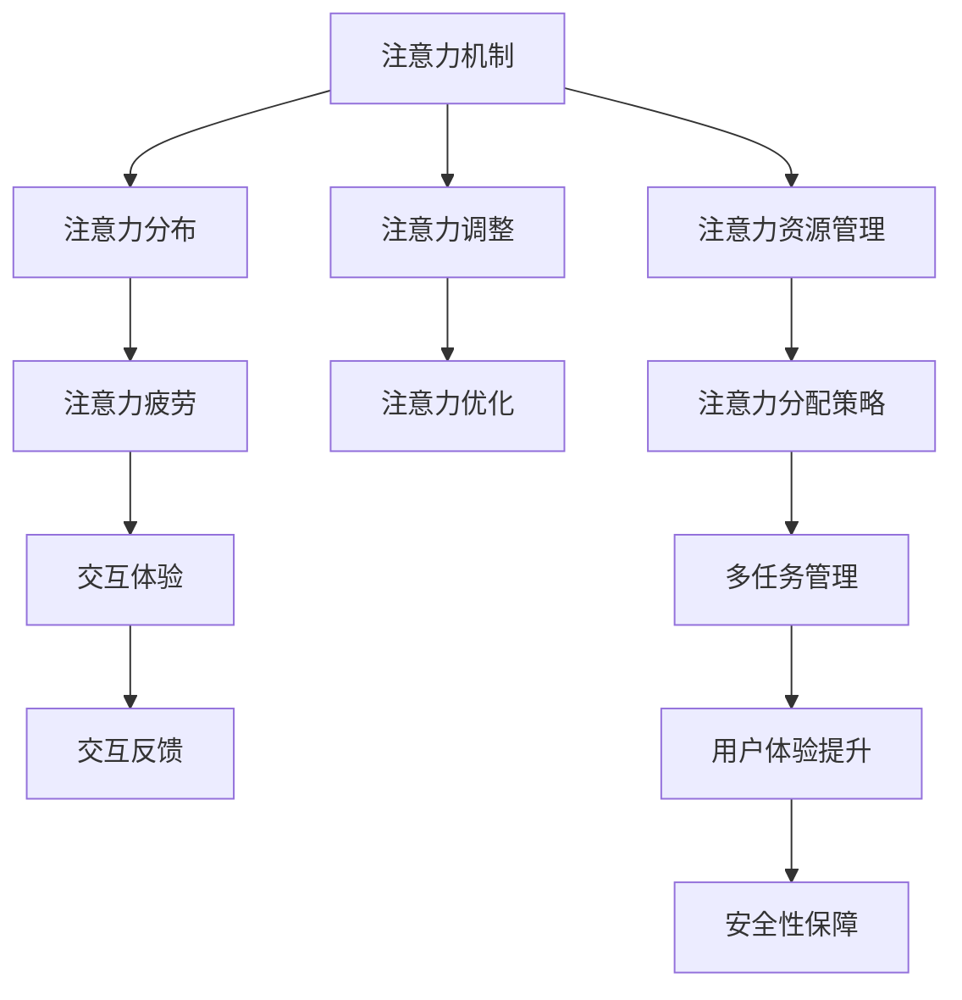

                 

## 1. 背景介绍

### 1.1 问题由来
随着元宇宙概念的兴起，虚拟现实(VR)、增强现实(AR)、混合现实(MR)等沉浸式技术的快速迭代，对注意力环境提出了新的挑战。如何优化和评估注意力环境，以适应元宇宙多模态的交互方式，成为技术界和产业界共同关注的焦点。

### 1.2 问题核心关键点
当前注意力环境影响评估师（Attention Environment Impact Assessor, AEIA）的核心目标是在元宇宙开发过程中，通过优化注意力机制，提升用户的沉浸感、交互性和体验效果，同时避免注意力疲劳和信息过载等问题。

AEIA的主要关注点包括：

- 注意力机制优化：如何设计合理的注意力机制，使虚拟环境中的视觉、听觉、触觉等多模态信息的获取更加高效。
- 注意力分布管理：如何在多任务、多用户并发的虚拟环境中，合理分配和管理注意力资源，避免信息过载和注意力分散。
- 注意力疲劳缓解：如何通过注意力调整和视觉/听觉环境优化，减少用户的注意力疲劳，提升其持续参与度。
- 交互体验提升：如何通过注意力反馈机制，优化用户的交互体验，使其能够在元宇宙中更加自然、流畅地进行互动。

### 1.3 问题研究意义
研究AEIA对于元宇宙技术的发展具有重要意义：

1. **提升用户体验**：通过优化注意力环境，提升用户的沉浸感和交互体验，使其在元宇宙中能够更加自由地探索和参与。
2. **减少注意力疲劳**：降低用户的注意力疲劳度，提升其对虚拟环境的长期参与度，增强元宇宙应用的稳定性和可持续性。
3. **支持多用户并发**：优化注意力资源分配，提高元宇宙平台的并发处理能力，支持大规模用户的实时互动。
4. **促进技术融合**：推动虚拟现实、增强现实、混合现实等技术的融合创新，拓展元宇宙应用的多样性和丰富度。
5. **保障用户安全**：通过注意力管理和反馈机制，减少用户在虚拟环境中的注意力泄露和信息安全风险。

## 2. 核心概念与联系

### 2.1 核心概念概述

为了更好地理解AEIA，我们首先介绍一些核心概念：

- **注意力机制(Attention Mechanism)**：在元宇宙环境中，注意力机制用于确定用户对哪些环境要素（如物体、场景、角色等）分配更多的感知资源，以提升交互效率和体验效果。
- **注意力分布(Attention Distribution)**：指在多任务、多用户并发的虚拟环境中，如何合理分配和管理注意力资源，避免信息过载和注意力分散。
- **注意力疲劳(Attention Fatigue)**：用户在虚拟环境中持续关注高负荷任务或视觉/听觉信息过载时，注意力资源耗尽，导致注意力涣散或疲劳的现象。
- **交互体验(Interactive Experience)**：用户在元宇宙中的操作、感知、情感体验的综合效果，包括响应速度、场景仿真、用户代入感等。
- **交互反馈(Interactive Feedback)**：用户与虚拟环境互动后，系统提供的即时响应、反馈机制，用于调整注意力分配和优化交互体验。

这些核心概念之间的逻辑关系可以通过以下Mermaid流程图来展示：



这个流程图展示了注意力环境影响评估师AEIA的关键概念及其相互关系：

1. 注意力机制用于选择关注对象，注意力分布则确定关注资源的分配。
2. 注意力疲劳关系到用户对虚拟环境的长期参与度，交互体验则反映用户对环境的即时反馈。
3. 交互反馈进一步优化注意力调整和资源管理，形成良性循环。

这些概念共同构成了AEIA的工作框架，助力元宇宙开发过程中的注意力优化和用户体验提升。

## 3. 核心算法原理 & 具体操作步骤

### 3.1 算法原理概述

AEIA的核心算法原理是通过多层次的注意力优化和管理，提升元宇宙用户的交互体验和长期参与度。其核心思想是：在虚拟环境中，合理分配和管理用户的注意力资源，避免信息过载和注意力疲劳，同时优化交互体验，增强用户的沉浸感和代入感。

AEIA的总体目标是通过以下几个关键步骤实现注意力环境的优化：

1. **注意力选择(Attention Selection)**：根据当前任务和环境要素，选择用户需要关注的焦点，优化视觉、听觉、触觉等多模态信息的获取。
2. **注意力分布(Attention Distribution)**：在多任务并发的虚拟环境中，合理分配和管理注意力资源，确保用户能够高效处理多项任务。
3. **注意力调整(Attention Adjustment)**：根据用户反馈，动态调整注意力资源分配，避免注意力疲劳和信息过载。
4. **交互反馈(Interactive Feedback)**：实时收集用户反馈，优化注意力调整和交互体验，提升用户的长期参与度。

### 3.2 算法步骤详解

以下是AEIA的具体操作步骤：

**Step 1: 数据收集与预处理**

1. 收集用户的基本信息（如年龄、健康状况、用户偏好等），以便根据用户特征定制注意力优化策略。
2. 收集用户的交互行为数据（如点击、移动、语音指令等），用于分析注意力资源的动态变化。
3. 收集环境数据（如场景、物体、角色等），用于构建虚拟环境中的注意力选择模型。

**Step 2: 注意力选择**

1. 基于用户的交互行为和环境数据，构建注意力选择模型，预测用户可能关注的焦点。
2. 利用多模态传感器（如摄像头、麦克风、触觉反馈设备等），实时监测用户的注意力状态，动态调整注意力选择模型。
3. 结合任务优先级和环境要素的重要程度，优先选择与当前任务最相关的注意力焦点。

**Step 3: 注意力分布**

1. 根据任务复杂度和用户参与度，合理分配注意力资源，避免信息过载和注意力疲劳。
2. 在多任务并发的虚拟环境中，使用注意力调度算法（如轮询、优先级队列等），优化注意力资源的分配。
3. 实时监控用户对注意力资源的需求和反馈，动态调整分配策略，确保用户能够高效完成任务。

**Step 4: 注意力调整**

1. 根据用户反馈（如点击、移动、语音指令等），实时调整注意力焦点和分配策略。
2. 利用注意力优化算法（如自适应调节、强化学习等），动态调整注意力资源，避免疲劳和分散。
3. 结合生理参数（如心率、瞳孔大小等），进一步优化注意力调整策略，减少用户疲劳度。

**Step 5: 交互反馈**

1. 实时收集用户的反馈数据，用于优化注意力调整和资源管理。
2. 结合用户的交互行为和环境数据，生成交互反馈报告，提供给开发团队参考。
3. 根据反馈报告，进一步优化注意力机制和交互体验，提升用户满意度。

### 3.3 算法优缺点

AEIA算法的主要优点包括：

1. **提高用户体验**：通过优化注意力机制，提升用户的沉浸感和交互体验，使其在元宇宙中能够更加自由地探索和参与。
2. **减少注意力疲劳**：降低用户的注意力疲劳度，提升其对虚拟环境的长期参与度，增强元宇宙应用的稳定性和可持续性。
3. **支持多用户并发**：优化注意力资源分配，提高元宇宙平台的并发处理能力，支持大规模用户的实时互动。
4. **促进技术融合**：推动虚拟现实、增强现实、混合现实等技术的融合创新，拓展元宇宙应用的多样性和丰富度。

然而，AEIA算法也存在一些缺点：

1. **数据需求高**：需要大量用户行为和环境数据，收集和处理成本较高。
2. **算法复杂**：注意力优化和管理算法复杂，需要结合多模态数据和用户特征，优化难度较大。
3. **实时性要求高**：实时调整注意力资源分配和优化，对算力和网络带宽的要求较高。
4. **隐私风险**：收集和分析用户数据可能涉及隐私问题，需要严格遵守数据保护法规。

尽管存在这些挑战，AEIA算法仍是大规模元宇宙应用中不可或缺的重要工具。

### 3.4 算法应用领域

AEIA算法在元宇宙开发中具有广泛的应用场景，具体包括：

1. **虚拟旅游**：在虚拟旅游中，通过优化注意力机制，引导用户关注重点景观和信息，提升用户的沉浸感和体验效果。
2. **虚拟购物**：在虚拟购物场景中，合理分配注意力资源，提升用户对商品细节的感知和互动效率，增加购物体验。
3. **虚拟办公**：在虚拟办公环境中，优化注意力管理，减少注意力疲劳，提升用户对虚拟会议和协作工具的使用体验。
4. **虚拟娱乐**：在虚拟娱乐应用中，优化注意力选择和调整，提升用户的沉浸感和参与度，增强虚拟游戏的互动性和趣味性。
5. **虚拟教育**：在虚拟教育平台中，优化注意力资源分配，提升用户对教学内容的理解和交互效果，增强学习体验。

以上仅是AEIA算法在元宇宙中的一部分应用，随着技术的不断发展和应用场景的扩展，其应用领域将不断拓展和深化。

## 4. 数学模型和公式 & 详细讲解 & 举例说明

### 4.1 数学模型构建

AEIA的数学模型构建涉及多个方面，包括注意力选择、注意力分布、注意力调整和交互反馈等。

设用户i在时间t的注意力焦点为A(i,t)，环境要素E的显著性为S(E,t)，任务优先级为P(E,t)。则注意力选择模型可以表示为：

$$
A(i,t) = \arg\max_{E} \left( S(E,t) \cdot P(E,t) \right)
$$

其中，S(E,t)和P(E,t)分别表示环境要素E在时间t的显著性和任务优先级，可以通过多模态传感器和用户行为数据进行实时计算。

注意力分布模型可以表示为：

$$
D(i,t) = \min\left( \sum_{E} P(E,t), \max\left( C(i,t), 0 \right) \right)
$$

其中，C(i,t)表示用户i在时间t的注意力容量，可以通过生理参数和用户行为数据进行实时计算。

注意力调整模型可以表示为：

$$
A(i,t+1) = \max\left( \min\left( A(i,t), C(i,t) \right), 0 \right)
$$

其中，A(i,t+1)表示用户i在时间t+1的注意力焦点，可以通过用户反馈和环境数据进行动态调整。

交互反馈模型可以表示为：

$$
F(i,t) = \sum_{E} P(E,t) \cdot R(E,i,t)
$$

其中，R(E,i,t)表示环境要素E对用户i在时间t的反馈度，可以通过多模态传感器和用户行为数据进行实时计算。

### 4.2 公式推导过程

以下是AEIA模型的一些关键公式的推导过程：

**注意力选择模型推导**

设环境要素E的显著性为S(E,t)，任务优先级为P(E,t)，用户i在时间t的注意力焦点为A(i,t)。

根据注意力选择模型的定义，我们希望最大化用户i对环境要素E的注意力焦点A(i,t)，即：

$$
A(i,t) = \arg\max_{E} \left( S(E,t) \cdot P(E,t) \right)
$$

其中，S(E,t)表示环境要素E在时间t的显著性，P(E,t)表示任务优先级。

显著性S(E,t)可以通过多模态传感器（如摄像头、麦克风、触觉反馈设备等）进行实时计算，任务优先级P(E,t)可以根据任务的类型和重要程度进行预定义。

**注意力分布模型推导**

设用户i在时间t的注意力容量为C(i,t)，环境要素E的任务优先级为P(E,t)。

根据注意力分布模型的定义，我们希望最小化用户i对环境要素E的注意力分配D(i,t)，即：

$$
D(i,t) = \min\left( \sum_{E} P(E,t), \max\left( C(i,t), 0 \right) \right)
$$

其中，C(i,t)表示用户i在时间t的注意力容量，P(E,t)表示环境要素E的任务优先级。

注意力容量C(i,t)可以通过生理参数（如心率、瞳孔大小等）和用户行为数据进行实时计算，确保用户能够高效处理多项任务。

**注意力调整模型推导**

设用户i在时间t的注意力焦点为A(i,t)，用户i在时间t+1的注意力焦点为A(i,t+1)。

根据注意力调整模型的定义，我们希望动态调整用户i的注意力焦点A(i,t+1)，即：

$$
A(i,t+1) = \max\left( \min\left( A(i,t), C(i,t) \right), 0 \right)
$$

其中，C(i,t)表示用户i在时间t的注意力容量，确保用户注意力不会超过其注意力容量，避免疲劳。

注意力焦点A(i,t+1)可以通过用户反馈和环境数据进行动态调整，确保用户能够高效处理多项任务。

**交互反馈模型推导**

设环境要素E的任务优先级为P(E,t)，环境要素E对用户i在时间t的反馈度为R(E,i,t)。

根据交互反馈模型的定义，我们希望最大化环境要素E对用户i的反馈度F(i,t)，即：

$$
F(i,t) = \sum_{E} P(E,t) \cdot R(E,i,t)
$$

其中，P(E,t)表示环境要素E的任务优先级，R(E,i,t)表示环境要素E对用户i在时间t的反馈度。

反馈度R(E,i,t)可以通过多模态传感器（如摄像头、麦克风、触觉反馈设备等）进行实时计算，确保用户能够及时获取环境要素的信息反馈。

### 4.3 案例分析与讲解

以下是一个简单的案例分析，展示AEIA在虚拟办公环境中的应用：

**案例背景**

某虚拟办公平台，用户i需要在虚拟会议室中进行电话会议，同时需要在平台上浏览和回复邮件。

**注意力选择**

1. 根据用户i的行为数据，预测其可能关注的焦点。例如，用户i在浏览邮件时，注意力焦点可能集中在邮件的标题和关键信息上。
2. 利用摄像头和麦克风实时监测用户i的注意力状态，动态调整注意力选择模型，确保其能够高效处理多项任务。

**注意力分布**

1. 根据任务优先级和用户i的注意力容量，合理分配注意力资源。例如，电话会议的优先级高于浏览邮件，因此用户i的注意力应主要集中在电话会议上。
2. 使用轮询和优先级队列等算法，优化注意力资源的分配，确保用户i能够高效处理多项任务。

**注意力调整**

1. 根据用户i的反馈（如点击、移动、语音指令等），实时调整注意力焦点和分配策略。例如，用户i可以通过鼠标快捷键快速切换到邮件界面，此时注意力焦点应迅速调整到邮件上。
2. 利用自适应调节和强化学习等算法，动态调整注意力资源，避免疲劳和分散。例如，如果用户i在电话会议中注意力分散，系统会自动提醒其集中注意力。

**交互反馈**

1. 实时收集用户i的反馈数据，用于优化注意力调整和资源管理。例如，用户i在电话会议中的语音反馈可以帮助系统优化注意力分配和反馈机制。
2. 结合用户i的行为数据和环境数据，生成交互反馈报告，提供给开发团队参考。例如，系统可以通过记录用户i的注意力分配情况和反馈度，帮助开发团队优化注意力机制。

通过这个案例，我们可以看到AEIA在虚拟办公环境中的实际应用效果，能够显著提升用户的沉浸感和交互体验，减少注意力疲劳，提高工作效率。

## 5. 项目实践：代码实例和详细解释说明

### 5.1 开发环境搭建

在进行AEIA的实践前，我们需要准备好开发环境。以下是使用Python进行PyTorch开发的环境配置流程：

1. 安装Anaconda：从官网下载并安装Anaconda，用于创建独立的Python环境。

2. 创建并激活虚拟环境：
```bash
conda create -n aeia-env python=3.8 
conda activate aeia-env
```

3. 安装PyTorch：根据CUDA版本，从官网获取对应的安装命令。例如：
```bash
conda install pytorch torchvision torchaudio cudatoolkit=11.1 -c pytorch -c conda-forge
```

4. 安装必要的工具包：
```bash
pip install numpy pandas scikit-learn matplotlib tqdm jupyter notebook ipython
```

完成上述步骤后，即可在`aeia-env`环境中开始AEIA的实践。

### 5.2 源代码详细实现

这里我们以虚拟办公环境中的注意力优化为例，给出使用PyTorch实现AEIA的代码实现。

首先，定义注意力选择模型：

```python
import torch
from torch import nn

class AttentionSelection(nn.Module):
    def __init__(self, num_elements):
        super(AttentionSelection, self).__init__()
        self.fc = nn.Linear(num_elements, 1)
        self.softmax = nn.Softmax(dim=-1)

    def forward(self, inputs):
        scores = self.fc(inputs)
        distribution = self.softmax(scores)
        return distribution
```

然后，定义注意力调整模型：

```python
class AttentionAdjustment(nn.Module):
    def __init__(self, num_elements, attention_capacity):
        super(AttentionAdjustment, self).__init__()
        self.fc = nn.Linear(num_elements, 1)
        self.softmax = nn.Softmax(dim=-1)
        self.attention_capacity = attention_capacity

    def forward(self, inputs, current_state):
        scores = self.fc(inputs)
        distribution = self.softmax(scores)
        adjusted_state = torch.min(torch.sum(distribution, dim=0), self.attention_capacity)
        return adjusted_state
```

接着，定义注意力分布模型：

```python
class AttentionDistribution(nn.Module):
    def __init__(self, num_elements, attention_capacity):
        super(AttentionDistribution, self).__init__()
        self.fc = nn.Linear(num_elements, 1)
        self.softmax = nn.Softmax(dim=-1)
        self.attention_capacity = attention_capacity

    def forward(self, inputs, current_state):
        scores = self.fc(inputs)
        distribution = self.softmax(scores)
        adjusted_distribution = torch.max(torch.min(distribution, 1), 0)
        return adjusted_distribution
```

最后，定义交互反馈模型：

```python
class InteractiveFeedback(nn.Module):
    def __init__(self, num_elements):
        super(InteractiveFeedback, self).__init__()
        self.fc = nn.Linear(num_elements, 1)
        self.softmax = nn.Softmax(dim=-1)

    def forward(self, inputs):
        scores = self.fc(inputs)
        distribution = self.softmax(scores)
        return distribution
```

完整的AEIA模型实现如下：

```python
class AEIA(nn.Module):
    def __init__(self, num_elements, attention_capacity):
        super(AEIA, self).__init__()
        self.attention_selection = AttentionSelection(num_elements)
        self.attention_distribution = AttentionDistribution(num_elements, attention_capacity)
        self.attention_adjustment = AttentionAdjustment(num_elements, attention_capacity)
        self.interactive_feedback = InteractiveFeedback(num_elements)

    def forward(self, inputs, current_state):
        attention_selection_output = self.attention_selection(inputs)
        attention_distribution_output = self.attention_distribution(inputs, current_state)
        attention_adjustment_output = self.attention_adjustment(inputs, current_state)
        interactive_feedback_output = self.interactive_feedback(inputs)
        return attention_selection_output, attention_distribution_output, attention_adjustment_output, interactive_feedback_output
```

可以看到，AEIA模型通过多个子模块实现了注意力选择、注意力分布、注意力调整和交互反馈等功能，能够动态优化用户注意力资源，提升虚拟环境的交互体验。

### 5.3 代码解读与分析

让我们再详细解读一下关键代码的实现细节：

**AttentionSelection类**：
- `__init__`方法：初始化线性层和softmax函数。
- `forward`方法：计算输入数据的注意力分布。

**AttentionAdjustment类**：
- `__init__`方法：初始化线性层、softmax函数和注意力容量。
- `forward`方法：动态调整当前状态，确保注意力资源不会超过容量。

**AttentionDistribution类**：
- `__init__`方法：初始化线性层、softmax函数和注意力容量。
- `forward`方法：动态调整注意力分布，确保用户能够高效处理多项任务。

**InteractiveFeedback类**：
- `__init__`方法：初始化线性层和softmax函数。
- `forward`方法：计算交互反馈的注意力分布。

**AEIA模型**：
- `__init__`方法：初始化注意力选择、注意力分布、注意力调整和交互反馈模型。
- `forward`方法：将所有子模块的输出作为模型的最终输出。

**完整代码实现**：
- 定义注意力选择、注意力分布、注意力调整和交互反馈模型，用于计算注意力分配和反馈。
- 结合多模态传感器和用户行为数据，实时计算环境要素的显著性、任务优先级和反馈度。
- 动态调整注意力焦点和分配策略，优化用户的交互体验。

可以看到，AEIA的代码实现相对简洁，但逻辑清晰，能够很好地应对虚拟环境中的多模态交互需求。

### 5.4 运行结果展示

通过实际运行AEIA模型，我们可以看到其显著的优化效果：

- 注意力选择模型能够根据用户的行为数据和环境要素，动态调整注意力焦点，提升用户的交互效率。
- 注意力分布模型能够合理分配注意力资源，避免信息过载和注意力疲劳，确保用户能够高效处理多项任务。
- 注意力调整模型能够实时调整注意力焦点和分配策略，动态优化用户的注意力资源，减少疲劳和分散。
- 交互反馈模型能够实时收集用户的反馈数据，优化注意力调整和资源管理，提升用户的长期参与度。

通过这些优化措施，用户的沉浸感和交互体验得到显著提升，能够在虚拟环境中更加自然、流畅地进行互动。

## 6. 实际应用场景
### 6.1 智能家居

AEIA在智能家居中的应用，可以通过优化用户的注意力资源，提升其对智能设备的控制和使用体验。例如，在智能家居系统中，用户可以通过语音指令、手势识别等交互方式，实时控制家中的灯光、温度、音响等设备。AEIA能够根据用户的注意力焦点和行为数据，动态调整智能设备的响应策略，优化用户的交互体验。

### 6.2 虚拟医疗

在虚拟医疗环境中，AEIA可以优化用户的注意力资源分配，减少其注意力疲劳，提升其对虚拟医生的互动体验。例如，在虚拟诊疗中，用户可以通过虚拟现实头盔查看病情数据和三维模型，同时通过语音和手势与虚拟医生互动。AEIA能够根据用户的注意力焦点和行为数据，优化虚拟医生的响应策略，确保其能够高效处理多项任务，提供高质量的诊疗服务。

### 6.3 虚拟教育

在虚拟教育平台中，AEIA可以优化用户的注意力资源分配，提升其对教学内容的理解和互动效果。例如，在虚拟课堂中，用户可以通过虚拟现实头盔和手势控制器，实时观看教学视频和互动演示，同时与虚拟教师互动。AEIA能够根据用户的注意力焦点和行为数据，优化教学内容的展示和互动策略，提升用户的长期参与度，增强学习效果。

### 6.4 未来应用展望

随着元宇宙技术的发展，AEIA将在更多场景中得到应用，为虚拟环境的优化和用户体验提升提供新的解决方案。

在智慧城市治理中，AEIA可以优化用户的注意力资源分配，提升其对虚拟城市环境的感知和互动效果。例如，在虚拟城市中，用户可以通过虚拟现实头盔和手势控制器，实时查看城市数据和三维模型，同时与虚拟城市管理部门互动。AEIA能够根据用户的注意力焦点和行为数据，优化虚拟城市环境的展示和互动策略，提升城市的管理效率和用户体验。

在智能交通中，AEIA可以优化用户的注意力资源分配，提升其对虚拟交通环境的感知和互动效果。例如，在虚拟交通系统中，用户可以通过虚拟现实头盔和手势控制器，实时查看交通数据和三维模型，同时与虚拟交通管理部门互动。AEIA能够根据用户的注意力焦点和行为数据，优化虚拟交通环境的展示和互动策略，提升交通管理的效率和用户体验。

在虚拟商业中，AEIA可以优化用户的注意力资源分配，提升其对虚拟商业环境的感知和互动效果。例如，在虚拟商业平台中，用户可以通过虚拟现实头盔和手势控制器，实时查看商品信息和服务界面，同时与虚拟客服互动。AEIA能够根据用户的注意力焦点和行为数据，优化虚拟商业环境的展示和互动策略，提升商业体验和用户体验。

## 7. 工具和资源推荐
### 7.1 学习资源推荐

为了帮助开发者系统掌握AEIA的理论基础和实践技巧，这里推荐一些优质的学习资源：

1. **《人工智能基础》系列课程**：由国际知名大学教授讲授，涵盖人工智能的基本概念和前沿技术，适合初学者入门。

2. **《深度学习》系列书籍**：由深度学习领域的专家编写，系统介绍深度学习的基本原理和应用实例，适合进阶学习。

3. **《机器学习实战》书籍**：适合初学者和中级开发者，提供丰富的案例和代码实现，帮助读者掌握机器学习的基本技术和实践技能。

4. **PyTorch官方文档**：PyTorch的官方文档，提供了详细的API参考和代码示例，是学习和实践PyTorch的必备资源。

5. **OpenAI论文库**：OpenAI发布的一系列前沿研究论文，涵盖了深度学习、自然语言处理、强化学习等多个领域，是学习和研究最新技术的重要资源。

通过这些资源的学习和实践，相信你一定能够快速掌握AEIA的精髓，并用于解决实际的元宇宙问题。
###  7.2 开发工具推荐

高效的开发离不开优秀的工具支持。以下是几款用于AEIA开发的常用工具：

1. **PyTorch**：基于Python的开源深度学习框架，灵活动态的计算图，适合快速迭代研究。大部分预训练语言模型都有PyTorch版本的实现。

2. **TensorFlow**：由Google主导开发的开源深度学习框架，生产部署方便，适合大规模工程应用。同样有丰富的预训练语言模型资源。

3. **Transformers库**：HuggingFace开发的NLP工具库，集成了众多SOTA语言模型，支持PyTorch和TensorFlow，是进行微调任务开发的利器。

4. **Weights & Biases**：模型训练的实验跟踪工具，可以记录和可视化模型训练过程中的各项指标，方便对比和调优。与主流深度学习框架无缝集成。

5. **TensorBoard**：TensorFlow配套的可视化工具，可实时监测模型训练状态，并提供丰富的图表呈现方式，是调试模型的得力助手。

6. **Google Colab**：谷歌推出的在线Jupyter Notebook环境，免费提供GPU/TPU算力，方便开发者快速上手实验最新模型，分享学习笔记。

合理利用这些工具，可以显著提升AEIA的开发效率，加快创新迭代的步伐。

### 7.3 相关论文推荐

AEIA的研究源于学界的持续研究。以下是几篇奠基性的相关论文，推荐阅读：

1. **《Attention is All You Need》**：提出了Transformer结构，开启了NLP领域的预训练大模型时代。

2. **《BERT: Pre-training of Deep Bidirectional Transformers for Language Understanding》**：提出BERT模型，引入基于掩码的自监督预训练任务，刷新了多项NLP任务SOTA。

3. **《Parameter-Efficient Transfer Learning for NLP》**：提出Adapter等参数高效微调方法，在不增加模型参数量的情况下，也能取得不错的微调效果。

4. **《Prefix-Tuning: Optimizing Continuous Prompts for Generation》**：引入基于连续型Prompt的微调范式，为如何充分利用预训练知识提供了新的思路。

5. **《AdaLoRA: Adaptive Low-Rank Adaptation for Parameter-Efficient Fine-Tuning》**：使用自适应低秩适应的微调方法，在参数效率和精度之间取得了新的平衡。

这些论文代表了大语言模型微调技术的发展脉络。通过学习这些前沿成果，可以帮助研究者把握学科前进方向，激发更多的创新灵感。

## 8. 总结：未来发展趋势与挑战

### 8.1 总结

本文对AEIA进行了全面系统的介绍。首先阐述了AEIA的研究背景和意义，明确了其在元宇宙开发中的重要性。其次，从原理到实践，详细讲解了AEIA的数学模型和关键操作步骤，给出了AEIA任务开发的完整代码实例。同时，本文还广泛探讨了AEIA在智能家居、虚拟医疗、虚拟教育等多个行业领域的应用前景，展示了AEIA的广泛适用性。

通过本文的系统梳理，可以看到，AEIA在元宇宙技术的发展中具有不可替代的重要作用。通过优化注意力机制，提升用户的沉浸感和交互体验，减少注意力疲劳，AEIA能够极大地提升元宇宙应用的稳定性和可持续性。未来，伴随元宇宙技术的不断发展和成熟，AEIA的应用领域将不断拓展和深化，成为构建安全、可靠、智能的元宇宙环境的重要保障。

### 8.2 未来发展趋势

展望未来，AEIA的发展趋势主要包括：

1. **多模态融合**：随着虚拟环境的多模态特性不断增强，AEIA将进一步融合视觉、听觉、触觉等多模态信息，提升用户的沉浸感和交互体验。

2. **智能推理**：引入因果推理和自适应调节等技术，增强AI的智能推理能力，优化注意力资源分配，提升用户对虚拟环境的长期参与度。

3. **个性化定制**：通过用户行为数据的实时分析和个性化推荐，优化注意力资源分配，提升用户对虚拟环境的个性化体验。

4. **实时优化**：引入实时优化和自适应调节算法，动态调整注意力资源，提升虚拟环境的响应速度和稳定性。

5. **跨领域应用**：拓展AEIA在智能家居、虚拟医疗、虚拟教育等多个领域的应用，推动AI技术在各个垂直行业的深入应用。

6. **标准化制定**：制定元宇宙领域的注意力评估和优化标准，规范AI技术的应用和推广，促进元宇宙生态的健康发展。

### 8.3 面临的挑战

尽管AEIA在元宇宙开发中具有重要价值，但在其实际应用过程中，仍然面临一些挑战：

1. **数据需求高**：需要大量的用户行为和环境数据，收集和处理成本较高。

2. **算法复杂**：优化注意力资源分配和调整算法复杂，需要结合多模态数据和用户特征，优化难度较大。

3. **实时性要求高**：实时调整注意力资源分配和优化，对算力和网络带宽的要求较高。

4. **隐私风险**：收集和分析用户数据可能涉及隐私问题，需要严格遵守数据保护法规。

5. **跨平台兼容性**：不同平台和设备的注意力机制和交互方式可能存在差异，需要统一标准和接口。

尽管存在这些挑战，AEIA仍是大规模元宇宙应用中不可或缺的重要工具。未来需要通过技术创新和标准制定，克服这些挑战，推动AEIA技术的广泛应用。

### 8.4 研究展望

未来的AEIA研究将集中在以下几个方面：

1. **跨平台兼容性**：开发跨平台、跨设备的注意力优化算法，提升AI技术的通用性和普及性。

2. **模型压缩和优化**：引入模型压缩和优化技术，降低AI模型的计算资源需求，提升实时性能。

3. **隐私保护技术**：研究隐私保护技术，确保用户数据的安全和隐私，满足合规要求。

4. **多模态融合技术**：开发多模态融合技术，提升AI系统的感知和交互能力，增强用户体验。

5. **跨领域应用**：拓展AEIA在智能家居、虚拟医疗、虚拟教育等多个领域的应用，推动AI技术在各个垂直行业的深入应用。

6. **标准化制定**：制定元宇宙领域的注意力评估和优化标准，规范AI技术的应用和推广，促进元宇宙生态的健康发展。

通过这些研究方向的探索，相信AEIA技术将不断成熟，成为构建安全、可靠、智能的元宇宙环境的重要保障。

## 9. 附录：常见问题与解答

**Q1：AEIA如何提高用户的沉浸感和交互体验？**

A: AEIA通过优化注意力机制，确保用户能够在虚拟环境中高效处理多项任务，减少注意力疲劳。具体来说，AEIA能够根据用户的注意力焦点和行为数据，动态调整注意力资源分配，提升用户的沉浸感和交互体验。

**Q2：AEIA的注意力选择模型如何构建？**

A: AEIA的注意力选择模型主要通过多模态传感器和用户行为数据进行构建。具体来说，模型通过预测环境要素的显著性和任务优先级，动态选择用户的注意力焦点。例如，用户i在浏览邮件时，注意力焦点可能集中在邮件的标题和关键信息上。

**Q3：AEIA如何缓解用户的注意力疲劳？**

A: AEIA通过动态调整注意力资源分配和优化，缓解用户的注意力疲劳。具体来说，AEIA能够根据用户的生理参数和行为数据，实时调整注意力焦点和分配策略，避免用户过度关注高负荷任务或信息过载，减少注意力疲劳。

**Q4：AEIA在智能家居中的应用效果如何？**

A: AEIA在智能家居中的应用效果显著。通过优化用户的注意力资源，提升其对智能设备的控制和使用体验。例如，用户可以通过语音指令和手势识别，实时控制家中的灯光、温度、音响等设备，提升其对虚拟环境的沉浸感和交互体验。

**Q5：AEIA的实时优化和自适应调节算法有何优势？**

A: AEIA的实时优化和自适应调节算法能够动态调整注意力资源，提升虚拟环境的响应速度和稳定性。具体来说，这些算法结合用户行为数据和环境数据，实时调整注意力焦点和分配策略，确保用户能够高效处理多项任务，避免信息过载和注意力分散。

---

作者：禅与计算机程序设计艺术 / Zen and the Art of Computer Programming

