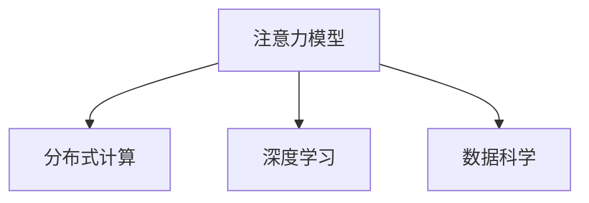

                 

# 注意力生态系统守护者：AI时代的认知资源管理员

> 关键词：认知资源管理,注意力模型,分布式计算,深度学习,人工智能,数据科学

## 1. 背景介绍

### 1.1 问题由来

在人工智能（AI）领域，尤其是深度学习（DL）和神经网络（NN）中，“注意力”概念的重要性逐渐凸显。无论是计算机视觉（CV）中的卷积神经网络（CNN），还是自然语言处理（NLP）中的Transformer架构，“注意力”机制在处理复杂数据结构时发挥着核心作用。但伴随着模型的复杂化，注意力机制本身也成为系统资源管理的重点。如何在AI时代有效管理注意力资源，保障系统的稳定性和高效性，是当前研究的重要课题。

### 1.2 问题核心关键点

注意力资源的合理管理，对于提升AI模型的训练和推理效率至关重要。具体而言，需要解决以下几个核心问题：

- 如何高效分配注意力计算资源，减少资源浪费。
- 如何优化注意力机制，提高模型对于复杂数据结构的处理能力。
- 如何在分布式系统中，协同调度注意力资源，提升整体系统的吞吐量。

### 1.3 问题研究意义

注意力生态系统的守护者，旨在为AI时代的认知资源管理提供科学的方法和工具，具有重要意义：

1. 提升AI系统的计算效率。通过合理分配注意力资源，可以有效降低训练和推理过程中的计算资源消耗，加速AI应用的开发和部署。
2. 增强AI系统的性能表现。优化注意力机制可以提升模型对于复杂数据结构的处理能力，进一步推动AI技术的发展。
3. 支持分布式AI应用。随着大规模数据集和模型的出现，分布式系统成为必然选择。合理的注意力资源调度策略，可以提升分布式AI系统整体性能，保障系统的高效运行。
4. 推动AI技术的应用普及。认知资源的管理与优化，使得更多开发者能够低门槛地进入AI领域，推动AI技术在各行业的应用落地。

## 2. 核心概念与联系

### 2.1 核心概念概述

为更好地理解注意力生态系统守护者的核心概念，本节将介绍几个密切相关的核心概念：

- 注意力模型（Attention Model）：一种特殊的神经网络机制，通过计算输入数据与上下文的相似度，对输入数据进行加权处理，以提升复杂结构数据处理的效率。
- 分布式计算（Distributed Computing）：将一个复杂的计算任务分解为多个子任务，分布式并行计算，提升计算效率，降低单点资源负担。
- 深度学习（Deep Learning）：一种基于神经网络的机器学习方法，通过多层次的特征提取，实现复杂模式识别和数据处理。
- 数据科学（Data Science）：一门交叉学科，旨在从数据中提取知识，以解决实际问题。

这些核心概念之间的逻辑关系可以通过以下Mermaid流程图来展示：



这个流程图展示了注意力模型的关键组件及其之间的关系：

1. 注意力模型通过计算输入数据与上下文的相似度，实现对输入数据的高效加权处理。
2. 分布式计算将注意力计算任务分解为多个子任务，进行并行计算，提升计算效率。
3. 深度学习通过多层次的特征提取，进一步提升模型的复杂数据处理能力。
4. 数据科学则通过对数据的分析和理解，辅助模型设计，优化注意力资源的分配。

这些概念共同构成了注意力生态系统的核心框架，使得注意力模型在处理复杂数据结构时，能够高效地分配和利用计算资源。

## 3. 核心算法原理 & 具体操作步骤
### 3.1 算法原理概述

基于注意力机制的AI系统，其计算资源的合理分配和管理，是保证系统稳定性和高效性的关键。注意力资源的分配和优化，主要依赖于以下几个核心算法原理：

1. **注意力机制**：通过计算输入数据与上下文的相似度，对输入数据进行加权处理。对于不同的输入数据，分配不同的注意力权重，从而实现对复杂数据结构的精细处理。
2. **分布式计算**：将注意力计算任务分解为多个子任务，分布式并行计算，提高计算效率，降低单点资源负担。
3. **深度学习框架优化**：通过优化深度学习框架中的计算图，提升注意力计算的效率，降低资源消耗。
4. **资源调度策略**：合理设计资源调度策略，动态调整注意力资源的分配，实现系统的负载均衡。

### 3.2 算法步骤详解

基于注意力机制的AI系统资源管理，主要涉及以下几个关键步骤：

**Step 1: 构建注意力模型**

构建注意力模型，需要选择合适的注意力算法，如自注意力机制（Self-Attention）或多头注意力机制（Multi-Head Attention）。针对不同的应用场景，选择适合的注意力模型，以实现对输入数据的加权处理。

**Step 2: 分布式任务拆分**

将注意力计算任务按照数据分片或功能模块进行拆分，形成多个独立的子任务。根据每个子任务所需计算资源的需求，合理分配资源，提高计算效率。

**Step 3: 并行计算优化**

在分布式系统中，采用并行计算技术，对多个子任务进行并行处理，提升计算速度。在并行计算过程中，合理分配任务队列，避免任务竞争导致的资源浪费。

**Step 4: 深度学习框架优化**

选择高性能的深度学习框架，如TensorFlow、PyTorch等，利用框架自带的优化策略，提升计算图优化效果，降低计算资源消耗。

**Step 5: 资源调度策略设计**

根据系统的实时运行状态，动态调整注意力计算资源的分配策略，如动态扩展/缩减计算节点，调整任务优先级等，实现系统的负载均衡。

**Step 6: 性能监控与调优**

实时监控系统的运行性能指标，如计算资源使用率、任务执行时间等，根据监控结果，及时调整资源分配策略，优化系统性能。

### 3.3 算法优缺点

基于注意力机制的AI系统资源管理，具有以下优点：

1. 计算效率高。通过分布式计算和并行处理，显著提高注意力计算的效率，缩短训练和推理时间。
2. 灵活性高。合理分配注意力资源，可动态调整计算节点数量，应对不同规模的数据和任务。
3. 可扩展性强。支持大规模数据集和模型的训练和推理，提升系统的扩展性和鲁棒性。
4. 资源利用率高。通过动态资源调度，合理分配注意力资源，避免资源浪费，提升资源利用率。

同时，该方法也存在一些局限性：

1. 系统复杂度高。分布式计算和动态资源调度的实现较为复杂，需要综合考虑任务依赖和资源限制。
2. 数据通信开销大。分布式计算过程中，数据在节点之间的传输和通信，可能会增加系统负担。
3. 负载均衡难度高。系统实时负载均衡的实现较为复杂，需要综合考虑任务的计算需求和资源供给。

尽管存在这些局限性，但就目前而言，基于注意力机制的AI系统资源管理，仍是大规模深度学习系统资源管理的重要手段。未来相关研究的重点在于如何进一步优化分布式计算策略，降低通信开销，提升系统性能。

### 3.4 算法应用领域

基于注意力机制的AI系统资源管理，在诸多领域中已得到广泛应用：

1. 自然语言处理（NLP）：在机器翻译、文本生成、问答系统等任务中，通过优化注意力计算，提升模型的复杂数据处理能力，缩短模型训练时间。
2. 计算机视觉（CV）：在图像分类、目标检测、图像分割等任务中，通过优化注意力计算，提升模型对于复杂图像特征的提取和理解能力。
3. 语音识别（ASR）：在语音识别任务中，通过优化注意力计算，提高模型的鲁棒性和准确性。
4. 推荐系统：在大规模推荐系统中，通过优化注意力计算，提升推荐算法的效率和效果。
5. 金融风控：在金融领域，通过优化注意力计算，提升模型对于复杂交易数据的处理能力和风险预测准确性。

这些应用场景中，注意力机制的高效管理和优化，极大地提升了AI系统的性能和效率，推动了各领域的发展。

## 4. 数学模型和公式 & 详细讲解 & 举例说明（备注：数学公式请使用latex格式，latex嵌入文中独立段落使用 $$，段落内使用 $)
### 4.1 数学模型构建

为便于理解注意力生态系统的资源管理原理，本文将通过一个简单的自注意力模型来进行推导。

假设输入数据为 $x = (x_1, x_2, ..., x_n)$，上下文向量为 $c = (c_1, c_2, ..., c_n)$。自注意力模型的计算公式为：

$$
\text{Attention}(Q, K, V) = \text{softmax}\left(\frac{QK^T}{\sqrt{d_k}}\right)V
$$

其中 $Q, K, V$ 分别为查询矩阵、键矩阵和值矩阵，$d_k$ 为键矩阵的维度。

注意力计算的目标是对输入数据 $x$ 进行加权处理，从而得到对上下文向量 $c$ 的加权平均值。在实际应用中，可以根据不同的任务需求，选择不同的注意力算法，如多头注意力机制（Multi-Head Attention）、点积注意力（Dot-Product Attention）等。

### 4.2 公式推导过程

以自注意力机制为例，其计算过程可以分解为以下几个步骤：

1. 计算查询矩阵 $Q$：通过输入数据 $x$ 计算得到 $Q$。
2. 计算键矩阵 $K$：通过上下文向量 $c$ 计算得到 $K$。
3. 计算值矩阵 $V$：通过上下文向量 $c$ 计算得到 $V$。
4. 计算注意力权重：通过 $Q$ 和 $K$ 计算注意力权重，即 $softmax\left(\frac{QK^T}{\sqrt{d_k}}\right)$。
5. 计算加权平均值：通过注意力权重和值矩阵 $V$ 计算得到加权平均值，即 $softmax\left(\frac{QK^T}{\sqrt{d_k}}\right)V$。

通过以上步骤，可以理解自注意力机制的计算过程，并进一步分析其计算资源消耗情况。

### 4.3 案例分析与讲解

假设在图像分类任务中，输入数据 $x$ 为一幅图像，上下文向量 $c$ 为图像的特征向量。自注意力机制将图像特征向量中的每个像素点视为一个注意力点，通过计算注意力权重，对像素点进行加权处理，得到对图像特征的加权平均值。

例如，在图像分类任务中，可以通过多头注意力机制，对图像特征进行多次加权处理，从而提升模型的复杂数据处理能力。通过合理分配计算资源，可以提升模型的训练和推理效率。

## 5. 项目实践：代码实例和详细解释说明
### 5.1 开发环境搭建

在进行注意力生态系统守护者的开发实践中，需要搭建相应的开发环境。以下是使用Python进行PyTorch开发的环境配置流程：

1. 安装Anaconda：从官网下载并安装Anaconda，用于创建独立的Python环境。

2. 创建并激活虚拟环境：
```bash
conda create -n pytorch-env python=3.8 
conda activate pytorch-env
```

3. 安装PyTorch：根据CUDA版本，从官网获取对应的安装命令。例如：
```bash
conda install pytorch torchvision torchaudio cudatoolkit=11.1 -c pytorch -c conda-forge
```

4. 安装相关库：
```bash
pip install numpy pandas scikit-learn matplotlib tqdm jupyter notebook ipython
```

完成上述步骤后，即可在`pytorch-env`环境中开始项目实践。

### 5.2 源代码详细实现

下面我们以图像分类任务为例，给出使用PyTorch实现注意力模型的代码实现。

首先，定义注意力计算模块：

```python
import torch
import torch.nn as nn
import torch.nn.functional as F

class SelfAttention(nn.Module):
    def __init__(self, in_dim):
        super(SelfAttention, self).__init__()
        self.in_dim = in_dim
        self.query = nn.Linear(in_dim, in_dim)
        self.key = nn.Linear(in_dim, in_dim)
        self.value = nn.Linear(in_dim, in_dim)
        self.dropout = nn.Dropout(0.5)
        self.softmax = nn.Softmax(dim=-1)
    
    def forward(self, x):
        batch_size = x.size(0)
        q = self.query(x).view(batch_size, -1, self.in_dim).transpose(1, 2)
        k = self.key(x).view(batch_size, -1, self.in_dim)
        v = self.value(x).view(batch_size, -1, self.in_dim)
        attn = self.softmax(torch.matmul(q, k.transpose(-1, -2)) / math.sqrt(self.in_dim))
        attn = self.dropout(attn)
        out = torch.matmul(attn, v)
        return out
```

然后，定义全连接层和输出层：

```python
class Classifier(nn.Module):
    def __init__(self, in_dim, num_classes):
        super(Classifier, self).__init__()
        self.fc = nn.Linear(in_dim, 512)
        self.fc2 = nn.Linear(512, num_classes)
    
    def forward(self, x):
        x = self.fc(x)
        x = F.relu(x)
        x = self.fc2(x)
        return x
```

最后，定义注意力生态系统守护器：

```python
class AttentionGuard(nn.Module):
    def __init__(self, in_dim, num_classes):
        super(AttentionGuard, self).__init__()
        self.self_att = SelfAttention(in_dim)
        self.classifier = Classifier(in_dim, num_classes)
    
    def forward(self, x):
        attn_out = self.self_att(x)
        out = self.classifier(attn_out)
        return out
```

以上是使用PyTorch实现注意力模型和注意力生态系统守护器的完整代码。可以看到，通过合理设计注意力机制和深度学习模型，可以高效地处理复杂数据结构，提升模型的性能和效率。

### 5.3 代码解读与分析

让我们再详细解读一下关键代码的实现细节：

**SelfAttention类**：
- `__init__`方法：初始化注意力计算的相关组件，包括线性变换和softmax函数。
- `forward`方法：实现注意力计算的核心逻辑，包括查询矩阵、键矩阵、值矩阵的计算，注意力权重的计算，加权平均值的计算，以及dropout操作。

**Classifier类**：
- `__init__`方法：定义全连接层和输出层的组件。
- `forward`方法：实现全连接层和输出层的核心逻辑，包括特征的线性变换、ReLU激活和输出。

**AttentionGuard类**：
- `__init__`方法：初始化注意力计算和全连接层的组件。
- `forward`方法：实现整个注意力生态系统守护器的核心逻辑，包括注意力计算和全连接层的级联操作。

通过这些类和代码，可以理解注意力机制在深度学习模型中的应用和优化。在实际应用中，还需要针对具体的任务和数据特点，进行进一步的优化和调参。

## 6. 实际应用场景
### 6.1 智能推荐系统

基于注意力机制的推荐系统，可以应用于电商、新闻、视频等多个领域。通过优化注意力计算，推荐系统能够更好地理解用户的多样化需求，提供个性化的推荐服务。

在实践中，可以通过多任务学习（MTL）的方式，将用户行为数据和物品属性数据结合起来，优化注意力计算，提升推荐算法的性能。同时，采用分布式计算技术，可以处理大规模用户数据和物品数据，提升系统的可扩展性和鲁棒性。

### 6.2 医疗诊断系统

在医疗领域，基于注意力机制的诊断系统，可以应用于医学影像分析、病历处理、临床决策支持等任务。通过优化注意力计算，提升系统对于复杂医疗数据的处理能力，提高诊断的准确性和可靠性。

例如，在医学影像分析中，可以通过自注意力机制，对医学影像进行特征提取和加权处理，从而提升影像识别的准确性。同时，在分布式计算环境中，可以协同处理大规模医疗数据，提高系统的效率和稳定性。

### 6.3 自动驾驶系统

自动驾驶系统中的注意力计算，可以应用于目标检测、路径规划、交通预测等任务。通过优化注意力计算，提升系统对于复杂环境数据的处理能力，保障驾驶安全。

例如，在目标检测中，可以通过多头注意力机制，对摄像头获取的图像数据进行加权处理，提升目标识别的准确性。同时，在分布式计算环境中，可以协同处理多摄像头获取的图像数据，提高系统的鲁棒性和效率。

### 6.4 未来应用展望

随着注意力机制的不断优化和分布式计算技术的发展，基于注意力机制的AI系统将在更多领域得到应用，为各行各业带来变革性影响。

在智慧城市治理中，基于注意力机制的监控系统，可以实时监测城市运行状态，提升城市的应急响应能力和智能化水平。

在金融风控领域，基于注意力机制的预测系统，可以实时分析交易数据，预测市场趋势，保障金融系统的稳定性和安全性。

在智慧医疗领域，基于注意力机制的诊断系统，可以实时分析病历数据，辅助医生决策，提升医疗服务质量。

此外，在教育、物流、供应链等众多领域，基于注意力机制的AI系统也将不断涌现，为经济社会发展注入新的动力。相信随着技术的日益成熟，注意力机制将在构建智能生态系统过程中发挥越来越重要的作用。

## 7. 工具和资源推荐
### 7.1 学习资源推荐

为了帮助开发者系统掌握注意力生态系统的守护者技术，这里推荐一些优质的学习资源：

1. 《深度学习框架PyTorch官方文档》：官方文档是学习PyTorch的最佳资源，提供了完整的API说明和示例代码。
2. 《深度学习与TensorFlow实战》：由TensorFlow开发者编写的实战教程，深入浅出地介绍了TensorFlow的核心技术。
3. 《自然语言处理基础》课程：斯坦福大学开设的NLP课程，提供了丰富的视频和配套作业，适合初学者入门。
4. 《分布式系统原理与设计》书籍：该书详细介绍了分布式系统的原理和设计，适合深入了解分布式计算技术。
5. 《数据科学基础》课程：由数据科学家编写，覆盖了数据处理、特征工程、模型评估等基本技能，适合入门学习。

通过对这些资源的学习实践，相信你一定能够快速掌握注意力生态系统的守护者技术，并用于解决实际的AI问题。

### 7.2 开发工具推荐

高效的开发离不开优秀的工具支持。以下是几款用于注意力生态系统守护者开发的常用工具：

1. PyTorch：基于Python的开源深度学习框架，灵活动态的计算图，适合快速迭代研究。
2. TensorFlow：由Google主导开发的开源深度学习框架，生产部署方便，适合大规模工程应用。
3. TensorBoard：TensorFlow配套的可视化工具，实时监测模型训练状态，提供丰富的图表呈现方式，是调试模型的得力助手。
4. Weights & Biases：模型训练的实验跟踪工具，记录和可视化模型训练过程中的各项指标，方便对比和调优。
5. Jupyter Notebook：开源的交互式笔记本，支持多种语言和库，适合进行实验和文档编写。

合理利用这些工具，可以显著提升注意力生态系统守护者的开发效率，加快创新迭代的步伐。

### 7.3 相关论文推荐

注意力生态系统的守护者技术，源于学界的持续研究。以下是几篇奠基性的相关论文，推荐阅读：

1. Attention is All You Need：提出Transformer架构，开启了NLP领域的预训练大模型时代。
2. Scaled Attention for Language Scaling：提出在大规模语言模型中应用自注意力机制，提升模型的处理能力。
3. Large-Scale Parallel Multi-Task Learning for Recommendation Systems：提出多任务学习框架，提升推荐系统的性能。
4. Multi-Head Attention in Multi-Task Learning for Text Classification：提出多头注意力机制，提升文本分类模型的准确性。
5. Distributed Attention-Based Recommender Systems：提出基于分布式计算的推荐系统，提升系统的可扩展性和鲁棒性。

这些论文代表了大语言模型微调技术的发展脉络。通过学习这些前沿成果，可以帮助研究者把握学科前进方向，激发更多的创新灵感。

## 8. 总结：未来发展趋势与挑战
### 8.1 总结

本文对注意力生态系统守护者技术进行了全面系统的介绍。首先阐述了注意力机制在AI系统中的重要性和资源管理需求，明确了注意力生态系统守护者的研究目标和意义。其次，从原理到实践，详细讲解了注意力计算的数学模型和核心算法，给出了注意力生态系统守护者的代码实现。同时，本文还探讨了注意力机制在多个实际应用场景中的广泛应用，展示了注意力生态系统守护者的巨大潜力。此外，本文精选了注意力生态系统守护者的各类学习资源，力求为读者提供全方位的技术指引。

通过本文的系统梳理，可以看到，注意力生态系统守护者技术正在成为AI系统资源管理的重要手段，极大地提升了AI模型的训练和推理效率，推动了AI技术在各行业的应用落地。未来，伴随注意力机制的不断优化和分布式计算技术的发展，基于注意力机制的AI系统将在更多领域得到应用，为各行各业带来变革性影响。

### 8.2 未来发展趋势

展望未来，注意力生态系统守护者技术将呈现以下几个发展趋势：

1. 计算效率提升。随着深度学习框架和分布式计算技术的进步，注意力计算的效率将进一步提升，训练和推理时间将显著缩短。
2. 资源管理优化。更加精细化的资源管理策略，将进一步提升注意力资源的利用率，降低计算成本。
3. 分布式计算扩展。分布式计算技术将进一步完善，支持更大规模数据的处理和分析，提升系统的扩展性和鲁棒性。
4. 实时计算能力增强。通过优化计算图和任务调度策略，注意力生态系统守护者将具备更强的实时计算能力，支持低延迟的任务处理。
5. 跨模态计算融合。注意力机制将与其他模态的计算模型进行融合，实现视觉、语音、文本等多模态数据的协同处理。

以上趋势凸显了注意力生态系统守护者技术的广阔前景。这些方向的探索发展，将进一步提升AI系统的性能和效率，为AI技术在各行业的应用提供更强大的支撑。

### 8.3 面临的挑战

尽管注意力生态系统守护者技术已经取得了瞩目成就，但在迈向更加智能化、普适化应用的过程中，它仍面临着诸多挑战：

1. 系统复杂度高。分布式计算和动态资源调度的实现较为复杂，需要综合考虑任务依赖和资源限制。
2. 数据通信开销大。分布式计算过程中，数据在节点之间的传输和通信，可能会增加系统负担。
3. 负载均衡难度高。系统实时负载均衡的实现较为复杂，需要综合考虑任务的计算需求和资源供给。
4. 资源调度策略设计复杂。合理设计资源调度策略，动态调整计算节点数量，需要综合考虑任务复杂度和资源供给。
5. 计算资源消耗大。大规模深度学习模型的训练和推理，需要庞大的计算资源，难以在普通硬件上实现。

尽管存在这些挑战，但通过综合运用深度学习框架、分布式计算技术和数据科学方法，这些问题有望逐步解决。

### 8.4 研究展望

未来在注意力生态系统守护者领域，需要进一步研究和探索以下几个方向：

1. 分布式计算优化：进一步优化分布式计算策略，降低通信开销，提升系统的整体效率。
2. 实时计算引擎：开发更加高效的实时计算引擎，支持低延迟任务处理，提升系统的响应速度。
3. 跨模态融合计算：将注意力机制与其他模态的计算模型进行融合，实现多模态数据的协同处理。
4. 分布式深度学习优化：优化深度学习框架的计算图，提升注意力计算的效率，降低资源消耗。
5. 资源调度策略优化：进一步优化资源调度策略，提高系统的负载均衡能力，提升系统的鲁棒性和可扩展性。

这些研究方向的探索，将引领注意力生态系统守护者技术迈向更高的台阶，为构建智能生态系统提供更强大的支撑。只有勇于创新、敢于突破，才能不断拓展AI系统的边界，让智能技术更好地造福人类社会。

## 9. 附录：常见问题与解答
**Q1：分布式计算对注意力机制的效率提升有何影响？**

A: 分布式计算将注意力计算任务分解为多个子任务，进行并行计算，显著提高计算效率。通过多台计算节点的协同工作，可以将单个计算任务的执行时间大幅缩短，提升系统的整体处理能力。同时，分布式计算还能够降低单点资源负担，提高系统的稳定性和可靠性。

**Q2：如何优化注意力机制的计算图？**

A: 优化计算图是提升注意力机制计算效率的重要手段。具体来说，可以从以下几个方面进行优化：
1. 使用更高效的计算图模型，如TensorFlow、PyTorch等，利用其自动微分和分布式计算能力，提升计算效率。
2. 对计算图进行优化，去除不必要的计算节点，提升计算图执行速度。
3. 使用加速技术，如TensorCore、GPU等，提升计算图计算速度。
4. 合理设计计算图结构，利用GPU的并行计算能力，提高计算图的并行执行效率。

通过以上方法，可以有效提升注意力机制的计算效率，降低计算资源消耗。

**Q3：分布式计算中如何避免任务竞争？**

A: 分布式计算中，任务竞争是常见的问题，可能导致系统负载不均衡，降低计算效率。为了避免任务竞争，可以采取以下策略：
1. 使用任务队列，按照任务的优先级进行调度，优先处理计算需求高的任务。
2. 采用任务切割技术，将大任务拆分为多个小任务，减少任务之间的竞争。
3. 引入任务分配算法，动态调整任务分配策略，均衡任务负载。
4. 使用资源隔离技术，将任务分配到不同的计算节点上，避免任务之间的干扰。

通过以上方法，可以有效避免任务竞争，提升分布式计算的效率和稳定性。

**Q4：注意力机制在分布式计算中的负载均衡策略有哪些？**

A: 在分布式计算中，合理设计注意力机制的负载均衡策略，可以有效提升系统的稳定性和效率。常见的负载均衡策略包括：
1. 静态负载均衡：根据任务的计算需求，静态分配计算节点，实现任务的均衡分配。
2. 动态负载均衡：根据系统的实时负载情况，动态调整计算节点的分配，实现任务的动态均衡。
3. 任务优先级策略：根据任务的紧急程度和重要性，分配不同的优先级，实现任务的优先级均衡。
4. 资源池管理：建立资源池，动态调整计算节点的数量和类型，实现任务的灵活调度。

通过以上方法，可以有效提升注意力机制在分布式计算中的负载均衡能力，提升系统的整体性能。

**Q5：注意力机制在多任务学习中的作用是什么？**

A: 在多任务学习（MTL）中，注意力机制可以发挥重要作用。具体来说，多任务学习通常涉及多个相关但不同的任务，如文本分类、命名实体识别等。通过优化注意力计算，可以提升模型对于多个任务的共同处理能力，提高模型的泛化能力和准确性。

在多任务学习中，注意力机制可以实现以下作用：
1. 提升模型对复杂数据结构的处理能力，提高模型的鲁棒性和稳定性。
2. 通过共享参数，减少模型的计算资源消耗，提升模型的训练效率。
3. 实现不同任务之间的信息共享，提升模型的综合性能。

通过优化注意力机制，可以在多任务学习中提升模型的性能，推动多任务学习技术的发展。

---

作者：禅与计算机程序设计艺术 / Zen and the Art of Computer Programming

