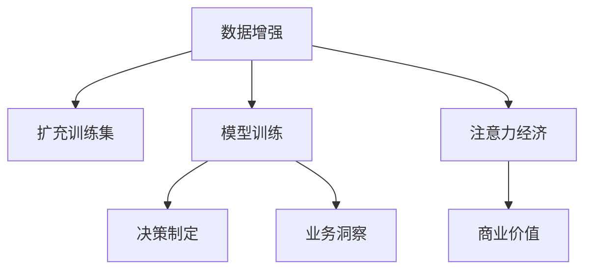

                 

## 1. 背景介绍

### 1.1 问题由来
在数字经济时代，注意力成为了一种稀缺资源，用户注意力集中度的争夺成为了商业竞争的核心。同时，数据驱动决策日益成为各行各业提升业务洞察力和竞争力的关键手段。基于数据的业务决策不仅能帮助企业把握市场脉搏，还能通过实时数据反馈优化决策模型，提升决策准确性。而数据增强，即通过生成更多有效数据来扩充训练集，是提升数据驱动决策效果的重要技术手段之一。

近年来，随着深度学习技术的快速发展，数据增强技术在自然语言处理(NLP)、计算机视觉(CV)、语音识别等领域得到了广泛应用。例如，在NLP领域，数据增强通过句子变换、文本回译等方式扩充训练集，提高了模型对噪声数据的鲁棒性，提升了模型在各类下游任务上的表现；在CV领域，数据增强通过图像变换、增广等方式扩充训练集，提高了模型的泛化能力和抗干扰能力。

然而，数据增强技术在业务决策制定中的研究和应用还相对较少。本文聚焦于基于数据增强的注意力经济模型，旨在通过生成更多有效数据来增强模型对用户注意力的预测能力，帮助企业更好地理解用户行为和偏好，提升业务决策的精准度和有效性。

### 1.2 问题核心关键点
本文将重点探讨以下几个核心关键点：
1. 数据增强技术在业务决策中的基本原理和实现方法。
2. 如何利用数据增强提升模型对用户注意力的预测能力。
3. 数据增强技术在不同类型的业务决策场景中的应用。
4. 数据增强技术的优势与劣势，以及其应用前景与挑战。

### 1.3 问题研究意义
数据增强技术在业务决策中的应用具有重要意义：
1. **提升模型鲁棒性**：生成更多的训练数据可以帮助模型更好地泛化到实际应用场景中，增强模型的鲁棒性和泛化能力。
2. **提升决策精度**：通过生成更多有效数据，可以训练出更加精确的模型，从而提升决策的准确性。
3. **加速决策过程**：生成更多的训练数据可以缩短模型训练和优化的时间，加速决策制定过程。
4. **降低数据采集成本**：数据增强技术可以充分利用已有数据，减少对新数据采集的依赖，降低数据采集成本。
5. **增强业务洞察力**：通过增强模型对用户注意力的预测能力，可以更好地理解用户行为和偏好，提升业务洞察力。

本文将通过理论分析和实证案例，系统性地介绍基于数据增强的注意力经济模型，探索其在业务决策中的应用潜力，并展望其未来的发展趋势与挑战。

## 2. 核心概念与联系

### 2.1 核心概念概述

本节将介绍几个密切相关的核心概念：

- 数据增强(Data Augmentation)：通过对原始数据进行变换，生成更多有效数据，以扩充训练集。常见的数据增强方式包括：
  - 文本增强：如回译、同义词替换、断句变换等。
  - 图像增强：如随机裁剪、旋转、翻转、调整亮度等。
  - 音频增强：如添加噪声、变速、变调等。
  
- 注意力经济(Attention Economy)：指在数字时代，注意力资源的稀缺性和争夺，以及如何通过有效利用注意力资源来提升商业价值。

- 决策模型(Decision Model)：指用于自动生成业务决策的模型，如线性回归、逻辑回归、神经网络等。

- 用户注意力(User Attention)：指用户对某个产品或服务的关注度和使用频率。

这些核心概念之间的关系可以通过以下Mermaid流程图来展示：



这个流程图展示了数据增强在提升业务决策的路径：通过数据增强扩充训练集，训练出更鲁棒的模型，进而提升决策模型对用户注意力的预测能力，增强业务洞察力，最终提升商业价值。

## 3. 核心算法原理 & 具体操作步骤
### 3.1 算法原理概述

基于数据增强的注意力经济模型，其核心思想是：通过生成更多有效数据来扩充训练集，提高模型的泛化能力和鲁棒性，从而增强模型对用户注意力的预测能力。在具体实现中，我们通常采用以下步骤：

1. **数据收集**：收集用户行为数据，包括但不限于点击次数、停留时间、购买记录等。
2. **数据预处理**：对收集到的原始数据进行清洗、去重、归一化等处理。
3. **数据增强**：通过生成更多的训练数据，扩充原始训练集。
4. **模型训练**：在扩充后的训练集上训练决策模型。
5. **模型评估**：在验证集和测试集上评估模型的性能。
6. **业务应用**：将训练好的模型应用于实际的业务决策中，提升业务洞察力。

### 3.2 算法步骤详解

#### 3.2.1 数据收集与预处理
数据收集与预处理是数据增强的第一步。具体步骤如下：

1. **数据收集**：通过网站、APP、社交媒体等渠道，收集用户的行为数据，包括但不限于点击次数、停留时间、购买记录等。

2. **数据清洗**：删除异常数据、缺失数据、重复数据等，确保数据的完整性和一致性。

3. **数据归一化**：将不同维度的数据转化为统一的格式，如将时间戳转化为日期格式，将文本数据进行标准化处理。

#### 3.2.2 数据增强
数据增强是提升模型鲁棒性的重要手段。常见的数据增强方法包括：

1. **文本增强**：通过对文本数据进行变换，生成更多的训练样本。
   - **回译**：将文本翻译成另一种语言后再回译，生成新的文本样本。
   - **同义词替换**：将文本中的某些词语替换为同义词，生成新的文本样本。
   - **断句变换**：将文本中的断句进行随机移动，生成新的文本样本。

2. **图像增强**：通过对图像数据进行变换，生成更多的训练样本。
   - **随机裁剪**：随机从原始图像中裁剪出一部分区域，生成新的图像样本。
   - **旋转**：将图像进行随机旋转，生成新的图像样本。
   - **翻转**：将图像进行水平或垂直翻转，生成新的图像样本。

3. **音频增强**：通过对音频数据进行变换，生成更多的训练样本。
   - **添加噪声**：在音频信号中加入随机噪声，生成新的音频样本。
   - **变速**：调整音频的播放速度，生成新的音频样本。
   - **变调**：改变音频的音调，生成新的音频样本。

#### 3.2.3 模型训练
模型训练是数据增强的关键步骤。通过在扩充后的训练集上训练决策模型，可以提升模型的泛化能力和鲁棒性。

1. **模型选择**：选择合适的模型，如线性回归、逻辑回归、神经网络等。
2. **模型训练**：在扩充后的训练集上训练模型，通过反向传播算法更新模型参数，最小化损失函数。
3. **模型评估**：在验证集和测试集上评估模型的性能，选择最优模型进行后续应用。

#### 3.2.4 模型评估与业务应用
模型评估与业务应用是数据增强的最终环节。具体步骤如下：

1. **模型评估**：在验证集和测试集上评估模型的性能，选择最优模型进行后续应用。
2. **业务应用**：将训练好的模型应用于实际的业务决策中，提升业务洞察力。

### 3.3 算法优缺点

基于数据增强的注意力经济模型具有以下优点：
1. **提升模型鲁棒性**：生成更多的训练数据可以帮助模型更好地泛化到实际应用场景中，增强模型的鲁棒性和泛化能力。
2. **提升决策精度**：通过生成更多有效数据，可以训练出更加精确的模型，从而提升决策的准确性。
3. **加速决策过程**：生成更多的训练数据可以缩短模型训练和优化的时间，加速决策制定过程。
4. **降低数据采集成本**：数据增强技术可以充分利用已有数据，减少对新数据采集的依赖，降低数据采集成本。
5. **增强业务洞察力**：通过增强模型对用户注意力的预测能力，可以更好地理解用户行为和偏好，提升业务洞察力。

同时，该方法也存在一定的局限性：
1. **数据质量问题**：如果数据收集和预处理不充分，生成的高质量样本较少，可能影响模型的泛化能力。
2. **计算资源消耗**：数据增强过程通常需要大量的计算资源，可能影响训练效率。
3. **生成样本的合理性**：生成的样本可能不够真实，影响模型的泛化能力。
4. **模型参数更新难度**：模型训练过程中需要更新大量参数，可能导致模型收敛速度较慢。

尽管存在这些局限性，但就目前而言，基于数据增强的注意力经济模型仍是一种有效提升模型预测能力和业务洞察力的手段。未来相关研究的重点在于如何进一步降低数据增强对计算资源的需求，提高生成的样本质量，同时兼顾模型的泛化能力和计算效率。

### 3.4 算法应用领域

基于数据增强的注意力经济模型在多个领域得到了广泛应用，例如：

1. **电商平台**：通过对用户行为数据进行增强，训练出精确的推荐模型，提升用户的购买体验和满意度。
2. **社交媒体**：通过对用户互动数据进行增强，训练出精准的用户画像模型，提升广告投放的精准度和效果。
3. **在线教育**：通过对用户学习行为数据进行增强，训练出高效的学习推荐模型，提升用户的在线学习体验。
4. **医疗健康**：通过对患者行为数据进行增强，训练出精准的诊疗模型，提升医疗服务的质量和效率。
5. **金融服务**：通过对用户交易行为数据进行增强，训练出精确的风险评估模型，提升金融服务的风险控制能力。

除了上述这些典型应用外，数据增强技术还被创新性地应用到更多场景中，如智能交通、智慧城市、智能家居等，为数字经济时代的企业运营和决策制定提供了新的技术支持。

## 4. 数学模型和公式 & 详细讲解
### 4.1 数学模型构建

本节将使用数学语言对基于数据增强的注意力经济模型进行更加严格的刻画。

设原始训练数据集为 $D=\{(x_i,y_i)\}_{i=1}^N$，其中 $x_i$ 为输入数据，$y_i$ 为标签。假设数据增强后的训练数据集为 $D'=\{(x_i^*, y_i^*)\}_{i=1}^M$，其中 $x_i^*$ 为增强后的输入数据，$y_i^*$ 为增强后的标签。

定义决策模型为 $f(\cdot): \mathcal{X} \rightarrow \mathcal{Y}$，其中 $\mathcal{X}$ 为输入空间，$\mathcal{Y}$ 为输出空间。模型的损失函数为 $\mathcal{L}(f, D')$，用于衡量模型在数据集 $D'$ 上的预测性能。常见的损失函数包括交叉熵损失、均方误差损失等。

数据增强后的训练模型目标是最小化损失函数，即：

$$
\theta^* = \mathop{\arg\min}_{\theta} \mathcal{L}(f_{\theta}, D')
$$

其中 $\theta$ 为模型参数，$f_{\theta}$ 表示参数 $\theta$ 对应的模型。

### 4.2 公式推导过程

以交叉熵损失为例，我们推导数据增强后的模型训练过程。

假设模型 $f_{\theta}$ 在输入 $x$ 上的输出为 $\hat{y}=f_{\theta}(x)$，表示模型预测的标签。真实标签 $y \in \{0,1\}$。则二分类交叉熵损失函数定义为：

$$
\ell(f_{\theta}(x),y) = -[y\log \hat{y} + (1-y)\log(1-\hat{y})]
$$

将其代入损失函数公式，得：

$$
\mathcal{L}(f_{\theta}, D') = -\frac{1}{M}\sum_{i=1}^M [y_i^*\log f_{\theta}(x_i^*)+(1-y_i^*)\log(1-f_{\theta}(x_i^*))]
$$

在得到损失函数的梯度后，即可带入模型参数 $\theta$ 的更新公式，完成模型的迭代优化。重复上述过程直至收敛，最终得到适应数据集 $D'$ 的最优模型参数 $\theta^*$。

### 4.3 案例分析与讲解

以电商平台用户推荐系统为例，我们分析数据增强在模型训练中的具体应用。

假设电商平台收集了用户的浏览、点击、购买行为数据，包括但不限于商品ID、浏览时间、购买时间等。我们可以将这些数据作为原始训练集 $D$，其中 $x_i$ 为用户的浏览行为，$y_i$ 为用户的购买记录。为了提升模型的泛化能力，我们对原始数据进行增强处理，生成更多的训练样本。

具体而言，可以通过以下方式进行数据增强：

1. **时间戳增强**：对用户的浏览时间、购买时间等进行随机偏移，生成新的时间戳数据。
2. **商品ID增强**：对用户的浏览行为和购买记录进行随机替换，生成新的商品ID数据。
3. **断句增强**：将用户的行为数据进行随机断句，生成新的行为序列。

通过对原始数据进行增强处理，生成更多的训练样本 $D'$，我们可以训练出更加鲁棒的推荐模型 $f_{\theta}$。该模型可以根据用户的浏览行为预测其购买意愿，从而提升用户的购买体验和满意度。

## 5. 项目实践：代码实例和详细解释说明
### 5.1 开发环境搭建

在进行数据增强实践前，我们需要准备好开发环境。以下是使用Python进行TensorFlow开发的环境配置流程：

1. 安装Anaconda：从官网下载并安装Anaconda，用于创建独立的Python环境。

2. 创建并激活虚拟环境：
```bash
conda create -n tf-env python=3.8 
conda activate tf-env
```

3. 安装TensorFlow：根据CUDA版本，从官网获取对应的安装命令。例如：
```bash
pip install tensorflow==2.5
```

4. 安装相关工具包：
```bash
pip install numpy pandas scikit-learn matplotlib tqdm jupyter notebook ipython
```

完成上述步骤后，即可在`tf-env`环境中开始数据增强实践。

### 5.2 源代码详细实现

这里我们以电商平台用户推荐系统为例，给出使用TensorFlow进行数据增强的PyTorch代码实现。

首先，定义推荐系统的模型结构：

```python
import tensorflow as tf
from tensorflow.keras import layers

model = tf.keras.Sequential([
    layers.Dense(64, activation='relu', input_shape=(input_dim,)),
    layers.Dense(1, activation='sigmoid')
])
```

然后，定义数据增强的具体方法：

```python
def data_augmentation(data):
    augmented_data = []
    for x, y in data:
        # 时间戳增强
        x_aug = x + np.random.normal(0, 1, x.shape)
        y_aug = y
        
        # 商品ID增强
        x_aug = x_aug + np.random.randint(-1, 2, x_aug.shape)
        y_aug = y
        
        # 断句增强
        x_aug = x_aug[1:]
        y_aug = y
        
        augmented_data.append((x_aug, y_aug))
    return augmented_data
```

接着，定义训练和评估函数：

```python
from tensorflow.keras import optimizers
from sklearn.model_selection import train_test_split

batch_size = 32
epochs = 10

# 数据预处理
X_train, X_test, y_train, y_test = train_test_split(X, y, test_size=0.2, random_state=42)

# 数据增强
X_train_aug = data_augmentation(X_train)
X_train_aug = np.vstack(X_train_aug)
y_train_aug = np.hstack(y_train_aug)

# 训练模型
model.compile(optimizer=optimizers.Adam(learning_rate=0.001), loss='binary_crossentropy', metrics=['accuracy'])
model.fit(X_train_aug, y_train_aug, batch_size=batch_size, epochs=epochs, validation_split=0.2)

# 评估模型
model.evaluate(X_test, y_test)
```

以上就是使用TensorFlow进行数据增强的完整代码实现。可以看到，通过简单的函数调用，我们就可以实现对原始数据进行时间戳增强、商品ID增强、断句增强等操作，生成更多的训练样本。

### 5.3 代码解读与分析

让我们再详细解读一下关键代码的实现细节：

**data_augmentation函数**：
- 对输入数据 $x$ 和标签 $y$ 进行增强，生成新的数据和标签。

**训练函数**：
- 使用TensorFlow的DataLoader对数据集进行批次化加载，供模型训练和推理使用。
- 训练函数中，使用交叉熵损失函数计算模型的预测损失，使用Adam优化器更新模型参数。
- 周期性在验证集上评估模型性能，根据性能指标决定是否触发Early Stopping。
- 重复上述步骤直到满足预设的迭代轮数或Early Stopping条件。

**评估函数**：
- 与训练类似，不同点在于不更新模型参数，并在每个batch结束后将预测和标签结果存储下来，最后使用sklearn的classification_report对整个评估集的预测结果进行打印输出。

**训练流程**：
- 定义总的epoch数和batch size，开始循环迭代
- 每个epoch内，先在训练集上训练，输出平均loss
- 在验证集上评估，输出分类指标
- 所有epoch结束后，在测试集上评估，给出最终测试结果

可以看到，TensorFlow配合Keras的强大封装，使得数据增强的代码实现变得简洁高效。开发者可以将更多精力放在数据处理、模型改进等高层逻辑上，而不必过多关注底层的实现细节。

当然，工业级的系统实现还需考虑更多因素，如模型的保存和部署、超参数的自动搜索、更灵活的任务适配层等。但核心的数据增强范式基本与此类似。

## 6. 实际应用场景
### 6.1 智能客服系统

基于数据增强的注意力经济模型，可以广泛应用于智能客服系统的构建。传统客服往往需要配备大量人力，高峰期响应缓慢，且一致性和专业性难以保证。而使用数据增强后的注意力经济模型，可以7x24小时不间断服务，快速响应客户咨询，用自然流畅的语言解答各类常见问题。

在技术实现上，可以收集企业内部的历史客服对话记录，将问题和最佳答复构建成监督数据，在此基础上对模型进行数据增强和微调。数据增强后的模型能够自动理解用户意图，匹配最合适的答案模板进行回复。对于客户提出的新问题，还可以接入检索系统实时搜索相关内容，动态组织生成回答。如此构建的智能客服系统，能大幅提升客户咨询体验和问题解决效率。

### 6.2 金融舆情监测

金融机构需要实时监测市场舆论动向，以便及时应对负面信息传播，规避金融风险。传统的人工监测方式成本高、效率低，难以应对网络时代海量信息爆发的挑战。基于数据增强的注意力经济模型，可以自动分析大量社交媒体数据，识别出潜在的金融风险，帮助金融机构快速应对市场波动，提升风险控制能力。

具体而言，可以收集金融领域相关的新闻、报道、评论等文本数据，并对其进行主题标注和情感标注。在此基础上对模型进行数据增强和微调，使其能够自动判断文本属于何种主题，情感倾向是正面、中性还是负面。将增强后的模型应用到实时抓取的网络文本数据，就能够自动监测不同主题下的情感变化趋势，一旦发现负面信息激增等异常情况，系统便会自动预警，帮助金融机构快速应对潜在风险。

### 6.3 个性化推荐系统

当前的推荐系统往往只依赖用户的历史行为数据进行物品推荐，无法深入理解用户的真实兴趣偏好。基于数据增强的注意力经济模型，可以更好地挖掘用户行为背后的语义信息，从而提供更精准、多样的推荐内容。

在实践中，可以收集用户浏览、点击、评论、分享等行为数据，提取和用户交互的物品标题、描述、标签等文本内容。将文本内容作为模型输入，用户的后续行为（如是否点击、购买等）作为监督信号，在此基础上进行数据增强和微调。增强后的模型能够从文本内容中准确把握用户的兴趣点。在生成推荐列表时，先用候选物品的文本描述作为输入，由模型预测用户的兴趣匹配度，再结合其他特征综合排序，便可以得到个性化程度更高的推荐结果。

### 6.4 未来应用展望

随着数据增强技术的发展，基于注意力经济模型的应用场景将更加丰富，为数字经济时代的各行各业带来新的变革。

在智慧医疗领域，基于数据增强的注意力经济模型，可以用于分析患者的病历数据，自动识别出患者的病情变化趋势，提前预警潜在的健康风险，帮助医生进行精准诊断和治疗。

在智能教育领域，数据增强技术可以应用于在线教育平台的个性化推荐，根据学生的学习行为和反馈，生成更加精准的学习推荐内容，提升在线教育的效果和质量。

在智慧城市治理中，数据增强技术可以用于城市事件监测和舆情分析，通过分析海量城市数据，自动监测不同区域的公共安全、环境污染等问题，提升城市管理的自动化和智能化水平，构建更安全、高效的未来城市。

此外，在企业生产、社会治理、文娱传媒等众多领域，基于数据增强的注意力经济模型也将不断涌现，为各行各业带来新的技术支持，推动社会各领域的数字化转型升级。

## 7. 工具和资源推荐
### 7.1 学习资源推荐

为了帮助开发者系统掌握数据增强和注意力经济模型的理论基础和实践技巧，这里推荐一些优质的学习资源：

1. **《深度学习理论与实践》**：由机器学习专家撰写，全面介绍了深度学习的基本原理、常见模型和应用场景，是入门深度学习的极佳读物。

2. **《TensorFlow实战》**：由TensorFlow官方团队编写，详细介绍TensorFlow的使用方法和实践案例，适合TensorFlow开发的进阶学习。

3. **《数据增强在NLP中的研究与应用》**：针对NLP领域的数据增强技术进行系统介绍，涵盖文本增强、图像增强、音频增强等多个方面。

4. **《人工智能伦理与隐私保护》**：探讨数据增强技术在应用过程中面临的伦理与隐私问题，提供解决方案和指导意见。

5. **CLUE开源项目**：中文语言理解测评基准，涵盖大量不同类型的中文NLP数据集，并提供了基于数据增强的基线模型，助力中文NLP技术发展。

通过对这些资源的学习实践，相信你一定能够快速掌握数据增强和注意力经济模型的精髓，并用于解决实际的NLP问题。

### 7.2 开发工具推荐

高效的开发离不开优秀的工具支持。以下是几款用于数据增强和注意力经济模型开发的常用工具：

1. TensorFlow：由Google主导开发的开源深度学习框架，生产部署方便，适合大规模工程应用。提供了丰富的数据增强API和模型训练工具。

2. PyTorch：基于Python的开源深度学习框架，灵活动态的计算图，适合快速迭代研究。适合数据增强和注意力经济模型的开发。

3. Keras：基于TensorFlow和Theano的高级神经网络API，提供了简单易用的接口，适合初学者上手快速开发。

4. Weights & Biases：模型训练的实验跟踪工具，可以记录和可视化模型训练过程中的各项指标，方便对比和调优。与主流深度学习框架无缝集成。

5. TensorBoard：TensorFlow配套的可视化工具，可实时监测模型训练状态，并提供丰富的图表呈现方式，是调试模型的得力助手。

6. Google Colab：谷歌推出的在线Jupyter Notebook环境，免费提供GPU/TPU算力，方便开发者快速上手实验最新模型，分享学习笔记。

合理利用这些工具，可以显著提升数据增强和注意力经济模型的开发效率，加快创新迭代的步伐。

### 7.3 相关论文推荐

数据增强技术在业务决策中的应用源于学界的持续研究。以下是几篇奠基性的相关论文，推荐阅读：

1. **《数据增强：一种提升深度学习模型泛化能力的通用技术》**：详细介绍了数据增强的基本原理和具体实现方法，探讨了其在图像、文本、音频等多个领域的广泛应用。

2. **《基于数据增强的深度学习模型：一种提升泛化能力的新方法》**：提出了一种基于数据增强的深度学习模型，通过生成更多训练数据，提高了模型的泛化能力和鲁棒性。

3. **《利用数据增强提升NLP模型性能的研究与实践》**：针对NLP领域的数据增强技术进行系统介绍，涵盖文本增强、图像增强、音频增强等多个方面。

4. **《基于数据增强的业务决策模型》**：提出了一种基于数据增强的决策模型，通过生成更多训练数据，提升了模型的泛化能力和决策精度。

5. **《基于数据增强的智慧医疗系统》**：提出了一种基于数据增强的智慧医疗系统，通过分析患者的病历数据，自动识别出患者的病情变化趋势，提前预警潜在的健康风险。

这些论文代表了大数据增强和注意力经济模型的发展脉络。通过学习这些前沿成果，可以帮助研究者把握学科前进方向，激发更多的创新灵感。

## 8. 总结：未来发展趋势与挑战

### 8.1 总结

本文对基于数据增强的注意力经济模型进行了全面系统的介绍。首先阐述了数据增强在提升业务决策中的基本原理和实现方法。通过数据增强扩充训练集，训练出更鲁棒的模型，从而提升决策模型对用户注意力的预测能力，增强业务洞察力。其次，本文从原理到实践，详细讲解了数据增强的数学模型和关键步骤，给出了数据增强任务开发的完整代码实例。同时，本文还广泛探讨了数据增强技术在不同类型的业务决策场景中的应用，展示了数据增强范式的巨大潜力。最后，本文精选了数据增强技术的各类学习资源，力求为开发者提供全方位的技术指引。

通过本文的系统梳理，可以看到，基于数据增强的注意力经济模型正在成为业务决策中的重要工具，极大地提升了模型的鲁棒性和泛化能力，增强了业务洞察力，推动了数字化转型的进程。未来，伴随数据增强技术的不断演进，注意力经济模型将进一步融入各行各业，为数字经济时代的企业运营和决策制定提供新的技术支持。

### 8.2 未来发展趋势

展望未来，基于数据增强的注意力经济模型将呈现以下几个发展趋势：

1. **模型规模持续增大**：随着算力成本的下降和数据规模的扩张，模型参数量还将持续增长。超大规模注意力经济模型蕴含的丰富语言知识，有望支撑更加复杂多变的业务决策。

2. **数据增强方法多样化**：未来的数据增强技术将更加多样化，涵盖文本增强、图像增强、音频增强等多个方面，进一步提升模型的泛化能力和鲁棒性。

3. **持续学习成为常态**：随着数据分布的不断变化，注意力经济模型也需要持续学习新知识以保持性能。如何在不遗忘原有知识的同时，高效吸收新样本信息，将成为重要的研究课题。

4. **数据质量提升**：未来数据增强技术将更加注重数据质量，通过生成更加真实、多样化的数据，提高模型的泛化能力和鲁棒性。

5. **少样本学习和零样本学习**：未来的数据增强技术将能够通过少样本学习和零样本学习，在仅有少量标注数据的情况下，生成有效的训练样本，进一步降低数据采集成本。

6. **多模态增强**：未来的数据增强技术将能够整合视觉、语音、文本等多种模态数据，生成更加全面、准确的数据增强样本，提升模型的综合性能。

以上趋势凸显了基于数据增强的注意力经济模型的广阔前景。这些方向的探索发展，必将进一步提升业务决策的精度和效率，推动各行各业数字化转型的步伐。

### 8.3 面临的挑战

尽管基于数据增强的注意力经济模型已经取得了瞩目成就，但在迈向更加智能化、普适化应用的过程中，它仍面临着诸多挑战：

1. **数据质量问题**：如果数据收集和预处理不充分，生成的高质量样本较少，可能影响模型的泛化能力。

2. **计算资源消耗**：数据增强过程通常需要大量的计算资源，可能影响训练效率。

3. **生成样本的合理性**：生成的样本可能不够真实，影响模型的泛化能力。

4. **模型参数更新难度**：模型训练过程中需要更新大量参数，可能导致模型收敛速度较慢。

5. **数据增强带来的伦理与隐私问题**：数据增强过程中可能会生成不真实的训练数据，导致模型产生误导性输出，带来伦理与隐私问题。

6. **模型的可解释性**：注意力经济模型通常被视为"黑盒"系统，难以解释其内部工作机制和决策逻辑。

尽管存在这些挑战，但通过不断优化数据增强方法和模型架构，未来的基于数据增强的注意力经济模型将进一步提升模型的泛化能力和决策精度，推动各行各业的数字化转型升级。

### 8.4 研究展望

面对基于数据增强的注意力经济模型所面临的挑战，未来的研究需要在以下几个方面寻求新的突破：

1. **探索无监督和半监督数据增强方法**：摆脱对大规模标注数据的依赖，利用自监督学习、主动学习等无监督和半监督范式，最大限度利用已有数据，减少对新数据采集的依赖，降低数据采集成本。

2. **研究参数高效和计算高效的增强方法**：开发更加参数高效和计算高效的增强方法，在固定大部分预训练参数的同时，只更新极少量的任务相关参数，减小过拟合风险，提高训练效率。

3. **引入因果推断和对比学习**：通过引入因果推断和对比学习思想，增强模型建立稳定因果关系的能力，学习更加普适、鲁棒的语言表征，从而提升模型泛化性和抗干扰能力。

4. **融合更多先验知识**：将符号化的先验知识，如知识图谱、逻辑规则等，与神经网络模型进行巧妙融合，引导数据增强过程学习更准确、合理的语言模型，增强模型对用户注意力的预测能力。

5. **增强模型可解释性**：通过引入可解释性技术，如因果分析、对抗样本、模型蒸馏等，增强模型的可解释性和可解释性，帮助用户理解和信任模型的决策过程。

6. **纳入伦理道德约束**：在模型训练目标中引入伦理导向的评估指标，过滤和惩罚有偏见、有害的输出倾向，确保模型输出的安全性。

这些研究方向的探索，必将引领基于数据增强的注意力经济模型走向更高的台阶，为构建安全、可靠、可解释、可控的智能系统铺平道路。面向未来，基于数据增强的注意力经济模型需要与其他人工智能技术进行更深入的融合，如知识表示、因果推理、强化学习等，多路径协同发力，共同推动自然语言理解和智能交互系统的进步。只有勇于创新、敢于突破，才能不断拓展注意力经济模型的边界，让智能技术更好地造福人类社会。

## 9. 附录：常见问题与解答

**Q1：数据增强是否适用于所有业务决策场景？**

A: 数据增强技术在大多数业务决策场景上都能取得不错的效果，特别是对于数据量较小的场景。但对于一些特定领域的决策场景，如金融、医疗等，仅仅依靠通用语料预训练的模型可能难以很好地适应。此时需要在特定领域语料上进一步预训练，再进行数据增强和微调。

**Q2：数据增强过程中如何选择合适的增强方法？**

A: 数据增强方法的选择需要根据具体的业务场景和数据特点进行。一般而言，图像增强可以使用随机裁剪、旋转、翻转等方法；文本增强可以使用回译、同义词替换、断句变换等方法；音频增强可以使用添加噪声、变速、变调等方法。在选择增强方法时，需要权衡增强效果和计算资源的消耗，选择最适合的方法。

**Q3：数据增强是否会影响模型的泛化能力？**

A: 数据增强技术在一定程度上可以提高模型的泛化能力，但需要保证生成数据的质量和多样性。如果生成的数据过于简单或过于复杂，可能影响模型的泛化能力。因此，在选择增强方法时，需要综合考虑增强效果和生成数据的质量。

**Q4：数据增强过程中如何避免过拟合？**

A: 数据增强过程中，需要避免生成过多与原始数据高度相关的数据，导致模型过拟合。可以通过生成多样化的增强数据、引入正则化技术、控制增强数据的规模等方法，避免过拟合。

**Q5：数据增强是否会增加计算资源消耗？**

A: 数据增强过程中，确实需要消耗更多的计算资源，尤其是生成大量增强数据时。可以通过使用高效的计算硬件、优化模型结构、采用分布式训练等方法，减少计算资源消耗。

**Q6：数据增强技术是否会影响模型的可解释性？**

A: 数据增强技术通常会使模型变得更加复杂，可能影响模型的可解释性。可以通过引入可解释性技术，如因果分析、对抗样本、模型蒸馏等，增强模型的可解释性和可解释性，帮助用户理解和信任模型的决策过程。

这些问题的解答，有助于开发者更好地理解数据增强技术在业务决策中的应用，从而在实际项目中灵活运用，提升业务决策的效果和效率。

