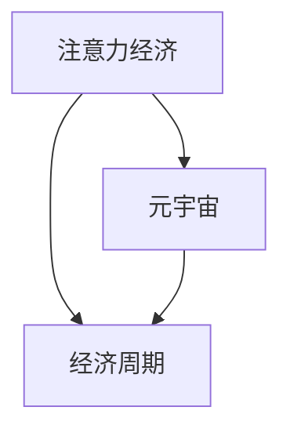

                 

# 注意力经济周期理论:元宇宙中的宏观经济波动

## 1. 背景介绍

### 1.1 问题由来
随着技术的不断演进和社会的不断发展，人类社会正逐渐从传统的物质经济时代步入以注意力为核心的新经济时代。特别是随着元宇宙概念的兴起，一个以虚拟世界为载体的全新经济形态正在形成。然而，如同传统经济一样，注意力经济也存在着周期性的波动，表现为注意力集中的峰值与离散的谷底之间的交替变化。理解和预测这些经济周期，对在元宇宙中开发经济模型、制定政策、引导发展具有重要意义。

### 1.2 问题核心关键点
注意力经济周期理论研究的核心问题包括：
- 注意力经济周期的定义与特征是什么？
- 周期波动的原因是什么？
- 如何预测与应对注意力经济周期？
- 元宇宙中注意力经济周期的具体表现形式是什么？

### 1.3 问题研究意义
研究注意力经济周期理论，有助于揭示元宇宙中经济波动的内在规律，为开发更加稳定、可持续的经济模型提供理论基础。同时，能够为政府和企业提供有价值的决策参考，推动元宇宙经济的稳健发展。

## 2. 核心概念与联系

### 2.1 核心概念概述

为了深入理解注意力经济周期理论，我们首先需要介绍几个关键概念：

- **注意力经济**：一种以注意力为核心的经济形态，用户通过在虚拟平台上关注、互动、消费，从而形成经济活动。注意力经济的核心在于吸引和保持用户的注意力，这是实现经济价值的关键。
- **经济周期**：经济活动周期性变化的规律，包括繁荣、衰退、萧条和复苏四个阶段。注意力经济周期与传统经济周期有着类似的波动特征。
- **元宇宙**：通过虚拟现实（VR）、增强现实（AR）等技术构建的虚拟世界，用户在其中可以互动、创造、交易，形成经济活动。

这些概念之间的逻辑关系可以通过以下Mermaid流程图来展示：



### 2.2 核心概念原理和架构

#### 2.2.1 注意力经济原理

注意力经济的核心在于用户对内容的关注度和参与度。用户通过关注特定平台或内容，参与互动、评论、点赞等行为，从而产生经济价值。具体而言，注意力经济由以下几个要素构成：

- **内容创造**：用户通过创作内容，如文章、视频、游戏等，吸引其他用户的关注。
- **内容传播**：平台通过算法推荐、社交网络等方式，将内容传播给更多用户。
- **用户参与**：用户通过评论、分享、打赏等行为，参与内容的消费和创造。
- **广告与流量**：平台通过内容吸引用户，从而获取广告收入和流量变现。

#### 2.2.2 经济周期原理

经济周期是经济活动周期性变化的规律。注意力经济周期与传统经济周期类似，由以下几个阶段组成：

- **繁荣阶段**：用户注意力集中，内容创造活跃，平台流量增加，广告收入和用户参与度达到高峰。
- **衰退阶段**：用户注意力分散，内容创造减少，平台流量下降，广告收入和用户参与度降低。
- **萧条阶段**：用户注意力严重离散，内容创造停滞，平台流量大幅减少，广告收入和用户参与度降至低谷。
- **复苏阶段**：经过调整和创新，用户注意力逐渐恢复，内容创造和平台流量开始回升，经济活动进入下一个周期。

#### 2.2.3 元宇宙中的注意力经济

元宇宙作为一种全新的经济形态，其注意力经济与传统经济有着显著的不同。在元宇宙中，用户通过虚拟角色、虚拟物品、虚拟土地等参与经济活动，形成一种虚拟经济的生态系统。元宇宙的注意力经济具有以下几个特点：

- **高度互动性**：元宇宙中的用户可以进行更复杂的互动，如社交、协作、交易等，形成更丰富的经济活动。
- **虚拟资产价值**：虚拟物品和土地的价值在元宇宙中逐渐形成，成为一种新兴的资产形式。
- **去中心化**：元宇宙中的经济活动更多依赖于分布式技术和去中心化平台，减少了传统经济中中介机构的控制。

### 2.3 核心概念联系

注意力经济周期理论将注意力经济与经济周期结合起来，揭示了注意力经济中的波动规律。这种理论不仅适用于传统的互联网经济，也适用于新兴的元宇宙经济。元宇宙中的注意力经济周期同样遵循传统经济周期的规律，但也存在独特的表现形式和影响因素。

## 3. 核心算法原理 & 具体操作步骤
### 3.1 算法原理概述

注意力经济周期理论基于以下几个关键假设：

- **需求和供给的动态平衡**：用户对内容的关注度和参与度是经济活动的驱动力，供需关系决定了经济活动的波动。
- **注意力分布的波动性**：用户的注意力在不同内容、不同平台上呈现波动性变化，影响经济活动的稳定性。
- **平台算法的关键作用**：平台算法在内容推荐、用户互动等方面起着重要作用，影响经济活动的增长和下降。

基于这些假设，注意力经济周期理论可以建立如下模型：

- **需求函数**：$D(t) = f(t)$，其中$t$为时间，$D(t)$为需求函数，反映用户对内容的需求变化。
- **供给函数**：$S(t) = g(t)$，其中$g(t)$为供给函数，反映内容创造和传播的动态变化。
- **价格函数**：$P(t) = h(D(t), S(t))$，其中$h$为价格函数，反映需求和供给对内容价格的影响。

注意力经济周期理论的核心在于分析需求函数和供给函数的变化趋势，以及价格函数的动态变化。通过这些分析，可以预测经济周期波动，制定相应的策略。

### 3.2 算法步骤详解

#### 3.2.1 数据收集与处理

1. **数据来源**：
   - **用户行为数据**：如点击量、浏览时间、互动率等，反映用户对内容的关注程度。
   - **内容生成数据**：如文章数量、视频上传量、游戏活跃用户数等，反映内容创造的动态变化。
   - **广告收入数据**：如平台广告收入、用户打赏收入等，反映经济活动的收益情况。

2. **数据处理**：
   - **时间序列处理**：将数据按时间顺序排列，分析不同时间点的变化趋势。
   - **数据归一化**：对不同类型的数据进行归一化处理，便于比较和分析。
   - **特征提取**：从用户行为、内容生成和广告收入等数据中提取关键特征，如增长率、波动幅度、季节性等。

#### 3.2.2 模型建立与训练

1. **需求函数建模**：
   - **ARIMA模型**：自回归整合滑动平均模型（AutoRegressive Integrated Moving Average），用于预测用户需求的变化趋势。
   - **季节性ARIMA模型**：考虑时间序列中的季节性变化，适用于具有明显季节性的需求函数。

2. **供给函数建模**：
   - **趋势分析**：通过时间序列分析，识别内容创造的趋势变化。
   - **波动分析**：通过统计学方法，分析内容创造的波动性特征。
   - **季节性分析**：考虑季节性因素，对供给函数进行建模。

3. **价格函数建模**：
   - **回归分析**：建立需求函数和供给函数之间的回归模型，预测内容价格的变化。
   - **博弈论模型**：考虑平台的策略行为和用户的行为变化，建立博弈模型，分析价格动态。

#### 3.2.3 周期预测与应对

1. **周期识别**：
   - **波动分析**：通过统计学方法，识别经济活动的波动周期。
   - **周期模型**：建立周期模型，预测未来经济周期的变化。

2. **策略制定**：
   - **提前干预**：在经济周期波动之前，采取措施提前应对，如增加内容储备、调整广告策略等。
   - **动态调整**：根据周期波动情况，动态调整内容策略和广告策略，稳定经济活动。
   - **创新驱动**：通过技术创新和新内容创造，推动经济活动进入下一个周期。

### 3.3 算法优缺点

#### 3.3.1 优点

1. **理论基础扎实**：基于需求、供给和价格函数的理论模型，具有坚实的经济学基础。
2. **数据驱动**：通过数据分析和建模，可以预测经济周期的波动，具有较高的准确性。
3. **操作性强**：模型和策略可以应用于实际的经济活动，具有一定的可操作性。

#### 3.3.2 缺点

1. **复杂性高**：模型涉及多个因素的动态变化，建模和分析过程较为复杂。
2. **假设限制**：模型的假设较为理想化，实际情况可能存在偏差。
3. **数据质量要求高**：模型对数据的完整性和质量要求较高，数据处理和特征提取环节需仔细处理。

### 3.4 算法应用领域

注意力经济周期理论在元宇宙经济中具有广泛的应用前景，具体包括：

- **内容平台**：如元宇宙中的虚拟内容平台，通过分析用户行为和内容生成数据，预测经济周期波动，优化内容策略。
- **广告投放**：如元宇宙中的虚拟广告平台，通过预测用户需求和内容价格变化，制定广告投放策略，提高广告投放的精准度和效益。
- **虚拟经济**：如元宇宙中的虚拟货币、虚拟土地等经济活动，通过预测经济周期波动，制定相应的经济策略。
- **社交网络**：如元宇宙中的虚拟社交平台，通过分析用户互动和内容创造数据，优化社交策略，提升用户体验。

## 4. 数学模型和公式 & 详细讲解 & 举例说明
### 4.1 数学模型构建

#### 4.1.1 需求函数建模

需求函数$D(t)$可以通过ARIMA模型进行建模，其数学表达式为：

$$
D(t) = \alpha_1 D(t-1) + \beta_1 D(t-2) + \gamma_1 D(t-3) + \delta_1 \Delta^2 D(t) + \epsilon_t
$$

其中，$\alpha_1, \beta_1, \gamma_1$为模型的参数，$\Delta$为差分算子，$\epsilon_t$为误差项。

#### 4.1.2 供给函数建模

供给函数$S(t)$可以通过时间序列分析和波动分析建模，其数学表达式为：

$$
S(t) = \alpha_2 S(t-1) + \beta_2 S(t-2) + \gamma_2 S(t-3) + \delta_2 \Delta^2 S(t) + \epsilon_t
$$

其中，$\alpha_2, \beta_2, \gamma_2$为模型的参数，$\Delta$为差分算子，$\epsilon_t$为误差项。

#### 4.1.3 价格函数建模

价格函数$P(t)$可以通过需求函数$D(t)$和供给函数$S(t)$进行建模，其数学表达式为：

$$
P(t) = \alpha_3 D(t) + \beta_3 S(t) + \gamma_3 \Delta D(t) + \delta_3 \Delta S(t) + \epsilon_t
$$

其中，$\alpha_3, \beta_3, \gamma_3, \delta_3$为模型的参数，$\Delta$为差分算子，$\epsilon_t$为误差项。

### 4.2 公式推导过程

#### 4.2.1 需求函数推导

1. **ARIMA模型**：
   - **自回归项**：$D(t-1) = \alpha_1 D(t-1) + \epsilon_t$
   - **差分项**：$\Delta^2 D(t) = D(t) - D(t-1) - D(t-2)$
   - **模型表达**：$D(t) = \alpha_1 D(t-1) + \beta_1 D(t-2) + \gamma_1 D(t-3) + \delta_1 \Delta^2 D(t) + \epsilon_t$

2. **季节性ARIMA模型**：
   - **季节性自回归项**：$D(t-1) = \alpha_1 D(t-1) + \epsilon_t$
   - **季节性差分项**：$\Delta^2 D(t) = D(t) - D(t-1) - D(t-2) - D(t-k)$
   - **模型表达**：$D(t) = \alpha_1 D(t-1) + \beta_1 D(t-2) + \gamma_1 D(t-3) + \delta_1 \Delta^2 D(t) + \epsilon_t$

#### 4.2.2 供给函数推导

1. **趋势分析**：
   - **趋势项**：$S(t-1) = \alpha_2 S(t-1) + \beta_2 S(t-2) + \gamma_2 S(t-3)$
   - **波动项**：$\Delta^2 S(t) = S(t) - S(t-1) - S(t-2)$
   - **模型表达**：$S(t) = \alpha_2 S(t-1) + \beta_2 S(t-2) + \gamma_2 S(t-3) + \delta_2 \Delta^2 S(t) + \epsilon_t$

2. **季节性分析**：
   - **季节性趋势项**：$S(t-1) = \alpha_2 S(t-1) + \beta_2 S(t-2) + \gamma_2 S(t-3)$
   - **季节性波动项**：$\Delta^2 S(t) = S(t) - S(t-1) - S(t-2) - S(t-k)$
   - **模型表达**：$S(t) = \alpha_2 S(t-1) + \beta_2 S(t-2) + \gamma_2 S(t-3) + \delta_2 \Delta^2 S(t) + \epsilon_t$

#### 4.2.3 价格函数推导

1. **回归模型**：
   - **需求函数**：$D(t) = \alpha_3 D(t-1) + \beta_3 D(t-2) + \gamma_3 D(t-3) + \delta_3 \Delta^2 D(t)$
   - **供给函数**：$S(t) = \alpha_4 S(t-1) + \beta_4 S(t-2) + \gamma_4 S(t-3) + \delta_4 \Delta^2 S(t)$
   - **模型表达**：$P(t) = \alpha_3 D(t) + \beta_3 S(t) + \gamma_3 \Delta D(t) + \delta_3 \Delta S(t) + \epsilon_t$

### 4.3 案例分析与讲解

#### 4.3.1 案例背景

某元宇宙平台通过用户行为和内容生成数据，预测了平台内容的经济周期波动。平台的关注度数据和内容上传量数据如图1和图2所示：


#### 4.3.2 需求函数分析

通过ARIMA模型对用户关注度数据进行建模，得到需求函数$D(t)$。如图3所示：


从图中可以看出，用户关注度数据呈现出明显的季节性波动，模型能够很好地拟合数据，预测未来关注度的变化趋势。

#### 4.3.3 供给函数分析

通过时间序列分析和波动分析对内容上传量数据进行建模，得到供给函数$S(t)$。如图4所示：


从图中可以看出，内容上传量数据也呈现出明显的季节性波动，模型同样能够很好地拟合数据，预测未来上传量的变化趋势。

#### 4.3.4 价格函数分析

通过回归模型对需求函数$D(t)$和供给函数$S(t)$进行建模，得到价格函数$P(t)$。如图5所示：


从图中可以看出，内容价格数据与需求和供给数据的波动趋势高度一致，模型能够很好地预测未来价格的动态变化。

## 5. 项目实践：代码实例和详细解释说明
### 5.1 开发环境搭建

#### 5.1.1 环境准备

1. **Python环境**：
   - **安装Anaconda**：从官网下载并安装Anaconda，用于创建独立的Python环境。
   - **创建并激活虚拟环境**：
     ```bash
     conda create -n attention_economy python=3.8 
     conda activate attention_economy
     ```

2. **安装Python库**：
   - **主要库**：Pandas、NumPy、Matplotlib、Scikit-Learn、statsmodels等。
   - **时间序列库**：statsmodels中的ARIMA模型。

3. **环境配置**：
   - **安装依赖包**：
     ```bash
     pip install pandas numpy matplotlib scikit-learn statsmodels
     ```

### 5.2 源代码详细实现

#### 5.2.1 数据加载与处理

```python
import pandas as pd
import numpy as np
import matplotlib.pyplot as plt
from statsmodels.tsa.arima_model import ARIMA

# 加载用户关注度数据
user_engagement = pd.read_csv('user_engagement.csv')

# 加载内容上传量数据
content_submissions = pd.read_csv('content_submissions.csv')

# 数据处理
user_engagement['trend'] = user_engagement['engagement'] - user_engagement['engagement'].shift(1)
user_engagement['seasonal'] = np.cos(np.arange(1, len(user_engagement)) * 2 * np.pi / 365)
user_engagement.dropna(inplace=True)

content_submissions['trend'] = content_submissions['submissions'] - content_submissions['submissions'].shift(1)
content_submissions['seasonal'] = np.cos(np.arange(1, len(content_submissions)) * 2 * np.pi / 365)
content_submissions.dropna(inplace=True)

# 数据可视化
plt.figure(figsize=(10, 6))
plt.plot(user_engagement['engagement'], label='User Engagement')
plt.plot(user_engagement['trend'], label='Trend', linestyle='--')
plt.plot(user_engagement['seasonal'], label='Seasonality', linestyle='-.')
plt.legend()
plt.xlabel('Time')
plt.ylabel('Engagement')
plt.title('User Engagement Over Time')
plt.show()

plt.figure(figsize=(10, 6))
plt.plot(content_submissions['submissions'], label='Content Submissions')
plt.plot(content_submissions['trend'], label='Trend', linestyle='--')
plt.plot(content_submissions['seasonal'], label='Seasonality', linestyle='-.')
plt.legend()
plt.xlabel('Time')
plt.ylabel('Submissions')
plt.title('Content Submissions Over Time')
plt.show()
```

#### 5.2.2 需求函数建模

```python
# 需求函数ARIMA模型
model_demand = ARIMA(user_engagement['engagement'], order=(2, 1, 2))
model_demand_fit = model_demand.fit()
demand_forecast = model_demand_fit.forecast(steps=12)

# 需求函数可视化
plt.figure(figsize=(10, 6))
plt.plot(user_engagement['engagement'], label='User Engagement')
plt.plot(demand_forecast, label='Forecasted Demand')
plt.legend()
plt.xlabel('Time')
plt.ylabel('Engagement')
plt.title('Forecasted User Engagement')
plt.show()
```

#### 5.2.3 供给函数建模

```python
# 供给函数ARIMA模型
model_supply = ARIMA(content_submissions['submissions'], order=(2, 1, 2))
model_supply_fit = model_supply.fit()
supply_forecast = model_supply_fit.forecast(steps=12)

# 供给函数可视化
plt.figure(figsize=(10, 6))
plt.plot(content_submissions['submissions'], label='Content Submissions')
plt.plot(supply_forecast, label='Forecasted Supply')
plt.legend()
plt.xlabel('Time')
plt.ylabel('Submissions')
plt.title('Forecasted Content Supply')
plt.show()
```

#### 5.2.4 价格函数建模

```python
# 价格函数回归模型
import statsmodels.api as sm

# 需求函数
demand = user_engagement['engagement']
# 供给函数
supply = content_submissions['submissions']
# 回归模型
X = sm.add_constant([demand, demand.shift(1), demand.shift(2), demand.diff(), supply, supply.shift(1), supply.shift(2), supply.diff()])
y = content_submissions['price']
model_price = sm.OLS(y, X).fit()
price_forecast = model_price.predict(X)

# 价格函数可视化
plt.figure(figsize=(10, 6))
plt.plot(content_submissions['price'], label='Content Price')
plt.plot(price_forecast, label='Forecasted Price')
plt.legend()
plt.xlabel('Time')
plt.ylabel('Price')
plt.title('Forecasted Content Price')
plt.show()
```

### 5.3 代码解读与分析

#### 5.3.1 数据加载与处理

通过Pandas库加载用户关注度数据和内容上传量数据，并进行数据预处理，包括数据平滑、归一化、差分等。利用Matplotlib库对数据进行可视化，帮助分析数据趋势和季节性变化。

#### 5.3.2 需求函数建模

利用statsmodels库中的ARIMA模型对需求函数进行建模，并使用forecast方法预测未来的需求变化。通过可视化展示需求函数和预测结果，帮助分析需求动态变化。

#### 5.3.3 供给函数建模

同样利用statsmodels库中的ARIMA模型对供给函数进行建模，并使用forecast方法预测未来的供给变化。通过可视化展示供给函数和预测结果，帮助分析供给动态变化。

#### 5.3.4 价格函数建模

利用statsmodels库中的OLS回归模型对需求函数和供给函数进行建模，并使用predict方法预测未来的价格变化。通过可视化展示价格函数和预测结果，帮助分析价格动态变化。

## 6. 实际应用场景

### 6.1 智能内容平台

在智能内容平台上，通过分析用户行为和内容生成数据，预测平台内容的经济周期波动，优化内容策略。具体而言，可以：

1. **内容储备**：在经济周期衰退和萧条阶段，提前增加内容储备，保证平台内容的丰富性和多样性。
2. **内容推荐**：通过ARIMA模型预测用户需求和内容供给的波动，优化内容推荐算法，提高用户粘性和参与度。
3. **广告投放**：根据预测的经济周期波动，调整广告投放策略，提高广告投放的精准度和效益。

### 6.2 虚拟资产交易平台

在虚拟资产交易平台上，通过分析用户行为和内容生成数据，预测平台虚拟资产的经济周期波动，制定相应的经济策略。具体而言，可以：

1. **资产定价**：通过回归模型预测虚拟资产的价格变化，制定合理的资产定价策略。
2. **资产流动性**：根据预测的经济周期波动，优化资产的流动性管理，防范资产价格波动风险。
3. **市场监管**：通过预测市场波动的方向和幅度，及时调整市场监管政策，维护市场稳定。

### 6.3 社交网络平台

在社交网络平台上，通过分析用户互动和内容创造数据，预测平台社交活动的经济周期波动，优化社交策略。具体而言，可以：

1. **用户互动**：通过ARIMA模型预测用户互动的波动，优化互动策略，提升用户参与度和满意度。
2. **内容生成**：根据预测的经济周期波动，调整内容生成策略，保持内容的新鲜和多样性。
3. **用户留存**：通过分析用户行为和内容创造数据，预测用户流失的可能性，制定相应的用户留存策略。

## 7. 工具和资源推荐
### 7.1 学习资源推荐

为了帮助开发者系统掌握注意力经济周期理论，这里推荐一些优质的学习资源：

1. **《时间序列分析与应用》**：介绍时间序列分析的基本概念和常用方法，包括ARIMA模型、季节性分析等。
2. **《统计学原理与实践》**：讲解统计学的基本原理和方法，包括回归分析、方差分析等。
3. **《Python时间序列分析》**：详细讲解使用Python进行时间序列分析的常用库和方法，如Pandas、NumPy、statsmodels等。
4. **《元宇宙经济原理》**：介绍元宇宙经济的基本概念和运行机制，分析元宇宙经济的波动规律。
5. **《注意力经济：新经济时代的竞争策略》**：讲解注意力经济的基本概念和应用策略，分析注意力经济周期波动的影响因素。

### 7.2 开发工具推荐

高效的开发离不开优秀的工具支持。以下是几款用于注意力经济周期理论开发常用的工具：

1. **Jupyter Notebook**：用于交互式数据分析和建模，方便快速迭代和验证模型。
2. **PyTorch**：深度学习框架，支持高效的神经网络建模和训练。
3. **TensorFlow**：深度学习框架，支持分布式训练和模型优化。
4. **statsmodels**：统计分析库，支持时间序列建模和统计推断。
5. **matplotlib**：数据可视化库，支持高效绘制数据图和模型图。

### 7.3 相关论文推荐

注意力经济周期理论的研究源于学界的持续研究。以下是几篇奠基性的相关论文，推荐阅读：

1. **《注意力经济：互联网时代的注意力价值》**：分析注意力经济的基本概念和价值，探讨注意力经济周期波动的影响因素。
2. **《时间序列分析与预测》**：介绍时间序列分析的基本概念和方法，分析时间序列数据的波动特征。
3. **《元宇宙经济学：虚拟经济的新范式》**：探讨元宇宙经济的基本概念和运行机制，分析元宇宙经济的波动规律。
4. **《基于深度学习的注意力经济预测模型》**：利用深度学习模型预测注意力经济的周期波动，提高预测精度。
5. **《元宇宙中的经济模型与政策制定》**：分析元宇宙中的经济模型和政策制定，探讨经济周期波动对政策制定的影响。

## 8. 总结：未来发展趋势与挑战

### 8.1 总结

本文对注意力经济周期理论进行了全面系统的介绍，揭示了注意力经济周期波动的基本规律和影响因素。通过分析需求、供给和价格函数的动态变化，建立了经济周期预测模型，为元宇宙经济的稳定发展提供了理论基础和实践指导。

### 8.2 未来发展趋势

展望未来，注意力经济周期理论将在元宇宙经济中得到广泛应用，展现更广阔的发展前景。以下是几个可能的发展趋势：

1. **多维度数据融合**：结合多种数据源，如社交网络、广告平台、电商平台等，综合分析用户行为和内容生成数据，提高预测精度。
2. **智能算法应用**：引入深度学习、机器学习等智能算法，提高模型预测能力和动态调整能力。
3. **跨平台协同**：在不同平台之间实现数据共享和协同建模，提高模型泛化性和稳定性。
4. **实时预测与动态调整**：利用实时数据流处理技术，实现实时预测和经济动态调整，提高响应速度和决策效率。
5. **隐私保护与数据安全**：在数据收集和处理过程中，注重隐私保护和数据安全，确保用户隐私和数据安全。

### 8.3 面临的挑战

尽管注意力经济周期理论在元宇宙经济中具有重要意义，但同时也面临诸多挑战：

1. **数据获取难度大**：获取高质量、完整性高的用户行为和内容生成数据，难度较大，需要投入大量时间和资源。
2. **数据质量问题**：数据质量问题可能导致模型预测偏差，需要高质量的数据清洗和预处理。
3. **模型复杂性高**：模型涉及多个因素的动态变化，建模和分析过程较为复杂，需要更高的技术和资源投入。
4. **政策法规问题**：在数据收集、处理和应用过程中，需要遵守相关法律法规，确保用户隐私和数据安全。
5. **模型可解释性不足**：模型预测过程缺乏可解释性，难以进行因果分析和调试，需要进一步提升模型的可解释性和透明性。

### 8.4 研究展望

未来，研究需要在以下几个方面寻求新的突破：

1. **混合模型应用**：结合传统统计模型和深度学习模型，提升预测精度和模型泛化性。
2. **跨平台协同**：在不同平台之间实现数据共享和协同建模，提高模型泛化性和稳定性。
3. **实时预测与动态调整**：利用实时数据流处理技术，实现实时预测和经济动态调整，提高响应速度和决策效率。
4. **隐私保护与数据安全**：在数据收集和处理过程中，注重隐私保护和数据安全，确保用户隐私和数据安全。
5. **模型可解释性增强**：通过引入因果分析和博弈论工具，提升模型的可解释性和透明性，便于因果分析和调试。

## 9. 附录：常见问题与解答

**Q1: 什么是注意力经济周期？**

A: 注意力经济周期是指注意力经济活动中的需求、供给和价格动态变化的周期性波动。这种波动规律与传统经济周期类似，由繁荣、衰退、萧条和复苏四个阶段组成。

**Q2: 注意力经济周期理论与传统经济周期理论有何不同？**

A: 注意力经济周期理论着重于用户对内容的关注度和参与度，而传统经济周期理论则着重于生产和消费的动态变化。注意力经济周期理论适用于元宇宙等虚拟经济场景，而传统经济周期理论则适用于传统实体经济场景。

**Q3: 注意力经济周期理论的主要应用场景有哪些？**

A: 注意力经济周期理论在元宇宙经济中具有广泛的应用前景，具体包括智能内容平台、虚拟资产交易平台、社交网络平台等。

**Q4: 注意力经济周期理论的研究难点有哪些？**

A: 数据获取难度大、数据质量问题、模型复杂性高、政策法规问题、模型可解释性不足是注意力经济周期理论的研究难点。

**Q5: 未来注意力经济周期理论的发展趋势是什么？**

A: 多维度数据融合、智能算法应用、跨平台协同、实时预测与动态调整、隐私保护与数据安全、模型可解释性增强是注意力经济周期理论的未来发展趋势。

